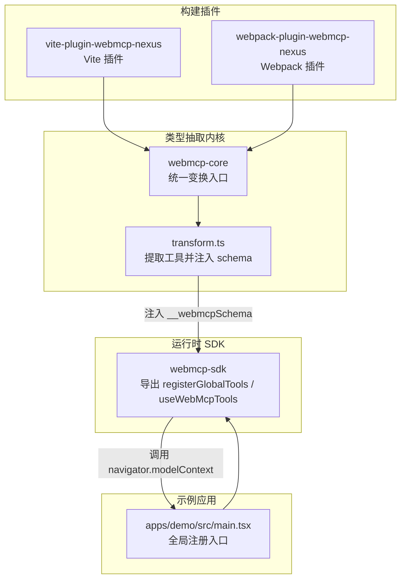
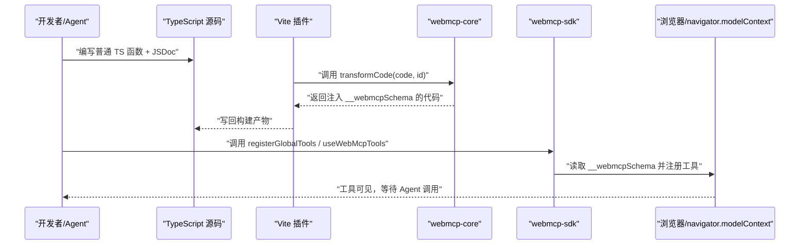
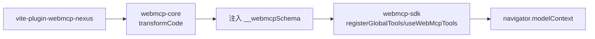

# AI 编码技能

<cite>
**本文引用的文件**
- [README.md](file://README.md)
- [package.json](file://package.json)
- [skill/SKILL.md](file://skill/SKILL.md)
- [packages/webmcp-core/src/index.ts](file://packages/webmcp-core/src/index.ts)
- [packages/webmcp-core/src/transform.ts](file://packages/webmcp-core/src/transform.ts)
- [packages/webmcp-sdk/src/index.ts](file://packages/webmcp-sdk/src/index.ts)
- [packages/webmcp-sdk/src/registerGlobalTools.ts](file://packages/webmcp-sdk/src/registerGlobalTools.ts)
- [packages/webmcp-sdk/src/useWebMcpTools.ts](file://packages/webmcp-sdk/src/useWebMcpTools.ts)
- [packages/vite-plugin-webmcp/src/index.ts](file://packages/vite-plugin-webmcp/src/index.ts)
- [apps/demo/src/main.tsx](file://apps/demo/src/main.tsx)
</cite>

## 目录
1. [简介](#简介)
2. [项目结构](#项目结构)
3. [核心组件](#核心组件)
4. [架构总览](#架构总览)
5. [详细组件分析](#详细组件分析)
6. [依赖关系分析](#依赖关系分析)
7. [性能考量](#性能考量)
8. [故障排查指南](#故障排查指南)
9. [结论](#结论)
10. [附录](#附录)

## 简介
本技能文档面向 AI 编码 Agent，帮助你在不改动任何业务逻辑的前提下，将现有业务函数快速改造为 WebMCP 工具。你只需遵循严格的函数签名、JSDoc 注释与 TypeScript 类型约束，即可让任意 MCP 客户端（如 Claude Code、Cursor、VS Code 等）识别并调用你的函数。同时，文档提供零风险改造流程、触发词、操作步骤与验证方法，并给出正反对照示例与最佳实践。

## 项目结构
该项目采用 monorepo 结构，核心能力由“运行时 SDK + 构建插件 + 类型抽取内核”三部分组成，Demo 应用展示了全局与组件级工具注册的完整用法。

图表来源
- [packages/webmcp-sdk/src/index.ts:1-5](file://packages/webmcp-sdk/src/index.ts#L1-L5)
- [packages/vite-plugin-webmcp/src/index.ts:1-102](file://packages/vite-plugin-webmcp/src/index.ts#L1-L102)
- [packages/webmcp-core/src/index.ts:1-11](file://packages/webmcp-core/src/index.ts#L1-L11)
- [packages/webmcp-core/src/transform.ts:1-79](file://packages/webmcp-core/src/transform.ts#L1-L79)
- [apps/demo/src/main.tsx:1-15](file://apps/demo/src/main.tsx#L1-L15)

章节来源
- [README.md:76-99](file://README.md#L76-L99)
- [package.json:1-38](file://package.json#L1-L38)

## 核心组件
- 运行时 SDK（webmcp-sdk）
  - 提供两个 API：registerGlobalTools（应用级一次性注册）、useWebMcpTools（组件/路由级生命周期注册）。
  - 在浏览器环境中通过 navigator.modelContext 完成工具注册；在 SSR 或无宿主环境自动 no-op。
- 构建插件（vite-plugin-webmcp-nexus / webpack-plugin-webmcp-nexus）
  - 在构建时扫描包含注册调用的源文件，向上追踪工具函数定义，提取 JSDoc 与 TS 类型，注入 __webmcpSchema 字段。
- 类型抽取内核（webmcp-core）
  - 提供 transformCode 统一入口，负责检测注册调用、提取工具、生成注入代码并插入到首个注册调用之前。
- 示例应用（apps/demo）
  - 展示全局工具注册入口与导航工具注册的实际用法。

章节来源
- [packages/webmcp-sdk/src/registerGlobalTools.ts:11-68](file://packages/webmcp-sdk/src/registerGlobalTools.ts#L11-L68)
- [packages/webmcp-sdk/src/useWebMcpTools.ts:28-136](file://packages/webmcp-sdk/src/useWebMcpTools.ts#L28-L136)
- [packages/vite-plugin-webmcp/src/index.ts:39-102](file://packages/vite-plugin-webmcp/src/index.ts#L39-L102)
- [packages/webmcp-core/src/transform.ts:31-79](file://packages/webmcp-core/src/transform.ts#L31-L79)
- [apps/demo/src/main.tsx:1-15](file://apps/demo/src/main.tsx#L1-L15)

## 架构总览
下面的时序图展示了从“编写函数 + 添加注释”到“Agent 调用”的完整链路：构建期抽取类型与注释生成 schema，运行期 SDK 读取 schema 并注册到 navigator.modelContext，最终由 MCP 客户端调用。

图表来源
- [packages/vite-plugin-webmcp/src/index.ts:55-97](file://packages/vite-plugin-webmcp/src/index.ts#L55-L97)
- [packages/webmcp-core/src/transform.ts:31-79](file://packages/webmcp-core/src/transform.ts#L31-L79)
- [packages/webmcp-sdk/src/registerGlobalTools.ts:26-67](file://packages/webmcp-sdk/src/registerGlobalTools.ts#L26-L67)
- [packages/webmcp-sdk/src/useWebMcpTools.ts:85-134](file://packages/webmcp-sdk/src/useWebMcpTools.ts#L85-L134)

## 详细组件分析

### 函数签名与类型约束（MUST/SHOULD/MAY）
- MUST（违反将导致无法注册或 schema 被污染）
  - 工具函数必须“可被追踪”：作为对象字面量属性传入注册，或在 import * as 模块中作为具名导出（避免 export default 导致工具名被解析为 "default"）。
  - 工具函数必须接受“单一对象类型”参数（命名 interface / type alias / 内联对象字面量），禁止原始类型、数组、any/unknown、泛型。
- SHOULD（影响 LLM 理解，但不阻止注册）
  - 函数有一行 JSDoc 描述；参数字段均有 JSDoc 描述；只读工具在函数 JSDoc 追加 @readonly。
- MAY（风格建议）
  - 工具函数写成 async 或返回 Promise；使用命名导出（对象字面量场景不强制）。

章节来源
- [skill/SKILL.md:19-48](file://skill/SKILL.md#L19-L48)
- [skill/SKILL.md:27-46](file://skill/SKILL.md#L27-L46)

### JSDoc 与注释规则
- 仅 /** ... */ 块注释会被提取为 description；行注释 // 与单星号块注释不会被识别。
- 函数体内、模块头、TODO、实现细节等位置的注释不影响提取，可自由使用 // 或 /* */。

章节来源
- [skill/SKILL.md:234-252](file://skill/SKILL.md#L234-L252)

### 参数类型支持矩阵
- 支持：string/number/boolean、字面量联合、可选字段、数组、嵌套对象（最多 3 层）、Date（建议传 ISO 字符串并在注释说明）。
- 不支持：泛型参数、any/unknown（any 会降级为 string）、交叉类型（建议扁平化）、enum（建议改用字面量联合）。

章节来源
- [skill/SKILL.md:219-233](file://skill/SKILL.md#L219-L233)

### 零风险改造流程（核心）
- 改造红线
  - 可以改：函数签名（参数合并为对象）、TS 类型声明、JSDoc、export default 改为命名导出。
  - 绝对不要改：函数体内的业务逻辑、控制流、错误处理、返回值结构、外部副作用、第三方 API 调用、变量命名（参数名变化除外）。
  - 不要引入新依赖：JSDoc 描述必须基于对现有行为的观察。
- 改造决策流程
  - 若参数不是单一对象：合并为 { a, b, c }，函数体内部引用保持原名（用对象解构）；原始类型包一层对象；any/unknown 具化为 interface；泛型参数具化或放弃改造。
  - 导出方式：命名导出或对象字面量注册均可；仅 import * 场景下避免 export default。
  - 补 JSDoc：函数一句话描述、字段逐条描述、只读语义加 @readonly。
  - 检查调用点：若参数形式改变，必须 grep 所有调用点同步修改。
- 验证步骤
  - Diff 审查：函数体（除参数解构引入外）与原版一致。
  - 调用点审查：确保所有调用点已更新；tsc --noEmit 无新增类型错误。
  - Schema 审查：构建产物中目标函数带有 __webmcpSchema，inputSchema.properties 不包含原型链污染字段。
  - 行为回归：若有单测跑一遍；若无单测，至少在本地把涉及页面点一遍。

章节来源
- [skill/SKILL.md:284-292](file://skill/SKILL.md#L284-L292)
- [skill/SKILL.md:293-318](file://skill/SKILL.md#L293-L318)
- [skill/SKILL.md:485-491](file://skill/SKILL.md#L485-L491)

### 正反对照示例（摘自技能文档）
- 位置参数 → 对象参数：将多个位置参数合并为对象参数，函数体保持不变，调用点同步更新。
- 原始类型参数 → 对象参数：为原始类型参数增加一层对象封装。
- any/unknown → 具化类型：定义具名接口并补全字段注释，不改变实现。
- export default → 命名导出：仅在 import * 场景下需要，对象字面量注册可保留 default。
- 补 JSDoc：为已有签名补全注释，零改动业务逻辑。

章节来源
- [skill/SKILL.md:320-484](file://skill/SKILL.md#L320-L484)

### 注册 API 用法
- registerGlobalTools（应用级）
  - 签名：接收一个或多个 Record<string, Function> 对象。
  - 用法：在应用入口文件调用一次，批量注册工具。
  - 行为：仅在浏览器环境且 navigator.modelContext 存在时注册；SSR/无宿主环境自动 no-op。
- useWebMcpTools（组件/路由级）
  - 签名：接收一个或多个 Record<string, Function> 对象。
  - 生命周期：组件挂载注册，卸载自动注销；内部通过 useRef 解决闭包陷阱。
  - HMR 友好：schema 变更时自动重新注册。

章节来源
- [packages/webmcp-sdk/src/registerGlobalTools.ts:25-67](file://packages/webmcp-sdk/src/registerGlobalTools.ts#L25-L67)
- [packages/webmcp-sdk/src/useWebMcpTools.ts:46-136](file://packages/webmcp-sdk/src/useWebMcpTools.ts#L46-L136)

### 构建插件与类型抽取
- Vite 插件
  - 通过 transform hook 委托 webmcp-core 的 transformCode。
  - 支持 include 与 alias 配置，自动合并 Vite 的 resolve.alias。
- 类型抽取内核
  - transformCode：检测是否包含注册调用，提取工具信息，生成注入代码并插入到首个注册调用之前。
  - 生成注入代码：根据 description、properties、readOnly 生成 __webmcpSchema 注入代码。

章节来源
- [packages/vite-plugin-webmcp/src/index.ts:39-102](file://packages/vite-plugin-webmcp/src/index.ts#L39-L102)
- [packages/webmcp-core/src/transform.ts:31-79](file://packages/webmcp-core/src/transform.ts#L31-L79)

### 示例应用中的注册入口
- Demo 应用在入口文件调用 registerGlobalTools(navigation) 完成全局工具注册，展示“对象字面量 + import *”的推荐写法。

章节来源
- [apps/demo/src/main.tsx:1-15](file://apps/demo/src/main.tsx#L1-L15)

## 依赖关系分析
- SDK 依赖 navigator.modelContext（浏览器原生 API 或内置 polyfill）。
- 构建插件依赖 webmcp-core 的类型抽取与注入逻辑。
- 运行时注册过程：SDK 读取函数上的 __webmcpSchema 字段，构造工具描述与输入 schema，注册到 navigator.modelContext。

图表来源
- [packages/vite-plugin-webmcp/src/index.ts:10-10](file://packages/vite-plugin-webmcp/src/index.ts#L10-L10)
- [packages/webmcp-core/src/transform.ts:54-63](file://packages/webmcp-core/src/transform.ts#L54-L63)
- [packages/webmcp-sdk/src/registerGlobalTools.ts:42-56](file://packages/webmcp-sdk/src/registerGlobalTools.ts#L42-L56)
- [packages/webmcp-sdk/src/useWebMcpTools.ts:95-112](file://packages/webmcp-sdk/src/useWebMcpTools.ts#L95-L112)

## 性能考量
- 构建时抽取：基于 ts-morph 的静态分析，函数签名 = JSON Schema，无运行时开销。
- HMR 友好：组件级工具通过 useRef 与版本计数器在 schema 变更时自动重新注册，避免不必要的抖动。
- 作用域隔离：组件卸载时自动注销，避免“幽灵工具”污染上下文。

章节来源
- [README.md:68-74](file://README.md#L68-L74)
- [packages/webmcp-sdk/src/useWebMcpTools.ts:17-26](file://packages/webmcp-sdk/src/useWebMcpTools.ts#L17-L26)

## 故障排查指南
- 工具不可见或调用失败
  - 检查 navigator.modelContext 是否存在（宿主环境支持）。
  - 检查构建产物中函数是否带有 __webmcpSchema。
  - 检查 inputSchema.properties 是否包含 length/charAt 等原型链字段（违反 MUST2）。
  - 检查函数描述是否为空（违反 SHOULD1）。
  - 确认入口已调用 registerGlobalTools；组件是否调用 useWebMcpTools。
  - 查看浏览器控制台是否有 WebMCP warning。
- 工具必须 async 吗
  - 不必须。SDK 外层会异步包装，同步函数也能工作，但 async 更直观。
- 返回值类型限制
  - 必须 JSON 可序列化（纯对象、数组、原始值），不支持 Map/Set/Date（建议转 ISO 字符串）、DOM 节点、函数。
- 参数类型导入
  - 可以 import 到其他文件；但不支持 node_modules 第三方类型与含泛型类型。抽取失败时改为同文件定义。

章节来源
- [skill/SKILL.md:641-682](file://skill/SKILL.md#L641-L682)

## 结论
通过严格的函数签名、JSDoc 与 TS 类型约束，结合构建时的类型抽取与 schema 注入，WebMCP Nexus 能够在零侵入的前提下，将任意业务函数转化为 MCP 工具。配合零风险改造流程与完善的验证步骤，AI 编码 Agent 可以安全地将现有函数改造成可被 LLM 调用的工具，显著提升开发效率与协作体验。

## 附录

### AI IDE（Claude Code、Cursor 等）Skill 安装与配置
- Claude Code
  - 项目级：将 skill/SKILL.md 复制到 .claude/skills/webmcp-nexus.md。
  - 用户级：将 skill/SKILL.md 复制到 ~/.claude/skills/webmcp-nexus.md。
- Cursor
  - 将 skill/SKILL.md 复制到 .cursor/rules/webmcp-nexus.mdc，或在设置中粘贴全文。
- 其他 IDE（Qoder/Windsurf 等）
  - 将 skill/SKILL.md 作为 Rule/Context 文档导入到 IDE 的 AI 配置中，触发词已写入 frontmatter 的 description 字段，主流 Agent 框架可自动按需加载。

章节来源
- [README.md:300-335](file://README.md#L300-L335)

### 自动化改造使用示例与效果
- 触发词示例
  - “把 apps/demo/src/store/TodoStore.tsx 里的 createTask 改造成 WebMCP 工具，注册到任务列表页。”
- Agent 将按技能文档流程自动完成：
  - 补齐 JSDoc、调整参数为对象形态、在对应组件挂载点调用 useWebMcpTools。
  - 不修改任何业务逻辑，仅动签名与注释，确保行为与原函数一致。

章节来源
- [README.md:336-341](file://README.md#L336-L341)
- [skill/SKILL.md:263-277](file://skill/SKILL.md#L263-L277)