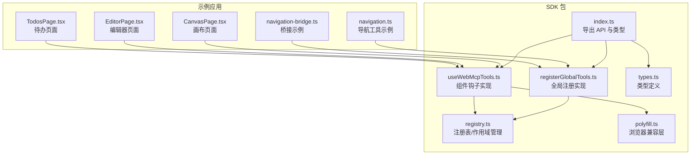
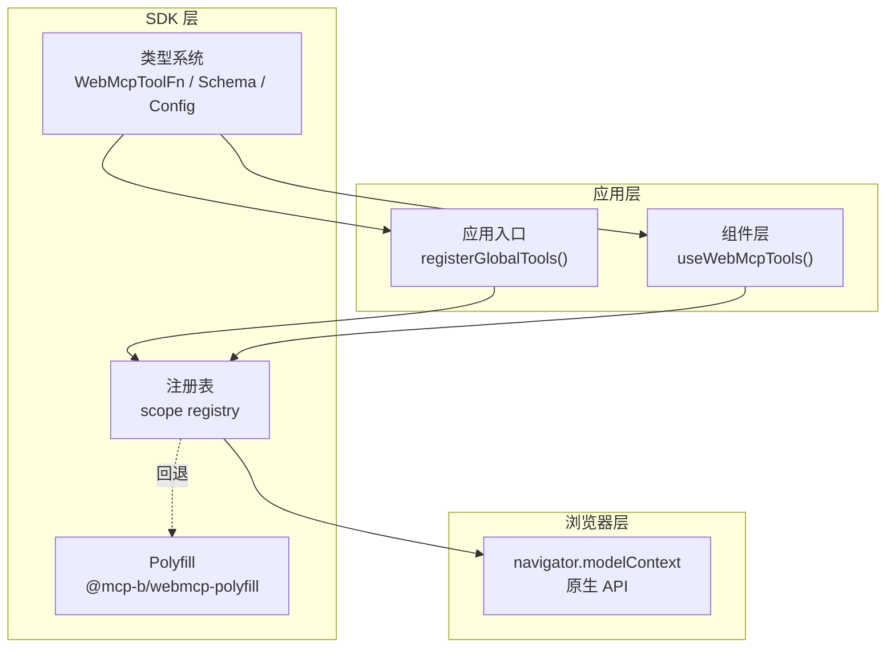
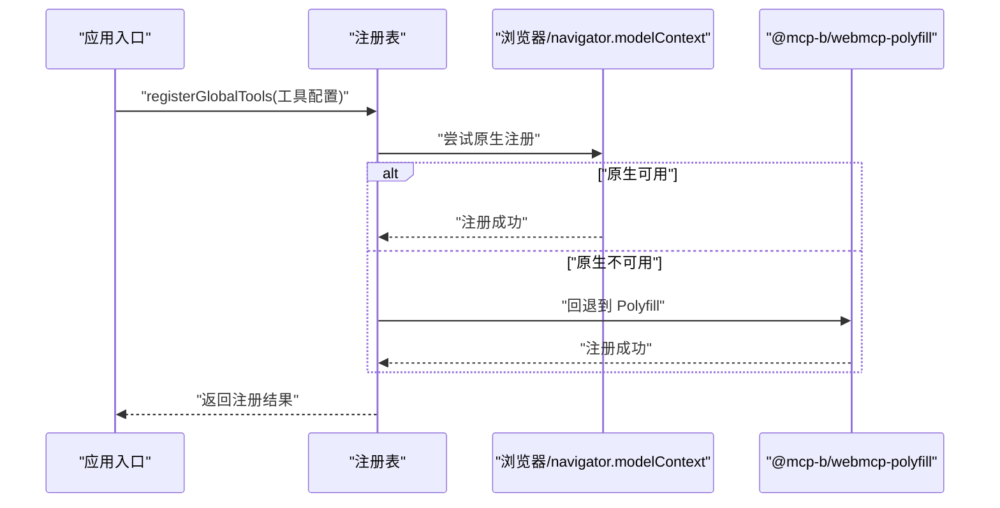
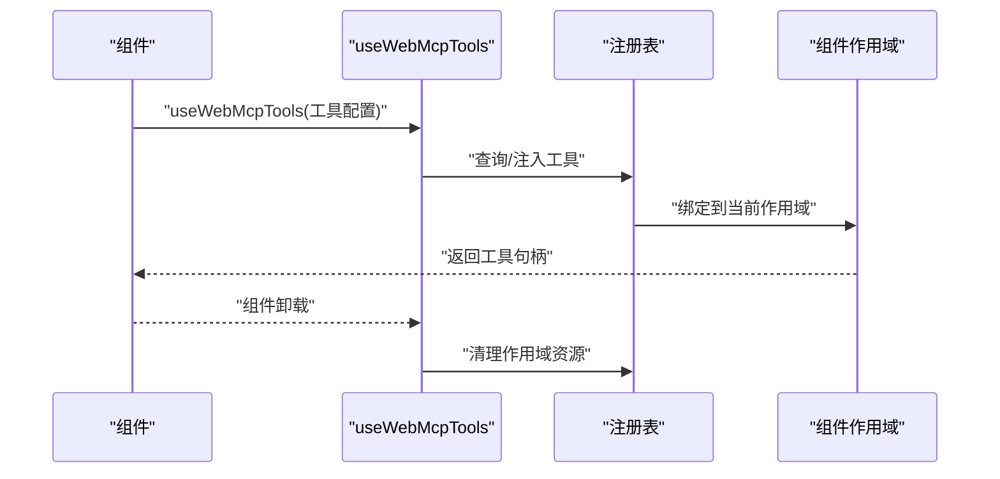
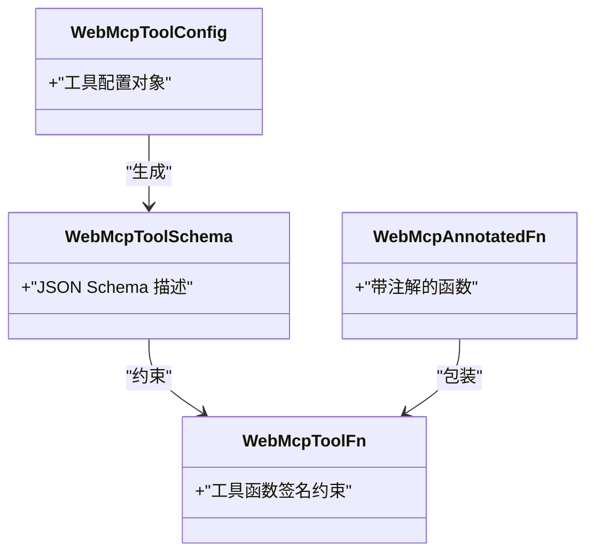
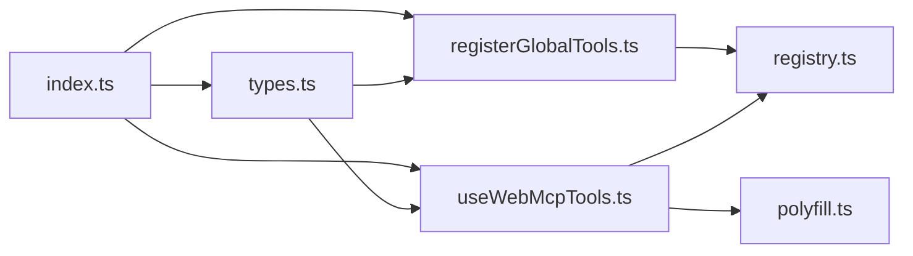

# SDK API 参考

<cite>
**本文档引用的文件**
- [packages/webmcp-sdk/src/index.ts](file://packages/webmcp-sdk/src/index.ts)
- [packages/webmcp-sdk/src/registerGlobalTools.ts](file://packages/webmcp-sdk/src/registerGlobalTools.ts)
- [packages/webmcp-sdk/src/useWebMcpTools.ts](file://packages/webmcp-sdk/src/useWebMcpTools.ts)
- [packages/webmcp-sdk/src/types.ts](file://packages/webmcp-sdk/src/types.ts)
- [packages/webmcp-sdk/src/registry.ts](file://packages/webmcp-sdk/src/registry.ts)
- [packages/webmcp-sdk/src/polyfill.ts](file://packages/webmcp-sdk/src/polyfill.ts)
- [packages/webmcp-sdk/README.md](file://packages/webmcp-sdk/README.md)
- [apps/demo/src/tools/navigation.ts](file://apps/demo/src/tools/navigation.ts)
- [apps/demo/src/tools/navigation-bridge.ts](file://apps/demo/src/tools/navigation-bridge.ts)
- [apps/demo/src/store/CanvasStore.tsx](file://apps/demo/src/store/CanvasStore.tsx)
- [apps/demo/src/store/EditorStore.tsx](file://apps/demo/src/store/EditorStore.tsx)
- [apps/demo/src/store/TodoStore.tsx](file://apps/demo/src/store/TodoStore.tsx)
- [apps/demo/src/pages/CanvasPage.tsx](file://apps/demo/src/pages/CanvasPage.tsx)
- [apps/demo/src/pages/EditorPage.tsx](file://apps/demo/src/pages/EditorPage.tsx)
- [apps/demo/src/pages/TodosPage.tsx](file://apps/demo/src/pages/TodosPage.tsx)
- [README.md](file://README.md)
</cite>

## 目录
1. [简介](#简介)
2. [项目结构](#项目结构)
3. [核心组件](#核心组件)
4. [架构总览](#架构总览)
5. [详细组件分析](#详细组件分析)
6. [依赖分析](#依赖分析)
7. [性能考虑](#性能考虑)
8. [故障排除指南](#故障排除指南)
9. [结论](#结论)
10. [附录](#附录)

## 简介
本参考文档面向 webmcp-nexus SDK 的使用者，系统化阐述两个核心 API 的设计目标、类型定义、参数规范、错误处理、生命周期与作用域管理，并给出与浏览器原生 navigator.modelContext 的关系说明及兼容策略。重点覆盖：
- registerGlobalTools：全局工具注册入口，负责在应用启动时一次性注入工具集合
- useWebMcpTools：组件级工具钩子，按需在组件生命周期内挂载/卸载工具

## 项目结构
webmcp-nexus 采用多包工作区组织，SDK 位于 packages/webmcp-sdk，核心导出包括两个 API 与类型声明。根仓库 README 提供了整体概览与核心特性说明。

图表来源
- [packages/webmcp-sdk/src/index.ts:1-4](file://packages/webmcp-sdk/src/index.ts#L1-L4)
- [packages/webmcp-sdk/src/registerGlobalTools.ts](file://packages/webmcp-sdk/src/registerGlobalTools.ts)
- [packages/webmcp-sdk/src/useWebMcpTools.ts](file://packages/webmcp-sdk/src/useWebMcpTools.ts)
- [packages/webmcp-sdk/src/types.ts](file://packages/webmcp-sdk/src/types.ts)
- [packages/webmcp-sdk/src/registry.ts](file://packages/webmcp-sdk/src/registry.ts)
- [packages/webmcp-sdk/src/polyfill.ts](file://packages/webmcp-sdk/src/polyfill.ts)
- [apps/demo/src/tools/navigation.ts](file://apps/demo/src/tools/navigation.ts)
- [apps/demo/src/tools/navigation-bridge.ts](file://apps/demo/src/tools/navigation-bridge.ts)
- [apps/demo/src/pages/CanvasPage.tsx](file://apps/demo/src/pages/CanvasPage.tsx)
- [apps/demo/src/pages/EditorPage.tsx](file://apps/demo/src/pages/EditorPage.tsx)
- [apps/demo/src/pages/TodosPage.tsx](file://apps/demo/src/pages/TodosPage.tsx)

章节来源
- [README.md:65-89](file://README.md#L65-L89)
- [packages/webmcp-sdk/src/index.ts:1-4](file://packages/webmcp-sdk/src/index.ts#L1-L4)

## 核心组件
本节概述两个核心 API 的职责边界与交互关系：
- registerGlobalTools：应用级初始化，负责将一组工具一次性注册到全局注册表中，建立与浏览器模型上下文的连接（在支持的环境中）。
- useWebMcpTools：组件级生命周期钩子，根据组件挂载/卸载动态地将工具注入到当前组件作用域，确保“幽灵工具”不会污染全局上下文。

两者共同构成“三级作用域”能力：全局工具（应用启动时）、组件级工具（按需注入）、会话级工具（由上层框架或调用方管理）。SDK 在开发期通过构建插件将 TS 类型转换为 JSON Schema，运行时通过注册表进行冲突检测与隔离。

章节来源
- [packages/webmcp-sdk/src/registerGlobalTools.ts](file://packages/webmcp-sdk/src/registerGlobalTools.ts)
- [packages/webmcp-sdk/src/useWebMcpTools.ts](file://packages/webmcp-sdk/src/useWebMcpTools.ts)
- [packages/webmcp-sdk/src/registry.ts](file://packages/webmcp-sdk/src/registry.ts)
- [README.md:65-89](file://README.md#L65-L89)

## 架构总览
下图展示了 SDK 的关键模块及其交互关系，以及与浏览器原生 navigator.modelContext 的集成点。

图表来源
- [packages/webmcp-sdk/src/registerGlobalTools.ts](file://packages/webmcp-sdk/src/registerGlobalTools.ts)
- [packages/webmcp-sdk/src/useWebMcpTools.ts](file://packages/webmcp-sdk/src/useWebMcpTools.ts)
- [packages/webmcp-sdk/src/registry.ts](file://packages/webmcp-sdk/src/registry.ts)
- [packages/webmcp-sdk/src/polyfill.ts](file://packages/webmcp-sdk/src/polyfill.ts)
- [packages/webmcp-sdk/src/types.ts](file://packages/webmcp-sdk/src/types.ts)

## 详细组件分析

### registerGlobalTools API
- 设计目标：在应用启动阶段完成全局工具注册，建立与浏览器模型上下文的连接，确保后续组件可直接使用已注册的工具。
- 典型调用位置：应用入口（如 main.tsx 或 App.tsx），通常仅调用一次。
- 参数与返回值：
  - 参数：工具配置对象数组（包含工具名称、函数签名、描述等元信息），这些元信息在构建期被转换为 JSON Schema。
  - 返回值：无（或返回注册结果状态，用于诊断）。
- 生命周期与作用域：
  - 注册发生在应用启动时，工具进入全局注册表，作用域为全局。
  - 若同名工具重复注册，SDK 将发出警告但不中断，注销时严格隔离以避免污染。
- 错误处理：
  - 工具名称冲突：记录冲突并继续执行，建议在开发期修复。
  - 浏览器不支持：自动回退至 polyfill 模式，保证功能可用。
- 兼容性：
  - Chrome 146+：优先使用原生 navigator.modelContext。
  - 其他环境：自动启用 @mcp-b/webmcp-polyfill，保持跨浏览器一致性。

图表来源
- [packages/webmcp-sdk/src/registerGlobalTools.ts](file://packages/webmcp-sdk/src/registerGlobalTools.ts)
- [packages/webmcp-sdk/src/registry.ts](file://packages/webmcp-sdk/src/registry.ts)
- [packages/webmcp-sdk/src/polyfill.ts](file://packages/webmcp-sdk/src/polyfill.ts)

章节来源
- [packages/webmcp-sdk/src/registerGlobalTools.ts](file://packages/webmcp-sdk/src/registerGlobalTools.ts)
- [packages/webmcp-sdk/src/registry.ts](file://packages/webmcp-sdk/src/registry.ts)
- [packages/webmcp-sdk/src/polyfill.ts](file://packages/webmcp-sdk/src/polyfill.ts)
- [README.md:65-89](file://README.md#L65-L89)

### useWebMcpTools API
- 设计目标：在组件生命周期内动态注入工具，确保工具仅在组件存在期间生效，避免“幽灵工具”污染全局上下文。
- 典型调用位置：各业务组件（如 CanvasPage、EditorPage、TodosPage）中按需调用。
- 参数与返回值：
  - 参数：工具配置数组（与全局注册一致的类型体系），SDK 会在组件挂载时注入，卸载时清理。
  - 返回值：返回可用于调用的工具句柄或代理对象，供组件内部使用。
- 生命周期与作用域：
  - 挂载：组件挂载时注入工具，绑定当前组件作用域。
  - 卸载：组件卸载时自动清理，释放资源并解除绑定。
  - 多实例：同一组件的多个实例互不影响，作用域隔离。
- 错误处理：
  - 工具未注册：在组件内调用前应确保已在全局或当前作用域注册。
  - 注入失败：抛出明确的错误信息，便于定位问题。
- 兼容性：
  - 与 registerGlobalTools 一致，自动选择原生或 polyfill。

图表来源
- [packages/webmcp-sdk/src/useWebMcpTools.ts](file://packages/webmcp-sdk/src/useWebMcpTools.ts)
- [packages/webmcp-sdk/src/registry.ts](file://packages/webmcp-sdk/src/registry.ts)

章节来源
- [packages/webmcp-sdk/src/useWebMcpTools.ts](file://packages/webmcp-sdk/src/useWebMcpTools.ts)
- [packages/webmcp-sdk/src/registry.ts](file://packages/webmcp-sdk/src/registry.ts)
- [README.md:65-89](file://README.md#L65-L89)

### 类型系统与数据模型
SDK 的类型系统基于 TypeScript 类型在构建期转换为 JSON Schema，确保运行时与编译期的一致性。核心类型包括：
- WebMcpToolFn：工具函数的类型约束
- WebMcpToolSchema：工具的 JSON Schema 描述
- WebMcpAnnotatedFn：带注解的工具函数
- WebMcpToolConfig：工具配置对象

图表来源
- [packages/webmcp-sdk/src/types.ts](file://packages/webmcp-sdk/src/types.ts)

章节来源
- [packages/webmcp-sdk/src/types.ts](file://packages/webmcp-sdk/src/types.ts)

### 与浏览器原生 navigator.modelContext 的关系与兼容性
- 关系：SDK 通过 navigator.modelContext 与浏览器原生模型上下文进行对接，实现工具的注册与调用。
- 兼容性：
  - Chrome 146+：优先使用原生 API，性能最优。
  - 其他环境：自动启用 @mcp-b/webmcp-polyfill，保证功能一致。
- 降级策略：当原生不可用时，SDK 自动切换到 polyfill 模式，确保工具仍可注册与调用。

章节来源
- [README.md:65-89](file://README.md#L65-L89)
- [packages/webmcp-sdk/src/polyfill.ts](file://packages/webmcp-sdk/src/polyfill.ts)

### 使用场景与最佳实践
- 全局工具注册（registerGlobalTools）
  - 在应用入口处调用，传入所有需要的工具配置，确保应用启动后即可使用。
  - 示例参考：导航工具的注册与桥接模式。
- 组件级工具注入（useWebMcpTools）
  - 在具体页面组件中按需注入工具，确保工具仅在该组件生命周期内生效。
  - 示例参考：画布页面、编辑器页面、待办页面中的工具使用。

章节来源
- [apps/demo/src/tools/navigation.ts](file://apps/demo/src/tools/navigation.ts)
- [apps/demo/src/tools/navigation-bridge.ts](file://apps/demo/src/tools/navigation-bridge.ts)
- [apps/demo/src/pages/CanvasPage.tsx](file://apps/demo/src/pages/CanvasPage.tsx)
- [apps/demo/src/pages/EditorPage.tsx](file://apps/demo/src/pages/EditorPage.tsx)
- [apps/demo/src/pages/TodosPage.tsx](file://apps/demo/src/pages/TodosPage.tsx)

## 依赖分析
SDK 的内部依赖关系如下：

图表来源
- [packages/webmcp-sdk/src/index.ts:1-4](file://packages/webmcp-sdk/src/index.ts#L1-L4)
- [packages/webmcp-sdk/src/registerGlobalTools.ts](file://packages/webmcp-sdk/src/registerGlobalTools.ts)
- [packages/webmcp-sdk/src/useWebMcpTools.ts](file://packages/webmcp-sdk/src/useWebMcpTools.ts)
- [packages/webmcp-sdk/src/types.ts](file://packages/webmcp-sdk/src/types.ts)
- [packages/webmcp-sdk/src/registry.ts](file://packages/webmcp-sdk/src/registry.ts)
- [packages/webmcp-sdk/src/polyfill.ts](file://packages/webmcp-sdk/src/polyfill.ts)

章节来源
- [packages/webmcp-sdk/src/index.ts:1-4](file://packages/webmcp-sdk/src/index.ts#L1-L4)

## 性能考虑
- 构建期类型反推：通过 ts-morph 静态分析生成 JSON Schema，运行时零开销。
- HMR 友好：开发期修改函数签名后，工具 schema 自动重新注册，无需手动刷新。
- 作用域隔离：组件级工具随生命周期挂载/卸载，避免常驻内存造成的资源浪费。
- 兼容层优化：原生可用时走原生路径，不可用时自动回退 polyfill，保证一致体验。

章节来源
- [README.md:65-89](file://README.md#L65-L89)

## 故障排除指南
- 工具名称冲突
  - 现象：控制台出现冲突警告。
  - 处理：在开发期统一工具命名，避免重复注册。
- 工具未注册导致调用失败
  - 现象：组件内调用工具时报错。
  - 处理：确认工具已在全局或当前作用域注册；检查注册顺序与生命周期。
- 浏览器不支持原生 API
  - 现象：功能受限或异常。
  - 处理：SDK 自动回退 polyfill，若仍异常，检查 polyfill 初始化与网络环境。
- 组件卸载后仍有残留
  - 现象：组件卸载后资源未释放。
  - 处理：确保使用 useWebMcpTools 并遵循其生命周期管理；检查作用域隔离是否正确。

章节来源
- [packages/webmcp-sdk/src/registry.ts](file://packages/webmcp-sdk/src/registry.ts)
- [packages/webmcp-sdk/src/useWebMcpTools.ts](file://packages/webmcp-sdk/src/useWebMcpTools.ts)
- [README.md:65-89](file://README.md#L65-L89)

## 结论
webmcp-nexus SDK 通过 registerGlobalTools 与 useWebMcpTools 两个 API 实现了从应用级到组件级的完整工具生命周期管理，结合构建期类型反推与运行时注册表，提供了高性能、可维护且跨浏览器兼容的工具集成方案。配合浏览器原生 navigator.modelContext 与 polyfill，SDK 在现代浏览器与非原生环境下均能稳定运行。

## 附录
- 快速开始与示例参考：导航工具、画布工具、编辑器工具与待办工具的实现与使用。
- 版本与兼容性：Chrome 146+ 原生支持，其他环境自动启用 polyfill。

章节来源
- [apps/demo/src/tools/navigation.ts](file://apps/demo/src/tools/navigation.ts)
- [apps/demo/src/tools/navigation-bridge.ts](file://apps/demo/src/tools/navigation-bridge.ts)
- [apps/demo/src/pages/CanvasPage.tsx](file://apps/demo/src/pages/CanvasPage.tsx)
- [apps/demo/src/pages/EditorPage.tsx](file://apps/demo/src/pages/EditorPage.tsx)
- [apps/demo/src/pages/TodosPage.tsx](file://apps/demo/src/pages/TodosPage.tsx)
- [README.md:65-89](file://README.md#L65-L89)