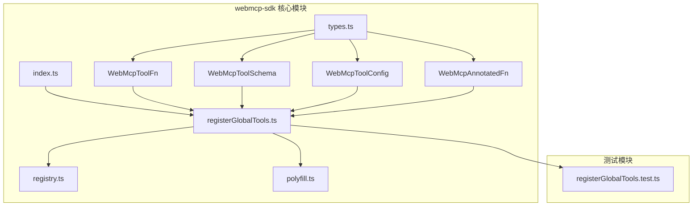
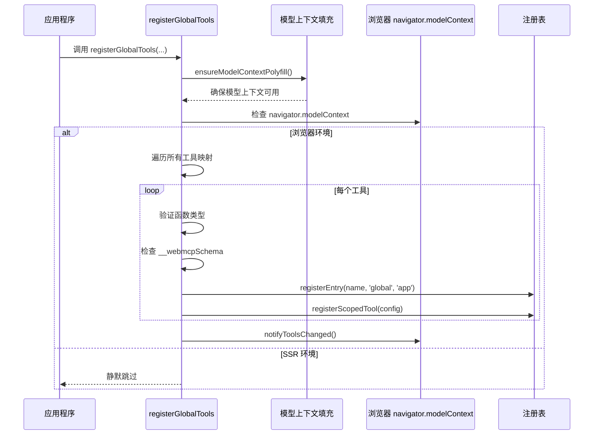
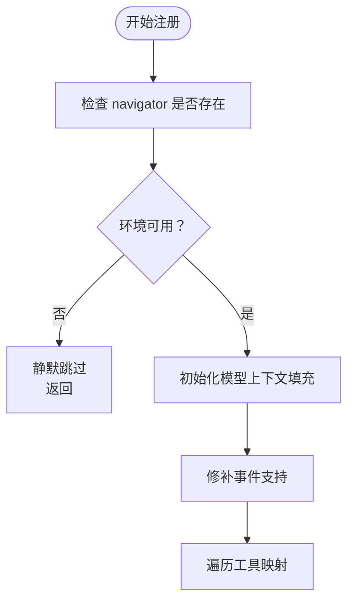
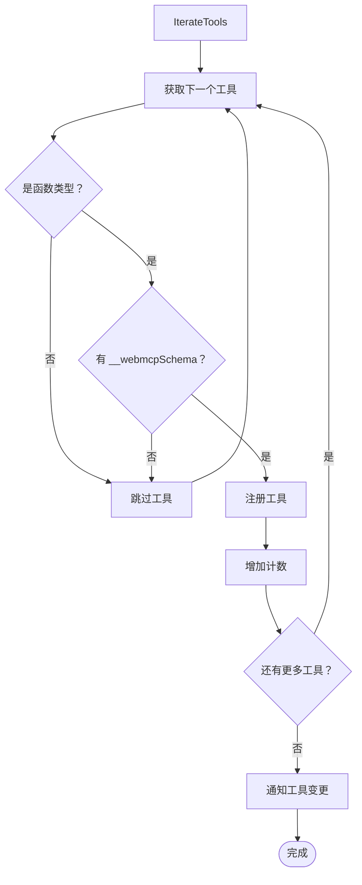
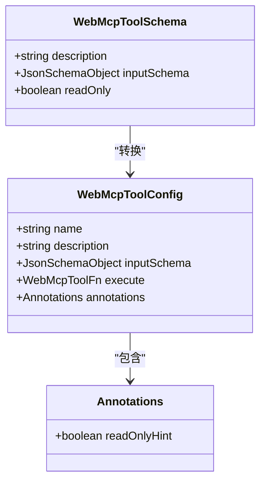
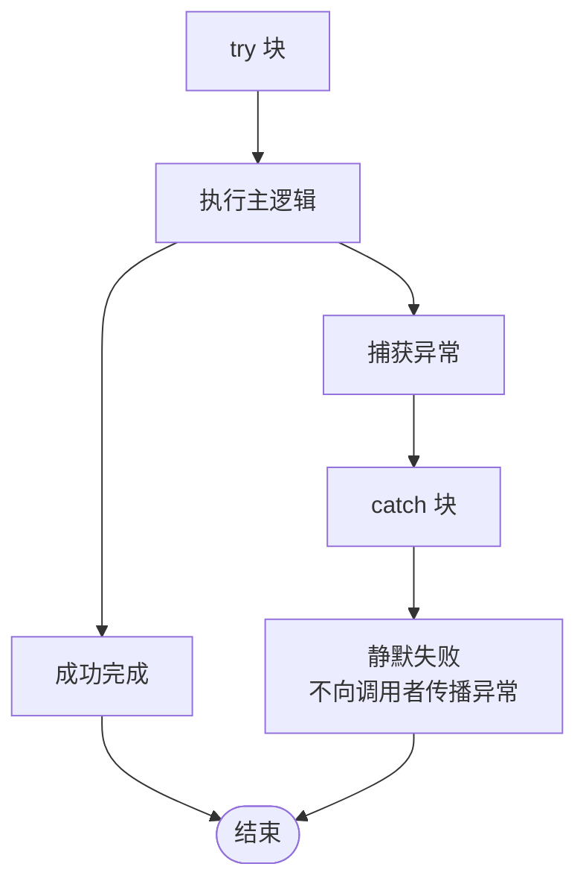
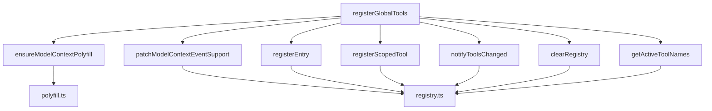
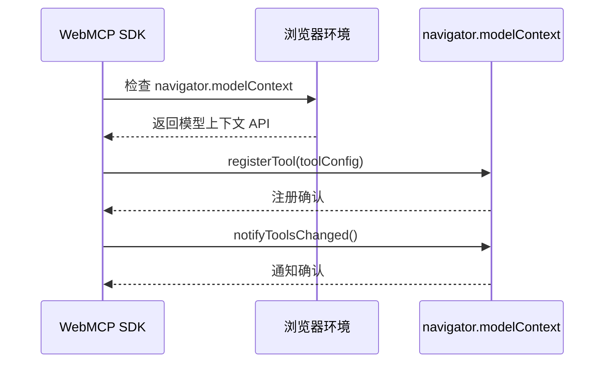

# registerGlobalTools API 文档

<cite>
**本文档引用的文件**
- [registerGlobalTools.ts](file://packages/webmcp-sdk/src/registerGlobalTools.ts)
- [index.ts](file://packages/webmcp-sdk/src/index.ts)
- [types.ts](file://packages/webmcp-sdk/src/types.ts)
- [registry.ts](file://packages/webmcp-sdk/src/registry.ts)
- [polyfill.ts](file://packages/webmcp-sdk/src/polyfill.ts)
- [registerGlobalTools.test.ts](file://packages/webmcp-sdk/src/__tests__/registerGlobalTools.test.ts)
</cite>

## 目录
1. [简介](#简介)
2. [项目结构](#项目结构)
3. [核心组件](#核心组件)
4. [架构概览](#架构概览)
5. [详细组件分析](#详细组件分析)
6. [依赖关系分析](#依赖关系分析)
7. [性能考虑](#性能考虑)
8. [故障排除指南](#故障排除指南)
9. [结论](#结论)

## 简介

`registerGlobalTools` 是 WebMCP SDK 提供的核心 API，用于将工具函数注册到全局作用域，使这些工具在整个应用程序中可用。该 API 支持批量注册多个工具函数，并与浏览器的 `navigator.modelContext` API 进行深度集成。

该 API 的主要特点包括：
- 支持可变参数，兼容多种工具函数组织方式
- 自动类型验证和 Schema 生成
- 与浏览器原生模型上下文 API 的无缝集成
- 完善的错误处理和降级机制
- SSR（服务端渲染）友好设计

## 项目结构

WebMCP SDK 采用模块化架构，核心文件分布如下：



**图表来源**
- [registerGlobalTools.ts:1-67](file://packages/webmcp-sdk/src/registerGlobalTools.ts#L1-L67)
- [index.ts:1-4](file://packages/webmcp-sdk/src/index.ts#L1-L4)
- [types.ts](file://packages/webmcp-sdk/src/types.ts)

**章节来源**
- [registerGlobalTools.ts:1-67](file://packages/webmcp-sdk/src/registerGlobalTools.ts#L1-L67)
- [index.ts:1-4](file://packages/webmcp-sdk/src/index.ts#L1-L4)

## 核心组件

### 函数签名和基本用法

`registerGlobalTools` 函数的基本签名如下：

```typescript
export function registerGlobalTools(...toolMaps: Record<string, Function>[]): void
```

该函数接受任意数量的工具映射对象作为参数，每个对象都包含工具名称到函数的映射关系。

### 类型定义

#### WebMcpToolFn 接口
```typescript
export type WebMcpToolFn = (input: unknown) => Promise<unknown>;
```
这是工具函数的标准类型定义，接受任意输入并返回 Promise 结果。

#### WebMcpToolSchema 接口
```typescript
export interface WebMcpToolSchema {
  description: string;
  inputSchema: JsonSchemaObject;
  readOnly?: boolean;
}
```
工具 Schema 定义了工具的元数据信息。

#### WebMcpToolConfig 接口
```typescript
export interface WebMcpToolConfig {
  name: string;
  description: string;
  inputSchema: JsonSchemaObject;
  execute: WebMcpToolFn;
  annotations: {
    readOnlyHint: boolean;
  };
}
```
工具配置接口，用于描述工具的完整配置信息。

#### WebMcpAnnotatedFn 类型
```typescript
export type WebMcpAnnotatedFn = Function & {
  __webmcpSchema?: WebMcpToolSchema;
};
```
带注解的函数类型，扩展了标准函数以包含 Schema 信息。

**章节来源**
- [types.ts](file://packages/webmcp-sdk/src/types.ts)

## 架构概览

`registerGlobalTools` API 的整体架构设计如下：



**图表来源**
- [registerGlobalTools.ts:26-67](file://packages/webmcp-sdk/src/registerGlobalTools.ts#L26-L67)
- [polyfill.ts](file://packages/webmcp-sdk/src/polyfill.ts)
- [registry.ts](file://packages/webmcp-sdk/src/registry.ts)

## 详细组件分析

### 注册流程详解

#### 步骤一：环境检测和初始化

API 首先确保模型上下文 Polyfill 可用，并检查浏览器环境：



**图表来源**
- [registerGlobalTools.ts:26-31](file://packages/webmcp-sdk/src/registerGlobalTools.ts#L26-L31)

#### 步骤二：工具验证和过滤

API 对每个工具进行严格的类型验证：



**图表来源**
- [registerGlobalTools.ts:37-59](file://packages/webmcp-sdk/src/registerGlobalTools.ts#L37-L59)

#### 步骤三：工具配置转换

API 将 Schema 转换为浏览器原生工具配置：



**图表来源**
- [registerGlobalTools.ts:47-56](file://packages/webmcp-sdk/src/registerGlobalTools.ts#L47-L56)
- [types.ts](file://packages/webmcp-sdk/src/types.ts)

### 错误处理机制

API 实现了多层次的错误处理：



**图表来源**
- [registerGlobalTools.ts:32-66](file://packages/webmcp-sdk/src/registerGlobalTools.ts#L32-L66)

**章节来源**
- [registerGlobalTools.ts:26-67](file://packages/webmcp-sdk/src/registerGlobalTools.ts#L26-L67)

## 依赖关系分析

### 内部依赖关系



**图表来源**
- [registerGlobalTools.ts:2-8](file://packages/webmcp-sdk/src/registerGlobalTools.ts#L2-L8)
- [registry.ts](file://packages/webmcp-sdk/src/registry.ts)
- [polyfill.ts](file://packages/webmcp-sdk/src/polyfill.ts)

### 外部依赖关系

API 主要依赖于浏览器的 `navigator.modelContext` API：



**图表来源**
- [registerGlobalTools.ts:28-33](file://packages/webmcp-sdk/src/registerGlobalTools.ts#L28-L33)

**章节来源**
- [registerGlobalTools.ts:2-8](file://packages/webmcp-sdk/src/registerGlobalTools.ts#L2-L8)

## 性能考虑

### 时间复杂度分析

- **总体时间复杂度**: O(n)，其中 n 是所有工具映射中工具函数的总数
- **空间复杂度**: O(n)，用于存储工具配置和状态信息

### 优化策略

1. **批量注册**: 支持一次性注册多个工具映射，减少 API 调用次数
2. **智能跳过**: 自动跳过无效的工具函数，避免不必要的处理
3. **条件注册**: 仅在浏览器环境中执行注册操作
4. **内存管理**: 使用 `clearRegistry` 清理注册表，防止内存泄漏

## 故障排除指南

### 常见问题和解决方案

#### 问题 1: 工具未显示在模型上下文中

**可能原因**:
- 工具函数缺少 `__webmcpSchema` 注解
- 工具函数不是有效的函数类型
- 浏览器环境不支持 `navigator.modelContext`

**解决方案**:
- 确保工具函数具有正确的 Schema 注解
- 验证工具函数的类型为 `Function`
- 检查浏览器兼容性

#### 问题 2: 注册过程中出现异常

**处理机制**:
API 在 `catch` 块中静默处理所有异常，不会向调用者传播错误

**调试建议**:
- 检查控制台是否有相关错误信息
- 验证工具函数的实现
- 确认浏览器模型上下文 API 可用

#### 问题 3: SSR 环境中的行为

**行为特征**:
在服务端渲染环境中，API 会静默跳过所有注册操作

**解决方案**:
- 在客户端代码中调用此 API
- 使用条件加载确保只在浏览器环境中执行

**章节来源**
- [registerGlobalTools.test.ts:47-137](file://packages/webmcp-sdk/src/__tests__/registerGlobalTools.test.ts#L47-L137)

## 结论

`registerGlobalTools` API 提供了一个强大而灵活的工具注册系统，具有以下优势：

1. **易用性**: 简洁的 API 设计，支持多种工具组织方式
2. **可靠性**: 完善的类型验证和错误处理机制
3. **兼容性**: 与浏览器原生 API 的无缝集成
4. **可维护性**: 清晰的模块化架构和全面的测试覆盖

该 API 为构建基于 WebMCP 的应用程序提供了坚实的基础，使得开发者能够轻松地将各种工具函数注册到全局作用域中，从而在整个应用中提供一致的工具访问体验。