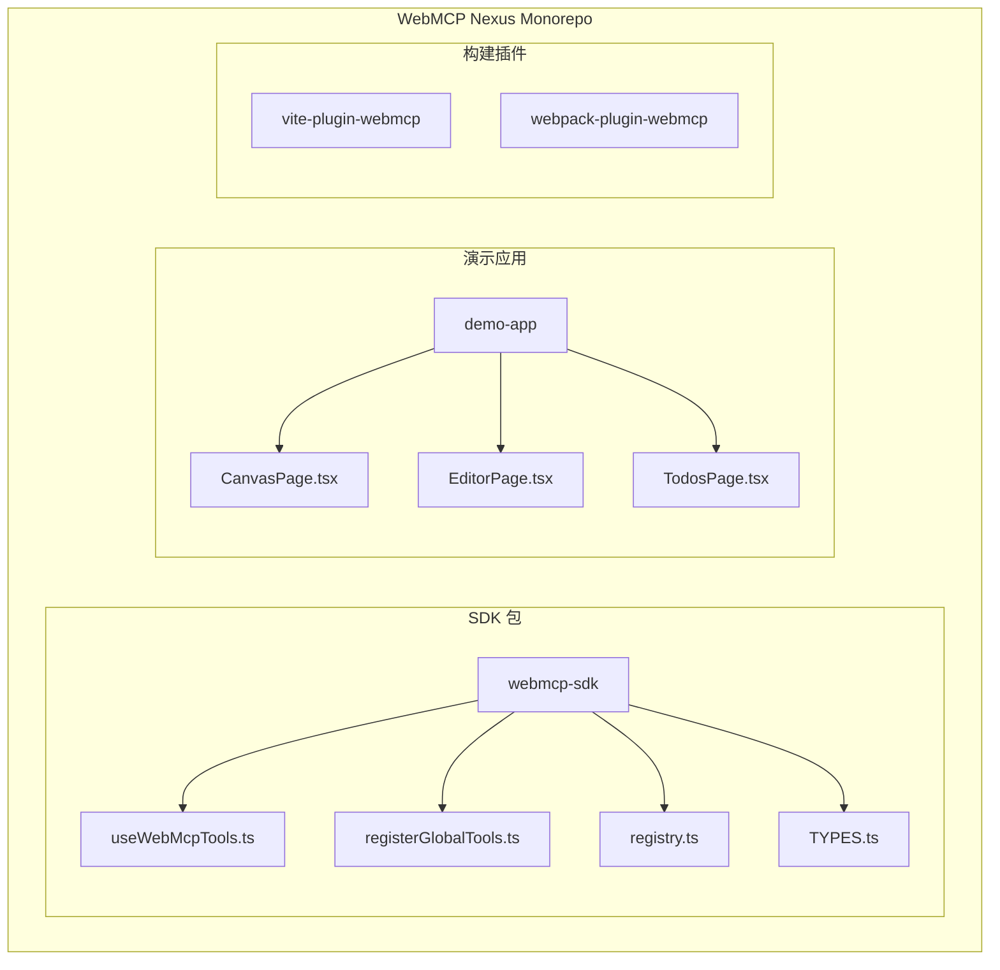
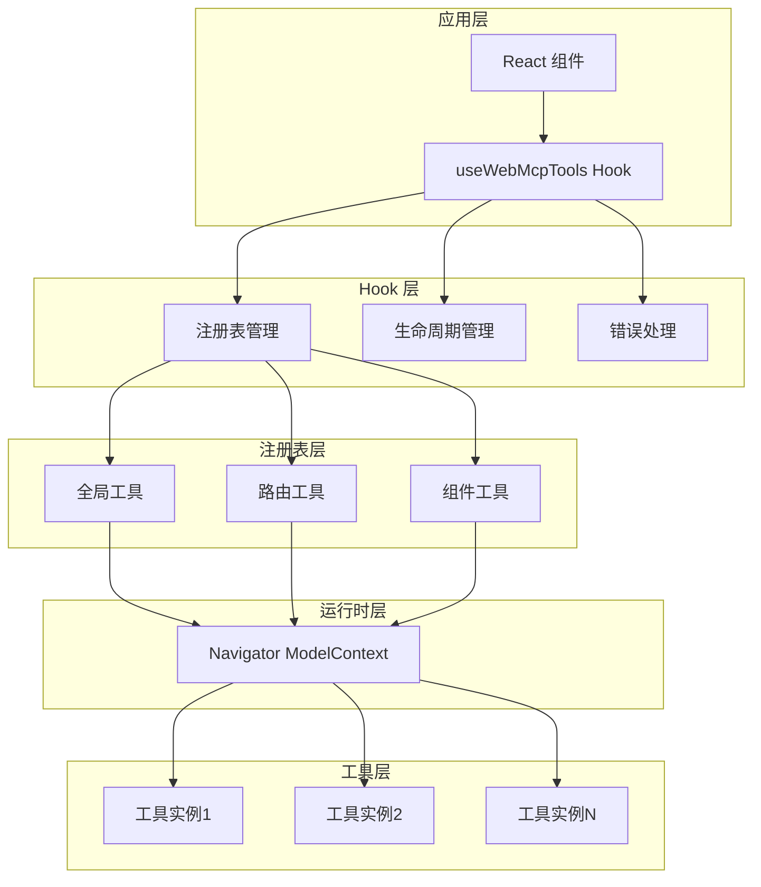
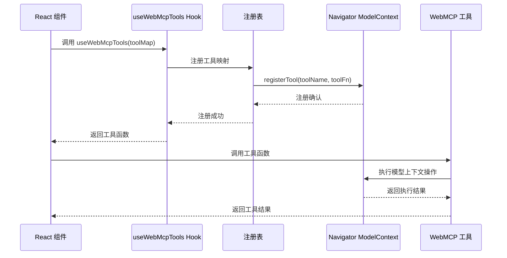
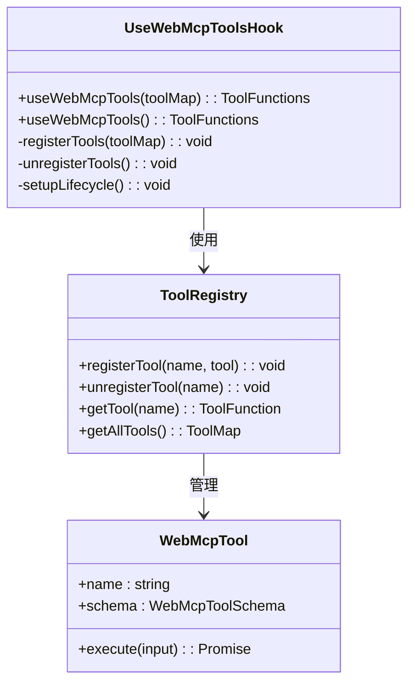
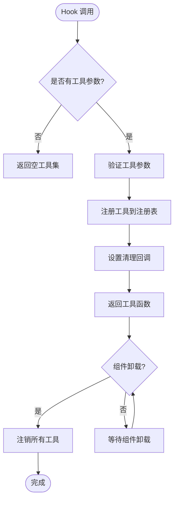
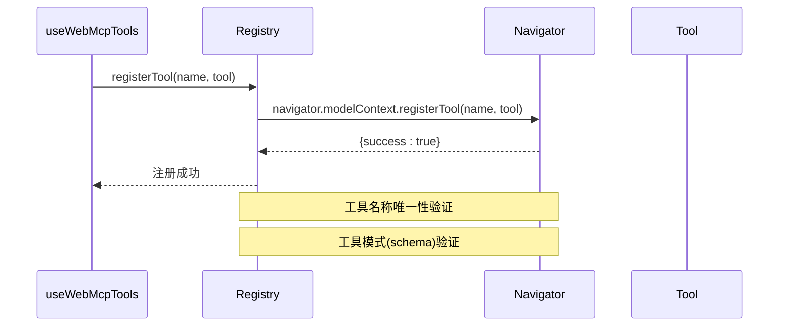
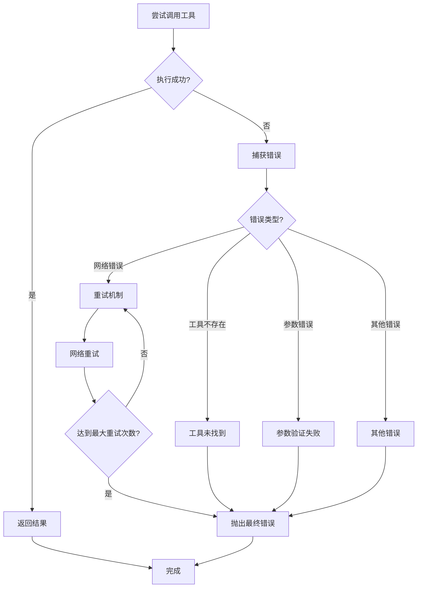
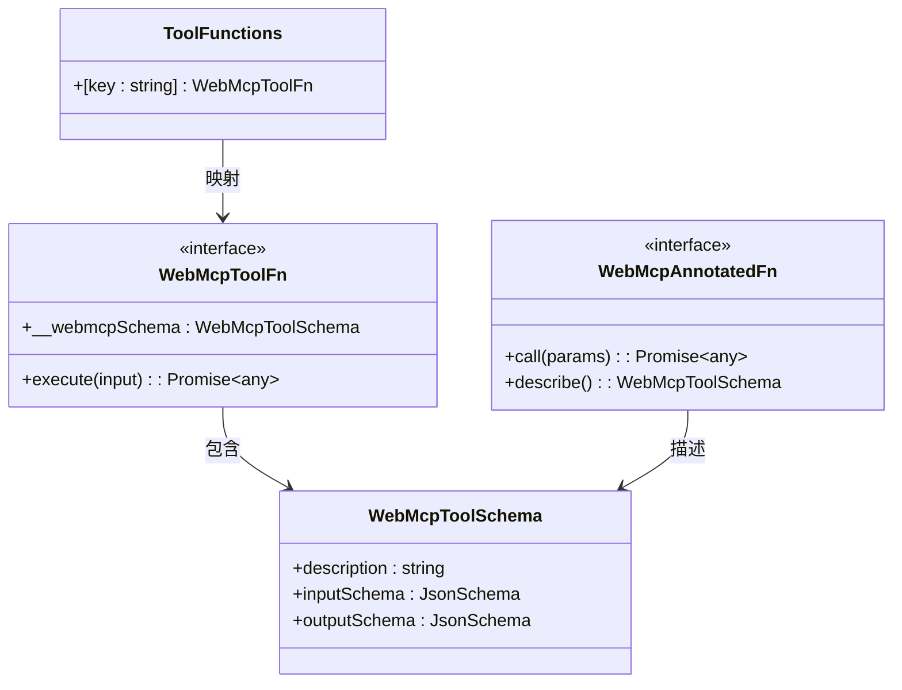
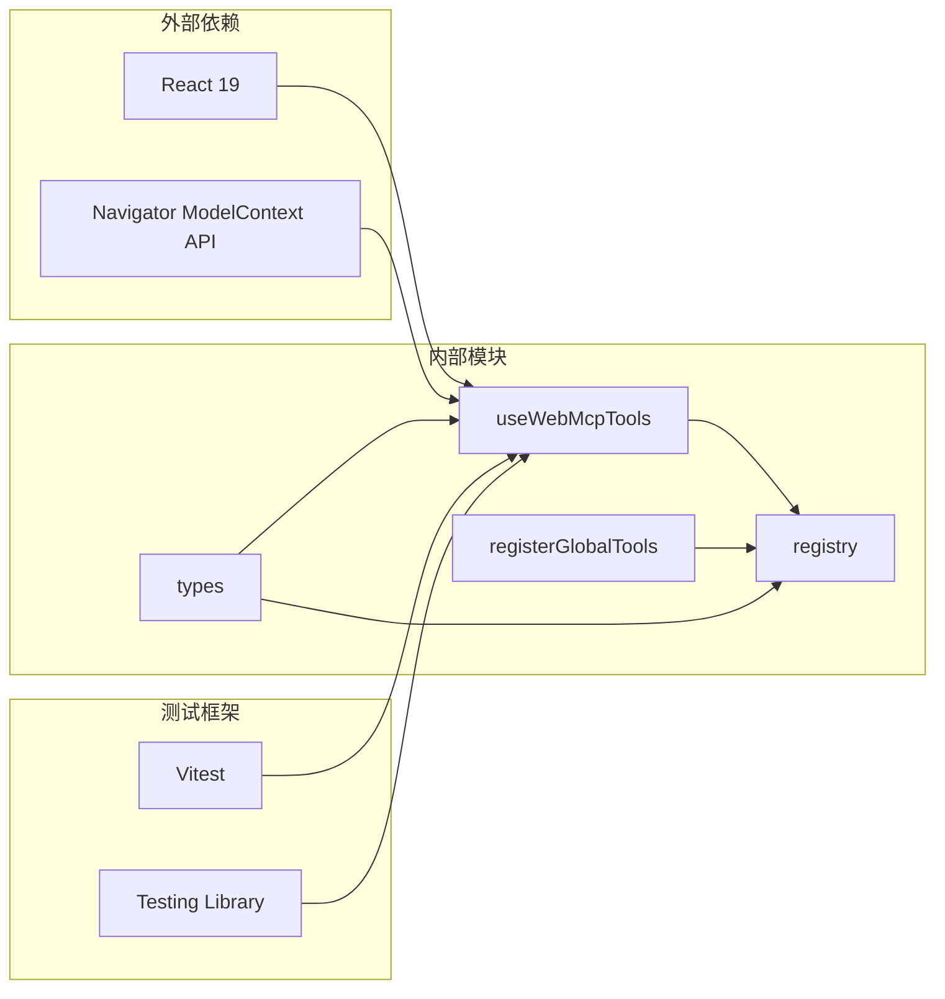

# useWebMcpTools Hook

<cite>
**本文档引用的文件**
- [packages/webmcp-sdk/src/useWebMcpTools.ts](file://packages/webmcp-sdk/src/useWebMcpTools.ts)
- [packages/webmcp-sdk/src/registry.ts](file://packages/webmcp-sdk/src/registry.ts)
- [packages/webmcp-sdk/src/registerGlobalTools.ts](file://packages/webmcp-sdk/src/registerGlobalTools.ts)
- [packages/webmcp-sdk/src/types.ts](file://packages/webmcp-sdk/src/types.ts)
- [packages/webmcp-sdk/src/index.ts](file://packages/webmcp-sdk/src/index.ts)
- [apps/demo/src/pages/CanvasPage.tsx](file://apps/demo/src/pages/CanvasPage.tsx)
- [apps/demo/src/pages/EditorPage.tsx](file://apps/demo/src/pages/EditorPage.tsx)
- [apps/demo/src/pages/TodosPage.tsx](file://apps/demo/src/pages/TodosPage.tsx)
- [README.md](file://README.md)
- [README.en.md](file://README.en.md)
</cite>

## 目录
1. [简介](#简介)
2. [项目结构](#项目结构)
3. [核心组件](#核心组件)
4. [架构概览](#架构概览)
5. [详细组件分析](#详细组件分析)
6. [依赖关系分析](#依赖关系分析)
7. [性能考虑](#性能考虑)
8. [故障排除指南](#故障排除指南)
9. [结论](#结论)

## 简介

useWebMcpTools 是 WebMCP Nexus 运行时 SDK 提供的核心 React Hook，用于在组件中访问和使用已注册的 WebMCP 工具。该 Hook 实现了最小 API 设计理念，通过简单的两个 API（`registerGlobalTools` 和 `useWebMcpTools`）覆盖全局、路由和组件三种生命周期。

WebMCP（Web Model Context Protocol）是一个标准化的协议，允许网页与 AI 模型代理进行交互。useWebMcpTools Hook 使得开发者能够轻松地在 React 应用中集成这些工具，实现自然语言到操作的转换。

## 项目结构

WebMCP Nexus 采用 monorepo 架构，主要包含以下关键包：

**图表来源**
- [packages/webmcp-sdk/src/index.ts:1-4](file://packages/webmcp-sdk/src/index.ts#L1-L4)
- [packages/webmcp-sdk/src/useWebMcpTools.ts](file://packages/webmcp-sdk/src/useWebMcpTools.ts)

**章节来源**
- [README.md:46](file://README.md#L46)
- [README.md:66](file://README.md#L66)

## 核心组件

### useWebMcpTools Hook 概述

useWebMcpTools 是一个轻量级的 React Hook，其设计目标是：

- **最小化 API 表面**：仅暴露必要的工具访问接口
- **生命周期集成**：自动管理工具的注册和注销
- **类型安全**：提供完整的 TypeScript 类型定义
- **性能优化**：支持懒加载和缓存机制

### 主要功能特性

1. **工具注册管理**：自动处理工具的注册和注销生命周期
2. **状态管理**：维护工具的可用性和状态
3. **错误处理**：提供完善的错误边界和重试机制
4. **类型推断**：基于工具模式自动生成类型信息

**章节来源**
- [packages/webmcp-sdk/src/useWebMcpTools.ts](file://packages/webmcp-sdk/src/useWebMcpTools.ts)
- [packages/webmcp-sdk/src/types.ts](file://packages/webmcp-sdk/src/types.ts)

## 架构概览

WebMCP 工具系统采用分层架构设计，确保模块间的松耦合和高内聚：

**图表来源**
- [packages/webmcp-sdk/src/useWebMcpTools.ts](file://packages/webmcp-sdk/src/useWebMcpTools.ts)
- [packages/webmcp-sdk/src/registry.ts](file://packages/webmcp-sdk/src/registry.ts)

### 数据流架构

**图表来源**
- [packages/webmcp-sdk/src/useWebMcpTools.ts](file://packages/webmcp-sdk/src/useWebMcpTools.ts)
- [packages/webmcp-sdk/src/registry.ts](file://packages/webmcp-sdk/src/registry.ts)

## 详细组件分析

### useWebMcpTools Hook 实现

#### 函数签名和类型定义

useWebMcpTools Hook 的核心实现提供了灵活的工具注册机制：

**图表来源**
- [packages/webmcp-sdk/src/useWebMcpTools.ts](file://packages/webmcp-sdk/src/useWebMcpTools.ts)
- [packages/webmcp-sdk/src/types.ts](file://packages/webmcp-sdk/src/types.ts)

#### 生命周期管理机制

Hook 实现了完整的生命周期管理，包括：

1. **组件挂载时**：自动注册传入的工具映射
2. **组件卸载时**：自动清理和注销所有注册的工具
3. **状态更新时**：根据新的工具映射动态更新注册表

#### 懒加载机制

**图表来源**
- [packages/webmcp-sdk/src/useWebMcpTools.ts](file://packages/webmcp-sdk/src/useWebMcpTools.ts)

### 注册表管理系统

#### 工具注册流程

注册表负责管理所有已注册的 WebMCP 工具，提供统一的访问接口：

**图表来源**
- [packages/webmcp-sdk/src/registry.ts](file://packages/webmcp-sdk/src/registry.ts)
- [packages/webmcp-sdk/src/registerGlobalTools.ts](file://packages/webmcp-sdk/src/registerGlobalTools.ts)

#### 缓存策略

注册表实现了智能缓存机制：

1. **内存缓存**：工具注册信息存储在内存中
2. **去重机制**：防止重复注册相同名称的工具
3. **版本控制**：支持工具的版本管理和替换

### 错误处理和重试机制

#### 错误边界处理

Hook 实现了多层次的错误处理：

**图表来源**
- [packages/webmcp-sdk/src/useWebMcpTools.ts](file://packages/webmcp-sdk/src/useWebMcpTools.ts)

### 类型系统设计

#### 工具类型定义

WebMCP 工具系统提供了完整的类型安全保障：

**图表来源**
- [packages/webmcp-sdk/src/types.ts](file://packages/webmcp-sdk/src/types.ts)

## 依赖关系分析

### 模块间依赖关系

**图表来源**
- [packages/webmcp-sdk/src/index.ts:1-4](file://packages/webmcp-sdk/src/index.ts#L1-L4)
- [packages/webmcp-sdk/src/useWebMcpTools.ts](file://packages/webmcp-sdk/src/useWebMcpTools.ts)

### 性能依赖分析

Hook 的性能表现取决于多个因素：

1. **注册表查询复杂度**：O(1) 平均查找时间
2. **工具执行延迟**：受网络和模型响应时间影响
3. **内存占用**：工具函数和模式信息的存储开销
4. **重渲染优化**：React.memo 和 useMemo 的使用

**章节来源**
- [packages/webmcp-sdk/src/registry.ts](file://packages/webmcp-sdk/src/registry.ts)
- [packages/webmcp-sdk/src/useWebMcpTools.ts](file://packages/webmcp-sdk/src/useWebMcpTools.ts)

## 性能考虑

### 优化策略

#### 懒加载优化

- **按需加载**：工具只在需要时才进行注册和初始化
- **缓存复用**：已注册的工具信息在组件间共享
- **批量注册**：支持一次性注册多个工具以减少开销

#### 内存管理

- **自动清理**：组件卸载时自动释放工具资源
- **循环引用避免**：确保工具函数不持有对组件的强引用
- **垃圾回收友好**：使用函数式编程范式减少内存泄漏风险

#### 并发处理

- **异步执行**：工具调用采用异步模式避免阻塞主线程
- **超时控制**：为工具调用设置合理的超时时间
- **并发限制**：控制同时执行的工具数量

## 故障排除指南

### 常见问题和解决方案

#### 工具注册失败

**症状**：工具无法在组件中使用
**原因**：
- Navigator ModelContext API 不可用
- 工具名称冲突
- 工具模式验证失败

**解决方案**：
1. 检查浏览器兼容性
2. 确保工具名称唯一性
3. 验证工具模式的 JSON Schema

#### 组件卸载异常

**症状**：组件卸载后工具仍然存在
**原因**：生命周期钩子未正确清理
**解决方案**：
- 确保正确的清理回调设置
- 检查自定义 Hook 的实现

#### 性能问题

**症状**：工具调用响应缓慢
**原因**：
- 网络延迟
- 模型处理时间长
- 工具数量过多

**解决方案**：
- 实施重试机制
- 添加本地缓存
- 优化工具调用频率

**章节来源**
- [packages/webmcp-sdk/src/useWebMcpTools.ts](file://packages/webmcp-sdk/src/useWebMcpTools.ts)
- [packages/webmcp-sdk/src/registry.ts](file://packages/webmcp-sdk/src/registry.ts)

## 结论

useWebMcpTools Hook 代表了 WebMCP 技术栈中最精炼的 API 设计。通过极简的设计理念和强大的功能实现，它为开发者提供了无缝的 WebMCP 工具集成体验。

### 主要优势

1. **简单易用**：30 秒理解，5 分钟集成
2. **类型安全**：完整的 TypeScript 支持
3. **性能优化**：智能缓存和懒加载机制
4. **错误处理**：完善的异常管理和重试机制
5. **生命周期管理**：自动化的注册和清理

### 最佳实践

1. **合理组织工具**：按功能模块划分工具集合
2. **错误处理**：为每个工具调用添加适当的错误处理
3. **性能监控**：定期检查工具调用的性能指标
4. **测试覆盖**：为关键工具实现单元测试
5. **文档维护**：保持工具模式和使用文档的更新

随着 WebMCP 标准的发展和社区生态的完善，useWebMcpTools Hook 将继续演进，为构建更智能的 Web 应用提供强大支持。