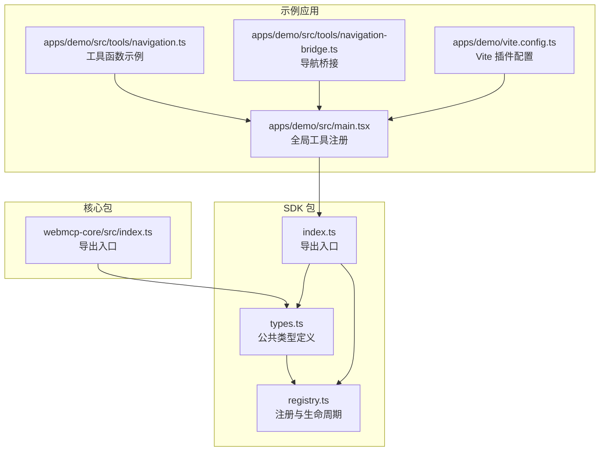
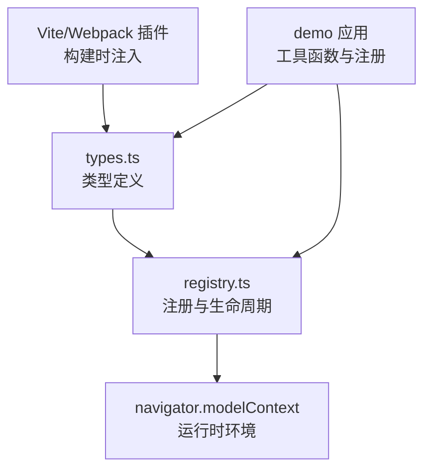
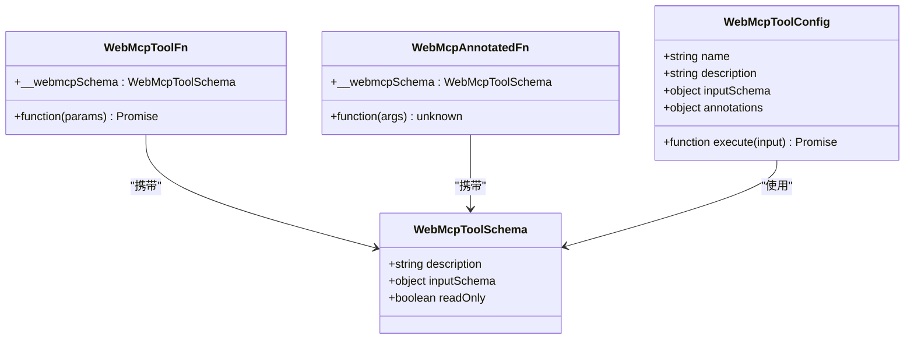
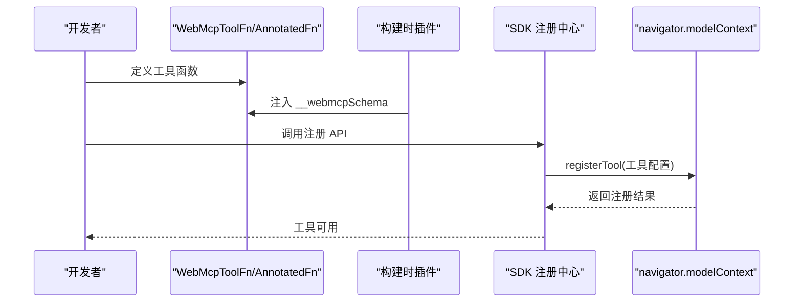
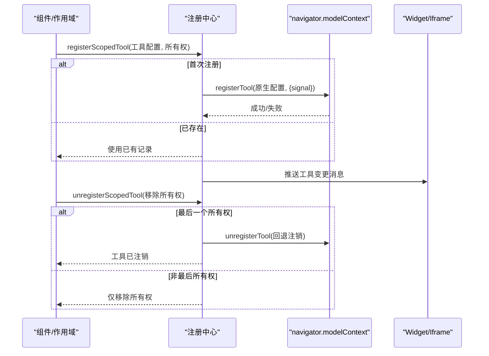
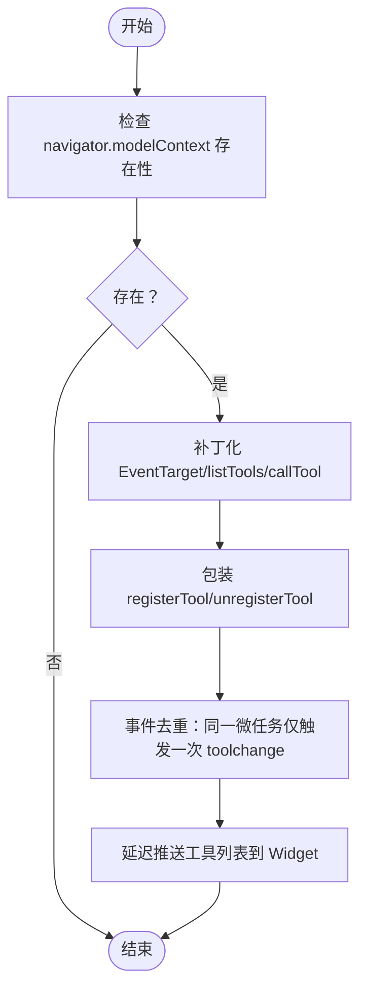
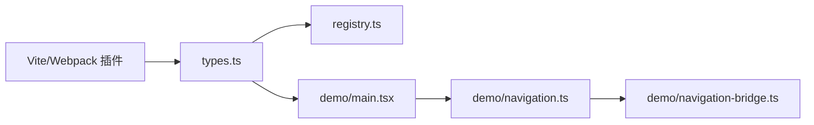

# 类型定义参考

<cite>
**本文档引用的文件**
- [packages/webmcp-sdk/src/types.ts](file://packages/webmcp-sdk/src/types.ts)
- [packages/webmcp-sdk/src/index.ts](file://packages/webmcp-sdk/src/index.ts)
- [packages/webmcp-sdk/src/registry.ts](file://packages/webmcp-sdk/src/registry.ts)
- [packages/webmcp-sdk/src/__tests__/useWebMcpTools.test.ts](file://packages/webmcp-sdk/src/__tests__/useWebMcpTools.test.ts)
- [packages/webmcp-sdk/src/__tests__/registry.test.ts](file://packages/webmcp-sdk/src/__tests__/registry.test.ts)
- [apps/demo/src/tools/navigation.ts](file://apps/demo/src/tools/navigation.ts)
- [apps/demo/src/tools/navigation-bridge.ts](file://apps/demo/src/tools/navigation-bridge.ts)
- [apps/demo/src/main.tsx](file://apps/demo/src/main.tsx)
- [apps/demo/vite.config.ts](file://apps/demo/vite.config.ts)
- [packages/webmcp-core/src/index.ts](file://packages/webmcp-core/src/index.ts)
- [README.md](file://README.md)
</cite>

## 目录
1. [简介](#简介)
2. [项目结构](#项目结构)
3. [核心类型](#核心类型)
4. [架构总览](#架构总览)
5. [详细类型分析](#详细类型分析)
6. [依赖关系分析](#依赖关系分析)
7. [性能考量](#性能考量)
8. [故障排查指南](#故障排查指南)
9. [结论](#结论)
10. [附录](#附录)

## 简介
本参考文档聚焦 webmcp-nexus SDK 的类型系统，系统性梳理并解释以下公共类型定义：
- WebMcpToolFn
- WebMcpToolSchema
- WebMcpAnnotatedFn
- WebMcpToolConfig

文档内容涵盖各类型的用途、字段含义、约束条件、继承关系、使用示例、设计原则与扩展机制，并提供类型安全最佳实践、常见类型错误的解决方案、与 TypeScript 编译器的集成方式以及自定义类型扩展的指导。

## 项目结构
webmcp-nexus 采用 monorepo 结构，SDK 类型定义位于 webmcp-sdk 包中，核心类型集中在 types.ts；运行时注册与生命周期管理位于 registry.ts；demo 应用展示了类型与工具的实际使用方式；webmcp-core 提供构建时类型抽取与 JSON Schema 生成能力。

图表来源
- [packages/webmcp-sdk/src/types.ts:1-48](file://packages/webmcp-sdk/src/types.ts#L1-L48)
- [packages/webmcp-sdk/src/registry.ts:1-551](file://packages/webmcp-sdk/src/registry.ts#L1-L551)
- [packages/webmcp-sdk/src/index.ts:1-5](file://packages/webmcp-sdk/src/index.ts#L1-L5)
- [packages/webmcp-core/src/index.ts:1-11](file://packages/webmcp-core/src/index.ts#L1-L11)
- [apps/demo/src/main.tsx:1-14](file://apps/demo/src/main.tsx#L1-L14)
- [apps/demo/src/tools/navigation.ts:1-14](file://apps/demo/src/tools/navigation.ts#L1-L14)
- [apps/demo/src/tools/navigation-bridge.ts:1-8](file://apps/demo/src/tools/navigation-bridge.ts#L1-L8)
- [apps/demo/vite.config.ts:1-16](file://apps/demo/vite.config.ts#L1-L16)

章节来源
- [packages/webmcp-sdk/src/types.ts:1-48](file://packages/webmcp-sdk/src/types.ts#L1-L48)
- [packages/webmcp-sdk/src/index.ts:1-5](file://packages/webmcp-sdk/src/index.ts#L1-L5)
- [packages/webmcp-sdk/src/registry.ts:1-551](file://packages/webmcp-sdk/src/registry.ts#L1-L551)
- [packages/webmcp-core/src/index.ts:1-11](file://packages/webmcp-core/src/index.ts#L1-L11)
- [apps/demo/src/main.tsx:1-14](file://apps/demo/src/main.tsx#L1-L14)
- [apps/demo/src/tools/navigation.ts:1-14](file://apps/demo/src/tools/navigation.ts#L1-L14)
- [apps/demo/src/tools/navigation-bridge.ts:1-8](file://apps/demo/src/tools/navigation-bridge.ts#L1-L8)
- [apps/demo/vite.config.ts:1-16](file://apps/demo/vite.config.ts#L1-L16)

## 核心类型
本节对四个公共类型进行逐项说明，包括用途、字段含义、约束与典型用法。

- WebMcpToolSchema
  - 用途：描述工具的元数据，由构建时插件注入到函数的 __webmcpSchema 属性，用于向 Agent 暴露工具的输入参数 JSON Schema、描述与只读标记。
  - 关键字段
    - description: 工具描述（来自 JSDoc）
    - inputSchema: JSON Schema 对象，表示输入参数结构
      - type: 固定为 "object"
      - properties: 参数属性映射（未知结构）
      - required: 可选字符串数组，标识必填属性
    - readOnly: 可选布尔值，指示是否为只读工具（来自 @readonly JSDoc 标签）
  - 约束与注意
    - inputSchema 必须符合 JSON Schema Draft 规范，properties 为 Record<string, unknown>，需确保可序列化
    - required 数组应与 properties 的键集合一致
    - readOnly 为可选，未设置时默认非只读
  - 使用场景
    - 作为 WebMcpToolFn 的 __webmcpSchema 属性值
    - 作为 WebMcpToolConfig 的 inputSchema 字段值

- WebMcpToolFn<TParams, TResult>
  - 用途：带 __webmcpSchema 属性的函数类型，用于声明一个可被 SDK 注册为 WebMCP 工具的函数。
  - 关键特征
    - 函数签名：(params: TParams) => Promise<TResult>
    - __webmcpSchema?: WebMcpToolSchema | undefined
  - 约束与注意
    - TParams 与 TResult 为泛型，分别代表输入参数与返回结果的类型
    - __webmcpSchema 由构建时插件注入，运行时可选
    - 若需要访问 __webmcpSchema，建议使用 WebMcpAnnotatedFn 替代 as any
  - 使用场景
    - 定义业务工具函数，如导航、绘图等
    - 与 Vite/Webpack 插件配合，自动生成 inputSchema

- WebMcpAnnotatedFn
  - 用途：带有可选 __webmcpSchema 属性的标注函数接口，用于替代直接使用 as any 访问 __webmcpSchema，提升类型安全性。
  - 关键特征
    - (...args: unknown[]) => unknown
    - __webmcpSchema?: WebMcpToolSchema
  - 约束与注意
    - 适用于无法直接将函数标注为 WebMcpToolFn 的场景
    - 保持与 WebMcpToolFn 的 __webmcpSchema 兼容
  - 使用场景
    - 在测试或工具函数中安全地读取 __webmcpSchema

- WebMcpToolConfig
  - 用途：传递给 navigator.modelContext.registerTool 的工具配置对象，用于在运行时向 MCP 环境注册工具。
  - 关键字段
    - name: 工具名称（字符串）
    - description: 工具描述（字符串）
    - inputSchema?: object（可选，JSON Schema 对象）
    - execute: (input: Record<string, unknown>) => Promise<unknown>
    - annotations?: { readOnlyHint?: boolean }（可选）
  - 约束与注意
    - name 必须唯一，SDK 内部维护作用域所有权注册表，同名工具会发出警告但允许注册
    - inputSchema 为对象类型，需与 WebMcpToolSchema.inputSchema 保持一致的结构
    - execute 的输入为 Record<string, unknown>，返回 Promise<unknown>
    - annotations.readOnlyHint 为可选提示，用于辅助 UI 或 Agent 判断只读行为
  - 使用场景
    - 通过 registerGlobalTools/useWebMcpTools 注册全局或组件级工具
    - 与模型上下文交互，暴露工具给 Agent

章节来源
- [packages/webmcp-sdk/src/types.ts:3-47](file://packages/webmcp-sdk/src/types.ts#L3-L47)

## 架构总览
下图展示类型系统在 SDK 中的角色与交互关系，包括类型定义、注册流程与运行时事件分发。

图表来源
- [packages/webmcp-sdk/src/types.ts:1-48](file://packages/webmcp-sdk/src/types.ts#L1-L48)
- [packages/webmcp-sdk/src/registry.ts:1-551](file://packages/webmcp-sdk/src/registry.ts#L1-L551)
- [apps/demo/src/main.tsx:1-14](file://apps/demo/src/main.tsx#L1-L14)
- [apps/demo/vite.config.ts:1-16](file://apps/demo/vite.config.ts#L1-L16)

## 详细类型分析

### 类型关系与继承
WebMcpToolFn 与 WebMcpAnnotatedFn 均可携带 WebMcpToolSchema；WebMcpToolConfig 用于运行时注册。它们之间的关系如下：

图表来源
- [packages/webmcp-sdk/src/types.ts:3-47](file://packages/webmcp-sdk/src/types.ts#L3-L47)

章节来源
- [packages/webmcp-sdk/src/types.ts:3-47](file://packages/webmcp-sdk/src/types.ts#L3-L47)

### WebMcpToolFn 与 WebMcpAnnotatedFn 的使用流程
下图展示从函数定义到注册为工具的典型流程，包括构建时注入与运行时注册。

图表来源
- [packages/webmcp-sdk/src/types.ts:21-33](file://packages/webmcp-sdk/src/types.ts#L21-L33)
- [packages/webmcp-sdk/src/registry.ts:314-401](file://packages/webmcp-sdk/src/registry.ts#L314-L401)
- [apps/demo/src/main.tsx:3-8](file://apps/demo/src/main.tsx#L3-L8)

章节来源
- [packages/webmcp-sdk/src/types.ts:21-33](file://packages/webmcp-sdk/src/types.ts#L21-L33)
- [packages/webmcp-sdk/src/registry.ts:314-401](file://packages/webmcp-sdk/src/registry.ts#L314-L401)
- [apps/demo/src/main.tsx:3-8](file://apps/demo/src/main.tsx#L3-L8)

### WebMcpToolConfig 的注册与生命周期
下图展示工具注册、作用域所有权管理与注销的流程，包括原生注册、信号传播与事件分发。

图表来源
- [packages/webmcp-sdk/src/registry.ts:314-436](file://packages/webmcp-sdk/src/registry.ts#L314-L436)
- [packages/webmcp-sdk/src/registry.ts:448-542](file://packages/webmcp-sdk/src/registry.ts#L448-L542)

章节来源
- [packages/webmcp-sdk/src/registry.ts:314-436](file://packages/webmcp-sdk/src/registry.ts#L314-L436)
- [packages/webmcp-sdk/src/registry.ts:448-542](file://packages/webmcp-sdk/src/registry.ts#L448-L542)

### 复杂逻辑流程：工具列表推送与事件合并
下图展示工具变更事件的去重与批量推送逻辑，确保在快速注册/注销时只触发一次 toolchange 事件并批量更新 Widget。

图表来源
- [packages/webmcp-sdk/src/registry.ts:46-206](file://packages/webmcp-sdk/src/registry.ts#L46-L206)
- [packages/webmcp-sdk/src/registry.ts:448-542](file://packages/webmcp-sdk/src/registry.ts#L448-L542)

章节来源
- [packages/webmcp-sdk/src/registry.ts:46-206](file://packages/webmcp-sdk/src/registry.ts#L46-L206)
- [packages/webmcp-sdk/src/registry.ts:448-542](file://packages/webmcp-sdk/src/registry.ts#L448-L542)

## 依赖关系分析
- 类型依赖
  - WebMcpToolFn 依赖 WebMcpToolSchema
  - WebMcpAnnotatedFn 依赖 WebMcpToolSchema
  - WebMcpToolConfig 与 WebMcpToolSchema 结构一致，用于运行时配置
- 运行时依赖
  - registry.ts 依赖 navigator.modelContext API（registerTool、unregisterTool、listTools、callTool、EventTarget）
  - 构建时依赖 Vite/Webpack 插件注入 __webmcpSchema
- 示例应用依赖
  - demo 应用通过 registerGlobalTools 注册工具函数
  - navigation.ts 与 navigation-bridge.ts 展示工具函数与外部依赖的桥接

图表来源
- [packages/webmcp-sdk/src/types.ts:1-48](file://packages/webmcp-sdk/src/types.ts#L1-L48)
- [packages/webmcp-sdk/src/registry.ts:1-551](file://packages/webmcp-sdk/src/registry.ts#L1-L551)
- [apps/demo/src/main.tsx:1-14](file://apps/demo/src/main.tsx#L1-L14)
- [apps/demo/src/tools/navigation.ts:1-14](file://apps/demo/src/tools/navigation.ts#L1-L14)
- [apps/demo/src/tools/navigation-bridge.ts:1-8](file://apps/demo/src/tools/navigation-bridge.ts#L1-L8)
- [apps/demo/vite.config.ts:1-16](file://apps/demo/vite.config.ts#L1-L16)

章节来源
- [packages/webmcp-sdk/src/types.ts:1-48](file://packages/webmcp-sdk/src/types.ts#L1-L48)
- [packages/webmcp-sdk/src/registry.ts:1-551](file://packages/webmcp-sdk/src/registry.ts#L1-L551)
- [apps/demo/src/main.tsx:1-14](file://apps/demo/src/main.tsx#L1-L14)
- [apps/demo/src/tools/navigation.ts:1-14](file://apps/demo/src/tools/navigation.ts#L1-L14)
- [apps/demo/src/tools/navigation-bridge.ts:1-8](file://apps/demo/src/tools/navigation-bridge.ts#L1-L8)
- [apps/demo/vite.config.ts:1-16](file://apps/demo/vite.config.ts#L1-L16)

## 性能考量
- 构建时类型抽取：基于 ts-morph 的静态分析，函数签名直接映射为 JSON Schema，避免运行时开销
- 事件去重与批量推送：通过微任务队列合并 toolchange 事件，并延迟推送工具列表，降低频繁注册/注销带来的 UI 更新成本
- 作用域所有权：同一工具仅原生注册一次，多个作用域共享执行逻辑，减少重复注册与内存占用

## 故障排查指南
- 工具名冲突
  - 现象：控制台出现关于同名工具已在其他作用域注册的警告
  - 原因：SDK 内部维护作用域所有权注册表，同名工具会发出警告但仍允许注册
  - 解决：使用语义化且唯一的工具名，避免不同层级同名冲突
- 注销后工具仍可见
  - 现象：注销最后一个作用域后，工具仍出现在 listTools 结果中
  - 原因：某些环境下 unregisterTool 不可用或未正确调用
  - 解决：SDK 在旧环境中会尝试回退调用 unregisterTool；若仍异常，检查 navigator.modelContext 的实现
- 事件风暴
  - 现象：频繁注册/注销导致 UI 卡顿
  - 原因：未合并 toolchange 事件
  - 解决：SDK 已内置事件去重与延迟推送，确保同一微任务内仅触发一次 toolchange
- JSON Schema 解析失败
  - 现象：从 modelContextTesting.listTools 获取的 inputSchema 为字符串时解析失败
  - 原因：字符串格式未正确解析
  - 解决：SDK 内部提供安全解析逻辑，若解析失败则回退为空对象 schema

章节来源
- [README.md:349-356](file://README.md#L349-L356)
- [packages/webmcp-sdk/src/registry.ts:46-206](file://packages/webmcp-sdk/src/registry.ts#L46-L206)
- [packages/webmcp-sdk/src/registry.ts:506-512](file://packages/webmcp-sdk/src/registry.ts#L506-L512)

## 结论
webmcp-nexus SDK 的类型系统围绕 WebMcpToolSchema、WebMcpToolFn、WebMcpAnnotatedFn 与 WebMcpToolConfig 构建，通过构建时注入与运行时注册相结合的方式，实现了类型安全、事件去重与跨浏览器兼容。遵循本文档的设计原则与最佳实践，可在保证类型安全的同时获得良好的开发体验与运行性能。

## 附录

### 设计原则与扩展机制
- 设计原则
  - 极简 API：仅通过 registerGlobalTools 与 useWebMcpTools 暴露核心能力
  - 构建时类型反推：函数签名即 JSON Schema，无运行时开销
  - 作用域隔离：组件级工具随生命周期挂载/卸载，杜绝“幽灵工具”
  - 冲突感知：同名工具注册时仅警告不中断，注销严格隔离
- 扩展机制
  - 通过 WebMcpToolConfig 扩展工具配置（annotations、inputSchema）
  - 通过 WebMcpAnnotatedFn 适配无法直接标注为 WebMcpToolFn 的函数
  - 通过 Vite/Webpack 插件扩展构建时注入逻辑（如自定义注解标签）

章节来源
- [README.md:65-75](file://README.md#L65-L75)
- [packages/webmcp-sdk/src/types.ts:3-47](file://packages/webmcp-sdk/src/types.ts#L3-L47)

### 类型安全最佳实践
- 使用 WebMcpToolFn 明确函数签名与返回类型
- 通过 WebMcpAnnotatedFn 替代 as any 访问 __webmcpSchema
- 保持 WebMcpToolConfig.inputSchema 与 WebMcpToolSchema.inputSchema 结构一致
- 避免在 inputSchema 中使用不稳定的类型特性（如泛型、映射类型、超过三层的嵌套）

章节来源
- [README.md:358-371](file://README.md#L358-L371)
- [packages/webmcp-sdk/src/types.ts:3-47](file://packages/webmcp-sdk/src/types.ts#L3-L47)

### 常见类型错误与解决方案
- 错误：__webmcpSchema 为 undefined
  - 原因：未启用构建时插件或未按约定编写函数
  - 解决：确认 Vite/Webpack 插件已配置并包含目标文件
- 错误：inputSchema 不符合 JSON Schema
  - 原因：使用了不可序列化的类型或嵌套过深
  - 解决：简化类型结构，确保 properties 可序列化
- 错误：execute 输入类型不匹配
  - 原因：execute 的输入为 Record<string, unknown>，与函数签名不一致
  - 解决：在函数内部根据 WebMcpToolSchema.inputSchema 进行校验与转换

章节来源
- [apps/demo/vite.config.ts:1-16](file://apps/demo/vite.config.ts#L1-L16)
- [packages/webmcp-sdk/src/types.ts:3-47](file://packages/webmcp-sdk/src/types.ts#L3-L47)

### 与 TypeScript 编译器的集成与类型检查配置
- 集成方式
  - 构建时：Vite/Webpack 插件在编译期扫描 TS 源码，提取类型并生成 __webmcpSchema
  - 运行时：SDK 通过 registry.ts 与 navigator.modelContext 交互，无需额外运行时类型检查
- 类型检查建议
  - 在开发阶段启用严格的类型检查，确保函数签名与 JSON Schema 一致
  - 使用 Vitest 进行单元测试，验证工具注册与注销流程

章节来源
- [README.md:373-378](file://README.md#L373-L378)
- [apps/demo/vite.config.ts:1-16](file://apps/demo/vite.config.ts#L1-L16)

### 自定义类型扩展指导与注意事项
- 扩展 WebMcpToolConfig
  - 添加 annotations 字段以提供只读提示或其他元信息
  - 保持 inputSchema 与函数签名一致，避免运行时类型不匹配
- 扩展 WebMcpToolFn
  - 通过泛型参数明确输入与输出类型，便于 IDE 与类型检查
  - 避免在函数体内使用不参与 JSON Schema 生成的类型特性
- 注意事项
  - 避免在 inputSchema 中使用不稳定或难以序列化的类型
  - 在多作用域注册同名工具时，遵循唯一命名与作用域隔离原则

章节来源
- [packages/webmcp-sdk/src/types.ts:3-47](file://packages/webmcp-sdk/src/types.ts#L3-L47)
- [README.md:358-371](file://README.md#L358-L371)