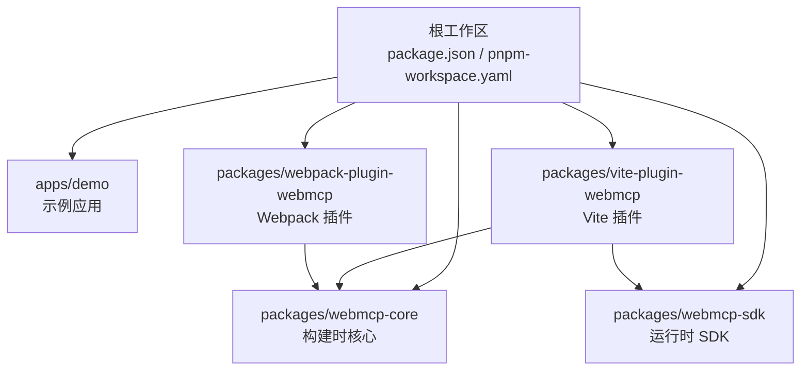
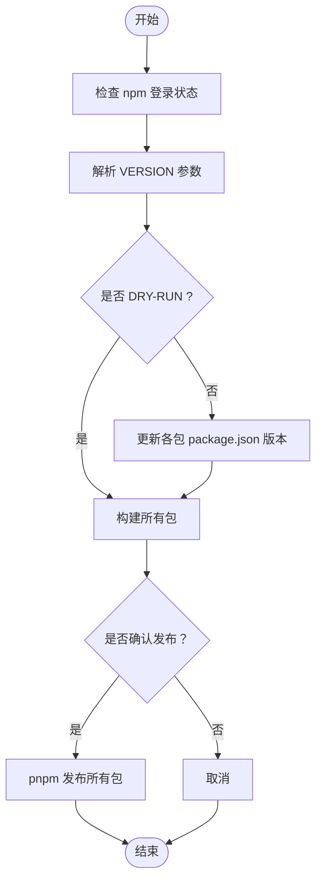
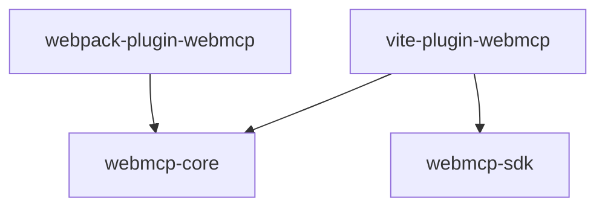

# 开发者指南

<cite>
**本文引用的文件**
- [package.json](file://package.json)
- [pnpm-workspace.yaml](file://pnpm-workspace.yaml)
- [eslint.config.js](file://eslint.config.js)
- [.prettierrc](file://.prettierrc)
- [tsconfig.base.json](file://tsconfig.base.json)
- [scripts/publish.sh](file://scripts/publish.sh)
- [README.md](file://README.md)
- [apps/demo/package.json](file://apps/demo/package.json)
- [apps/demo/vite.config.ts](file://apps/demo/vite.config.ts)
- [apps/demo/tsconfig.json](file://apps/demo/tsconfig.json)
- [packages/webmcp-core/package.json](file://packages/webmcp-core/package.json)
- [packages/webmcp-core/tsconfig.json](file://packages/webmcp-core/tsconfig.json)
- [packages/webmcp-sdk/package.json](file://packages/webmcp-sdk/package.json)
- [packages/webmcp-sdk/tsconfig.json](file://packages/webmcp-sdk/tsconfig.json)
- [packages/vite-plugin-webmcp/package.json](file://packages/vite-plugin-webmcp/package.json)
- [packages/vite-plugin-webmcp/tsconfig.json](file://packages/vite-plugin-webmcp/tsconfig.json)
- [packages/webpack-plugin-webmcp/package.json](file://packages/webpack-plugin-webmcp/package.json)
- [packages/webpack-plugin-webmcp/tsconfig.json](file://packages/webpack-plugin-webmcp/tsconfig.json)
</cite>

## 目录
1. [简介](#简介)
2. [项目结构](#项目结构)
3. [核心组件](#核心组件)
4. [架构总览](#架构总览)
5. [详细组件分析](#详细组件分析)
6. [依赖关系分析](#依赖关系分析)
7. [性能考虑](#性能考虑)
8. [故障排查指南](#故障排查指南)
9. [结论](#结论)
10. [附录](#附录)

## 简介
本指南面向贡献者，帮助你在本地快速搭建开发环境、理解代码规范、掌握开发脚本与发布流程，并遵循贡献与代码审查规范。项目采用 pnpm workspaces 组织多包（monorepo），核心包含运行时 SDK、构建时核心与 Vite/ Webpack 双插件，配合示例应用演示完整集成路径。

## 项目结构
- 顶层工作区通过 pnpm 工作区配置将 apps 与 packages 纳入管理。
- apps/demo 是示例应用，演示 Vite 与 Webpack 双构建接入。
- packages 下包含：
  - webmcp-core：构建时类型抽取与 JSON Schema 生成的核心。
  - webmcp-sdk：运行时 SDK（2 个 API + polyfill）。
  - vite-plugin-webmcp：Vite 插件，构建时自动生成 JSON Schema。
  - webpack-plugin-webmcp：Webpack 插件，构建时自动生成并注入 JSON Schema。
- scripts/publish.sh 提供一键发布脚本，统一版本与发布流程。

图表来源
- [pnpm-workspace.yaml:1-4](file://pnpm-workspace.yaml#L1-L4)
- [apps/demo/package.json:1-56](file://apps/demo/package.json#L1-L56)
- [packages/webmcp-core/package.json:1-56](file://packages/webmcp-core/package.json#L1-L56)
- [packages/webmcp-sdk/package.json:1-62](file://packages/webmcp-sdk/package.json#L1-L62)
- [packages/vite-plugin-webmcp/package.json:1-59](file://packages/vite-plugin-webmcp/package.json#L1-L59)
- [packages/webpack-plugin-webmcp/package.json:1-56](file://packages/webpack-plugin-webmcp/package.json#L1-L56)

章节来源
- [pnpm-workspace.yaml:1-4](file://pnpm-workspace.yaml#L1-L4)
- [README.md:76-89](file://README.md#L76-L89)

## 核心组件
- 运行时 SDK（webmcp-sdk）
  - 导出 2 个 API，覆盖全局、路由、组件三级生命周期。
  - 对外暴露模块入口与类型声明，支持 React peer 依赖。
- 构建时核心（webmcp-core）
  - 基于 ts-morph 静态分析，从 TS 类型与 JSDoc 推导 JSON Schema。
  - 输出构建产物与类型声明，供插件消费。
- Vite 插件（vite-plugin-webmcp）
  - 构建时扫描工具定义，生成并注入 JSON Schema。
  - 与 SDK 配合实现“零侵入”工具注册。
- Webpack 插件（webpack-plugin-webmcp）
  - 构建时生成并注入 JSON Schema，支持 loader 形态扩展。
- 示例应用（apps/demo）
  - 展示 Vite 与 Webpack 双构建接入方式与工具注册实践。

章节来源
- [packages/webmcp-sdk/package.json:1-62](file://packages/webmcp-sdk/package.json#L1-L62)
- [packages/webmcp-core/package.json:1-56](file://packages/webmcp-core/package.json#L1-L56)
- [packages/vite-plugin-webmcp/package.json:1-59](file://packages/vite-plugin-webmcp/package.json#L1-L59)
- [packages/webpack-plugin-webmcp/package.json:1-56](file://packages/webpack-plugin-webmcp/package.json#L1-L56)
- [apps/demo/package.json:1-56](file://apps/demo/package.json#L1-L56)

## 架构总览
下图展示了从“编写 TS 工具函数”到“浏览器端被 Agent 调用”的端到端流程，以及构建期与运行期的关键角色。

图表来源
- [README.md:100-177](file://README.md#L100-L177)
- [packages/vite-plugin-webmcp/package.json:1-59](file://packages/vite-plugin-webmcp/package.json#L1-L59)
- [packages/webmcp-core/package.json:1-56](file://packages/webmcp-core/package.json#L1-L56)
- [packages/webmcp-sdk/package.json:1-62](file://packages/webmcp-sdk/package.json#L1-L62)

## 详细组件分析

### 开发环境与 IDE 推荐
- Node.js 版本
  - 项目文档明确要求 Node.js 18+，建议使用 pnpm。
- pnpm 工作区
  - 通过 pnpm-workspace.yaml 将 apps/* 与 packages/* 纳入工作区，便于统一安装与脚本执行。
- IDE 推荐
  - 使用支持 TypeScript 与 ESLint/Prettier 的编辑器（如 VS Code），确保格式化与类型检查即时生效。
  - 保持编辑器的 TypeScript 语言服务与工作区一致，避免跨包类型解析异常。

章节来源
- [README.md:102-102](file://README.md#L102-L102)
- [pnpm-workspace.yaml:1-4](file://pnpm-workspace.yaml#L1-L4)

### 代码规范与格式化
- ESLint
  - 使用 eslint.config.js 定义配置，启用 ts、react hooks、react refresh 等推荐规则。
  - 语言选项设置为浏览器环境，忽略 dist 与 node_modules。
  - 规则示例：对未使用变量的处理策略。
- Prettier
  - 通过 .prettierrc 统一缩进、引号、尾逗号、换行符等风格。
  - 提供 format 与 format:check 两个脚本，分别用于写回与检查。
- TypeScript
  - 顶层 tsconfig.base.json 设定严格模式、ESNext 模块系统、bundler 解析等基础编译选项。
  - 各包的 tsconfig.json 继承基础配置，并补充各自特定选项（如 lib、jsx、noEmit 等）。

章节来源
- [eslint.config.js:1-27](file://eslint.config.js#L1-L27)
- [.prettierrc:1-20](file://.prettierrc#L1-L20)
- [tsconfig.base.json:1-20](file://tsconfig.base.json#L1-L20)
- [packages/webmcp-sdk/tsconfig.json:1-12](file://packages/webmcp-sdk/tsconfig.json#L1-L12)
- [packages/vite-plugin-webmcp/tsconfig.json:1-13](file://packages/vite-plugin-webmcp/tsconfig.json#L1-L13)
- [packages/webpack-plugin-webmcp/tsconfig.json:1-11](file://packages/webpack-plugin-webmcp/tsconfig.json#L1-L11)
- [packages/webmcp-core/tsconfig.json:1-11](file://packages/webmcp-core/tsconfig.json#L1-L11)

### 开发脚本说明
- 顶层脚本（根 package.json）
  - dev：启动示例应用（Vite）。
  - dev:webpack：启动示例应用（Webpack）。
  - build：并行构建所有包。
  - build:sdk/build:plugin/build:demo：定向构建指定包或示例。
  - format/format:check：格式化与检查。
  - lint：ESLint 检查。
  - test/test:watch：全仓测试与监听测试。
  - clean：清理各包 dist。
  - release：调用发布脚本。
- 示例应用脚本（apps/demo/package.json）
  - dev/build/preview/dev:webpack/build:webpack/test/test:watch/clean：Vite 与 Webpack 双构建示例。
- 各包脚本（packages/*/package.json）
  - build/dev/test/test:watch/clean：各包独立构建与测试。

章节来源
- [package.json:5-20](file://package.json#L5-L20)
- [apps/demo/package.json:6-15](file://apps/demo/package.json#L6-L15)
- [packages/webmcp-sdk/package.json:40-45](file://packages/webmcp-sdk/package.json#L40-L45)
- [packages/webmcp-core/package.json:41-46](file://packages/webmcp-core/package.json#L41-L46)
- [packages/vite-plugin-webmcp/package.json:40-45](file://packages/vite-plugin-webmcp/package.json#L40-L45)
- [packages/webpack-plugin-webmcp/package.json:39-43](file://packages/webpack-plugin-webmcp/package.json#L39-L43)

### 贡献流程与代码审查
- Issue 提交
  - Bug 报告尽量附带最小复现仓库；特性请求优先讨论使用场景。
- Pull Request
  - 提交前请运行 lint 与 test；每个 commit 聚焦单一变更。
  - 提交即视为同意 MIT 授权。
- 代码审查
  - 保持变更粒度小、动机清晰；必要时附上测试与示例。

章节来源
- [README.md:399-408](file://README.md#L399-L408)

### 发布流程与版本管理
- 发布脚本（scripts/publish.sh）
  - 功能概览
    - 校验 npm 登录状态（非 DRY-RUN）。
    - 支持 DRY_RUN=1 预检（仅打包不发布）。
    - 支持 VERSION=patch|minor|major|x.y.z 控制版本递增。
    - 并行构建所有目标包，随后发布或预检。
  - 目标包清单
    - packages/webmcp-core
    - packages/webmcp-sdk
    - packages/vite-plugin-webmcp
    - packages/webpack-plugin-webmcp
  - 发布命令
    - pnpm -r --filter "./packages/*" publish --access public --no-git-checks
- 版本策略
  - 默认按语义化版本（patch/minor/major）递增，或显式指定版本号。
  - 发布前会确认版本号并提示继续。

图表来源
- [scripts/publish.sh:1-117](file://scripts/publish.sh#L1-L117)

章节来源
- [scripts/publish.sh:1-117](file://scripts/publish.sh#L1-L117)

### 调试技巧与开发工具
- 示例应用调试
  - apps/demo 提供 Vite 与 Webpack 双构建入口，便于对比与验证。
  - 通过快捷键唤起内置 Debug Panel 实时查看已注册工具、参数 schema 与调用结果。
- 构建期调试
  - Vite 插件支持 include 指定扫描路径，确保工具定义被正确识别。
  - 修改函数签名后，插件会在开发模式下自动重新注册，HMR 友好。
- 运行期调试
  - SDK 在浏览器端通过 navigator.modelContext 注册工具，可在开发者工具中观察注册状态。
  - 本地 Agent 直连：通过 @mcp-b/webmcp-local-relay 在本机建立 stdio/WS 通道，验证工具调用链路。

章节来源
- [README.md:208-215](file://README.md#L208-L215)
- [apps/demo/vite.config.ts:1-17](file://apps/demo/vite.config.ts#L1-L17)
- [README.md:223-290](file://README.md#L223-L290)

## 依赖关系分析
- 包间依赖
  - vite-plugin-webmcp 依赖 webmcp-core 与 webmcp-sdk。
  - webpack-plugin-webmcp 依赖 webmcp-core。
  - webmcp-sdk 为可选 peerDependencies 指定 React 版本范围。
- 工作区与脚本
  - pnpm-workspace.yaml 将 apps 与 packages 纳入工作区，根 package.json 的 scripts 通过 pnpm --filter 定向执行。

图表来源
- [packages/vite-plugin-webmcp/package.json:46-49](file://packages/vite-plugin-webmcp/package.json#L46-L49)
- [packages/webpack-plugin-webmcp/package.json:44-46](file://packages/webpack-plugin-webmcp/package.json#L44-L46)
- [packages/webmcp-sdk/package.json:49-51](file://packages/webmcp-sdk/package.json#L49-L51)

章节来源
- [pnpm-workspace.yaml:1-4](file://pnpm-workspace.yaml#L1-L4)
- [package.json:5-20](file://package.json#L5-L20)

## 性能考虑
- 构建时分析
  - 使用 ts-morph 进行静态分析，避免运行时开销；插件在开发模式下支持 HMR，提升迭代效率。
- 打包与产物
  - 各包通过 tsup 构建，产物包含 ESM/CJS 与类型声明，兼顾现代打包器与 Node 生态。
- 开发体验
  - 示例应用提供 Vite 与 Webpack 双构建，便于在不同生态下验证工具注册与 schema 注入。

## 故障排查指南
- 依赖安装问题
  - 确保使用 pnpm 并执行 pnpm install；若出现版本冲突，优先检查 peerDependencies 与 Node 版本。
- ESLint/Prettier 报错
  - 先运行 pnpm format 与 pnpm lint 修复或检查；确认编辑器已启用 ESLint/Prettier。
- 构建失败
  - 先执行 pnpm clean 清理 dist，再运行 pnpm build 或定向构建对应包。
- 发布失败
  - 确认 npm 登录状态；如需预检，设置 DRY_RUN=1；检查 VERSION 参数是否合法。

章节来源
- [package.json:13-19](file://package.json#L13-L19)
- [scripts/publish.sh:11-19](file://scripts/publish.sh#L11-L19)

## 结论
本指南提供了从环境搭建、代码规范、开发脚本到发布与调试的完整路径。建议贡献者在提交 PR 前完成本地 lint 与测试，并遵循单一变更原则，以保证高质量协作。

## 附录
- 快速命令参考
  - 安装：pnpm install
  - 启动示例（Vite）：pnpm dev
  - 启动示例（Webpack）：pnpm dev:webpack
  - 构建全部：pnpm build
  - 格式化：pnpm format
  - Lint：pnpm lint
  - 测试：pnpm test
  - 发布：pnpm release（或设置 DRY_RUN=1 预检）

章节来源
- [README.md:380-390](file://README.md#L380-L390)
- [package.json:5-20](file://package.json#L5-L20)