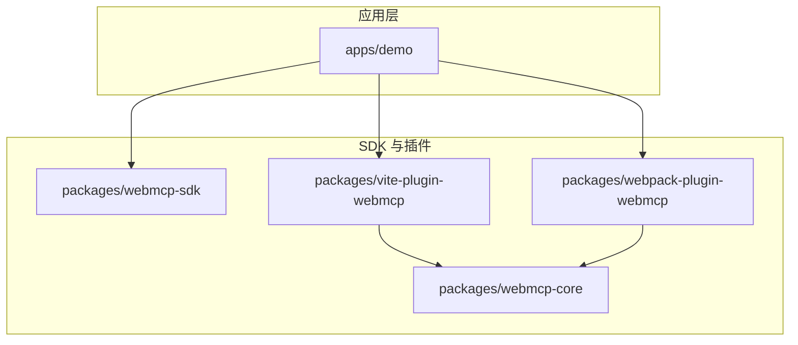
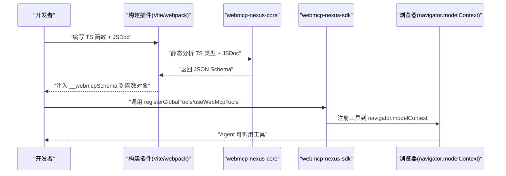
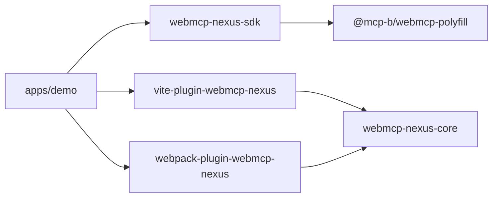

# 快速开始

<cite>
**本文引用的文件**
- [README.md](file://README.md)
- [package.json](file://package.json)
- [apps/demo/package.json](file://apps/demo/package.json)
- [apps/demo/vite.config.ts](file://apps/demo/vite.config.ts)
- [apps/demo/webpack.config.ts](file://apps/demo/webpack.config.ts)
- [apps/demo/src/main.tsx](file://apps/demo/src/main.tsx)
- [packages/webmcp-sdk/src/index.ts](file://packages/webmcp-sdk/src/index.ts)
- [packages/vite-plugin-webmcp/src/index.ts](file://packages/vite-plugin-webmcp/src/index.ts)
- [packages/webpack-plugin-webmcp/src/index.ts](file://packages/webpack-plugin-webmcp/src/index.ts)
- [packages/webmcp-core/package.json](file://packages/webmcp-core/package.json)
- [packages/webmcp-sdk/package.json](file://packages/webmcp-sdk/package.json)
- [packages/vite-plugin-webmcp/package.json](file://packages/vite-plugin-webmcp/package.json)
- [packages/webpack-plugin-webmcp/package.json](file://packages/webpack-plugin-webmcp/package.json)
</cite>

## 目录
1. [简介](#简介)
2. [项目结构](#项目结构)
3. [核心组件](#核心组件)
4. [架构总览](#架构总览)
5. [详细组件分析](#详细组件分析)
6. [依赖分析](#依赖分析)
7. [性能考虑](#性能考虑)
8. [故障排查指南](#故障排查指南)
9. [结论](#结论)
10. [附录](#附录)

## 简介
本指南面向希望在 5 分钟内完成 WebMCP Nexus 集成的新手开发者。你将学到：
- 完整安装步骤（含依赖与构建工具配置）
- Vite 与 Webpack 两种构建工具的配置方法
- 如何编写第一个 WebMCP 工具函数（含 JSDoc 规范）
- 使用 registerGlobalTools 与 useWebMcpTools 进行工具注册
- 开发环境设置、项目结构说明与基本使用流程

## 项目结构
仓库采用 pnpm workspace + monorepo 结构，核心目录与职责如下：
- apps/demo：最佳实践示例（同时支持 Vite 与 Webpack 双构建）
- packages/webmcp-core：构建时核心（TS 类型抽取 + JSON Schema 生成）
- packages/webmcp-sdk：运行时 SDK（2 个 API + Polyfill）
- packages/vite-plugin-webmcp：Vite 构建插件
- packages/webpack-plugin-webmcp：Webpack 构建插件
- skill：面向 AI 编码 Agent 的 Skill 文档

图表来源
- [apps/demo/package.json:1-56](file://apps/demo/package.json#L1-L56)
- [packages/webmcp-sdk/package.json:1-62](file://packages/webmcp-sdk/package.json#L1-L62)
- [packages/vite-plugin-webmcp/package.json:1-59](file://packages/vite-plugin-webmcp/package.json#L1-L59)
- [packages/webpack-plugin-webmcp/package.json:1-56](file://packages/webpack-plugin-webmcp/package.json#L1-L56)
- [packages/webmcp-core/package.json:1-56](file://packages/webmcp-core/package.json#L1-L56)

章节来源
- [README.md:76-89](file://README.md#L76-L89)

## 核心组件
- 运行时 SDK（webmcp-nexus-sdk）
  - 导出两个 API：registerGlobalTools 与 useWebMcpTools
  - 内置 polyfill，自动适配浏览器兼容
- 构建插件（vite-plugin-webmcp-nexus / webpack-plugin-webmcp-nexus）
  - 构建时静态分析 TS 类型 + JSDoc，自动生成 JSON Schema 并注入函数对象
- 核心库（webmcp-nexus-core）
  - 基于 ts-morph 驱动的类型抽取与 Schema 生成

章节来源
- [README.md:47-50](file://README.md#L47-L50)
- [packages/webmcp-sdk/src/index.ts:1-5](file://packages/webmcp-sdk/src/index.ts#L1-L5)
- [packages/webmcp-core/package.json:1-56](file://packages/webmcp-core/package.json#L1-L56)

## 架构总览
下图展示了“编写函数 → 构建插件生成 Schema → SDK 注册到 navigator.modelContext”的端到端流程。

图表来源
- [packages/vite-plugin-webmcp/src/index.ts:55-97](file://packages/vite-plugin-webmcp/src/index.ts#L55-L97)
- [packages/webmcp-sdk/src/index.ts:1-5](file://packages/webmcp-sdk/src/index.ts#L1-L5)
- [README.md:100-177](file://README.md#L100-L177)

## 详细组件分析

### 安装与初始化
- 前置条件：Node.js 18+，推荐使用 pnpm
- 安装运行时 SDK 与构建插件（任选其一）

步骤要点
- 安装运行时 SDK
- 安装 Vite 插件或 Webpack 插件之一
- 在应用入口注册全局工具

章节来源
- [README.md:102-109](file://README.md#L102-L109)
- [README.md:104-109](file://README.md#L104-L109)

### Vite 配置
- 在 vite.config.ts 中添加 vitePluginWebMcp 插件
- include 参数控制扫描范围（默认包含 TS/TSX 文件）

参考路径
- [apps/demo/vite.config.ts:1-17](file://apps/demo/vite.config.ts#L1-L17)

章节来源
- [README.md:113-127](file://README.md#L113-L127)
- [apps/demo/vite.config.ts:1-17](file://apps/demo/vite.config.ts#L1-L17)

### Webpack 配置
- 在 webpack.config.ts 中新增 WebMcpPlugin
- include 参数指定扫描根目录（如 ['src']）

参考路径
- [apps/demo/webpack.config.ts:1-77](file://apps/demo/webpack.config.ts#L1-L77)

章节来源
- [README.md:129-144](file://README.md#L129-L144)
- [apps/demo/webpack.config.ts:1-77](file://apps/demo/webpack.config.ts#L1-L77)

### 编写第一个 WebMCP 工具函数
- 编写普通 TypeScript 函数
- 使用 JSDoc 注释描述参数与行为
- 构建插件会基于 TS 类型与 JSDoc 自动生成 JSON Schema，并注入到函数对象的 __webmcpSchema 字段

参考路径
- [README.md:148-164](file://README.md#L148-L164)

章节来源
- [README.md:148-164](file://README.md#L148-L164)

### 注册工具 API
- 全局注册：registerGlobalTools
  - 适合通用 API（查询、认证、CRUD）
  - 应用启动时注册，生命周期内常驻
- 路由/组件注册：useWebMcpTools
  - 适合当前页面或组件独占的操作
  - 组件卸载时自动注销，避免“幽灵工具”

参考路径
- [README.md:166-177](file://README.md#L166-L177)
- [README.md:186-198](file://README.md#L186-L198)
- [apps/demo/src/main.tsx:1-15](file://apps/demo/src/main.tsx#L1-L15)

章节来源
- [README.md:166-177](file://README.md#L166-L177)
- [README.md:186-198](file://README.md#L186-L198)
- [apps/demo/src/main.tsx:1-15](file://apps/demo/src/main.tsx#L1-L15)

### Vite 插件实现要点
- transform 钩子：对匹配文件进行处理
- include 匹配：支持 glob 模式
- alias 合并：优先用户配置，其次 Vite 默认 alias
- 错误处理：捕获异常并告警

参考路径
- [packages/vite-plugin-webmcp/src/index.ts:39-99](file://packages/vite-plugin-webmcp/src/index.ts#L39-L99)

章节来源
- [packages/vite-plugin-webmcp/src/index.ts:39-99](file://packages/vite-plugin-webmcp/src/index.ts#L39-L99)

### Webpack 插件导出
- 通过 WebMcpPlugin 暴露插件实例
- 与 Vite 插件一致，负责扫描与注入 Schema

参考路径
- [packages/webpack-plugin-webmcp/src/index.ts:1-3](file://packages/webpack-plugin-webmcp/src/index.ts#L1-L3)

章节来源
- [packages/webpack-plugin-webmcp/src/index.ts:1-3](file://packages/webpack-plugin-webmcp/src/index.ts#L1-L3)

### 构建时类型抽取与 Schema 生成
- 由 webmcp-nexus-core 驱动，基于 ts-morph 静态分析
- 输出 JSON Schema 并注入函数对象，运行时由 SDK 读取

参考路径
- [packages/webmcp-core/package.json:1-56](file://packages/webmcp-core/package.json#L1-L56)
- [packages/vite-plugin-webmcp/src/index.ts:10](file://packages/vite-plugin-webmcp/src/index.ts#L10)

章节来源
- [packages/webmcp-core/package.json:1-56](file://packages/webmcp-core/package.json#L1-L56)
- [packages/vite-plugin-webmcp/src/index.ts:10](file://packages/vite-plugin-webmcp/src/index.ts#L10)

### 运行时 SDK 导出
- 导出 registerGlobalTools 与 useWebMcpTools
- 暴露工具类型定义，便于强类型使用

参考路径
- [packages/webmcp-sdk/src/index.ts:1-5](file://packages/webmcp-sdk/src/index.ts#L1-L5)

章节来源
- [packages/webmcp-sdk/src/index.ts:1-5](file://packages/webmcp-sdk/src/index.ts#L1-L5)

## 依赖分析
- 应用层依赖
  - webmcp-nexus-sdk（运行时）
  - vite-plugin-webmcp-nexus 或 webpack-plugin-webmcp-nexus（构建时）
- 插件依赖
  - webmcp-nexus-core（类型抽取与 Schema 生成）
  - webmcp-nexus-sdk（Vite 插件在构建时读取类型信息）
- SDK 依赖
  - @mcp-b/webmcp-polyfill（浏览器兼容）

图表来源
- [apps/demo/package.json:16-55](file://apps/demo/package.json#L16-L55)
- [packages/vite-plugin-webmcp/package.json:46-49](file://packages/vite-plugin-webmcp/package.json#L46-L49)
- [packages/webpack-plugin-webmcp/package.json:44-46](file://packages/webpack-plugin-webmcp/package.json#L44-L46)
- [packages/webmcp-sdk/package.json:46-48](file://packages/webmcp-sdk/package.json#L46-L48)

章节来源
- [apps/demo/package.json:16-55](file://apps/demo/package.json#L16-L55)
- [packages/vite-plugin-webmcp/package.json:46-49](file://packages/vite-plugin-webmcp/package.json#L46-L49)
- [packages/webpack-plugin-webmcp/package.json:44-46](file://packages/webpack-plugin-webmcp/package.json#L44-L46)
- [packages/webmcp-sdk/package.json:46-48](file://packages/webmcp-sdk/package.json#L46-L48)

## 性能考虑
- 构建时生成 Schema，运行时零开销
- HMR 友好：修改函数签名后，Schema 自动重新注册
- 开发模式下关闭压缩，提升调试效率

章节来源
- [README.md:68-70](file://README.md#L68-L70)
- [apps/demo/vite.config.ts:13-15](file://apps/demo/vite.config.ts#L13-L15)
- [apps/demo/webpack.config.ts:65-67](file://apps/demo/webpack.config.ts#L65-L67)

## 故障排查指南
- 构建失败
  - 检查 include 是否正确匹配目标文件
  - 查看插件警告信息，确认是否抛出异常
- 工具未出现在 navigator.modelContext
  - 确认已调用 registerGlobalTools 或在组件中使用 useWebMcpTools
  - 检查函数对象是否包含 __webmcpSchema 注入
- 浏览器兼容问题
  - 确保 SDK 正常加载 polyfill
  - 使用最新版浏览器或具备原生支持的版本

章节来源
- [packages/vite-plugin-webmcp/src/index.ts:55-97](file://packages/vite-plugin-webmcp/src/index.ts#L55-L97)
- [README.md:342-348](file://README.md#L342-L348)

## 结论
通过本指南，你可以在 5 分钟内完成 WebMCP Nexus 的安装与集成：安装依赖、配置构建插件、编写工具函数、注册工具，并在开发环境中验证效果。随后可进一步探索路由/组件级注册与本地 Agent 驱动能力。

## 附录

### 快速清单（5 分钟完成）
- 安装运行时 SDK 与构建插件
  - [README.md:104-109](file://README.md#L104-L109)
- 配置 Vite 插件
  - [apps/demo/vite.config.ts:1-17](file://apps/demo/vite.config.ts#L1-L17)
- 配置 Webpack 插件
  - [apps/demo/webpack.config.ts:1-77](file://apps/demo/webpack.config.ts#L1-L77)
- 编写工具函数（含 JSDoc）
  - [README.md:148-164](file://README.md#L148-L164)
- 注册全局工具
  - [apps/demo/src/main.tsx:1-15](file://apps/demo/src/main.tsx#L1-L15)
- 启动开发服务器
  - [package.json:5-19](file://package.json#L5-L19)