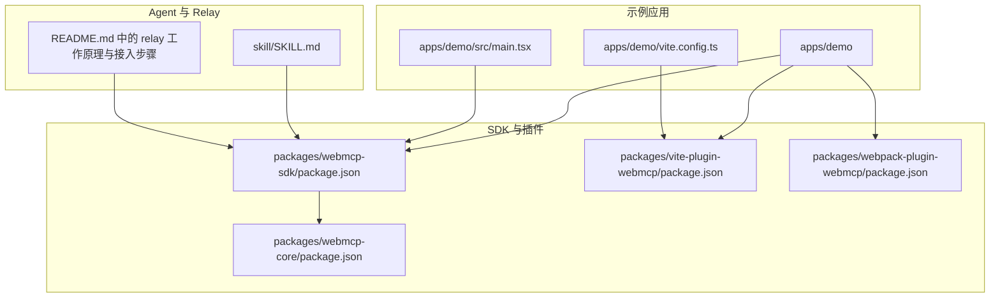
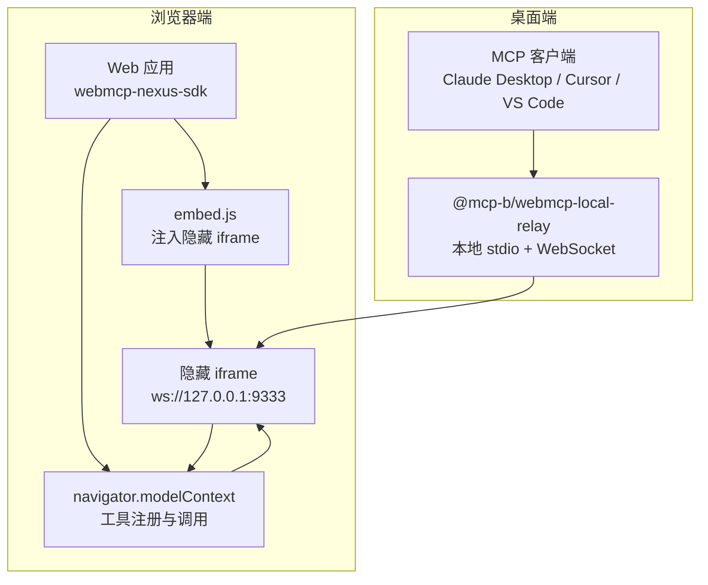
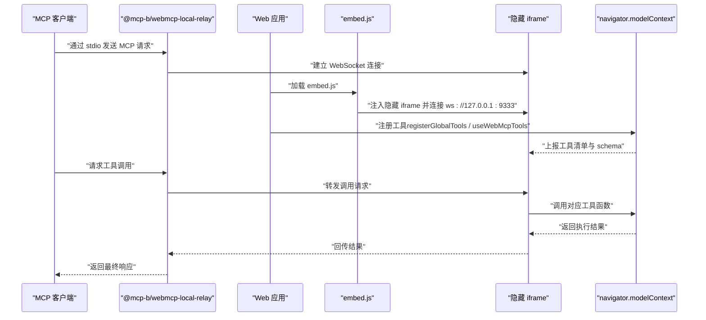
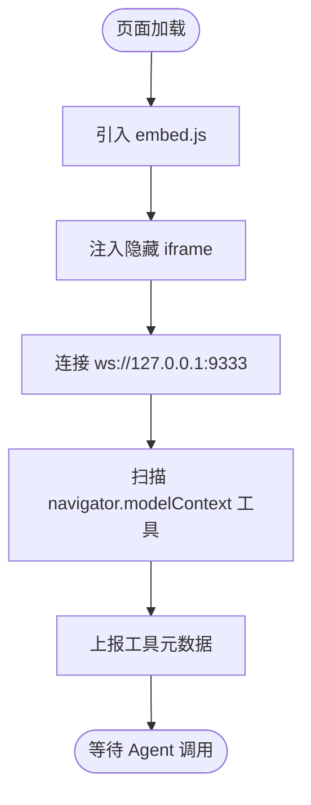
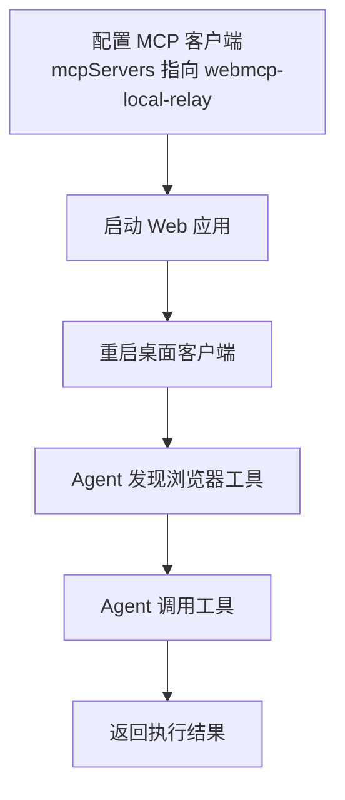
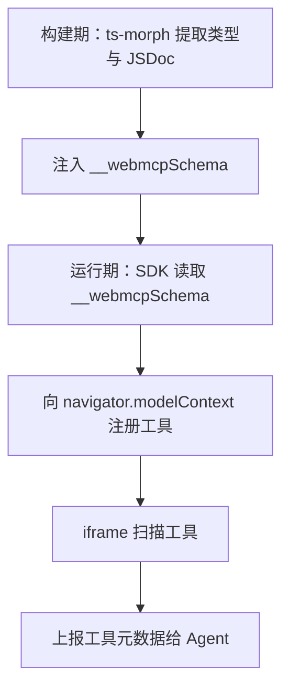
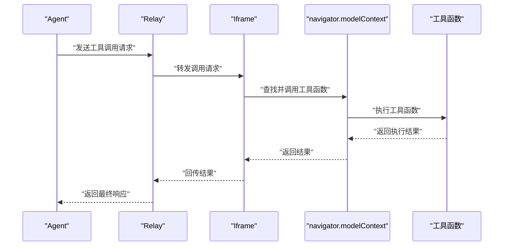
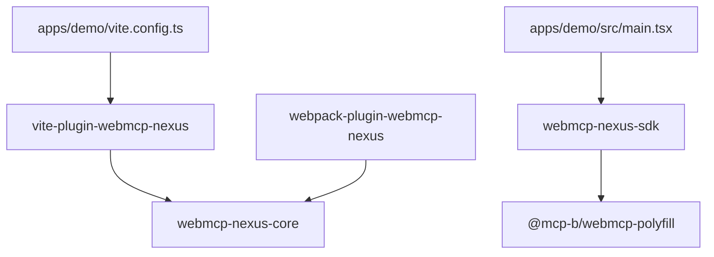

# 本地代理集成

<cite>
**本文引用的文件**
- [README.md](file://README.md)
- [apps/demo/src/main.tsx](file://apps/demo/src/main.tsx)
- [apps/demo/vite.config.ts](file://apps/demo/vite.config.ts)
- [skill/SKILL.md](file://skill/SKILL.md)
- [packages/webmcp-core/package.json](file://packages/webmcp-core/package.json)
- [packages/webmcp-sdk/package.json](file://packages/webmcp-sdk/package.json)
- [packages/vite-plugin-webmcp/package.json](file://packages/vite-plugin-webmcp/package.json)
- [packages/webpack-plugin-webmcp/package.json](file://packages/webpack-plugin-webmcp/package.json)
</cite>

## 目录
1. [简介](#简介)
2. [项目结构](#项目结构)
3. [核心组件](#核心组件)
4. [架构总览](#架构总览)
5. [详细组件分析](#详细组件分析)
6. [依赖关系分析](#依赖关系分析)
7. [性能考虑](#性能考虑)
8. [故障排除指南](#故障排除指南)
9. [结论](#结论)
10. [附录](#附录)

## 简介
本指南面向希望让本地 Agent（如 Claude Desktop、Cursor、VS Code 等 MCP 客户端）直接驱动浏览器中运行的 Web 应用的开发者。项目围绕 WebMCP 标准，提供“零侵入”的前端集成方案：只需在应用中注册工具函数，即可通过 navigator.modelContext 暴露给 Agent；再借助 @mcp-b/webmcp-local-relay 在本地建立 stdio 与 WebSocket 通道，使桌面 Agent 能够与浏览器中的隐藏 iframe 通信，从而实现对 Web 应用的可视化操作。

## 项目结构
该项目采用 monorepo 结构，核心由以下部分组成：
- apps/demo：示例应用，演示全局与组件级工具注册、路由跳转工具等典型模式
- packages/webmcp-core：构建时核心，负责从 TypeScript 类型与 JSDoc 反推 JSON Schema
- packages/webmcp-sdk：运行时 SDK，提供 registerGlobalTools 与 useWebMcpTools 两个 API，并内置 polyfill
- packages/vite-plugin-webmcp 与 packages/webpack-plugin-webmcp：分别对接 Vite 与 Webpack 的构建插件，自动注入 __webmcpSchema
- skill/SKILL.md：面向 AI 编码 Agent 的接入技能文档，指导如何新增/改造工具函数与配置构建插件

**图表来源**
- [README.md](file://README.md)
- [apps/demo/src/main.tsx](file://apps/demo/src/main.tsx)
- [apps/demo/vite.config.ts](file://apps/demo/vite.config.ts)
- [packages/webmcp-sdk/package.json](file://packages/webmcp-sdk/package.json)
- [packages/webmcp-core/package.json](file://packages/webmcp-core/package.json)
- [packages/vite-plugin-webmcp/package.json](file://packages/vite-plugin-webmcp/package.json)
- [packages/webpack-plugin-webmcp/package.json](file://packages/webpack-plugin-webmcp/package.json)
- [skill/SKILL.md](file://skill/SKILL.md)

**章节来源**
- [README.md](file://README.md)
- [apps/demo/src/main.tsx](file://apps/demo/src/main.tsx)
- [apps/demo/vite.config.ts](file://apps/demo/vite.config.ts)
- [packages/webmcp-sdk/package.json](file://packages/webmcp-sdk/package.json)
- [packages/webmcp-core/package.json](file://packages/webmcp-core/package.json)
- [packages/vite-plugin-webmcp/package.json](file://packages/vite-plugin-webmcp/package.json)
- [packages/webpack-plugin-webmcp/package.json](file://packages/webpack-plugin-webmcp/package.json)
- [skill/SKILL.md](file://skill/SKILL.md)

## 核心组件
- 运行时 SDK（webmcp-nexus-sdk）
  - 提供 registerGlobalTools 与 useWebMcpTools 两个 API，覆盖全局、路由、组件三级生命周期
  - 内置 @mcp-b/webmcp-polyfill，自动在不支持 navigator.modelContext 的环境中启用 polyfill
- 构建插件（vite-plugin-webmcp-nexus / webpack-plugin-webmcp-nexus）
  - 基于 ts-morph 静态分析，从 TS 类型与 JSDoc 自动生成 JSON Schema，并注入到函数对象上的 __webmcpSchema 字段
  - 在运行时，SDK 读取 __webmcpSchema 并向 navigator.modelContext 注册工具
- 示例应用（apps/demo）
  - 展示如何在应用入口注册全局工具，以及如何在组件/路由级使用 useWebMcpTools
- Agent 与 Relay（@mcp-b/webmcp-local-relay）
  - 本地以 stdio MCP server 形式运行，同时在 localhost:9333 暴露 WebSocket 端点
  - Web 应用通过加载 embed.js 注入隐藏 iframe，与 relay 建立 WebSocket 连接，并上报 navigator.modelContext 上的工具

**章节来源**
- [README.md](file://README.md)
- [apps/demo/src/main.tsx](file://apps/demo/src/main.tsx)
- [skill/SKILL.md](file://skill/SKILL.md)
- [packages/webmcp-sdk/package.json](file://packages/webmcp-sdk/package.json)
- [packages/webmcp-core/package.json](file://packages/webmcp-core/package.json)
- [packages/vite-plugin-webmcp/package.json](file://packages/vite-plugin-webmcp/package.json)
- [packages/webpack-plugin-webmcp/package.json](file://packages/webpack-plugin-webmcp/package.json)

## 架构总览
下图展示了本地 Agent 驱动 Web 应用的整体架构：桌面 Agent 通过 @mcp-b/webmcp-local-relay 以 stdio 与本地 relay 通信；relay 通过 WebSocket 与页面中的隐藏 iframe 交互；iframe 与 SDK 配合，将 navigator.modelContext 上注册的工具上报给 Agent，并接收 Agent 的工具调用请求。

**图表来源**
- [README.md](file://README.md)

## 详细组件分析

### webmcp-local-relay 工作原理与架构设计
- stdio 通道：MCP 客户端通过 npx 启动 @mcp-b/webmcp-local-relay，作为本地 stdio MCP server
- WebSocket 通道：relay 在本地 9333 端口提供 WebSocket 服务，供页面 iframe 连接
- 隐藏 iframe 注入：embed.js 在页面中注入隐藏 iframe，连接到 ws://127.0.0.1:9333
- 工具上报：iframe 扫描 navigator.modelContext 上的工具，将其名称、描述、参数 schema 等信息上报给桌面 Agent
- 工具调用：Agent 发送工具调用请求，relay 通过 WebSocket 转发至 iframe，iframe 再调用对应工具函数，将结果回传

**图表来源**
- [README.md](file://README.md)

**章节来源**
- [README.md](file://README.md)

### 隐藏 iframe 注入机制与 WebSocket 连接建立
- 页面引入 embed.js：在应用入口 HTML 中追加 script 标签引入 CDN 上的 embed.js
- 自动注入隐藏 iframe：embed.js 在页面中创建隐藏 iframe，连接到本地 relay 的 WebSocket 端点（默认 9333）
- 工具扫描与上报：iframe 启动后扫描 navigator.modelContext 上的工具，将工具元数据上报给 Agent
- 可选属性：可通过 data-relay-port 指定端口，data-request-timeout 调整请求超时

**图表来源**
- [README.md](file://README.md)

**章节来源**
- [README.md](file://README.md)

### MCP 客户端配置与启动流程
- 配置 mcpServers：在 MCP 客户端配置文件中添加 webmcp-local-relay 的 command 与 args，指向 npx 拉起最新版本的 relay
- 启动 Web 应用：运行 pnpm dev 启动示例应用或其他接入了 webmcp-nexus-sdk 的应用
- Agent 侧操作：重启桌面客户端，新会话中即可看到来自浏览器的工具；Agent 可直接调用工具并驱动页面

**图表来源**
- [README.md](file://README.md)

**章节来源**
- [README.md](file://README.md)

### 工具发现与上报机制
- 构建期生成 schema：构建插件通过 ts-morph 从 TS 类型与 JSDoc 生成 JSON Schema，并注入到函数对象的 __webmcpSchema 字段
- 运行期注册：SDK 在浏览器环境检测到 navigator.modelContext 后，读取 __webmcpSchema 并向 navigator.modelContext 注册工具
- iframe 上报：embed.js 注入的 iframe 扫描 navigator.modelContext，将工具名称、描述、参数 schema 等上报给 Agent

**图表来源**
- [README.md](file://README.md)
- [skill/SKILL.md](file://skill/SKILL.md)
- [packages/webmcp-core/package.json](file://packages/webmcp-core/package.json)
- [packages/webmcp-sdk/package.json](file://packages/webmcp-sdk/package.json)

**章节来源**
- [README.md](file://README.md)
- [skill/SKILL.md](file://skill/SKILL.md)
- [packages/webmcp-core/package.json](file://packages/webmcp-core/package.json)
- [packages/webmcp-sdk/package.json](file://packages/webmcp-sdk/package.json)

### 工具调用的执行流程
- Agent 发起调用：Agent 通过 stdio 将工具调用请求发送给 relay
- relay 转发：relay 通过 WebSocket 将请求转发至 iframe
- iframe 调用：iframe 调用 navigator.modelContext 上对应的工具函数
- 结果回传：工具执行完成后，结果经 iframe、relay 回传至 Agent

**图表来源**
- [README.md](file://README.md)

**章节来源**
- [README.md](file://README.md)

### 主流 MCP 客户端配置示例
- Claude Desktop
  - 在 claude_desktop_config.json 中配置 mcpServers，command 指向 npx，args 指向 @mcp-b/webmcp-local-relay@latest
- Cursor
  - MCP 配置方式与 Claude Desktop 类似，差异在于配置文件位置
- VS Code
  - MCP 配置方式与上述类似，差异在于配置文件位置

**章节来源**
- [README.md](file://README.md)

## 依赖关系分析
- webmcp-nexus-sdk 依赖 @mcp-b/webmcp-polyfill，保证在不支持 navigator.modelContext 的环境中也能正常运行
- vite-plugin-webmcp-nexus 与 webpack-plugin-webmcp-nexus 依赖 webmcp-nexus-core，用于从 TS 类型与 JSDoc 生成 JSON Schema
- 示例应用通过 vite.config.ts 引入 vite-plugin-webmcp-nexus，并在入口文件中调用 registerGlobalTools 注册工具

**图表来源**
- [packages/webmcp-sdk/package.json](file://packages/webmcp-sdk/package.json)
- [packages/webmcp-core/package.json](file://packages/webmcp-core/package.json)
- [packages/vite-plugin-webmcp/package.json](file://packages/vite-plugin-webmcp/package.json)
- [packages/webpack-plugin-webmcp/package.json](file://packages/webpack-plugin-webmcp/package.json)
- [apps/demo/vite.config.ts](file://apps/demo/vite.config.ts)
- [apps/demo/src/main.tsx](file://apps/demo/src/main.tsx)

**章节来源**
- [packages/webmcp-sdk/package.json](file://packages/webmcp-sdk/package.json)
- [packages/webmcp-core/package.json](file://packages/webmcp-core/package.json)
- [packages/vite-plugin-webmcp/package.json](file://packages/vite-plugin-webmcp/package.json)
- [packages/webpack-plugin-webmcp/package.json](file://packages/webpack-plugin-webmcp/package.json)
- [apps/demo/vite.config.ts](file://apps/demo/vite.config.ts)
- [apps/demo/src/main.tsx](file://apps/demo/src/main.tsx)

## 性能考虑
- 构建时类型抽取：基于 ts-morph 的静态分析在构建阶段完成，运行时无额外开销
- HMR 友好：开发阶段修改函数签名后，工具 schema 会自动重新注册，无需手动刷新
- 作用域隔离：组件/路由级工具随生命周期挂载/卸载，避免“幽灵工具”污染上下文
- 兼容性：SDK 内置 polyfill，自动在旧环境启用，业务代码零感知

**章节来源**
- [README.md](file://README.md)
- [skill/SKILL.md](file://skill/SKILL.md)

## 故障排除指南
- 工具未显示或调用失败
  - 检查 navigator.modelContext 是否存在（需要宿主环境支持）
  - 确认构建产物中函数带有 __webmcpSchema；若无，检查 MUST 条款（参数必须为单一对象类型、工具函数可被追踪等）
  - 检查 __webmcpSchema.inputSchema.properties 是否被污染（如出现 length、charAt 等原型链字段）
  - 确认入口已调用 registerGlobalTools；组件是否调用 useWebMcpTools
  - 查看浏览器控制台是否有 WebMCP warning
- 端口与超时
  - 如需指定 relay 端口，可在 embed.js 上设置 data-relay-port；如需调整请求超时，设置 data-request-timeout
- 代理与网络
  - 确保本地 9333 端口未被占用；若被占用，可在 MCP 客户端配置中调整 relay 端口

**章节来源**
- [README.md](file://README.md)
- [skill/SKILL.md](file://skill/SKILL.md)

## 结论
通过 webmcp-nexus 与 @mcp-b/webmcp-local-relay 的组合，开发者可以以极低的成本将任意 React 应用变为 MCP 客户端可直接驱动的对象。SDK 的零侵入设计、构建插件的自动化 schema 生成、以及 relay 的本地桥接能力，共同构成了从工具注册到 Agent 调用的完整闭环。按照本文提供的配置步骤与故障排除建议，即可快速完成本地代理集成并稳定运行。

## 附录
- 快速开始
  - 安装 webmcp-nexus-sdk 与构建插件（Vite 或 Webpack）
  - 在应用入口调用 registerGlobalTools 注册全局工具
  - 在页面中引入 embed.js，启动本地 relay，重启桌面客户端即可使用
- 示例应用
  - apps/demo 展示了全局工具注册、组件/路由级工具注册、导航工具等典型模式

**章节来源**
- [README.md](file://README.md)
- [apps/demo/src/main.tsx](file://apps/demo/src/main.tsx)
- [apps/demo/vite.config.ts](file://apps/demo/vite.config.ts)