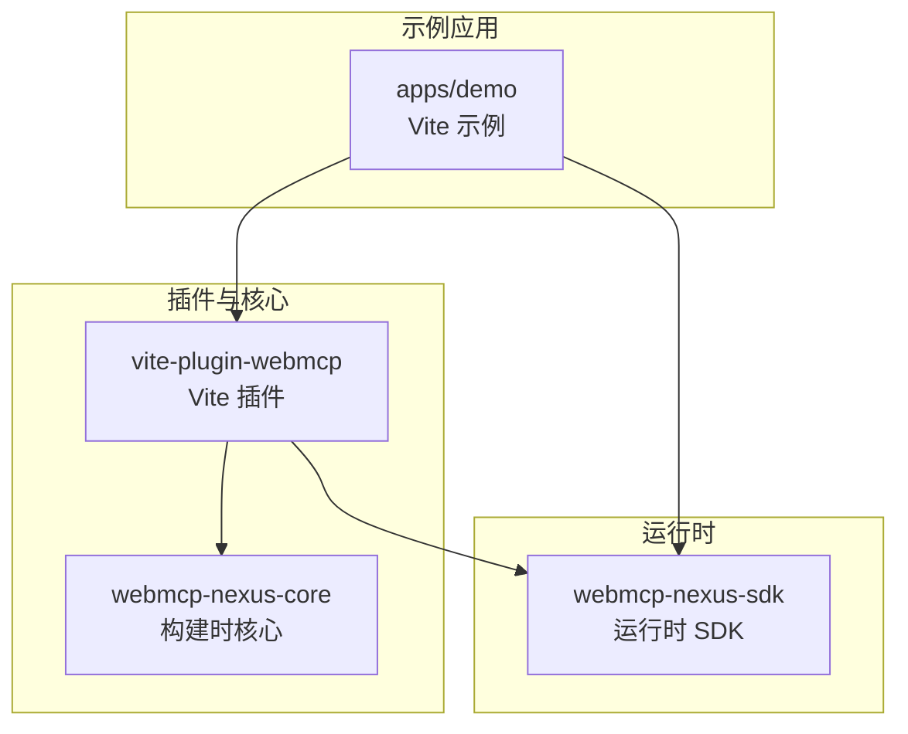
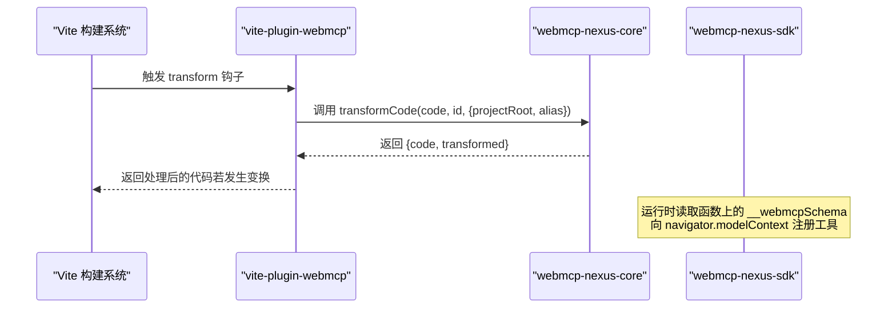
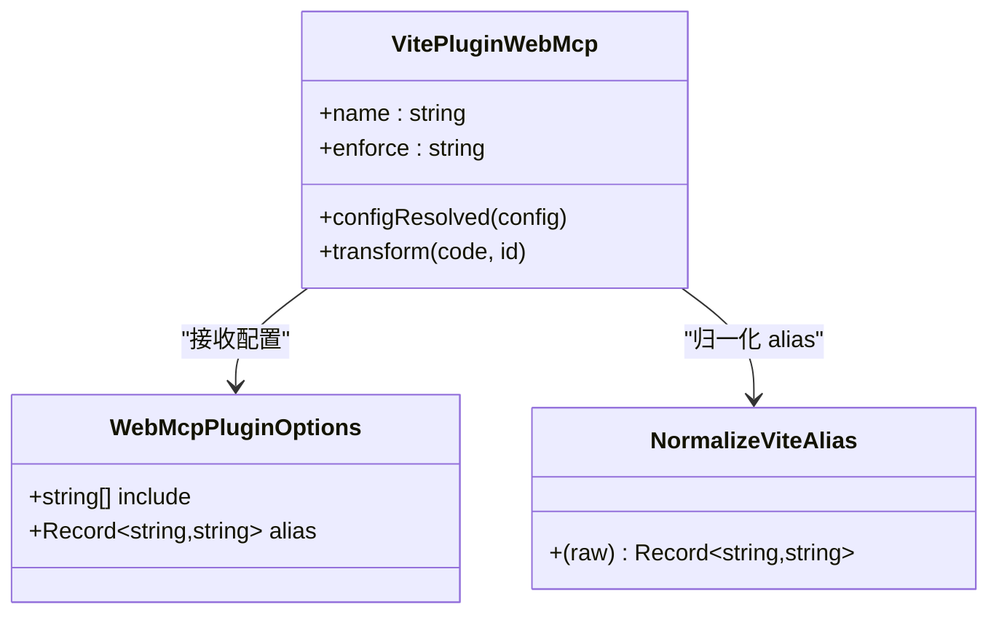
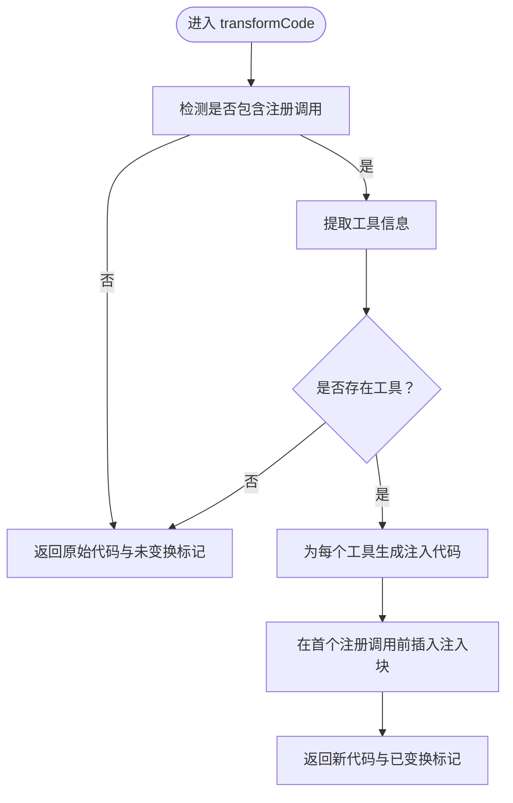
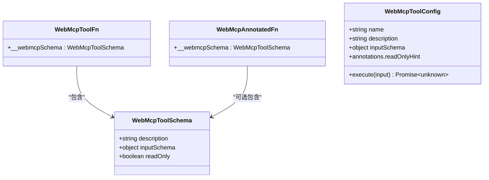
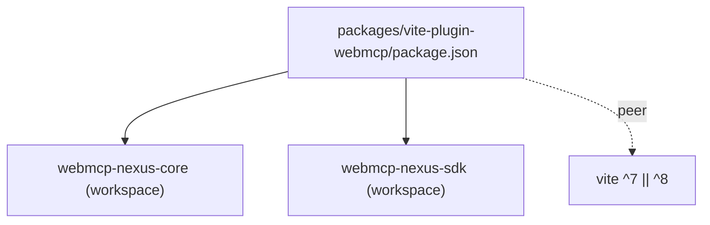

# Vite 构建插件

<cite>
**本文引用的文件**
- [packages/vite-plugin-webmcp/package.json](file://packages/vite-plugin-webmcp/package.json)
- [packages/vite-plugin-webmcp/src/index.ts](file://packages/vite-plugin-webmcp/src/index.ts)
- [packages/vite-plugin-webmcp/README.md](file://packages/vite-plugin-webmcp/README.md)
- [apps/demo/vite.config.ts](file://apps/demo/vite.config.ts)
- [packages/webmcp-core/src/transform.ts](file://packages/webmcp-core/src/transform.ts)
- [packages/webmcp-sdk/src/types.ts](file://packages/webmcp-sdk/src/types.ts)
- [README.md](file://README.md)
- [package.json](file://package.json)
</cite>

## 目录
1. [简介](#简介)
2. [项目结构](#项目结构)
3. [核心组件](#核心组件)
4. [架构总览](#架构总览)
5. [详细组件分析](#详细组件分析)
6. [依赖关系分析](#依赖关系分析)
7. [性能考虑](#性能考虑)
8. [故障排查指南](#故障排查指南)
9. [结论](#结论)
10. [附录](#附录)

## 简介
本指南面向希望在 Vite 项目中使用 WebMCP Nexus 的 Vite 构建插件的开发者。插件通过 Vite 的 transform 钩子，在构建时自动从 TypeScript 类型与 JSDoc 注释中反推 JSON Schema，并将元数据注入到工具函数的 __webmcpSchema 属性中，从而实现“零侵入”的工具注册与运行时无缝对接。

- 插件名称与版本：vite-plugin-webmcp-nexus
- 作用：在构建阶段静态分析 TS 类型 + JSDoc，生成 JSON Schema 并注入函数对象
- 运行时配合：webmcp-nexus-sdk（提供 registerGlobalTools/useWebMcpTools 等 API）

章节来源
- [packages/vite-plugin-webmcp/README.md:29-34](file://packages/vite-plugin-webmcp/README.md#L29-L34)
- [README.md:45-52](file://README.md#L45-L52)

## 项目结构
本仓库采用 pnpm workspace 的 monorepo 结构，Vite 插件位于 packages/vite-plugin-webmcp，核心逻辑位于 packages/webmcp-core，运行时 SDK 位于 packages/webmcp-sdk，示例应用位于 apps/demo。

图表来源
- [packages/vite-plugin-webmcp/package.json:1-59](file://packages/vite-plugin-webmcp/package.json#L1-L59)
- [packages/webmcp-core/src/transform.ts:1-79](file://packages/webmcp-core/src/transform.ts#L1-L79)
- [packages/webmcp-sdk/src/types.ts:1-48](file://packages/webmcp-sdk/src/types.ts#L1-L48)
- [apps/demo/vite.config.ts:1-17](file://apps/demo/vite.config.ts#L1-L17)

章节来源
- [README.md:76-89](file://README.md#L76-L89)
- [package.json:1-38](file://package.json#L1-L38)

## 核心组件
- 插件入口与配置
  - 插件导出函数：vitePluginWebMcp(options)
  - 配置项：
    - include：字符串数组，Glob 模式，默认扫描 src 下的 ts/tsx 文件
    - alias：Record<string,string>，额外的模块路径 alias，优先级高于 Vite 默认 alias
- 生命周期钩子
  - configResolved：收集 Vite 解析后的 alias，并与用户 alias 合并
  - transform：对匹配的文件执行类型分析与注入
- 与核心库协作
  - 调用 webmcp-nexus-core 的 transformCode，传入 projectRoot 与 alias
  - 若发生变换，返回新的代码；否则返回空，表示未处理

章节来源
- [packages/vite-plugin-webmcp/src/index.ts:14-22](file://packages/vite-plugin-webmcp/src/index.ts#L14-L22)
- [packages/vite-plugin-webmcp/src/index.ts:39-99](file://packages/vite-plugin-webmcp/src/index.ts#L39-L99)
- [packages/webmcp-core/src/transform.ts:31-79](file://packages/webmcp-core/src/transform.ts#L31-L79)

## 架构总览
下图展示了 Vite 插件如何在构建时与核心库协作，以及与运行时 SDK 的关系。

图表来源
- [packages/vite-plugin-webmcp/src/index.ts:55-97](file://packages/vite-plugin-webmcp/src/index.ts#L55-L97)
- [packages/webmcp-core/src/transform.ts:31-79](file://packages/webmcp-core/src/transform.ts#L31-L79)

## 详细组件分析

### 插件类与接口
- WebMcpPluginOptions
  - include：字符串数组，Glob 模式，决定扫描范围
  - alias：Record<string,string>，用于解析 import * as api from '@alias/xxx' 形式的模块说明符
- normalizeViteAlias
  - 将 Vite 的 ResolvedConfig.resolve.alias 归一化为 Record<string,string>，仅处理字符串形式的 find/replacement
- vitePluginWebMcp
  - enforce: 'pre'，确保在其他插件之前执行
  - configResolved：保存 projectRoot，合并 alias
  - transform：匹配 include，调用 transformCode，注入 __webmcpSchema

图表来源
- [packages/vite-plugin-webmcp/src/index.ts:14-37](file://packages/vite-plugin-webmcp/src/index.ts#L14-L37)
- [packages/vite-plugin-webmcp/src/index.ts:39-99](file://packages/vite-plugin-webmcp/src/index.ts#L39-L99)

章节来源
- [packages/vite-plugin-webmcp/src/index.ts:14-37](file://packages/vite-plugin-webmcp/src/index.ts#L14-L37)
- [packages/vite-plugin-webmcp/src/index.ts:39-99](file://packages/vite-plugin-webmcp/src/index.ts#L39-L99)

### 核心库 transform 流程
- transformCode
  - 快速检测：若源码不含注册调用，则直接返回未变换
  - 提取工具：调用 extractToolsFromFile 获取工具集合
  - 生成注入代码：对每个工具生成 __webmcpSchema 注入代码
  - 插入时机：在首个注册调用之前插入注入块
  - 返回：新代码与 transformed 标记

图表来源
- [packages/webmcp-core/src/transform.ts:31-79](file://packages/webmcp-core/src/transform.ts#L31-L79)

章节来源
- [packages/webmcp-core/src/transform.ts:31-79](file://packages/webmcp-core/src/transform.ts#L31-L79)

### 运行时类型与 SDK 集成
- WebMcpToolSchema：描述工具的元数据（description、inputSchema、readOnly）
- WebMcpToolFn/WebMcpAnnotatedFn：带有 __webmcpSchema 的函数类型
- WebMcpToolConfig：传递给 navigator.modelContext.registerTool 的配置

图表来源
- [packages/webmcp-sdk/src/types.ts:3-42](file://packages/webmcp-sdk/src/types.ts#L3-L42)

章节来源
- [packages/webmcp-sdk/src/types.ts:3-42](file://packages/webmcp-sdk/src/types.ts#L3-L42)

### 配置与使用示例
- 安装
  - 插件：vite-plugin-webmcp-nexus
  - 运行时 SDK：webmcp-nexus-sdk
- 基础配置
  - 在 vite.config.ts 中添加插件，并设置 include
- include/exclude 与自定义路径映射
  - include：支持 Glob 模式，默认扫描 src 下的 ts/tsx
  - alias：合并 Vite 默认 alias 与用户自定义 alias，优先用户配置
- 开发/生产环境差异
  - 开发：开启 HMR，插件会在热更新时重新分析与注入
  - 生产：minify 可按需关闭以便调试，或按项目需求开启压缩

章节来源
- [packages/vite-plugin-webmcp/README.md:53-71](file://packages/vite-plugin-webmcp/README.md#L53-L71)
- [apps/demo/vite.config.ts:1-17](file://apps/demo/vite.config.ts#L1-L17)
- [packages/vite-plugin-webmcp/src/index.ts:40-53](file://packages/vite-plugin-webmcp/src/index.ts#L40-L53)

### 与 Vite 生态的集成与兼容性
- 与其他插件共存
  - 插件设置 enforce: 'pre'，确保在其他插件之前执行，减少相互影响
  - 与 @vitejs/plugin-react 等常用插件组合使用
- HMR 集成
  - 插件在 transform 钩子中处理文件，Vite 的 HMR 会触发重新 transform，实现工具 schema 的自动重建
- 路径别名
  - 自动读取 Vite 的 resolve.alias，并允许用户额外配置，提升复杂项目的可维护性

章节来源
- [packages/vite-plugin-webmcp/src/index.ts:46](file://packages/vite-plugin-webmcp/src/index.ts#L46)
- [packages/vite-plugin-webmcp/src/index.ts:28-37](file://packages/vite-plugin-webmcp/src/index.ts#L28-L37)
- [README.md:69](file://README.md#L69)

## 依赖关系分析
- 插件依赖
  - webmcp-nexus-core：提供 transformCode 能力
  - webmcp-nexus-sdk：运行时 SDK，负责工具注册
  - peerDependencies：vite ^7 || ^8
- 工作区依赖
  - 通过 workspace:* 引用本地核心与 SDK 包

图表来源
- [packages/vite-plugin-webmcp/package.json:46-57](file://packages/vite-plugin-webmcp/package.json#L46-L57)

章节来源
- [packages/vite-plugin-webmcp/package.json:46-57](file://packages/vite-plugin-webmcp/package.json#L46-L57)

## 性能考虑
- include 精准匹配
  - 通过合理的 include 设置，缩小扫描范围，降低 transform 钩子的处理量
- alias 合并策略
  - 利用 normalizeViteAlias 仅处理字符串形式的 alias，避免正则导致的不可预测匹配
- 调试与日志
  - 设置 DEBUG=webmcp 可查看 transform 处理日志，便于定位性能瓶颈与异常
- 构建时间优化
  - 在大型项目中，优先将工具集中在特定目录，结合 include 精确扫描
  - 避免对不涉及 WebMCP 工具的文件执行 transform（插件内部已做快速检测与匹配）

章节来源
- [packages/vite-plugin-webmcp/src/index.ts:28-37](file://packages/vite-plugin-webmcp/src/index.ts#L28-L37)
- [packages/vite-plugin-webmcp/src/index.ts:55-97](file://packages/vite-plugin-webmcp/src/index.ts#L55-L97)
- [packages/vite-plugin-webmcp/README.md:148](file://packages/vite-plugin-webmcp/README.md#L148)

## 故障排查指南
- 插件未生效
  - 检查是否正确在 vite.config.ts 中添加插件与 include 配置
  - 确认目标工具函数确实存在于 include 范围内
- 工具未注册到 SDK
  - 确保运行时已调用 registerGlobalTools/useWebMcpTools，并传入包含工具的对象
  - 检查 __webmcpSchema 是否被注入（可通过调试日志确认）
- 路径别名解析失败
  - 检查 alias 配置是否正确，注意仅字符串形式的 find/replacement 会被归一化
- HMR 未触发或注入不更新
  - 确认修改的是工具函数签名或 JSDoc，且文件路径在 include 范围内
  - 查看控制台 DEBUG 日志，确认 transform 正常执行

章节来源
- [apps/demo/vite.config.ts:7-12](file://apps/demo/vite.config.ts#L7-L12)
- [packages/vite-plugin-webmcp/src/index.ts:74-94](file://packages/vite-plugin-webmcp/src/index.ts#L74-L94)
- [packages/webmcp-sdk/src/types.ts:3-42](file://packages/webmcp-sdk/src/types.ts#L3-L42)

## 结论
vite-plugin-webmcp-nexus 通过在构建阶段静态分析 TypeScript 类型与 JSDoc，将 JSON Schema 注入到工具函数的 __webmcpSchema 属性中，实现了“零侵入”的工具注册。配合 webmcp-nexus-sdk，开发者可以在运行时将工具注册到 navigator.modelContext，从而被 MCP 客户端直接调用。插件具备良好的 HMR 友好性、灵活的 include/exclude 与 alias 配置，并与 Vite 生态高度兼容。

## 附录

### 配置参考清单
- 安装命令
  - 插件：vite-plugin-webmcp-nexus
  - 运行时 SDK：webmcp-nexus-sdk
- 基础配置要点
  - 在 vite.config.ts 中添加插件并设置 include
  - include 默认扫描 src 下的 ts/tsx 文件
  - alias 合并 Vite 默认 alias 与用户自定义 alias
- 开发/生产环境建议
  - 开发：开启 HMR，便于频繁修改工具签名后自动重建
  - 生产：根据需要开启压缩，必要时关闭 minify 以便调试

章节来源
- [packages/vite-plugin-webmcp/README.md:53-71](file://packages/vite-plugin-webmcp/README.md#L53-L71)
- [apps/demo/vite.config.ts:1-17](file://apps/demo/vite.config.ts#L1-L17)
- [README.md:69](file://README.md#L69)