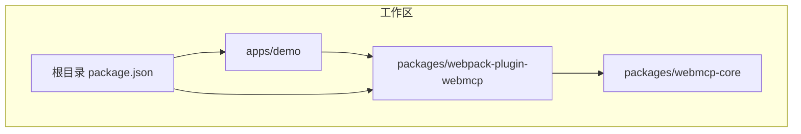
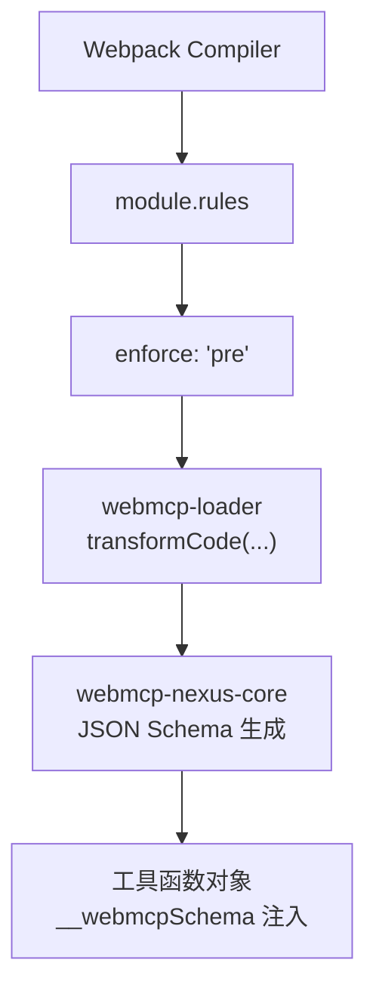
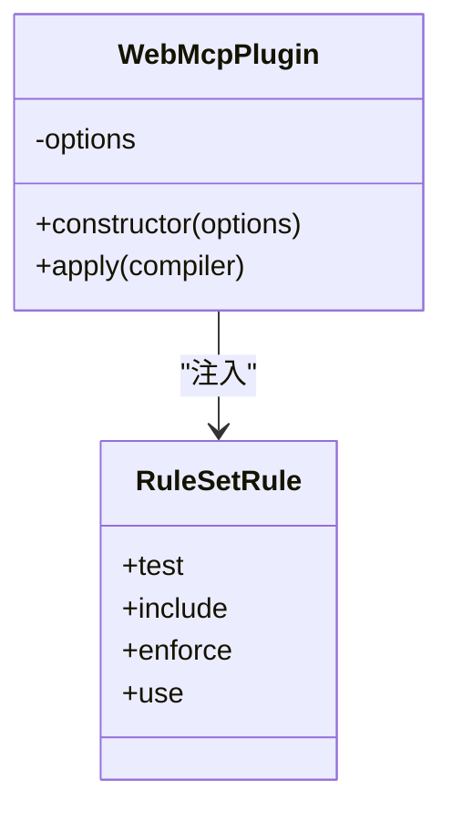
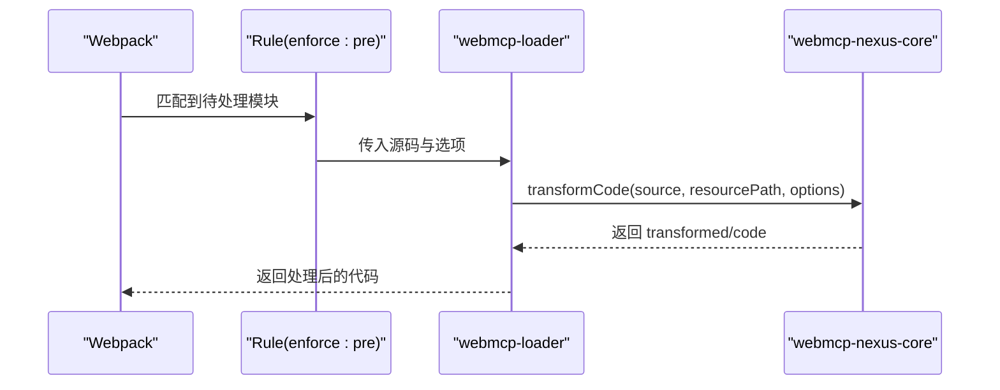
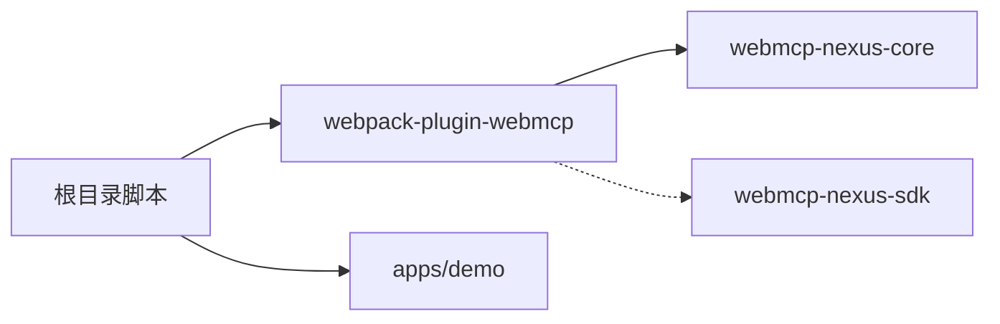

# Webpack 构建插件

<cite>
**本文引用的文件**
- [packages/webpack-plugin-webmcp/package.json](file://packages/webpack-plugin-webmcp/package.json)
- [packages/webpack-plugin-webmcp/README.md](file://packages/webpack-plugin-webmcp/README.md)
- [packages/webpack-plugin-webmcp/src/index.ts](file://packages/webpack-plugin-webmcp/src/index.ts)
- [packages/webpack-plugin-webmcp/src/plugin.ts](file://packages/webpack-plugin-webmcp/src/plugin.ts)
- [packages/webpack-plugin-webmcp/src/loader.ts](file://packages/webpack-plugin-webmcp/src/loader.ts)
- [packages/webpack-plugin-webmcp/src/resolve-loader.ts](file://packages/webpack-plugin-webmcp/src/resolve-loader.ts)
- [packages/webmcp-core/package.json](file://packages/webmcp-core/package.json)
- [apps/demo/webpack.config.ts](file://apps/demo/webpack.config.ts)
- [package.json](file://package.json)
</cite>

## 目录
1. [简介](#简介)
2. [项目结构](#项目结构)
3. [核心组件](#核心组件)
4. [架构总览](#架构总览)
5. [详细组件分析](#详细组件分析)
6. [依赖关系分析](#依赖关系分析)
7. [性能考虑](#性能考虑)
8. [故障排除指南](#故障排除指南)
9. [结论](#结论)
10. [附录](#附录)

## 简介
本插件是 WebMCP Nexus 工具链的 Webpack 构建插件，目标是在构建阶段自动从 TypeScript 源码中提取类型信息与 JSDoc 注释，反推出 JSON Schema，并将其以 __webmcpSchema 字段注入到工具函数对象中。运行时由 webmcp-nexus-sdk 读取该字段完成注册，从而实现“类型即 Schema”的零侵入式工具声明与注册。

- 支持 Webpack 5+
- 自动注入 pre-enforce loader，无需手动配置 use
- 自动合并 Webpack resolve.alias 与用户别名配置
- 仅扫描 include 指定的目录，避免无关文件参与处理
- 零运行时开销，所有工作在构建期完成

## 项目结构
该仓库采用多包工作区布局，与本插件相关的目录与职责如下：
- packages/webpack-plugin-webmcp：Webpack 构建插件实现与导出入口
- packages/webmcp-core：构建期核心逻辑（TS 类型抽取与 JSON Schema 生成）
- apps/demo：演示应用，包含基于 Webpack 的配置示例
- 根目录 package.json：工作区脚本与统一管理

图表来源
- [packages/webpack-plugin-webmcp/package.json:1-56](file://packages/webpack-plugin-webmcp/package.json#L1-L56)
- [packages/webmcp-core/package.json:1-56](file://packages/webmcp-core/package.json#L1-L56)
- [apps/demo/webpack.config.ts:1-77](file://apps/demo/webpack.config.ts#L1-L77)
- [package.json:1-38](file://package.json#L1-L38)

章节来源
- [packages/webpack-plugin-webmcp/package.json:1-56](file://packages/webpack-plugin-webmcp/package.json#L1-L56)
- [apps/demo/webpack.config.ts:1-77](file://apps/demo/webpack.config.ts#L1-L77)
- [package.json:1-38](file://package.json#L1-L38)

## 核心组件
- 插件类 WebMcpPlugin：负责在 Webpack 生命周期中注入 loader 规则，合并 alias，并预留全局扩展点
- Loader：对单个模块进行转换，调用 webmcp-nexus-core 的 transformCode，将生成的 __webmcpSchema 注入到函数对象
- 导出入口：index.ts 提供插件类与类型导出
- Loader 路径解析：resolve-loader.ts 保证在不同打包模式下都能正确解析到内置 loader

章节来源
- [packages/webpack-plugin-webmcp/src/plugin.ts:47-89](file://packages/webpack-plugin-webmcp/src/plugin.ts#L47-L89)
- [packages/webpack-plugin-webmcp/src/loader.ts:11-44](file://packages/webpack-plugin-webmcp/src/loader.ts#L11-L44)
- [packages/webpack-plugin-webmcp/src/index.ts:1-3](file://packages/webpack-plugin-webmcp/src/index.ts#L1-L3)
- [packages/webpack-plugin-webmcp/src/resolve-loader.ts:1-8](file://packages/webpack-plugin-webmcp/src/resolve-loader.ts#L1-L8)

## 架构总览
下图展示了 Webpack 插件如何在构建生命周期中注入 loader，并与核心库协作生成 JSON Schema：

图表来源
- [packages/webpack-plugin-webmcp/src/plugin.ts:60-87](file://packages/webpack-plugin-webmcp/src/plugin.ts#L60-L87)
- [packages/webpack-plugin-webmcp/src/loader.ts:22-26](file://packages/webpack-plugin-webmcp/src/loader.ts#L22-L26)
- [packages/webmcp-core/package.json:1-56](file://packages/webmcp-core/package.json#L1-L56)

## 详细组件分析

### 插件类 WebMcpPlugin
- 职责
  - 在 apply 中读取 compiler.context 作为项目根
  - 解析内置 loader 绝对路径
  - 合并 Webpack resolve.alias 与用户 alias（用户配置优先）
  - 将规则以 enforce: 'pre' 注入 module.rules
  - 预留 compiler.hooks.done 扩展点
- 关键行为
  - include 路径支持相对路径与绝对路径，内部统一转为绝对路径前缀匹配
  - test 默认匹配 JS/TS/JSX/TSX 文件
  - alias 合并策略：先归一化 Webpack alias，再与用户 alias 合并，用户 alias 覆盖

图表来源
- [packages/webpack-plugin-webmcp/src/plugin.ts:47-89](file://packages/webpack-plugin-webmcp/src/plugin.ts#L47-L89)

章节来源
- [packages/webpack-plugin-webmcp/src/plugin.ts:47-89](file://packages/webpack-plugin-webmcp/src/plugin.ts#L47-L89)

### Loader：webmcp-loader
- 职责
  - 接收源码与上下文参数（projectRoot、alias）
  - 调用 transformCode 生成带 __webmcpSchema 的代码
  - 失败时发出 warning，便于定位问题
- 调试
  - 通过环境变量开启调试日志，输出处理文件与错误详情

图表来源
- [packages/webpack-plugin-webmcp/src/loader.ts:11-44](file://packages/webpack-plugin-webmcp/src/loader.ts#L11-L44)
- [packages/webmcp-core/package.json:1-56](file://packages/webmcp-core/package.json#L1-L56)

章节来源
- [packages/webpack-plugin-webmcp/src/loader.ts:11-44](file://packages/webpack-plugin-webmcp/src/loader.ts#L11-L44)

### 配置选项与集成方式
- 插件配置项
  - test：文件匹配正则，默认匹配 JS/TS/JSX/TSX
  - include：包含目录列表（相对路径会按 compiler.context 解析为绝对路径前缀）
  - alias：额外模块别名映射，将合并到 Webpack resolve.alias 之上
- 与 Webpack 5+ 的兼容性
  - 通过 compiler.options.module.rules 注入，无需手动维护 use 数组
  - enforce: 'pre' 确保在其他 loader 前执行
- 与现有配置的集成
  - 不需要改动现有 module.rules.use
  - include 仅影响扫描范围，不影响其他 loader 的执行顺序
- 开发与生产环境差异
  - 可通过 DefinePlugin 注入环境常量
  - 生产环境可启用压缩与缓存策略，插件本身保持不变

章节来源
- [packages/webpack-plugin-webmcp/README.md:137-168](file://packages/webpack-plugin-webmcp/README.md#L137-L168)
- [packages/webpack-plugin-webmcp/src/plugin.ts:52-80](file://packages/webpack-plugin-webmcp/src/plugin.ts#L52-L80)
- [apps/demo/webpack.config.ts:54-63](file://apps/demo/webpack.config.ts#L54-L63)

### 执行时机与生命周期
- 注入时机：在插件 apply 中立即向 compiler.options.module.rules 推入新规则
- 执行顺序：由于 enforce: 'pre'，该 loader 在其他 loader 之前执行
- 扩展点：compiler.hooks.done 预留未来能力（如冲突检测、manifest 生成）

章节来源
- [packages/webpack-plugin-webmcp/src/plugin.ts:60-87](file://packages/webpack-plugin-webmcp/src/plugin.ts#L60-L87)

### 与现有 Webpack 配置的集成指南与迁移建议
- 迁移步骤
  - 移除手动维护的 use 数组中与本插件相关的重复配置
  - 将扫描范围收敛到 include 指定的目录
  - 如需解析特定别名，优先在 Webpack resolve.alias 中配置，插件会自动合并
- 最佳实践
  - include 使用绝对路径前缀，避免 glob
  - alias 仅添加必要条目，减少扫描与解析负担
  - 保持其他 loader 的顺序不变，插件不会改变它们的执行顺序

章节来源
- [packages/webpack-plugin-webmcp/README.md:167-168](file://packages/webpack-plugin-webmcp/README.md#L167-L168)
- [packages/webpack-plugin-webmcp/src/plugin.ts:67-78](file://packages/webpack-plugin-webmcp/src/plugin.ts#L67-L78)

### 完整配置示例（路径引用）
- 开发环境示例（Webpack）
  - 参考：[apps/demo/webpack.config.ts:10-77](file://apps/demo/webpack.config.ts#L10-L77)
- 插件基础用法（路径引用）
  - 参考：[packages/webpack-plugin-webmcp/README.md:74-104](file://packages/webpack-plugin-webmcp/README.md#L74-L104)
- 完整选项示例（路径引用）
  - 参考：[packages/webpack-plugin-webmcp/README.md:155-165](file://packages/webpack-plugin-webmcp/README.md#L155-L165)

## 依赖关系分析
- 内部依赖
  - packages/webpack-plugin-webmcp 依赖 webmcp-nexus-core（构建期核心）
- 外部依赖
  - peerDependencies: webpack ^5.0.0
  - 运行时 SDK：webmcp-nexus-sdk（用于运行时注册）
- 工作区脚本
  - 根目录提供统一构建、测试、发布脚本，便于多包协同

图表来源
- [packages/webpack-plugin-webmcp/package.json:44-54](file://packages/webpack-plugin-webmcp/package.json#L44-L54)
- [packages/webmcp-core/package.json:1-56](file://packages/webmcp-core/package.json#L1-L56)
- [package.json:5-20](file://package.json#L5-L20)

章节来源
- [packages/webpack-plugin-webmcp/package.json:44-54](file://packages/webpack-plugin-webmcp/package.json#L44-L54)
- [package.json:5-20](file://package.json#L5-L20)

## 性能考虑
- 构建期开销
  - 仅在构建阶段执行，运行时无额外开销
  - include 精确控制扫描范围，避免无关文件参与处理
- 与现有 loader 的配合
  - enforce: 'pre' 保证在编译前完成 Schema 注入
  - 不影响其他 loader 的执行顺序与缓存命中
- 内存与速度优化建议
  - 尽量缩小 include 范围，仅包含工具函数所在目录
  - 合理配置 alias，减少模块解析层级
  - 在大型项目中，结合 Webpack 缓存与并行构建提升整体效率

## 故障排除指南
- 常见问题
  - 工具函数未注入 __webmcpSchema
    - 检查 include 是否覆盖到对应目录
    - 确认文件扩展名匹配 test 正则
    - 查看 loader 警告信息（transform 失败时会发出 warning）
  - 别名解析失败
    - 确认 resolve.alias 与用户 alias 合并是否正确
    - 用户 alias 会覆盖 Webpack alias，确保路径指向正确位置
  - 调试与诊断
    - 设置调试环境变量以输出处理日志
    - 结合 DefinePlugin 注入的环境常量定位问题
- 相关实现参考
  - 警告机制与调试开关：[packages/webpack-plugin-webmcp/src/loader.ts:18-40](file://packages/webpack-plugin-webmcp/src/loader.ts#L18-L40)
  - alias 合并与归一化：[packages/webpack-plugin-webmcp/src/plugin.ts:23-45](file://packages/webpack-plugin-webmcp/src/plugin.ts#L23-L45)

章节来源
- [packages/webpack-plugin-webmcp/src/loader.ts:18-40](file://packages/webpack-plugin-webmcp/src/loader.ts#L18-L40)
- [packages/webpack-plugin-webmcp/src/plugin.ts:23-45](file://packages/webpack-plugin-webmcp/src/plugin.ts#L23-L45)

## 结论
本插件通过在 Webpack 5+ 中自动注入 pre-enforce loader，在构建期完成从 TypeScript 类型与 JSDoc 到 JSON Schema 的生成与注入，实现了“零侵入、零运行时开销”的工具声明与注册方案。配合 webmcp-nexus-sdk，可在运行时无缝完成工具注册，适用于现代前端工程的 AI 工具链集成场景。

## 附录
- 快速开始与示例
  - 插件基础用法与示例配置：[packages/webpack-plugin-webmcp/README.md:72-136](file://packages/webpack-plugin-webmcp/README.md#L72-L136)
  - 演示应用的 Webpack 配置：[apps/demo/webpack.config.ts:10-77](file://apps/demo/webpack.config.ts#L10-L77)
- 类型与导出
  - 插件类与类型导出入口：[packages/webpack-plugin-webmcp/src/index.ts:1-3](file://packages/webpack-plugin-webmcp/src/index.ts#L1-L3)
- 核心库与生态
  - 构建期核心库：[packages/webmcp-core/package.json:1-56](file://packages/webmcp-core/package.json#L1-L56)
  - 运行时 SDK：[packages/webpack-plugin-webmcp/README.md:169-176](file://packages/webpack-plugin-webmcp/README.md#L169-L176)