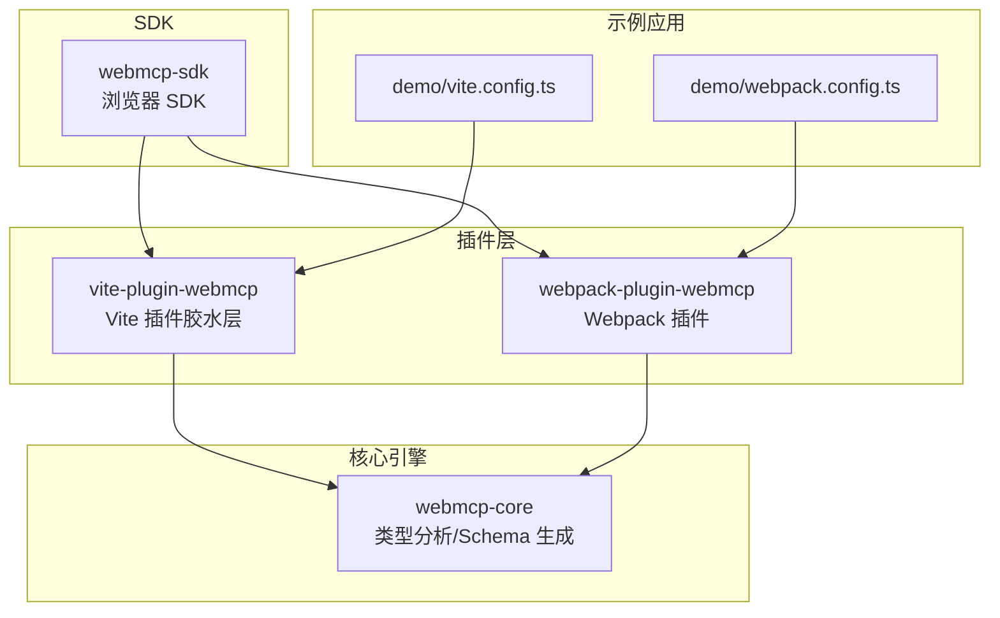
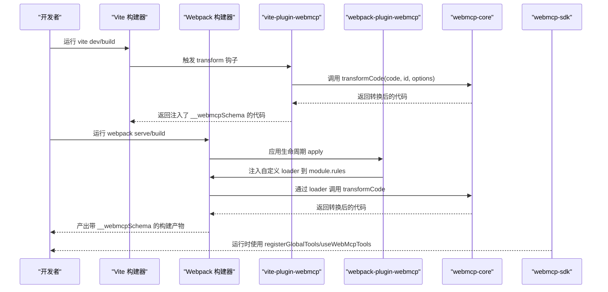
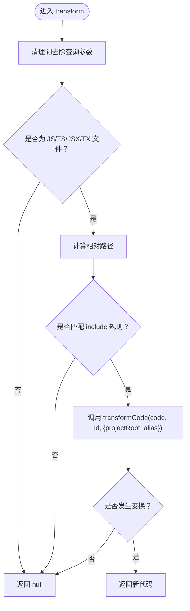
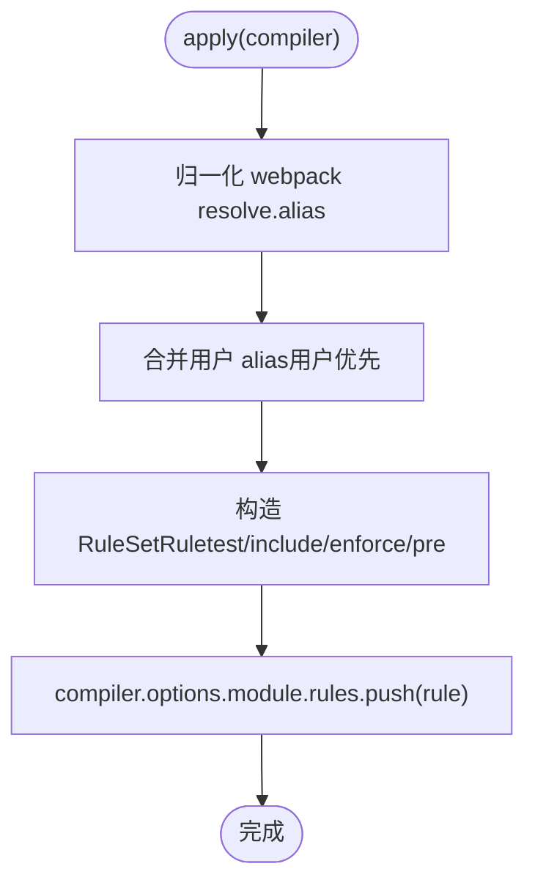
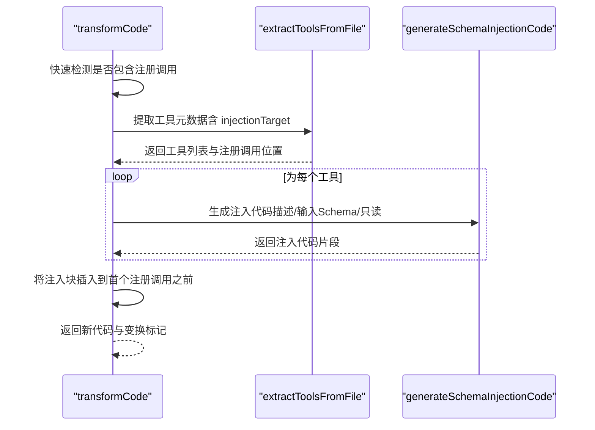
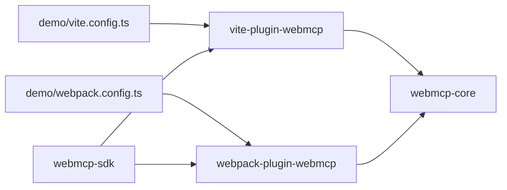

# 构建插件

<cite>
**本文档引用的文件**
- [packages/vite-plugin-webmcp/package.json](file://packages/vite-plugin-webmcp/package.json)
- [packages/webmcp-core/package.json](file://packages/webmcp-core/package.json)
- [packages/webpack-plugin-webmcp/package.json](file://packages/webpack-plugin-webmcp/package.json)
- [packages/webmcp-sdk/package.json](file://packages/webmcp-sdk/package.json)
- [apps/demo/package.json](file://apps/demo/package.json)
- [packages/vite-plugin-webmcp/src/index.ts](file://packages/vite-plugin-webmcp/src/index.ts)
- [packages/webmcp-core/src/index.ts](file://packages/webmcp-core/src/index.ts)
- [packages/webmcp-core/src/transform.ts](file://packages/webmcp-core/src/transform.ts)
- [packages/webmcp-core/src/ts-extractor.ts](file://packages/webmcp-core/src/ts-extractor.ts)
- [packages/webmcp-core/src/schema-generator.ts](file://packages/webmcp-core/src/schema-generator.ts)
- [packages/webpack-plugin-webmcp/src/index.ts](file://packages/webpack-plugin-webmcp/src/index.ts)
- [packages/webpack-plugin-webmcp/src/plugin.ts](file://packages/webpack-plugin-webmcp/src/plugin.ts)
- [apps/demo/vite.config.ts](file://apps/demo/vite.config.ts)
- [apps/demo/webpack.config.ts](file://apps/demo/webpack.config.ts)
</cite>

## 目录
1. [简介](#简介)
2. [项目结构](#项目结构)
3. [核心组件](#核心组件)
4. [架构总览](#架构总览)
5. [组件详解](#组件详解)
6. [依赖关系分析](#依赖关系分析)
7. [性能与优化](#性能与优化)
8. [故障排除指南](#故障排除指南)
9. [结论](#结论)
10. [附录](#附录)

## 简介
本文件面向 Vite 与 Webpack 两大构建生态，系统性阐述 webmcp-nexus 构建插件的集成方案与工作原理。核心目标是在构建阶段自动从 TypeScript 工具函数中抽取类型与 JSDoc 元信息，生成 JSON Schema，并在运行时为工具注入 __webmcpSchema 属性，从而支撑浏览器端 AI Agent 通过 Model Context Protocol 使用这些工具。

插件由三层组成：
- 核心引擎（webmcp-core）：负责 ts-morph 类型分析、JSON Schema 生成与注入代码生成。
- Vite 插件（vite-plugin-webmcp-nexus）：在 Vite 的 transform 钩子中委托核心引擎进行代码转换。
- Webpack 插件（webpack-plugin-webmcp-nexus）：在 Webpack 的 module.rules 中注入自定义 loader，委托核心引擎完成转换。

此外，webmcp-sdk 提供浏览器侧工具注册与消费 API，配合构建期注入的 __webmcpSchema 实现端到端能力闭环。

## 项目结构
仓库采用 monorepo 结构，核心包与示例应用分层清晰：
- packages/vite-plugin-webmcp：Vite 插件胶水层，暴露 vitePluginWebMcp 并委托 webmcp-nexus-core。
- packages/webmcp-core：核心引擎，提供 transformCode、类型提取、Schema 生成与注入代码生成。
- packages/webpack-plugin-webmcp：Webpack 插件，提供 WebMcpPlugin 类，自动注入 loader。
- packages/webmcp-sdk：浏览器 SDK，提供 registerGlobalTools/useWebMcpTools 等 API。
- apps/demo：示例应用，演示 Vite 与 Webpack 两种模式下的插件使用方式。

图表来源
- [packages/vite-plugin-webmcp/src/index.ts:1-102](file://packages/vite-plugin-webmcp/src/index.ts#L1-L102)
- [packages/webpack-plugin-webmcp/src/plugin.ts:1-89](file://packages/webpack-plugin-webmcp/src/plugin.ts#L1-L89)
- [packages/webmcp-core/src/index.ts:1-11](file://packages/webmcp-core/src/index.ts#L1-L11)
- [apps/demo/vite.config.ts:1-17](file://apps/demo/vite.config.ts#L1-L17)
- [apps/demo/webpack.config.ts:1-77](file://apps/demo/webpack.config.ts#L1-L77)

章节来源
- [packages/vite-plugin-webmcp/package.json:1-59](file://packages/vite-plugin-webmcp/package.json#L1-L59)
- [packages/webmcp-core/package.json:1-56](file://packages/webmcp-core/package.json#L1-L56)
- [packages/webpack-plugin-webmcp/package.json:1-56](file://packages/webpack-plugin-webmcp/package.json#L1-L56)
- [packages/webmcp-sdk/package.json:1-62](file://packages/webmcp-sdk/package.json#L1-L62)
- [apps/demo/package.json:1-56](file://apps/demo/package.json#L1-L56)

## 核心组件
- webmcp-core
  - 导出统一的 transformCode，作为构建期转换入口。
  - 暴露 ts-extractor 的类型提取 API，支持对象字面量与命名空间导入两种参数形式。
  - 暴露 schema-generator 的 JSON Schema 生成与注入代码生成 API。
- vite-plugin-webmcp-nexus
  - 在 Vite 的 pre 阶段执行 transform，基于 include 与 alias 控制扫描范围与模块解析。
  - 将 Vite 的 resolve.alias 归一化为前缀映射，合并用户 alias，传递给核心引擎。
- webpack-plugin-webmcp-nexus
  - 在 Webpack 应用生命周期中注入自定义 loader，合并 resolve.alias 与用户 alias。
  - 通过 module.rules.pre 强制在其他 loader 前执行，确保类型分析正确。
- webmcp-sdk
  - 提供 registerGlobalTools/useWebMcpTools 等 API，供运行时消费 __webmcpSchema。

章节来源
- [packages/webmcp-core/src/index.ts:1-11](file://packages/webmcp-core/src/index.ts#L1-L11)
- [packages/vite-plugin-webmcp/src/index.ts:1-102](file://packages/vite-plugin-webmcp/src/index.ts#L1-L102)
- [packages/webpack-plugin-webmcp/src/index.ts:1-3](file://packages/webpack-plugin-webmcp/src/index.ts#L1-L3)
- [packages/webmcp-sdk/src/index.ts:1-5](file://packages/webmcp-sdk/src/index.ts#L1-L5)

## 架构总览
下图展示 Vite 与 Webpack 两种构建工具的集成路径，以及核心引擎在其中的角色。

图表来源
- [packages/vite-plugin-webmcp/src/index.ts:39-98](file://packages/vite-plugin-webmcp/src/index.ts#L39-L98)
- [packages/webpack-plugin-webmcp/src/plugin.ts:60-87](file://packages/webpack-plugin-webmcp/src/plugin.ts#L60-L87)
- [packages/webmcp-core/src/transform.ts:31-78](file://packages/webmcp-core/src/transform.ts#L31-L78)
- [packages/webmcp-sdk/src/index.ts:1-5](file://packages/webmcp-sdk/src/index.ts#L1-L5)

## 组件详解

### Vite 插件：vite-plugin-webmcp-nexus
- 功能要点
  - 在 pre 阶段执行 transform，确保在后续编译步骤前完成类型分析与注入。
  - 支持 include 与 alias 两个关键配置项：
    - include：Glob 模式匹配，控制扫描范围，默认 src/**/*.ts 与 src/**/*.tsx。
    - alias：将 Vite 的 resolve.alias 归一化为前缀映射，合并用户传入的 alias，优先级为用户配置覆盖 Vite 默认。
  - 对未命中 include 的文件直接返回，避免不必要的处理。
  - 将 transform 错误以 warn 形式输出，便于定位问题。
- 关键流程
  - normalizeViteAlias 将 Alias[] 形式归一化为 Record<string, string>。
  - transform 中对 id 去除查询参数后进行扩展名过滤与 include 匹配。
  - 调用 transformCode，若发生变换则返回新代码，否则返回 null。

图表来源
- [packages/vite-plugin-webmcp/src/index.ts:55-97](file://packages/vite-plugin-webmcp/src/index.ts#L55-L97)

章节来源
- [packages/vite-plugin-webmcp/src/index.ts:14-98](file://packages/vite-plugin-webmcp/src/index.ts#L14-L98)
- [apps/demo/vite.config.ts:1-17](file://apps/demo/vite.config.ts#L1-L17)

### Webpack 插件：webpack-plugin-webmcp-nexus
- 功能要点
  - 在 apply 生命周期中自动注入自定义 loader 到 module.rules，enforce: 'pre' 确保优先执行。
  - 支持 test、include、alias 三个配置：
    - test：文件匹配正则，默认 /\.[jt]sx?$/。
    - include：目录匹配（绝对路径或相对项目根），默认 ['src']。
    - alias：与 Vite 类似，合并 webpack resolve.alias 与用户 alias，后者优先。
  - 通过 resolveLoaderPath 解析 loader 路径，保证在不同安装环境下可用。
- 关键流程
  - normalizeWebpackAlias 将数组或对象形式的 alias 归一化为 Record<string, string>。
  - 将 include 的相对路径转为绝对路径，适配 Webpack 规则。
  - 将 loader 与 options（包含 projectRoot 与 alias）注入到 module.rules。

图表来源
- [packages/webpack-plugin-webmcp/src/plugin.ts:60-87](file://packages/webpack-plugin-webmcp/src/plugin.ts#L60-L87)

章节来源
- [packages/webpack-plugin-webmcp/src/plugin.ts:1-89](file://packages/webpack-plugin-webmcp/src/plugin.ts#L1-L89)
- [apps/demo/webpack.config.ts:1-77](file://apps/demo/webpack.config.ts#L1-L77)

### 核心引擎：webmcp-core
- 统一转换入口 transformCode
  - 快速检测：若源码不含 registerGlobalTools 或 useWebMcpTools，则直接返回未变换。
  - 调用 extractToolsFromFile 提取工具元数据（名称、描述、属性、只读标记、注入目标）。
  - 为每个工具生成注入代码（__webmcpSchema），并将注入块插入到首个注册调用之前。
- 类型提取 ts-extractor
  - 支持两种参数形式：
    - 对象字面量：{ fn1, fn2 }，从简写属性或赋值属性追踪到函数定义，提取 JSDoc 与参数类型。
    - 命名空间导入：import * as api from './module'，解析目标模块导出函数，提取元数据。
  - alias 解析：支持 webpack 风格的精确匹配（以 $ 结尾）与前缀匹配，最长前缀优先。
  - 类型映射：将 ts-morph 类型映射为 JSON Schema 基础类型，支持联合枚举降级、嵌套对象递归。
- JSON Schema 生成 schema-generator
  - 从属性信息生成 inputSchema，并生成 __webmcpSchema 注入代码。
  - 支持 enum、required、items、properties 等字段映射。

图表来源
- [packages/webmcp-core/src/transform.ts:31-78](file://packages/webmcp-core/src/transform.ts#L31-L78)
- [packages/webmcp-core/src/ts-extractor.ts:641-730](file://packages/webmcp-core/src/ts-extractor.ts#L641-L730)
- [packages/webmcp-core/src/schema-generator.ts:69-86](file://packages/webmcp-core/src/schema-generator.ts#L69-L86)

章节来源
- [packages/webmcp-core/src/transform.ts:1-79](file://packages/webmcp-core/src/transform.ts#L1-L79)
- [packages/webmcp-core/src/ts-extractor.ts:1-731](file://packages/webmcp-core/src/ts-extractor.ts#L1-L731)
- [packages/webmcp-core/src/schema-generator.ts:1-135](file://packages/webmcp-core/src/schema-generator.ts#L1-L135)

### 浏览器 SDK：webmcp-sdk
- 提供 registerGlobalTools 与 useWebMcpTools 等 API，用于在浏览器端注册与使用工具。
- 构建期通过注入 __webmcpSchema，使 SDK 能够读取工具描述、输入参数 Schema 与只读标记，实现更友好的交互与校验。

章节来源
- [packages/webmcp-sdk/src/index.ts:1-5](file://packages/webmcp-sdk/src/index.ts#L1-L5)

## 依赖关系分析
- Vite 插件依赖 webmcp-core 的 transformCode。
- Webpack 插件依赖 webmcp-core 的类型提取与 Schema 生成能力。
- 示例应用分别在 Vite 与 Webpack 配置中启用对应插件。

图表来源
- [apps/demo/vite.config.ts:1-17](file://apps/demo/vite.config.ts#L1-L17)
- [apps/demo/webpack.config.ts:1-77](file://apps/demo/webpack.config.ts#L1-L77)
- [packages/vite-plugin-webmcp/src/index.ts:1-102](file://packages/vite-plugin-webmcp/src/index.ts#L1-L102)
- [packages/webpack-plugin-webmcp/src/plugin.ts:1-89](file://packages/webpack-plugin-webmcp/src/plugin.ts#L1-L89)
- [packages/webmcp-core/src/index.ts:1-11](file://packages/webmcp-core/src/index.ts#L1-L11)
- [packages/webmcp-sdk/src/index.ts:1-5](file://packages/webmcp-sdk/src/index.ts#L1-L5)

章节来源
- [apps/demo/package.json:1-56](file://apps/demo/package.json#L1-L56)
- [packages/vite-plugin-webmcp/package.json:1-59](file://packages/vite-plugin-webmcp/package.json#L1-L59)
- [packages/webpack-plugin-webmcp/package.json:1-56](file://packages/webpack-plugin-webmcp/package.json#L1-L56)
- [packages/webmcp-core/package.json:1-56](file://packages/webmcp-core/package.json#L1-L56)
- [packages/webmcp-sdk/package.json:1-62](file://packages/webmcp-sdk/package.json#L1-L62)

## 性能与优化
- include 与 alias
  - 精准设置 include，避免扫描无关目录，减少 ts-morph 解析负担。
  - alias 仅配置必要前缀，避免过多匹配导致解析开销。
- DEBUG 环境变量
  - 设置 DEBUG=webmcp 可输出详细日志，便于定位问题与评估性能瓶颈。
- 变换命中率
  - transformCode 会快速检测是否包含注册调用，未命中的文件直接返回，避免无谓处理。
- 嵌套深度限制
  - 类型提取对嵌套对象递归深度有限制，防止深层结构导致的性能问题。
- Webpack include 绝对路径
  - 将 include 转换为绝对路径，提升匹配效率与稳定性。

章节来源
- [packages/vite-plugin-webmcp/src/index.ts:12-12](file://packages/vite-plugin-webmcp/src/index.ts#L12-L12)
- [packages/webmcp-core/src/transform.ts:29-29](file://packages/webmcp-core/src/transform.ts#L29-L29)
- [packages/webmcp-core/src/ts-extractor.ts:174-174](file://packages/webmcp-core/src/ts-extractor.ts#L174-L174)
- [packages/webpack-plugin-webmcp/src/plugin.ts:73-75](file://packages/webpack-plugin-webmcp/src/plugin.ts#L73-L75)

## 故障排除指南
- 未生成 __webmcpSchema
  - 确认源码中存在 registerGlobalTools 或 useWebMcpTools 调用。
  - 检查 include 是否覆盖到相关文件。
  - 若使用命名空间导入，请确认 alias 能正确解析模块路径。
- 命名空间导入失败
  - 检查 alias 配置是否与 import * as api from '...' 的模块说明符匹配。
  - 确认目标模块存在且可被 ts-morph 解析（支持 .ts/.tsx 与 /index.tsx 等常见扩展）。
- 类型映射异常
  - 联合类型中包含 undefined/null 会被剥离，混合联合类型会降级为 string。
  - 嵌套对象超过递归深度将不再深入提取属性。
- Vite/ Webpack 报错
  - 查看控制台警告与错误信息，结合 DEBUG 日志定位具体文件与调用位置。
  - 确认插件版本与构建工具版本兼容（Vite 7/8 与 Webpack 5）。

章节来源
- [packages/webmcp-core/src/transform.ts:37-38](file://packages/webmcp-core/src/transform.ts#L37-L38)
- [packages/webmcp-core/src/ts-extractor.ts:533-587](file://packages/webmcp-core/src/ts-extractor.ts#L533-L587)
- [packages/webmcp-core/src/schema-generator.ts:88-134](file://packages/webmcp-core/src/schema-generator.ts#L88-L134)
- [packages/vite-plugin-webmcp/src/index.ts:88-94](file://packages/vite-plugin-webmcp/src/index.ts#L88-L94)
- [packages/webpack-plugin-webmcp/src/plugin.ts:60-87](file://packages/webpack-plugin-webmcp/src/plugin.ts#L60-L87)

## 结论
webmcp-nexus 构建插件通过统一的核心引擎与两套插件适配层，实现了在 Vite 与 Webpack 生态中一致的构建期类型分析与 JSON Schema 注入能力。借助 alias 与 include 的精细化配置，可在大型项目中保持良好的性能与可维护性。配合浏览器 SDK，最终达成“构建期生成 + 运行时消费”的完整链路。

## 附录

### 配置选项与最佳实践
- Vite 插件（vite-plugin-webmcp-nexus）
  - include：默认 ['src/**/*.ts', 'src/**/*.tsx']，建议根据项目结构调整为更精确的路径集合。
  - alias：合并 Vite 默认 alias 与用户配置，用户配置优先。
- Webpack 插件（webpack-plugin-webmcp-nexus）
  - test：默认 /\.[jt]sx?$/，通常无需修改。
  - include：默认 ['src']，建议使用绝对路径或相对项目根路径。
  - alias：合并 webpack resolve.alias 与用户配置，后者优先。
- 最佳实践
  - 仅在确实使用工具注册 API 的文件中启用插件，避免全量扫描。
  - alias 仅保留必要的前缀映射，避免模糊匹配带来的额外开销。
  - 在开发阶段开启 DEBUG=webmcp，便于排查类型提取与注入问题。

章节来源
- [packages/vite-plugin-webmcp/src/index.ts:14-42](file://packages/vite-plugin-webmcp/src/index.ts#L14-L42)
- [packages/webpack-plugin-webmcp/src/plugin.ts:5-58](file://packages/webpack-plugin-webmcp/src/plugin.ts#L5-L58)
- [apps/demo/vite.config.ts:9-11](file://apps/demo/vite.config.ts#L9-L11)
- [apps/demo/webpack.config.ts:58-58](file://apps/demo/webpack.config.ts#L58-L58)