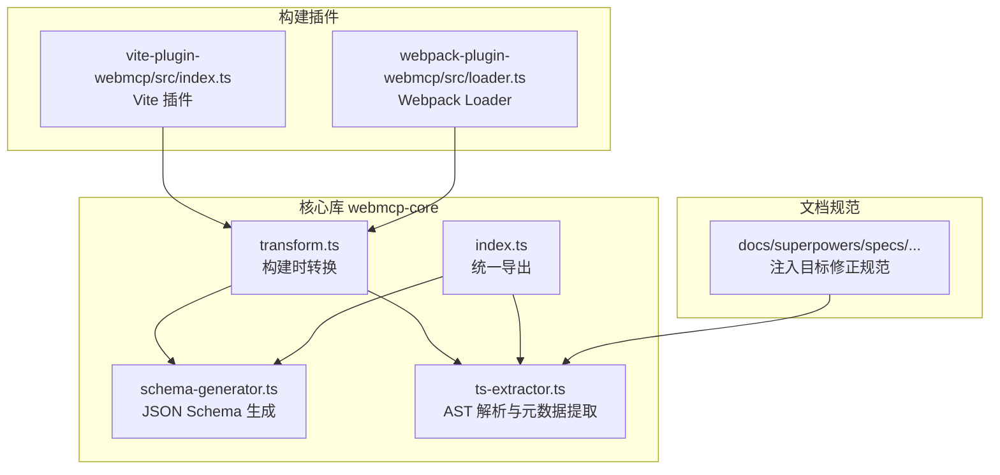
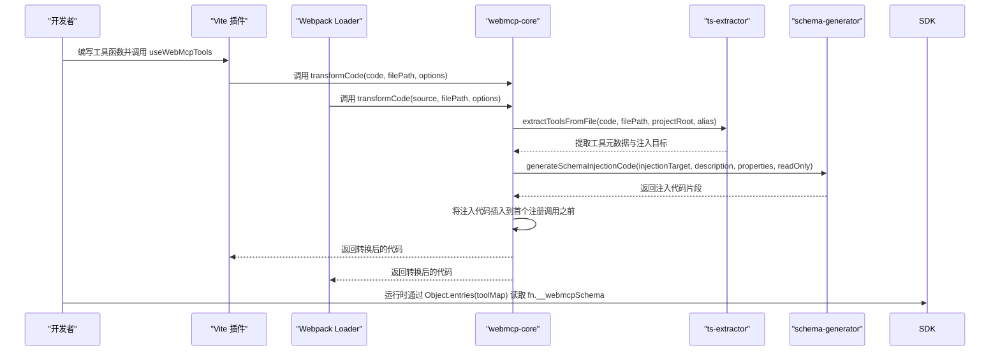
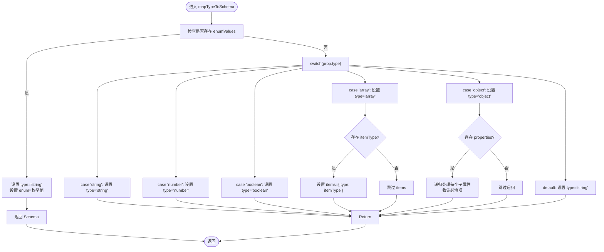
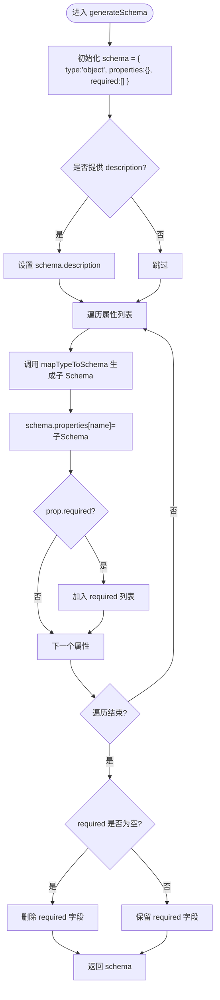
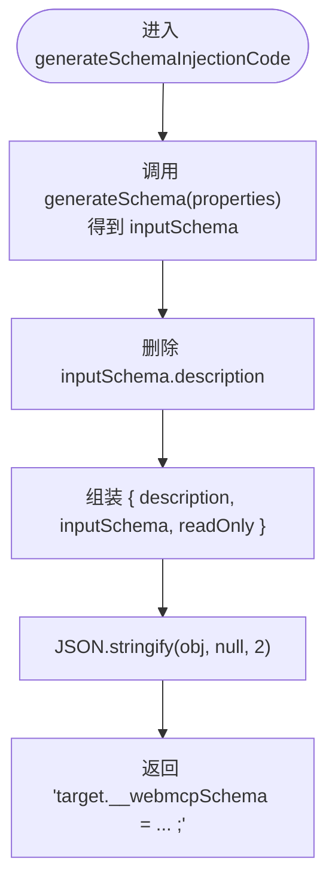
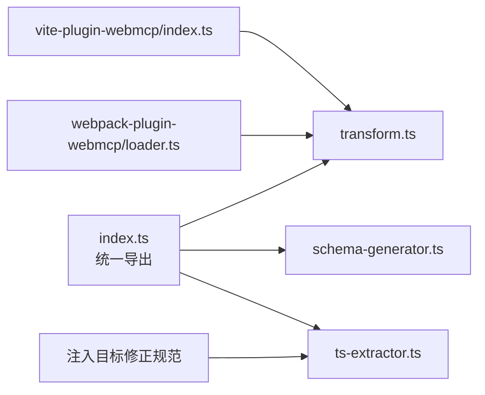

# Schema 生成器

<cite>
**本文档引用的文件**
- [schema-generator.ts](file://packages/webmcp-core/src/schema-generator.ts)
- [schema-generator.test.ts](file://packages/webmcp-core/src/__tests__/schema-generator.test.ts)
- [index.ts](file://packages/webmcp-core/src/index.ts)
- [transform.ts](file://packages/webmcp-core/src/transform.ts)
- [ts-extractor.ts](file://packages/webmcp-core/src/ts-extractor.ts)
- [mapType.test.ts](file://packages/webmcp-core/src/__tests__/mapType.test.ts)
- [extractProperties.test.ts](file://packages/webmcp-core/src/__tests__/extractProperties.test.ts)
- [index.ts](file://packages/vite-plugin-webmcp/src/index.ts)
- [loader.ts](file://packages/webpack-plugin-webmcp/src/loader.ts)
- [2026-05-30-fix-property-assignment-injection-target.md](file://docs/superpowers/specs/2026-05-30-fix-property-assignment-injection-target.md)
</cite>

## 目录
1. [简介](#简介)
2. [项目结构](#项目结构)
3. [核心组件](#核心组件)
4. [架构总览](#架构总览)
5. [详细组件分析](#详细组件分析)
6. [依赖分析](#依赖分析)
7. [性能考虑](#性能考虑)
8. [故障排除指南](#故障排除指南)
9. [结论](#结论)
10. [附录](#附录)

## 简介
本文件面向 JSON Schema 生成器的技术实现，系统化阐述从 TypeScript 类型到 JSON Schema 的映射机制与生成流程。重点覆盖以下方面：
- 基础类型、复合类型与递归类型的映射策略
- mapTypeToSchema 的工作机制：联合类型、交叉类型、泛型约束与条件类型的处理现状与扩展建议
- generateSchema 与 generateSchemaInjectionCode 的实现原理：代码模板生成与注入逻辑
- Schema 结构示例与自定义类型处理的最佳实践

该生成器服务于 WebMCP 生态中的工具函数 Schema 注入，确保前端运行时 SDK 能够基于编译期提取的元数据进行参数校验与交互提示。

## 项目结构
本项目采用多包结构，Schema 生成器位于 webmcp-core 包中，并由 Vite/Webpack 插件在构建阶段调用 transformCode 完成注入。关键文件与职责如下：
- packages/webmcp-core/src/schema-generator.ts：JSON Schema 生成与注入代码生成的核心实现
- packages/webmcp-core/src/transform.ts：构建时转换入口，负责提取工具、生成注入代码并插入源码
- packages/webmcp-core/src/ts-extractor.ts：TypeScript 抽象语法树解析与工具元数据提取
- packages/webmcp-core/src/index.ts：统一导出底层 API 与高层接口
- packages/vite-plugin-webmcp/src/index.ts：Vite 插件桥接 transformCode
- packages/webpack-plugin-webmcp/src/loader.ts：Webpack Loader 桥接 transformCode
- 文档规范：docs/superpowers/specs/...：关于注入目标修正的规范说明

图表来源
- [schema-generator.ts:1-135](file://packages/webmcp-core/src/schema-generator.ts#L1-L135)
- [transform.ts:41-78](file://packages/webmcp-core/src/transform.ts#L41-L78)
- [ts-extractor.ts:651-695](file://packages/webmcp-core/src/ts-extractor.ts#L651-L695)
- [index.ts:1-11](file://packages/webmcp-core/src/index.ts#L1-L11)
- [index.ts:78-101](file://packages/vite-plugin-webmcp/src/index.ts#L78-L101)
- [loader.ts:1-43](file://packages/webpack-plugin-webmcp/src/loader.ts#L1-L43)
- [2026-05-30-fix-property-assignment-injection-target.md:1-49](file://docs/superpowers/specs/2026-05-30-fix-property-assignment-injection-target.md#L1-L49)

章节来源
- [index.ts:1-11](file://packages/webmcp-core/src/index.ts#L1-L11)
- [schema-generator.ts:1-135](file://packages/webmcp-core/src/schema-generator.ts#L1-L135)
- [transform.ts:41-78](file://packages/webmcp-core/src/transform.ts#L41-L78)

## 核心组件
本节聚焦于 JSON Schema 生成器的关键接口与数据模型，阐明其职责与协作方式。

- JsonSchema 接口：定义 JSON Schema 的核心字段，包括 type、description、properties、required、items、enum 等
- PropertyInfo 接口：描述单个属性的元信息，包括 name、type、description、required、enumValues、itemType、properties 等
- generateSchema：将属性列表转换为顶层 JSON Schema（type: object），并根据 required 字段生成必填项清单
- mapTypeToSchema：将单个属性映射为 JSON Schema，支持基础类型、枚举、数组、对象等
- generateSchemaInjectionCode：生成注入到目标对象的 __webmcpSchema 赋值语句，包含 description、inputSchema、readOnly

章节来源
- [schema-generator.ts:6-23](file://packages/webmcp-core/src/schema-generator.ts#L6-L23)
- [schema-generator.ts:28-53](file://packages/webmcp-core/src/schema-generator.ts#L28-L53)
- [schema-generator.ts:88-134](file://packages/webmcp-core/src/schema-generator.ts#L88-L134)
- [schema-generator.ts:69-86](file://packages/webmcp-core/src/schema-generator.ts#L69-L86)

## 架构总览
下图展示从源码到运行时 Schema 注入的整体流程，包括构建期与运行时两个阶段：

图表来源
- [transform.ts:41-78](file://packages/webmcp-core/src/transform.ts#L41-L78)
- [index.ts:78-101](file://packages/vite-plugin-webmcp/src/index.ts#L78-L101)
- [loader.ts:1-43](file://packages/webpack-plugin-webmcp/src/loader.ts#L1-L43)
- [ts-extractor.ts:651-695](file://packages/webmcp-core/src/ts-extractor.ts#L651-L695)
- [schema-generator.ts:69-86](file://packages/webmcp-core/src/schema-generator.ts#L69-L86)

## 详细组件分析

### mapTypeToSchema：类型到 Schema 的映射算法
mapTypeToSchema 负责将单个属性映射为 JSON Schema。其处理流程如下：
- 若属性带有枚举值（enumValues），则强制 type 为 string 并设置 enum 字段
- 基础类型分支：string、number、boolean 直接映射为对应 JSON Schema type
- 数组类型：type 设为 array，并在存在 itemType 时设置 items 为 { type: itemType }
- 对象类型：type 设为 object，并递归处理子属性；收集必填项名称组成 required 数组
- 默认分支：未知类型统一映射为 string

图表来源
- [schema-generator.ts:88-134](file://packages/webmcp-core/src/schema-generator.ts#L88-L134)

章节来源
- [schema-generator.ts:88-134](file://packages/webmcp-core/src/schema-generator.ts#L88-L134)
- [schema-generator.test.ts:9-81](file://packages/webmcp-core/src/__tests__/schema-generator.test.ts#L9-L81)

### generateSchema：顶层对象 Schema 生成
generateSchema 将属性列表封装为顶层 JSON Schema（type: object）。其行为要点：
- 初始化 schema 为 { type: 'object', properties: {}, required: [] }
- 若传入 description，则设置到顶层 schema
- 遍历属性，逐个调用 mapTypeToSchema 生成子 Schema，并填充 properties
- 根据属性的 required 字段维护 required 列表；若为空则删除该字段

图表来源
- [schema-generator.ts:28-53](file://packages/webmcp-core/src/schema-generator.ts#L28-L53)

章节来源
- [schema-generator.ts:28-53](file://packages/webmcp-core/src/schema-generator.ts#L28-L53)
- [schema-generator.test.ts:83-103](file://packages/webmcp-core/src/__tests__/schema-generator.test.ts#L83-L103)

### generateSchemaInjectionCode：注入代码生成与模板
generateSchemaInjectionCode 用于生成将 __webmcpSchema 赋值到目标对象的代码。其流程：
- 调用 generateSchema 生成 inputSchema
- 删除 inputSchema 的顶层 description（避免重复）
- 组装 { description, inputSchema, readOnly } 对象
- 使用 JSON.stringify 生成代码字符串，格式化缩进为两空格
- 返回形如 "target.__webmcpSchema = { ... };" 的赋值语句

图表来源
- [schema-generator.ts:69-86](file://packages/webmcp-core/src/schema-generator.ts#L69-L86)

章节来源
- [schema-generator.ts:69-86](file://packages/webmcp-core/src/schema-generator.ts#L69-L86)
- [schema-generator.test.ts:105-141](file://packages/webmcp-core/src/__tests__/schema-generator.test.ts#L105-L141)

### 类型映射与复合类型支持
- 基础类型：string、number、boolean 直接映射为 JSON Schema 的同名 type
- 枚举类型：当属性具备 enumValues 时，强制 type 为 string 并设置 enum 字段
- 数组类型：type 为 array，itemType 作为 items 的 type
- 对象类型：type 为 object，递归处理 properties，并收集必填项
- 递归类型：对象类型分支通过递归调用 mapTypeToSchema 支持深层嵌套

章节来源
- [schema-generator.ts:88-134](file://packages/webmcp-core/src/schema-generator.ts#L88-L134)
- [schema-generator.test.ts:9-81](file://packages/webmcp-core/src/__tests__/schema-generator.test.ts#L9-L81)
- [extractProperties.test.ts:56-84](file://packages/webmcp-core/src/__tests__/extractProperties.test.ts#L56-L84)

### 联合类型、交叉类型、泛型约束与条件类型的处理策略
当前实现对联合类型、交叉类型、泛型约束与条件类型的处理策略如下：
- 联合类型：通过 extractProperties 测试可见，字面量联合（如 'admin' | 'user'）会被提取为字符串枚举，最终在 mapTypeToSchema 中映射为 { type: 'string', enum: [...] }
- 交叉类型：未在现有测试与实现中直接体现，当前 mapTypeToSchema 未显式处理交叉类型合并
- 泛型约束：未在现有测试与实现中直接体现，当前 mapTypeToSchema 未显式处理泛型参数展开
- 条件类型：未在现有测试与实现中直接体现，当前 mapTypeToSchema 未显式处理条件类型推导

扩展建议（概念性说明，非现有实现）：
- 联合类型：在 extractProperties 阶段识别字面量联合并生成 enumValues，在 mapTypeToSchema 中按枚举路径处理
- 交叉类型：在 mapTypeToSchema 中对交叉类型进行属性合并，必要时引入 additionalProperties 或更复杂的组合模式
- 泛型约束：在 mapType 阶段解析泛型实参并替换类型别名，再进行后续映射
- 条件类型：在 mapType 阶段评估条件类型分支，选择满足条件的子类型进行映射

章节来源
- [extractProperties.test.ts:45-54](file://packages/webmcp-core/src/__tests__/extractProperties.test.ts#L45-L54)
- [mapType.test.ts:15-47](file://packages/webmcp-core/src/__tests__/mapType.test.ts#L15-L47)
- [schema-generator.ts:88-134](file://packages/webmcp-core/src/schema-generator.ts#L88-L134)

### Schema 结构示例与最佳实践
- 基础类型对象 Schema
  - 示例结构：{ type: 'object', properties: { name: { type: 'string' } }, required: ['name'] }
  - 最佳实践：为每个必填属性设置 required；可选属性不放入 required
- 枚举属性 Schema
  - 示例结构：{ type: 'string', enum: ['admin', 'user'] }
  - 最佳实践：在提取阶段生成 enumValues，避免在 mapTypeToSchema 中手动维护
- 数组属性 Schema
  - 示例结构：{ type: 'array', items: { type: 'string' } }
  - 最佳实践：明确 itemType；对于复杂元素，建议拆分为独立对象类型
- 嵌套对象 Schema
  - 示例结构：{ type: 'object', properties: { filter: { type: 'object', properties: { min: { type: 'number' } }, required: ['min'] } }, required: [] }
  - 最佳实践：递归处理子属性；保持必填项集合清晰

章节来源
- [schema-generator.test.ts:9-81](file://packages/webmcp-core/src/__tests__/schema-generator.test.ts#L9-L81)
- [schema-generator.test.ts:83-103](file://packages/webmcp-core/src/__tests__/schema-generator.test.ts#L83-L103)

## 依赖分析
- 统一导出入口：index.ts 将 transform、ts-extractor 与 schema-generator 的 API 暴露给上层插件使用
- 构建插件依赖：Vite 插件与 Webpack Loader 仅负责调用 transformCode，不直接操作 Schema 生成细节
- 注入目标修正：规范文档明确了 PropertyAssignment 场景下的 injectionTarget 应使用 value 表达式而非 key 名称，确保运行时 SDK 能从函数对象上读取 __webmcpSchema

图表来源
- [index.ts:1-11](file://packages/webmcp-core/src/index.ts#L1-L11)
- [transform.ts:41-78](file://packages/webmcp-core/src/transform.ts#L41-L78)
- [schema-generator.ts:69-86](file://packages/webmcp-core/src/schema-generator.ts#L69-L86)
- [ts-extractor.ts:651-695](file://packages/webmcp-core/src/ts-extractor.ts#L651-L695)
- [index.ts:78-101](file://packages/vite-plugin-webmcp/src/index.ts#L78-L101)
- [loader.ts:1-43](file://packages/webpack-plugin-webmcp/src/loader.ts#L1-L43)
- [2026-05-30-fix-property-assignment-injection-target.md:1-49](file://docs/superpowers/specs/2026-05-30-fix-property-assignment-injection-target.md#L1-L49)

章节来源
- [index.ts:1-11](file://packages/webmcp-core/src/index.ts#L1-L11)
- [2026-05-30-fix-property-assignment-injection-target.md:1-49](file://docs/superpowers/specs/2026-05-30-fix-property-assignment-injection-target.md#L1-L49)

## 性能考虑
- 递归深度：对象嵌套越深，mapTypeToSchema 的递归层数越多，建议控制嵌套层级，避免过深导致栈溢出或生成体积过大
- 枚举规模：枚举值过多会增大 JSON 字符串体积，建议在提取阶段合并重复值或使用外部常量引用
- 数组元素类型：复杂数组元素建议拆分为独立对象类型，减少 items 的复杂度
- 生成开销：generateSchemaInjectionCode 使用 JSON.stringify，建议在构建阶段一次性生成并缓存结果，避免重复计算

## 故障排除指南
- 注入目标错误
  - 现象：运行时报错 ReferenceError，找不到 injectionTarget 引用
  - 原因：PropertyAssignment 场景下 injectionTarget 使用了 key 名称而非 value 表达式
  - 解决：参考规范文档修正 ts-extractor 中 resolveObjectLiteralArg 的 injectionTarget 生成逻辑
- 顶层 description 重复
  - 现象：注入后 inputSchema 也携带 description 导致冗余
  - 解决：generateSchemaInjectionCode 在生成注入代码前删除 inputSchema 的 description
- 构建未触发
  - 现象：transformCode 返回 transformed:false
  - 原因：未检测到注册调用或无可提取工具
  - 解决：确认源码中存在 useWebMcpTools 或 registerGlobalTools 等调用

章节来源
- [2026-05-30-fix-property-assignment-injection-target.md:1-49](file://docs/superpowers/specs/2026-05-30-fix-property-assignment-injection-target.md#L1-L49)
- [schema-generator.ts:69-86](file://packages/webmcp-core/src/schema-generator.ts#L69-L86)
- [transform.ts:41-78](file://packages/webmcp-core/src/transform.ts#L41-L78)

## 结论
本 JSON Schema 生成器以简洁的映射规则实现了从 TypeScript 类型到 JSON Schema 的转换，并通过构建期注入为运行时 SDK 提供参数校验与交互提示能力。当前实现已覆盖基础类型、枚举、数组与对象的递归映射；对于联合类型已在提取阶段体现为枚举，其余高级类型（交叉、泛型、条件）可在后续版本中逐步增强。结合构建插件与规范约束，整体方案具备良好的可扩展性与工程落地性。

## 附录
- 关键 API 一览
  - generateSchema：将属性列表转为顶层对象 Schema
  - mapTypeToSchema：单属性到 Schema 的映射
  - generateSchemaInjectionCode：生成注入代码
  - transformCode：构建时转换入口
  - extractToolsFromFile：AST 解析与工具元数据提取

章节来源
- [schema-generator.ts:28-134](file://packages/webmcp-core/src/schema-generator.ts#L28-L134)
- [transform.ts:41-78](file://packages/webmcp-core/src/transform.ts#L41-L78)
- [index.ts:1-11](file://packages/webmcp-core/src/index.ts#L1-L11)