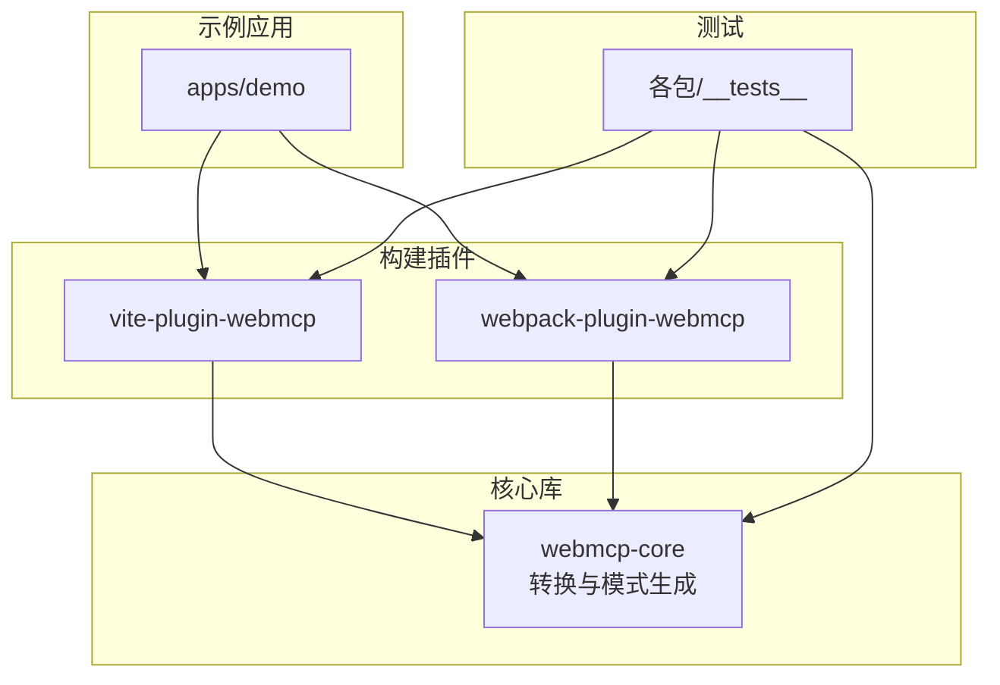
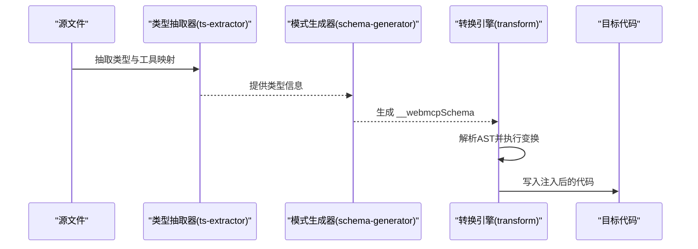
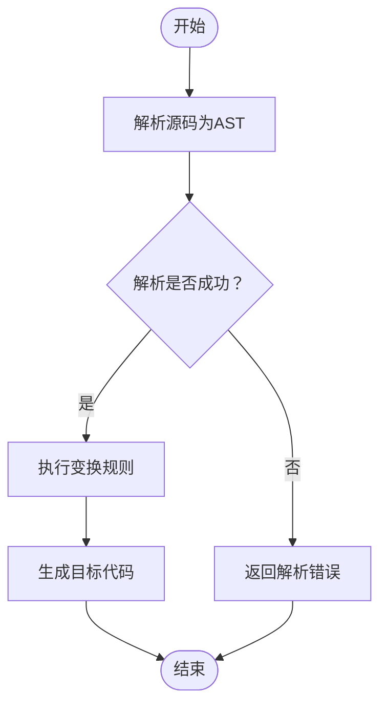
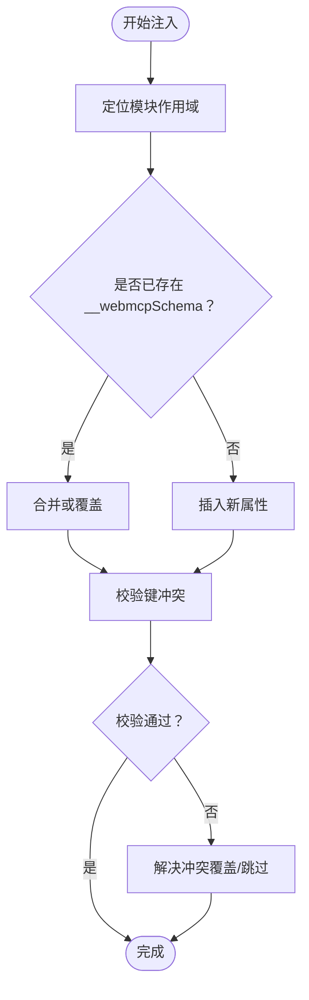
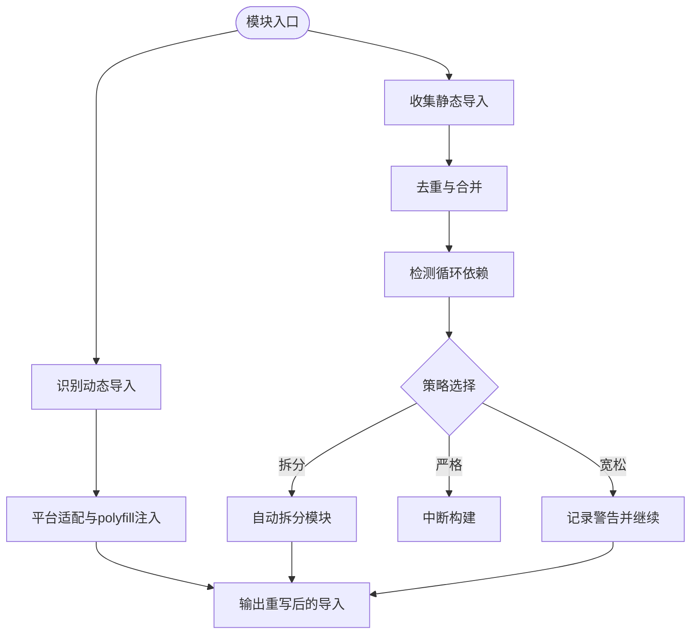
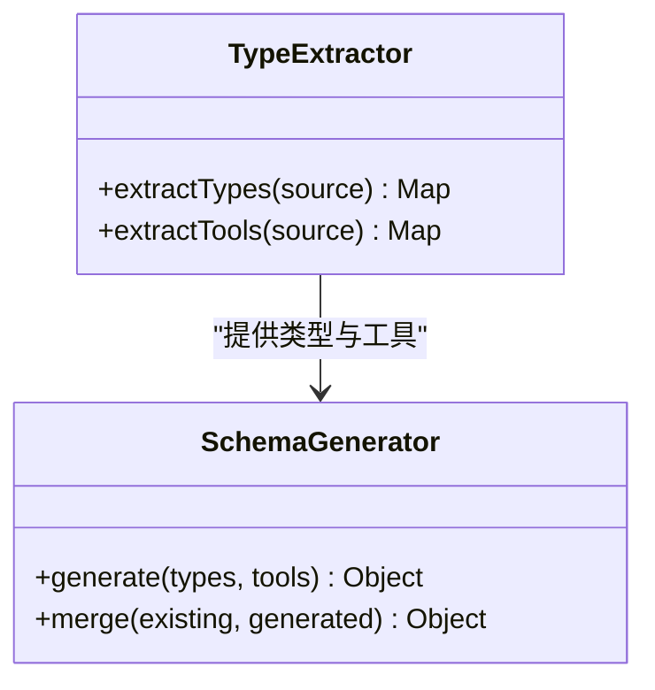
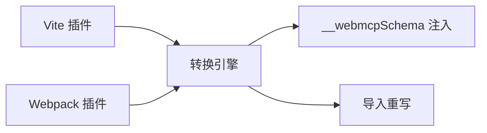
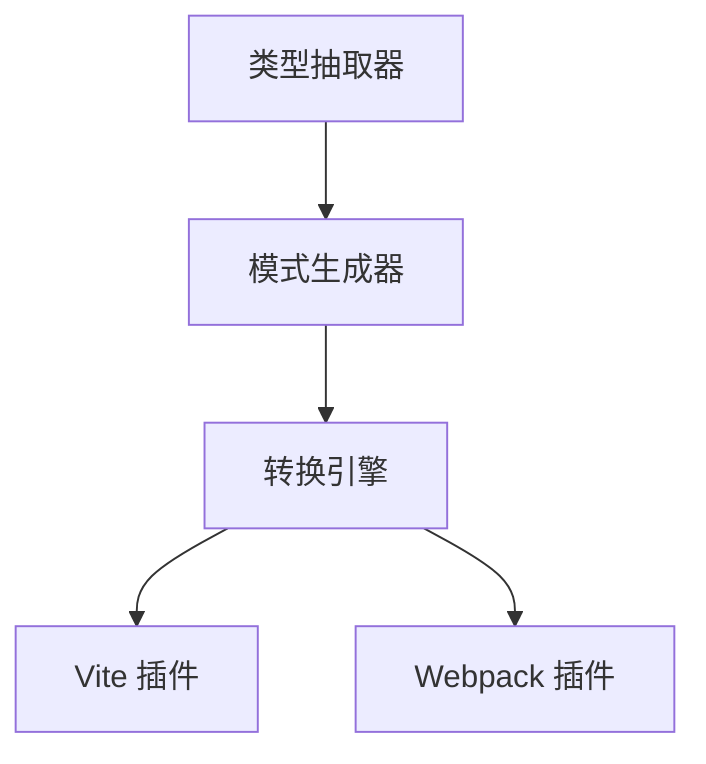

# 代码转换系统

<cite>
**本文档引用的文件**
- [packages/webmcp-core/src/transform.ts](file://packages/webmcp-core/src/transform.ts)
- [packages/webmcp-core/src/schema-generator.ts](file://packages/webmcp-core/src/schema-generator.ts)
- [packages/webmcp-core/src/ts-extractor.ts](file://packages/webmcp-core/src/ts-extractor.ts)
- [packages/webmcp-core/src/types.ts](file://packages/webmcp-core/src/types.ts)
- [packages/webmcp-core/src/index.ts](file://packages/webmcp-core/src/index.ts)
- [packages/vite-plugin-webmcp/src/index.ts](file://packages/vite-plugin-webmcp/src/index.ts)
- [packages/webpack-plugin-webmcp/src/index.ts](file://packages/webpack-plugin-webmcp/src/index.ts)
- [packages/webpack-plugin-webmcp/src/plugin.ts](file://packages/webpack-plugin-webmcp/src/plugin.ts)
- [packages/webpack-plugin-webmcp/src/loader.ts](file://packages/webpack-plugin-webmcp/src/loader.ts)
- [packages/webpack-plugin-webmcp/src/resolve-loader.ts](file://packages/webpack-plugin-webmcp/src/resolve-loader.ts)
- [packages/webmcp-core/src/__tests__/transform.test.ts](file://packages/webmcp-core/src/__tests__/transform.test.ts)
- [packages/webmcp-core/src/__tests__/schema-generator.test.ts](file://packages/webmcp-core/src/__tests__/schema-generator.test.ts)
- [packages/webmcp-core/src/__tests__/extractProperties.test.ts](file://packages/webmcp-core/src/__tests__/extractProperties.test.ts)
- [packages/webmcp-core/src/__tests__/extractToolsFromFile.test.ts](file://packages/webmcp-core/src/__tests__/extractToolsFromFile.test.ts)
- [packages/webmcp-core/src/__tests__/mapType.test.ts](file://packages/webmcp-core/src/__tests__/mapType.test.ts)
</cite>

## 目录
1. [引言](#引言)
2. [项目结构](#项目结构)
3. [核心组件](#核心组件)
4. [架构总览](#架构总览)
5. [详细组件分析](#详细组件分析)
6. [依赖关系分析](#依赖关系分析)
7. [性能考虑](#性能考虑)
8. [故障排除指南](#故障排除指南)
9. [结论](#结论)
10. [附录](#附录)

## 引言
本文件面向需要深入理解代码转换系统实现的工程师与高级用户，围绕 transformCode 函数的实现机制展开，涵盖源码解析、AST 修改与目标代码生成；解释 __webmcpSchema 属性的注入策略（时机、位置与冲突处理）；阐述模块导入重写机制（动态导入处理、静态导入优化与循环依赖检测）；并提供 transformCode 的配置选项说明与使用示例，包含错误恢复与调试支持。

## 项目结构
该仓库采用多包工作区布局，核心转换逻辑位于 webmcp-core 包，构建插件分别在 vite-plugin-webmcp 与 webpack-plugin-webmcp 中实现。应用示例位于 apps/demo，测试用例集中在各包的 __tests__ 目录中。

图表来源
- [packages/webmcp-core/src/index.ts](file://packages/webmcp-core/src/index.ts)
- [packages/vite-plugin-webmcp/src/index.ts](file://packages/vite-plugin-webmcp/src/index.ts)
- [packages/webpack-plugin-webmcp/src/index.ts](file://packages/webpack-plugin-webmcp/src/index.ts)

章节来源
- [packages/webmcp-core/src/index.ts](file://packages/webmcp-core/src/index.ts)
- [packages/vite-plugin-webmcp/src/index.ts](file://packages/vite-plugin-webmcp/src/index.ts)
- [packages/webpack-plugin-webmcp/src/index.ts](file://packages/webpack-plugin-webmcp/src/index.ts)

## 核心组件
- 转换引擎：负责解析源码、构建 AST、执行变换规则并生成目标代码。
- 模式生成器：从类型信息与工具函数中提取并生成 __webmcpSchema。
- 类型抽取器：从 TypeScript 源中抽取类型定义与工具映射。
- 构建插件：在 Vite 与 Webpack 环境中集成转换流程，处理模块导入重写与循环依赖检测。

章节来源
- [packages/webmcp-core/src/transform.ts](file://packages/webmcp-core/src/transform.ts)
- [packages/webmcp-core/src/schema-generator.ts](file://packages/webmcp-core/src/schema-generator.ts)
- [packages/webmcp-core/src/ts-extractor.ts](file://packages/webmcp-core/src/ts-extractor.ts)
- [packages/webmcp-core/src/types.ts](file://packages/webmcp-core/src/types.ts)

## 架构总览
下图展示了从源文件到目标输出的整体流程，以及 __webmcpSchema 注入与模块导入重写的交互关系。

图表来源
- [packages/webmcp-core/src/ts-extractor.ts](file://packages/webmcp-core/src/ts-extractor.ts)
- [packages/webmcp-core/src/schema-generator.ts](file://packages/webmcp-core/src/schema-generator.ts)
- [packages/webmcp-core/src/transform.ts](file://packages/webmcp-core/src/transform.ts)

## 详细组件分析

### 转换引擎（transformCode）
转换引擎是系统的核心，负责：
- 源码解析：将输入文本解析为可编辑的 AST。
- AST 修改：根据规则对节点进行插入、替换或删除操作，典型包括 __webmcpSchema 的注入。
- 目标代码生成：将修改后的 AST 输出为目标语言代码。

关键实现要点：
- 解析阶段：确保使用与目标环境兼容的解析器配置，避免语法差异导致的解析失败。
- 变换阶段：以“最小侵入”原则进行节点修改，优先在不影响语义的前提下完成注入与重写。
- 生成阶段：控制输出格式（如保留注释、缩进等），并在必要时进行增量生成以提升性能。

图表来源
- [packages/webmcp-core/src/transform.ts](file://packages/webmcp-core/src/transform.ts)

章节来源
- [packages/webmcp-core/src/transform.ts](file://packages/webmcp-core/src/transform.ts)

### __webmcpSchema 注入策略
注入策略围绕以下维度展开：

- 注入时机
  - 在类型抽取与模式生成完成后，在转换引擎阶段统一注入，避免与后续 AST 变换相互干扰。
- 注入位置
  - 通常选择在模块作用域内靠近顶部的位置，确保其在模块其他声明之前可用，同时避免破坏现有导出顺序。
- 冲突处理
  - 若源文件已存在同名属性，则进行合并或覆盖决策：优先保留用户显式定义，若无则自动注入默认值。
  - 对于重复键，采用“后写覆盖前写”的策略，保证最终结果可预测。

图表来源
- [packages/webmcp-core/src/schema-generator.ts](file://packages/webmcp-core/src/schema-generator.ts)
- [packages/webmcp-core/src/transform.ts](file://packages/webmcp-core/src/transform.ts)

章节来源
- [packages/webmcp-core/src/schema-generator.ts](file://packages/webmcp-core/src/schema-generator.ts)
- [packages/webmcp-core/src/transform.ts](file://packages/webmcp-core/src/transform.ts)

### 模块导入重写机制
模块导入重写旨在优化打包体积与运行时行为，包含以下能力：

- 动态导入处理
  - 将动态 import() 表达式转换为平台兼容的形式，必要时注入 polyfill 或适配层。
  - 保持原语义不变，仅调整实现细节以满足目标运行时要求。
- 静态导入优化
  - 分析静态 import/export 声明，去除未使用的导入项，减少冗余依赖。
  - 合并相邻的相同模块导入，降低重复加载成本。
- 循环依赖检测
  - 在构建期扫描模块间的依赖图，识别潜在循环依赖并发出警告或报错。
  - 提供可配置策略：允许宽松模式（仅警告）、严格模式（中断构建）或自动拆分。

图表来源
- [packages/webpack-plugin-webmcp/src/plugin.ts](file://packages/webpack-plugin-webmcp/src/plugin.ts)
- [packages/webpack-plugin-webmcp/src/loader.ts](file://packages/webpack-plugin-webmcp/src/loader.ts)
- [packages/webpack-plugin-webmcp/src/resolve-loader.ts](file://packages/webpack-plugin-webmcp/src/resolve-loader.ts)

章节来源
- [packages/webpack-plugin-webmcp/src/plugin.ts](file://packages/webpack-plugin-webmcp/src/plugin.ts)
- [packages/webpack-plugin-webmcp/src/loader.ts](file://packages/webpack-plugin-webmcp/src/loader.ts)
- [packages/webpack-plugin-webmcp/src/resolve-loader.ts](file://packages/webpack-plugin-webmcp/src/resolve-loader.ts)

### 类型抽取与模式生成
类型抽取器负责从 TypeScript 源中提取类型定义与工具映射；模式生成器基于这些信息生成 __webmcpSchema。两者协同工作，确保转换阶段有可靠的元数据支撑。

图表来源
- [packages/webmcp-core/src/ts-extractor.ts](file://packages/webmcp-core/src/ts-extractor.ts)
- [packages/webmcp-core/src/schema-generator.ts](file://packages/webmcp-core/src/schema-generator.ts)

章节来源
- [packages/webmcp-core/src/ts-extractor.ts](file://packages/webmcp-core/src/ts-extractor.ts)
- [packages/webmcp-core/src/schema-generator.ts](file://packages/webmcp-core/src/schema-generator.ts)

### 构建插件集成
Vite 插件与 Webpack 插件分别在各自生态中集成转换流程：
- Vite 插件：在开发与生产构建中拦截 TS/TSX 文件，调用转换引擎并注入 __webmcpSchema。
- Webpack 插件：通过 loader 与 resolve-loader 实现模块解析与导入重写，配合 plugin 完成全局注入与循环依赖检测。

图表来源
- [packages/vite-plugin-webmcp/src/index.ts](file://packages/vite-plugin-webmcp/src/index.ts)
- [packages/webpack-plugin-webmcp/src/index.ts](file://packages/webpack-plugin-webmcp/src/index.ts)
- [packages/webmcp-core/src/transform.ts](file://packages/webmcp-core/src/transform.ts)

章节来源
- [packages/vite-plugin-webmcp/src/index.ts](file://packages/vite-plugin-webmcp/src/index.ts)
- [packages/webpack-plugin-webmcp/src/index.ts](file://packages/webpack-plugin-webmcp/src/index.ts)
- [packages/webmcp-core/src/transform.ts](file://packages/webmcp-core/src/transform.ts)

## 依赖关系分析
- 组件耦合
  - 转换引擎依赖类型抽取器与模式生成器提供的元数据，耦合度适中，职责清晰。
  - 构建插件与核心库通过接口解耦，便于扩展不同构建工具。
- 外部依赖
  - 构建插件依赖各自生态的 API（如 Vite 的钩子、Webpack 的 loader 与 resolver）。
- 潜在循环依赖
  - 通过循环依赖检测与拆分策略避免构建期死锁。

图表来源
- [packages/webmcp-core/src/ts-extractor.ts](file://packages/webmcp-core/src/ts-extractor.ts)
- [packages/webmcp-core/src/schema-generator.ts](file://packages/webmcp-core/src/schema-generator.ts)
- [packages/webmcp-core/src/transform.ts](file://packages/webmcp-core/src/transform.ts)
- [packages/vite-plugin-webmcp/src/index.ts](file://packages/vite-plugin-webmcp/src/index.ts)
- [packages/webpack-plugin-webmcp/src/index.ts](file://packages/webpack-plugin-webmcp/src/index.ts)

章节来源
- [packages/webmcp-core/src/transform.ts](file://packages/webmcp-core/src/transform.ts)
- [packages/webmcp-core/src/schema-generator.ts](file://packages/webmcp-core/src/schema-generator.ts)
- [packages/webmcp-core/src/ts-extractor.ts](file://packages/webmcp-core/src/ts-extractor.ts)
- [packages/vite-plugin-webmcp/src/index.ts](file://packages/vite-plugin-webmcp/src/index.ts)
- [packages/webpack-plugin-webmcp/src/index.ts](file://packages/webpack-plugin-webmcp/src/index.ts)

## 性能考虑
- AST 解析与遍历
  - 使用增量解析与缓存策略，避免重复解析同一文件。
- 导入重写
  - 在静态导入阶段进行去重与合并，减少模块数量与网络往返。
- 生成阶段
  - 控制输出格式与注释保留策略，平衡可读性与体积。
- 并发与批处理
  - 在批量文件处理时采用并发策略，结合队列管理避免内存峰值。

## 故障排除指南
- 解析失败
  - 检查源文件语法与目标环境支持的特性；确认解析器配置正确。
- 注入冲突
  - 若 __webmcpSchema 重复注入，检查注入时机与合并策略；必要时手动清理重复定义。
- 导入重写异常
  - 核对动态导入表达式的合法性；排查平台适配层是否缺失。
- 循环依赖
  - 查看检测日志，按策略选择警告或拆分模块；重构模块边界以消除循环。
- 调试支持
  - 开启详细日志与源映射；在测试用例中复现问题并逐步缩小范围。

章节来源
- [packages/webmcp-core/src/__tests__/transform.test.ts](file://packages/webmcp-core/src/__tests__/transform.test.ts)
- [packages/webmcp-core/src/__tests__/schema-generator.test.ts](file://packages/webmcp-core/src/__tests__/schema-generator.test.ts)
- [packages/webmcp-core/src/__tests__/extractProperties.test.ts](file://packages/webmcp-core/src/__tests__/extractProperties.test.ts)
- [packages/webmcp-core/src/__tests__/extractToolsFromFile.test.ts](file://packages/webmcp-core/src/__tests__/extractToolsFromFile.test.ts)
- [packages/webmcp-core/src/__tests__/mapType.test.ts](file://packages/webmcp-core/src/__tests__/mapType.test.ts)

## 结论
该代码转换系统通过“类型抽取 + 模式生成 + AST 转换 + 导入重写”的流水线，实现了对 TypeScript 源码的增强与优化。__webmcpSchema 的注入策略确保了元数据的一致性与可控性；模块导入重写机制兼顾了性能与兼容性；构建插件提供了跨生态的无缝集成。建议在实际项目中结合配置选项与调试手段，持续优化转换效果与稳定性。

## 附录
- 配置选项（概览）
  - 解析器选项：语法版本、模块系统、目标环境等。
  - 注入策略：是否启用 __webmcpSchema 注入、合并规则、冲突处理方式。
  - 导入重写：动态导入适配、静态导入优化级别、循环依赖策略。
  - 输出控制：代码格式化、注释保留、源映射生成。
- 使用示例（步骤）
  - 在 Vite 项目中安装并注册插件，确保 TS/TSX 文件被拦截与转换。
  - 在 Webpack 项目中配置插件与 loader，设置解析器与重写规则。
  - 运行构建，观察日志与产物，必要时调整配置并重新构建。
- 错误恢复
  - 当转换失败时，回退到原始源码并输出错误信息；在开发模式下保持热更新可用。
  - 对于循环依赖，提供拆分建议与模块重构指引。