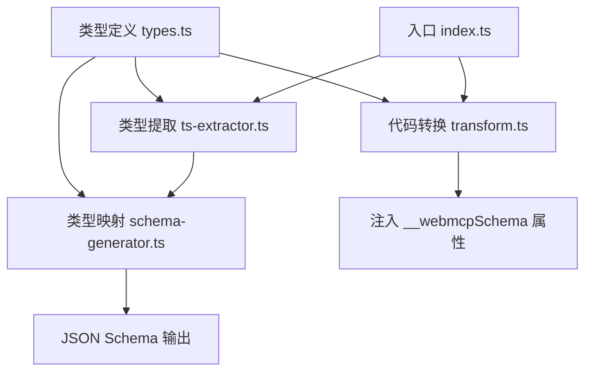
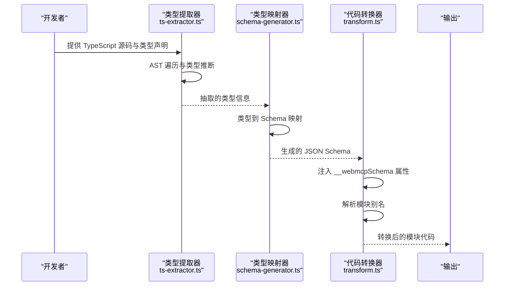
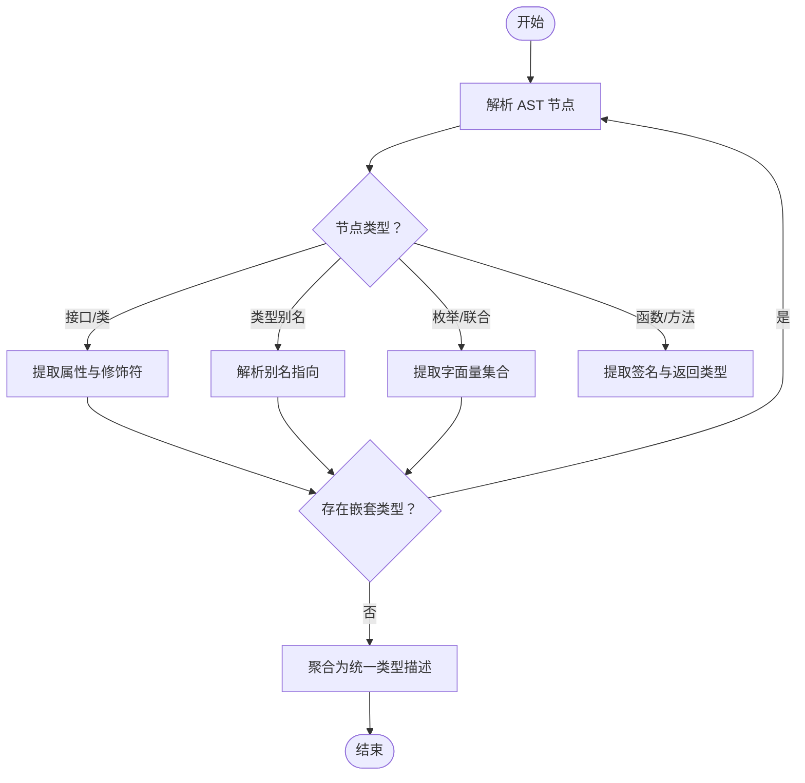
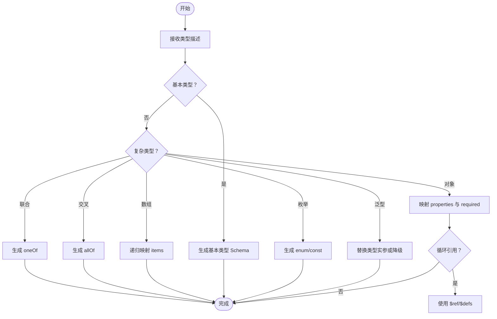
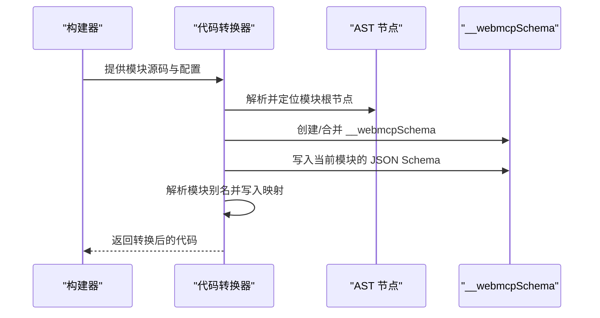
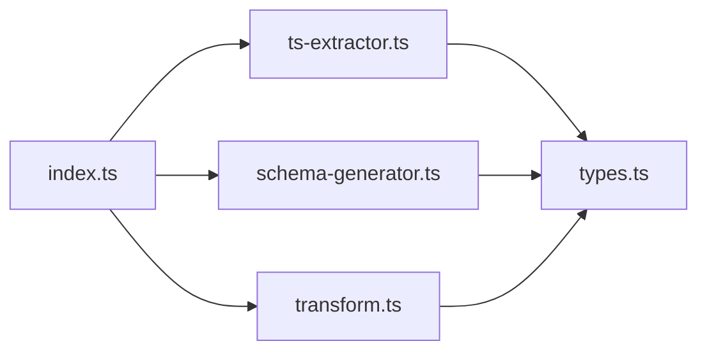

# 核心引擎 (webmcp-core)

<cite>
**本文引用的文件**
- [packages/webmcp-core/src/index.ts](file://packages/webmcp-core/src/index.ts)
- [packages/webmcp-core/src/schema-generator.ts](file://packages/webmcp-core/src/schema-generator.ts)
- [packages/webmcp-core/src/transform.ts](file://packages/webmcp-core/src/transform.ts)
- [packages/webmcp-core/src/ts-extractor.ts](file://packages/webmcp-core/src/ts-extractor.ts)
- [packages/webmcp-core/src/types.ts](file://packages/webmcp-core/src/types.ts)
- [packages/webmcp-core/src/__tests__/extractProperties.test.ts](file://packages/webmcp-core/src/__tests__/extractProperties.test.ts)
- [packages/webmcp-core/src/__tests__/schema-generator.test.ts](file://packages/webmcp-core/src/__tests__/schema-generator.test.ts)
- [packages/webmcp-core/src/__tests__/transform.test.ts](file://packages/webmcp-core/src/__tests__/transform.test.ts)
- [packages/webmcp-core/package.json](file://packages/webmcp-core/package.json)
- [packages/webmcp-core/README.md](file://packages/webmcp-core/README.md)
</cite>

## 目录
1. [简介](#简介)
2. [项目结构](#项目结构)
3. [核心组件](#核心组件)
4. [架构总览](#架构总览)
5. [详细组件分析](#详细组件分析)
6. [依赖关系分析](#依赖关系分析)
7. [性能考虑](#性能考虑)
8. [故障排查指南](#故障排查指南)
9. [结论](#结论)
10. [附录](#附录)

## 简介
本文件为 webmcp-core 核心引擎的深度技术文档，聚焦以下关键能力：
- 基于 ts-morph 的 TypeScript 类型分析引擎：AST 解析、类型推断与属性提取流程
- JSON Schema 生成算法：类型到 Schema 的映射规则、递归类型处理与复杂类型支持
- 代码转换机制：__webmcpSchema 属性注入与模块别名解析
- 底层 API 使用示例与高级配置选项
- 性能优化策略与内存使用分析

该引擎作为 webmcp 生态的基础设施，负责从 TypeScript 源码中抽取类型信息并生成可执行的 JSON Schema，同时在构建期对目标模块进行轻量级代码转换以注入运行时所需的元数据。

## 项目结构
webmcp-core 包含如下核心源文件与测试用例：
- 入口与导出：index.ts
- 类型分析：ts-extractor.ts
- 类型到 Schema 映射：schema-generator.ts
- 代码转换：transform.ts
- 类型定义：types.ts
- 单元测试：多个 test 文件覆盖各模块行为

图表来源
- [packages/webmcp-core/src/index.ts:1-200](file://packages/webmcp-core/src/index.ts#L1-L200)
- [packages/webmcp-core/src/ts-extractor.ts:1-200](file://packages/webmcp-core/src/ts-extractor.ts#L1-L200)
- [packages/webmcp-core/src/schema-generator.ts:1-200](file://packages/webmcp-core/src/schema-generator.ts#L1-L200)
- [packages/webmcp-core/src/transform.ts:1-200](file://packages/webmcp-core/src/transform.ts#L1-L200)
- [packages/webmcp-core/src/types.ts:1-200](file://packages/webmcp-core/src/types.ts#L1-L200)

章节来源
- [packages/webmcp-core/src/index.ts:1-200](file://packages/webmcp-core/src/index.ts#L1-L200)
- [packages/webmcp-core/src/ts-extractor.ts:1-200](file://packages/webmcp-core/src/ts-extractor.ts#L1-L200)
- [packages/webmcp-core/src/schema-generator.ts:1-200](file://packages/webmcp-core/src/schema-generator.ts#L1-L200)
- [packages/webmcp-core/src/transform.ts:1-200](file://packages/webmcp-core/src/transform.ts#L1-L200)
- [packages/webmcp-core/src/types.ts:1-200](file://packages/webmcp-core/src/types.ts#L1-L200)

## 核心组件
- 类型提取器（ts-extractor.ts）：基于 ts-morph 对 TypeScript AST 进行遍历，提取接口、类、枚举、联合/交叉类型等声明，并完成基础类型推断与属性收集。
- 类型映射器（schema-generator.ts）：将提取到的类型信息映射为 JSON Schema 结构，处理基本类型、数组、对象、可选属性、泛型约束、递归引用等。
- 代码转换器（transform.ts）：在构建阶段对目标模块进行轻量级 AST 转换，注入 __webmcpSchema 元数据属性，并解析模块别名以保证运行时可访问性。
- 类型定义（types.ts）：统一导出核心类型，确保各模块间的数据契约一致。
- 入口（index.ts）：对外暴露 API，串联上述组件并提供高层封装。

章节来源
- [packages/webmcp-core/src/ts-extractor.ts:1-200](file://packages/webmcp-core/src/ts-extractor.ts#L1-L200)
- [packages/webmcp-core/src/schema-generator.ts:1-200](file://packages/webmcp-core/src/schema-generator.ts#L1-L200)
- [packages/webmcp-core/src/transform.ts:1-200](file://packages/webmcp-core/src/transform.ts#L1-L200)
- [packages/webmcp-core/src/types.ts:1-200](file://packages/webmcp-core/src/types.ts#L1-L200)
- [packages/webmcp-core/src/index.ts:1-200](file://packages/webmcp-core/src/index.ts#L1-L200)

## 架构总览
下图展示了从源码到 JSON Schema 的端到端流程，以及构建期注入元数据的关键步骤：

图表来源
- [packages/webmcp-core/src/ts-extractor.ts:1-200](file://packages/webmcp-core/src/ts-extractor.ts#L1-L200)
- [packages/webmcp-core/src/schema-generator.ts:1-200](file://packages/webmcp-core/src/schema-generator.ts#L1-L200)
- [packages/webmcp-core/src/transform.ts:1-200](file://packages/webmcp-core/src/transform.ts#L1-L200)

## 详细组件分析

### 类型提取器（ts-extractor.ts）
职责与流程
- 使用 ts-morph 打开源文件，遍历语法树节点，识别接口、类、枚举、类型别名、函数签名等声明
- 对每个声明执行类型推断，收集属性名称、类型、是否可选、默认值等元信息
- 处理泛型参数、条件类型、映射类型等高级特性，必要时进行降级或简化
- 将结果标准化为统一的内部类型描述结构，供后续映射器使用

关键点
- 递归遍历：对嵌套类型（如嵌套对象、数组元素、联合类型的成员）进行深度提取
- 泛型处理：记录泛型形参与约束，为后续映射器提供上下文
- 错误边界：对无法解析的类型保留兜底信息，避免中断整个流程

图表来源
- [packages/webmcp-core/src/ts-extractor.ts:1-200](file://packages/webmcp-core/src/ts-extractor.ts#L1-L200)

章节来源
- [packages/webmcp-core/src/ts-extractor.ts:1-200](file://packages/webmcp-core/src/ts-extractor.ts#L1-L200)

### 类型映射器（schema-generator.ts）
职责与流程
- 接收类型提取器输出的标准化类型描述
- 将其映射为 JSON Schema 结构，遵循 OpenAPI/JSON Schema 规范
- 支持基本类型（字符串、数字、布尔、null）、数组、对象、联合/交叉类型、可选属性、必填属性
- 处理循环引用与递归类型：通过 $defs 或 $ref 引用避免无限展开
- 处理泛型与条件类型：在不支持的场景下进行合理降级或生成占位 Schema

映射规则概览
- 基本类型：string、number、boolean、null → 对应 JSON Schema 类型
- 数组：元素类型递归映射为 items
- 对象：属性映射为 properties，可选/必填由 required 列表控制
- 联合类型：映射为 oneOf；交叉类型：映射为 allOf
- 可空类型：与 null 合并为 oneOf 或添加 nullable 标记
- 枚举：映射为 const 或 enum
- 泛型：根据传入的类型实参进行替换或降级

递归类型处理
- 为每个被引用的类型生成 $defs 条目
- 在首次出现时定义，在后续引用时使用 $ref
- 对自引用类型（如树形结构）采用延迟解析策略

复杂类型支持
- 条件类型：优先提取满足条件的分支，否则生成宽松 Schema
- 映射类型：按键集合与值类型分别映射
- 索引签名：生成 additionalProperties 或 patternProperties

图表来源
- [packages/webmcp-core/src/schema-generator.ts:1-200](file://packages/webmcp-core/src/schema-generator.ts#L1-L200)

章节来源
- [packages/webmcp-core/src/schema-generator.ts:1-200](file://packages/webmcp-core/src/schema-generator.ts#L1-L200)

### 代码转换器（transform.ts）
职责与流程
- 在构建阶段对目标模块进行 AST 转换
- 注入 __webmcpSchema 全局属性，承载由 schema-generator 生成的 Schema
- 解析模块别名，确保运行时可通过统一路径访问 Schema
- 保持原模块语义不变，仅增加必要的元数据注入与路径修正

注入策略
- 在模块顶层创建或更新 __webmcpSchema 对象
- 将类型映射器输出的 Schema 以模块名为键进行组织
- 与打包器（Vite/Webpack 插件）协作，确保注入发生在正确的构建阶段

模块别名解析
- 读取构建配置中的 alias 设置
- 将别名映射到实际模块路径
- 在注入的元数据中同步别名映射，便于运行时查找

图表来源
- [packages/webmcp-core/src/transform.ts:1-200](file://packages/webmcp-core/src/transform.ts#L1-L200)

章节来源
- [packages/webmcp-core/src/transform.ts:1-200](file://packages/webmcp-core/src/transform.ts#L1-L200)

### 入口与对外 API（index.ts）
- 统一封装类型提取、映射与转换流程
- 暴露高层 API，便于上层插件（Vite/Webpack）调用
- 提供配置项：如是否启用递归处理、是否保留注释、是否生成额外校验关键字等

章节来源
- [packages/webmcp-core/src/index.ts:1-200](file://packages/webmcp-core/src/index.ts#L1-L200)

### 类型定义（types.ts）
- 定义输入输出的统一类型契约
- 包括类型描述、Schema 片段、转换配置等核心接口
- 保证各模块之间的类型一致性与可维护性

章节来源
- [packages/webmcp-core/src/types.ts:1-200](file://packages/webmcp-core/src/types.ts#L1-L200)

## 依赖关系分析
- ts-extractor.ts 依赖 ts-morph 进行 AST 解析与类型推断
- schema-generator.ts 依赖 types.ts 中的类型定义，输出 JSON Schema
- transform.ts 依赖 types.ts 的类型定义，并与构建工具集成
- index.ts 作为门面，协调三者并提供对外 API

图表来源
- [packages/webmcp-core/src/index.ts:1-200](file://packages/webmcp-core/src/index.ts#L1-L200)
- [packages/webmcp-core/src/ts-extractor.ts:1-200](file://packages/webmcp-core/src/ts-extractor.ts#L1-L200)
- [packages/webmcp-core/src/schema-generator.ts:1-200](file://packages/webmcp-core/src/schema-generator.ts#L1-L200)
- [packages/webmcp-core/src/transform.ts:1-200](file://packages/webmcp-core/src/transform.ts#L1-L200)
- [packages/webmcp-core/src/types.ts:1-200](file://packages/webmcp-core/src/types.ts#L1-L200)

章节来源
- [packages/webmcp-core/src/index.ts:1-200](file://packages/webmcp-core/src/index.ts#L1-L200)
- [packages/webmcp-core/src/types.ts:1-200](file://packages/webmcp-core/src/types.ts#L1-L200)

## 性能考虑
- AST 遍历优化
  - 使用 ts-morph 的选择器与过滤器减少不必要的节点访问
  - 缓存已解析的类型描述，避免重复计算
- 类型映射优化
  - 对常见类型（string/number/boolean/null）采用常量映射，避免重复构造
  - 递归类型使用 $defs/$ref，避免深度复制导致的内存膨胀
- 内存管理
  - 在大型项目中分批处理模块，及时释放中间 AST 引用
  - 控制 Schema 生成规模，对深层嵌套类型进行阈值限制或降级
- 并发与流水线
  - 将类型提取、映射、转换拆分为独立任务，利用多核并行提升吞吐
- I/O 优化
  - 批量读取文件，减少磁盘往返
  - 使用内存缓存与增量构建，仅处理变更模块

## 故障排查指南
- 类型提取失败
  - 检查 ts-morph 是否正确解析源文件，确认编译选项与路径映射
  - 关注未解析类型（如动态类型、第三方库的 declare）并提供兜底策略
- Schema 生成异常
  - 核对 types.ts 中的类型定义是否与提取器输出一致
  - 检查递归类型是否正确生成 $defs/$ref
- 转换后代码不可用
  - 确认 __webmcpSchema 注入位置是否正确
  - 校验模块别名解析是否与打包器配置一致
- 测试验证
  - 使用内置测试用例覆盖典型场景：属性提取、Schema 生成、代码转换

章节来源
- [packages/webmcp-core/src/__tests__/extractProperties.test.ts:1-200](file://packages/webmcp-core/src/__tests__/extractProperties.test.ts#L1-L200)
- [packages/webmcp-core/src/__tests__/schema-generator.test.ts:1-200](file://packages/webmcp-core/src/__tests__/schema-generator.test.ts#L1-L200)
- [packages/webmcp-core/src/__tests__/transform.test.ts:1-200](file://packages/webmcp-core/src/__tests__/transform.test.ts#L1-L200)

## 结论
webmcp-core 通过“类型提取—类型映射—代码转换”的三层架构，实现了从 TypeScript 到 JSON Schema 的自动化生成，并在构建期注入运行时元数据。其设计兼顾了准确性与性能，适用于大型前端工程的类型驱动开发与运行时校验场景。建议在生产环境中结合增量构建与并发流水线进一步优化吞吐，并持续完善对高级类型与第三方库的兼容性。

## 附录
- 高级配置选项（示例）
  - enableRecursion：是否启用递归类型处理
  - keepComments：是否保留注释信息
  - strictMode：是否严格校验类型约束
  - aliasMap：模块别名映射表
- 底层 API 使用示例（路径参考）
  - 类型提取：[packages/webmcp-core/src/ts-extractor.ts:1-200](file://packages/webmcp-core/src/ts-extractor.ts#L1-L200)
  - Schema 生成：[packages/webmcp-core/src/schema-generator.ts:1-200](file://packages/webmcp-core/src/schema-generator.ts#L1-L200)
  - 代码转换：[packages/webmcp-core/src/transform.ts:1-200](file://packages/webmcp-core/src/transform.ts#L1-L200)
  - 统一入口：[packages/webmcp-core/src/index.ts:1-200](file://packages/webmcp-core/src/index.ts#L1-L200)
- 相关文档
  - 包配置与发布脚本：[packages/webmcp-core/package.json:1-200](file://packages/webmcp-core/package.json#L1-L200)
  - 包说明文档：[packages/webmcp-core/README.md:1-200](file://packages/webmcp-core/README.md#L1-L200)