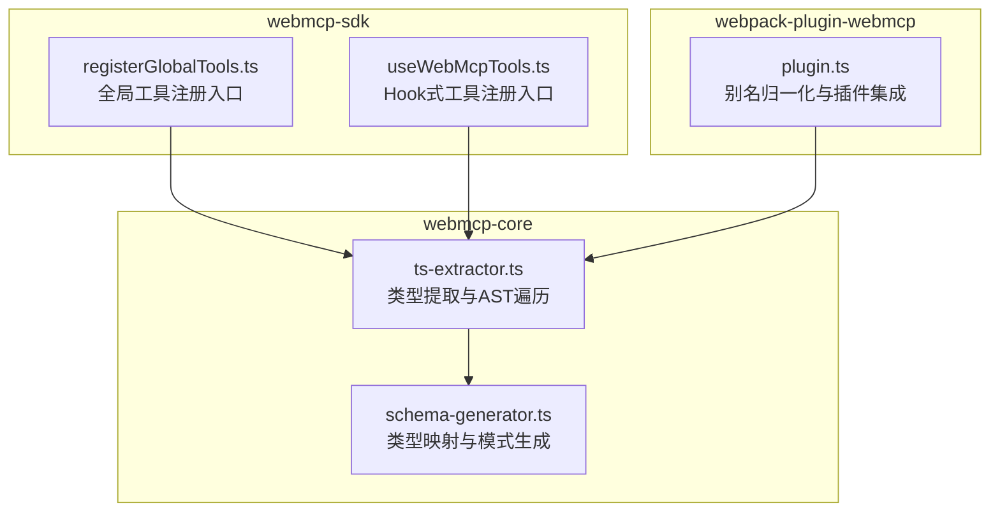
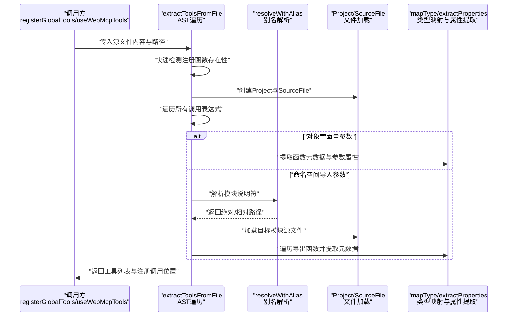
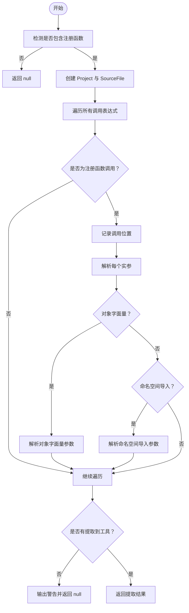
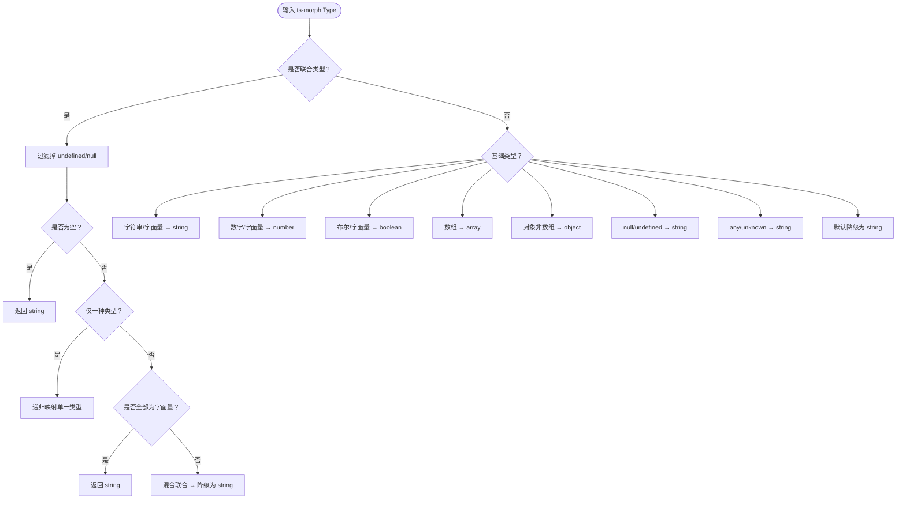
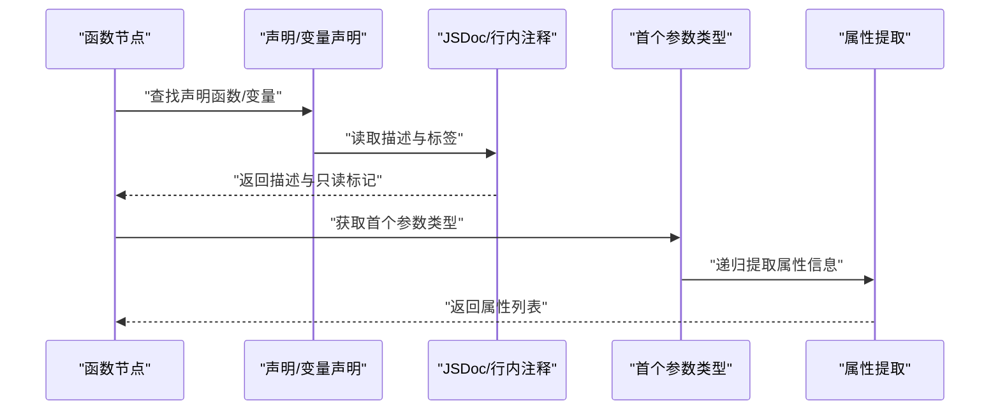
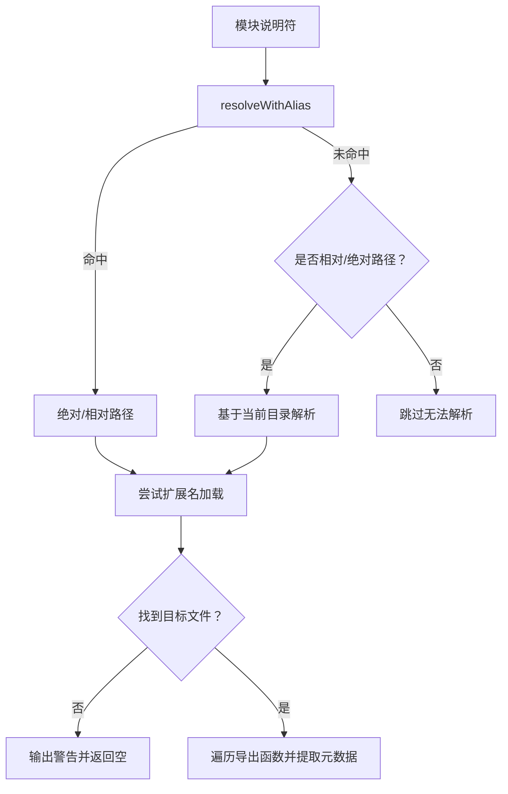
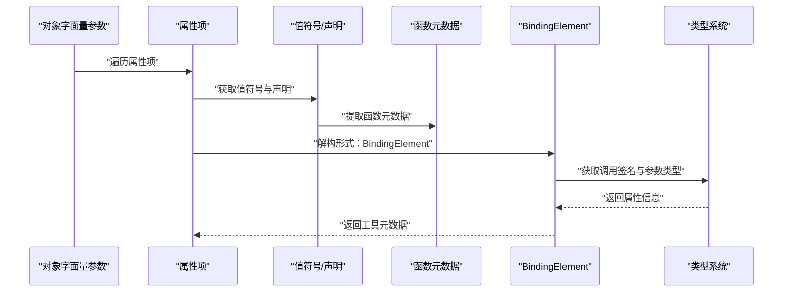
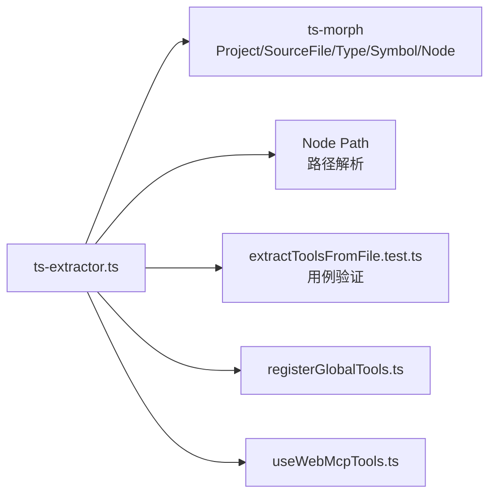

# 类型提取系统

<cite>
**本文档引用的文件**
- [packages/webmcp-core/src/ts-extractor.ts](file://packages/webmcp-core/src/ts-extractor.ts)
- [packages/webmcp-core/src/__tests__/extractToolsFromFile.test.ts](file://packages/webmcp-core/src/__tests__/extractToolsFromFile.test.ts)
- [packages/webmcp-sdk/src/registerGlobalTools.ts](file://packages/webmcp-sdk/src/registerGlobalTools.ts)
- [packages/webmcp-sdk/src/useWebMcpTools.ts](file://packages/webmcp-sdk/src/useWebMcpTools.ts)
- [packages/webmcp-core/src/schema-generator.ts](file://packages/webmcp-core/src/schema-generator.ts)
- [packages/webpack-plugin-webmcp/src/plugin.ts](file://packages/webpack-plugin-webmcp/src/plugin.ts)
</cite>

## 目录
1. [简介](#简介)
2. [项目结构](#项目结构)
3. [核心组件](#核心组件)
4. [架构总览](#架构总览)
5. [详细组件分析](#详细组件分析)
6. [依赖关系分析](#依赖关系分析)
7. [性能考虑](#性能考虑)
8. [故障排查指南](#故障排查指南)
9. [结论](#结论)
10. [附录](#附录)

## 简介
本文件面向类型提取系统的技术实现，重点阐述基于 ts-morph 的 TypeScript 源码解析流程，包括：
- AST 遍历与调用表达式识别
- JSDoc 注释提取与 @readonly 标签处理
- 类型信息收集与映射（含联合类型、字面量枚举、数组元素类型）
- 工具函数识别机制（函数签名分析、参数类型推断、返回值处理）
- 别名映射系统（模块路径解析、相对路径转换、绝对路径规范化）
- extractToolsFromFile 与相关 API 的使用示例、错误处理与边界情况

## 项目结构
类型提取系统位于 webmcp-core 包中，核心逻辑集中在 ts-extractor.ts，配合 SDK 的注册工具与测试用例验证行为。

图表来源
- [packages/webmcp-core/src/ts-extractor.ts:1-731](file://packages/webmcp-core/src/ts-extractor.ts#L1-L731)
- [packages/webmcp-core/src/schema-generator.ts](file://packages/webmcp-core/src/schema-generator.ts)
- [packages/webmcp-sdk/src/registerGlobalTools.ts](file://packages/webmcp-sdk/src/registerGlobalTools.ts)
- [packages/webmcp-sdk/src/useWebMcpTools.ts](file://packages/webmcp-sdk/src/useWebMcpTools.ts)
- [packages/webpack-plugin-webmcp/src/plugin.ts:1-45](file://packages/webpack-plugin-webmcp/src/plugin.ts#L1-L45)

章节来源
- [packages/webmcp-core/src/ts-extractor.ts:1-731](file://packages/webmcp-core/src/ts-extractor.ts#L1-L731)

## 核心组件
- 类型提取器（extractToolsFromFile）：扫描源文件中的注册调用，解析对象字面量与命名空间导入，提取工具元数据。
- 类型映射（mapType）：将 ts-morph 类型简化为 JSON Schema 风格的字符串类型。
- 属性提取（extractProperties）：递归提取对象属性的类型、描述、是否必填、枚举值、数组元素类型等。
- JSDoc 提取（getPropertyDescription / extractFunctionMetadata）：从函数声明与属性符号中提取描述与 @readonly 标签。
- 别名解析（resolveWithAlias）：支持 webpack/vite 风格的 alias，最长前缀优先匹配。
- 模块解析（resolveNamespaceImportArg）：结合 alias 与相对路径解析目标模块，加载源文件并遍历导出函数。

章节来源
- [packages/webmcp-core/src/ts-extractor.ts:641-730](file://packages/webmcp-core/src/ts-extractor.ts#L641-L730)
- [packages/webmcp-core/src/ts-extractor.ts:99-124](file://packages/webmcp-core/src/ts-extractor.ts#L99-L124)
- [packages/webmcp-core/src/ts-extractor.ts:174-201](file://packages/webmcp-core/src/ts-extractor.ts#L174-L201)
- [packages/webmcp-core/src/ts-extractor.ts:148-171](file://packages/webmcp-core/src/ts-extractor.ts#L148-L171)
- [packages/webmcp-core/src/ts-extractor.ts:206-282](file://packages/webmcp-core/src/ts-extractor.ts#L206-L282)
- [packages/webmcp-core/src/ts-extractor.ts:78-94](file://packages/webmcp-core/src/ts-extractor.ts#L78-L94)
- [packages/webmcp-core/src/ts-extractor.ts:504-632](file://packages/webmcp-core/src/ts-extractor.ts#L504-L632)

## 架构总览
类型提取系统采用“逆向追踪”策略：从注册调用出发，向上定位到函数定义或类型签名，再通过 ts-morph 的类型系统与语法树完成元数据提取。

图表来源
- [packages/webmcp-core/src/ts-extractor.ts:641-730](file://packages/webmcp-core/src/ts-extractor.ts#L641-L730)
- [packages/webmcp-core/src/ts-extractor.ts:78-94](file://packages/webmcp-core/src/ts-extractor.ts#L78-L94)
- [packages/webmcp-core/src/ts-extractor.ts:504-632](file://packages/webmcp-core/src/ts-extractor.ts#L504-L632)
- [packages/webmcp-core/src/ts-extractor.ts:99-124](file://packages/webmcp-core/src/ts-extractor.ts#L99-L124)
- [packages/webmcp-core/src/ts-extractor.ts:174-201](file://packages/webmcp-core/src/ts-extractor.ts#L174-L201)

## 详细组件分析

### 组件A：类型提取器 extractToolsFromFile
职责与流程
- 快速检测：若源文件不包含注册函数文本，则直接返回空结果。
- 初始化 ts-morph Project：设置编译选项（严格模式、ESNext、React JSX、Bundler 模块解析、esModuleInterop），可选 rootDir/baseUrl。
- 遍历所有调用表达式：识别 registerGlobalTools 与 useWebMcpTools 调用，记录调用位置。
- 分支解析：
  - 对象字面量参数：逐个属性提取工具元数据（名称、描述、参数属性、只读标记、注入目标）。
  - 命名空间导入参数：解析模块路径（alias/相对/绝对）、加载目标文件、遍历导出函数并提取元数据。
- 错误处理：捕获异常并输出调试日志，最终返回 null 或提取结果。

图表来源
- [packages/webmcp-core/src/ts-extractor.ts:641-730](file://packages/webmcp-core/src/ts-extractor.ts#L641-L730)

章节来源
- [packages/webmcp-core/src/ts-extractor.ts:641-730](file://packages/webmcp-core/src/ts-extractor.ts#L641-L730)

### 组件B：类型映射与属性提取
职责与流程
- 类型映射 mapType：将 ts-morph 类型映射为 JSON Schema 风格的字符串类型，处理联合类型（去除 undefined/null 后统一）、字面量、数组、对象、null/undefined/any/unknown 等。
- 数组元素类型 getArrayItemType：从类型参数中提取元素类型，若无参数则降级为 string。
- 字面量联合枚举 extractEnumValues：从联合类型中提取所有字符串字面量作为枚举候选。
- 属性提取 extractProperties：遍历对象属性，提取名称、类型、描述、是否必填、枚举值、数组元素类型，并对嵌套对象进行递归提取（深度限制）。

图表来源
- [packages/webmcp-core/src/ts-extractor.ts:99-124](file://packages/webmcp-core/src/ts-extractor.ts#L99-L124)

章节来源
- [packages/webmcp-core/src/ts-extractor.ts:99-124](file://packages/webmcp-core/src/ts-extractor.ts#L99-L124)
- [packages/webmcp-core/src/ts-extractor.ts:127-134](file://packages/webmcp-core/src/ts-extractor.ts#L127-L134)
- [packages/webmcp-core/src/ts-extractor.ts:137-145](file://packages/webmcp-core/src/ts-extractor.ts#L137-L145)
- [packages/webmcp-core/src/ts-extractor.ts:174-201](file://packages/webmcp-core/src/ts-extractor.ts#L174-L201)

### 组件C：JSDoc 注释提取与只读标记
职责与流程
- 函数元数据提取 extractFunctionMetadata：
  - 函数声明：直接从函数声明的 JSDoc 获取描述与标签。
  - 箭头/函数表达式：向上查找变量声明语句，从其 JSDoc 获取描述与 @readonly 标签。
  - 提取第一个参数的类型并递归提取属性。
- 属性描述提取 getPropertyDescription：
  - 从属性符号的声明中获取 JSDoc 描述。
  - 回退到行内注释（/** ... */）解析。

图表来源
- [packages/webmcp-core/src/ts-extractor.ts:206-282](file://packages/webmcp-core/src/ts-extractor.ts#L206-L282)
- [packages/webmcp-core/src/ts-extractor.ts:148-171](file://packages/webmcp-core/src/ts-extractor.ts#L148-L171)
- [packages/webmcp-core/src/ts-extractor.ts:174-201](file://packages/webmcp-core/src/ts-extractor.ts#L174-L201)

章节来源
- [packages/webmcp-core/src/ts-extractor.ts:206-282](file://packages/webmcp-core/src/ts-extractor.ts#L206-L282)
- [packages/webmcp-core/src/ts-extractor.ts:148-171](file://packages/webmcp-core/src/ts-extractor.ts#L148-L171)

### 组件D：别名映射系统与模块解析
职责与流程
- 别名解析 resolveWithAlias：
  - 支持精确匹配（key 以 $ 结尾）与前缀匹配（key 或 key/ 开头）。
  - 最长前缀优先，命中后返回替换后的路径，未命中返回 null。
- 命名空间导入解析 resolveNamespaceImportArg：
  - 优先使用 resolveWithAlias 解析模块说明符。
  - 若非别名命中且为相对路径或绝对路径，则基于当前文件目录解析。
  - 尝试多种扩展名（.ts、.tsx、/index.ts、/index.tsx）加载目标文件。
  - 遍历导出函数，提取元数据并设置注入目标为 namespace.exportName。

图表来源
- [packages/webmcp-core/src/ts-extractor.ts:78-94](file://packages/webmcp-core/src/ts-extractor.ts#L78-L94)
- [packages/webmcp-core/src/ts-extractor.ts:504-632](file://packages/webmcp-core/src/ts-extractor.ts#L504-L632)

章节来源
- [packages/webmcp-core/src/ts-extractor.ts:78-94](file://packages/webmcp-core/src/ts-extractor.ts#L78-L94)
- [packages/webmcp-core/src/ts-extractor.ts:504-632](file://packages/webmcp-core/src/ts-extractor.ts#L504-L632)

### 组件E：对象字面量参数解析与解构工具提取
职责与流程
- 对象字面量解析 resolveObjectLiteralArg：
  - 支持简写属性与属性赋值两种形式。
  - 通过 TypeScript 编译器 API 获取简写属性对应的值符号，转换为 ts-morph 节点。
  - 处理 useCallback 包裹的函数，取第一个参数。
  - 支持解构形式 const { fn } = obj：通过 BindingElement 的类型系统提取元数据。
  - 确定 injectionTarget：仅对简单标识符或属性访问表达式生成安全的注入目标。
- 解构工具提取 extractToolFromBindingElement：
  - 通过 BindingElement 的调用签名获取第一个参数类型并提取属性。
  - 从初始化表达式的属性符号中读取 JSDoc 描述与 @readonly 标签。

图表来源
- [packages/webmcp-core/src/ts-extractor.ts:385-498](file://packages/webmcp-core/src/ts-extractor.ts#L385-L498)
- [packages/webmcp-core/src/ts-extractor.ts:293-379](file://packages/webmcp-core/src/ts-extractor.ts#L293-L379)

章节来源
- [packages/webmcp-core/src/ts-extractor.ts:385-498](file://packages/webmcp-core/src/ts-extractor.ts#L385-L498)
- [packages/webmcp-core/src/ts-extractor.ts:293-379](file://packages/webmcp-core/src/ts-extractor.ts#L293-L379)

### 组件F：SDK 注册入口与使用方式
- registerGlobalTools：全局注册工具集合。
- useWebMcpTools：在组件生命周期中注册工具集合。
- 两者均作为 extractToolsFromFile 的目标调用，系统会扫描并提取其中的工具元数据。

章节来源
- [packages/webmcp-sdk/src/registerGlobalTools.ts](file://packages/webmcp-sdk/src/registerGlobalTools.ts)
- [packages/webmcp-sdk/src/useWebMcpTools.ts](file://packages/webmcp-sdk/src/useWebMcpTools.ts)

## 依赖关系分析
- ts-extractor.ts 依赖 ts-morph 的 Project、SourceFile、Type、Symbol、Node 等能力，用于构建 AST、查询类型、遍历节点。
- 别名解析与模块解析依赖 Node.js path 模块进行路径拼接与规范化。
- 测试用例覆盖 extractToolsFromFile 的别名解析、对象字面量与命名空间导入等场景。

图表来源
- [packages/webmcp-core/src/ts-extractor.ts:12-25](file://packages/webmcp-core/src/ts-extractor.ts#L12-L25)
- [packages/webmcp-core/src/ts-extractor.ts:504-632](file://packages/webmcp-core/src/ts-extractor.ts#L504-L632)
- [packages/webmcp-core/src/__tests__/extractToolsFromFile.test.ts:228-257](file://packages/webmcp-core/src/__tests__/extractToolsFromFile.test.ts#L228-L257)

章节来源
- [packages/webmcp-core/src/ts-extractor.ts:12-25](file://packages/webmcp-core/src/ts-extractor.ts#L12-L25)
- [packages/webmcp-core/src/__tests__/extractToolsFromFile.test.ts:228-257](file://packages/webmcp-core/src/__tests__/extractToolsFromFile.test.ts#L228-L257)

## 性能考虑
- AST 遍历：仅在包含注册函数文本时才进行完整遍历，避免不必要的开销。
- 类型递归：属性提取对嵌套对象有深度限制，防止深层结构导致的指数级复杂度。
- 文件加载：优先从项目缓存中获取已加载的 SourceFile，失败后再尝试添加文件，减少重复 IO。
- 别名匹配：按键长度降序排序，最长前缀优先，提高匹配效率。

## 故障排查指南
常见问题与处理建议
- 未命中注册函数：若源文件不含目标调用文本，将直接返回 null。请确认调用名称与 SDK 版本一致。
- 无法解析模块说明符：当模块为裸模块标识符且未命中别名时，会跳过该导入并输出警告。请检查 alias 配置或改用相对/绝对路径。
- 加载目标文件失败：尝试多种扩展名后仍失败，会输出详细尝试路径与警告。请确认模块路径与扩展名配置正确。
- 空结果：若未提取到任何工具，系统会输出警告并返回 null。请检查对象字面量属性、命名空间导入与导出函数的可见性。
- 调试模式：可通过环境变量开启调试输出，查看详细的解析步骤与警告信息。

章节来源
- [packages/webmcp-core/src/ts-extractor.ts:641-730](file://packages/webmcp-core/src/ts-extractor.ts#L641-L730)
- [packages/webmcp-core/src/ts-extractor.ts:546-553](file://packages/webmcp-core/src/ts-extractor.ts#L546-L553)
- [packages/webmcp-core/src/ts-extractor.ts:581-587](file://packages/webmcp-core/src/ts-extractor.ts#L581-L587)

## 结论
类型提取系统通过 ts-morph 实现对 TypeScript 源码的深度解析，结合别名映射与模块解析，能够在运行时安全地提取工具函数的元数据（描述、参数类型、只读标记等）。系统具备良好的扩展性与健壮性，适用于大型前端工程的工具注册与注入场景。

## 附录

### API 使用示例与最佳实践
- 基本用法
  - 输入：源文件内容、绝对路径、可选项目根目录、可选别名映射。
  - 输出：工具列表与注册调用位置信息；若无工具或解析失败则返回 null。
- 边界情况
  - 对象字面量中包含 useCallback 包裹的函数时，系统会自动取第一个参数作为函数节点。
  - 解构形式 const { fn } = obj：由于函数体不可达，系统通过类型系统逆向提取元数据。
  - 命名空间导入的注入目标为 namespace.exportName，确保运行时可正确引用。
- 错误处理
  - 捕获解析异常并输出调试信息，便于定位问题。
  - 对于无法解析的模块说明符，系统会给出详细警告与尝试路径。

章节来源
- [packages/webmcp-core/src/ts-extractor.ts:641-730](file://packages/webmcp-core/src/ts-extractor.ts#L641-L730)
- [packages/webmcp-core/src/__tests__/extractToolsFromFile.test.ts:228-257](file://packages/webmcp-core/src/__tests__/extractToolsFromFile.test.ts#L228-L257)