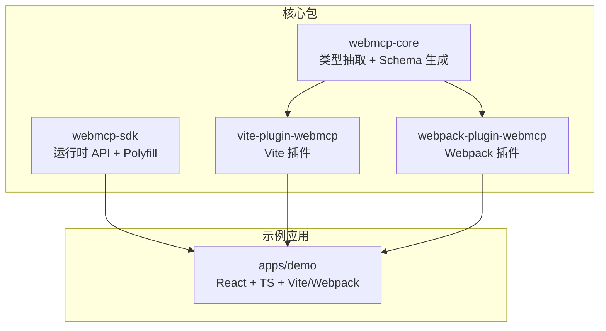
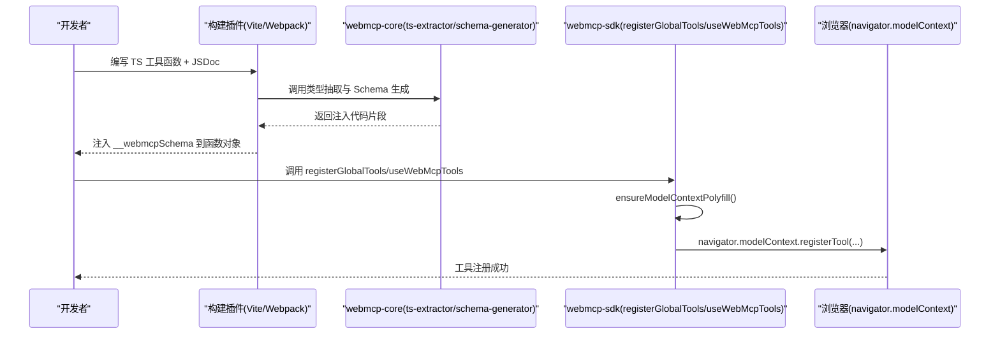
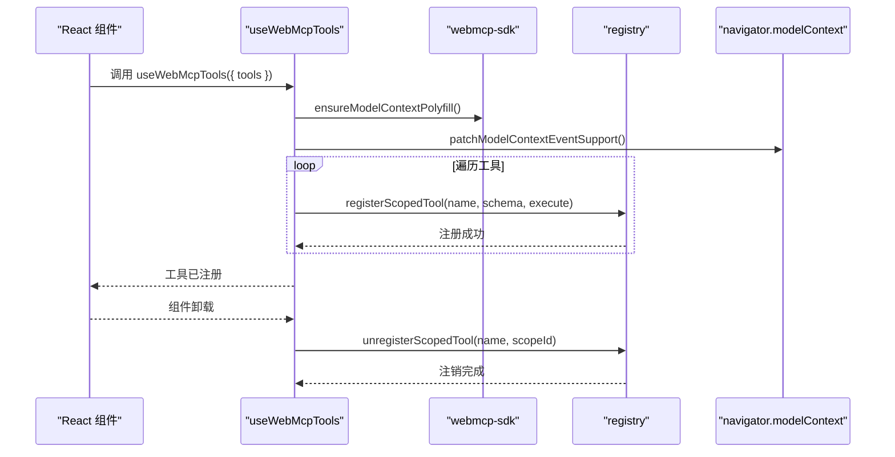
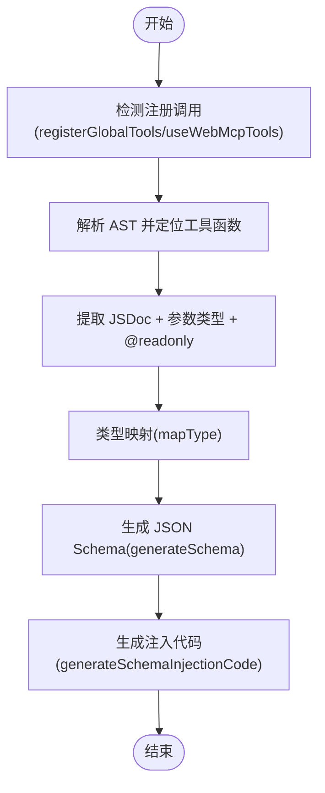
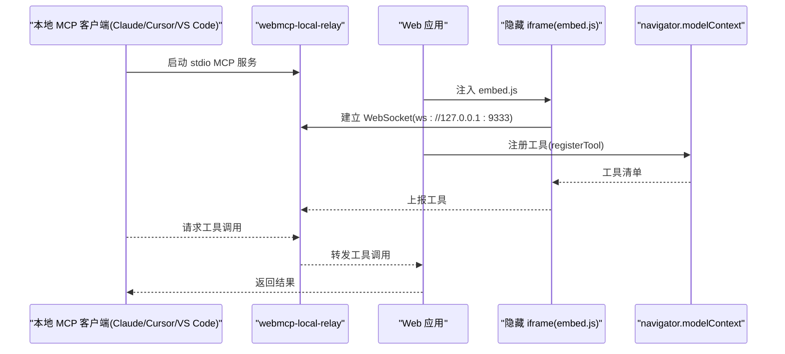
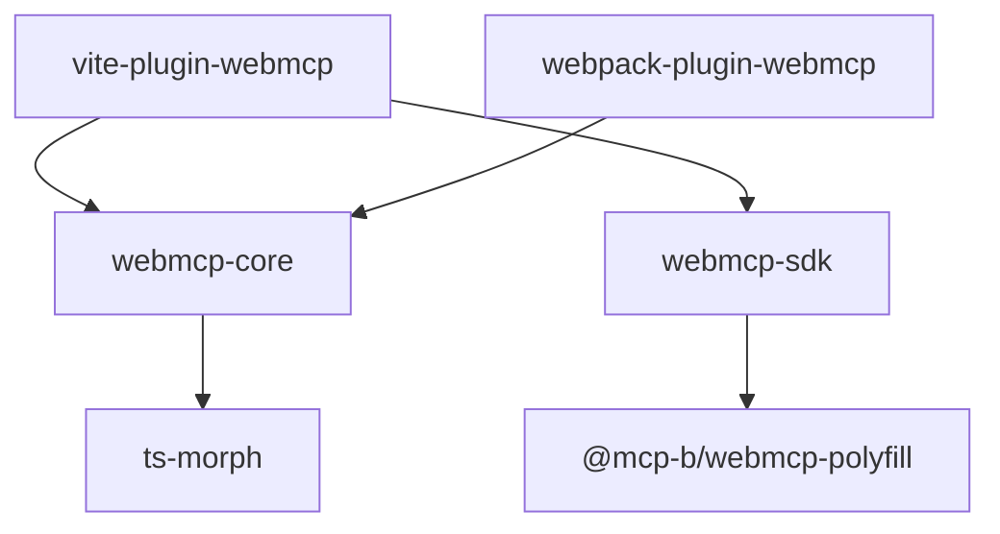

# WebMCP 标准与架构

<cite>
**本文引用的文件**
- [README.md](file://README.md)
- [packages/webmcp-core/src/index.ts](file://packages/webmcp-core/src/index.ts)
- [packages/webmcp-core/src/schema-generator.ts](file://packages/webmcp-core/src/schema-generator.ts)
- [packages/webmcp-core/src/ts-extractor.ts](file://packages/webmcp-core/src/ts-extractor.ts)
- [packages/webmcp-sdk/src/index.ts](file://packages/webmcp-sdk/src/index.ts)
- [packages/webmcp-sdk/src/registerGlobalTools.ts](file://packages/webmcp-sdk/src/registerGlobalTools.ts)
- [packages/webmcp-sdk/src/useWebMcpTools.ts](file://packages/webmcp-sdk/src/useWebMcpTools.ts)
- [packages/webmcp-sdk/src/polyfill.ts](file://packages/webmcp-sdk/src/polyfill.ts)
- [packages/webmcp-sdk/src/registry.ts](file://packages/webmcp-sdk/src/registry.ts)
- [packages/webmcp-sdk/src/types.ts](file://packages/webmcp-sdk/src/types.ts)
- [packages/vite-plugin-webmcp/src/index.ts](file://packages/vite-plugin-webmcp/src/index.ts)
- [packages/webpack-plugin-webmcp/src/index.ts](file://packages/webpack-plugin-webmcp/src/index.ts)
- [packages/webpack-plugin-webmcp/src/plugin.ts](file://packages/webpack-plugin-webmcp/src/plugin.ts)
- [packages/webpack-plugin-webmcp/src/loader.ts](file://packages/webpack-plugin-webmcp/src/loader.ts)
- [packages/webpack-plugin-webmcp/src/resolve-loader.ts](file://packages/webpack-plugin-webmcp/src/resolve-loader.ts)
- [apps/demo/src/main.tsx](file://apps/demo/src/main.tsx)
- [apps/demo/src/tools/queries.ts](file://apps/demo/src/tools/queries.ts)
- [apps/demo/src/tools/navigation.ts](file://apps/demo/src/tools/navigation.ts)
- [apps/demo/src/pages/TasksPage.tsx](file://apps/demo/src/pages/TasksPage.tsx)
- [apps/demo/index.html](file://apps/demo/index.html)
</cite>

## 目录
1. [引言](#引言)
2. [项目结构](#项目结构)
3. [核心组件](#核心组件)
4. [架构总览](#架构总览)
5. [详细组件分析](#详细组件分析)
6. [依赖分析](#依赖分析)
7. [性能考虑](#性能考虑)
8. [故障排查指南](#故障排查指南)
9. [结论](#结论)
10. [附录](#附录)

## 引言
WebMCP（Web Model-Controller-Presenter）标准旨在让网页通过 navigator.modelContext.registerTool() 将自身能力暴露为 MCP（Model Context Protocol）客户端可调用的工具。WebMCP Nexus 是围绕该标准的一套生产可用的前端工程化方案，提供极简 API、构建时类型反推、三级注册策略、浏览器兼容与 polyfill 自动切换、以及与本地 Agent 的直连能力。

- 核心理念：零侵入地将普通 TS 函数暴露为 WebMCP 工具，函数保持原样，原有调用方完全无感。
- 架构要点：运行时 SDK 提供两个 API（registerGlobalTools / useWebMcpTools），构建插件在构建时基于 ts-morph 静态分析 TS 类型 + JSDoc，自动生成 JSON Schema 并注入到函数对象上，运行时读取注入的 schema 通过 navigator.modelContext 完成注册。
- 与传统 MVC 的区别：WebMCP 更强调“工具”作为模型-控制器-展示器的统一抽象，将前端交互、业务逻辑与外部 Agent 的调用统一到工具层，便于 Agent 驱动 UI 与执行业务操作。

章节来源
- [README.md:43-52](file://README.md#L43-L52)
- [README.md:178-201](file://README.md#L178-L201)

## 项目结构
该项目采用 pnpm workspace 的 monorepo 结构，主要包含以下模块：
- packages/webmcp-core：构建时核心，负责 TS 类型抽取与 JSON Schema 生成。
- packages/webmcp-sdk：运行时 SDK，提供两个 API 与 polyfill 自动切换。
- packages/vite-plugin-webmcp：Vite 构建插件，集成 core 与 sdk。
- packages/webpack-plugin-webmcp：Webpack 构建插件，集成 core。
- apps/demo：最佳实践示例应用，演示全局、路由、组件三级注册策略。
- skill：面向 AI 编码 Agent 的 Skill 文档。

图表来源
- [README.md:76-89](file://README.md#L76-L89)
- [packages/webmcp-core/src/index.ts:1-11](file://packages/webmcp-core/src/index.ts#L1-L11)
- [packages/webmcp-sdk/src/index.ts:1-5](file://packages/webmcp-sdk/src/index.ts#L1-L5)
- [packages/vite-plugin-webmcp/src/index.ts](file://packages/vite-plugin-webmcp/src/index.ts)
- [packages/webpack-plugin-webmcp/src/index.ts](file://packages/webpack-plugin-webmcp/src/index.ts)

章节来源
- [README.md:76-89](file://README.md#L76-L89)

## 核心组件
- 运行时 SDK（webmcp-sdk）
  - registerGlobalTools：全局注册，应用启动时调用一次，适合通用 API（查询、认证、CRUD）。
  - useWebMcpTools：React Hook，绑定组件/路由生命周期，支持 HMR，适合当前路由独占或局部交互。
  - polyfill：根据浏览器能力自动加载内置 polyfill，保证在旧版浏览器也能工作。
  - registry：内部注册中心，维护 scope ownership，支持工具名冲突感知与注销隔离。
- 构建时核心（webmcp-core）
  - ts-extractor：基于 ts-morph 的类型抽取器，从 TS 类型 + JSDoc 提取工具元数据。
  - schema-generator：将属性信息映射为 JSON Schema，并生成注入代码。
- 构建插件（vite-plugin-webmcp / webpack-plugin-webmcp）
  - Vite 插件：在构建时扫描工具文件，注入 __webmcpSchema。
  - Webpack 插件：提供 loader 与插件组合，实现相同功能。

章节来源
- [README.md:47-74](file://README.md#L47-L74)
- [packages/webmcp-sdk/src/registerGlobalTools.ts:26-68](file://packages/webmcp-sdk/src/registerGlobalTools.ts#L26-L68)
- [packages/webmcp-sdk/src/useWebMcpTools.ts:46-136](file://packages/webmcp-sdk/src/useWebMcpTools.ts#L46-L136)
- [packages/webmcp-core/src/ts-extractor.ts:641-731](file://packages/webmcp-core/src/ts-extractor.ts#L641-L731)
- [packages/webmcp-core/src/schema-generator.ts:28-86](file://packages/webmcp-core/src/schema-generator.ts#L28-L86)

## 架构总览
WebMCP Nexus 的整体架构分为三层：构建期、运行期与浏览器期。
- 构建期：Vite/ Webpack 插件扫描工具文件，使用 ts-morph 解析 TS 类型与 JSDoc，生成 JSON Schema 并注入到函数对象的 __webmcpSchema 字段。
- 运行期：SDK 在运行时读取 __webmcpSchema，调用 navigator.modelContext.registerTool() 完成注册；同时根据环境自动加载 polyfill。
- 浏览器期：浏览器通过 navigator.modelContext 暴露工具，本地 Agent（如 Claude Desktop / Cursor / VS Code）经 relay 与页面 iframe 通信，实现对 Web 应用的直接操控。

图表来源
- [packages/vite-plugin-webmcp/src/index.ts](file://packages/vite-plugin-webmcp/src/index.ts)
- [packages/webpack-plugin-webmcp/src/index.ts](file://packages/webpack-plugin-webmcp/src/index.ts)
- [packages/webmcp-core/src/ts-extractor.ts:641-731](file://packages/webmcp-core/src/ts-extractor.ts#L641-L731)
- [packages/webmcp-core/src/schema-generator.ts:69-86](file://packages/webmcp-core/src/schema-generator.ts#L69-L86)
- [packages/webmcp-sdk/src/registerGlobalTools.ts:26-68](file://packages/webmcp-sdk/src/registerGlobalTools.ts#L26-L68)
- [packages/webmcp-sdk/src/useWebMcpTools.ts:46-136](file://packages/webmcp-sdk/src/useWebMcpTools.ts#L46-L136)

## 详细组件分析

### 运行时 API：registerGlobalTools 与 useWebMcpTools
- registerGlobalTools
  - 功能：全局注册工具，适合应用启动时一次性注册的通用 API。
  - 实现要点：调用 ensureModelContextPolyfill() 确保 polyfill 加载；读取函数对象上的 __webmcpSchema 注入的 JSON Schema；通过 registerScopedTool 注册到全局作用域；最后通知工具变更事件。
- useWebMcpTools
  - 功能：React Hook，将一组函数注册为 WebMCP 工具，并在组件卸载时自动注销。
  - 实现要点：使用 useRef 持有最新函数引用，避免闭包陷阱；以工具名集合为依赖，工具集合变化时重新注册；支持 HMR 版本号增量，确保 schema 变更触发重新注册；注销时遵循 scope ownership，仅清理当前组件作用域。

图表来源
- [packages/webmcp-sdk/src/useWebMcpTools.ts:46-136](file://packages/webmcp-sdk/src/useWebMcpTools.ts#L46-L136)
- [packages/webmcp-sdk/src/registerGlobalTools.ts:26-68](file://packages/webmcp-sdk/src/registerGlobalTools.ts#L26-L68)
- [packages/webmcp-sdk/src/registry.ts](file://packages/webmcp-sdk/src/registry.ts)

章节来源
- [packages/webmcp-sdk/src/registerGlobalTools.ts:26-68](file://packages/webmcp-sdk/src/registerGlobalTools.ts#L26-L68)
- [packages/webmcp-sdk/src/useWebMcpTools.ts:46-136](file://packages/webmcp-sdk/src/useWebMcpTools.ts#L46-L136)

### 构建时类型抽取与 Schema 生成
- ts-extractor
  - 支持两种参数形式：对象字面量 { fn1, fn2 } 与命名空间导入 import * as api from './module'。
  - 使用 ts-morph 解析函数签名、参数类型、JSDoc 与 @readonly 标签，提取工具元数据。
  - 支持模块路径别名解析（webpack/vite alias），最长前缀优先。
- schema-generator
  - 将 PropertyInfo 映射为 JSON Schema，支持基础类型、字面量联合、可选属性、嵌套对象（≤3 层）。
  - 生成 __webmcpSchema 注入代码，包含 description、inputSchema、readOnly。

图表来源
- [packages/webmcp-core/src/ts-extractor.ts:641-731](file://packages/webmcp-core/src/ts-extractor.ts#L641-L731)
- [packages/webmcp-core/src/schema-generator.ts:28-135](file://packages/webmcp-core/src/schema-generator.ts#L28-L135)

章节来源
- [packages/webmcp-core/src/ts-extractor.ts:641-731](file://packages/webmcp-core/src/ts-extractor.ts#L641-L731)
- [packages/webmcp-core/src/schema-generator.ts:28-135](file://packages/webmcp-core/src/schema-generator.ts#L28-L135)

### 浏览器兼容与 Polyfill 自动切换
- 环境判定：Chrome 146+ 使用原生 navigator.modelContext；其他环境自动加载内置 @mcp-b/webmcp-polyfill。
- SDK 入口：ensureModelContextPolyfill() 在运行时惰性加载 polyfill，业务代码完全无感。
- 事件支持增强：patchModelContextEventSupport() 为 modelContext 补齐事件支持，提升兼容性。

章节来源
- [README.md:342-348](file://README.md#L342-L348)
- [packages/webmcp-sdk/src/polyfill.ts](file://packages/webmcp-sdk/src/polyfill.ts)
- [packages/webmcp-sdk/src/registerGlobalTools.ts:27-34](file://packages/webmcp-sdk/src/registerGlobalTools.ts#L27-L34)
- [packages/webmcp-sdk/src/useWebMcpTools.ts:86-92](file://packages/webmcp-sdk/src/useWebMcpTools.ts#L86-L92)

### 三级注册策略与生命周期
- 全局注册：registerGlobalTools，应用启动时注册，适合通用 API。
- 路由注册：useWebMcpTools，在路由级注册当前页面独占的操作。
- 组件注册：useWebMcpTools，在组件级注册弹窗、面板等局部交互，组件卸载自动注销，避免“幽灵工具”。

章节来源
- [README.md:178-201](file://README.md#L178-L201)
- [packages/webmcp-sdk/src/registerGlobalTools.ts:26-68](file://packages/webmcp-sdk/src/registerGlobalTools.ts#L26-L68)
- [packages/webmcp-sdk/src/useWebMcpTools.ts:46-136](file://packages/webmcp-sdk/src/useWebMcpTools.ts#L46-L136)

### 本地 Agent 直连与桌面 Relay
- 工作原理：本地 MCP 客户端通过 @mcp-b/webmcp-local-relay 在本机以 stdio MCP server 形式运行，同时在 localhost:9333 暴露 WebSocket 端点；Web 应用通过加载 embed.js 注入隐藏 iframe，与 relay 建立连接，上报 navigator.modelContext 注册的工具。
- 接入步骤：在应用入口 HTML 追加 embed.js；在 MCP 客户端配置 relay；启动应用并在 Agent 端驱动。

图表来源
- [README.md:227-241](file://README.md#L227-L241)
- [README.md:249-258](file://README.md#L249-L258)
- [README.md:262-277](file://README.md#L262-L277)
- [apps/demo/index.html](file://apps/demo/index.html)

章节来源
- [README.md:223-290](file://README.md#L223-L290)
- [apps/demo/index.html](file://apps/demo/index.html)

### 示例应用与最佳实践
- 全局工具注册入口：apps/demo/src/main.tsx
- 全局查询工具集：apps/demo/src/tools/queries.ts
- 路由跳转工具：apps/demo/src/tools/navigation.ts
- 页面级工具注册：apps/demo/src/pages/TasksPage.tsx
- 示例应用还包含 HMR 调试面板、组件级表单工具等。

章节来源
- [README.md:202-222](file://README.md#L202-L222)
- [apps/demo/src/main.tsx](file://apps/demo/src/main.tsx)
- [apps/demo/src/tools/queries.ts](file://apps/demo/src/tools/queries.ts)
- [apps/demo/src/tools/navigation.ts](file://apps/demo/src/tools/navigation.ts)
- [apps/demo/src/pages/TasksPage.tsx](file://apps/demo/src/pages/TasksPage.tsx)

## 依赖分析
- 包依赖关系
  - webmcp-sdk 依赖 @mcp-b/webmcp-polyfill，提供浏览器兼容。
  - vite-plugin-webmcp 与 webpack-plugin-webmcp 依赖 webmcp-core 与 webmcp-sdk。
  - 构建插件通过 ts-morph 驱动类型抽取，生成注入代码。
- 外部依赖
  - @mcp-b/webmcp-polyfill：为旧版浏览器提供 navigator.modelContext 的 polyfill。
  - ts-morph：AST 解析与类型系统访问。

图表来源
- [packages/webmcp-sdk/package.json:47](file://packages/webmcp-sdk/package.json#L47)
- [packages/vite-plugin-webmcp/package.json:48](file://packages/vite-plugin-webmcp/package.json#L48)
- [packages/webpack-plugin-webmcp/package.json:45](file://packages/webpack-plugin-webmcp/package.json#L45)
- [packages/webmcp-core/package.json:48](file://packages/webmcp-core/package.json#L48)

章节来源
- [packages/webmcp-sdk/package.json:46-61](file://packages/webmcp-sdk/package.json#L46-L61)
- [packages/vite-plugin-webmcp/package.json:46-59](file://packages/vite-plugin-webmcp/package.json#L46-L59)
- [packages/webpack-plugin-webmcp/package.json:44-56](file://packages/webpack-plugin-webmcp/package.json#L44-L56)
- [packages/webmcp-core/package.json:47-56](file://packages/webmcp-core/package.json#L47-L56)

## 性能考虑
- 构建时生成 Schema：基于 ts-morph 的静态分析，函数签名即 JSON Schema，无运行时开销。
- HMR 友好：通过 HMR 版本号增量与工具名集合依赖，确保 schema 变更触发最小化重注册。
- 作用域隔离：组件级工具随生命周期挂载/卸载，避免全局污染与重复注册。
- polyfill 惰性加载：仅在需要时加载，减少主线程负担。

章节来源
- [README.md:68-74](file://README.md#L68-L74)
- [packages/webmcp-sdk/src/useWebMcpTools.ts:17-26](file://packages/webmcp-sdk/src/useWebMcpTools.ts#L17-L26)
- [packages/webmcp-sdk/src/useWebMcpTools.ts:67-135](file://packages/webmcp-sdk/src/useWebMcpTools.ts#L67-L135)

## 故障排查指南
- 工具未注册
  - 检查是否正确在构建时注入 __webmcpSchema（参考构建插件配置）。
  - 确认函数对象上存在 __webmcpSchema 字段。
- 工具名冲突
  - SDK 内部维护 scope ownership registry，多作用域同名工具会发出警告但允许注册；注销时仅清理当前作用域。
- 浏览器不支持
  - 确认 ensureModelContextPolyfill() 是否正常加载；检查 navigator.modelContext 是否可用。
- HMR 未生效
  - 确认 Vite 环境与 import.meta.hot 是否可用；检查 HMR 版本号增量逻辑。

章节来源
- [README.md:349-356](file://README.md#L349-L356)
- [packages/webmcp-sdk/src/registerGlobalTools.ts:27-30](file://packages/webmcp-sdk/src/registerGlobalTools.ts#L27-L30)
- [packages/webmcp-sdk/src/useWebMcpTools.ts:86-92](file://packages/webmcp-sdk/src/useWebMcpTools.ts#L86-L92)

## 结论
WebMCP Nexus 通过“零侵入”的 API 设计、构建时类型反推与运行时 polyfill 自动切换，将前端工具化能力与 MCP 生态无缝对接。其三级注册策略与作用域隔离有效避免了工具污染与生命周期问题；与本地 Agent 的直连能力则让 Web 应用真正成为 Agent 的“双手”。随着 WebMCP 标准在 W3C 的推进，该方案将持续演进，为前端智能化提供坚实基础。

章节来源
- [README.md:392-398](file://README.md#L392-L398)

## 附录
- 标准推进与 W3C 关系
  - WebMCP 标准由 Google 与 Microsoft 联合推动，WebMCP Nexus 提供生产可用的工程化实现与 polyfill，建议同步关注上游进展。
- 类型支持范围
  - 已稳定支持：基础类型、字面量联合、可选属性、嵌套对象（≤3 层）。
  - 不建议依赖：泛型、映射类型/条件类型、超过 3 层的深度嵌套、对象数组中的对象元素 schema。

章节来源
- [README.md:358-372](file://README.md#L358-L372)
- [README.md:394-397](file://README.md#L394-L397)