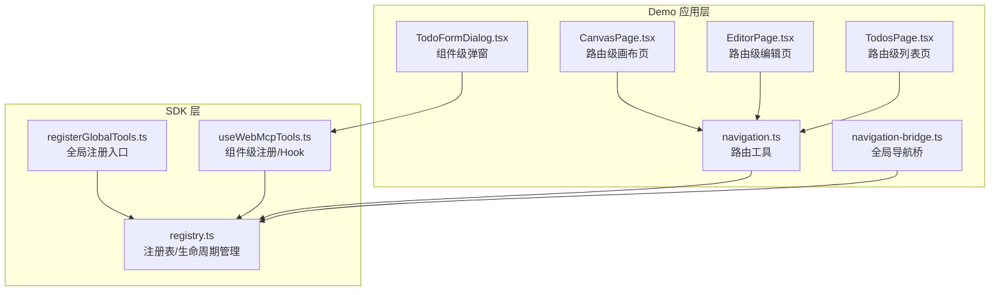
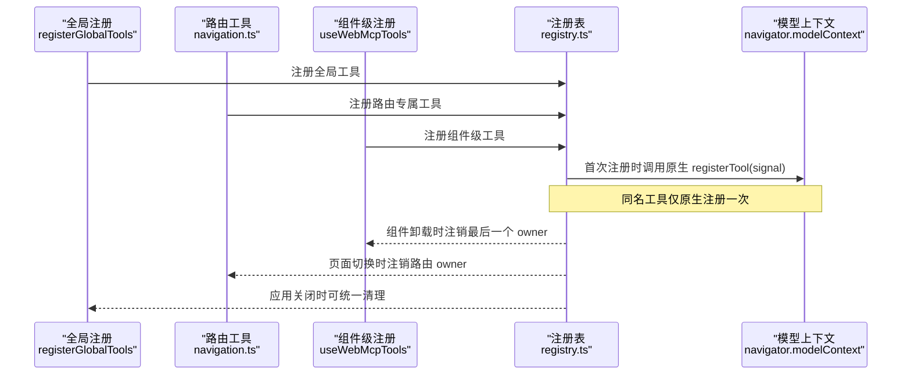
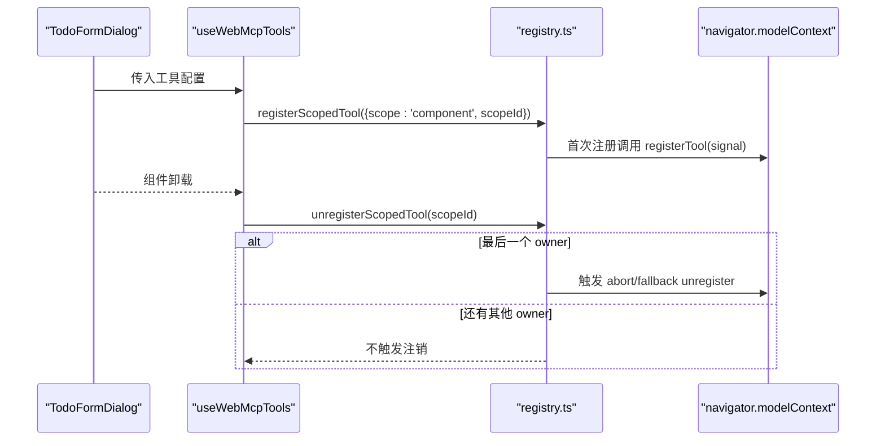
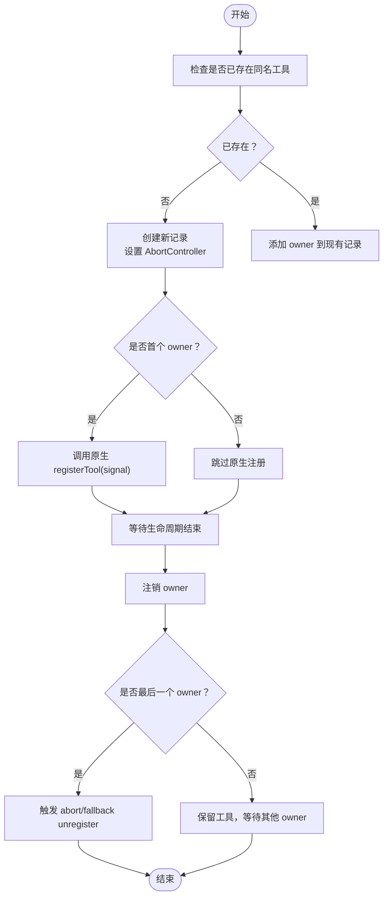
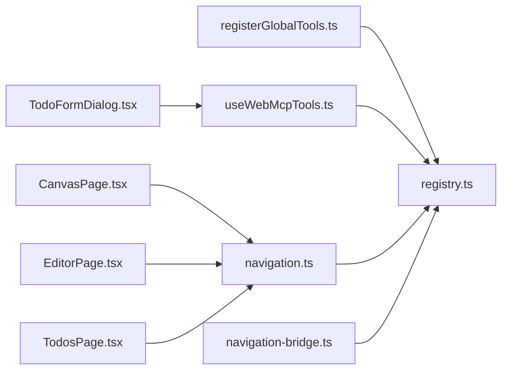

# 三级注册策略

<cite>
**本文引用的文件**
- [packages/webmcp-sdk/src/registry.ts](file://packages/webmcp-sdk/src/registry.ts)
- [packages/webmcp-sdk/src/registerGlobalTools.ts](file://packages/webmcp-sdk/src/registerGlobalTools.ts)
- [packages/webmcp-sdk/src/useWebMcpTools.ts](file://packages/webmcp-sdk/src/useWebMcpTools.ts)
- [packages/webmcp-sdk/src/__tests__/registry.test.ts](file://packages/webmcp-sdk/src/__tests__/registry.test.ts)
- [packages/webmcp-sdk/src/__tests__/registerGlobalTools.test.ts](file://packages/webmcp-sdk/src/__tests__/registerGlobalTools.test.ts)
- [packages/webmcp-sdk/src/__tests__/useWebMcpTools.test.ts](file://packages/webmcp-sdk/src/__tests__/useWebMcpTools.test.ts)
- [apps/demo/src/tools/navigation.ts](file://apps/demo/src/tools/navigation.ts)
- [apps/demo/src/tools/navigation-bridge.ts](file://apps/demo/src/tools/navigation-bridge.ts)
- [apps/demo/src/components/TodoFormDialog.tsx](file://apps/demo/src/components/TodoFormDialog.tsx)
- [apps/demo/src/pages/CanvasPage.tsx](file://apps/demo/src/pages/CanvasPage.tsx)
- [apps/demo/src/pages/EditorPage.tsx](file://apps/demo/src/pages/EditorPage.tsx)
- [apps/demo/src/pages/TodosPage.tsx](file://apps/demo/src/pages/TodosPage.tsx)
</cite>

## 目录
1. [引言](#引言)
2. [项目结构](#项目结构)
3. [核心组件](#核心组件)
4. [架构总览](#架构总览)
5. [详细组件分析](#详细组件分析)
6. [依赖关系分析](#依赖关系分析)
7. [性能考量](#性能考量)
8. [故障排查指南](#故障排查指南)
9. [结论](#结论)
10. [附录](#附录)

## 引言
本文件系统性阐述 WebMCP Nexus 的“三级注册策略”，即全局、路由、组件三个层级的工具注册机制。目标是帮助开发者在不同场景下正确选择与组合注册策略，确保工具调用的准确性、安全性与可维护性，并避免“幽灵工具”污染上下文。

## 项目结构
WebMCP SDK 提供了注册、生命周期管理与自动注销能力，Demo 应用展示了三种典型使用场景：
- 全局注册：在应用启动阶段一次性注册通用工具（如导航桥接、认证辅助等）
- 路由级注册：在页面组件挂载时按路由注册专属工具（如画布工具、编辑器工具）
- 组件级注册：在弹窗、面板等局部交互中动态注册临时工具（如待办表单对话框）

图表来源
- [packages/webmcp-sdk/src/registry.ts](file://packages/webmcp-sdk/src/registry.ts)
- [packages/webmcp-sdk/src/registerGlobalTools.ts](file://packages/webmcp-sdk/src/registerGlobalTools.ts)
- [packages/webmcp-sdk/src/useWebMcpTools.ts](file://packages/webmcp-sdk/src/useWebMcpTools.ts)
- [apps/demo/src/tools/navigation.ts](file://apps/demo/src/tools/navigation.ts)
- [apps/demo/src/tools/navigation-bridge.ts](file://apps/demo/src/tools/navigation-bridge.ts)
- [apps/demo/src/components/TodoFormDialog.tsx](file://apps/demo/src/components/TodoFormDialog.tsx)
- [apps/demo/src/pages/CanvasPage.tsx](file://apps/demo/src/pages/CanvasPage.tsx)
- [apps/demo/src/pages/EditorPage.tsx](file://apps/demo/src/pages/EditorPage.tsx)
- [apps/demo/src/pages/TodosPage.tsx](file://apps/demo/src/pages/TodosPage.tsx)

章节来源
- [packages/webmcp-sdk/src/registry.ts](file://packages/webmcp-sdk/src/registry.ts)
- [packages/webmcp-sdk/src/registerGlobalTools.ts](file://packages/webmcp-sdk/src/registerGlobalTools.ts)
- [packages/webmcp-sdk/src/useWebMcpTools.ts](file://packages/webmcp-sdk/src/useWebMcpTools.ts)
- [apps/demo/src/tools/navigation.ts](file://apps/demo/src/tools/navigation.ts)
- [apps/demo/src/tools/navigation-bridge.ts](file://apps/demo/src/tools/navigation-bridge.ts)
- [apps/demo/src/components/TodoFormDialog.tsx](file://apps/demo/src/components/TodoFormDialog.tsx)
- [apps/demo/src/pages/CanvasPage.tsx](file://apps/demo/src/pages/CanvasPage.tsx)
- [apps/demo/src/pages/EditorPage.tsx](file://apps/demo/src/pages/EditorPage.tsx)
- [apps/demo/src/pages/TodosPage.tsx](file://apps/demo/src/pages/TodosPage.tsx)

## 核心组件
- 注册表与生命周期管理（registry.ts）
  - 维护“活跃工具”记录、所有者映射、AbortController 控制信号
  - 支持同名工具在多作用域聚合，仅原生注册一次
  - 提供注册/注销入口与清理函数，保障 SSR 安全
- 全局注册（registerGlobalTools.ts）
  - 面向应用级通用工具，如导航桥、认证辅助、CRUD 辅助等
  - 通常在应用启动时一次性注册，生命周期贯穿整个应用
- 组件级注册（useWebMcpTools.ts）
  - 面向局部交互，如弹窗、面板、卡片等
  - 通过 React Hook 自动在挂载时注册、卸载时注销，避免“幽灵工具”

章节来源
- [packages/webmcp-sdk/src/registry.ts](file://packages/webmcp-sdk/src/registry.ts)
- [packages/webmcp-sdk/src/registerGlobalTools.ts](file://packages/webmcp-sdk/src/registerGlobalTools.ts)
- [packages/webmcp-sdk/src/useWebMcpTools.ts](file://packages/webmcp-sdk/src/useWebMcpTools.ts)

## 架构总览
三级注册策略的核心在于“作用域隔离 + 生命周期绑定 + 自动注销”。下图展示三类注册入口与 SDK 内部的交互：

图表来源
- [packages/webmcp-sdk/src/registerGlobalTools.ts](file://packages/webmcp-sdk/src/registerGlobalTools.ts)
- [packages/webmcp-sdk/src/useWebMcpTools.ts](file://packages/webmcp-sdk/src/useWebMcpTools.ts)
- [packages/webmcp-sdk/src/registry.ts](file://packages/webmcp-sdk/src/registry.ts)

## 详细组件分析

### 1) 全局注册：全局工具的集中式管理
- 适用场景
  - 通用 API：查询、认证、CRUD 等跨页面复用的能力
  - 应用级桥接：如导航桥、全局状态桥接
  - 长生命周期：随应用启动而存在，直至应用销毁
- 实现要点
  - 在应用初始化阶段调用全局注册入口，批量注入工具
  - 使用注册表的“同名工具仅原生注册一次”语义，避免重复调用底层 registerTool
  - 通过 AbortController 与底层上下文联动，支持优雅取消
- Demo 示例
  - 导航桥接工具在 Demo 中作为全局工具使用，便于各页面共享导航能力

章节来源
- [packages/webmcp-sdk/src/registerGlobalTools.ts](file://packages/webmcp-sdk/src/registerGlobalTools.ts)
- [packages/webmcp-sdk/src/registry.ts](file://packages/webmcp-sdk/src/registry.ts)
- [apps/demo/src/tools/navigation-bridge.ts](file://apps/demo/src/tools/navigation-bridge.ts)

### 2) 路由级注册：按页面独占的工具
- 适用场景
  - 当前路由独占的操作：如画布绘制、富文本编辑、任务列表等
  - 页面切换时需要独立的工具集，避免相互干扰
- 实现要点
  - 在页面组件挂载时注册，页面卸载时注销
  - 与路由生命周期绑定，确保工具只在当前路由生效
  - 通过注册表的“同名工具聚合多作用域 owner”，避免重复原生注册
- Demo 示例
  - 画布页、编辑器页、待办列表页分别注册各自专属工具，页面切换时自动回收

章节来源
- [packages/webmcp-sdk/src/registry.ts](file://packages/webmcp-sdk/src/registry.ts)
- [apps/demo/src/pages/CanvasPage.tsx](file://apps/demo/src/pages/CanvasPage.tsx)
- [apps/demo/src/pages/EditorPage.tsx](file://apps/demo/src/pages/EditorPage.tsx)
- [apps/demo/src/pages/TodosPage.tsx](file://apps/demo/src/pages/TodosPage.tsx)
- [apps/demo/src/tools/navigation.ts](file://apps/demo/src/tools/navigation.ts)

### 3) 组件级注册：弹窗、面板等局部交互
- 适用场景
  - 短生命周期、局部可见的交互：如弹窗、抽屉、气泡面板
  - 需要即时注册、即时注销，避免常驻污染
- 实现要点
  - 使用组件级 Hook，在 useEffect 或类似生命周期中注册
  - 卸载时自动注销最后一个 owner，触发底层 abort/fallback unregister
  - 通过引用包装 execute 函数，保证执行的是最新版本
- Demo 示例
  - 待办表单对话框在打开时注册工具，关闭时自动注销，防止“幽灵工具”

图表来源
- [packages/webmcp-sdk/src/useWebMcpTools.ts](file://packages/webmcp-sdk/src/useWebMcpTools.ts)
- [packages/webmcp-sdk/src/registry.ts](file://packages/webmcp-sdk/src/registry.ts)

章节来源
- [packages/webmcp-sdk/src/useWebMcpTools.ts](file://packages/webmcp-sdk/src/useWebMcpTools.ts)
- [packages/webmcp-sdk/src/registry.ts](file://packages/webmcp-sdk/src/registry.ts)
- [apps/demo/src/components/TodoFormDialog.tsx](file://apps/demo/src/components/TodoFormDialog.tsx)

### 4) 作用域隔离与自动注销机制
- 作用域隔离
  - 通过 scope 与 scopeId 将工具所有权限定在特定作用域
  - 同名工具可在不同 scope 注册，但仅原生注册一次
- 生命周期绑定
  - 每个工具维护 owners 映射，记录所有持有者
  - 仅当最后一个 owner 注销时，才触发底层 abort 或 fallback unregister
- 自动注销
  - 组件级 Hook 在卸载时自动注销
  - 路由级工具在页面切换时可配合路由生命周期进行回收
  - 全局工具需显式清理或在应用关闭时统一清理

图表来源
- [packages/webmcp-sdk/src/registry.ts](file://packages/webmcp-sdk/src/registry.ts)

章节来源
- [packages/webmcp-sdk/src/registry.ts](file://packages/webmcp-sdk/src/registry.ts)

### 5) 如何选择合适的注册策略
- 全局注册
  - 适用于跨页面、长生命周期、通用能力
  - 优点：集中管理、减少重复注册
  - 注意：避免过度注册导致上下文膨胀
- 路由级注册
  - 适用于当前路由独占的工具集
  - 优点：与路由生命周期绑定，避免相互干扰
  - 注意：页面切换时及时回收
- 组件级注册
  - 适用于弹窗、面板等短生命周期交互
  - 优点：自动注销，避免“幽灵工具”
  - 注意：确保 scopeId 唯一且稳定

章节来源
- [packages/webmcp-sdk/src/registerGlobalTools.ts](file://packages/webmcp-sdk/src/registerGlobalTools.ts)
- [packages/webmcp-sdk/src/useWebMcpTools.ts](file://packages/webmcp-sdk/src/useWebMcpTools.ts)
- [apps/demo/src/pages/CanvasPage.tsx](file://apps/demo/src/pages/CanvasPage.tsx)
- [apps/demo/src/pages/EditorPage.tsx](file://apps/demo/src/pages/EditorPage.tsx)
- [apps/demo/src/pages/TodosPage.tsx](file://apps/demo/src/pages/TodosPage.tsx)
- [apps/demo/src/components/TodoFormDialog.tsx](file://apps/demo/src/components/TodoFormDialog.tsx)

### 6) 避免“幽灵工具”的最佳实践
- 使用组件级注册时务必在卸载时注销
- 路由切换时同步回收路由级工具
- 全局工具在应用退出或重载时统一清理
- 同名工具在不同作用域注册时注意控制台告警，避免重复注册
- 在 SSR 场景下，确保仅在浏览器端执行原生注册

章节来源
- [packages/webmcp-sdk/src/__tests__/registry.test.ts](file://packages/webmcp-sdk/src/__tests__/registry.test.ts)
- [packages/webmcp-sdk/src/__tests__/registerGlobalTools.test.ts](file://packages/webmcp-sdk/src/__tests__/registerGlobalTools.test.ts)
- [packages/webmcp-sdk/src/__tests__/useWebMcpTools.test.ts](file://packages/webmcp-sdk/src/__tests__/useWebMcpTools.test.ts)

## 依赖关系分析
- 全局注册依赖注册表与模型上下文，确保工具一次性原生注册并受控取消
- 路由级注册与组件级注册均依赖注册表的 owner 聚合与自动注销逻辑
- Demo 应用中的页面与组件通过工具配置与注册表建立松耦合关系

图表来源
- [packages/webmcp-sdk/src/registerGlobalTools.ts](file://packages/webmcp-sdk/src/registerGlobalTools.ts)
- [packages/webmcp-sdk/src/useWebMcpTools.ts](file://packages/webmcp-sdk/src/useWebMcpTools.ts)
- [packages/webmcp-sdk/src/registry.ts](file://packages/webmcp-sdk/src/registry.ts)
- [apps/demo/src/tools/navigation.ts](file://apps/demo/src/tools/navigation.ts)
- [apps/demo/src/tools/navigation-bridge.ts](file://apps/demo/src/tools/navigation-bridge.ts)
- [apps/demo/src/components/TodoFormDialog.tsx](file://apps/demo/src/components/TodoFormDialog.tsx)
- [apps/demo/src/pages/CanvasPage.tsx](file://apps/demo/src/pages/CanvasPage.tsx)
- [apps/demo/src/pages/EditorPage.tsx](file://apps/demo/src/pages/EditorPage.tsx)
- [apps/demo/src/pages/TodosPage.tsx](file://apps/demo/src/pages/TodosPage.tsx)

章节来源
- [packages/webmcp-sdk/src/registry.ts](file://packages/webmcp-sdk/src/registry.ts)
- [packages/webmcp-sdk/src/registerGlobalTools.ts](file://packages/webmcp-sdk/src/registerGlobalTools.ts)
- [packages/webmcp-sdk/src/useWebMcpTools.ts](file://packages/webmcp-sdk/src/useWebMcpTools.ts)
- [apps/demo/src/tools/navigation.ts](file://apps/demo/src/tools/navigation.ts)
- [apps/demo/src/tools/navigation-bridge.ts](file://apps/demo/src/tools/navigation-bridge.ts)
- [apps/demo/src/components/TodoFormDialog.tsx](file://apps/demo/src/components/TodoFormDialog.tsx)
- [apps/demo/src/pages/CanvasPage.tsx](file://apps/demo/src/pages/CanvasPage.tsx)
- [apps/demo/src/pages/EditorPage.tsx](file://apps/demo/src/pages/EditorPage.tsx)
- [apps/demo/src/pages/TodosPage.tsx](file://apps/demo/src/pages/TodosPage.tsx)

## 性能考量
- 原生注册去重：同名工具仅原生注册一次，降低上下文压力
- 按需注册：组件级与路由级注册仅在需要时生效，避免全局常驻
- Abort 控制：通过 AbortController 快速取消未完成操作，提升响应性
- SSR 安全：在无 navigator 环境下静默跳过，避免运行时错误

## 故障排查指南
- 同名工具在不同作用域重复注册
  - 现象：控制台出现告警
  - 处理：合并注册或调整 scopeId，确保唯一性
- 注销无效或“幽灵工具”残留
  - 现象：工具仍在上下文中可用
  - 处理：确认是否为最后一个 owner；确保组件卸载或路由切换时正确注销
- SSR 报错或行为异常
  - 现象：在服务端渲染时报错或无响应
  - 处理：确保仅在浏览器端执行原生注册；参考测试用例中的模拟处理

章节来源
- [packages/webmcp-sdk/src/__tests__/registry.test.ts](file://packages/webmcp-sdk/src/__tests__/registry.test.ts)
- [packages/webmcp-sdk/src/__tests__/registerGlobalTools.test.ts](file://packages/webmcp-sdk/src/__tests__/registerGlobalTools.test.ts)
- [packages/webmcp-sdk/src/__tests__/useWebMcpTools.test.ts](file://packages/webmcp-sdk/src/__tests__/useWebMcpTools.test.ts)

## 结论
WebMCP Nexus 的三级注册策略通过“作用域隔离 + 生命周期绑定 + 自动注销”实现了对工具注册的精细化控制。合理选择全局、路由、组件三个层级的注册方式，既能满足不同场景的需求，又能有效避免“幽灵工具”污染，确保工具调用的准确性与安全性。

## 附录
- 关键流程路径
  - 全局注册入口：[registerGlobalTools.ts](file://packages/webmcp-sdk/src/registerGlobalTools.ts)
  - 组件级注册 Hook：[useWebMcpTools.ts](file://packages/webmcp-sdk/src/useWebMcpTools.ts)
  - 注册表与生命周期管理：[registry.ts](file://packages/webmcp-sdk/src/registry.ts)
- Demo 示例路径
  - 路由工具：[navigation.ts](file://apps/demo/src/tools/navigation.ts)
  - 导航桥接：[navigation-bridge.ts](file://apps/demo/src/tools/navigation-bridge.ts)
  - 组件级弹窗：[TodoFormDialog.tsx](file://apps/demo/src/components/TodoFormDialog.tsx)
  - 路由页面：[CanvasPage.tsx](file://apps/demo/src/pages/CanvasPage.tsx), [EditorPage.tsx](file://apps/demo/src/pages/EditorPage.tsx), [TodosPage.tsx](file://apps/demo/src/pages/TodosPage.tsx)