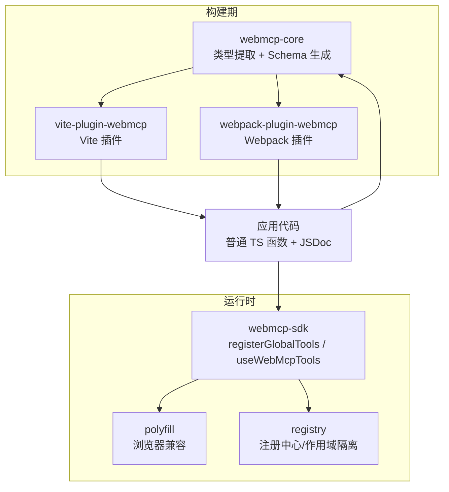
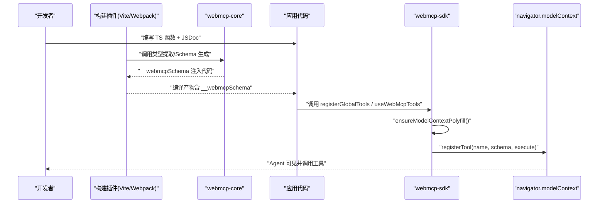
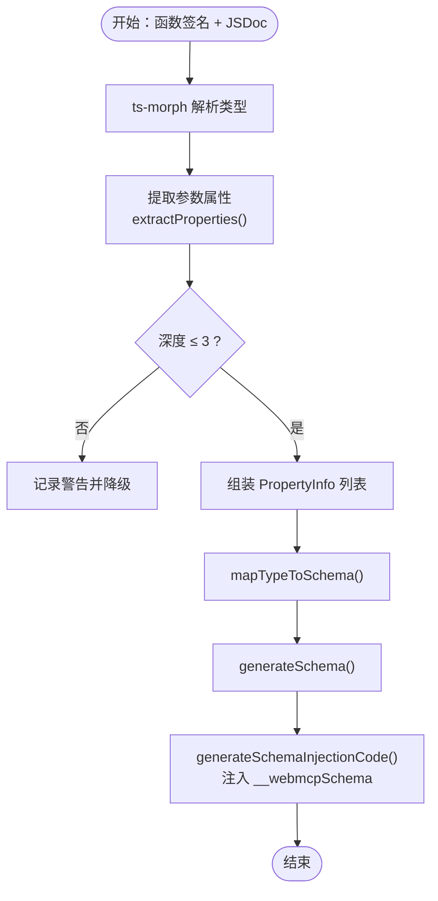
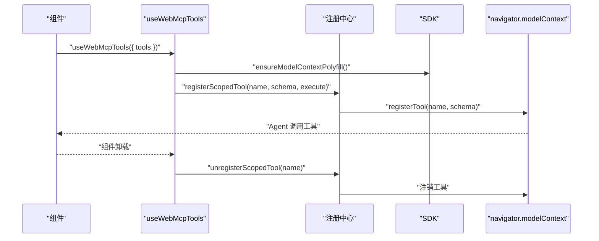
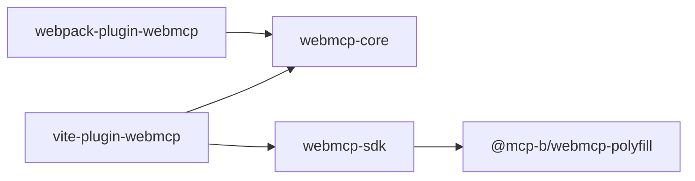

# 核心概念

<cite>
**本文引用的文件**
- [README.md](file://README.md)
- [packages/webmcp-core/src/index.ts](file://packages/webmcp-core/src/index.ts)
- [packages/webmcp-core/src/schema-generator.ts](file://packages/webmcp-core/src/schema-generator.ts)
- [packages/webmcp-core/src/ts-extractor.ts](file://packages/webmcp-core/src/ts-extractor.ts)
- [packages/webmcp-sdk/src/index.ts](file://packages/webmcp-sdk/src/index.ts)
- [packages/webmcp-sdk/src/registerGlobalTools.ts](file://packages/webmcp-sdk/src/registerGlobalTools.ts)
- [packages/webmcp-sdk/src/useWebMcpTools.ts](file://packages/webmcp-sdk/src/useWebMcpTools.ts)
- [packages/webmcp-sdk/src/polyfill.ts](file://packages/webmcp-sdk/src/polyfill.ts)
- [packages/webmcp-sdk/src/registry.ts](file://packages/webmcp-sdk/src/registry.ts)
- [packages/webmcp-sdk/src/types.ts](file://packages/webmcp-sdk/src/types.ts)
- [packages/vite-plugin-webmcp/src/index.ts](file://packages/vite-plugin-webmcp/src/index.ts)
- [packages/webpack-plugin-webmcp/src/index.ts](file://packages/webpack-plugin-webmcp/src/index.ts)
- [packages/webpack-plugin-webmcp/src/plugin.ts](file://packages/webpack-plugin-webmcp/src/plugin.ts)
- [packages/webpack-plugin-webmcp/src/loader.ts](file://packages/webpack-plugin-webmcp/src/loader.ts)
- [packages/webpack-plugin-webmcp/src/resolve-loader.ts](file://packages/webpack-plugin-webmcp/src/resolve-loader.ts)
- [apps/demo/src/main.tsx](file://apps/demo/src/main.tsx)
- [apps/demo/src/tools/queries.ts](file://apps/demo/src/tools/queries.ts)
- [apps/demo/src/tools/navigation.ts](file://apps/demo/src/tools/navigation.ts)
- [apps/demo/src/pages/TasksPage.tsx](file://apps/demo/src/pages/TasksPage.tsx)
</cite>

## 目录
1. [引言](#引言)
2. [项目结构](#项目结构)
3. [核心组件](#核心组件)
4. [架构总览](#架构总览)
5. [详细组件分析](#详细组件分析)
6. [依赖关系分析](#依赖关系分析)
7. [性能考量](#性能考量)
8. [故障排查指南](#故障排查指南)
9. [结论](#结论)
10. [附录](#附录)

## 引言
本文件面向希望深入理解 WebMCP Nexus 的开发者，系统阐述以下主题：
- WebMCP 标准的工作原理与浏览器兼容策略
- 构建时类型提取机制：ts-morph 如何从 TypeScript 类型与 JSDoc 反推出 JSON Schema
- 三级注册策略：全局、路由、组件级别的工具注册与生命周期管理
- 作用域隔离与冲突感知机制
- 零侵入设计的优势与实现方式
- 通过架构图与数据流图帮助理解复杂概念

## 项目结构
WebMCP Nexus 采用多包工作区组织，核心分为三部分：
- 构建时内核：webmcp-core，负责 ts-morph 静态分析与 JSON Schema 生成
- 运行时 SDK：webmcp-sdk，提供 registerGlobalTools 与 useWebMcpTools 两个 API，以及 polyfill 与注册中心
- 构建插件：vite-plugin-webmcp 与 webpack-plugin-webmcp，分别对接 Vite 与 Webpack，在构建期注入 __webmcpSchema

图表来源
- [packages/webmcp-core/src/index.ts:1-11](file://packages/webmcp-core/src/index.ts#L1-L11)
- [packages/webmcp-sdk/src/index.ts:1-5](file://packages/webmcp-sdk/src/index.ts#L1-L5)
- [packages/vite-plugin-webmcp/src/index.ts](file://packages/vite-plugin-webmcp/src/index.ts)
- [packages/webpack-plugin-webmcp/src/index.ts](file://packages/webpack-plugin-webmcp/src/index.ts)

章节来源
- [README.md:76-89](file://README.md#L76-L89)

## 核心组件
- 构建时内核（webmcp-core）
  - 类型提取：基于 ts-morph 的静态分析，从函数签名与 JSDoc 提取工具元数据
  - Schema 生成：将 PropertyInfo 映射为 JSON Schema，并生成注入代码
- 运行时 SDK（webmcp-sdk）
  - API：registerGlobalTools（全局一次性注册）、useWebMcpTools（组件/路由生命周期绑定）
  - 兼容层：根据环境自动加载 polyfill
  - 注册中心：统一管理工具注册、注销与事件通知
- 构建插件（vite-plugin-webmcp / webpack-plugin-webmcp）
  - Vite：在构建时调用 core，注入 __webmcpSchema 到函数对象
  - Webpack：通过 loader 与插件组合，实现相同效果

章节来源
- [packages/webmcp-core/src/ts-extractor.ts:1-731](file://packages/webmcp-core/src/ts-extractor.ts#L1-L731)
- [packages/webmcp-core/src/schema-generator.ts:1-135](file://packages/webmcp-core/src/schema-generator.ts#L1-L135)
- [packages/webmcp-sdk/src/registerGlobalTools.ts:1-68](file://packages/webmcp-sdk/src/registerGlobalTools.ts#L1-L68)
- [packages/webmcp-sdk/src/useWebMcpTools.ts:1-136](file://packages/webmcp-sdk/src/useWebMcpTools.ts#L1-L136)

## 架构总览
下图展示了从“普通 TS 函数 + JSDoc”到“浏览器模型上下文工具”的完整链路。

图表来源
- [packages/webmcp-core/src/ts-extractor.ts:641-731](file://packages/webmcp-core/src/ts-extractor.ts#L641-L731)
- [packages/webmcp-core/src/schema-generator.ts:69-86](file://packages/webmcp-core/src/schema-generator.ts#L69-L86)
- [packages/webmcp-sdk/src/registerGlobalTools.ts:26-67](file://packages/webmcp-sdk/src/registerGlobalTools.ts#L26-L67)
- [packages/webmcp-sdk/src/useWebMcpTools.ts:46-135](file://packages/webmcp-sdk/src/useWebMcpTools.ts#L46-L135)

## 详细组件分析

### 1) WebMCP 标准与浏览器兼容策略
- 标准行为：通过 navigator.modelContext.registerTool 暴露工具，参数与返回值由 JSON Schema 描述
- 兼容策略：SDK 在运行时检测 navigator.modelContext 存在性；若缺失则自动加载内置 polyfill，对业务代码零感知
- 版本覆盖：Chrome 146+ 使用原生；低版本与非 Chrome 内核通过 polyfill 透明桥接

章节来源
- [README.md:342-348](file://README.md#L342-L348)
- [packages/webmcp-sdk/src/polyfill.ts](file://packages/webmcp-sdk/src/polyfill.ts)
- [packages/webmcp-sdk/src/registerGlobalTools.ts:26-67](file://packages/webmcp-sdk/src/registerGlobalTools.ts#L26-L67)
- [packages/webmcp-sdk/src/useWebMcpTools.ts:85-89](file://packages/webmcp-sdk/src/useWebMcpTools.ts#L85-L89)

### 2) 构建时类型提取与 JSON Schema 生成
- 类型提取（ts-extractor）
  - 支持两类输入：对象字面量 { fn } 与命名空间导入 import * as ns
  - 通过 ts-morph 解析函数签名与 JSDoc，提取 description、readOnly、参数属性列表
  - 对嵌套对象递归提取，限制最大深度（默认 ≤3 层）
- JSON Schema 生成（schema-generator）
  - 将 PropertyInfo 映射为 JSON Schema，支持基础类型、枚举、数组、对象
  - 生成注入代码，将 { description, inputSchema, readOnly } 写入函数的 __webmcpSchema 字段
- 注入目标（injectionTarget）
  - 对象字面量：若值为简单标识符或属性访问表达式，则可注入；否则跳过
  - 命名空间导入：注入为 ns.exportName

图表来源
- [packages/webmcp-core/src/ts-extractor.ts:174-201](file://packages/webmcp-core/src/ts-extractor.ts#L174-L201)
- [packages/webmcp-core/src/schema-generator.ts:28-53](file://packages/webmcp-core/src/schema-generator.ts#L28-L53)
- [packages/webmcp-core/src/schema-generator.ts:88-134](file://packages/webmcp-core/src/schema-generator.ts#L88-L134)
- [packages/webmcp-core/src/schema-generator.ts:69-86](file://packages/webmcp-core/src/schema-generator.ts#L69-L86)

章节来源
- [packages/webmcp-core/src/ts-extractor.ts:1-731](file://packages/webmcp-core/src/ts-extractor.ts#L1-L731)
- [packages/webmcp-core/src/schema-generator.ts:1-135](file://packages/webmcp-core/src/schema-generator.ts#L1-L135)

### 3) 三级注册策略与生命周期管理
- 全局注册（registerGlobalTools）
  - 应用启动时一次性注册，适合通用 API（查询、认证、CRUD）
  - 通过遍历传入的对象集合，读取 __webmcpSchema 并向 modelContext 注册
- 路由/组件注册（useWebMcpTools）
  - 组件挂载时注册，卸载时自动注销，避免“幽灵工具”
  - 使用 useRef 持有最新函数引用，避免闭包陷阱；以工具名集合为依赖，仅在集合变化时重新注册
  - 支持 HMR：监听 afterUpdate，版本号递增触发重新注册（schema 变更）

图表来源
- [packages/webmcp-sdk/src/useWebMcpTools.ts:46-135](file://packages/webmcp-sdk/src/useWebMcpTools.ts#L46-L135)
- [packages/webmcp-sdk/src/registerGlobalTools.ts:26-67](file://packages/webmcp-sdk/src/registerGlobalTools.ts#L26-L67)

章节来源
- [README.md:178-201](file://README.md#L178-L201)
- [packages/webmcp-sdk/src/registerGlobalTools.ts:1-68](file://packages/webmcp-sdk/src/registerGlobalTools.ts#L1-L68)
- [packages/webmcp-sdk/src/useWebMcpTools.ts:1-136](file://packages/webmcp-sdk/src/useWebMcpTools.ts#L1-L136)

### 4) 作用域隔离与冲突感知
- 作用域模型
  - 全局：scope='global'，scopeId='app'
  - 组件：scope='component'，scopeId 唯一标识组件实例
- 冲突策略
  - 同名工具在多作用域注册时，控制台发出警告但不中断；注销时仅清理当前作用域，避免互相影响
- 注册中心
  - 维护 scope ownership registry，记录每个工具名的注册来源（scope + scopeId）
  - 提供 registerEntry、registerScopedTool、unregisterScopedTool、notifyToolsChanged 等接口

章节来源
- [README.md:349-357](file://README.md#L349-L357)
- [packages/webmcp-sdk/src/registry.ts](file://packages/webmcp-sdk/src/registry.ts)

### 5) 零侵入设计
- 设计优势
  - 函数保持原样，原有调用方完全无感
  - 仅通过 JSDoc 与类型声明即可生成工具描述与参数 schema
- 实现要点
  - 构建期注入：在编译产物中为函数附加 __webmcpSchema
  - 运行期读取：SDK 从函数对象读取 schema，不改变函数签名或调用方式
  - 与 HMR 友好：schema 变更时自动重新注册，无需手动刷新

章节来源
- [README.md:58-63](file://README.md#L58-L63)
- [packages/webmcp-core/src/schema-generator.ts:69-86](file://packages/webmcp-core/src/schema-generator.ts#L69-L86)
- [packages/webmcp-sdk/src/useWebMcpTools.ts:17-26](file://packages/webmcp-sdk/src/useWebMcpTools.ts#L17-L26)

### 6) 类型支持范围与限制
- 已稳定支持
  - 基础类型（string/number/boolean）
  - 字面量联合（'a'|'b'|'c' → enum）
  - 可选属性（prop? → 不进入 required）
  - 嵌套对象（≤3 层）
- 不建议依赖
  - 泛型（Record/Partial/Pick 等）
  - 映射类型/条件类型
  - 超过 3 层的深度嵌套；对象数组中的对象元素 schema

章节来源
- [README.md:358-372](file://README.md#L358-L372)

### 7) 示例应用与接入路径
- 全局工具注册入口：apps/demo/src/main.tsx
- 全局查询工具集：apps/demo/src/tools/queries.ts
- 路由跳转工具：apps/demo/src/tools/navigation.ts
- 页面级工具注册：apps/demo/src/pages/TasksPage.tsx

章节来源
- [README.md:202-222](file://README.md#L202-L222)
- [apps/demo/src/main.tsx](file://apps/demo/src/main.tsx)
- [apps/demo/src/tools/queries.ts](file://apps/demo/src/tools/queries.ts)
- [apps/demo/src/tools/navigation.ts](file://apps/demo/src/tools/navigation.ts)
- [apps/demo/src/pages/TasksPage.tsx](file://apps/demo/src/pages/TasksPage.tsx)

## 依赖关系分析
- 包间依赖
  - vite-plugin-webmcp 与 webpack-plugin-webmcp 依赖 webmcp-core 与 webmcp-sdk
  - webmcp-sdk 依赖 @mcp-b/webmcp-polyfill
- 运行时依赖
  - React（peerDependency）
  - 浏览器 navigator.modelContext（原生或 polyfill）

图表来源
- [packages/vite-plugin-webmcp/package.json:46-48](file://packages/vite-plugin-webmcp/package.json#L46-L48)
- [packages/webpack-plugin-webmcp/package.json:44-46](file://packages/webpack-plugin-webmcp/package.json#L44-L46)
- [packages/webmcp-sdk/package.json:47](file://packages/webmcp-sdk/package.json#L47)

章节来源
- [packages/vite-plugin-webmcp/package.json:1-59](file://packages/vite-plugin-webmcp/package.json#L1-L59)
- [packages/webpack-plugin-webmcp/package.json:1-56](file://packages/webpack-plugin-webmcp/package.json#L1-L56)
- [packages/webmcp-sdk/package.json:1-62](file://packages/webmcp-sdk/package.json#L1-L62)

## 性能考量
- 构建时开销
  - ts-morph 解析仅发生在构建期，运行时无反射成本
  - 注入的 __webmcpSchema 为静态元数据，读取 O(1)
- 运行时开销
  - 注册/注销为轻量操作，受工具数量线性影响
  - HMR 仅在 schema 变更或工具集合变化时触发重新注册
- 兼容层开销
  - polyfill 仅在需要时加载，且为惰性初始化

## 故障排查指南
- 工具未出现在 Agent 中
  - 检查函数是否带有 __webmcpSchema（构建产物中应存在）
  - 确认已调用 registerGlobalTools 或在组件中调用 useWebMcpTools
  - 确认浏览器环境具备 navigator.modelContext 或已正确加载 polyfill
- 同名工具冲突
  - 控制台会警告，但不会阻止注册；注销时仅清理当前作用域
  - 建议使用语义化唯一工具名，避免层级冲突
- HMR 后 schema 未更新
  - 确认插件已启用并监听 afterUpdate；组件内会基于 localHmrVersion 重新注册

章节来源
- [packages/webmcp-sdk/src/registerGlobalTools.ts:26-67](file://packages/webmcp-sdk/src/registerGlobalTools.ts#L26-L67)
- [packages/webmcp-sdk/src/useWebMcpTools.ts:17-26](file://packages/webmcp-sdk/src/useWebMcpTools.ts#L17-L26)
- [README.md:349-357](file://README.md#L349-L357)

## 结论
WebMCP Nexus 通过“构建时类型反推 + 运行时零侵入注册”的双轮驱动，将普通 TS 函数无缝暴露为 MCP 工具。其设计在以下方面达成平衡：
- 开发体验：仅需 JSDoc 与类型声明，零包装、零侵入
- 工程化：构建期生成 schema，运行期零开销
- 生态兼容：原生 + polyfill 双通道，覆盖主流浏览器
- 生命周期：三级作用域与自动注销，避免资源泄漏
- 可观测性：HMR 友好、冲突告警、调试面板

## 附录
- 关键 API 一览
  - registerGlobalTools：全局一次性注册
  - useWebMcpTools：组件/路由生命周期绑定注册
- 类型与工具元数据
  - WebMcpAnnotatedFn：函数对象附加 __webmcpSchema
  - WebMcpToolSchema：工具描述与参数 schema
- 构建插件配置
  - Vite：include 指定扫描目录
  - Webpack：插件 + loader 组合，支持 alias 解析

章节来源
- [packages/webmcp-sdk/src/index.ts:1-5](file://packages/webmcp-sdk/src/index.ts#L1-L5)
- [packages/webmcp-sdk/src/types.ts](file://packages/webmcp-sdk/src/types.ts)
- [README.md:111-146](file://README.md#L111-L146)