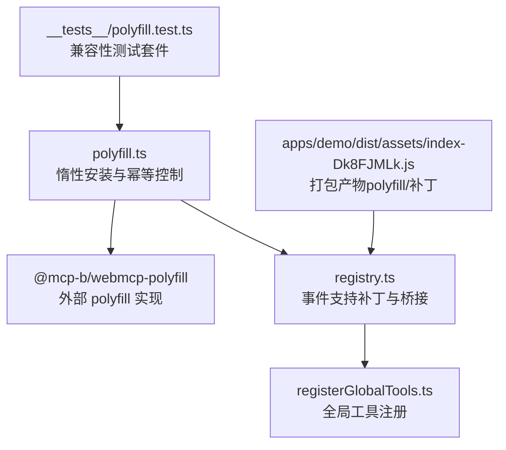
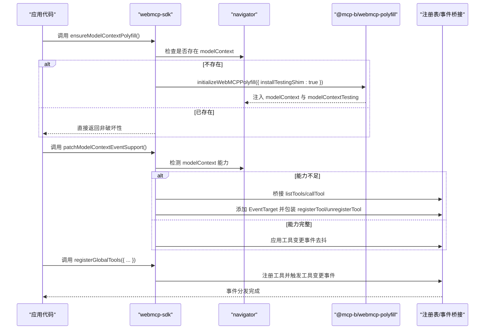
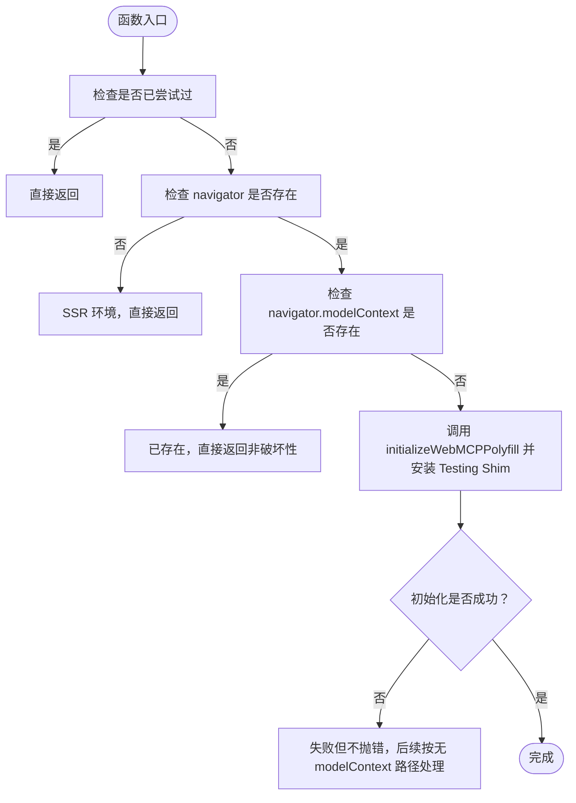
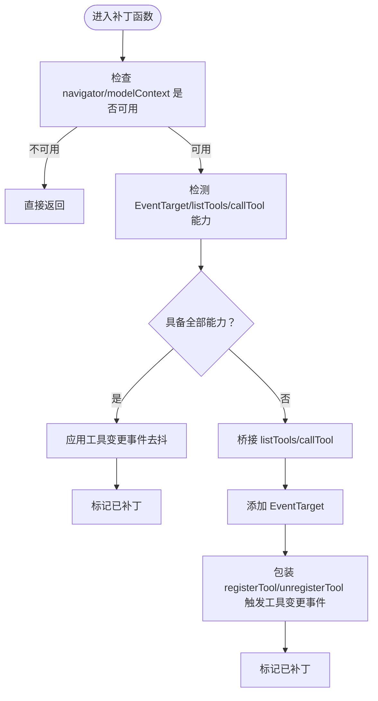
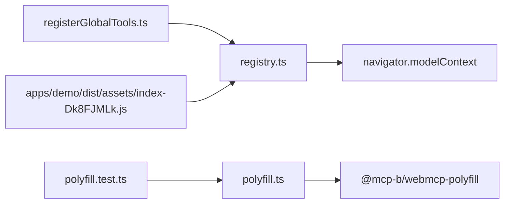

# 浏览器兼容性策略

<cite>
**本文引用的文件**
- [packages/webmcp-sdk/src/polyfill.ts](file://packages/webmcp-sdk/src/polyfill.ts)
- [packages/webmcp-sdk/src/registry.ts](file://packages/webmcp-sdk/src/registry.ts)
- [packages/webmcp-sdk/src/registerGlobalTools.ts](file://packages/webmcp-sdk/src/registerGlobalTools.ts)
- [packages/webmcp-sdk/src/__tests__/polyfill.test.ts](file://packages/webmcp-sdk/src/__tests__/polyfill.test.ts)
- [packages/webmcp-sdk/package.json](file://packages/webmcp-sdk/package.json)
- [apps/demo/dist/assets/index-Dk8FJMLk.js](file://apps/demo/dist/assets/index-Dk8FJMLk.js)
</cite>

## 目录
1. [简介](#简介)
2. [项目结构](#项目结构)
3. [核心组件](#核心组件)
4. [架构总览](#架构总览)
5. [详细组件分析](#详细组件分析)
6. [依赖关系分析](#依赖关系分析)
7. [性能考量](#性能考量)
8. [故障排除指南](#故障排除指南)
9. [结论](#结论)
10. [附录](#附录)

## 简介
本文件系统化阐述 WebMCP Nexus 在浏览器兼容性方面的策略与实现机制，重点覆盖以下方面：
- 不同浏览器环境下的工具注册行为：Chrome 146+ 使用原生 navigator.modelContext API；其他环境自动加载内置 polyfill。
- polyfill 的自动检测与惰性加载机制：包含兼容性判断逻辑与降级策略。
- 支持的浏览器范围与版本要求：涵盖 Chrome、Firefox、Safari、Edge 等主流浏览器。
- polyfill 的工作原理与原生 API 的差异：包括性能考虑与功能限制。
- 最佳实践与故障排除指南，帮助开发者在不同环境中正确部署与使用。

## 项目结构
围绕浏览器兼容性与工具注册的关键文件位于 webmcp-sdk 包中，核心文件如下：
- polyfill.ts：负责在缺失 navigator.modelContext 时惰性安装 polyfill，并保证幂等与非破坏性。
- registry.ts：对 navigator.modelContext 进行事件支持补丁，桥接 listTools/callTool，增强工具变更事件分发。
- registerGlobalTools.ts：提供全局工具注册入口，供应用侧在具备 modelContext 后进行工具注册。
- __tests__/polyfill.test.ts：覆盖 polyfill 安装、原生存在、多次调用幂等、SSR 场景等测试场景。
- package.json：声明对 @mcp-b/webmcp-polyfill 的依赖，体现兼容性策略的外部 polyfill 依赖。
- apps/demo/dist/assets/index-Dk8FJMLk.js：打包产物中的 polyfill 与补丁逻辑，用于验证运行时行为。

图表来源
- [packages/webmcp-sdk/src/polyfill.ts:1-39](file://packages/webmcp-sdk/src/polyfill.ts#L1-L39)
- [packages/webmcp-sdk/src/registry.ts:32-120](file://packages/webmcp-sdk/src/registry.ts#L32-L120)
- [packages/webmcp-sdk/src/registerGlobalTools.ts](file://packages/webmcp-sdk/src/registerGlobalTools.ts)
- [packages/webmcp-sdk/src/__tests__/polyfill.test.ts:1-156](file://packages/webmcp-sdk/src/__tests__/polyfill.test.ts#L1-L156)
- [apps/demo/dist/assets/index-Dk8FJMLk.js:10801-11315](file://apps/demo/dist/assets/index-Dk8FJMLk.js#L10801-L11315)

章节来源
- [packages/webmcp-sdk/src/polyfill.ts:1-39](file://packages/webmcp-sdk/src/polyfill.ts#L1-L39)
- [packages/webmcp-sdk/src/registry.ts:32-120](file://packages/webmcp-sdk/src/registry.ts#L32-L120)
- [packages/webmcp-sdk/src/registerGlobalTools.ts](file://packages/webmcp-sdk/src/registerGlobalTools.ts)
- [packages/webmcp-sdk/src/__tests__/polyfill.test.ts:1-156](file://packages/webmcp-sdk/src/__tests__/polyfill.test.ts#L1-L156)
- [packages/webmcp-sdk/package.json](file://packages/webmcp-sdk/package.json)

## 核心组件
- 惰性安装与幂等控制（ensureModelContextPolyfill）
  - 仅在 navigator.modelContext 不存在且尚未尝试过时执行安装。
  - 对 SSR 环境（navigator 未定义）静默跳过。
  - 安装成功与否不影响后续流程，失败会被 try/catch 包裹，避免影响调用方。
- 事件支持补丁与桥接（patchModelContextEventSupport）
  - 识别 navigator.modelContext 是否具备 EventTarget/listTools/callTool 能力。
  - 在能力不足时，通过 modelContextTesting 提供的接口桥接 listTools/callTool，并为工具变更事件提供统一分发。
- 全局工具注册（registerGlobalTools）
  - 在具备 modelContext 后，将工具注册到内部注册表，并触发工具变更事件以供 embed.js 等消费端发现。

章节来源
- [packages/webmcp-sdk/src/polyfill.ts:6-26](file://packages/webmcp-sdk/src/polyfill.ts#L6-L26)
- [packages/webmcp-sdk/src/registry.ts:32-120](file://packages/webmcp-sdk/src/registry.ts#L32-L120)
- [packages/webmcp-sdk/src/registerGlobalTools.ts](file://packages/webmcp-sdk/src/registerGlobalTools.ts)

## 架构总览
下图展示了浏览器兼容性策略在运行时的整体交互：SDK 在检测到缺少 navigator.modelContext 时惰性安装 polyfill，并在需要时对 modelContext 进行事件支持补丁与桥接，最终由注册工具完成工具的注册与事件分发。

图表来源
- [packages/webmcp-sdk/src/polyfill.ts:16-26](file://packages/webmcp-sdk/src/polyfill.ts#L16-L26)
- [packages/webmcp-sdk/src/registry.ts:46-120](file://packages/webmcp-sdk/src/registry.ts#L46-L120)
- [packages/webmcp-sdk/src/registerGlobalTools.ts](file://packages/webmcp-sdk/src/registerGlobalTools.ts)
- [apps/demo/dist/assets/index-Dk8FJMLk.js:11276-11315](file://apps/demo/dist/assets/index-Dk8FJMLk.js#L11276-L11315)

## 详细组件分析

### 组件一：polyfill.ts（惰性安装与幂等控制）
- 自动检测与安装
  - 若 navigator 未定义（SSR），直接返回。
  - 若 navigator.modelContext 已存在，不重复安装（非破坏性）。
  - 若缺失，则调用 initializeWebMCPPolyfill 并启用 modelContextTesting shim。
- 幂等与容错
  - 使用模块级 attempted 标志确保只尝试一次。
  - try/catch 包裹初始化过程，失败不抛出异常，SDK 后续按“无 modelContext”路径继续。
- 与外部 polyfill 的关系
  - 依赖 @mcp-b/webmcp-polyfill 提供的初始化与清理能力。

图表来源
- [packages/webmcp-sdk/src/polyfill.ts:16-26](file://packages/webmcp-sdk/src/polyfill.ts#L16-L26)

章节来源
- [packages/webmcp-sdk/src/polyfill.ts:1-39](file://packages/webmcp-sdk/src/polyfill.ts#L1-L39)
- [packages/webmcp-sdk/src/__tests__/polyfill.test.ts:33-106](file://packages/webmcp-sdk/src/__tests__/polyfill.test.ts#L33-L106)

### 组件二：registry.ts（事件支持补丁与桥接）
- 能力检测
  - 检测 navigator.modelContext 是否具备 addEventListener、listTools、callTool。
- 三种场景处理
  - 完整能力：仅应用工具变更事件去抖。
  - 能力不足：桥接 listTools/callTool，添加 EventTarget，包装 registerTool/unregisterTool 以触发工具变更事件。
  - 旧版 polyfill：在具备 listTools/callTool 但缺乏 EventTarget 时，补充 EventTarget 并包装工具注册/注销。
- 与打包产物的一致性
  - 打包产物中存在相同的补丁逻辑与桥接实现，验证运行时一致性。

图表来源
- [packages/webmcp-sdk/src/registry.ts:46-120](file://packages/webmcp-sdk/src/registry.ts#L46-L120)
- [apps/demo/dist/assets/index-Dk8FJMLk.js:11336-11367](file://apps/demo/dist/assets/index-Dk8FJMLk.js#L11336-L11367)

章节来源
- [packages/webmcp-sdk/src/registry.ts:32-120](file://packages/webmcp-sdk/src/registry.ts#L32-L120)
- [packages/webmcp-sdk/src/__tests__/polyfill.test.ts:107-150](file://packages/webmcp-sdk/src/__tests__/polyfill.test.ts#L107-L150)
- [apps/demo/dist/assets/index-Dk8FJMLk.js:11336-11367](file://apps/demo/dist/assets/index-Dk8FJMLk.js#L11336-L11367)

### 组件三：registerGlobalTools.ts（全局工具注册）
- 作用
  - 在具备 modelContext 的前提下，将工具注册到内部注册表，并触发工具变更事件，供 embed.js 等消费端发现。
- 与 polyfill 的关系
  - 在 polyfill 安装后，可通过 modelContextTesting.listTools 等接口验证工具注册结果。

章节来源
- [packages/webmcp-sdk/src/registerGlobalTools.ts](file://packages/webmcp-sdk/src/registerGlobalTools.ts)
- [packages/webmcp-sdk/src/__tests__/polyfill.test.ts:52-68](file://packages/webmcp-sdk/src/__tests__/polyfill.test.ts#L52-L68)

## 依赖关系分析
- 对外部 polyfill 的依赖
  - 通过 @mcp-b/webmcp-polyfill 提供的 initializeWebMCPPolyfill/cleanupWebMCPPolyfill 实现模型上下文 API 的安装与清理。
- 内部模块耦合
  - polyfill.ts 与 registry.ts 之间通过 navigator.modelContext 的存在与否形成条件依赖。
  - registerGlobalTools.ts 依赖内部注册表与事件桥接，间接依赖 registry.ts 的补丁结果。

图表来源
- [packages/webmcp-sdk/src/polyfill.ts:1-39](file://packages/webmcp-sdk/src/polyfill.ts#L1-L39)
- [packages/webmcp-sdk/src/registry.ts:32-120](file://packages/webmcp-sdk/src/registry.ts#L32-L120)
- [packages/webmcp-sdk/src/registerGlobalTools.ts](file://packages/webmcp-sdk/src/registerGlobalTools.ts)
- [packages/webmcp-sdk/src/__tests__/polyfill.test.ts:1-156](file://packages/webmcp-sdk/src/__tests__/polyfill.test.ts#L1-L156)
- [apps/demo/dist/assets/index-Dk8FJMLk.js:10801-11315](file://apps/demo/dist/assets/index-Dk8FJMLk.js#L10801-L11315)

章节来源
- [packages/webmcp-sdk/package.json](file://packages/webmcp-sdk/package.json)
- [packages/webmcp-sdk/src/polyfill.ts:1-39](file://packages/webmcp-sdk/src/polyfill.ts#L1-L39)
- [packages/webmcp-sdk/src/registry.ts:32-120](file://packages/webmcp-sdk/src/registry.ts#L32-L120)
- [packages/webmcp-sdk/src/registerGlobalTools.ts](file://packages/webmcp-sdk/src/registerGlobalTools.ts)
- [packages/webmcp-sdk/src/__tests__/polyfill.test.ts:1-156](file://packages/webmcp-sdk/src/__tests__/polyfill.test.ts#L1-L156)
- [apps/demo/dist/assets/index-Dk8FJMLk.js:10801-11315](file://apps/demo/dist/assets/index-Dk8FJMLk.js#L10801-L11315)

## 性能考量
- 惰性加载与幂等
  - 仅在首次检测到缺失时安装 polyfill，避免不必要的初始化开销。
  - attempted 标志确保多次调用不重复安装，降低重复初始化风险。
- 事件去抖与桥接
  - 在具备完整能力时仅应用工具变更事件去抖，减少事件风暴。
  - 在能力不足时通过 modelContextTesting 桥接 listTools/callTool，避免额外网络请求或复杂逻辑。
- SSR 友好
  - 在 SSR 环境中静默跳过，避免服务端渲染阻塞或错误。

章节来源
- [packages/webmcp-sdk/src/polyfill.ts:16-26](file://packages/webmcp-sdk/src/polyfill.ts#L16-L26)
- [packages/webmcp-sdk/src/registry.ts:64-69](file://packages/webmcp-sdk/src/registry.ts#L64-L69)

## 故障排除指南
- 症状：navigator.modelContext 不存在
  - 检查是否已在应用入口调用 ensureModelContextPolyfill。
  - 确认浏览器环境非 SSR；若为 SSR，请在客户端挂载后再调用。
- 症状：工具无法被发现
  - 确认已调用 registerGlobalTools 注册工具。
  - 在 polyfill 安装后，可通过 modelContextTesting.listTools 验证工具列表。
- 症状：工具变更事件未触发
  - 确认 registry.ts 的补丁逻辑已生效（检测 EventTarget/listTools/callTool 能力）。
  - 如为旧版 polyfill，确认已添加 EventTarget 并包装了 registerTool/unregisterTool。
- 症状：多次调用导致重复安装
  - 确保仅在首次加载时调用 ensureModelContextPolyfill；attempted 标志应阻止重复安装。
- 症状：打包产物中 polyfill 行为异常
  - 对照 apps/demo/dist/assets/index-Dk8FJMLk.js 中的补丁与安装逻辑，核对是否符合预期。

章节来源
- [packages/webmcp-sdk/src/__tests__/polyfill.test.ts:33-106](file://packages/webmcp-sdk/src/__tests__/polyfill.test.ts#L33-L106)
- [packages/webmcp-sdk/src/__tests__/polyfill.test.ts:107-150](file://packages/webmcp-sdk/src/__tests__/polyfill.test.ts#L107-L150)
- [apps/demo/dist/assets/index-Dk8FJMLk.js:11276-11315](file://apps/demo/dist/assets/index-Dk8FJMLk.js#L11276-L11315)

## 结论
WebMCP Nexus 的浏览器兼容性策略以“惰性安装 + 幂等控制 + 非破坏性”为核心原则：在 Chrome 146+ 等原生支持环境中直接复用 navigator.modelContext，在其他环境中自动安装 @mcp-b/webmcp-polyfill 并通过 registry.ts 的补丁与桥接能力补齐事件与工具管理功能。该策略兼顾了性能、稳定性与可维护性，适用于多浏览器与多运行时环境。

## 附录
- 支持的浏览器范围与版本要求
  - Chrome 146+：原生 navigator.modelContext，无需 polyfill。
  - Firefox/Safari/Edge：在缺失 navigator.modelContext 时自动安装 polyfill。
  - SSR：静默跳过，避免渲染错误。
- 最佳实践
  - 在应用入口尽早调用 ensureModelContextPolyfill，确保在任何后续逻辑前完成检测与安装。
  - 在具备 modelContext 后再调用 registerGlobalTools 注册工具。
  - 在开发与测试中使用 modelContextTesting.listTools 验证工具注册状态。
  - 避免在 SSR 环境中直接调用 polyfill 安装逻辑。