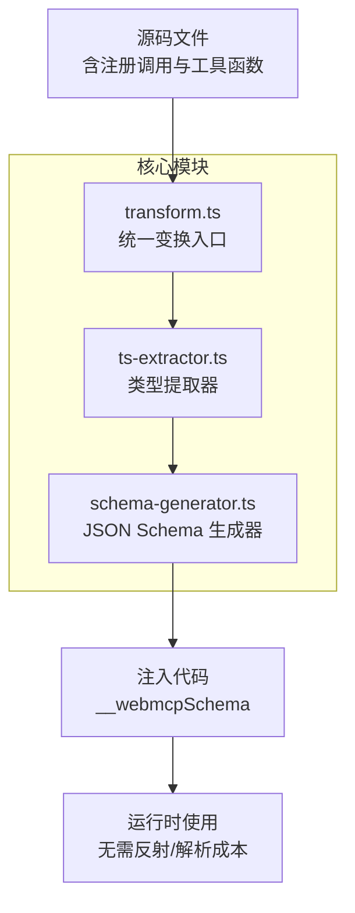
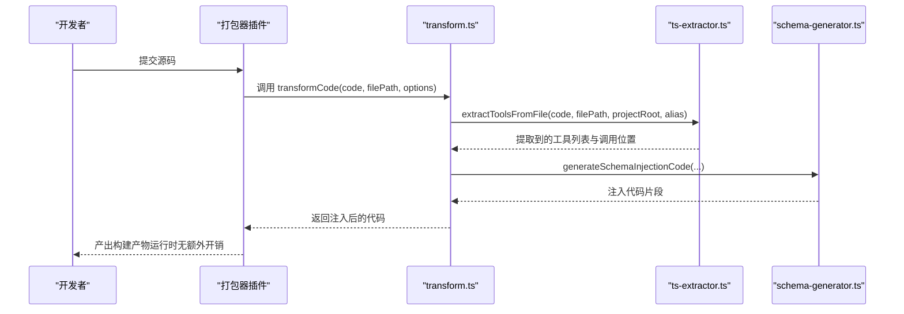
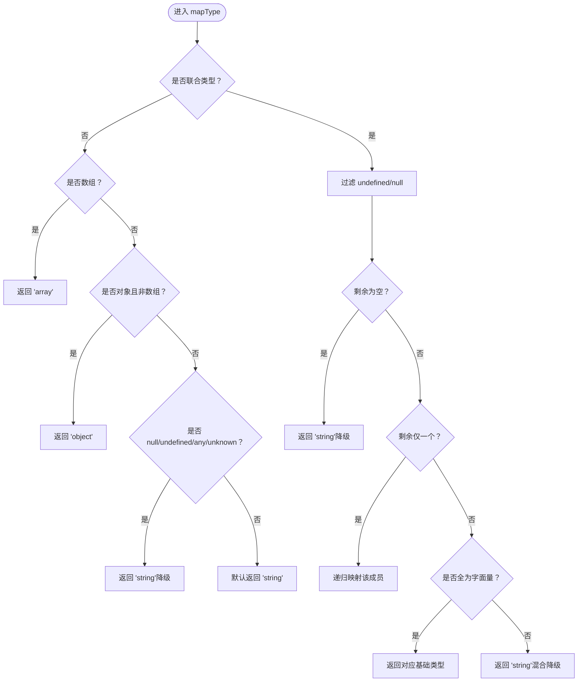
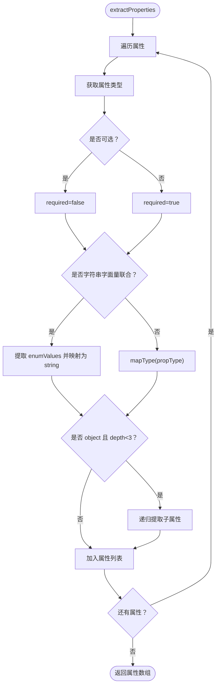
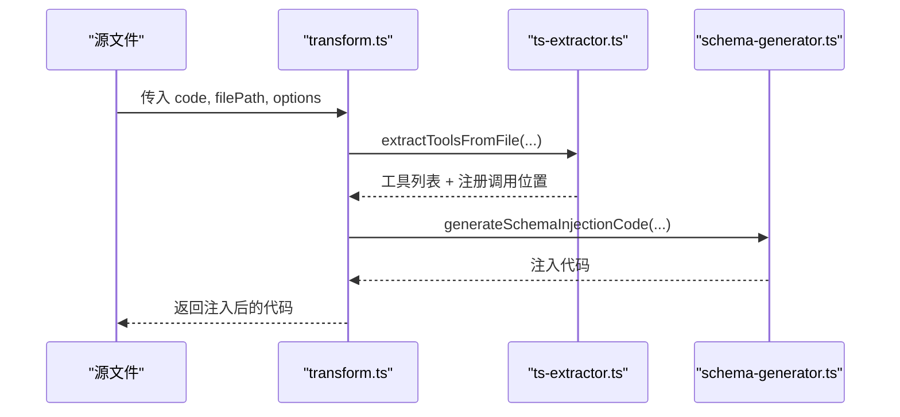
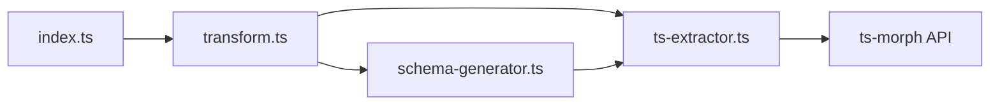

# 类型系统与构建时分析

<cite>
**本文档引用的文件**
- [packages/webmcp-core/src/index.ts](file://packages/webmcp-core/src/index.ts)
- [packages/webmcp-core/src/ts-extractor.ts](file://packages/webmcp-core/src/ts-extractor.ts)
- [packages/webmcp-core/src/schema-generator.ts](file://packages/webmcp-core/src/schema-generator.ts)
- [packages/webmcp-core/src/transform.ts](file://packages/webmcp-core/src/transform.ts)
- [packages/webmcp-core/src/__tests__/mapType.test.ts](file://packages/webmcp-core/src/__tests__/mapType.test.ts)
- [packages/webmcp-core/src/__tests__/extractProperties.test.ts](file://packages/webmcp-core/src/__tests__/extractProperties.test.ts)
- [packages/webmcp-core/src/__tests__/schema-generator.test.ts](file://packages/webmcp-core/src/__tests__/schema-generator.test.ts)
- [apps/demo/src/store/types.ts](file://apps/demo/src/store/types.ts)
- [apps/demo/src/tools/navigation.ts](file://apps/demo/src/tools/navigation.ts)
- [packages/webmcp-core/README.md](file://packages/webmcp-core/README.md)
</cite>

## 目录
1. [简介](#简介)
2. [项目结构](#项目结构)
3. [核心组件](#核心组件)
4. [架构总览](#架构总览)
5. [详细组件分析](#详细组件分析)
6. [依赖关系分析](#依赖关系分析)
7. [性能考量](#性能考量)
8. [故障排查指南](#故障排查指南)
9. [结论](#结论)
10. [附录](#附录)

## 简介
本文件系统性阐述 WebMCP Nexus 的类型系统设计与构建时分析机制，重点覆盖以下方面：
- 基于 ts-morph 的静态类型分析能力：基础类型、字面量联合、可选属性、嵌套对象、数组等的支持范围与映射策略
- JSDoc 注释在类型推导与 Schema 增强中的作用与实现细节
- 构建时类型反推的完整流程：从源码解析到 JSON Schema 注入的每一步
- 类型支持的边界与限制：当前不支持的高级 TypeScript 特性及其原因
- 最佳实践与常见问题解决方案

## 项目结构
WebMCP Nexus 的核心位于 webmcp-core 包，围绕“构建时类型反推”这一主线，提供从 TypeScript 源码中抽取工具元数据并在编译期注入 JSON Schema 的能力。关键文件职责如下：
- ts-extractor.ts：基于 ts-morph 的类型提取器，负责解析函数签名、属性、JSDoc、联合类型枚举值、嵌套对象等，并支持对象字面量与命名空间导入两种工具注册方式
- schema-generator.ts：将提取到的属性信息映射为 JSON Schema，并生成注入代码
- transform.ts：统一的 transform 入口，串联提取与注入逻辑
- index.ts：对外暴露的 API，便于在 Vite/Webpack 等插件中集成
- 测试用例：验证 mapType、extractProperties、schema-generator 的行为与边界
- 示例工程：apps/demo 展示了类型定义与工具函数的实际使用

图表来源
- [packages/webmcp-core/src/transform.ts:31-78](file://packages/webmcp-core/src/transform.ts#L31-L78)
- [packages/webmcp-core/src/ts-extractor.ts:641-730](file://packages/webmcp-core/src/ts-extractor.ts#L641-L730)
- [packages/webmcp-core/src/schema-generator.ts:28-134](file://packages/webmcp-core/src/schema-generator.ts#L28-L134)

章节来源
- [packages/webmcp-core/src/index.ts:1-10](file://packages/webmcp-core/src/index.ts#L1-L10)
- [packages/webmcp-core/README.md:39-68](file://packages/webmcp-core/README.md#L39-L68)

## 核心组件
- 类型映射与提取
  - mapType：将 ts-morph Type 映射为 JSON Schema type 字符串，支持基础类型、字面量联合、可选联合（T | undefined → T）、数组、对象、null/undefined/any/unknown 的降级策略
  - extractProperties：递归提取对象属性，支持可选属性、枚举属性（字面量联合）、数组元素类型、嵌套对象（最大递归深度 3）
  - extractEnumValues：从联合类型中提取字面量枚举值
  - getPropertyDescription：从属性符号的声明中提取 JSDoc 描述，回退到行内注释
- 函数元数据提取
  - extractFunctionMetadata：从函数节点提取 JSDoc 描述、@readonly 标签、参数属性列表
  - extractToolFromBindingElement：针对解构形式（const { fn } = obj）通过类型系统反向提取工具元数据
- 源文件解析与工具定位
  - extractToolsFromFile：扫描源文件中的注册调用，支持对象字面量与命名空间导入两种参数形式，解析模块路径别名
- JSON Schema 生成与注入
  - generateSchema：生成顶层对象 Schema，收集 required 字段
  - mapTypeToSchema：将单个属性映射为 JSON Schema 片段
  - generateSchemaInjectionCode：生成注入 __webmcpSchema 的代码块

章节来源
- [packages/webmcp-core/src/ts-extractor.ts:99-124](file://packages/webmcp-core/src/ts-extractor.ts#L99-L124)
- [packages/webmcp-core/src/ts-extractor.ts:174-201](file://packages/webmcp-core/src/ts-extractor.ts#L174-L201)
- [packages/webmcp-core/src/ts-extractor.ts:137-145](file://packages/webmcp-core/src/ts-extractor.ts#L137-L145)
- [packages/webmcp-core/src/ts-extractor.ts:148-171](file://packages/webmcp-core/src/ts-extractor.ts#L148-L171)
- [packages/webmcp-core/src/ts-extractor.ts:206-282](file://packages/webmcp-core/src/ts-extractor.ts#L206-L282)
- [packages/webmcp-core/src/ts-extractor.ts:293-379](file://packages/webmcp-core/src/ts-extractor.ts#L293-L379)
- [packages/webmcp-core/src/ts-extractor.ts:641-730](file://packages/webmcp-core/src/ts-extractor.ts#L641-L730)
- [packages/webmcp-core/src/schema-generator.ts:28-134](file://packages/webmcp-core/src/schema-generator.ts#L28-L134)
- [packages/webmcp-core/src/transform.ts:31-78](file://packages/webmcp-core/src/transform.ts#L31-L78)

## 架构总览
WebMCP Nexus 的构建时分析遵循“静态解析 → 类型反推 → Schema 注入”的流水线，确保运行时零反射成本。

图表来源
- [packages/webmcp-core/src/transform.ts:31-78](file://packages/webmcp-core/src/transform.ts#L31-L78)
- [packages/webmcp-core/src/ts-extractor.ts:641-730](file://packages/webmcp-core/src/ts-extractor.ts#L641-L730)
- [packages/webmcp-core/src/schema-generator.ts:69-86](file://packages/webmcp-core/src/schema-generator.ts#L69-L86)

## 详细组件分析

### 类型映射与联合枚举提取
- 基础类型映射
  - string/number/boolean 保持原语映射；字面量类型（"hello"、42、true）降级为对应的基础类型
  - 数组类型统一映射为 array，并通过 getArrayItemType 提取元素类型
  - 对象类型（排除数组）映射为 object
- 联合类型处理
  - 先过滤掉 undefined 与 null，再根据剩余成员类型决定映射：全为字符串字面量 → string；全为数字字面量 → number；全为布尔字面量 → boolean；否则降级为 string
  - extractEnumValues 专门提取字符串字面量联合的枚举值集合
- 特殊类型降级
  - null/undefined/any/unknown 统一降级为 string，避免 Schema 不一致

图表来源
- [packages/webmcp-core/src/ts-extractor.ts:99-124](file://packages/webmcp-core/src/ts-extractor.ts#L99-L124)
- [packages/webmcp-core/src/ts-extractor.ts:137-145](file://packages/webmcp-core/src/ts-extractor.ts#L137-L145)
- [packages/webmcp-core/src/ts-extractor.ts:127-134](file://packages/webmcp-core/src/ts-extractor.ts#L127-L134)

章节来源
- [packages/webmcp-core/src/__tests__/mapType.test.ts:15-95](file://packages/webmcp-core/src/__tests__/mapType.test.ts#L15-L95)
- [packages/webmcp-core/src/ts-extractor.ts:99-124](file://packages/webmcp-core/src/ts-extractor.ts#L99-L124)
- [packages/webmcp-core/src/ts-extractor.ts:137-145](file://packages/webmcp-core/src/ts-extractor.ts#L137-L145)

### 属性提取与嵌套对象递归
- 可选属性：通过 prop.isOptional() 判断 required 字段
- 枚举属性：当属性类型为字符串字面量联合时，提取 enumValues 并将属性类型降级为 string
- 数组属性：记录 itemType，items 为 { type: itemType }
- 嵌套对象：当 mappedType 为 object 且 depth < 3 时递归提取子属性，形成多层 Schema
- JSDoc 描述：从属性符号声明中提取描述，支持行内注释回退

图表来源
- [packages/webmcp-core/src/ts-extractor.ts:174-201](file://packages/webmcp-core/src/ts-extractor.ts#L174-L201)
- [packages/webmcp-core/src/ts-extractor.ts:148-171](file://packages/webmcp-core/src/ts-extractor.ts#L148-L171)

章节来源
- [packages/webmcp-core/src/__tests__/extractProperties.test.ts:15-84](file://packages/webmcp-core/src/__tests__/extractProperties.test.ts#L15-L84)
- [packages/webmcp-core/src/ts-extractor.ts:174-201](file://packages/webmcp-core/src/ts-extractor.ts#L174-L201)

### JSDoc 注释在类型推导中的作用
- 函数元数据：从函数声明或变量声明处提取 JSDoc 描述与 @readonly 标签
- 属性描述：从属性符号声明中提取 JSDoc 描述，若无则回退到行内注释
- 注入增强：最终生成的 __webmcpSchema 包含 description 与 readOnly 字段，提升 Schema 的可读性与约束性

章节来源
- [packages/webmcp-core/src/ts-extractor.ts:214-282](file://packages/webmcp-core/src/ts-extractor.ts#L214-L282)
- [packages/webmcp-core/src/ts-extractor.ts:148-171](file://packages/webmcp-core/src/ts-extractor.ts#L148-L171)
- [packages/webmcp-core/src/schema-generator.ts:69-86](file://packages/webmcp-core/src/schema-generator.ts#L69-L86)

### 构建时类型反推流程（从源码到 JSON Schema）
- transformCode：快速检测注册调用，调用 extractToolsFromFile，生成注入代码并插入到首个注册调用之前
- extractToolsFromFile：构建 ts-morph Project，扫描调用表达式，解析对象字面量与命名空间导入参数，解析模块别名，定位工具定义并提取元数据
- generateSchemaInjectionCode：生成包含 description、inputSchema、readOnly 的注入代码

图表来源
- [packages/webmcp-core/src/transform.ts:31-78](file://packages/webmcp-core/src/transform.ts#L31-L78)
- [packages/webmcp-core/src/ts-extractor.ts:641-730](file://packages/webmcp-core/src/ts-extractor.ts#L641-L730)
- [packages/webmcp-core/src/schema-generator.ts:69-86](file://packages/webmcp-core/src/schema-generator.ts#L69-L86)

章节来源
- [packages/webmcp-core/src/transform.ts:31-78](file://packages/webmcp-core/src/transform.ts#L31-L78)
- [packages/webmcp-core/src/ts-extractor.ts:641-730](file://packages/webmcp-core/src/ts-extractor.ts#L641-L730)
- [packages/webmcp-core/src/schema-generator.ts:69-86](file://packages/webmcp-core/src/schema-generator.ts#L69-L86)

### 类型支持边界与限制
- 当前支持
  - 基础类型：string/number/boolean
  - 字面量联合：字符串/数字/布尔字面量联合降级为对应基础类型，并提取枚举值
  - 可选属性：通过可选性推断 required 字段
  - 嵌套对象：递归提取，最大深度 3
  - 数组：统一映射为 array，并提取元素类型
  - JSDoc：函数描述与 @readonly 标签，属性描述
- 限制与原因
  - 高级泛型与条件类型：未在 mapType 中显式分支，可能降级为 string
  - 复杂联合混杂：如同时包含字符串与数值字面量的联合将降级为 string
  - any/unknown：统一降级为 string，避免 Schema 泛化导致的验证宽松
  - 命名空间导入的模块解析：需 alias 或相对路径，bare specifier 无法解析
  - 解构工具（const { fn } = obj）：通过类型系统反向提取，要求属性符号可解析

章节来源
- [packages/webmcp-core/src/ts-extractor.ts:99-124](file://packages/webmcp-core/src/ts-extractor.ts#L99-L124)
- [packages/webmcp-core/src/ts-extractor.ts:504-632](file://packages/webmcp-core/src/ts-extractor.ts#L504-L632)
- [packages/webmcp-core/src/ts-extractor.ts:293-379](file://packages/webmcp-core/src/ts-extractor.ts#L293-L379)

### 最佳实践与常见问题
- 为工具函数与参数属性添加清晰的 JSDoc 描述与 @readonly 标签，以提升 Schema 的可读性与约束性
- 使用字面量联合表达枚举值，以便自动生成 enum 字段
- 控制嵌套对象层级，避免超过 3 层导致的 Schema 过深
- 在打包器中配置 alias，确保命名空间导入的模块路径可解析
- 对解构工具（const { fn } = obj）保持属性符号可解析，必要时提供显式类型标注

章节来源
- [packages/webmcp-core/src/schema-generator.ts:69-86](file://packages/webmcp-core/src/schema-generator.ts#L69-L86)
- [packages/webmcp-core/src/ts-extractor.ts:504-632](file://packages/webmcp-core/src/ts-extractor.ts#L504-L632)
- [packages/webmcp-core/src/ts-extractor.ts:293-379](file://packages/webmcp-core/src/ts-extractor.ts#L293-L379)

## 依赖关系分析
- transform.ts 依赖 ts-extractor.ts 与 schema-generator.ts，作为统一入口协调两者
- ts-extractor.ts 依赖 ts-morph 的 Project/Type/Symbol 等 API，完成类型与注释解析
- schema-generator.ts 依赖 extractProperties 的输出，生成 JSON Schema 与注入代码
- index.ts 汇聚导出，便于外部插件集成

图表来源
- [packages/webmcp-core/src/index.ts:1-10](file://packages/webmcp-core/src/index.ts#L1-L10)
- [packages/webmcp-core/src/transform.ts:1-16](file://packages/webmcp-core/src/transform.ts#L1-L16)
- [packages/webmcp-core/src/ts-extractor.ts:12-25](file://packages/webmcp-core/src/ts-extractor.ts#L12-L25)
- [packages/webmcp-core/src/schema-generator.ts:1-13](file://packages/webmcp-core/src/schema-generator.ts#L1-L13)

章节来源
- [packages/webmcp-core/src/index.ts:1-10](file://packages/webmcp-core/src/index.ts#L1-L10)
- [packages/webmcp-core/src/transform.ts:1-16](file://packages/webmcp-core/src/transform.ts#L1-L16)

## 性能考量
- 零运行时开销：所有 Schema 在构建期生成并注入，运行时无需反射或解析
- 项目构建优化：ts-morph Project 在内存中解析，避免磁盘 IO；仅在需要时添加源文件
- 递归深度控制：嵌套对象最大递归深度为 3，平衡 Schema 复杂度与解析成本
- 快速路径：transformCode 与 extractToolsFromFile 首先进行字符串快速检测，避免不必要的解析

章节来源
- [packages/webmcp-core/README.md:39-68](file://packages/webmcp-core/README.md#L39-L68)
- [packages/webmcp-core/src/transform.ts:31-78](file://packages/webmcp-core/src/transform.ts#L31-L78)
- [packages/webmcp-core/src/ts-extractor.ts:186-188](file://packages/webmcp-core/src/ts-extractor.ts#L186-L188)

## 故障排查指南
- 未生成 Schema
  - 确认源码中存在 registerGlobalTools/useWebMcpTools 调用
  - 检查打包器 alias 配置是否正确，确保命名空间导入模块可解析
  - 查看 DEBUG 环境变量输出，定位解析失败的文件与模块
- 命名空间导入失败
  - 检查模块路径是否为 alias 命中或相对路径
  - 确认目标文件存在且扩展名匹配（.ts/.tsx/index.ts/index.tsx）
- 解构工具无元数据
  - 确保属性符号可解析，必要时提供显式类型标注
  - 检查属性名是否与源属性一致（重命名场景）
- 嵌套对象过深
  - 控制嵌套层级不超过 3 层，避免 Schema 过深影响可读性与验证性能

章节来源
- [packages/webmcp-core/src/transform.ts:31-78](file://packages/webmcp-core/src/transform.ts#L31-L78)
- [packages/webmcp-core/src/ts-extractor.ts:504-632](file://packages/webmcp-core/src/ts-extractor.ts#L504-L632)
- [packages/webmcp-core/src/ts-extractor.ts:293-379](file://packages/webmcp-core/src/ts-extractor.ts#L293-L379)

## 结论
WebMCP Nexus 通过 ts-morph 实现了对常见 TypeScript 类型的静态分析，结合 JSDoc 注释生成高质量的 JSON Schema，并在构建期完成注入，实现了“单一事实源、零运行时开销”的目标。对于基础类型、字面量联合、可选属性、嵌套对象与数组具备良好支持；对高级泛型与复杂联合采取稳健的降级策略。遵循本文的最佳实践与排错建议，可在保证类型准确性的前提下获得稳定的构建体验。

## 附录
- 示例类型与工具
  - 类型定义：apps/demo/src/store/types.ts 展示了枚举类型与嵌套接口
  - 工具函数：apps/demo/src/tools/navigation.ts 展示了带 JSDoc 的工具函数

章节来源
- [apps/demo/src/store/types.ts:1-58](file://apps/demo/src/store/types.ts#L1-L58)
- [apps/demo/src/tools/navigation.ts:1-14](file://apps/demo/src/tools/navigation.ts#L1-L14)