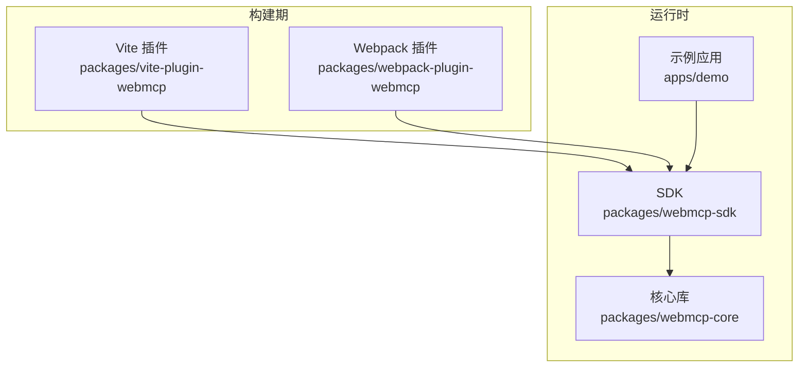
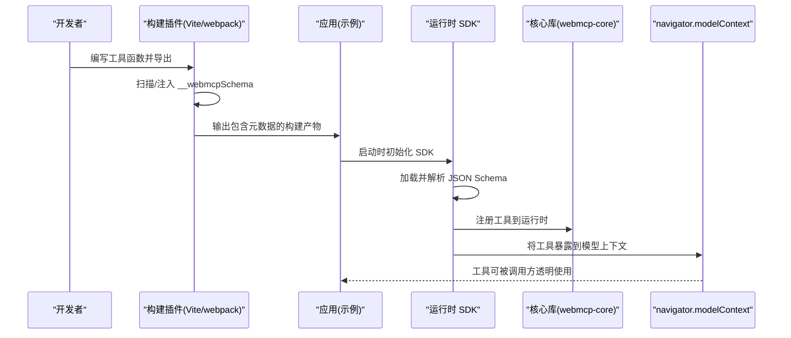
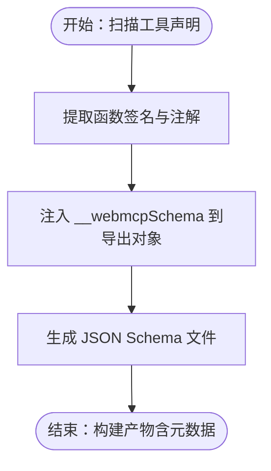
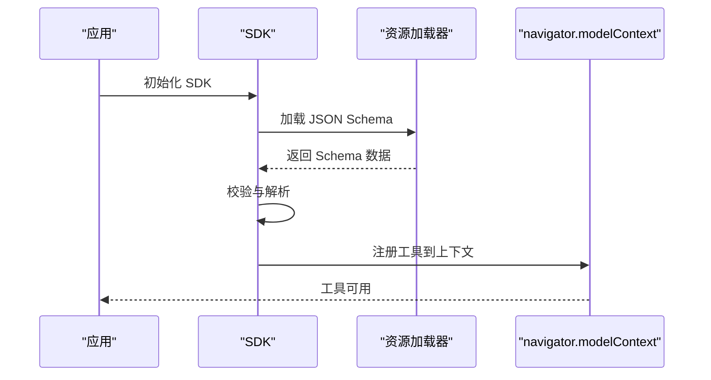
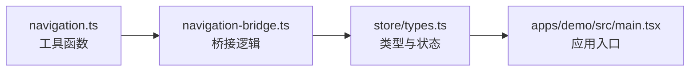
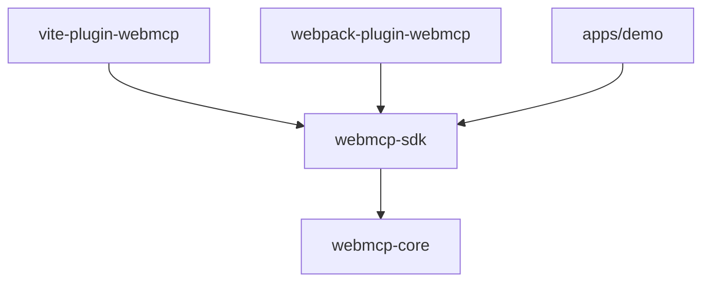

# 零侵入设计原则

<cite>
**本文引用的文件**
- [README.md](file://README.md)
- [package.json](file://package.json)
- [packages/vite-plugin-webmcp/README.md](file://packages/vite-plugin-webmcp/README.md)
- [packages/webmcp-core/README.md](file://packages/webmcp-core/README.md)
- [packages/webmcp-sdk/README.md](file://packages/webmcp-sdk/README.md)
- [packages/webpack-plugin-webmcp/README.md](file://packages/webpack-plugin-webmcp/README.md)
- [apps/demo/src/tools/navigation.ts](file://apps/demo/src/tools/navigation.ts)
- [apps/demo/src/tools/navigation-bridge.ts](file://apps/demo/src/tools/navigation-bridge.ts)
- [apps/demo/src/store/types.ts](file://apps/demo/src/store/types.ts)
- [apps/demo/src/main.tsx](file://apps/demo/src/main.tsx)
</cite>

## 目录
1. [引言](#引言)
2. [项目结构](#项目结构)
3. [核心组件](#核心组件)
4. [架构总览](#架构总览)
5. [详细组件分析](#详细组件分析)
6. [依赖关系分析](#依赖关系分析)
7. [性能考量](#性能考量)
8. [故障排查指南](#故障排查指南)
9. [结论](#结论)
10. [附录](#附录)

## 引言
本文件围绕 WebMCP Nexus 的“零侵入”设计原则进行系统化解读，重点阐释以下目标：
- 在不改变原有函数签名与调用方式的前提下，实现工具注册与能力扩展；
- 通过构建时插桩与运行时 SDK 协作，完成对工具的自动发现与注册；
- 解释零侵入设计带来的优势：业务逻辑无感知、迁移成本极低；
- 深入说明构建时代码注入机制（如 __webmcpSchema 字段）与 JSON Schema 的生成流程；
- 描述运行时 SDK 如何读取 Schema 并完成工具注册，以及与 navigator.modelContext 的交互；
- 提供最佳实践与迁移指南，帮助开发者快速理解并落地该设计理念。

## 项目结构
WebMCP Nexus 采用多包工作区组织，核心由以下模块构成：
- 构建插件：vite-plugin-webmcp 与 webpack-plugin-webmcp，负责在构建阶段注入工具元数据；
- 运行时 SDK：webmcp-sdk，负责在应用运行时读取元数据并完成工具注册；
- 核心库：webmcp-core，提供基础能力与类型定义；
- 示例应用：apps/demo，展示工具桥接与状态管理的典型用法。

**图表来源**
- [packages/vite-plugin-webmcp/README.md](file://packages/vite-plugin-webmcp/README.md)
- [packages/webpack-plugin-webmcp/README.md](file://packages/webpack-plugin-webmcp/README.md)
- [packages/webmcp-sdk/README.md](file://packages/webmcp-sdk/README.md)
- [packages/webmcp-core/README.md](file://packages/webmcp-core/README.md)
- [apps/demo/src/main.tsx](file://apps/demo/src/main.tsx)

**章节来源**
- [README.md](file://README.md)
- [package.json](file://package.json)

## 核心组件
- 构建时插件（Vite/webpack）
  - 负责扫描源码中的工具声明，生成或注入 __webmcpSchema 元信息，并输出 JSON Schema 文件；
  - 保证原有函数签名与调用方式保持不变，仅在编译产物中增加必要的元数据。
- 运行时 SDK
  - 在应用启动时加载并解析 JSON Schema；
  - 将工具注册到运行时上下文（如 navigator.modelContext），使调用方无需感知底层实现。
- 核心库（webmcp-core）
  - 定义工具接口、类型与运行时约定，确保跨平台一致性。
- 示例应用（apps/demo）
  - 展示如何编写工具、如何通过 SDK 注册工具，并与状态管理协同工作。

**章节来源**
- [packages/vite-plugin-webmcp/README.md](file://packages/vite-plugin-webmcp/README.md)
- [packages/webmcp-sdk/README.md](file://packages/webmcp-sdk/README.md)
- [packages/webmcp-core/README.md](file://packages/webmcp-core/README.md)
- [apps/demo/src/tools/navigation.ts](file://apps/demo/src/tools/navigation.ts)
- [apps/demo/src/tools/navigation-bridge.ts](file://apps/demo/src/tools/navigation-bridge.ts)

## 架构总览
下图展示了从构建到运行的完整链路：构建期插件注入元数据，运行期 SDK 读取并注册工具，最终与模型上下文集成。

**图表来源**
- [packages/vite-plugin-webmcp/README.md](file://packages/vite-plugin-webmcp/README.md)
- [packages/webmcp-sdk/README.md](file://packages/webmcp-sdk/README.md)
- [packages/webmcp-core/README.md](file://packages/webmcp-core/README.md)
- [apps/demo/src/main.tsx](file://apps/demo/src/main.tsx)

## 详细组件分析

### 构建时插桩与 __webmcpSchema 注入
- 目标：在不修改业务函数签名与调用方式的前提下，为工具函数附加元数据，形成可被运行时识别的 JSON Schema。
- 关键点：
  - 插件扫描源码中的工具声明，提取函数签名、参数、返回值等信息；
  - 为每个工具生成 __webmcpSchema 字段并注入到模块导出对象中；
  - 输出独立的 JSON Schema 文件，便于 SDK 在运行时加载与校验。
- 优势：
  - 对调用方透明，原有代码无需改动；
  - 通过 Schema 约束工具行为，提升可维护性与可测试性。

**图表来源**
- [packages/vite-plugin-webmcp/README.md](file://packages/vite-plugin-webmcp/README.md)
- [packages/webpack-plugin-webmcp/README.md](file://packages/webpack-plugin-webmcp/README.md)

**章节来源**
- [packages/vite-plugin-webmcp/README.md](file://packages/vite-plugin-webmcp/README.md)
- [packages/webpack-plugin-webmcp/README.md](file://packages/webpack-plugin-webmcp/README.md)

### 运行时 SDK 的 Schema 读取与工具注册
- 目标：在应用启动时自动发现并注册工具，使其可被调用方透明使用。
- 关键点：
  - SDK 初始化时加载 JSON Schema；
  - 校验并解析工具定义，建立工具映射；
  - 将工具注册到运行时环境（如 navigator.modelContext），供上层调用。
- 与 navigator.modelContext 的交互：
  - 通过统一的上下文接口暴露工具，调用方可按名称直接调用，无需感知 SDK 存在。

**图表来源**
- [packages/webmcp-sdk/README.md](file://packages/webmcp-sdk/README.md)
- [apps/demo/src/main.tsx](file://apps/demo/src/main.tsx)

**章节来源**
- [packages/webmcp-sdk/README.md](file://packages/webmcp-sdk/README.md)
- [apps/demo/src/main.tsx](file://apps/demo/src/main.tsx)

### 示例应用中的工具桥接与状态管理
- navigation.ts：定义工具函数，作为业务能力的抽象入口；
- navigation-bridge.ts：桥接工具与状态管理，将工具调用结果同步到 store；
- 类型定义：store/types.ts 中的类型约束确保工具输入输出的一致性。

**图表来源**
- [apps/demo/src/tools/navigation.ts](file://apps/demo/src/tools/navigation.ts)
- [apps/demo/src/tools/navigation-bridge.ts](file://apps/demo/src/tools/navigation-bridge.ts)
- [apps/demo/src/store/types.ts](file://apps/demo/src/store/types.ts)
- [apps/demo/src/main.tsx](file://apps/demo/src/main.tsx)

**章节来源**
- [apps/demo/src/tools/navigation.ts](file://apps/demo/src/tools/navigation.ts)
- [apps/demo/src/tools/navigation-bridge.ts](file://apps/demo/src/tools/navigation-bridge.ts)
- [apps/demo/src/store/types.ts](file://apps/demo/src/store/types.ts)
- [apps/demo/src/main.tsx](file://apps/demo/src/main.tsx)

## 依赖关系分析
- 构建插件与 SDK 的耦合度低：插件只负责注入元数据，SDK 负责消费与注册；
- SDK 依赖核心库（webmcp-core）以获得统一的工具接口与类型定义；
- 示例应用通过 SDK 与核心库协作，形成闭环。

**图表来源**
- [packages/vite-plugin-webmcp/README.md](file://packages/vite-plugin-webmcp/README.md)
- [packages/webpack-plugin-webmcp/README.md](file://packages/webpack-plugin-webmcp/README.md)
- [packages/webmcp-sdk/README.md](file://packages/webmcp-sdk/README.md)
- [packages/webmcp-core/README.md](file://packages/webmcp-core/README.md)
- [apps/demo/src/main.tsx](file://apps/demo/src/main.tsx)

**章节来源**
- [package.json](file://package.json)

## 性能考量
- 构建期插桩：仅在开发与发布阶段执行，不影响运行时性能；
- 运行时 SDK：懒加载与按需注册策略可进一步降低启动开销；
- Schema 校验：建议在开发阶段启用严格校验，在生产阶段根据需要开启缓存与最小化校验范围。

## 故障排查指南
- 构建失败或工具未注册
  - 检查插件是否正确扫描到工具声明；
  - 确认 __webmcpSchema 是否成功注入；
  - 校验 JSON Schema 输出路径与命名是否一致。
- 运行时无法调用工具
  - 确认 SDK 初始化顺序与时机；
  - 检查 navigator.modelContext 是否存在且包含目标工具；
  - 核对工具名称与调用方式是否匹配。
- 类型不匹配或编译错误
  - 对照 store/types.ts 的类型约束修正工具签名；
  - 确保工具函数的输入输出与 Schema 一致。

**章节来源**
- [packages/vite-plugin-webmcp/README.md](file://packages/vite-plugin-webmcp/README.md)
- [packages/webmcp-sdk/README.md](file://packages/webmcp-sdk/README.md)
- [apps/demo/src/store/types.ts](file://apps/demo/src/store/types.ts)

## 结论
WebMCP Nexus 的零侵入设计通过“构建时插桩 + 运行时 SDK”的组合，实现了对既有业务逻辑的完全无感增强。其核心价值在于：
- 保持原有函数签名与调用方式不变；
- 通过 Schema 自动化生成与注册，显著降低迁移与维护成本；
- 与 navigator.modelContext 的集成使得工具调用对上层透明；
- 多包协作的架构清晰分离了构建期与运行期职责，具备良好的扩展性与可维护性。

## 附录
- 最佳实践
  - 工具函数应保持纯函数特性，避免副作用；
  - 使用统一的类型定义与 Schema 约束，确保跨模块一致性；
  - 在开发阶段启用严格校验，生产阶段优化加载与缓存策略。
- 迁移指南
  - 从现有工具函数出发，逐步引入 __webmcpSchema 注入；
  - 通过 SDK 初始化流程替换手动注册，确保与 navigator.modelContext 对齐；
  - 在示例应用中复用 navigation-bridge 的模式，将工具调用结果同步到状态管理。