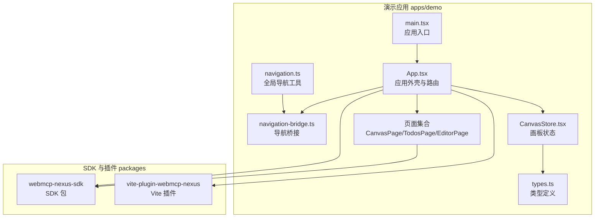
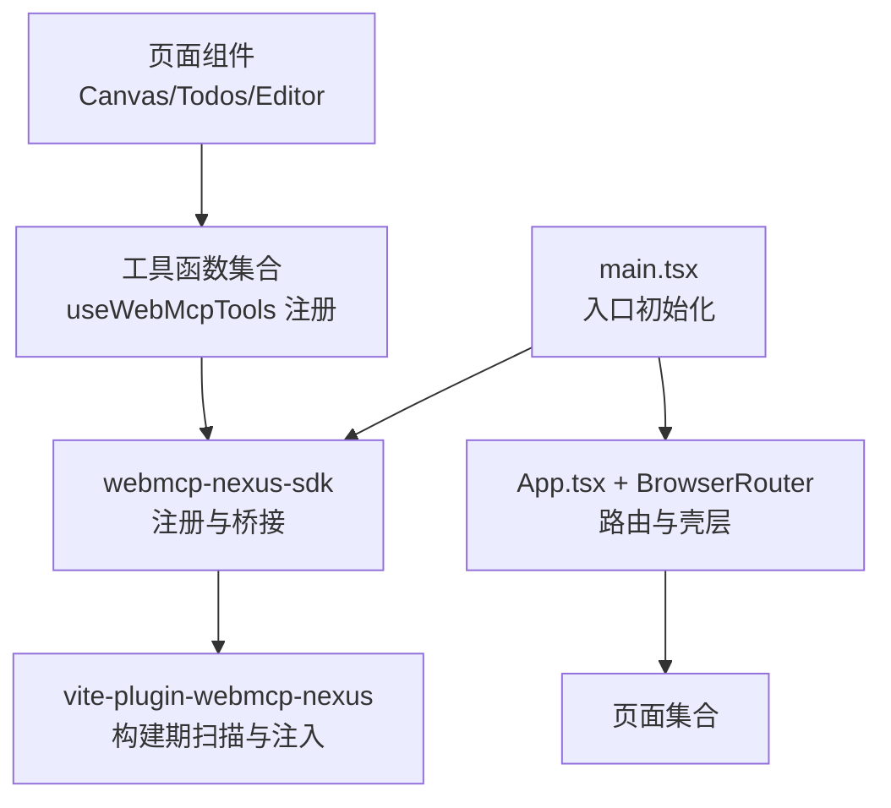
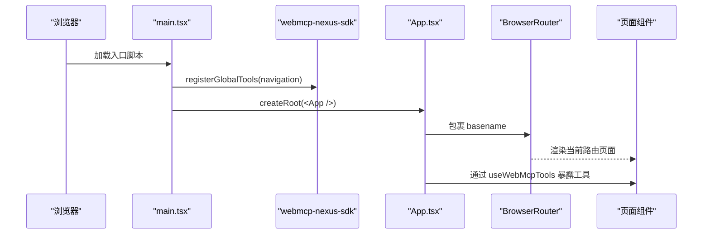
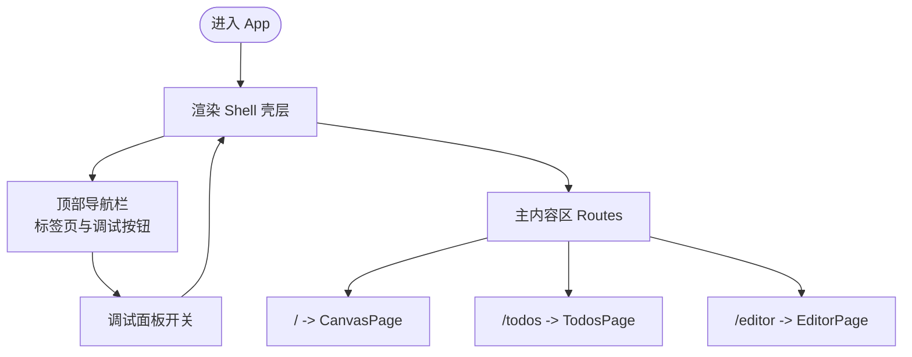
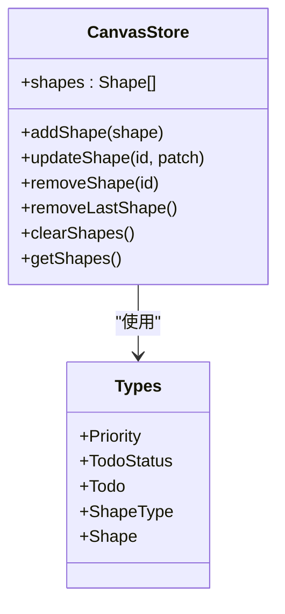
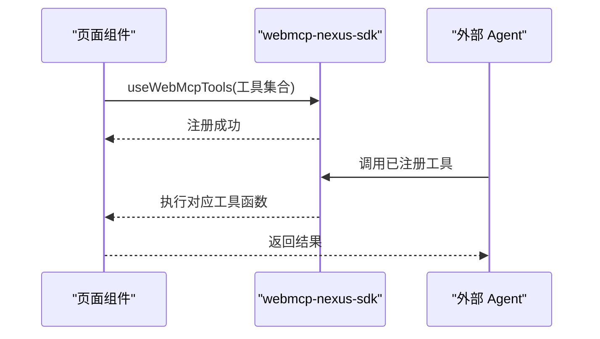
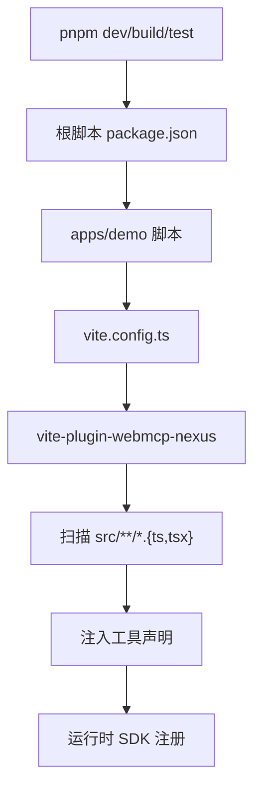
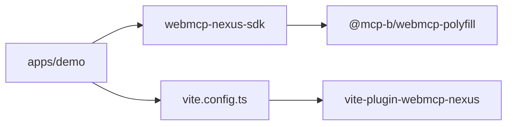

# 应用架构设计

<cite>
**本文引用的文件**
- [apps/demo/package.json](file://apps/demo/package.json)
- [apps/demo/vite.config.ts](file://apps/demo/vite.config.ts)
- [apps/demo/src/main.tsx](file://apps/demo/src/main.tsx)
- [apps/demo/src/App.tsx](file://apps/demo/src/App.tsx)
- [apps/demo/src/pages/CanvasPage.tsx](file://apps/demo/src/pages/CanvasPage.tsx)
- [apps/demo/src/pages/TodosPage.tsx](file://apps/demo/src/pages/TodosPage.tsx)
- [apps/demo/src/pages/EditorPage.tsx](file://apps/demo/src/pages/EditorPage.tsx)
- [apps/demo/src/store/CanvasStore.tsx](file://apps/demo/src/store/CanvasStore.tsx)
- [apps/demo/src/store/types.ts](file://apps/demo/src/store/types.ts)
- [apps/demo/src/tools/navigation.ts](file://apps/demo/src/tools/navigation.ts)
- [apps/demo/src/tools/navigation-bridge.ts](file://apps/demo/src/tools/navigation-bridge.ts)
- [package.json](file://package.json)
- [packages/webmcp-sdk/package.json](file://packages/webmcp-sdk/package.json)
</cite>

## 目录
1. [引言](#引言)
2. [项目结构](#项目结构)
3. [核心组件](#核心组件)
4. [架构总览](#架构总览)
5. [详细组件分析](#详细组件分析)
6. [依赖分析](#依赖分析)
7. [性能考虑](#性能考虑)
8. [故障排查指南](#故障排查指南)
9. [结论](#结论)
10. [附录](#附录)

## 引言
本文件面向演示应用“WebMCP Nexus Demo”，系统性解析其整体架构设计与组织结构，覆盖启动流程、路由配置与页面布局、组件层次与模块划分原则、入口点与构建配置、WebMCP SDK 与构建插件的集成方式，并提供架构图与组件关系说明，最后给出性能优化建议与最佳实践。

## 项目结构
该仓库采用 monorepo 结构，根目录通过工作区脚本统一管理多个包与示例应用。演示应用位于 apps/demo，核心 SDK 与构建插件位于 packages 目录。关键特性包括：
- 使用 React 19 与 React Router 7 进行页面与导航管理
- 通过 Vite 构建，集成自研 WebMCP 构建插件以暴露工具函数给 AI Agent
- 提供画板、待办、富文本编辑器三类页面，每类页面封装独立的业务 Store 与工具集
- 通过全局导航桥实现页面内工具与外部 Agent 的交互

图表来源
- [apps/demo/src/main.tsx:1-15](file://apps/demo/src/main.tsx#L1-L15)
- [apps/demo/src/App.tsx:1-98](file://apps/demo/src/App.tsx#L1-L98)
- [apps/demo/src/tools/navigation.ts:1-14](file://apps/demo/src/tools/navigation.ts#L1-L14)
- [apps/demo/src/tools/navigation-bridge.ts:1-8](file://apps/demo/src/tools/navigation-bridge.ts#L1-L8)
- [apps/demo/src/store/CanvasStore.tsx:1-94](file://apps/demo/src/store/CanvasStore.tsx#L1-L94)
- [apps/demo/src/store/types.ts:1-58](file://apps/demo/src/store/types.ts#L1-L58)
- [apps/demo/src/pages/CanvasPage.tsx:1-453](file://apps/demo/src/pages/CanvasPage.tsx#L1-L453)
- [apps/demo/src/pages/TodosPage.tsx:1-185](file://apps/demo/src/pages/TodosPage.tsx#L1-L185)
- [apps/demo/src/pages/EditorPage.tsx:1-559](file://apps/demo/src/pages/EditorPage.tsx#L1-L559)
- [packages/webmcp-sdk/package.json:1-62](file://packages/webmcp-sdk/package.json#L1-L62)

章节来源
- [apps/demo/package.json:1-56](file://apps/demo/package.json#L1-L56)
- [apps/demo/vite.config.ts:1-17](file://apps/demo/vite.config.ts#L1-L17)
- [apps/demo/src/main.tsx:1-15](file://apps/demo/src/main.tsx#L1-L15)
- [apps/demo/src/App.tsx:1-98](file://apps/demo/src/App.tsx#L1-L98)
- [apps/demo/src/tools/navigation.ts:1-14](file://apps/demo/src/tools/navigation.ts#L1-L14)
- [apps/demo/src/tools/navigation-bridge.ts:1-8](file://apps/demo/src/tools/navigation-bridge.ts#L1-L8)
- [apps/demo/src/store/CanvasStore.tsx:1-94](file://apps/demo/src/store/CanvasStore.tsx#L1-L94)
- [apps/demo/src/store/types.ts:1-58](file://apps/demo/src/store/types.ts#L1-L58)
- [apps/demo/src/pages/CanvasPage.tsx:1-453](file://apps/demo/src/pages/CanvasPage.tsx#L1-L453)
- [apps/demo/src/pages/TodosPage.tsx:1-185](file://apps/demo/src/pages/TodosPage.tsx#L1-L185)
- [apps/demo/src/pages/EditorPage.tsx:1-559](file://apps/demo/src/pages/EditorPage.tsx#L1-L559)
- [package.json:1-38](file://package.json#L1-L38)
- [packages/webmcp-sdk/package.json:1-62](file://packages/webmcp-sdk/package.json#L1-L62)

## 核心组件
- 应用外壳与路由
  - App.tsx 负责顶层路由配置与页面壳层渲染，包含顶部导航、主内容区域与调试面板开关逻辑。
  - 通过 BrowserRouter 与 basename 支持 Vite 与 Webpack 两种构建环境的路径前缀注入。
- 页面层
  - CanvasPage：围绕画板工具集，提供图形绘制、移动、样式修改、导出与截图等能力，并通过 SDK 暴露工具。
  - TodosPage：围绕待办工具集，提供增删改查、筛选、统计等能力，并通过 SDK 暴露工具。
  - EditorPage：围绕富文本编辑器工具集，提供内容查询、插入、格式化、编辑等能力，并通过 SDK 暴露工具。
- 状态层
  - CanvasStore：提供画板图形的增删改查与历史操作支持，使用 React Context 作为 Store Provider。
  - 类型定义：集中定义 Todo 与 Shape 等领域模型及优先级、状态映射。
- 导航桥
  - navigation.ts/navigatio-bridge.ts：提供全局导航工具与桥接，使页面内的工具可以驱动路由跳转。

章节来源
- [apps/demo/src/App.tsx:1-98](file://apps/demo/src/App.tsx#L1-L98)
- [apps/demo/src/pages/CanvasPage.tsx:1-453](file://apps/demo/src/pages/CanvasPage.tsx#L1-L453)
- [apps/demo/src/pages/TodosPage.tsx:1-185](file://apps/demo/src/pages/TodosPage.tsx#L1-L185)
- [apps/demo/src/pages/EditorPage.tsx:1-559](file://apps/demo/src/pages/EditorPage.tsx#L1-L559)
- [apps/demo/src/store/CanvasStore.tsx:1-94](file://apps/demo/src/store/CanvasStore.tsx#L1-L94)
- [apps/demo/src/store/types.ts:1-58](file://apps/demo/src/store/types.ts#L1-L58)
- [apps/demo/src/tools/navigation.ts:1-14](file://apps/demo/src/tools/navigation.ts#L1-L14)
- [apps/demo/src/tools/navigation-bridge.ts:1-8](file://apps/demo/src/tools/navigation-bridge.ts#L1-L8)

## 架构总览
应用采用“页面-工具-SDK-插件”的分层架构：
- 页面层负责业务功能与 UI，通过 useWebMcpTools 暴露一组工具函数给 SDK。
- SDK 层负责注册与桥接工具，使这些工具可在运行时被外部 Agent 调用。
- 构建插件在开发/生产阶段扫描源码，自动注入工具声明，确保 SDK 能正确识别工具签名与作用域。
- 入口层负责初始化全局工具与渲染应用。

图表来源
- [apps/demo/src/main.tsx:1-15](file://apps/demo/src/main.tsx#L1-L15)
- [apps/demo/src/App.tsx:1-98](file://apps/demo/src/App.tsx#L1-L98)
- [apps/demo/src/pages/CanvasPage.tsx:415-432](file://apps/demo/src/pages/CanvasPage.tsx#L415-L432)
- [apps/demo/src/pages/TodosPage.tsx:116-129](file://apps/demo/src/pages/TodosPage.tsx#L116-L129)
- [apps/demo/src/pages/EditorPage.tsx:522-546](file://apps/demo/src/pages/EditorPage.tsx#L522-L546)
- [apps/demo/vite.config.ts:1-17](file://apps/demo/vite.config.ts#L1-L17)
- [packages/webmcp-sdk/package.json:1-62](file://packages/webmcp-sdk/package.json#L1-L62)

## 详细组件分析

### 启动流程与入口点
- 入口初始化
  - main.tsx 中注册全局工具（导航桥接）并挂载 React 根节点。
- 应用外壳
  - App.tsx 包裹三层 Provider（画板/待办/编辑器 Store），设置 BrowserRouter 与 basename，渲染顶部导航与主内容区域。
- 路由与导航桥
  - NavigateBridge 在组件挂载时发布 navigate 函数，页面工具可通过 publishNavigate(null) 在卸载时清理。

图表来源
- [apps/demo/src/main.tsx:1-15](file://apps/demo/src/main.tsx#L1-L15)
- [apps/demo/src/App.tsx:1-98](file://apps/demo/src/App.tsx#L1-L98)
- [apps/demo/src/tools/navigation.ts:1-14](file://apps/demo/src/tools/navigation.ts#L1-L14)
- [apps/demo/src/tools/navigation-bridge.ts:1-8](file://apps/demo/src/tools/navigation-bridge.ts#L1-L8)

章节来源
- [apps/demo/src/main.tsx:1-15](file://apps/demo/src/main.tsx#L1-L15)
- [apps/demo/src/App.tsx:1-98](file://apps/demo/src/App.tsx#L1-L98)
- [apps/demo/src/tools/navigation.ts:1-14](file://apps/demo/src/tools/navigation.ts#L1-L14)
- [apps/demo/src/tools/navigation-bridge.ts:1-8](file://apps/demo/src/tools/navigation-bridge.ts#L1-L8)

### 路由配置与页面布局
- 路由配置
  - App.tsx 使用 React Router v7 的 Routes/Route 定义三个页面路由：根路径（画板）、/todos（待办）、/editor（编辑器）。
- 页面壳层
  - Shell 组件负责顶部导航栏、主内容区与调试面板控制，支持键盘快捷键切换调试面板。
- 调试面板
  - 通过状态控制调试面板开合，并在壳层添加 debug-shifted 样式类以调整布局。

图表来源
- [apps/demo/src/App.tsx:21-81](file://apps/demo/src/App.tsx#L21-L81)

章节来源
- [apps/demo/src/App.tsx:1-98](file://apps/demo/src/App.tsx#L1-L98)

### 组件层次与模块划分
- 页面层（Canvas/Todos/Editor）
  - 每个页面封装自身工具集并通过 SDK 暴露，职责单一且边界清晰。
- 状态层（Store）
  - CanvasStore 提供画板图形的增删改查与历史操作，使用 Context 作为 Provider，便于跨组件共享。
- 工具层（navigation）
  - 全局导航工具通过桥接发布到页面工具，形成“页面工具 -> SDK -> 外部 Agent”的通路。
- 类型层（types）
  - 统一定义 Todo 与 Shape 等领域模型，保证 Store 与页面间的数据契约一致。

图表来源
- [apps/demo/src/store/CanvasStore.tsx:1-94](file://apps/demo/src/store/CanvasStore.tsx#L1-L94)
- [apps/demo/src/store/types.ts:1-58](file://apps/demo/src/store/types.ts#L1-L58)

章节来源
- [apps/demo/src/store/CanvasStore.tsx:1-94](file://apps/demo/src/store/CanvasStore.tsx#L1-L94)
- [apps/demo/src/store/types.ts:1-58](file://apps/demo/src/store/types.ts#L1-L58)

### 页面工具与 SDK 集成
- CanvasPage
  - 暴露画板相关工具：绘制自由线、直线、矩形、圆形、文字；移动、删除、更新样式与文本；撤销、清空；获取画布信息、尺寸、截图与导出。
- TodosPage
  - 暴露待办相关工具：列出、搜索、统计；创建、更新、删除、批量更新状态与优先级、设置截止日期。
- EditorPage
  - 暴露编辑器相关工具：内容查询（JSON/HTML/TEXT）、统计、大纲；插入文本、标题、段落、代码块、引用块、列表、水平线、链接；格式化（加粗/斜体/下划线/删除线/代码）、对齐、标题级别、块类型、列表切换；编辑（查找替换、清空、设置内容、撤销/重做）、设置标题。

图表来源
- [apps/demo/src/pages/CanvasPage.tsx:415-432](file://apps/demo/src/pages/CanvasPage.tsx#L415-L432)
- [apps/demo/src/pages/TodosPage.tsx:116-129](file://apps/demo/src/pages/TodosPage.tsx#L116-L129)
- [apps/demo/src/pages/EditorPage.tsx:522-546](file://apps/demo/src/pages/EditorPage.tsx#L522-L546)
- [packages/webmcp-sdk/package.json:1-62](file://packages/webmcp-sdk/package.json#L1-L62)

章节来源
- [apps/demo/src/pages/CanvasPage.tsx:1-453](file://apps/demo/src/pages/CanvasPage.tsx#L1-L453)
- [apps/demo/src/pages/TodosPage.tsx:1-185](file://apps/demo/src/pages/TodosPage.tsx#L1-L185)
- [apps/demo/src/pages/EditorPage.tsx:1-559](file://apps/demo/src/pages/EditorPage.tsx#L1-L559)
- [packages/webmcp-sdk/package.json:1-62](file://packages/webmcp-sdk/package.json#L1-L62)

### 构建配置与插件集成
- Vite 配置
  - 启用 React 插件与自研 WebMCP 插件，include 指定扫描范围，base 支持动态前缀。
- 根工作区脚本
  - 提供统一的开发、构建、测试、清理与发布命令，便于多包协同。
- SDK 与插件
  - SDK 作为 peerDependency 与 React 版本兼容；插件在构建期扫描源码，注入工具声明，使 SDK 能识别工具签名与作用域。

图表来源
- [apps/demo/vite.config.ts:1-17](file://apps/demo/vite.config.ts#L1-L17)
- [apps/demo/package.json:1-56](file://apps/demo/package.json#L1-L56)
- [package.json:1-38](file://package.json#L1-L38)
- [packages/webmcp-sdk/package.json:1-62](file://packages/webmcp-sdk/package.json#L1-L62)

章节来源
- [apps/demo/vite.config.ts:1-17](file://apps/demo/vite.config.ts#L1-L17)
- [apps/demo/package.json:1-56](file://apps/demo/package.json#L1-L56)
- [package.json:1-38](file://package.json#L1-L38)
- [packages/webmcp-sdk/package.json:1-62](file://packages/webmcp-sdk/package.json#L1-L62)

## 依赖分析
- 应用依赖
  - React 与 React DOM：UI 基础
  - React Router：页面路由
  - Tiptap 生态：富文本编辑器
  - webmcp-nexus-sdk：SDK 依赖
  - vite-plugin-webmcp-nexus：构建期插件
- SDK 依赖
  - 作为 peerDependency 与 React 兼容
  - 依赖 polyfill 以支持 MCP 协议
- 插件作用
  - 在构建期扫描源码，注入工具声明，减少手动配置成本

图表来源
- [apps/demo/package.json:1-56](file://apps/demo/package.json#L1-L56)
- [apps/demo/vite.config.ts:1-17](file://apps/demo/vite.config.ts#L1-L17)
- [packages/webmcp-sdk/package.json:1-62](file://packages/webmcp-sdk/package.json#L1-L62)

章节来源
- [apps/demo/package.json:1-56](file://apps/demo/package.json#L1-L56)
- [packages/webmcp-sdk/package.json:1-62](file://packages/webmcp-sdk/package.json#L1-L62)

## 性能考虑
- 构建与打包
  - 开发阶段保持可读性与调试友好，生产阶段启用压缩与 Tree-shaking（由 Vite/TS 默认行为与插件共同完成）。
  - 通过 include 精准限定扫描范围，避免不必要的构建开销。
- 组件与状态
  - Store 使用 useMemo 与 useCallback 降低重渲染频率；按需拆分 Provider，避免无关上下文变更导致的全量重渲染。
- 图形与编辑器
  - 画板截图与导出时根据最大宽度进行等比缩放，避免过大的数据传输与内存占用。
  - 富文本编辑器在批量替换时尽量使用原生 DOM 操作，减少中间对象创建。
- 路由与导航
  - basename 动态注入避免重复前缀，减少资源请求错误与缓存问题。

## 故障排查指南
- 路由前缀问题
  - 若页面资源加载失败，检查 basename 生成逻辑与环境变量 DEMO_BASE 的注入是否正确。
- 工具未注册
  - 确认页面已调用 useWebMcpTools 并传入工具集合；检查插件是否正确扫描到源码。
- 导航无效
  - 确保 NavigateBridge 在 App 壳层中渲染且未被提前卸载；检查 publishNavigate 是否被正确发布与清理。
- 截图/导出异常
  - 检查画布元素是否存在与设备像素比；确认目标尺寸与质量参数合法。

章节来源
- [apps/demo/src/App.tsx:83-98](file://apps/demo/src/App.tsx#L83-L98)
- [apps/demo/src/pages/CanvasPage.tsx:284-322](file://apps/demo/src/pages/CanvasPage.tsx#L284-L322)
- [apps/demo/src/tools/navigation-bridge.ts:1-8](file://apps/demo/src/tools/navigation-bridge.ts#L1-L8)

## 结论
该演示应用以清晰的分层架构与模块化设计实现了 WebMCP 工具的快速集成与运行时暴露。通过入口初始化、路由壳层、页面工具与 SDK 插件的协同，应用在开发体验与运行效率之间取得平衡。建议在后续迭代中进一步细化工具签名校验、增加错误边界与日志上报，并持续优化构建扫描策略以提升大型工程的构建稳定性。

## 附录
- 最佳实践
  - 将页面工具收敛到页面级，避免跨页面耦合
  - 使用 Context Provider 分层管理状态，减少全局状态污染
  - 在工具函数中加入参数校验与错误返回，便于 Agent 侧处理
  - 保持 basename 注入的一致性，避免多环境差异
  - 对大对象操作（截图/导出）进行参数约束与降采样