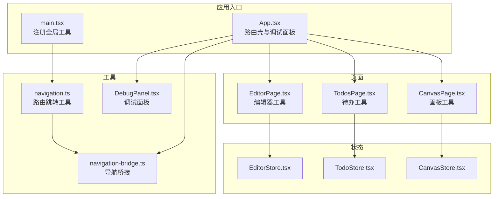
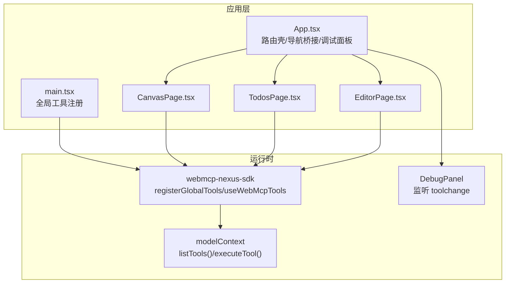
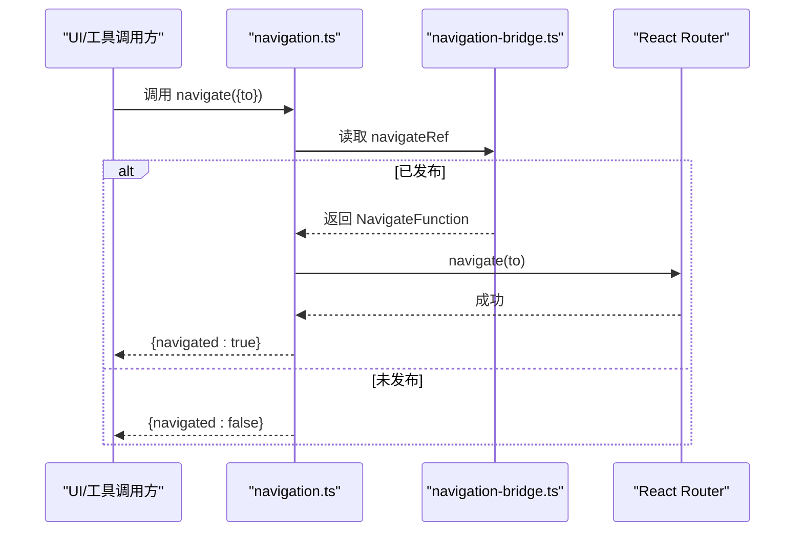
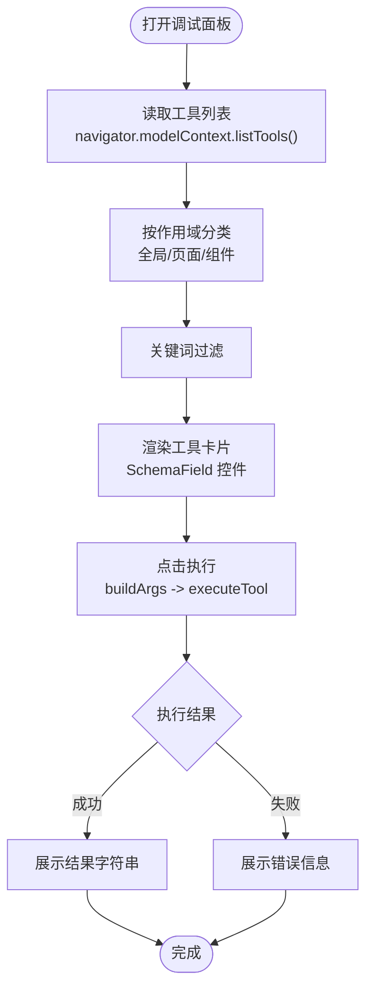
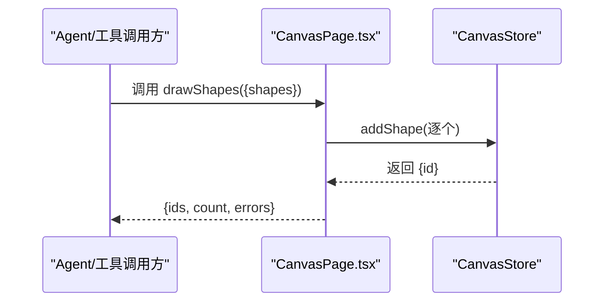
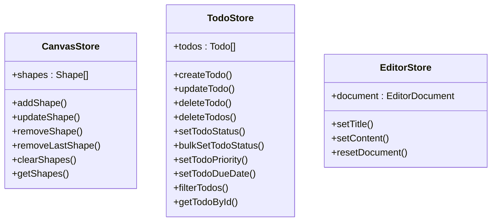
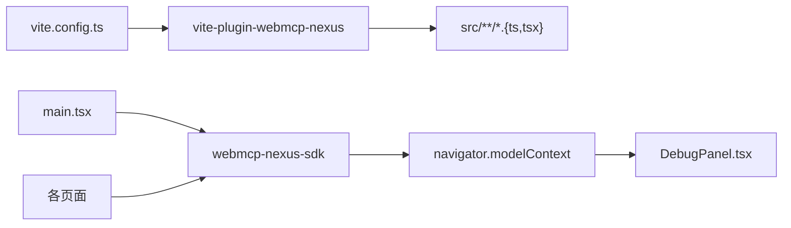

# 演示应用

<cite>
**本文引用的文件**
- [apps/demo/src/App.tsx](file://apps/demo/src/App.tsx)
- [apps/demo/src/main.tsx](file://apps/demo/src/main.tsx)
- [apps/demo/src/components/DebugPanel.tsx](file://apps/demo/src/components/DebugPanel.tsx)
- [apps/demo/src/tools/navigation.ts](file://apps/demo/src/tools/navigation.ts)
- [apps/demo/src/tools/navigation-bridge.ts](file://apps/demo/src/tools/navigation-bridge.ts)
- [apps/demo/src/pages/CanvasPage.tsx](file://apps/demo/src/pages/CanvasPage.tsx)
- [apps/demo/src/pages/TodosPage.tsx](file://apps/demo/src/pages/TodosPage.tsx)
- [apps/demo/src/pages/EditorPage.tsx](file://apps/demo/src/pages/EditorPage.tsx)
- [apps/demo/src/store/CanvasStore.tsx](file://apps/demo/src/store/CanvasStore.tsx)
- [apps/demo/src/store/TodoStore.tsx](file://apps/demo/src/store/TodoStore.tsx)
- [apps/demo/src/store/EditorStore.tsx](file://apps/demo/src/store/EditorStore.tsx)
- [apps/demo/src/store/types.ts](file://apps/demo/src/store/types.ts)
- [apps/demo/package.json](file://apps/demo/package.json)
- [apps/demo/vite.config.ts](file://apps/demo/vite.config.ts)
</cite>

## 目录
1. [简介](#简介)
2. [项目结构](#项目结构)
3. [核心组件](#核心组件)
4. [架构总览](#架构总览)
5. [详细组件分析](#详细组件分析)
6. [依赖关系分析](#依赖关系分析)
7. [性能考量](#性能考量)
8. [故障排查指南](#故障排查指南)
9. [结论](#结论)
10. [附录](#附录)

## 简介
本文件深入解析 apps/demo 演示应用的架构设计与实现细节，覆盖页面组织、组件设计模式、状态管理策略以及工具注册与生命周期管理。应用通过统一入口注册全局工具、在各页面组件中以“作用域”形式挂载局部工具，形成“全局查询工具 + 组件级表单/编辑工具 + 路由跳转工具”的典型集成模式。同时，应用内置 Debug Panel，用于动态发现、筛选、执行与调试 WebMCP 工具，帮助开发者快速验证工具链与交互。

## 项目结构
演示应用采用“页面 + 组件 + 工具 + 状态”分层组织，结合 Vite 插件实现构建期工具注入与开发体验优化。核心目录与职责如下：
- 页面层：CanvasPage、TodosPage、EditorPage，分别承载画板、待办、富文本编辑场景。
- 组件层：DebugPanel、工具桥接 navigation-bridge、导航工具 navigation。
- 状态层：CanvasStore、TodoStore、EditorStore，提供细粒度的状态封装与变更接口。
- 工具层：全局工具（main.tsx 中注册）、页面工具（各页面内 useWebMcpTools 挂载）。
- 构建配置：vite.config.ts 集成 webmcp 插件，实现工具 schema 的自动注入与热更新。

图表来源
- [apps/demo/src/main.tsx:1-15](file://apps/demo/src/main.tsx#L1-L15)
- [apps/demo/src/App.tsx:1-98](file://apps/demo/src/App.tsx#L1-L98)
- [apps/demo/src/tools/navigation.ts:1-14](file://apps/demo/src/tools/navigation.ts#L1-L14)
- [apps/demo/src/tools/navigation-bridge.ts:1-8](file://apps/demo/src/tools/navigation-bridge.ts#L1-L8)
- [apps/demo/src/pages/CanvasPage.tsx:1-500](file://apps/demo/src/pages/CanvasPage.tsx#L1-L500)
- [apps/demo/src/pages/TodosPage.tsx:1-185](file://apps/demo/src/pages/TodosPage.tsx#L1-L185)
- [apps/demo/src/pages/EditorPage.tsx:1-559](file://apps/demo/src/pages/EditorPage.tsx#L1-L559)
- [apps/demo/src/store/CanvasStore.tsx:1-94](file://apps/demo/src/store/CanvasStore.tsx#L1-L94)
- [apps/demo/src/store/TodoStore.tsx:1-289](file://apps/demo/src/store/TodoStore.tsx#L1-L289)
- [apps/demo/src/store/EditorStore.tsx:1-115](file://apps/demo/src/store/EditorStore.tsx#L1-L115)
- [apps/demo/src/components/DebugPanel.tsx:1-480](file://apps/demo/src/components/DebugPanel.tsx#L1-L480)

章节来源
- [apps/demo/src/App.tsx:1-98](file://apps/demo/src/App.tsx#L1-L98)
- [apps/demo/src/main.tsx:1-15](file://apps/demo/src/main.tsx#L1-L15)
- [apps/demo/vite.config.ts:1-17](file://apps/demo/vite.config.ts#L1-L17)

## 核心组件
- 应用壳与路由：App.tsx 提供 BrowserRouter、顶部导航、页面路由与调试面板开关；通过 NavigateBridge 将 useNavigate 的实例发布到全局导航桥接，供工具调用。
- 全局工具注册：main.tsx 通过 registerGlobalTools(navigation) 将导航工具注册为全局可用，便于跨页面/组件调用。
- 调试面板：DebugPanel 动态读取 modelContext.listTools，分类显示“全局/页面/组件”作用域工具，支持输入校验、防抖刷新、执行结果与错误展示。
- 页面工具集：
  - CanvasPage：围绕画布绘制与编辑，提供查询、绘制、移动、样式修改、截图等工具。
  - TodosPage：围绕待办管理，提供查询、创建、更新、删除、统计等工具。
  - EditorPage：围绕富文本编辑，提供内容查询、插入、格式化、编辑、撤销/重做等工具。
- 状态管理：
  - CanvasStore：集中管理形状集合与增删改查。
  - TodoStore：集中管理待办集合与过滤排序。
  - EditorStore：集中管理文档标题、内容与更新时间。

章节来源
- [apps/demo/src/App.tsx:1-98](file://apps/demo/src/App.tsx#L1-L98)
- [apps/demo/src/main.tsx:1-15](file://apps/demo/src/main.tsx#L1-L15)
- [apps/demo/src/components/DebugPanel.tsx:1-480](file://apps/demo/src/components/DebugPanel.tsx#L1-L480)
- [apps/demo/src/pages/CanvasPage.tsx:1-500](file://apps/demo/src/pages/CanvasPage.tsx#L1-L500)
- [apps/demo/src/pages/TodosPage.tsx:1-185](file://apps/demo/src/pages/TodosPage.tsx#L1-L185)
- [apps/demo/src/pages/EditorPage.tsx:1-559](file://apps/demo/src/pages/EditorPage.tsx#L1-L559)
- [apps/demo/src/store/CanvasStore.tsx:1-94](file://apps/demo/src/store/CanvasStore.tsx#L1-L94)
- [apps/demo/src/store/TodoStore.tsx:1-289](file://apps/demo/src/store/TodoStore.tsx#L1-L289)
- [apps/demo/src/store/EditorStore.tsx:1-115](file://apps/demo/src/store/EditorStore.tsx#L1-L115)

## 架构总览
应用采用“入口注册 + 页面作用域挂载 + 全局桥接 + 调试面板”的架构，实现工具的声明式注册与可视化调试。构建期通过 Vite 插件注入工具 schema，开发期支持热更新与工具变更感知。

图表来源
- [apps/demo/src/main.tsx:1-15](file://apps/demo/src/main.tsx#L1-L15)
- [apps/demo/src/App.tsx:1-98](file://apps/demo/src/App.tsx#L1-L98)
- [apps/demo/src/components/DebugPanel.tsx:1-480](file://apps/demo/src/components/DebugPanel.tsx#L1-L480)
- [apps/demo/src/pages/CanvasPage.tsx:1-500](file://apps/demo/src/pages/CanvasPage.tsx#L1-L500)
- [apps/demo/src/pages/TodosPage.tsx:1-185](file://apps/demo/src/pages/TodosPage.tsx#L1-L185)
- [apps/demo/src/pages/EditorPage.tsx:1-559](file://apps/demo/src/pages/EditorPage.tsx#L1-L559)

## 详细组件分析

### 应用壳与路由（App.tsx）
- 路由壳：BrowserRouter + Routes 定义三类页面路由，顶部导航通过 NavLink 实现。
- 导航桥接：NavigateBridge 在挂载时将 useNavigate 发布到全局桥接，卸载时清空，确保工具调用时有可用的导航函数。
- 调试面板：支持键盘快捷键与按钮切换，配合 CSS 类名实现面板展开/收起。
- 基础路径：根据 import.meta.env.BASE_URL 或 DEMO_BASE 环境变量设置 basename，适配多部署场景。

章节来源
- [apps/demo/src/App.tsx:1-98](file://apps/demo/src/App.tsx#L1-L98)

### 全局工具注册（main.tsx）
- 入口处调用 registerGlobalTools(navigation)，将导航工具注册为全局可用。
- 与 SDK 的 registerGlobalTools 对应，实现工具的全局可见性与统一调度。

章节来源
- [apps/demo/src/main.tsx:1-15](file://apps/demo/src/main.tsx#L1-L15)

### 导航工具与桥接（navigation.ts / navigation-bridge.ts）
- 桥接：导出可变的 navigateRef 与 publishNavigate 方法，供 App.tsx 在路由挂载时注入/释放。
- 工具：提供 navigate(to) 工具，接收目标路径参数，内部通过已发布的 navigateRef 执行跳转，返回布尔结果表示是否成功。

图表来源
- [apps/demo/src/tools/navigation.ts:1-14](file://apps/demo/src/tools/navigation.ts#L1-L14)
- [apps/demo/src/tools/navigation-bridge.ts:1-8](file://apps/demo/src/tools/navigation-bridge.ts#L1-L8)

章节来源
- [apps/demo/src/tools/navigation.ts:1-14](file://apps/demo/src/tools/navigation.ts#L1-L14)
- [apps/demo/src/tools/navigation-bridge.ts:1-8](file://apps/demo/src/tools/navigation-bridge.ts#L1-L8)

### 调试面板（DebugPanel.tsx）
- 工具发现：通过 navigator.modelContext.listTools 获取工具清单，解析描述与输入 schema。
- 作用域分类：依据描述中的“作用域”标记区分全局与页面/组件工具，支持标签页切换。
- 输入校验：根据 JSON Schema 生成对应控件，支持枚举、布尔、数值、数组/对象（JSON）等类型，必填字段与默认值提示。
- 执行流程：构建参数 JSON，调用 navigator.modelContextTesting.executeTool，支持执行中状态、错误捕获与时间戳记录。
- 性能与体验：定时刷新 + debounce 合并 toolchange 事件，搜索过滤与分组展示，提升大工具集下的可用性。

图表来源
- [apps/demo/src/components/DebugPanel.tsx:1-480](file://apps/demo/src/components/DebugPanel.tsx#L1-L480)

章节来源
- [apps/demo/src/components/DebugPanel.tsx:1-480](file://apps/demo/src/components/DebugPanel.tsx#L1-L480)

### 画板页面（CanvasPage.tsx）
- 工具覆盖：查询（画布信息、尺寸、形状列表、截图）、绘制（自由线、直线、矩形、圆、文字）、批量绘制、移动、删除、样式修改、撤销、清空。
- 状态管理：通过 useCanvasStore 获取增删改查与列表访问能力，工具函数内部直接操作 store 并返回标准化结果。
- 截图与尺寸：基于 DOM 与离屏画布生成缩略图，考虑设备像素比与最大宽度限制，避免过大 token 消耗。

图表来源
- [apps/demo/src/pages/CanvasPage.tsx:1-500](file://apps/demo/src/pages/CanvasPage.tsx#L1-L500)
- [apps/demo/src/store/CanvasStore.tsx:1-94](file://apps/demo/src/store/CanvasStore.tsx#L1-L94)

章节来源
- [apps/demo/src/pages/CanvasPage.tsx:1-500](file://apps/demo/src/pages/CanvasPage.tsx#L1-L500)
- [apps/demo/src/store/CanvasStore.tsx:1-94](file://apps/demo/src/store/CanvasStore.tsx#L1-L94)

### 待办页面（TodosPage.tsx）
- 工具覆盖：查询（列表、详情、搜索、统计）、编辑（创建、更新、删除、批量设置状态、设置优先级、设置截止日期）。
- 状态管理：useTodoStore 提供过滤与排序能力，工具函数内部直接操作 store 并返回标准化结果。
- 搜索与统计：支持关键词、优先级、状态过滤，统计总数、各状态数量与逾期数量。

章节来源
- [apps/demo/src/pages/TodosPage.tsx:1-185](file://apps/demo/src/pages/TodosPage.tsx#L1-L185)
- [apps/demo/src/store/TodoStore.tsx:1-289](file://apps/demo/src/store/TodoStore.tsx#L1-L289)

### 富文本编辑器页面（EditorPage.tsx）
- 工具覆盖：查询（内容、统计、大纲）、插入（文本、标题、段落、代码块、引用块、列表、水平线、链接）、格式化（加粗/斜体/下划线/删除线/代码、对齐、标题级别、块类型、列表切换、链接移除）、编辑（查找替换、清空、设置内容、撤销/重做、设置标题）。
- 状态管理：useEditorStore 提供文档标题与内容的读写，工具函数通过 Tiptap Editor 命令实现。
- 结果一致性：工具返回统一的 success/active/count 等字段，便于 Agent 判断与反馈。

章节来源
- [apps/demo/src/pages/EditorPage.tsx:1-559](file://apps/demo/src/pages/EditorPage.tsx#L1-L559)
- [apps/demo/src/store/EditorStore.tsx:1-115](file://apps/demo/src/store/EditorStore.tsx#L1-L115)

### 状态管理（CanvasStore/TodoStore/EditorStore）
- 设计模式：每个 store 以 Context 形式暴露 value，内部通过 useMemo 缓存回调，减少子组件重渲染。
- CanvasStore：集中管理形状集合，提供增删改查与清空、最后一条删除等便捷方法。
- TodoStore：集中管理待办集合，提供创建、更新、删除、批量删除、状态/优先级/截止日期设置、搜索过滤与排序。
- EditorStore：集中管理文档标题与内容，提供标题与内容更新、重置文档。

图表来源
- [apps/demo/src/store/CanvasStore.tsx:1-94](file://apps/demo/src/store/CanvasStore.tsx#L1-L94)
- [apps/demo/src/store/TodoStore.tsx:1-289](file://apps/demo/src/store/TodoStore.tsx#L1-L289)
- [apps/demo/src/store/EditorStore.tsx:1-115](file://apps/demo/src/store/EditorStore.tsx#L1-L115)
- [apps/demo/src/store/types.ts:1-58](file://apps/demo/src/store/types.ts#L1-L58)

章节来源
- [apps/demo/src/store/CanvasStore.tsx:1-94](file://apps/demo/src/store/CanvasStore.tsx#L1-L94)
- [apps/demo/src/store/TodoStore.tsx:1-289](file://apps/demo/src/store/TodoStore.tsx#L1-L289)
- [apps/demo/src/store/EditorStore.tsx:1-115](file://apps/demo/src/store/EditorStore.tsx#L1-L115)
- [apps/demo/src/store/types.ts:1-58](file://apps/demo/src/store/types.ts#L1-L58)

## 依赖关系分析
- 构建期：vite.config.ts 配置 vite-plugin-webmcp-nexus，扫描 src 下 TS/TSX 文件，自动注入工具 schema，支持热更新。
- 运行时：webmcp-nexus-sdk 提供 registerGlobalTools 与 useWebMcpTools；应用通过 main.tsx 注册全局工具，页面通过 useWebMcpTools 挂载组件级工具。
- 第三方库：React、React Router、Tiptap 生态（@tiptap/react 等）支撑页面与编辑器功能。

图表来源
- [apps/demo/vite.config.ts:1-17](file://apps/demo/vite.config.ts#L1-L17)
- [apps/demo/src/main.tsx:1-15](file://apps/demo/src/main.tsx#L1-L15)
- [apps/demo/src/components/DebugPanel.tsx:1-480](file://apps/demo/src/components/DebugPanel.tsx#L1-L480)

章节来源
- [apps/demo/vite.config.ts:1-17](file://apps/demo/vite.config.ts#L1-L17)
- [apps/demo/package.json:1-56](file://apps/demo/package.json#L1-L56)

## 性能考量
- 工具发现与刷新：DebugPanel 使用定时器与 debounce 合并 toolchange 事件，降低频繁刷新带来的开销。
- 状态缓存：各 store 使用 useMemo 缓存回调，减少不必要的重渲染。
- 截图缩放：画板截图按最大宽度等比缩放，避免生成过大的 dataURL。
- 构建优化：Vite 构建禁用压缩，提升开发体验；生产构建可按需开启。

## 故障排查指南
- 工具不可见或无法执行
  - 检查 DebugPanel 是否正确读取 navigator.modelContext.listTools，确认工具已注册且未被其他作用域冲突覆盖。
  - 若工具名称重复，控制台会有警告但不会中断；建议使用语义化唯一工具名。
- 调试面板无响应
  - 确认 modelContextTesting.executeTool 可用；若返回 null，可能触发了页面跳转。
  - 检查输入 schema 的必填字段与类型，确保 JSON 解析通过。
- 路由跳转无效
  - 确认 App.tsx 的 NavigateBridge 已在路由挂载后发布 navigateRef；卸载时已清空。
  - 检查 navigate(to) 参数是否为有效路径。
- 页面工具未生效
  - 确认页面已调用 useWebMcpTools 注册工具；检查工具函数签名与返回值结构是否符合预期。

章节来源
- [apps/demo/src/components/DebugPanel.tsx:1-480](file://apps/demo/src/components/DebugPanel.tsx#L1-L480)
- [apps/demo/src/tools/navigation.ts:1-14](file://apps/demo/src/tools/navigation.ts#L1-L14)
- [apps/demo/src/tools/navigation-bridge.ts:1-8](file://apps/demo/src/tools/navigation-bridge.ts#L1-L8)
- [apps/demo/src/pages/CanvasPage.tsx:1-500](file://apps/demo/src/pages/CanvasPage.tsx#L1-L500)
- [apps/demo/src/pages/TodosPage.tsx:1-185](file://apps/demo/src/pages/TodosPage.tsx#L1-L185)
- [apps/demo/src/pages/EditorPage.tsx:1-559](file://apps/demo/src/pages/EditorPage.tsx#L1-L559)

## 结论
apps/demo 演示应用以“入口注册 + 页面作用域挂载 + 全局桥接 + 调试面板”为核心架构，系统性展示了 WebMCP 工具在真实前端场景中的落地方式。通过清晰的页面划分、细粒度的状态封装与完善的工具调试机制，应用为后续扩展与规模化集成提供了良好范式。

## 附录
- 实际使用案例
  - 全局导航：在任意页面通过 navigate({ to }) 实现内部路由跳转。
  - 画板绘制：调用 drawShapes 批量绘制多种图形，或调用 drawFreehand/drawLine 等单图工具。
  - 待办管理：调用 searchTodos 进行关键词与条件过滤，再调用 setTodoStatus 批量切换状态。
  - 富文本编辑：调用 getDocumentContent 获取内容，再调用 insertHeading/insertParagraph 等插入工具，最后通过 setDocumentTitle 设置标题。
- 扩展指导
  - 工具注册最佳实践：使用语义化唯一工具名，避免同名冲突；全局工具尽量保持幂等与无副作用。
  - 生命周期管理：组件卸载时自动注销作用域工具，避免“幽灵工具”污染；全局工具通过发布/清空 navigateRef 管理。
  - 架构演进：随着业务复杂度上升，可拆分更细的 store 与工具模块，引入中间件或拦截器增强可观测性与安全性。