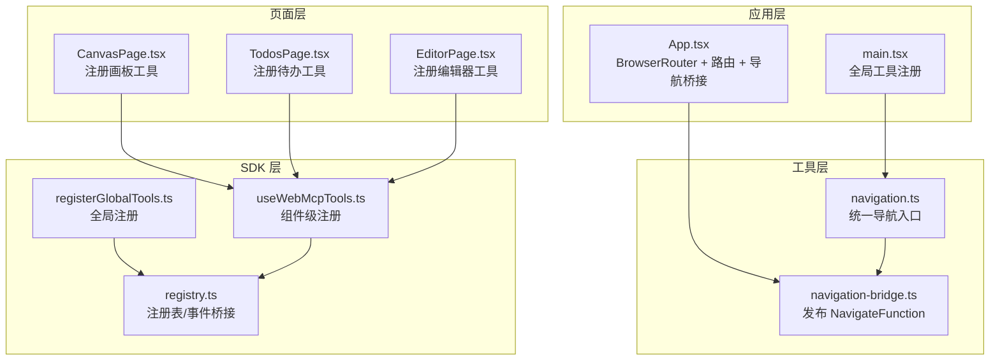
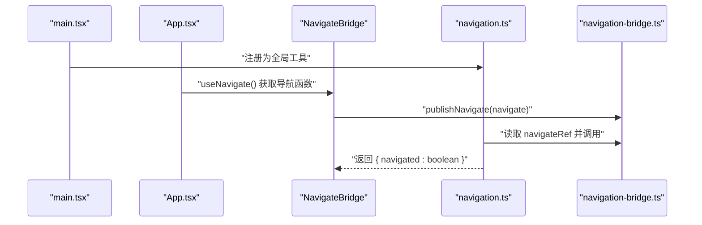
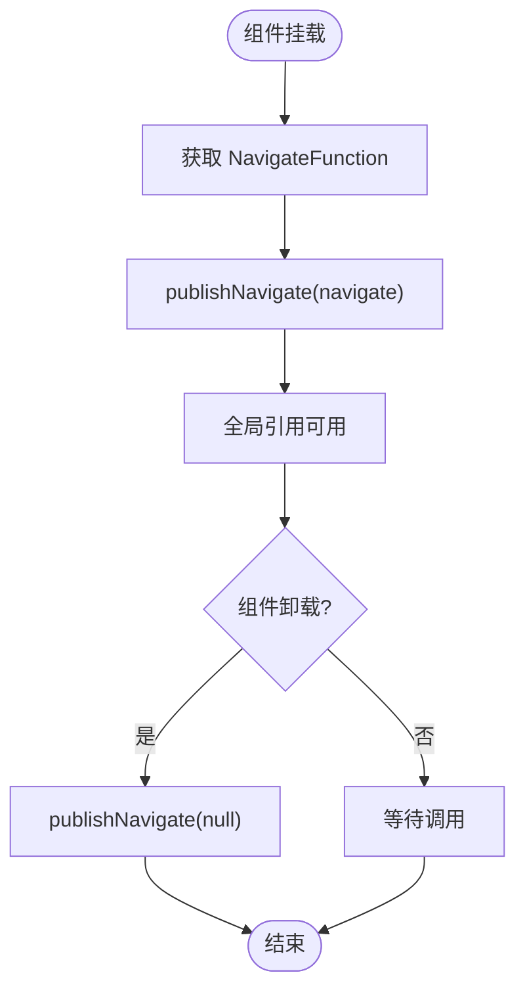
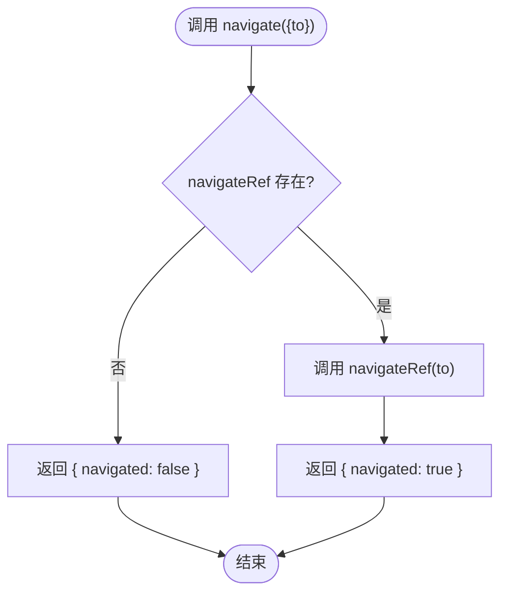
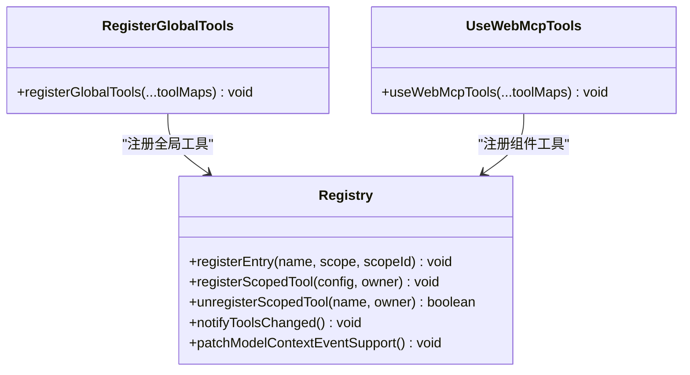
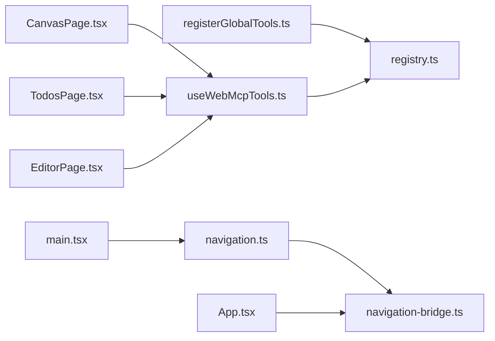

# 导航工具与桥接

<cite>
**本文引用的文件**
- [navigation.ts](file://apps/demo/src/tools/navigation.ts)
- [navigation-bridge.ts](file://apps/demo/src/tools/navigation-bridge.ts)
- [App.tsx](file://apps/demo/src/App.tsx)
- [main.tsx](file://apps/demo/src/main.tsx)
- [CanvasPage.tsx](file://apps/demo/src/pages/CanvasPage.tsx)
- [TodosPage.tsx](file://apps/demo/src/pages/TodosPage.tsx)
- [EditorPage.tsx](file://apps/demo/src/pages/EditorPage.tsx)
- [registerGlobalTools.ts](file://packages/webmcp-sdk/src/registerGlobalTools.ts)
- [useWebMcpTools.ts](file://packages/webmcp-sdk/src/useWebMcpTools.ts)
- [registry.ts](file://packages/webmcp-sdk/src/registry.ts)
- [index.ts](file://packages/webmcp-sdk/src/index.ts)
</cite>

## 目录
1. [简介](#简介)
2. [项目结构](#项目结构)
3. [核心组件](#核心组件)
4. [架构总览](#架构总览)
5. [详细组件分析](#详细组件分析)
6. [依赖关系分析](#依赖关系分析)
7. [性能考量](#性能考量)
8. [故障排查指南](#故障排查指南)
9. [结论](#结论)
10. [附录](#附录)

## 简介
本文件聚焦于 WebMCP Nexus 示例应用中的“导航工具”与“桥接机制”，系统性解析以下主题：
- 导航工具的设计原理与实现：如何在应用内进行页面跳转、路由管理与状态传递。
- 导航桥接工具的实现机制与跨组件通信方式：如何将 React Router 的导航能力暴露给全局工具体系。
- 导航状态的生命周期管理与错误处理策略：如何在 SPA 导航过程中保持工具可用性与一致性。
- 最佳实践与性能优化建议：如何在复杂页面与多组件场景中稳定、高效地使用导航工具。
- 实际应用场景与代码示例路径：结合示例应用中的页面与工具，给出可直接参考的实现思路。

## 项目结构
示例应用采用“页面 + 工具 + SDK”的分层组织方式：
- 页面层：CanvasPage、TodosPage、EditorPage 提供具体业务功能，并通过 SDK 注册工具。
- 工具层：navigation.ts 提供统一的导航入口，navigation-bridge.ts 提供桥接与发布能力。
- 应用层：App.tsx 负责路由与桥接初始化，main.tsx 负责全局工具注册。
- SDK 层：webmcp-sdk 提供工具注册、作用域管理、事件桥接与模型上下文适配。

图表来源
- [App.tsx:12-19](file://apps/demo/src/App.tsx#L12-L19)
- [main.tsx:8](file://apps/demo/src/main.tsx#L8)
- [navigation.ts:6-13](file://apps/demo/src/tools/navigation.ts#L6-L13)
- [navigation-bridge.ts:3-7](file://apps/demo/src/tools/navigation-bridge.ts#L3-L7)
- [CanvasPage.tsx:540-560](file://apps/demo/src/pages/CanvasPage.tsx#L540-L560)
- [TodosPage.tsx:116-129](file://apps/demo/src/pages/TodosPage.tsx#L116-L129)
- [EditorPage.tsx:522-546](file://apps/demo/src/pages/EditorPage.tsx#L522-L546)
- [registerGlobalTools.ts:26-67](file://packages/webmcp-sdk/src/registerGlobalTools.ts#L26-L67)
- [useWebMcpTools.ts:46-135](file://packages/webmcp-sdk/src/useWebMcpTools.ts#L46-L135)
- [registry.ts:46-206](file://packages/webmcp-sdk/src/registry.ts#L46-L206)

章节来源
- [App.tsx:12-19](file://apps/demo/src/App.tsx#L12-L19)
- [main.tsx:8](file://apps/demo/src/main.tsx#L8)
- [navigation.ts:6-13](file://apps/demo/src/tools/navigation.ts#L6-L13)
- [navigation-bridge.ts:3-7](file://apps/demo/src/tools/navigation-bridge.ts#L3-L7)
- [CanvasPage.tsx:540-560](file://apps/demo/src/pages/CanvasPage.tsx#L540-L560)
- [TodosPage.tsx:116-129](file://apps/demo/src/pages/TodosPage.tsx#L116-L129)
- [EditorPage.tsx:522-546](file://apps/demo/src/pages/EditorPage.tsx#L522-L546)
- [registerGlobalTools.ts:26-67](file://packages/webmcp-sdk/src/registerGlobalTools.ts#L26-L67)
- [useWebMcpTools.ts:46-135](file://packages/webmcp-sdk/src/useWebMcpTools.ts#L46-L135)
- [registry.ts:46-206](file://packages/webmcp-sdk/src/registry.ts#L46-L206)

## 核心组件
- 导航桥接（navigation-bridge.ts）
  - 提供全局可注入的 NavigateFunction 发布接口，供导航工具调用。
  - 生命周期：在路由容器组件挂载时发布，卸载时清空，避免内存泄漏与陈旧引用。
- 导航工具（navigation.ts）
  - 通过全局引用调用 React Router 的导航函数，返回是否成功跳转的结果。
  - 设计目标：屏蔽路由实现细节，提供统一的“应用内跳转”能力。
- 应用与路由（App.tsx）
  - 使用 BrowserRouter 包裹应用，定义路由与页面映射。
  - 在 Shell 组件内嵌入 NavigateBridge，完成导航桥接初始化。
- 全局工具注册（main.tsx）
  - 将导航工具模块注册为全局工具，使外部环境可通过工具接口调用。
- 页面工具注册（各页面）
  - 通过 useWebMcpTools 将页面专属工具注册到 SDK，随组件生命周期自动管理。
- SDK 注册与桥接（webmcp-sdk）
  - registerGlobalTools：批量注册全局工具，注入模型上下文事件支持。
  - useWebMcpTools：组件级注册，支持热更新与 schema 变更检测。
  - registry：注册表、事件桥接、postMessage 推送、工具变更通知等。

章节来源
- [navigation-bridge.ts:3-7](file://apps/demo/src/tools/navigation-bridge.ts#L3-L7)
- [navigation.ts:6-13](file://apps/demo/src/tools/navigation.ts#L6-L13)
- [App.tsx:12-19](file://apps/demo/src/App.tsx#L12-L19)
- [main.tsx:8](file://apps/demo/src/main.tsx#L8)
- [CanvasPage.tsx:540-560](file://apps/demo/src/pages/CanvasPage.tsx#L540-L560)
- [TodosPage.tsx:116-129](file://apps/demo/src/pages/TodosPage.tsx#L116-L129)
- [EditorPage.tsx:522-546](file://apps/demo/src/pages/EditorPage.tsx#L522-L546)
- [registerGlobalTools.ts:26-67](file://packages/webmcp-sdk/src/registerGlobalTools.ts#L26-L67)
- [useWebMcpTools.ts:46-135](file://packages/webmcp-sdk/src/useWebMcpTools.ts#L46-L135)
- [registry.ts:46-206](file://packages/webmcp-sdk/src/registry.ts#L46-L206)

## 架构总览
导航工具与桥接的整体流程如下：
- 应用启动时，main.tsx 将导航工具注册为全局工具。
- App.tsx 初始化 BrowserRouter 并挂载 NavigateBridge。
- NavigateBridge 通过 useNavigate 获取 NavigateFunction，并通过 publishNavigate 发布到全局引用。
- navigation.ts 通过全局引用调用导航函数，完成页面跳转。
- 各页面通过 useWebMcpTools 注册自身工具，SDK 在组件挂载时注册、卸载时注销，确保生命周期正确。

图表来源
- [main.tsx:8](file://apps/demo/src/main.tsx#L8)
- [App.tsx:12-19](file://apps/demo/src/App.tsx#L12-L19)
- [navigation.ts:6-13](file://apps/demo/src/tools/navigation.ts#L6-L13)
- [navigation-bridge.ts:3-7](file://apps/demo/src/tools/navigation-bridge.ts#L3-L7)

## 详细组件分析

### 导航桥接工具（navigation-bridge.ts）
- 设计要点
  - 使用全局变量保存 NavigateFunction，避免在工具模块中直接依赖路由库。
  - 提供发布函数，在路由容器组件挂载时设置引用，卸载时清空，防止内存泄漏。
- 生命周期管理
  - 挂载：发布引用。
  - 卸载：清空引用，确保后续调用不会误用旧引用。
- 错误处理
  - 若未发布引用，导航工具将返回失败结果，避免异常传播。

图表来源
- [App.tsx:12-19](file://apps/demo/src/App.tsx#L12-L19)
- [navigation-bridge.ts:3-7](file://apps/demo/src/tools/navigation-bridge.ts#L3-L7)

章节来源
- [navigation-bridge.ts:3-7](file://apps/demo/src/tools/navigation-bridge.ts#L3-L7)
- [App.tsx:12-19](file://apps/demo/src/App.tsx#L12-L19)

### 导航工具（navigation.ts）
- 设计要点
  - 统一入口：接收目标路径参数，调用全局引用的导航函数。
  - 返回值：标准化返回是否成功跳转的结果，便于上层逻辑处理。
- 错误处理
  - 若全局引用为空，直接返回失败，避免崩溃。
- 使用场景
  - 在页面工具中作为“跳转”动作的实现，或在外部工具调用时触发页面跳转。

图表来源
- [navigation.ts:6-13](file://apps/demo/src/tools/navigation.ts#L6-L13)

章节来源
- [navigation.ts:6-13](file://apps/demo/src/tools/navigation.ts#L6-L13)

### 应用与路由（App.tsx）
- 设计要点
  - 使用 BrowserRouter 包裹应用，设置 basename 以适配不同部署环境。
  - 在 Shell 内嵌 NavigateBridge，确保路由初始化后即可发布导航函数。
  - 定义路由与页面映射，提供顶部导航栏与页面主体。
- 生命周期
  - NavigateBridge 在路由上下文中挂载，发布导航引用；卸载时清理引用。

章节来源
- [App.tsx:12-19](file://apps/demo/src/App.tsx#L12-L19)
- [App.tsx:69-75](file://apps/demo/src/App.tsx#L69-L75)
- [App.tsx:83-89](file://apps/demo/src/App.tsx#L83-L89)

### 全局工具注册（main.tsx）
- 设计要点
  - 将导航工具模块注册为全局工具，使外部环境可通过工具接口调用。
  - 通过 SDK 的 registerGlobalTools 完成注册与事件桥接准备。

章节来源
- [main.tsx:8](file://apps/demo/src/main.tsx#L8)
- [registerGlobalTools.ts:26-67](file://packages/webmcp-sdk/src/registerGlobalTools.ts#L26-L67)

### 页面工具注册（各页面）
- 设计要点
  - CanvasPage、TodosPage、EditorPage 分别通过 useWebMcpTools 注册页面专属工具。
  - SDK 在组件挂载时注册，卸载时自动注销，确保工具列表与组件生命周期一致。
- 与导航的关系
  - 页面工具可调用导航工具实现页面跳转，形成“页面工具 -> 导航工具 -> 路由”的链路。

章节来源
- [CanvasPage.tsx:540-560](file://apps/demo/src/pages/CanvasPage.tsx#L540-L560)
- [TodosPage.tsx:116-129](file://apps/demo/src/pages/TodosPage.tsx#L116-L129)
- [EditorPage.tsx:522-546](file://apps/demo/src/pages/EditorPage.tsx#L522-L546)
- [useWebMcpTools.ts:46-135](file://packages/webmcp-sdk/src/useWebMcpTools.ts#L46-L135)

### SDK 注册与桥接（webmcp-sdk）
- registerGlobalTools
  - 确保模型上下文 polyfill，补全事件支持。
  - 遍历工具映射，读取注解 schema，注册为全局工具并通知工具变更。
- useWebMcpTools
  - 合并工具映射，使用 ref 持有最新函数引用，避免闭包陷阱。
  - 生成组件作用域 ID，按工具集合变化重新注册，支持热更新。
  - 组件卸载时自动注销，确保最后一个 owner 才触发原生注销。
- registry
  - 提供注册表、工具所有权管理、事件桥接与 postMessage 推送。
  - 统一处理 toolchange 事件合并与去抖，确保工具列表变更可靠通知。

图表来源
- [registerGlobalTools.ts:26-67](file://packages/webmcp-sdk/src/registerGlobalTools.ts#L26-L67)
- [useWebMcpTools.ts:46-135](file://packages/webmcp-sdk/src/useWebMcpTools.ts#L46-L135)
- [registry.ts:261-436](file://packages/webmcp-sdk/src/registry.ts#L261-L436)

章节来源
- [registerGlobalTools.ts:26-67](file://packages/webmcp-sdk/src/registerGlobalTools.ts#L26-L67)
- [useWebMcpTools.ts:46-135](file://packages/webmcp-sdk/src/useWebMcpTools.ts#L46-L135)
- [registry.ts:261-436](file://packages/webmcp-sdk/src/registry.ts#L261-L436)

## 依赖关系分析
- 组件耦合
  - navigation.ts 依赖 navigation-bridge.ts 的全局引用，耦合度低，便于测试与替换。
  - App.tsx 通过 NavigateBridge 与路由库解耦，仅依赖 React Router 的 useNavigate。
  - 页面通过 useWebMcpTools 与 SDK 解耦，工具注册与注销完全由 SDK 管理。
- 外部依赖
  - React Router：提供导航函数与路由上下文。
  - webmcp-sdk：提供工具注册、作用域管理、事件桥接与模型上下文适配。
- 潜在循环依赖
  - 未发现循环依赖：工具模块不依赖页面，页面仅依赖 SDK 与工具模块。

图表来源
- [navigation.ts:6-13](file://apps/demo/src/tools/navigation.ts#L6-L13)
- [navigation-bridge.ts:3-7](file://apps/demo/src/tools/navigation-bridge.ts#L3-L7)
- [App.tsx:12-19](file://apps/demo/src/App.tsx#L12-L19)
- [CanvasPage.tsx:540-560](file://apps/demo/src/pages/CanvasPage.tsx#L540-L560)
- [TodosPage.tsx:116-129](file://apps/demo/src/pages/TodosPage.tsx#L116-L129)
- [EditorPage.tsx:522-546](file://apps/demo/src/pages/EditorPage.tsx#L522-L546)
- [registerGlobalTools.ts:26-67](file://packages/webmcp-sdk/src/registerGlobalTools.ts#L26-L67)
- [useWebMcpTools.ts:46-135](file://packages/webmcp-sdk/src/useWebMcpTools.ts#L46-L135)
- [registry.ts:261-436](file://packages/webmcp-sdk/src/registry.ts#L261-L436)
- [main.tsx:8](file://apps/demo/src/main.tsx#L8)

章节来源
- [navigation.ts:6-13](file://apps/demo/src/tools/navigation.ts#L6-L13)
- [navigation-bridge.ts:3-7](file://apps/demo/src/tools/navigation-bridge.ts#L3-L7)
- [App.tsx:12-19](file://apps/demo/src/App.tsx#L12-L19)
- [CanvasPage.tsx:540-560](file://apps/demo/src/pages/CanvasPage.tsx#L540-L560)
- [TodosPage.tsx:116-129](file://apps/demo/src/pages/TodosPage.tsx#L116-L129)
- [EditorPage.tsx:522-546](file://apps/demo/src/pages/EditorPage.tsx#L522-L546)
- [registerGlobalTools.ts:26-67](file://packages/webmcp-sdk/src/registerGlobalTools.ts#L26-L67)
- [useWebMcpTools.ts:46-135](file://packages/webmcp-sdk/src/useWebMcpTools.ts#L46-L135)
- [registry.ts:261-436](file://packages/webmcp-sdk/src/registry.ts#L261-L436)
- [main.tsx:8](file://apps/demo/src/main.tsx#L8)

## 性能考量
- 工具注册与注销的去抖与合并
  - SDK 在工具变更时进行去抖与事件合并，减少频繁变更带来的性能开销。
- 作用域与所有权管理
  - 通过作用域与所有权管理，避免重复注册与注销，降低内存占用与事件风暴。
- 热更新支持
  - SDK 支持 HMR 版本计数，当 schema 变化时自动重新注册，提升开发体验。
- 导航调用的轻量性
  - 导航工具仅转发调用，不引入额外计算，性能开销极低。
- 跨组件通信
  - 通过全局引用与 SDK 注册表，避免深层 props 传递与中间组件渲染，降低不必要的重渲染。

## 故障排查指南
- 导航失败
  - 现象：调用导航工具返回失败。
  - 排查：确认 NavigateBridge 已挂载且 navigateRef 已发布；检查路由配置与目标路径是否存在。
- 工具未出现在外部界面
  - 现象：外部工具界面看不到已注册的工具。
  - 排查：确认 SDK 已补全模型上下文事件支持；检查工具 schema 注解是否完整；确认工具已注册并通知变更。
- 组件卸载后工具仍存在
  - 现象：组件已卸载，但工具仍可见或可调用。
  - 排查：确认 useWebMcpTools 的注销逻辑正常执行；检查是否有多处 owner 未释放。
- 工具调用被中断
  - 现象：工具执行过程中出现“因导航而中断”的提示。
  - 排查：检查 SDK 的 callTool 桥接逻辑，确认在导航发生时是否正确中断并返回中断提示。

章节来源
- [navigation.ts:6-13](file://apps/demo/src/tools/navigation.ts#L6-L13)
- [registry.ts:142-158](file://packages/webmcp-sdk/src/registry.ts#L142-L158)
- [useWebMcpTools.ts:118-133](file://packages/webmcp-sdk/src/useWebMcpTools.ts#L118-L133)

## 结论
本导航工具与桥接机制通过“桥接发布 + 统一入口 + SDK 管理”的设计，实现了：
- 低耦合的导航调用：工具模块不依赖路由库，仅依赖全局引用。
- 生命周期可控：桥接在路由容器中挂载/卸载，工具在组件中注册/注销。
- 与 SDK 深度集成：利用 SDK 的事件桥接、作用域管理与热更新支持，确保工具在 SPA 导航过程中的稳定性与一致性。
- 易于扩展：新增页面或工具时，遵循现有模式即可快速接入。

## 附录
- 实际应用场景
  - 页面工具需要触发页面跳转：在工具实现中调用导航工具，实现“点击按钮跳转到目标页面”。
  - 外部工具调用应用内导航：通过 SDK 的工具接口调用导航工具，实现跨组件的导航控制。
- 最佳实践
  - 将导航工具作为全局工具注册，便于外部调用。
  - 在路由容器组件中统一挂载桥接，确保导航引用始终可用。
  - 页面工具尽量通过 SDK 注册，避免手动维护注册/注销逻辑。
  - 在复杂页面中，注意工具的只读标记与输入 schema 注解，提升工具的可发现性与安全性。
- 性能优化建议
  - 减少频繁的工具注册/注销，利用 SDK 的去抖与合并机制。
  - 避免在工具函数中进行重型计算，将耗时操作异步化。
  - 在导航密集的场景中，尽量复用工具调用结果，减少重复请求。