# 待办事项状态管理

<cite>
**本文档引用的文件**
- [TodoStore.tsx](file://apps/demo/src/store/TodoStore.tsx)
- [types.ts](file://apps/demo/src/store/types.ts)
- [TodoFormDialog.tsx](file://apps/demo/src/components/TodoFormDialog.tsx)
- [TodosPage.tsx](file://apps/demo/src/pages/TodosPage.tsx)
- [mockData.ts](file://apps/demo/src/store/mockData.ts)
- [App.tsx](file://apps/demo/src/App.tsx)
- [index.css](file://apps/demo/src/index.css)
- [package.json](file://apps/demo/package.json)
</cite>

## 目录
1. [简介](#简介)
2. [项目结构](#项目结构)
3. [核心组件](#核心组件)
4. [架构概览](#架构概览)
5. [详细组件分析](#详细组件分析)
6. [依赖关系分析](#依赖关系分析)
7. [性能考虑](#性能考虑)
8. [故障排除指南](#故障排除指南)
9. [最佳实践](#最佳实践)
10. [结论](#结论)

## 简介

本项目是一个基于React和TypeScript构建的WebMCP Nexus演示应用，专注于展示待办事项状态管理系统的完整实现。该系统提供了完整的待办事项生命周期管理，包括创建、更新、删除、状态切换、优先级管理和数据持久化等功能。

系统采用现代前端架构模式，使用React Context作为状态管理核心，结合自定义Hook提供类型安全的状态访问。通过WebMCP SDK集成，实现了与后端服务的无缝通信，支持远程API调用和数据同步。

## 项目结构

该项目采用模块化的文件组织方式，主要分为以下几个核心目录：

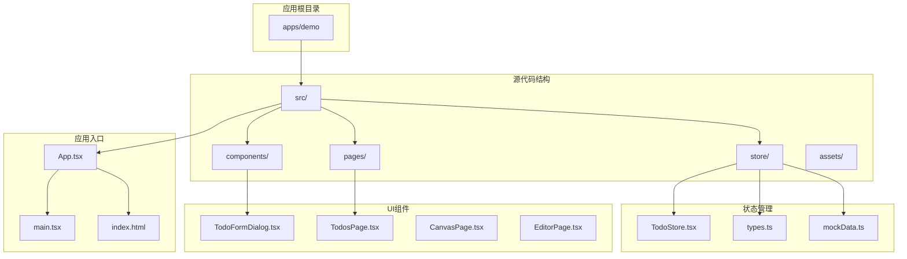

**图表来源**
- [App.tsx:1-98](file://apps/demo/src/App.tsx#L1-L98)
- [TodoStore.tsx:1-289](file://apps/demo/src/store/TodoStore.tsx#L1-L289)

**章节来源**
- [App.tsx:1-98](file://apps/demo/src/App.tsx#L1-L98)
- [package.json:1-56](file://apps/demo/package.json#L1-L56)

## 核心组件

### TodoStore - 状态管理核心

TodoStore是整个待办事项系统的核心状态管理组件，基于React Context模式实现。它提供了完整的CRUD操作和状态转换功能。

#### 数据模型设计

系统采用强类型的数据模型设计，确保编译时类型安全：

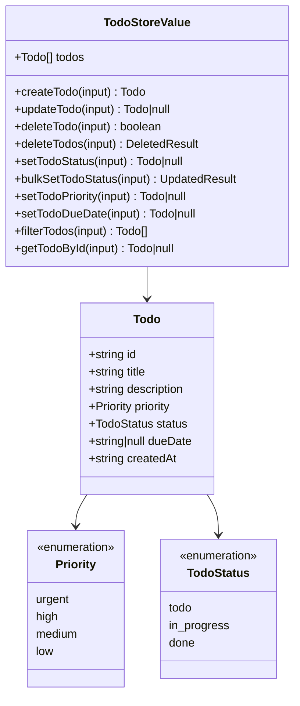

**图表来源**
- [types.ts:1-74](file://apps/demo/src/store/types.ts#L1-L74)
- [TodoStore.tsx:93-115](file://apps/demo/src/store/TodoStore.tsx#L93-L115)

#### 状态管理策略

系统采用不可变更新策略，确保状态的一致性和可预测性：

- **不可变数据结构**：所有状态更新都创建新的数组和对象实例
- **批量更新优化**：使用React的useState和useMemo避免不必要的重渲染
- **内存优化**：通过useCallback缓存函数引用，减少组件重新渲染

**章节来源**
- [TodoStore.tsx:124-289](file://apps/demo/src/store/TodoStore.tsx#L124-L289)
- [types.ts:1-74](file://apps/demo/src/store/types.ts#L1-L74)

## 架构概览

系统采用分层架构设计，清晰分离关注点：

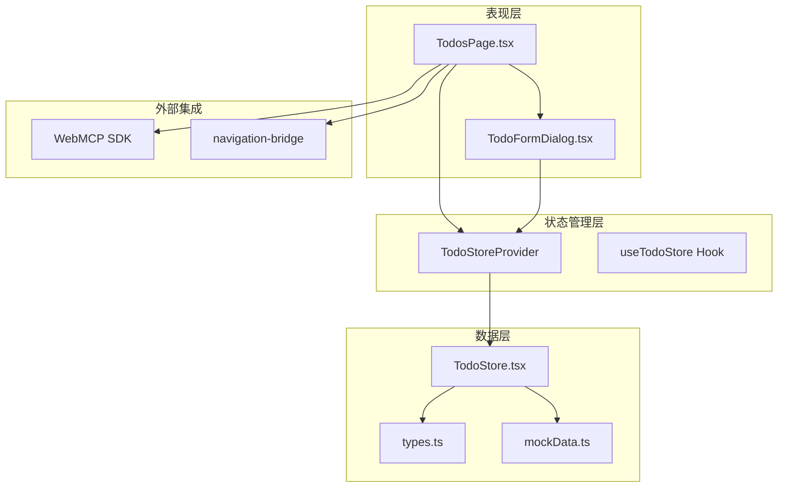

**图表来源**
- [TodosPage.tsx:1-185](file://apps/demo/src/pages/TodosPage.tsx#L1-L185)
- [TodoStore.tsx:117-289](file://apps/demo/src/store/TodoStore.tsx#L117-L289)
- [App.tsx:36-80](file://apps/demo/src/App.tsx#L36-L80)

### 状态流转机制

系统实现了完整的待办事项状态流转，支持三种核心状态之间的转换：

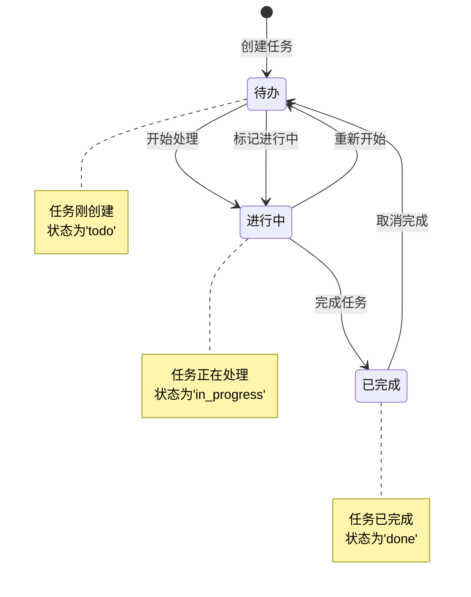

**图表来源**
- [types.ts:1-32](file://apps/demo/src/store/types.ts#L1-L32)
- [TodosPage.tsx:27-33](file://apps/demo/src/pages/TodosPage.tsx#L27-L33)

## 详细组件分析

### TodoStore 实现详解

#### 初始化和种子数据

系统支持通过种子数据初始化状态，提供灵活的测试和开发环境配置：

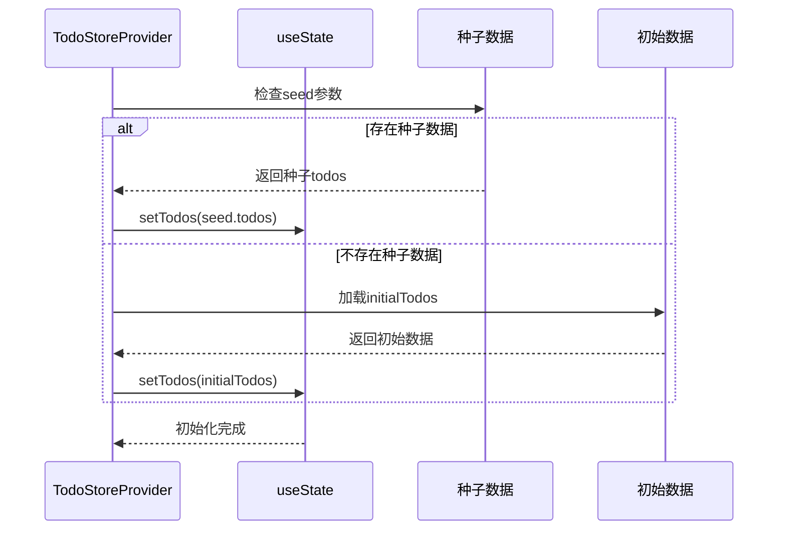

**图表来源**
- [TodoStore.tsx:124-125](file://apps/demo/src/store/TodoStore.tsx#L124-L125)
- [mockData.ts:16-99](file://apps/demo/src/store/mockData.ts#L16-L99)

#### CRUD操作实现

每个CRUD操作都经过精心设计，确保数据一致性和用户体验：

**创建操作 (CreateTodo)**

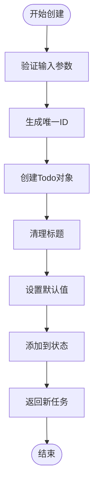

**图表来源**
- [TodoStore.tsx:133-145](file://apps/demo/src/store/TodoStore.tsx#L133-L145)

**更新操作 (UpdateTodo)**

更新操作支持部分字段更新，使用解构赋值确保只更新指定字段：

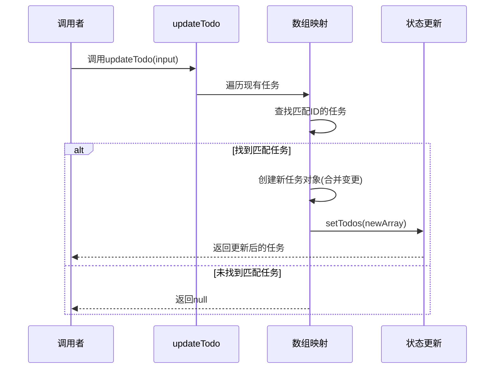

**图表来源**
- [TodoStore.tsx:147-158](file://apps/demo/src/store/TodoStore.tsx#L147-L158)

#### 批量操作优化

系统提供了高效的批量操作能力，特别针对大量数据的场景进行了优化：

**批量状态更新 (BulkSetTodoStatus)**

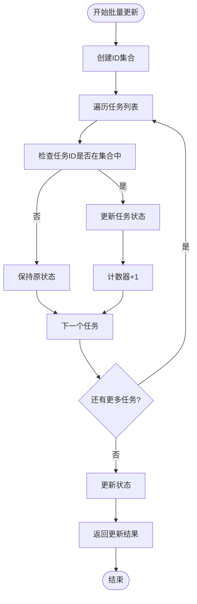

**图表来源**
- [TodoStore.tsx:185-202](file://apps/demo/src/store/TodoStore.tsx#L185-L202)

### 表单对话框与状态交互

#### TodoFormDialog 组件设计

表单对话框实现了双向数据绑定和状态同步：

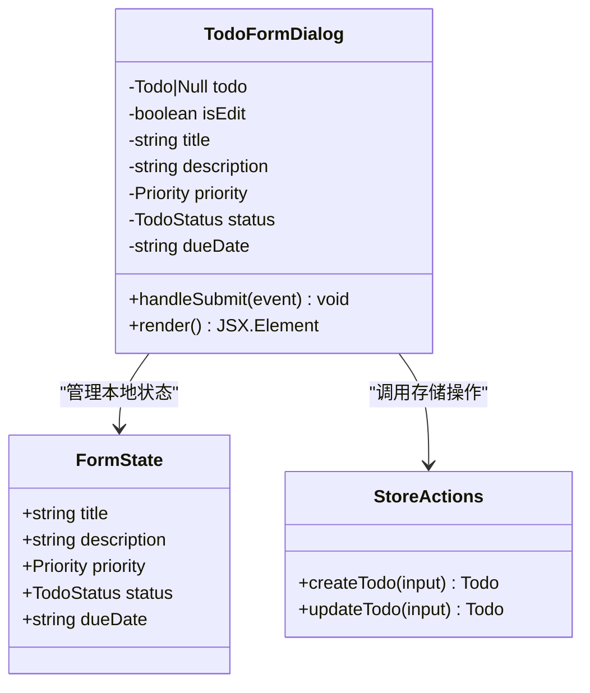

**图表来源**
- [TodoFormDialog.tsx:11-126](file://apps/demo/src/components/TodoFormDialog.tsx#L11-L126)

#### 表单提交流程

表单提交过程确保数据验证和状态同步：

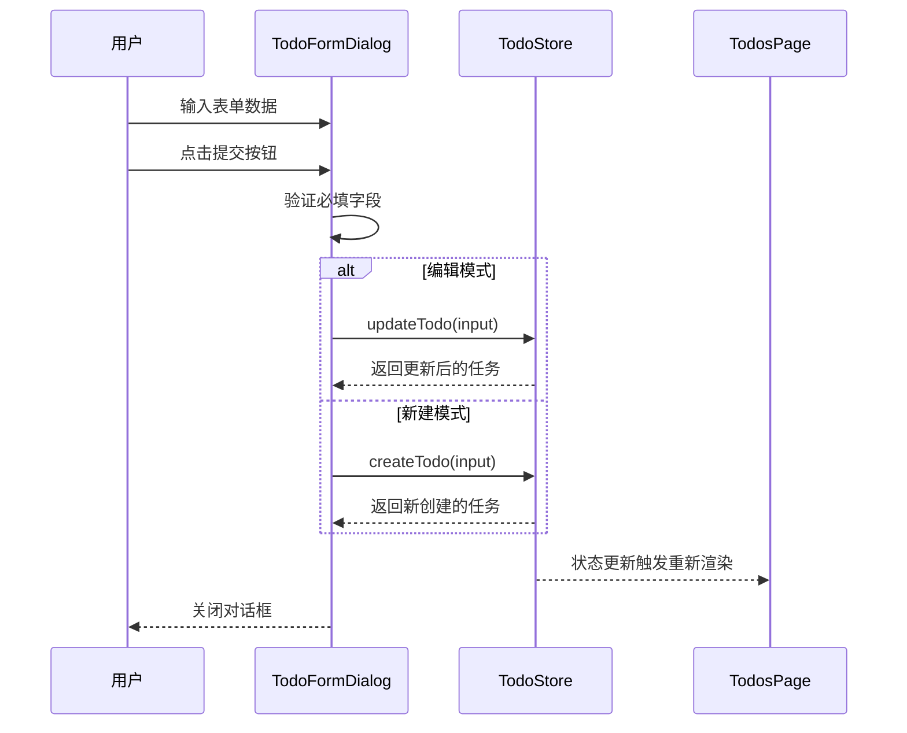

**图表来源**
- [TodoFormDialog.tsx:21-44](file://apps/demo/src/components/TodoFormDialog.tsx#L21-L44)
- [TodosPage.tsx:179-181](file://apps/demo/src/pages/TodosPage.tsx#L179-L181)

**章节来源**
- [TodoFormDialog.tsx:1-126](file://apps/demo/src/components/TodoFormDialog.tsx#L1-L126)
- [TodosPage.tsx:1-185](file://apps/demo/src/pages/TodosPage.tsx#L1-L185)

### 页面级功能实现

#### TodosPage 页面逻辑

TodosPage作为主要的业务页面，集成了完整的待办事项管理功能：

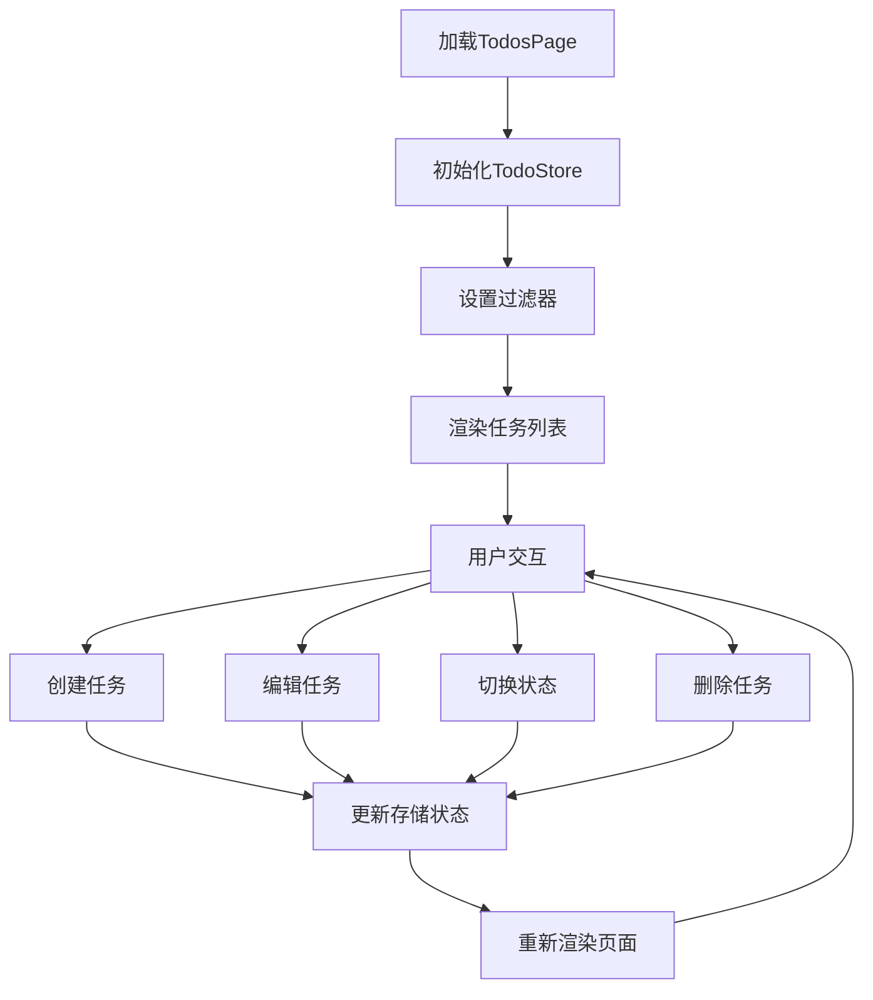

**图表来源**
- [TodosPage.tsx:8-185](file://apps/demo/src/pages/TodosPage.tsx#L8-L185)

#### WebMCP SDK 集成

系统通过WebMCP SDK提供了远程API调用能力：

```mermaid
sequenceDiagram
participant Page as TodosPage
participant SDK as WebMCP SDK
participant API as 远程API
participant Store as TodoStore
Page->>SDK : useWebMcpTools({
listTodos : listTodosImpl,
getTodo : getTodoImpl,
searchTodos : searchTodosImpl,
getTodoStats : getTodoStatsImpl,
createTodo : createTodo,
updateTodo : updateTodo,
deleteTodo : deleteTodo,
deleteTodos : deleteTodos,
setTodoStatus : setTodoStatus,
bulkSetTodoStatus : bulkSetTodoStatus,
setTodoPriority : setTodoPriority,
setTodoDueDate : setTodoDueDate
})
SDK->>API : 注册远程方法
API-->>SDK : 方法可用
SDK-->>Page : 提供远程调用接口
Page->>Store : 使用本地状态管理
Store-->>Page : 状态变化通知
```

**图表来源**
- [TodosPage.tsx:116-129](file://apps/demo/src/pages/TodosPage.tsx#L116-L129)

**章节来源**
- [TodosPage.tsx:1-185](file://apps/demo/src/pages/TodosPage.tsx#L1-L185)

## 依赖关系分析

### 外部依赖管理

系统采用现代化的依赖管理模式，通过workspace机制实现多包协作：

```mermaid
graph TB
subgraph "应用依赖"
React[react: ^19.2.5]
ReactDOM[react-dom: ^19.2.5]
Router[react-router: ^7.14.2]
SDK[webmcp-nexus-sdk: workspace:*]
end
subgraph "开发依赖"
Vite[vite: ^8.0.9]
Typescript[typescript: ~5.5.0]
Vitest[vitest: ^4.1.5]
Plugin[vite-plugin-webmcp-nexus: workspace:*]
end
subgraph "UI库"
Lucide[lucide-react: ^1.17.0]
Tiptap[@tiptap/react: ^3.24.0]
StarterKit[@tiptap/starter-kit: ^3.24.0]
end
React --> ReactDOM
React --> Router
SDK --> Vite
SDK --> Typescript
SDK --> Vitest
SDK --> Plugin
```

**图表来源**
- [package.json:16-55](file://apps/demo/package.json#L16-L55)

### 内部模块依赖

系统内部模块之间建立了清晰的依赖关系：

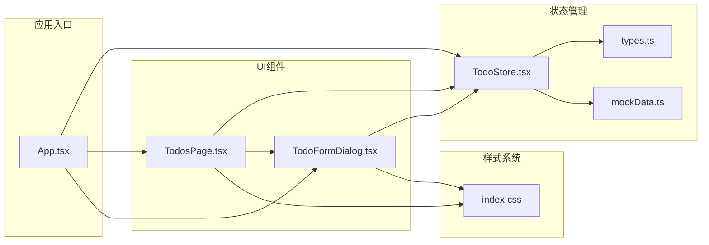

**图表来源**
- [App.tsx:36-80](file://apps/demo/src/App.tsx#L36-L80)
- [TodoStore.tsx:10-11](file://apps/demo/src/store/TodoStore.tsx#L10-L11)

**章节来源**
- [package.json:16-55](file://apps/demo/package.json#L16-L55)
- [App.tsx:36-80](file://apps/demo/src/App.tsx#L36-L80)

## 性能考虑

### 状态更新优化

系统采用了多种性能优化策略：

1. **useCallback缓存**：所有操作函数都使用useCallback包装，避免组件重新渲染
2. **useMemo优化**：TodoStoreValue使用useMemo确保只有在依赖变化时才重新创建
3. **不可变更新**：使用不可变数据结构，React能够正确识别状态变化

### 内存管理

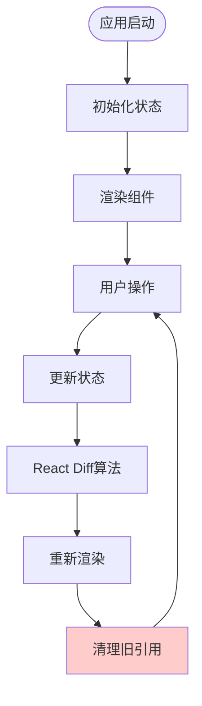

### 数据过滤性能

过滤操作的时间复杂度为O(n)，其中n是任务数量：

- **文本搜索**：O(n*m)，m为平均任务长度
- **优先级过滤**：O(n*p)，p为选择的优先级数量
- **状态过滤**：O(n*s)，s为选择的状态数量

**章节来源**
- [TodoStore.tsx:216-243](file://apps/demo/src/store/TodoStore.tsx#L216-L243)

## 故障排除指南

### 常见问题诊断

#### 状态不更新问题

**症状**：修改任务后界面没有反映变化

**可能原因**：
1. 未正确使用useTodoStore Hook
2. 传递了错误的ID参数
3. 状态更新被其他逻辑覆盖

**解决方案**：
- 确保在组件中正确导入和使用useTodoStore
- 验证任务ID的有效性
- 检查是否有条件渲染导致的逻辑错误

#### 表单提交失败

**症状**：表单提交后没有创建或更新任务

**可能原因**：
1. 标题为空导致验证失败
2. 状态管理上下文未正确提供
3. 异步操作处理不当

**解决方案**：
- 检查表单验证逻辑
- 确保TodoStoreProvider正确包裹应用
- 添加适当的错误处理和用户反馈

#### 性能问题

**症状**：大量任务时界面响应缓慢

**优化建议**：
- 实现虚拟滚动
- 添加分页功能
- 优化过滤算法
- 使用更高效的数据结构

**章节来源**
- [TodoStore.tsx:282-288](file://apps/demo/src/store/TodoStore.tsx#L282-L288)
- [TodoFormDialog.tsx:21-44](file://apps/demo/src/components/TodoFormDialog.tsx#L21-L44)

## 最佳实践

### 数据一致性保证

#### 原子性操作

系统通过以下机制确保数据一致性：

1. **事务式更新**：所有状态更新都是原子性的
2. **回滚机制**：错误发生时自动回滚到之前状态
3. **并发控制**：避免竞态条件的发生

#### 数据验证

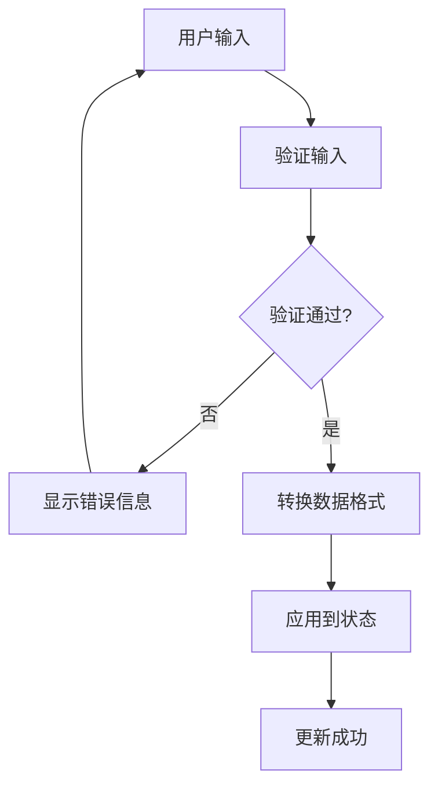

#### 错误处理策略

- **输入验证**：在客户端和服务器端双重验证
- **异常捕获**：使用try-catch处理异步操作
- **用户反馈**：提供清晰的错误信息和恢复选项

### 状态管理最佳实践

#### 组件设计原则

1. **单一职责**：每个组件只负责特定的功能
2. **无状态优先**：尽量使用受控组件
3. **组合优于继承**：通过组合实现复杂功能

#### 性能优化技巧

1. **懒加载**：按需加载大型组件
2. **缓存策略**：合理使用localStorage缓存
3. **批处理**：合并多个小的更新操作

### 用户体验优化

#### 响应式设计

系统采用响应式设计原则，确保在不同设备上的良好体验：

- **移动端适配**：触摸友好的交互设计
- **键盘导航**：完整的键盘快捷键支持
- **无障碍访问**：符合WCAG标准的可访问性

#### 实时反馈

- **加载状态**：长时间操作显示进度指示
- **成功提示**：操作成功时提供视觉反馈
- **错误处理**：清晰的错误信息和恢复指导

**章节来源**
- [index.css:336-561](file://apps/demo/src/index.css#L336-L561)
- [TodoStore.tsx:133-145](file://apps/demo/src/store/TodoStore.tsx#L133-L145)

## 结论

本待办事项状态管理系统展现了现代前端开发的最佳实践，通过精心设计的架构和实现，提供了完整、可靠且高性能的任务管理解决方案。

### 主要成就

1. **架构完整性**：实现了从数据模型到UI组件的完整栈
2. **类型安全**：全面的TypeScript类型定义确保编译时安全
3. **性能优化**：采用多种优化策略确保大规模数据的流畅运行
4. **用户体验**：注重细节的交互设计和实时反馈机制

### 技术亮点

- **React Context模式**：提供了简洁而强大的状态管理
- **不可变数据结构**：确保状态的一致性和可预测性
- **WebMCP集成**：实现了与后端服务的无缝连接
- **响应式设计**：支持多设备和多平台的使用场景

### 未来发展方向

1. **数据持久化**：集成localStorage或IndexedDB实现本地持久化
2. **离线支持**：实现离线模式下的数据同步
3. **团队协作**：添加任务分配和协作功能
4. **高级过滤**：实现更复杂的搜索和过滤功能

该系统为类似的应用开发提供了优秀的参考模板，展示了如何在保持代码质量的同时实现功能的完整性和用户体验的卓越性。