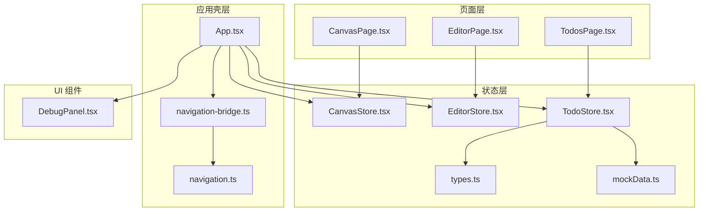
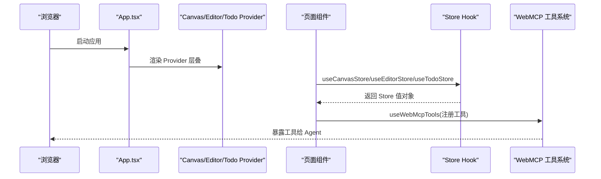
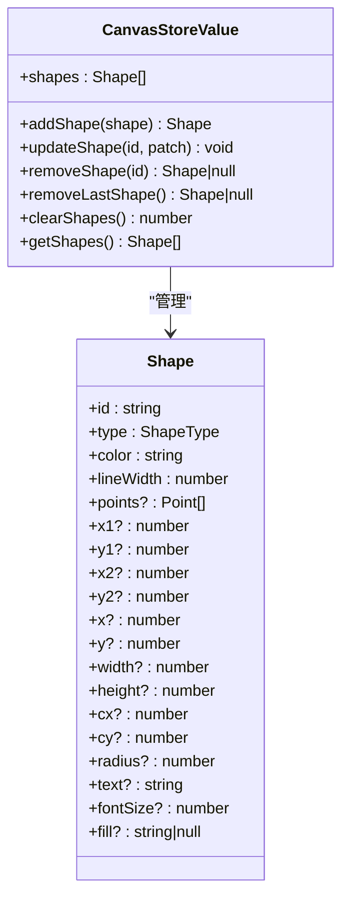
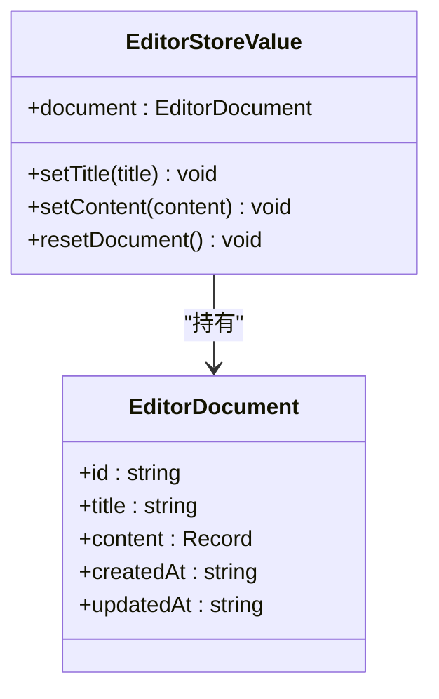
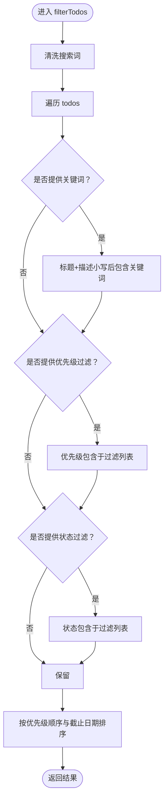
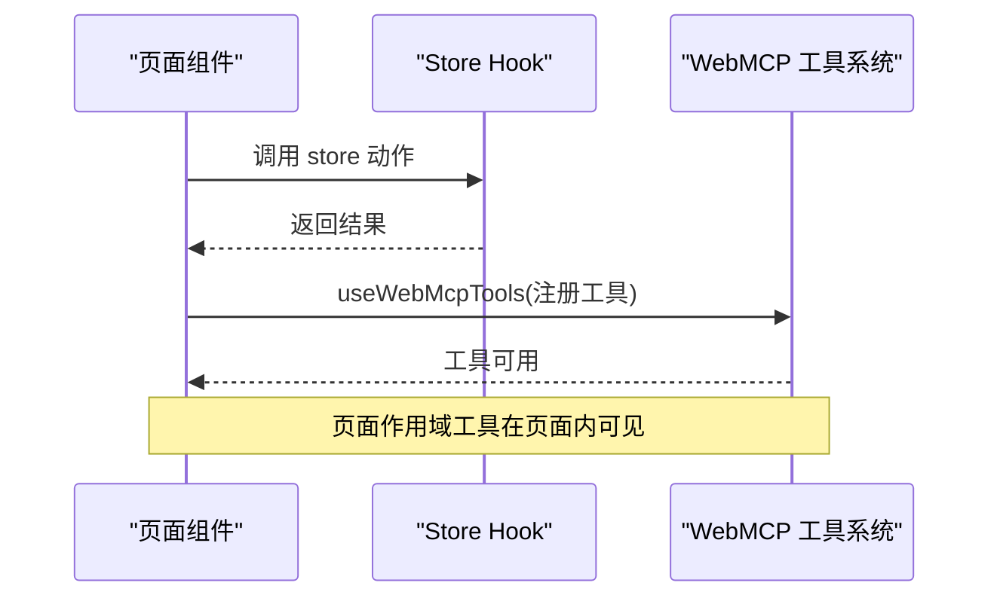
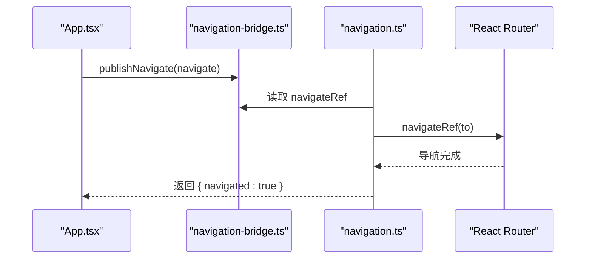
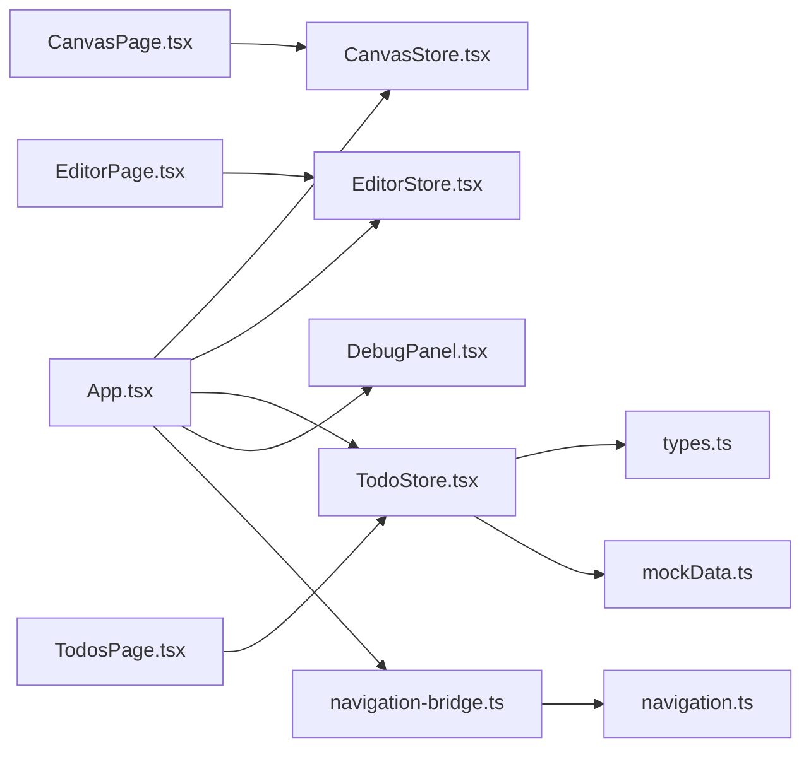

# 状态管理

<cite>
**本文引用的文件**
- [CanvasStore.tsx](file://apps/demo/src/store/CanvasStore.tsx)
- [EditorStore.tsx](file://apps/demo/src/store/EditorStore.tsx)
- [TodoStore.tsx](file://apps/demo/src/store/TodoStore.tsx)
- [types.ts](file://apps/demo/src/store/types.ts)
- [mockData.ts](file://apps/demo/src/store/mockData.ts)
- [App.tsx](file://apps/demo/src/App.tsx)
- [CanvasPage.tsx](file://apps/demo/src/pages/CanvasPage.tsx)
- [EditorPage.tsx](file://apps/demo/src/pages/EditorPage.tsx)
- [TodosPage.tsx](file://apps/demo/src/pages/TodosPage.tsx)
- [navigation-bridge.ts](file://apps/demo/src/tools/navigation-bridge.ts)
- [navigation.ts](file://apps/demo/src/tools/navigation.ts)
- [DebugPanel.tsx](file://apps/demo/src/components/DebugPanel.tsx)
</cite>

## 目录
1. [简介](#简介)
2. [项目结构](#项目结构)
3. [核心组件](#核心组件)
4. [架构总览](#架构总览)
5. [详细组件分析](#详细组件分析)
6. [依赖关系分析](#依赖关系分析)
7. [性能考量](#性能考量)
8. [故障排查指南](#故障排查指南)
9. [结论](#结论)
10. [附录](#附录)

## 简介
本文件系统化解析演示应用的状态管理模式与实现方案，重点覆盖以下方面：
- CanvasStore、EditorStore、TodoStore 的设计思路与使用方法
- 全局状态与局部状态的划分原则
- 工具函数的注册与调用机制（基于 WebMCP 工具体系）
- 导航桥接工具的实现原理
- 最佳实践与性能优化建议

该演示应用采用 React Context + 自定义 Hook 的轻量状态管理模式，并通过 WebMCP 工具框架将页面内的业务能力暴露给外部模型代理（Agent），实现“人类通过界面操作，AI 通过工具调用”的等价能力。

## 项目结构
应用采用按功能域组织的目录结构，核心状态管理位于 apps/demo/src/store，页面组件位于 apps/demo/src/pages，工具函数位于 apps/demo/src/tools，UI 组件位于 apps/demo/src/components。

图表来源
- [App.tsx:37-79](file://apps/demo/src/App.tsx#L37-L79)
- [CanvasStore.tsx:24-86](file://apps/demo/src/store/CanvasStore.tsx#L24-L86)
- [EditorStore.tsx:83-107](file://apps/demo/src/store/EditorStore.tsx#L83-L107)
- [TodoStore.tsx:124-279](file://apps/demo/src/store/TodoStore.tsx#L124-L279)
- [navigation-bridge.ts:1-8](file://apps/demo/src/tools/navigation-bridge.ts#L1-L8)
- [navigation.ts:1-14](file://apps/demo/src/tools/navigation.ts#L1-L14)
- [CanvasPage.tsx:8-452](file://apps/demo/src/pages/CanvasPage.tsx#L8-L452)
- [EditorPage.tsx:8-558](file://apps/demo/src/pages/EditorPage.tsx#L8-L558)
- [TodosPage.tsx:8-184](file://apps/demo/src/pages/TodosPage.tsx#L8-L184)
- [types.ts:1-58](file://apps/demo/src/store/types.ts#L1-L58)
- [mockData.ts:1-99](file://apps/demo/src/store/mockData.ts#L1-L99)
- [DebugPanel.tsx:97-393](file://apps/demo/src/components/DebugPanel.tsx#L97-L393)

章节来源
- [App.tsx:37-79](file://apps/demo/src/App.tsx#L37-L79)

## 核心组件
本节概述三个核心 Store 的职责边界、数据结构与对外接口。

- CanvasStore：负责画布图形集合的增删改查与批量操作，提供绘制、移动、样式更新、撤销、清空等能力。
- EditorStore：负责富文本编辑器文档的标题、内容与元信息，提供标题设置、内容重置、文档查询等能力。
- TodoStore：负责待办事项集合的创建、更新、删除、批量操作、过滤排序与统计，提供搜索、筛选、优先级与状态管理等能力。

章节来源
- [CanvasStore.tsx:12-20](file://apps/demo/src/store/CanvasStore.tsx#L12-L20)
- [EditorStore.tsx:18-23](file://apps/demo/src/store/EditorStore.tsx#L18-L23)
- [TodoStore.tsx:93-115](file://apps/demo/src/store/TodoStore.tsx#L93-L115)

## 架构总览
应用通过 Provider 层叠提供全局状态上下文，页面组件通过自定义 Hook 访问对应 Store。工具函数通过 useWebMcpTools 注册到 WebMCP 工具系统，供外部 Agent 调用。

图表来源
- [App.tsx:37-79](file://apps/demo/src/App.tsx#L37-L79)
- [CanvasPage.tsx:415-432](file://apps/demo/src/pages/CanvasPage.tsx#L415-L432)
- [EditorPage.tsx:522-546](file://apps/demo/src/pages/EditorPage.tsx#L522-L546)
- [TodosPage.tsx:116-129](file://apps/demo/src/pages/TodosPage.tsx#L116-L129)

## 详细组件分析

### CanvasStore 设计与使用
CanvasStore 提供画布图形的全生命周期管理，包括：
- 形状集合的持久化存储与不可变更新
- 形状 ID 生成策略（时间戳 + 自增序号）
- 增删改查与批量操作（撤销、清空）
- 只读查询（获取形状列表、统计）

实现要点：
- 使用 useState 存储 shapes，通过不可变更新保证渲染一致性
- 使用 useCallback 包裹每个动作以减少子组件重渲染
- 使用 useMemo 包裹 value 对象，避免每次渲染都产生新的引用
- 通过 nextId 生成稳定且唯一的形状 ID

图表来源
- [CanvasStore.tsx:12-20](file://apps/demo/src/store/CanvasStore.tsx#L12-L20)
- [types.ts:34-58](file://apps/demo/src/store/types.ts#L34-L58)

章节来源
- [CanvasStore.tsx:24-86](file://apps/demo/src/store/CanvasStore.tsx#L24-L86)
- [types.ts:34-58](file://apps/demo/src/store/types.ts#L34-L58)

### EditorStore 设计与使用
EditorStore 管理富文本编辑器文档的标题、内容与时间戳，提供：
- 文档初始化与重置
- 标题与内容的更新
- 只读查询（文档内容、统计、大纲）

实现要点：
- 使用 useState 初始化文档，包含 id、title、content、createdAt、updatedAt
- 通过 useCallback 包裹动作，确保引用稳定
- 通过 useMemo 包裹 value 对象，避免不必要的重渲染
- 初始内容来自常量模板，便于演示

图表来源
- [EditorStore.tsx:18-23](file://apps/demo/src/store/EditorStore.tsx#L18-L23)
- [EditorStore.tsx:10-16](file://apps/demo/src/store/EditorStore.tsx#L10-L16)

章节来源
- [EditorStore.tsx:83-107](file://apps/demo/src/store/EditorStore.tsx#L83-L107)

### TodoStore 设计与使用
TodoStore 管理待办事项集合，提供：
- 创建、更新、删除、批量删除
- 状态与优先级变更
- 过滤与排序（关键词、优先级、状态）
- 统计与详情查询

实现要点：
- 使用 useState 管理 todos，初始数据来自 mockData
- 通过 nextId 生成唯一 ID
- 过滤与排序逻辑集中在一个 useCallback 中，利用依赖数组控制重算
- 提供多种输入参数类型（CreateTodoInput、UpdateTodoInput 等）以约束工具签名

图表来源
- [TodoStore.tsx:216-243](file://apps/demo/src/store/TodoStore.tsx#L216-L243)
- [types.ts:14-19](file://apps/demo/src/store/types.ts#L14-L19)

章节来源
- [TodoStore.tsx:124-279](file://apps/demo/src/store/TodoStore.tsx#L124-L279)
- [mockData.ts:16-98](file://apps/demo/src/store/mockData.ts#L16-L98)

### 页面与 Store 的交互
页面组件通过 useWebMcpTools 将本地方法注册为工具，使 Agent 可以远程调用。例如：
- CanvasPage 注册绘制、移动、删除、导出等工具
- EditorPage 注册内容查询、插入、格式化、替换等工具
- TodosPage 注册列表、搜索、统计、状态/优先级变更等工具

图表来源
- [CanvasPage.tsx:415-432](file://apps/demo/src/pages/CanvasPage.tsx#L415-L432)
- [EditorPage.tsx:522-546](file://apps/demo/src/pages/EditorPage.tsx#L522-L546)
- [TodosPage.tsx:116-129](file://apps/demo/src/pages/TodosPage.tsx#L116-L129)

章节来源
- [CanvasPage.tsx:8-452](file://apps/demo/src/pages/CanvasPage.tsx#L8-L452)
- [EditorPage.tsx:8-558](file://apps/demo/src/pages/EditorPage.tsx#L8-L558)
- [TodosPage.tsx:8-184](file://apps/demo/src/pages/TodosPage.tsx#L8-L184)

### 导航桥接工具实现原理
导航桥接通过两个模块协作：
- navigation-bridge.ts：维护全局的 NavigateFunction 引用
- navigation.ts：提供统一的导航工具函数，内部调用 navigateRef

工作流：
- App.tsx 中的 NavigateBridge 组件在路由初始化时将 useNavigate 的函数句柄发布到 bridge
- 页面或工具通过 navigation.ts 的 navigate(to) 调用，内部转发至 navigateRef

图表来源
- [App.tsx:12-19](file://apps/demo/src/App.tsx#L12-L19)
- [navigation-bridge.ts:3-7](file://apps/demo/src/tools/navigation-bridge.ts#L3-L7)
- [navigation.ts:6-13](file://apps/demo/src/tools/navigation.ts#L6-L13)

章节来源
- [App.tsx:12-19](file://apps/demo/src/App.tsx#L12-L19)
- [navigation-bridge.ts:1-8](file://apps/demo/src/tools/navigation-bridge.ts#L1-L8)
- [navigation.ts:1-14](file://apps/demo/src/tools/navigation.ts#L1-L14)

## 依赖关系分析
- Store 间无直接耦合，均通过各自 Context 提供独立状态空间
- 页面组件依赖对应 Store Hook，同时通过 WebMCP 工具系统暴露能力
- App.tsx 作为壳层，负责 Provider 层叠与导航桥接
- DebugPanel 通过 navigator.modelContext 接口读取工具清单，实现调试面板

图表来源
- [App.tsx:37-79](file://apps/demo/src/App.tsx#L37-L79)
- [CanvasStore.tsx:24-86](file://apps/demo/src/store/CanvasStore.tsx#L24-L86)
- [EditorStore.tsx:83-107](file://apps/demo/src/store/EditorStore.tsx#L83-L107)
- [TodoStore.tsx:124-279](file://apps/demo/src/store/TodoStore.tsx#L124-L279)
- [types.ts:1-58](file://apps/demo/src/store/types.ts#L1-L58)
- [mockData.ts:1-99](file://apps/demo/src/store/mockData.ts#L1-L99)
- [DebugPanel.tsx:97-393](file://apps/demo/src/components/DebugPanel.tsx#L97-L393)
- [navigation-bridge.ts:1-8](file://apps/demo/src/tools/navigation-bridge.ts#L1-L8)
- [navigation.ts:1-14](file://apps/demo/src/tools/navigation.ts#L1-L14)

章节来源
- [App.tsx:37-79](file://apps/demo/src/App.tsx#L37-L79)

## 性能考量
- 使用 useCallback 包裹动作函数，避免子组件因引用变化而重渲染
- 使用 useMemo 包裹 value 对象，减少 Provider 的重新渲染
- 过滤与排序逻辑集中在单一 useCallback 中，依赖数组精确控制重算范围
- 通过 nextId 生成稳定的 ID，避免因随机字符串导致的不必要重渲染
- 导航桥接使用全局引用，避免重复订阅带来的性能损耗

[本节提供通用指导，无需特定文件来源]

## 故障排查指南
- useXxxStore 抛出错误：确保在对应的 Provider 下使用 Hook
  - 参考：[CanvasStore.tsx:89-93](file://apps/demo/src/store/CanvasStore.tsx#L89-L93)、[EditorStore.tsx:110-114](file://apps/demo/src/store/EditorStore.tsx#L110-L114)、[TodoStore.tsx:282-288](file://apps/demo/src/store/TodoStore.tsx#L282-L288)
- 导航无效：检查 App.tsx 中 NavigateBridge 是否正确发布 navigateRef
  - 参考：[App.tsx:12-19](file://apps/demo/src/App.tsx#L12-L19)
- 工具未出现在调试面板：确认页面已调用 useWebMcpTools 注册工具
  - 参考：[CanvasPage.tsx:415-432](file://apps/demo/src/pages/CanvasPage.tsx#L415-L432)、[EditorPage.tsx:522-546](file://apps/demo/src/pages/EditorPage.tsx#L522-L546)、[TodosPage.tsx:116-129](file://apps/demo/src/pages/TodosPage.tsx#L116-L129)
- 过滤/排序异常：检查 filterTodos 的依赖数组与输入参数
  - 参考：[TodoStore.tsx:216-243](file://apps/demo/src/store/TodoStore.tsx#L216-L243)

章节来源
- [CanvasStore.tsx:89-93](file://apps/demo/src/store/CanvasStore.tsx#L89-L93)
- [EditorStore.tsx:110-114](file://apps/demo/src/store/EditorStore.tsx#L110-L114)
- [TodoStore.tsx:282-288](file://apps/demo/src/store/TodoStore.tsx#L282-L288)
- [App.tsx:12-19](file://apps/demo/src/App.tsx#L12-L19)
- [CanvasPage.tsx:415-432](file://apps/demo/src/pages/CanvasPage.tsx#L415-L432)
- [EditorPage.tsx:522-546](file://apps/demo/src/pages/EditorPage.tsx#L522-L546)
- [TodosPage.tsx:116-129](file://apps/demo/src/pages/TodosPage.tsx#L116-L129)
- [TodoStore.tsx:216-243](file://apps/demo/src/store/TodoStore.tsx#L216-L243)

## 结论
该演示应用采用轻量、清晰的状态管理模式：
- CanvasStore、EditorStore、TodoStore 各司其职，通过 Context 提供独立状态空间
- 页面通过 useWebMcpTools 将本地能力暴露为工具，实现人机等价的能力边界
- 导航桥接通过全局引用实现跨组件的路由跳转
- 通过 useCallback、useMemo 等手段优化渲染性能
- 建议在大型场景中引入更细粒度的拆分与缓存策略，以进一步提升可维护性与性能

[本节为总结性内容，无需特定文件来源]

## 附录
- 全局状态与局部状态划分原则
  - 全局状态：跨页面共享的数据与行为（如导航、全局配置）
  - 局部状态：仅在特定页面或组件内使用的数据（如画布图形、编辑器文档、待办列表）
  - 划分依据：数据访问范围、更新频率与影响面
- 工具函数注册与调用机制
  - 页面组件在渲染时调用 useWebMcpTools，将本地方法注册为工具
  - 工具描述中包含作用域标记（全局/页面/组件），便于调试面板分类
  - 调试面板通过 navigator.modelContext 接口读取工具清单并执行
- 最佳实践
  - 保持动作函数的引用稳定性，减少子组件重渲染
  - 合理拆分过滤与排序逻辑，明确依赖数组
  - 使用类型安全的输入参数类型，降低调用风险
  - 通过 Provider 层叠隔离状态，避免跨域污染

[本节为通用指导，无需特定文件来源]