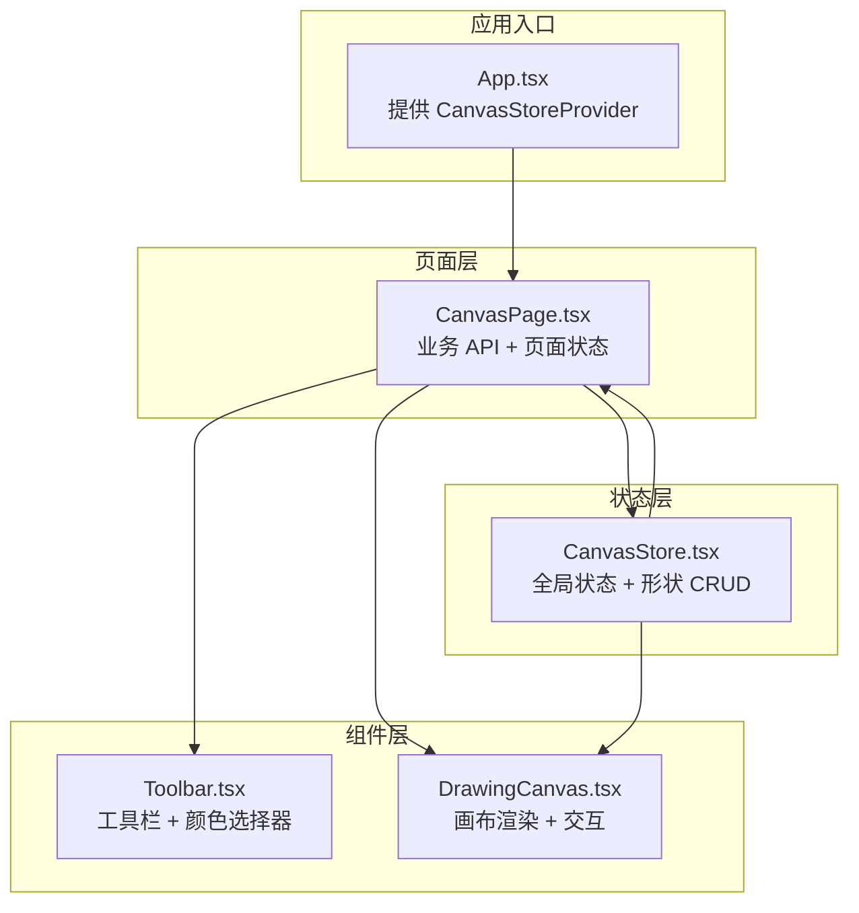
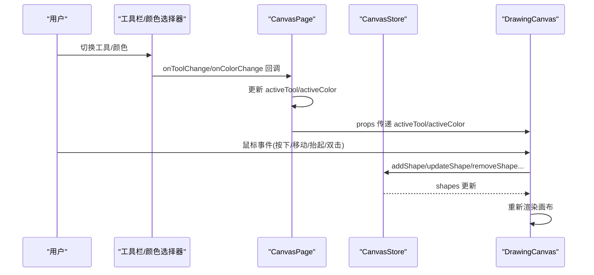
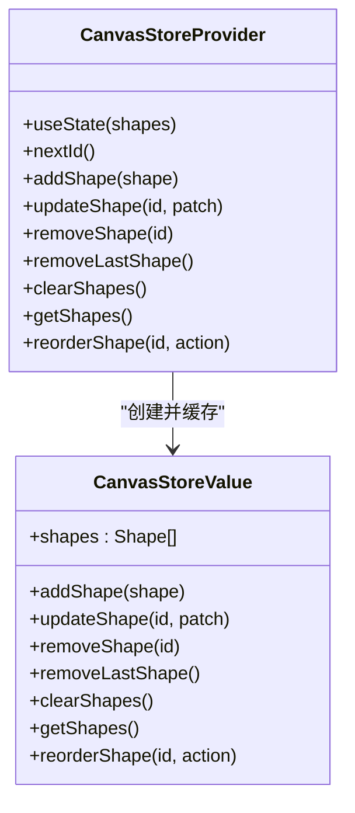
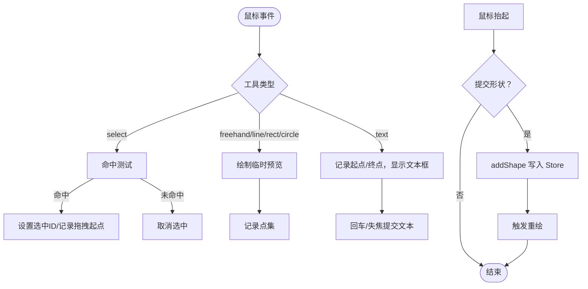
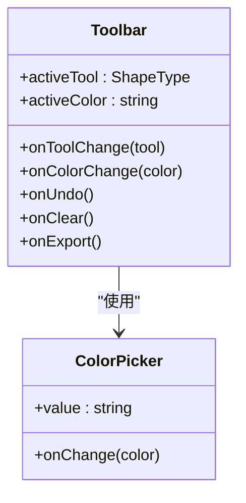
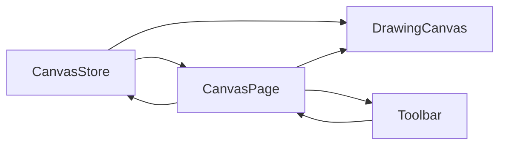

# 画布状态管理

<cite>
**本文引用的文件**
- [CanvasStore.tsx](file://apps/demo/src/store/CanvasStore.tsx)
- [DrawingCanvas.tsx](file://apps/demo/src/components/canvas/DrawingCanvas.tsx)
- [ColorPicker.tsx](file://apps/demo/src/components/canvas/ColorPicker.tsx)
- [Toolbar.tsx](file://apps/demo/src/components/canvas/Toolbar.tsx)
- [CanvasPage.tsx](file://apps/demo/src/pages/CanvasPage.tsx)
- [types.ts](file://apps/demo/src/store/types.ts)
- [App.tsx](file://apps/demo/src/App.tsx)
</cite>

## 目录
1. [简介](#简介)
2. [项目结构](#项目结构)
3. [核心组件](#核心组件)
4. [架构总览](#架构总览)
5. [详细组件分析](#详细组件分析)
6. [依赖关系分析](#依赖关系分析)
7. [性能考量](#性能考量)
8. [故障排查指南](#故障排查指南)
9. [结论](#结论)
10. [附录](#附录)

## 简介
本文件聚焦于“画布状态管理”的设计与实现，围绕 CanvasStore 的架构与 Canvas 组件的状态同步机制展开，涵盖画笔状态、颜色选择、绘图操作、事件处理流程以及与颜色选择器、工具栏等子组件的交互方式，并提供最佳实践与性能优化建议。读者可据此理解从用户交互到画布渲染的完整链路，以及如何在多组件间保持状态一致性与可维护性。

## 项目结构
本项目采用按功能模块组织的前端结构，画布相关代码集中在 demo 应用内：
- store 层：集中管理全局状态（CanvasStore）
- components 层：画布组件（DrawingCanvas）、工具栏（Toolbar）、颜色选择器（ColorPicker）
- pages 层：页面容器（CanvasPage），负责业务 API 暴露与状态协调
- App 入口：通过 Provider 包裹各 Store，建立上下文

图表来源
- [App.tsx:37-79](file://apps/demo/src/App.tsx#L37-L79)
- [CanvasPage.tsx:434-452](file://apps/demo/src/pages/CanvasPage.tsx#L434-L452)
- [CanvasStore.tsx:27-139](file://apps/demo/src/store/CanvasStore.tsx#L27-L139)

章节来源
- [App.tsx:1-98](file://apps/demo/src/App.tsx#L1-L98)
- [CanvasPage.tsx:1-453](file://apps/demo/src/pages/CanvasPage.tsx#L1-L453)

## 核心组件
- CanvasStore：提供形状集合的增删改查、重排等能力，暴露给子组件与页面层使用
- DrawingCanvas：负责画布渲染、命中测试、拖拽、临时预览绘制等交互逻辑
- Toolbar：提供工具切换、撤销、清空、导出、颜色选择等入口
- ColorPicker：提供颜色选择面板与回调
- CanvasPage：页面级状态与业务 API 暴露，连接 Store 与组件

章节来源
- [CanvasStore.tsx:14-146](file://apps/demo/src/store/CanvasStore.tsx#L14-L146)
- [DrawingCanvas.tsx:233-608](file://apps/demo/src/components/canvas/DrawingCanvas.tsx#L233-L608)
- [Toolbar.tsx:23-76](file://apps/demo/src/components/canvas/Toolbar.tsx#L23-L76)
- [ColorPicker.tsx:14-42](file://apps/demo/src/components/canvas/ColorPicker.tsx#L14-L42)
- [CanvasPage.tsx:8-453](file://apps/demo/src/pages/CanvasPage.tsx#L8-L453)

## 架构总览
CanvasStore 作为全局状态源，通过 React Context 提供给 DrawingCanvas 和 CanvasPage 使用。Toolbar 与 ColorPicker 作为 UI 控件，通过回调改变页面级状态（如 activeTool、activeColor），进而驱动 DrawingCanvas 的渲染与交互行为。CanvasPage 还封装了丰富的业务 API，便于外部系统或 Agent 调用。

图表来源
- [Toolbar.tsx:23-76](file://apps/demo/src/components/canvas/Toolbar.tsx#L23-L76)
- [CanvasPage.tsx:434-452](file://apps/demo/src/pages/CanvasPage.tsx#L434-L452)
- [CanvasStore.tsx:27-139](file://apps/demo/src/store/CanvasStore.tsx#L27-L139)
- [DrawingCanvas.tsx:233-608](file://apps/demo/src/components/canvas/DrawingCanvas.tsx#L233-L608)

## 详细组件分析

### CanvasStore 设计与实现
- 上下文与提供者
  - 使用 React Context 暴露 CanvasStoreValue，包含 shapes 与一组操作函数
  - 通过 useMemo 缓存 value，减少不必要的重渲染
- 形状管理
  - addShape：生成唯一 id 并追加新形状
  - updateShape：按 id 部分更新形状属性
  - removeShape/removeLastShape：按 id 或末尾删除
  - clearShapes：清空并返回计数
  - getShapes：读取当前形状列表
  - reorderShape：支持置顶、置底、前移、后移
- 性能与稳定性
  - 所有操作均基于不可变更新（map/slice/spread），保证状态一致性
  - id 生成策略结合时间戳与自增计数，降低冲突概率

图表来源
- [CanvasStore.tsx:14-146](file://apps/demo/src/store/CanvasStore.tsx#L14-L146)

章节来源
- [CanvasStore.tsx:14-146](file://apps/demo/src/store/CanvasStore.tsx#L14-L146)

### DrawingCanvas 交互与渲染
- 状态与生命周期
  - 内部维护 isDrawing、currentPoints、startPoint、textInput、selectedId、dragStart/dragOffset 等
  - 通过 ResizeObserver 自适应画布尺寸，考虑 devicePixelRatio 以提升清晰度
- 渲染管线
  - drawShapesRef：遍历 shapes，根据是否选中与拖拽状态决定是否平移绘制
  - renderShape：按形状类型绘制（freehand/line/rect/roundRect/circle/ellipse/text）
  - 文本测量：使用隐藏 canvas 计算行高与宽度，支持换行与对齐
- 命中测试与拖拽
  - hitTest：针对不同形状计算点击命中区域
  - moveShape：根据形状类型计算平移后的属性
- 临时预览与文本编辑
  - 绘制过程中根据 activeTool 实时绘制预览（freehand/line/rect/circle/text）
  - 双击文本形状进入编辑模式，弹出 textarea 输入框，回车确认提交

图表来源
- [DrawingCanvas.tsx:233-608](file://apps/demo/src/components/canvas/DrawingCanvas.tsx#L233-L608)

章节来源
- [DrawingCanvas.tsx:233-608](file://apps/demo/src/components/canvas/DrawingCanvas.tsx#L233-L608)

### Toolbar 与 ColorPicker 子组件
- Toolbar
  - 提供工具切换按钮（select/freehand/line/rect/circle/text）
  - 提供撤销、清空、导出等操作入口
  - 通过 ColorPicker 接收颜色变更回调
- ColorPicker
  - 预设颜色面板，支持点击切换当前颜色
  - 开关面板状态，点击外部可关闭

图表来源
- [Toolbar.tsx:23-76](file://apps/demo/src/components/canvas/Toolbar.tsx#L23-L76)
- [ColorPicker.tsx:14-42](file://apps/demo/src/components/canvas/ColorPicker.tsx#L14-L42)

章节来源
- [Toolbar.tsx:23-76](file://apps/demo/src/components/canvas/Toolbar.tsx#L23-L76)
- [ColorPicker.tsx:14-42](file://apps/demo/src/components/canvas/ColorPicker.tsx#L14-L42)

### CanvasPage：页面级状态与业务 API
- 页面级状态
  - activeTool、activeColor、lineWidth（固定值）
- 业务 API（通过 useWebMcpTools 暴露）
  - 绘图类：drawFreehand、drawLine、drawRect、drawCircle、drawText
  - 管理类：undo、clearCanvas、deleteShape、moveShape、updateShapeStyle、updateText
  - 查询类：getCanvasInfo、getCanvasShapes、getCanvasSize、getCanvasSnapshot、exportCanvas
- 与组件协作
  - 将 activeTool/activeColor 传递给 DrawingCanvas
  - 将 onUndo/onClear/onExport 传递给 Toolbar

章节来源
- [CanvasPage.tsx:8-453](file://apps/demo/src/pages/CanvasPage.tsx#L8-L453)

### 数据模型与类型定义
- ShapeType：支持 select/freehand/line/rect/circle/ellipse/roundRect/text
- Shape：统一描述各形状的几何与样式字段，包含 id、type、color、lineWidth、几何参数、文本与排版参数、填充等
- TextAlign：文本对齐方式

章节来源
- [types.ts:34-74](file://apps/demo/src/store/types.ts#L34-L74)

## 依赖关系分析
- 组件耦合
  - DrawingCanvas 依赖 CanvasStore 的 shapes 与写入方法，内部状态与 Store 状态双向影响
  - Toolbar/ColorPicker 仅通过回调影响页面级状态，不直接访问 Store
  - CanvasPage 作为协调者，聚合 Store 与 UI，同时暴露业务 API
- 外部依赖
  - Canvas API：用于绘制与截图
  - ResizeObserver：监听容器尺寸变化
  - devicePixelRatio：适配高分屏

图表来源
- [CanvasStore.tsx:27-139](file://apps/demo/src/store/CanvasStore.tsx#L27-L139)
- [DrawingCanvas.tsx:233-608](file://apps/demo/src/components/canvas/DrawingCanvas.tsx#L233-L608)
- [CanvasPage.tsx:434-452](file://apps/demo/src/pages/CanvasPage.tsx#L434-L452)
- [Toolbar.tsx:23-76](file://apps/demo/src/components/canvas/Toolbar.tsx#L23-L76)

章节来源
- [CanvasStore.tsx:27-139](file://apps/demo/src/store/CanvasStore.tsx#L27-L139)
- [DrawingCanvas.tsx:233-608](file://apps/demo/src/components/canvas/DrawingCanvas.tsx#L233-L608)
- [CanvasPage.tsx:434-452](file://apps/demo/src/pages/CanvasPage.tsx#L434-L452)
- [Toolbar.tsx:23-76](file://apps/demo/src/components/canvas/Toolbar.tsx#L23-L76)

## 性能考量
- 渲染优化
  - 使用 useRef(drawShapesRef) 缓存渲染函数，避免每次渲染都创建闭包
  - 仅在 shapes、selectedId、activeTool、dragOffset、isDrawing 等关键状态变化时重绘
  - devicePixelRatio 设置与 CSS 尺寸分离，避免重复缩放
- 交互优化
  - 临时预览绘制仅在 isDrawing 期间进行，减少无效绘制
  - 命中测试按形状类型分支，避免全量扫描
- 文本测量
  - 使用单例隐藏 canvas 进行文本测量，避免频繁创建上下文
- 状态更新
  - 所有更新采用不可变策略，配合 useMemo 缓存 value，降低重渲染成本

章节来源
- [DrawingCanvas.tsx:255-339](file://apps/demo/src/components/canvas/DrawingCanvas.tsx#L255-L339)
- [DrawingCanvas.tsx:341-398](file://apps/demo/src/components/canvas/DrawingCanvas.tsx#L341-L398)
- [CanvasStore.tsx:111-132](file://apps/demo/src/store/CanvasStore.tsx#L111-L132)

## 故障排查指南
- 无法绘制形状
  - 检查 activeTool 是否正确传递至 DrawingCanvas
  - 确认 isDrawing 状态与鼠标事件链路（mousedown/mousemove/mouseup）
- 选中/拖拽异常
  - 确认 hitTest 对应形状类型的命中逻辑
  - 检查 selectedId 与 dragOffset 的更新时机
- 文本编辑无响应
  - 确认双击事件是否命中文本形状
  - 检查 textarea 的焦点与回车/失焦事件绑定
- 截图/导出失败
  - 确认 canvas DOM 是否存在
  - 检查 devicePixelRatio 与目标尺寸计算
- 颜色选择无效
  - 确认 ColorPicker 的 onChange 回调已传递至 CanvasPage
  - 检查 activeColor 是否被正确传递给 DrawingCanvas

章节来源
- [DrawingCanvas.tsx:426-561](file://apps/demo/src/components/canvas/DrawingCanvas.tsx#L426-L561)
- [CanvasPage.tsx:434-452](file://apps/demo/src/pages/CanvasPage.tsx#L434-L452)
- [Toolbar.tsx:23-76](file://apps/demo/src/components/canvas/Toolbar.tsx#L23-L76)
- [ColorPicker.tsx:14-42](file://apps/demo/src/components/canvas/ColorPicker.tsx#L14-L42)

## 结论
CanvasStore 以最小上下文暴露核心能力，DrawingCanvas 通过精确的状态与事件处理实现流畅的绘图体验，Toolbar/ColorPicker 以回调形式解耦 UI 与业务。整体架构清晰、职责明确，具备良好的可扩展性与可维护性。建议在后续迭代中进一步引入撤销栈、历史版本管理与更细粒度的渲染优化。

## 附录

### 最佳实践与使用场景
- 画笔状态管理
  - 将 activeTool 与 activeColor 放置于页面级状态，通过 props 传递给 DrawingCanvas
  - 使用 useCallback 包装回调，避免 Toolbar/ColorPicker 重渲染导致的 props 变化
- 颜色选择
  - ColorPicker 仅负责展示与回调，CanvasPage 统一管理 activeColor
  - 如需持久化，可在 CanvasPage 中增加本地存储或服务端同步
- 绘图操作
  - freehand：适合手绘草图，注意 points 数量阈值与性能
  - line/rect/circle：适合几何图形，注意起点与终点的计算
  - text：先框选区域再输入，确保初始宽高与行高一致
- 事件处理
  - 优先使用受控组件（如 textarea）管理输入，避免非受控状态漂移
  - 在 mouseleave 时也应处理 mouseup，防止拖拽丢失
- 性能优化
  - 合理使用 useMemo/useCallback 缓存复杂计算与回调
  - 仅在必要时触发重绘，避免高频 setState
  - 高分屏下优先使用 devicePixelRatio，避免模糊

章节来源
- [CanvasPage.tsx:434-452](file://apps/demo/src/pages/CanvasPage.tsx#L434-L452)
- [DrawingCanvas.tsx:233-608](file://apps/demo/src/components/canvas/DrawingCanvas.tsx#L233-L608)
- [Toolbar.tsx:23-76](file://apps/demo/src/components/canvas/Toolbar.tsx#L23-L76)
- [ColorPicker.tsx:14-42](file://apps/demo/src/components/canvas/ColorPicker.tsx#L14-L42)