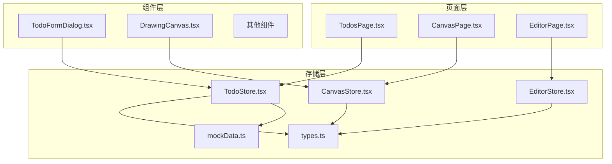
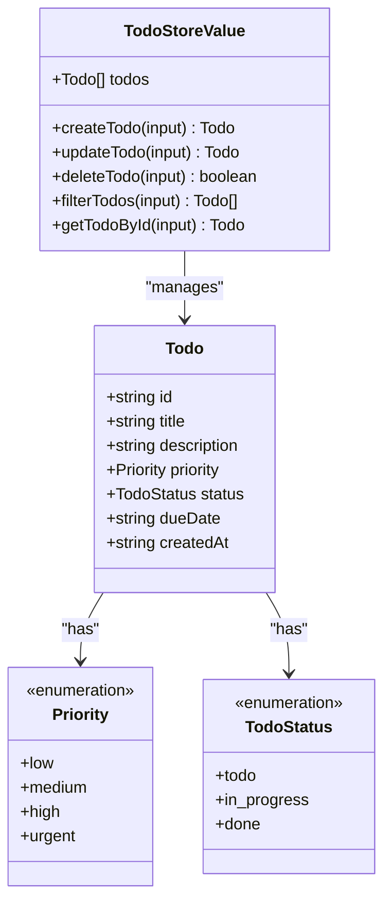
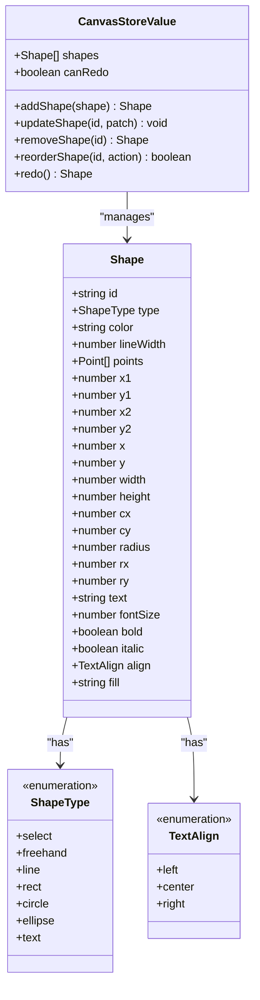
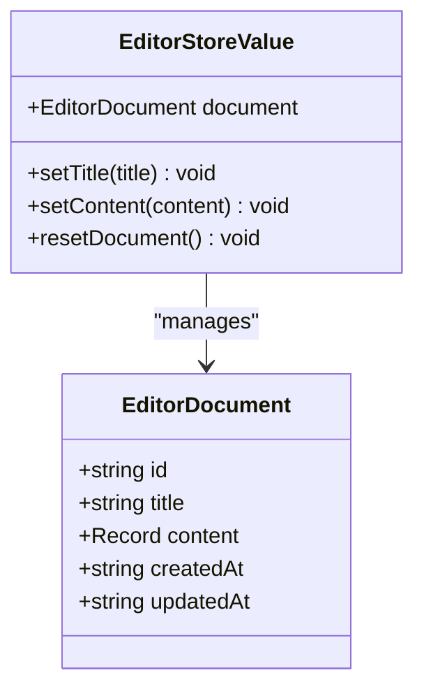
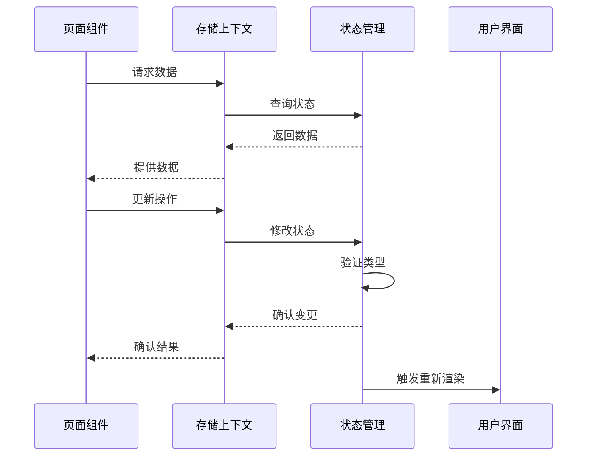
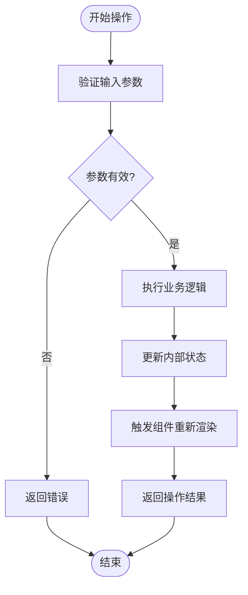
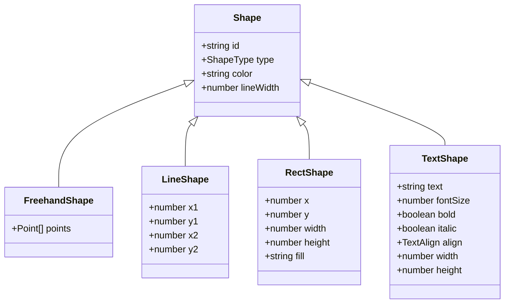
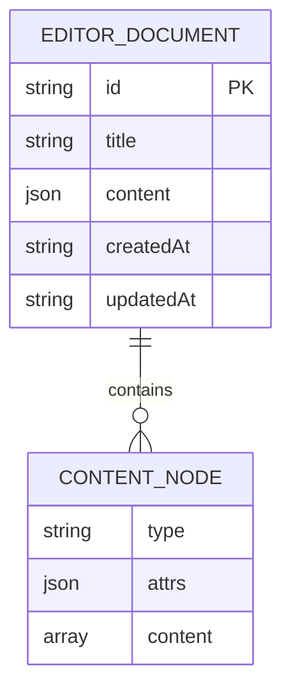
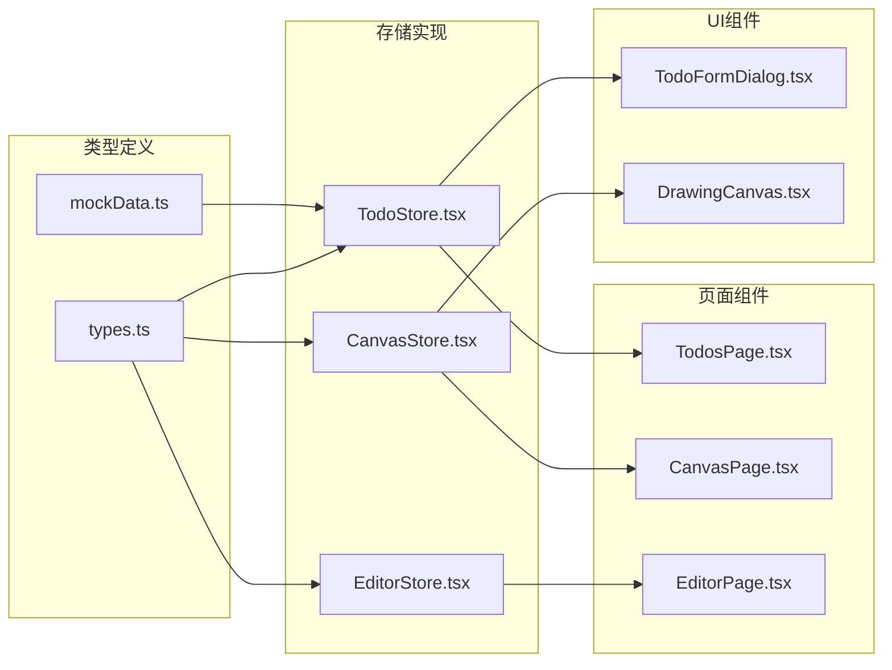
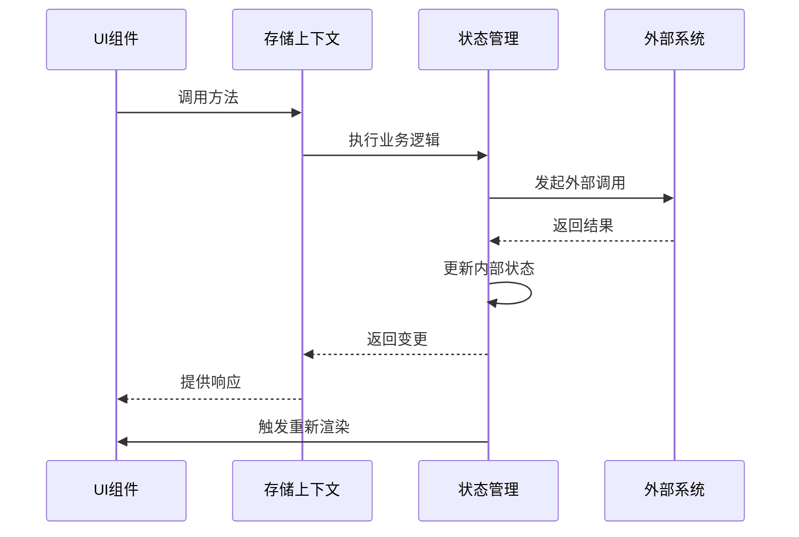

# 类型定义与模拟数据

<cite>
**本文档引用的文件**
- [types.ts](file://apps/demo/src/store/types.ts)
- [mockData.ts](file://apps/demo/src/store/mockData.ts)
- [CanvasStore.tsx](file://apps/demo/src/store/CanvasStore.tsx)
- [EditorStore.tsx](file://apps/demo/src/store/EditorStore.tsx)
- [TodoStore.tsx](file://apps/demo/src/store/TodoStore.tsx)
- [TodosPage.tsx](file://apps/demo/src/pages/TodosPage.tsx)
- [CanvasPage.tsx](file://apps/demo/src/pages/CanvasPage.tsx)
- [EditorPage.tsx](file://apps/demo/src/pages/EditorPage.tsx)
- [DrawingCanvas.tsx](file://apps/demo/src/components/canvas/DrawingCanvas.tsx)
- [TodoFormDialog.tsx](file://apps/demo/src/components/TodoFormDialog.tsx)
</cite>

## 目录
1. [简介](#简介)
2. [项目结构](#项目结构)
3. [核心类型系统](#核心类型系统)
4. [架构概览](#架构概览)
5. [详细组件分析](#详细组件分析)
6. [依赖关系分析](#依赖关系分析)
7. [性能考虑](#性能考虑)
8. [故障排除指南](#故障排除指南)
9. [结论](#结论)
10. [附录](#附录)

## 简介

本文档深入分析了 WebMCP Nexus 示例应用中的类型定义系统和模拟数据设计。该应用展示了如何通过 TypeScript 类型系统实现类型安全的状态管理，以及如何设计高质量的模拟数据来驱动前端开发和测试。

项目采用模块化的类型设计，将数据类型、状态管理和模拟数据分离，确保了代码的可维护性和可扩展性。通过严格的类型约束，开发者可以在编译时发现潜在的错误，提高代码质量。

## 项目结构

应用采用清晰的分层架构，主要分为以下几个层次：

**图表来源**
- [TodosPage.tsx:1-185](file://apps/demo/src/pages/TodosPage.tsx#L1-L185)
- [CanvasPage.tsx:1-596](file://apps/demo/src/pages/CanvasPage.tsx#L1-L596)
- [EditorPage.tsx:1-559](file://apps/demo/src/pages/EditorPage.tsx#L1-L559)

**章节来源**
- [types.ts:1-72](file://apps/demo/src/store/types.ts#L1-L72)
- [mockData.ts:1-99](file://apps/demo/src/store/mockData.ts#L1-L99)

## 核心类型系统

### 数据类型定义

项目的核心类型系统围绕三个主要领域构建：

#### 待办事项类型系统

**图表来源**
- [types.ts:1-12](file://apps/demo/src/store/types.ts#L1-L12)
- [TodoStore.tsx:93-115](file://apps/demo/src/store/TodoStore.tsx#L93-L115)

#### 画布操作类型系统

**图表来源**
- [types.ts:34-71](file://apps/demo/src/store/types.ts#L34-L71)
- [CanvasStore.tsx:14-25](file://apps/demo/src/store/CanvasStore.tsx#L14-L25)

#### 富文本编辑器类型系统

**图表来源**
- [EditorStore.tsx:10-23](file://apps/demo/src/store/EditorStore.tsx#L10-L23)
- [EditorStore.tsx:18-23](file://apps/demo/src/store/EditorStore.tsx#L18-L23)

**章节来源**
- [types.ts:1-72](file://apps/demo/src/store/types.ts#L1-L72)

### 类型安全特性

项目实现了多层次的类型安全保障：

1. **枚举类型约束**：使用 TypeScript 枚举确保值域的完整性
2. **联合类型保护**：通过联合类型防止无效状态
3. **Partial 类型**：在更新操作中提供灵活的字段选择
4. **Omit 类型**：排除不需要的字段（如 ID）
5. **Record 类型**：处理动态内容结构

## 架构概览

应用采用基于上下文的存储模式，每个功能域都有独立的状态管理：

**图表来源**
- [TodoStore.tsx:117-280](file://apps/demo/src/store/TodoStore.tsx#L117-L280)
- [CanvasStore.tsx:27-165](file://apps/demo/src/store/CanvasStore.tsx#L27-L165)
- [EditorStore.tsx:81-108](file://apps/demo/src/store/EditorStore.tsx#L81-L108)

## 详细组件分析

### 待办事项存储系统

#### 类型定义与验证

待办事项存储系统实现了完整的 CRUD 操作和复杂的状态管理：

**图表来源**
- [TodoStore.tsx:133-145](file://apps/demo/src/store/TodoStore.tsx#L133-L145)
- [TodoStore.tsx:216-242](file://apps/demo/src/store/TodoStore.tsx#L216-L242)

#### 模拟数据设计

模拟数据采用了精心设计的时间管理和标签系统：

| 优先级 | 数值权重 | 中文标签 |
|--------|----------|----------|
| urgent | 0 | 紧急 |
| high | 1 | 高 |
| medium | 2 | 中 |
| low | 3 | 低 |

**章节来源**
- [mockData.ts:16-98](file://apps/demo/src/store/mockData.ts#L16-L98)
- [types.ts:14-32](file://apps/demo/src/store/types.ts#L14-L32)

### 画布存储系统

#### 形状类型系统

画布系统支持多种形状类型，每种形状都有特定的属性集：

**图表来源**
- [types.ts:46-71](file://apps/demo/src/store/types.ts#L46-L71)
- [DrawingCanvas.tsx:77-143](file://apps/demo/src/components/canvas/DrawingCanvas.tsx#L77-L143)

#### 交互式渲染引擎

画布组件实现了复杂的渲染和交互逻辑：

**章节来源**
- [CanvasStore.tsx:14-172](file://apps/demo/src/store/CanvasStore.tsx#L14-L172)
- [DrawingCanvas.tsx:1-659](file://apps/demo/src/components/canvas/DrawingCanvas.tsx#L1-L659)

### 富文本编辑器存储系统

#### 文档结构设计

编辑器存储系统采用 JSON 结构来表示文档内容：

**图表来源**
- [EditorStore.tsx:10-16](file://apps/demo/src/store/EditorStore.tsx#L10-L16)
- [EditorStore.tsx:25-69](file://apps/demo/src/store/EditorStore.tsx#L25-L69)

**章节来源**
- [EditorStore.tsx:1-115](file://apps/demo/src/store/EditorStore.tsx#L1-L115)

## 依赖关系分析

### 类型依赖图

**图表来源**
- [types.ts:1-72](file://apps/demo/src/store/types.ts#L1-L72)
- [mockData.ts:1-99](file://apps/demo/src/store/mockData.ts#L1-L99)

### 组件间通信

组件通过存储上下文进行松耦合通信：

**图表来源**
- [TodosPage.tsx:116-129](file://apps/demo/src/pages/TodosPage.tsx#L116-L129)
- [CanvasPage.tsx:540-560](file://apps/demo/src/pages/CanvasPage.tsx#L540-L560)
- [EditorPage.tsx:522-546](file://apps/demo/src/pages/EditorPage.tsx#L522-L546)

**章节来源**
- [TodosPage.tsx:1-185](file://apps/demo/src/pages/TodosPage.tsx#L1-L185)
- [CanvasPage.tsx:1-596](file://apps/demo/src/pages/CanvasPage.tsx#L1-L596)
- [EditorPage.tsx:1-559](file://apps/demo/src/pages/EditorPage.tsx#L1-L559)

## 性能考虑

### 类型检查优化

1. **编译时验证**：所有类型错误在编译阶段被捕获，避免运行时错误
2. **增量编译**：TypeScript 支持增量编译，提高开发效率
3. **类型缓存**：编译器缓存类型信息，减少重复计算

### 运行时性能

1. **最小化状态更新**：使用不可变更新策略，确保精确的重新渲染
2. **记忆化优化**：使用 useMemo 和 useCallback 避免不必要的重渲染
3. **虚拟 DOM**：React 的虚拟 DOM 机制确保高效的 UI 更新

## 故障排除指南

### 常见类型错误

1. **枚举值错误**：确保使用正确的枚举值而非字符串
2. **可选属性访问**：在访问可能为空的属性前进行检查
3. **类型断言风险**：谨慎使用类型断言，优先使用类型守卫

### 调试技巧

1. **类型推断检查**：使用 IDE 的类型提示功能检查推断结果
2. **编译器错误**：仔细阅读编译器提供的详细错误信息
3. **单元测试**：编写针对类型系统的测试用例

**章节来源**
- [TodoStore.tsx:245-248](file://apps/demo/src/store/TodoStore.tsx#L245-L248)
- [CanvasStore.tsx:167-171](file://apps/demo/src/store/CanvasStore.tsx#L167-L171)

## 结论

该项目展示了现代前端应用中类型系统的重要作用。通过精心设计的类型定义和模拟数据，实现了：

1. **强类型安全保障**：编译时捕获大多数类型错误
2. **清晰的职责分离**：类型定义、状态管理和模拟数据相互独立
3. **良好的可扩展性**：类型系统支持未来的功能扩展
4. **优秀的开发体验**：IDE 支持和类型推断提升开发效率

这种设计模式值得在大型前端项目中推广使用。

## 附录

### 最佳实践清单

1. **类型设计原则**
   - 使用枚举而非字符串常量
   - 优先使用联合类型而非 any
   - 为复杂对象定义接口而非直接使用 Record

2. **模拟数据设计**
   - 包含边界条件和异常情况
   - 提供多样化的数据组合
   - 考虑国际化和本地化需求

3. **类型安全实践**
   - 在函数参数和返回值上明确标注类型
   - 使用 Partial 和 Pick 等工具类型
   - 避免过度使用类型断言

4. **性能优化建议**
   - 合理使用泛型以获得更好的类型推断
   - 避免创建过于复杂的类型别名
   - 定期重构和简化类型定义