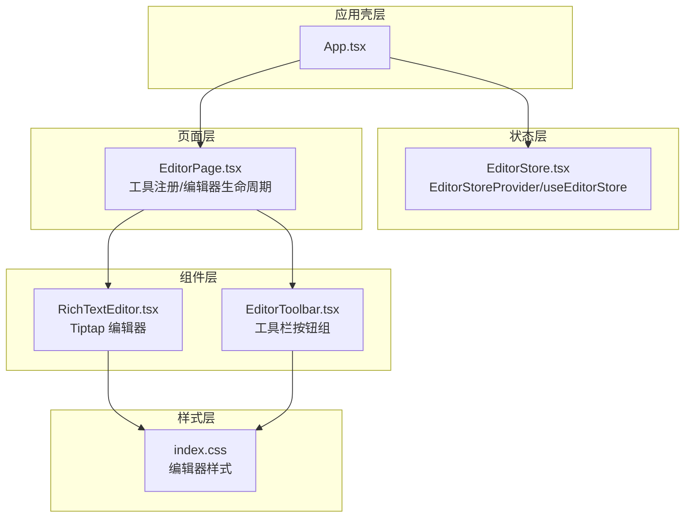
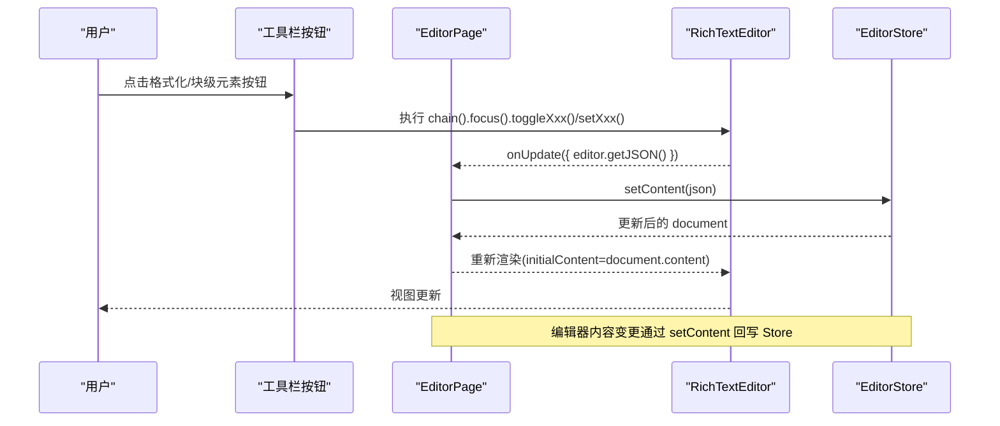
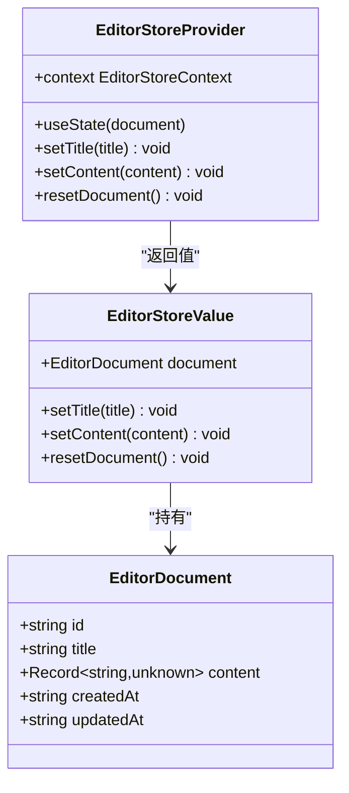
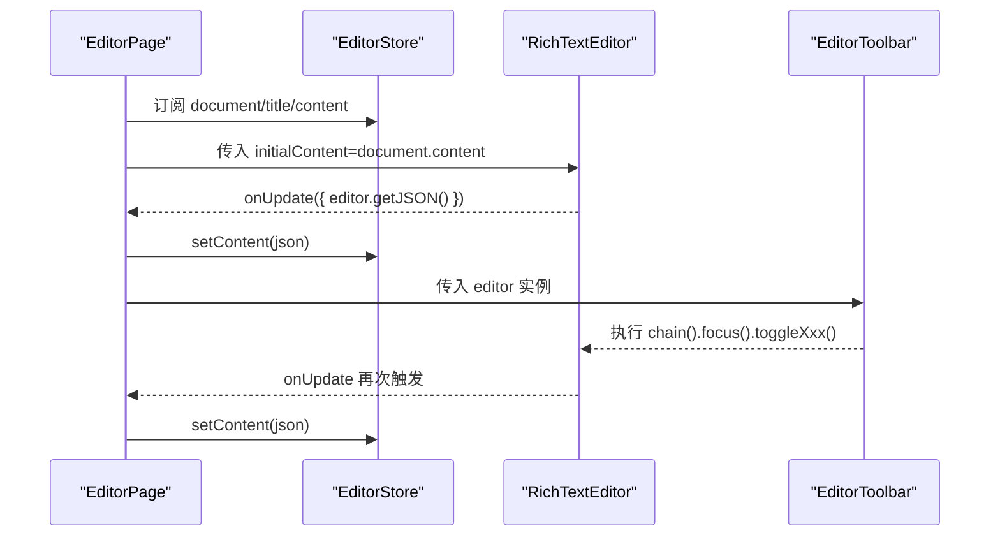
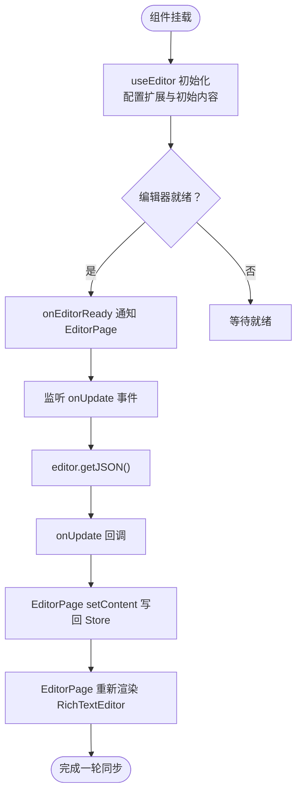
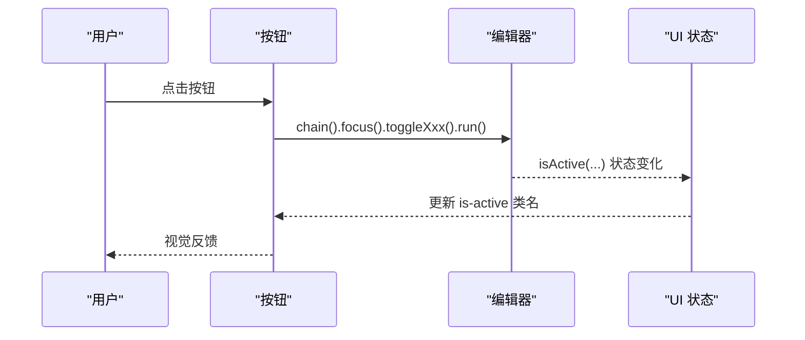
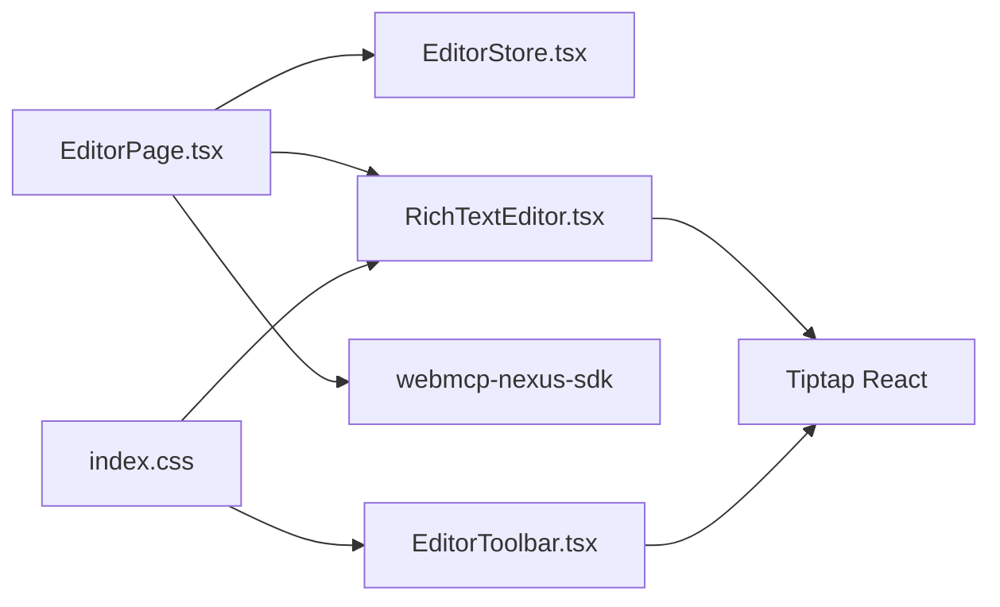

# 编辑器状态管理

<cite>
**本文引用的文件**
- [EditorStore.tsx](file://apps/demo/src/store/EditorStore.tsx)
- [types.ts](file://apps/demo/src/store/types.ts)
- [EditorPage.tsx](file://apps/demo/src/pages/EditorPage.tsx)
- [RichTextEditor.tsx](file://apps/demo/src/components/editor/RichTextEditor.tsx)
- [EditorToolbar.tsx](file://apps/demo/src/components/editor/EditorToolbar.tsx)
- [index.css](file://apps/demo/src/index.css)
- [App.tsx](file://apps/demo/src/App.tsx)
</cite>

## 目录
1. [简介](#简介)
2. [项目结构](#项目结构)
3. [核心组件](#核心组件)
4. [架构总览](#架构总览)
5. [详细组件分析](#详细组件分析)
6. [依赖关系分析](#依赖关系分析)
7. [性能考量](#性能考量)
8. [故障排查指南](#故障排查指南)
9. [结论](#结论)
10. [附录](#附录)

## 简介
本文件聚焦于富文本编辑器的状态管理与工具栏控制，系统性解析 EditorStore 的设计与实现，涵盖编辑内容、格式化状态、工具栏控制、状态同步与内容更新机制，并给出最佳实践与用户体验优化建议。同时提供基于实际源码的图示与参考路径，帮助读者快速定位到关键实现。

## 项目结构
该编辑器采用“页面层 + 组件层 + 状态层”的分层组织：
- 页面层负责工具注册与编辑器生命周期管理
- 组件层包含富文本编辑器与工具栏
- 状态层提供全局文档状态与上下文

图表来源
- [App.tsx:37-79](file://apps/demo/src/App.tsx#L37-L79)
- [EditorStore.tsx:81-108](file://apps/demo/src/store/EditorStore.tsx#L81-L108)
- [EditorPage.tsx:548-557](file://apps/demo/src/pages/EditorPage.tsx#L548-L557)
- [RichTextEditor.tsx:16-47](file://apps/demo/src/components/editor/RichTextEditor.tsx#L16-L47)
- [EditorToolbar.tsx:75-143](file://apps/demo/src/components/editor/EditorToolbar.tsx#L75-L143)
- [index.css:772-917](file://apps/demo/src/index.css#L772-L917)

章节来源
- [App.tsx:37-79](file://apps/demo/src/App.tsx#L37-L79)
- [EditorStore.tsx:81-108](file://apps/demo/src/store/EditorStore.tsx#L81-L108)
- [EditorPage.tsx:548-557](file://apps/demo/src/pages/EditorPage.tsx#L548-L557)
- [RichTextEditor.tsx:16-47](file://apps/demo/src/components/editor/RichTextEditor.tsx#L16-L47)
- [EditorToolbar.tsx:75-143](file://apps/demo/src/components/editor/EditorToolbar.tsx#L75-L143)
- [index.css:772-917](file://apps/demo/src/index.css#L772-L917)

## 核心组件
- EditorStore：提供文档对象、标题与内容的更新方法，以及重置文档能力。通过 React Context 暴露给子组件使用。
- EditorPage：连接 EditorStore 与 Tiptap 编辑器，注册 WebMCP 工具集，处理编辑器就绪、内容变更回调与工具调用。
- RichTextEditor：封装 Tiptap 编辑器实例，配置扩展与初始内容，监听编辑器更新事件并将 JSON 内容回传给父组件。
- EditorToolbar：渲染工具栏按钮组，根据编辑器当前状态动态切换按钮激活态，执行链式命令。

章节来源
- [EditorStore.tsx:10-23](file://apps/demo/src/store/EditorStore.tsx#L10-L23)
- [EditorStore.tsx:81-108](file://apps/demo/src/store/EditorStore.tsx#L81-L108)
- [EditorPage.tsx:9-16](file://apps/demo/src/pages/EditorPage.tsx#L9-L16)
- [RichTextEditor.tsx:16-47](file://apps/demo/src/components/editor/RichTextEditor.tsx#L16-L47)
- [EditorToolbar.tsx:75-143](file://apps/demo/src/components/editor/EditorToolbar.tsx#L75-L143)

## 架构总览
编辑器状态流从 EditorStore 出发，EditorPage 作为协调者，将文档内容注入 RichTextEditor 并在编辑器更新时回写到 Store；同时，EditorToolbar 通过 Tiptap 的 chain/commands 执行格式化与块级元素操作，实时反映在编辑器中；EditorPage 还通过 useWebMcpTools 将编辑器能力暴露为 MCP 工具，实现“用户交互”与“AI Agent 调用”两条路径的统一。

图表来源
- [EditorPage.tsx:551-555](file://apps/demo/src/pages/EditorPage.tsx#L551-L555)
- [EditorStore.tsx:90-96](file://apps/demo/src/store/EditorStore.tsx#L90-L96)
- [RichTextEditor.tsx:35-37](file://apps/demo/src/components/editor/RichTextEditor.tsx#L35-L37)

## 详细组件分析

### EditorStore 设计与实现
- 数据模型
  - EditorDocument：包含 id、title、content、createdAt、updatedAt 字段，其中 content 为 Tiptap JSON 结构。
  - EditorStoreValue：对外暴露 document、setTitle、setContent、resetDocument 方法。
- 初始化策略
  - createInitialDocument：生成带时间戳的唯一 id、默认标题与内置示例内容。
  - INITIAL_CONTENT：以 JSON 形式定义示例文档结构，覆盖标题、段落、列表、引用、代码块等。
- 上下文与 Hook
  - EditorStoreContext：提供 Provider 与 useEditorStore Hook，确保子树可访问编辑器状态。
- 更新策略
  - setTitle：更新标题并刷新 updatedAt。
  - setContent：更新内容并刷新 updatedAt。
  - resetDocument：重建初始文档。

图表来源
- [EditorStore.tsx:10-23](file://apps/demo/src/store/EditorStore.tsx#L10-L23)
- [EditorStore.tsx:81-108](file://apps/demo/src/store/EditorStore.tsx#L81-L108)

章节来源
- [EditorStore.tsx:10-23](file://apps/demo/src/store/EditorStore.tsx#L10-L23)
- [EditorStore.tsx:25-69](file://apps/demo/src/store/EditorStore.tsx#L25-L69)
- [EditorStore.tsx:71-79](file://apps/demo/src/store/EditorStore.tsx#L71-L79)
- [EditorStore.tsx:81-108](file://apps/demo/src/store/EditorStore.tsx#L81-L108)
- [EditorStore.tsx:110-115](file://apps/demo/src/store/EditorStore.tsx#L110-L115)

### EditorPage：状态同步与工具注册
- 状态绑定
  - 使用 useEditorStore 获取 document、setTitle、setContent。
  - useRef 存储编辑器实例，useState 标记编辑器是否已就绪。
- 生命周期与回调
  - handleEditorReady：保存编辑器实例并标记就绪。
  - onUpdate：将编辑器 getJSON() 结果通过 setContent 写回 EditorStore。
- 工具注册
  - 通过 useWebMcpTools 将大量编辑器操作封装为 MCP 工具，覆盖查询、插入、格式化、编辑等能力，保证 UI 与 AI Agent 的行为一致。

图表来源
- [EditorPage.tsx:9-16](file://apps/demo/src/pages/EditorPage.tsx#L9-L16)
- [EditorPage.tsx:551-555](file://apps/demo/src/pages/EditorPage.tsx#L551-L555)
- [EditorStore.tsx:90-96](file://apps/demo/src/store/EditorStore.tsx#L90-L96)
- [EditorToolbar.tsx:75-143](file://apps/demo/src/components/editor/EditorToolbar.tsx#L75-L143)

章节来源
- [EditorPage.tsx:9-16](file://apps/demo/src/pages/EditorPage.tsx#L9-L16)
- [EditorPage.tsx:551-555](file://apps/demo/src/pages/EditorPage.tsx#L551-L555)
- [EditorStore.tsx:90-96](file://apps/demo/src/store/EditorStore.tsx#L90-L96)
- [EditorToolbar.tsx:75-143](file://apps/demo/src/components/editor/EditorToolbar.tsx#L75-L143)

### RichTextEditor：内容初始化与更新
- 初始化
  - useEditor 创建编辑器实例，启用 StarterKit、Underline、Link、TextAlign、Placeholder 等扩展。
  - content 由 EditorPage 传入的 document.content 初始化。
- 更新机制
  - onUpdate 中调用 editor.getJSON() 并通过 onUpdate 回调传递给 EditorPage，最终写回 EditorStore。
- 就绪通知
  - onEditorReady 将编辑器实例保存至 EditorPage 的 ref，供后续工具调用。

图表来源
- [RichTextEditor.tsx:17-38](file://apps/demo/src/components/editor/RichTextEditor.tsx#L17-L38)
- [EditorPage.tsx:551-555](file://apps/demo/src/pages/EditorPage.tsx#L551-L555)
- [EditorStore.tsx:90-96](file://apps/demo/src/store/EditorStore.tsx#L90-L96)

章节来源
- [RichTextEditor.tsx:17-38](file://apps/demo/src/components/editor/RichTextEditor.tsx#L17-L38)
- [EditorPage.tsx:551-555](file://apps/demo/src/pages/EditorPage.tsx#L551-L555)
- [EditorStore.tsx:90-96](file://apps/demo/src/store/EditorStore.tsx#L90-L96)

### EditorToolbar：状态管理与命令执行
- 按钮状态
  - 通过 editor.isActive(...) 动态判断当前激活状态，按钮类名 is-active 控制视觉反馈。
- 命令执行
  - 使用 editor.chain().focus().xxx().run() 的链式调用模式，确保焦点正确并原子地执行命令。
- 可用性
  - 通过 editor.can().undo()/redo() 控制撤销/重做的可用性。
- 分组与提示
  - 工具栏按功能分组，使用 Tooltip 提示提升可用性。

图表来源
- [EditorToolbar.tsx:81-85](file://apps/demo/src/components/editor/EditorToolbar.tsx#L81-L85)
- [EditorToolbar.tsx:137-140](file://apps/demo/src/components/editor/EditorToolbar.tsx#L137-L140)

章节来源
- [EditorToolbar.tsx:75-143](file://apps/demo/src/components/editor/EditorToolbar.tsx#L75-L143)

### 样式与主题
- 编辑器容器与工具栏
  - .page--editor 容器布局，.editor-toolbar 工具栏分组与分隔线，.editor-toolbar__btn 按钮基础样式与 hover/active/disabled 行为。
- TipTap 内容样式
  - .tiptap 根节点与标题、段落、引用、代码块、列表、链接、强调等样式，确保渲染一致性。
- 响应式
  - 在小屏设备上调整工具栏与内容区间距，保证可用性。

章节来源
- [index.css:772-917](file://apps/demo/src/index.css#L772-L917)

## 依赖关系分析
- 组件耦合
  - EditorPage 同时依赖 EditorStore 与 Tiptap 编辑器，承担协调职责。
  - RichTextEditor 仅依赖 Tiptap，不直接依赖 EditorStore。
  - EditorToolbar 依赖 Tiptap 编辑器实例，不依赖 EditorStore。
- 外部依赖
  - @tiptap/react、@tiptap/starter-kit、@tiptap/extension-* 等。
  - webmcp-nexus-sdk 提供 useWebMcpTools 工具注册能力。
- 潜在循环依赖
  - 当前结构清晰，无明显循环依赖风险。

图表来源
- [EditorPage.tsx:2-6](file://apps/demo/src/pages/EditorPage.tsx#L2-L6)
- [EditorStore.tsx:81-108](file://apps/demo/src/store/EditorStore.tsx#L81-L108)
- [RichTextEditor.tsx:1-8](file://apps/demo/src/components/editor/RichTextEditor.tsx#L1-L8)
- [EditorToolbar.tsx:1-25](file://apps/demo/src/components/editor/EditorToolbar.tsx#L1-L25)
- [index.css:772-917](file://apps/demo/src/index.css#L772-L917)

章节来源
- [EditorPage.tsx:2-6](file://apps/demo/src/pages/EditorPage.tsx#L2-L6)
- [EditorStore.tsx:81-108](file://apps/demo/src/store/EditorStore.tsx#L81-L108)
- [RichTextEditor.tsx:1-8](file://apps/demo/src/components/editor/RichTextEditor.tsx#L1-L8)
- [EditorToolbar.tsx:1-25](file://apps/demo/src/components/editor/EditorToolbar.tsx#L1-L25)
- [index.css:772-917](file://apps/demo/src/index.css#L772-L917)

## 性能考量
- 状态粒度
  - EditorStore 将文档整体作为单一状态单元，适合小型到中型文档；对于大型文档，可考虑拆分内容与元数据，减少不必要的重渲染。
- 回调去抖
  - onUpdate 在每次编辑器变更都会触发，建议在 EditorPage 层引入节流/去抖策略，避免频繁 setState。
- 渲染优化
  - EditorPage 通过重新渲染 RichTextEditor 来同步内容，建议确保 initialContent 的引用稳定性，必要时使用 useMemo 包裹 document.content。
- 工具调用
  - useWebMcpTools 注册的工具函数均使用 useCallback 包装，避免子组件重复渲染导致的性能损耗。

[本节为通用指导，无需特定文件引用]

## 故障排查指南
- 编辑器未就绪
  - 现象：工具调用返回“editor not ready”。
  - 排查：确认 handleEditorReady 是否被调用，editorRef 是否非空。
  - 参考路径：[EditorPage.tsx:13-16](file://apps/demo/src/pages/EditorPage.tsx#L13-L16)
- 内容不同步
  - 现象：修改后视图未更新或内容丢失。
  - 排查：检查 onUpdate 是否被触发，EditorPage 是否调用 setContent，EditorStore 的 setState 是否生效。
  - 参考路径：[EditorPage.tsx:551-555](file://apps/demo/src/pages/EditorPage.tsx#L551-L555)、[EditorStore.tsx:90-96](file://apps/demo/src/store/EditorStore.tsx#L90-L96)
- 工具栏按钮无响应
  - 现象：点击按钮无效果。
  - 排查：确认 editor 实例已传入 EditorToolbar，editor.chain().focus().xxx().run() 是否执行成功。
  - 参考路径：[EditorToolbar.tsx:75-143](file://apps/demo/src/components/editor/EditorToolbar.tsx#L75-L143)
- 撤销/重做不可用
  - 现象：撤销/重做按钮禁用。
  - 排查：检查 editor.can().undo()/redo() 返回值，确认历史栈状态。
  - 参考路径：[EditorToolbar.tsx:137-140](file://apps/demo/src/components/editor/EditorToolbar.tsx#L137-L140)

章节来源
- [EditorPage.tsx:13-16](file://apps/demo/src/pages/EditorPage.tsx#L13-L16)
- [EditorPage.tsx:551-555](file://apps/demo/src/pages/EditorPage.tsx#L551-L555)
- [EditorStore.tsx:90-96](file://apps/demo/src/store/EditorStore.tsx#L90-L96)
- [EditorToolbar.tsx:75-143](file://apps/demo/src/components/editor/EditorToolbar.tsx#L75-L143)
- [EditorToolbar.tsx:137-140](file://apps/demo/src/components/editor/EditorToolbar.tsx#L137-L140)

## 结论
本项目通过 EditorStore 提供统一的文档状态，EditorPage 协调编辑器生命周期与工具注册，RichTextEditor 与 EditorToolbar 分别负责内容渲染与交互控制，形成清晰的单向数据流与双向交互闭环。配合 WebMCP 工具体系，实现了“用户界面 + AI Agent”的一致化编辑体验。建议在大型文档场景下进一步优化状态粒度与渲染性能，并在 EditorPage 层引入节流策略以提升交互流畅度。

[本节为总结性内容，无需特定文件引用]

## 附录
- 最佳实践
  - 使用 useCallback 包装工具函数，避免子组件重复渲染。
  - 在 EditorPage 层对 onUpdate 进行节流/去抖，降低 setState 频率。
  - 将 document.content 作为稳定引用传递给 RichTextEditor，必要时使用 useMemo。
  - 保持 EditorToolbar 与编辑器实例的强关联，确保 isActive 状态准确。
- 用户体验优化
  - 为工具栏按钮添加 Tooltip，提升可发现性。
  - 为撤销/重做按钮提供明确的可用性反馈。
  - 在小屏设备上优化工具栏布局与间距，保证可触达性。

[本节为通用指导，无需特定文件引用]