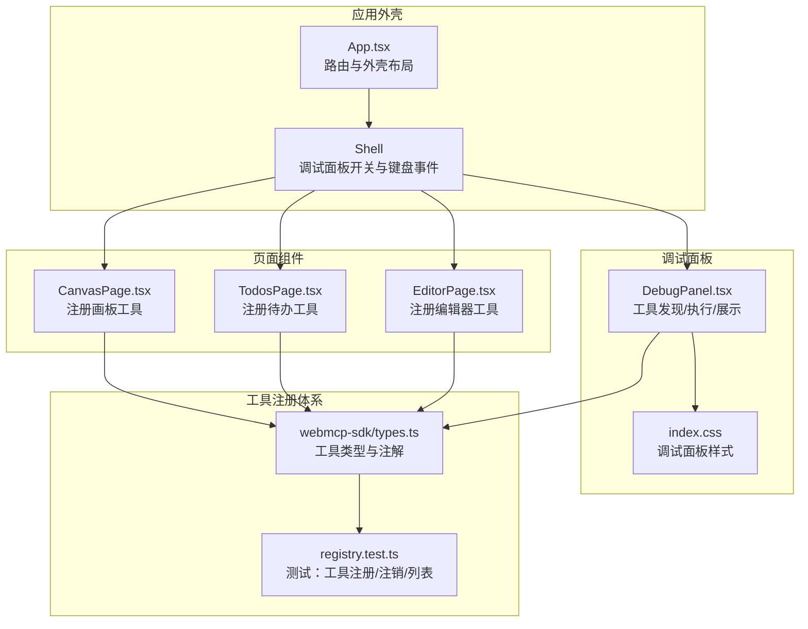
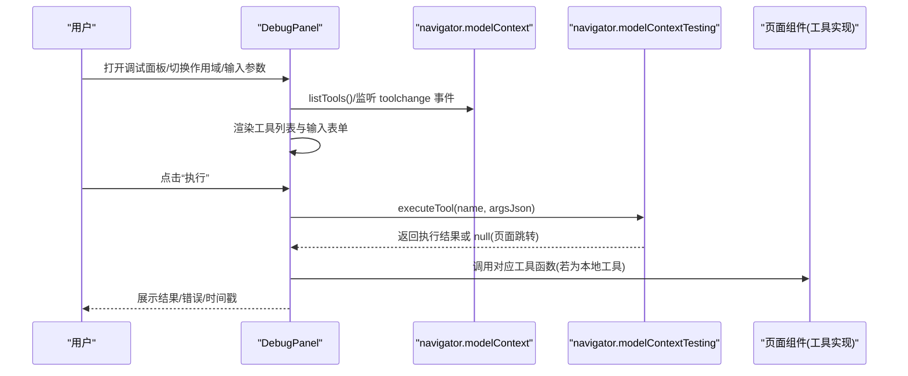
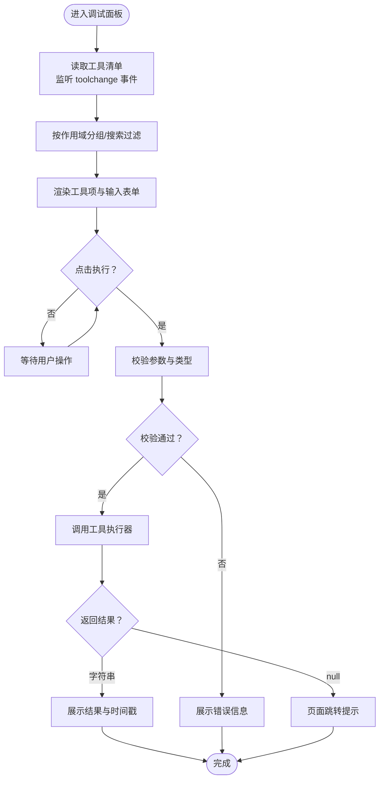
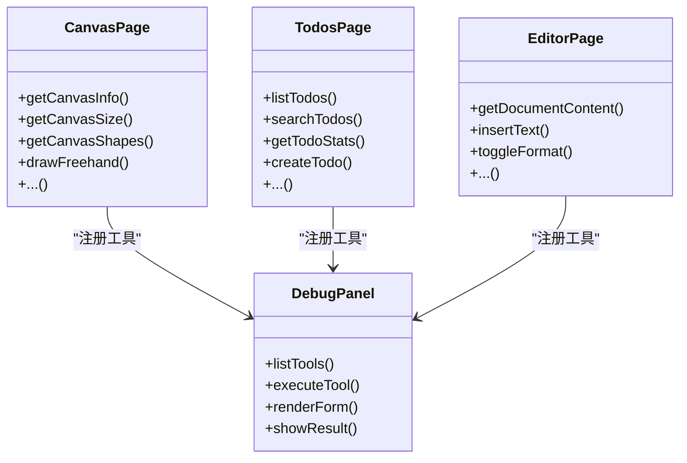
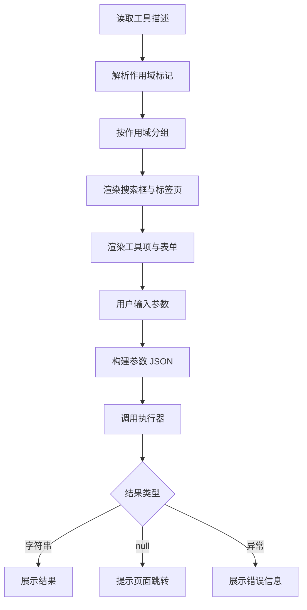
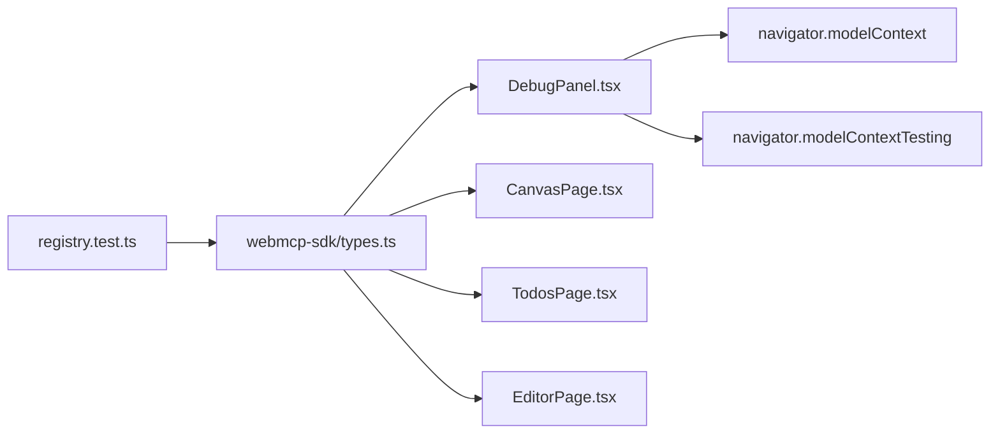

# 调试工具

<cite>
**本文引用的文件**
- [apps/demo/src/components/DebugPanel.tsx](file://apps/demo/src/components/DebugPanel.tsx)
- [apps/demo/src/App.tsx](file://apps/demo/src/App.tsx)
- [apps/demo/src/index.css](file://apps/demo/src/index.css)
- [apps/demo/src/pages/CanvasPage.tsx](file://apps/demo/src/pages/CanvasPage.tsx)
- [apps/demo/src/pages/TodosPage.tsx](file://apps/demo/src/pages/TodosPage.tsx)
- [apps/demo/src/pages/EditorPage.tsx](file://apps/demo/src/pages/EditorPage.tsx)
- [packages/webmcp-sdk/src/types.ts](file://packages/webmcp-sdk/src/types.ts)
- [packages/webmcp-sdk/src/__tests__/registry.test.ts](file://packages/webmcp-sdk/src/__tests__/registry.test.ts)
</cite>

## 目录
1. [简介](#简介)
2. [项目结构](#项目结构)
3. [核心组件](#核心组件)
4. [架构总览](#架构总览)
5. [组件详解](#组件详解)
6. [依赖关系分析](#依赖关系分析)
7. [性能考量](#性能考量)
8. [故障排查指南](#故障排查指南)
9. [结论](#结论)
10. [附录](#附录)

## 简介
本文件面向演示应用中的“调试面板”功能，系统化阐述 DebugPanel 组件的实现原理、调试流程、信息收集与展示机制，并提供问题排查、性能分析与扩展定制的实践建议。调试面板通过 WebMCP 工具注册体系动态发现并执行工具，支持按“全局/页面/组件”作用域分类、输入参数校验与自动渲染、执行结果与错误展示、以及工具变更事件计数等能力。

## 项目结构
调试面板位于演示应用前端，与页面组件、状态存储、工具注册体系协同工作：
- 应用外壳负责打开/关闭调试面板与键盘快捷键绑定
- 页面组件通过 WebMCP SDK 将自身能力注册为工具（全局或局部）
- 调试面板从运行时模型上下文读取工具清单，支持搜索、分组与执行

**图表来源**
- [apps/demo/src/App.tsx:21-81](file://apps/demo/src/App.tsx#L21-L81)
- [apps/demo/src/components/DebugPanel.tsx:97-393](file://apps/demo/src/components/DebugPanel.tsx#L97-L393)
- [apps/demo/src/pages/CanvasPage.tsx:415-432](file://apps/demo/src/pages/CanvasPage.tsx#L415-L432)
- [apps/demo/src/pages/TodosPage.tsx:116-129](file://apps/demo/src/pages/TodosPage.tsx#L116-L129)
- [apps/demo/src/pages/EditorPage.tsx:522-546](file://apps/demo/src/pages/EditorPage.tsx#L522-L546)
- [packages/webmcp-sdk/src/types.ts:1-47](file://packages/webmcp-sdk/src/types.ts#L1-L47)
- [packages/webmcp-sdk/src/__tests__/registry.test.ts:194-238](file://packages/webmcp-sdk/src/__tests__/registry.test.ts#L194-L238)

**章节来源**
- [apps/demo/src/App.tsx:1-98](file://apps/demo/src/App.tsx#L1-L98)
- [apps/demo/src/components/DebugPanel.tsx:1-480](file://apps/demo/src/components/DebugPanel.tsx#L1-L480)
- [apps/demo/src/index.css:548-771](file://apps/demo/src/index.css#L548-L771)

## 核心组件
- DebugPanel：调试面板主体，负责工具发现、输入参数渲染、执行与结果展示
- App/Shell：应用外壳与调试面板开关控制，支持键盘快捷键
- 页面组件：通过 WebMCP SDK 将业务能力注册为工具（全局或局部）

关键职责与交互：
- 工具发现：从运行时模型上下文读取工具清单，监听工具变更事件
- 参数渲染：根据 JSON Schema 自动渲染输入控件（枚举、布尔、数值、对象/数组）
- 执行与展示：异步调用工具执行器，展示结果或错误，记录执行时间
- 作用域与搜索：按“全局/页面/组件”分组，支持名称与描述过滤

**章节来源**
- [apps/demo/src/components/DebugPanel.tsx:97-393](file://apps/demo/src/components/DebugPanel.tsx#L97-L393)
- [apps/demo/src/App.tsx:21-81](file://apps/demo/src/App.tsx#L21-L81)

## 架构总览
调试面板与工具系统的交互链路如下：

**图表来源**
- [apps/demo/src/components/DebugPanel.tsx:42-61](file://apps/demo/src/components/DebugPanel.tsx#L42-L61)
- [apps/demo/src/components/DebugPanel.tsx:85-95](file://apps/demo/src/components/DebugPanel.tsx#L85-L95)
- [apps/demo/src/pages/CanvasPage.tsx:415-432](file://apps/demo/src/pages/CanvasPage.tsx#L415-L432)
- [apps/demo/src/pages/TodosPage.tsx:116-129](file://apps/demo/src/pages/TodosPage.tsx#L116-L129)
- [apps/demo/src/pages/EditorPage.tsx:522-546](file://apps/demo/src/pages/EditorPage.tsx#L522-L546)

## 组件详解

### DebugPanel 组件实现与调试功能
- 工具发现与刷新
  - 通过运行时模型上下文读取工具清单，支持轮询与事件驱动刷新
  - 监听工具变更事件，进行去抖处理并更新计数
- 作用域与搜索
  - 依据描述中的作用域标记区分“全局/页面/组件”工具
  - 支持按名称与描述关键字过滤
- 输入参数渲染
  - 基于 JSON Schema 动态生成表单控件（枚举、布尔、数值、对象/数组）
  - 自动推断类型与默认值，校验必填与格式
- 执行与结果展示
  - 异步调用工具执行器，展示成功结果或错误信息
  - 记录每次执行的时间戳，便于回溯
- UI 与交互
  - 折叠展开、标签页切换、空状态提示、键盘快捷键支持

**图表来源**
- [apps/demo/src/components/DebugPanel.tsx:97-235](file://apps/demo/src/components/DebugPanel.tsx#L97-L235)

**章节来源**
- [apps/demo/src/components/DebugPanel.tsx:1-480](file://apps/demo/src/components/DebugPanel.tsx#L1-L480)

### 调试面板与页面组件的协作
- 页面组件通过 WebMCP SDK 将自身能力注册为工具，形成“全局/页面/组件”三类工具
- 调试面板根据工具描述中的作用域标记进行分类
- 调试面板既可调用“本地工具”，也可通过运行时执行器间接触发页面行为

**图表来源**
- [apps/demo/src/pages/CanvasPage.tsx:415-432](file://apps/demo/src/pages/CanvasPage.tsx#L415-L432)
- [apps/demo/src/pages/TodosPage.tsx:116-129](file://apps/demo/src/pages/TodosPage.tsx#L116-L129)
- [apps/demo/src/pages/EditorPage.tsx:522-546](file://apps/demo/src/pages/EditorPage.tsx#L522-L546)
- [apps/demo/src/components/DebugPanel.tsx:97-393](file://apps/demo/src/components/DebugPanel.tsx#L97-L393)

**章节来源**
- [apps/demo/src/pages/CanvasPage.tsx:1-453](file://apps/demo/src/pages/CanvasPage.tsx#L1-L453)
- [apps/demo/src/pages/TodosPage.tsx:1-185](file://apps/demo/src/pages/TodosPage.tsx#L1-L185)
- [apps/demo/src/pages/EditorPage.tsx:1-559](file://apps/demo/src/pages/EditorPage.tsx#L1-L559)

### 调试信息收集与展示机制
- 工具清单与变更
  - 通过运行时模型上下文读取工具清单，支持轮询与事件监听
  - 使用去抖策略减少频繁刷新带来的性能压力
- 输入参数解析
  - 基于 JSON Schema 推断类型，自动校验必填与格式
  - 对对象/数组参数进行 JSON 解析，对数值参数进行类型转换
- 执行结果与错误
  - 成功返回字符串结果；若为 null 表示触发页面跳转
  - 失败捕获异常并展示错误信息，记录执行时间
- UI 展示
  - 工具项折叠/展开、输入表单、执行按钮、结果区域、错误区域、时间戳

**图表来源**
- [apps/demo/src/components/DebugPanel.tsx:38-61](file://apps/demo/src/components/DebugPanel.tsx#L38-L61)
- [apps/demo/src/components/DebugPanel.tsx:174-203](file://apps/demo/src/components/DebugPanel.tsx#L174-L203)
- [apps/demo/src/components/DebugPanel.tsx:205-235](file://apps/demo/src/components/DebugPanel.tsx#L205-L235)

**章节来源**
- [apps/demo/src/components/DebugPanel.tsx:1-480](file://apps/demo/src/components/DebugPanel.tsx#L1-L480)

### 调试面板样式与交互
- 固定右侧抽屉式面板，支持打开/关闭动画
- 顶部头部展示工具总数与工具变更计数
- 搜索框支持按名称/描述过滤
- 标签页区分“全局/页面/组件”作用域
- 工具项支持折叠展开、输入表单渲染、执行按钮与结果展示

**章节来源**
- [apps/demo/src/index.css:548-771](file://apps/demo/src/index.css#L548-L771)

## 依赖关系分析
- 运行时依赖
  - navigator.modelContext：工具注册与注销
  - navigator.modelContextTesting：工具列表与执行
- 类型与注解
  - 工具注解与 JSON Schema 由 SDK 提供，用于构建时提取与运行时验证
- 测试与验证
  - 单元测试覆盖工具注册/注销/列表的生命周期，包括与 AbortSignal 的同步移除

**图表来源**
- [packages/webmcp-sdk/src/types.ts:1-47](file://packages/webmcp-sdk/src/types.ts#L1-L47)
- [packages/webmcp-sdk/src/__tests__/registry.test.ts:194-238](file://packages/webmcp-sdk/src/__tests__/registry.test.ts#L194-L238)
- [apps/demo/src/components/DebugPanel.tsx:42-61](file://apps/demo/src/components/DebugPanel.tsx#L42-L61)

**章节来源**
- [packages/webmcp-sdk/src/types.ts:1-47](file://packages/webmcp-sdk/src/types.ts#L1-L47)
- [packages/webmcp-sdk/src/__tests__/registry.test.ts:194-238](file://packages/webmcp-sdk/src/__tests__/registry.test.ts#L194-L238)

## 性能考量
- 刷新策略
  - 工具列表轮询与事件监听结合，避免过度轮询
  - 工具变更事件采用去抖处理，减少频繁重渲染
- 渲染优化
  - 分组与过滤在内存中进行，避免重复解析
  - 输入表单按需渲染，仅展开的工具项渲染其表单
- 执行开销
  - 执行器调用为异步，避免阻塞 UI
  - 结果展示限制高度与滚动，防止大结果影响性能

[本节为通用性能建议，无需特定文件引用]

## 故障排查指南
- 调试面板无法打开/关闭
  - 检查外壳是否正确绑定键盘事件与开关状态
  - 确认样式类名与布局容器是否正确
- 工具列表为空
  - 确认页面组件已通过 SDK 注册工具
  - 检查运行时模型上下文是否存在与可用
- 执行报错或无响应
  - 检查输入参数类型与必填项是否满足 JSON Schema
  - 查看错误信息区域，确认异常堆栈
  - 若返回 null，表示工具触发页面跳转，检查路由与导航桥接
- 工具变更未生效
  - 确认监听的工具变更事件是否正常触发
  - 检查去抖逻辑是否导致计数延迟更新

**章节来源**
- [apps/demo/src/App.tsx:21-81](file://apps/demo/src/App.tsx#L21-L81)
- [apps/demo/src/components/DebugPanel.tsx:117-138](file://apps/demo/src/components/DebugPanel.tsx#L117-L138)
- [apps/demo/src/components/DebugPanel.tsx:174-203](file://apps/demo/src/components/DebugPanel.tsx#L174-L203)
- [apps/demo/src/components/DebugPanel.tsx:205-235](file://apps/demo/src/components/DebugPanel.tsx#L205-L235)

## 结论
调试面板以 WebMCP 工具注册体系为核心，实现了“所见即所得”的工具调试体验。通过运行时工具发现、智能参数渲染、执行结果展示与事件计数，开发者可以快速定位工具实现问题、验证输入约束、并进行性能与行为分析。配合页面组件的工具注册与外壳的快捷键支持，调试面板成为演示应用中不可或缺的开发辅助工具。

[本节为总结性内容，无需特定文件引用]

## 附录

### 使用方法速览
- 打开/关闭调试面板
  - 点击右上角调试按钮或使用键盘快捷键
- 选择作用域
  - 全局：跨页面可用的工具
  - 页面/组件：当前页面或组件内的工具
- 搜索与筛选
  - 在搜索框输入工具名或描述进行过滤
- 执行工具
  - 填写参数后点击“执行”，查看结果或错误
  - 查看执行时间戳，便于回溯

**章节来源**
- [apps/demo/src/App.tsx:21-81](file://apps/demo/src/App.tsx#L21-L81)
- [apps/demo/src/components/DebugPanel.tsx:366-393](file://apps/demo/src/components/DebugPanel.tsx#L366-L393)

### 扩展与定制建议
- 新增工具
  - 在页面组件中定义工具函数并使用 SDK 注册
  - 通过 JSDoc 注释提供描述与只读标记，完善 JSON Schema
- 自定义输入控件
  - 基于 JSON Schema 的类型与枚举扩展，补充复杂对象/数组的可视化编辑
- 结果展示增强
  - 对大结果进行分页/折叠/下载，避免阻塞 UI
- 性能监控
  - 记录工具执行耗时与错误率，建立可视化指标面板
- 事件追踪
  - 记录工具变更事件与执行日志，便于审计与回放

**章节来源**
- [apps/demo/src/pages/CanvasPage.tsx:415-432](file://apps/demo/src/pages/CanvasPage.tsx#L415-L432)
- [apps/demo/src/pages/TodosPage.tsx:116-129](file://apps/demo/src/pages/TodosPage.tsx#L116-L129)
- [apps/demo/src/pages/EditorPage.tsx:522-546](file://apps/demo/src/pages/EditorPage.tsx#L522-L546)
- [packages/webmcp-sdk/src/types.ts:1-47](file://packages/webmcp-sdk/src/types.ts#L1-L47)