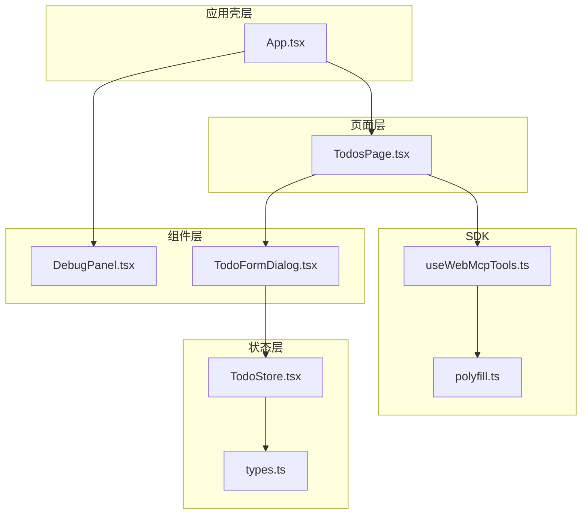
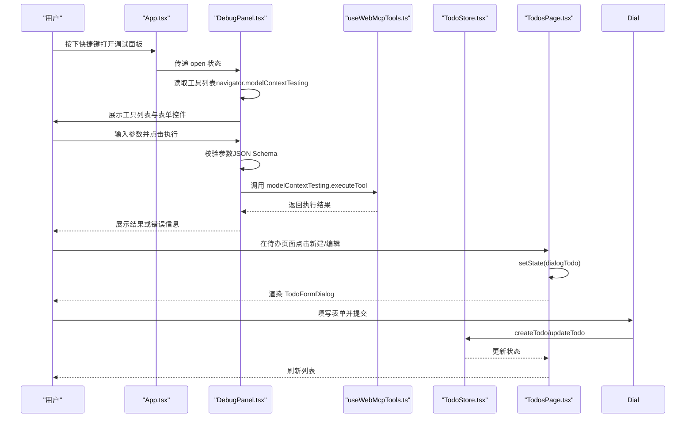
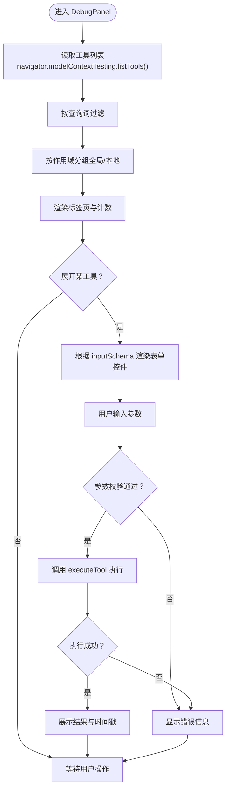
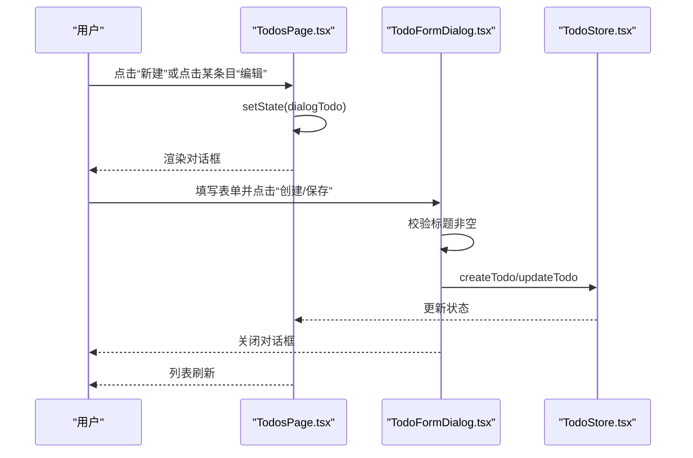
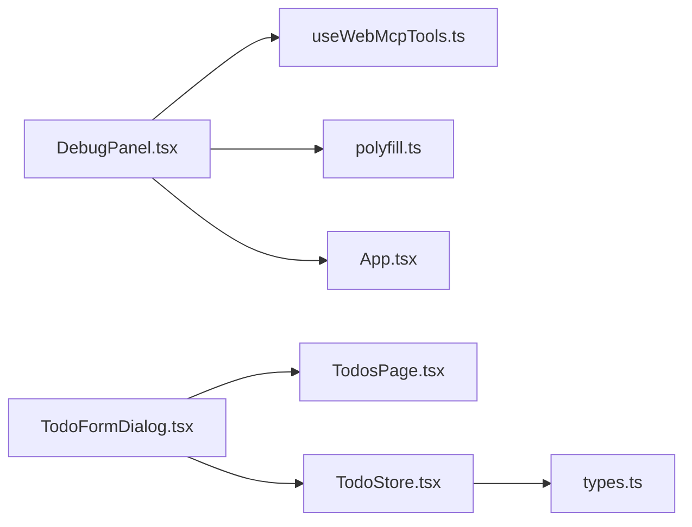

# 工具组件

<cite>
**本文档引用的文件**
- [DebugPanel.tsx](file://apps/demo/src/components/DebugPanel.tsx)
- [TodoFormDialog.tsx](file://apps/demo/src/components/TodoFormDialog.tsx)
- [App.tsx](file://apps/demo/src/App.tsx)
- [TodosPage.tsx](file://apps/demo/src/pages/TodosPage.tsx)
- [TodoStore.tsx](file://apps/demo/src/store/TodoStore.tsx)
- [types.ts](file://apps/demo/src/store/types.ts)
- [index.css](file://apps/demo/src/index.css)
- [useWebMcpTools.ts](file://packages/webmcp-sdk/src/useWebMcpTools.ts)
- [polyfill.ts](file://packages/webmcp-sdk/src/polyfill.ts)
</cite>

## 目录
1. [简介](#简介)
2. [项目结构](#项目结构)
3. [核心组件](#核心组件)
4. [架构总览](#架构总览)
5. [组件详细分析](#组件详细分析)
6. [依赖关系分析](#依赖关系分析)
7. [性能考量](#性能考量)
8. [故障排查指南](#故障排查指南)
9. [结论](#结论)
10. [附录](#附录)

## 简介
本文件聚焦演示应用中的两个通用工具组件：DebugPanel 调试面板与 TodoFormDialog 表单对话框。前者用于在运行时动态发现、配置并执行 WebMCP 工具，后者用于在待办页面中弹出表单以创建或编辑待办事项。文档将系统阐述它们的功能特性、实现模式、验证机制、集成方式以及在实际开发中的最佳实践与复用建议。

## 项目结构
这两个组件位于演示应用的前端代码中，分别承担“调试工具”和“表单交互”的职责：
- DebugPanel：位于组件目录，负责渲染调试面板、管理工具列表、表单输入与执行结果展示。
- TodoFormDialog：位于组件目录，负责待办表单的弹窗展示、字段绑定与提交处理。
- App：顶层壳层，负责调试面板的开关控制与布局联动。
- TodosPage：页面容器，负责将工具注册到 WebMCP，并在需要时渲染 TodoFormDialog。
- TodoStore：状态管理，提供 CRUD 与筛选等能力，供 TodoFormDialog 提交时调用。
- SDK：useWebMcpTools 与 polyfill 提供 WebMCP 工具注册与运行时环境保障。

图表来源
- [App.tsx:1-98](file://apps/demo/src/App.tsx#L1-L98)
- [TodosPage.tsx:1-185](file://apps/demo/src/pages/TodosPage.tsx#L1-L185)
- [DebugPanel.tsx:1-480](file://apps/demo/src/components/DebugPanel.tsx#L1-L480)
- [TodoFormDialog.tsx:1-126](file://apps/demo/src/components/TodoFormDialog.tsx#L1-L126)
- [TodoStore.tsx:1-289](file://apps/demo/src/store/TodoStore.tsx#L1-L289)
- [types.ts:1-74](file://apps/demo/src/store/types.ts#L1-L74)
- [useWebMcpTools.ts:1-136](file://packages/webmcp-sdk/src/useWebMcpTools.ts#L1-L136)
- [polyfill.ts:1-39](file://packages/webmcp-sdk/src/polyfill.ts#L1-L39)

章节来源
- [App.tsx:1-98](file://apps/demo/src/App.tsx#L1-L98)
- [TodosPage.tsx:1-185](file://apps/demo/src/pages/TodosPage.tsx#L1-L185)

## 核心组件
- DebugPanel：基于 WebMCP 运行时模型上下文动态列出工具，支持按名称/描述过滤、按作用域（全局/本地）分类、根据 JSON Schema 动态渲染表单控件、执行工具并展示结果或错误。
- TodoFormDialog：在待办页面中弹出对话框，支持新建/编辑待办，包含标题、描述、优先级、状态、截止时间等字段，具备基础必填校验与禁用逻辑。

章节来源
- [DebugPanel.tsx:97-393](file://apps/demo/src/components/DebugPanel.tsx#L97-L393)
- [TodoFormDialog.tsx:11-125](file://apps/demo/src/components/TodoFormDialog.tsx#L11-L125)

## 架构总览
DebugPanel 与 TodoFormDialog 分别服务于不同场景：
- DebugPanel：通过 SDK 将组件内的工具注册到 WebMCP，再由 DebugPanel 读取并执行。其内部维护工具列表、表单值、执行状态与计数器，支持防抖刷新与事件监听。
- TodoFormDialog：直接依赖 TodoStore 的 create/update 方法，通过页面容器 TodosPage 控制显示与隐藏。

图表来源
- [App.tsx:21-79](file://apps/demo/src/App.tsx#L21-L79)
- [DebugPanel.tsx:85-95](file://apps/demo/src/components/DebugPanel.tsx#L85-L95)
- [useWebMcpTools.ts:85-134](file://packages/webmcp-sdk/src/useWebMcpTools.ts#L85-L134)
- [TodoFormDialog.tsx:21-44](file://apps/demo/src/components/TodoFormDialog.tsx#L21-L44)
- [TodoStore.tsx:133-158](file://apps/demo/src/store/TodoStore.tsx#L133-L158)
- [TodosPage.tsx:179-181](file://apps/demo/src/pages/TodosPage.tsx#L179-L181)

## 组件详细分析

### DebugPanel 调试面板
- 功能特性
  - 工具发现与分类：从 navigator.modelContextTesting.listTools 读取工具，按描述中的“作用域：全局”标记区分全局与本地工具。
  - 动态表单渲染：依据工具 inputSchema 的 properties 与 type 自动渲染对应控件（枚举、布尔、数值、数组/对象 JSON 文本区等），并支持默认值与必填提示。
  - 参数校验与序列化：在执行前对必填字段、数值格式、布尔值、JSON 结构进行校验，失败时返回错误信息；成功则序列化为 JSON 字符串。
  - 执行与反馈：调用 navigator.modelContextTesting.executeTool 执行工具，展示执行状态、时间戳与结果或错误。
  - 交互与状态：支持搜索过滤、标签页切换、展开/折叠工具项、防抖刷新工具列表与 toolchange 事件计数。
- 设计模式
  - 函数式组件 + Hooks：使用 useState/useEffect/useMemo/useRef 管理状态与副作用。
  - 受控表单：每个字段通过 setFieldValue 更新 formValues，避免非受控状态漂移。
  - 事件驱动：监听 navigator.modelContext 的 toolchange 事件，结合防抖定时器更新工具列表与计数。
  - JSON Schema 驱动：通过 inputSchema 动态生成表单控件，降低硬编码耦合。
- 使用场景
  - 开发期快速验证工具接口与参数格式。
  - 页面/组件级工具的可视化调试与演示。
  - 与 SDK 的 useWebMcpTools 协同，实现“组件作用域工具”的注册与发现。
- 最佳实践
  - 保持 inputSchema 的完整性与准确性，便于自动生成表单与校验。
  - 对可能触发页面跳转的工具，注意捕获返回值并提示用户。
  - 合理使用防抖与节流，避免频繁刷新导致性能问题。
  - 为复杂参数提供占位符与描述，提升可读性与易用性。

图表来源
- [DebugPanel.tsx:42-61](file://apps/demo/src/components/DebugPanel.tsx#L42-L61)
- [DebugPanel.tsx:140-155](file://apps/demo/src/components/DebugPanel.tsx#L140-L155)
- [DebugPanel.tsx:167-203](file://apps/demo/src/components/DebugPanel.tsx#L167-L203)
- [DebugPanel.tsx:205-235](file://apps/demo/src/components/DebugPanel.tsx#L205-L235)

章节来源
- [DebugPanel.tsx:1-480](file://apps/demo/src/components/DebugPanel.tsx#L1-L480)
- [useWebMcpTools.ts:46-134](file://packages/webmcp-sdk/src/useWebMcpTools.ts#L46-L134)
- [polyfill.ts:16-26](file://packages/webmcp-sdk/src/polyfill.ts#L16-L26)

### TodoFormDialog 表单对话框
- 功能特性
  - 支持新建与编辑两种模式：根据是否传入 todo 决定标题与按钮文案。
  - 字段覆盖：标题必填、描述可空、优先级与状态枚举、截止时间可空。
  - 提交逻辑：阻止默认行为，校验标题非空后调用 TodoStore 的 create/update，最后关闭对话框。
  - UI 交互：遮罩层点击关闭、表单内点击冒泡阻止事件冒泡、提交按钮根据标题是否为空启用/禁用。
- 设计模式
  - 受控组件：每个字段使用独立的 useState 管理，onChange 直接更新状态。
  - 单一职责：对话框仅负责表单渲染与提交，具体业务逻辑委托给 TodoStore。
  - 条件渲染：根据 isEdit 切换标题与按钮文案，减少分支复杂度。
- 使用场景
  - 待办列表的新增与编辑入口。
  - 与 TodosPage 的状态联动，实现弹窗的打开/关闭。
- 最佳实践
  - 在提交前进行必要的字段清理（如 trim），避免脏数据。
  - 对于可空字段，显式传入 null 或空字符串，保持数据一致性。
  - 为必填字段提供明确的视觉提示与禁用策略，改善用户体验。

图表来源
- [TodosPage.tsx:179-181](file://apps/demo/src/pages/TodosPage.tsx#L179-L181)
- [TodoFormDialog.tsx:21-44](file://apps/demo/src/components/TodoFormDialog.tsx#L21-L44)
- [TodoStore.tsx:133-158](file://apps/demo/src/store/TodoStore.tsx#L133-L158)

章节来源
- [TodoFormDialog.tsx:1-126](file://apps/demo/src/components/TodoFormDialog.tsx#L1-L126)
- [TodosPage.tsx:1-185](file://apps/demo/src/pages/TodosPage.tsx#L1-L185)
- [TodoStore.tsx:1-289](file://apps/demo/src/store/TodoStore.tsx#L1-L289)
- [types.ts:1-74](file://apps/demo/src/store/types.ts#L1-L74)

## 依赖关系分析
- DebugPanel 依赖
  - SDK：useWebMcpTools 用于将工具注册到 WebMCP，DebugPanel 通过 navigator.modelContextTesting 读取与执行。
  - polyfill：确保 navigator.modelContext 与 modelContextTesting 在非浏览器或缺失环境下可用。
  - App：通过键盘快捷键控制 DebugPanel 的开合，并在布局上为面板留出空间。
- TodoFormDialog 依赖
  - TodosPage：控制对话框的显示与隐藏，传递 todo 数据。
  - TodoStore：提供 createTodo/updateTodo 等方法，承载业务逻辑。
  - types：提供优先级与状态的枚举与标签映射，保证 UI 与数据一致。

图表来源
- [DebugPanel.tsx:117-138](file://apps/demo/src/components/DebugPanel.tsx#L117-L138)
- [useWebMcpTools.ts:85-134](file://packages/webmcp-sdk/src/useWebMcpTools.ts#L85-L134)
- [polyfill.ts:16-26](file://packages/webmcp-sdk/src/polyfill.ts#L16-L26)
- [App.tsx:21-79](file://apps/demo/src/App.tsx#L21-L79)
- [TodoFormDialog.tsx:11-125](file://apps/demo/src/components/TodoFormDialog.tsx#L11-L125)
- [TodosPage.tsx:179-181](file://apps/demo/src/pages/TodosPage.tsx#L179-L181)
- [TodoStore.tsx:1-289](file://apps/demo/src/store/TodoStore.tsx#L1-L289)
- [types.ts:1-74](file://apps/demo/src/store/types.ts#L1-L74)

章节来源
- [DebugPanel.tsx:1-480](file://apps/demo/src/components/DebugPanel.tsx#L1-L480)
- [TodoFormDialog.tsx:1-126](file://apps/demo/src/components/TodoFormDialog.tsx#L1-L126)
- [App.tsx:1-98](file://apps/demo/src/App.tsx#L1-L98)
- [TodosPage.tsx:1-185](file://apps/demo/src/pages/TodosPage.tsx#L1-L185)
- [TodoStore.tsx:1-289](file://apps/demo/src/store/TodoStore.tsx#L1-L289)
- [types.ts:1-74](file://apps/demo/src/store/types.ts#L1-L74)
- [useWebMcpTools.ts:1-136](file://packages/webmcp-sdk/src/useWebMcpTools.ts#L1-L136)
- [polyfill.ts:1-39](file://packages/webmcp-sdk/src/polyfill.ts#L1-L39)

## 性能考量
- DebugPanel
  - 工具列表刷新：每 250ms 轮询一次，同时监听 toolchange 事件并使用 300ms 防抖合并多次变更，避免频繁重渲染。
  - 计算优化：分组与排序在 useMemo 中缓存，查询匹配在小数据集上开销可控。
  - DOM 体积：展开/折叠采用条件渲染，仅渲染当前激活作用域的列表。
- TodoFormDialog
  - 表单状态：字段使用独立状态，提交前一次性校验，避免重复渲染。
  - 事件冒泡：表单内点击阻止冒泡，减少不必要的事件处理。
- 通用建议
  - 对高频输入字段使用节流/防抖。
  - 对大列表采用虚拟滚动或分页。
  - 合理拆分组件，避免不必要的重渲染。

## 故障排查指南
- DebugPanel 无法加载工具
  - 检查 navigator.modelContextTesting 是否存在，若不存在请确保 SDK polyfill 已初始化。
  - 确认工具已通过 useWebMcpTools 注册且带有 __webmcpSchema。
  - 查看 toolchange 事件计数是否递增，确认工具注册/注销流程正常。
- 执行工具报错
  - 参数校验失败：检查必填字段、数值格式、JSON 结构是否正确。
  - 执行异常：查看错误信息中的堆栈与消息，定位工具实现问题。
- TodoFormDialog 提交无效
  - 标题为空：提交按钮禁用，需先填写标题。
  - 状态未更新：确认 TodoStore 的 create/update 是否被调用，以及页面是否重新渲染。
- 样式与布局问题
  - 调试面板未显示：检查 App 的调试开关状态与 CSS 类名（如 debug-shifted）。
  - 对话框遮罩层：确认点击遮罩层可关闭，表单内点击不会关闭。

章节来源
- [DebugPanel.tsx:85-95](file://apps/demo/src/components/DebugPanel.tsx#L85-L95)
- [DebugPanel.tsx:117-138](file://apps/demo/src/components/DebugPanel.tsx#L117-L138)
- [TodoFormDialog.tsx:21-44](file://apps/demo/src/components/TodoFormDialog.tsx#L21-L44)
- [index.css:563-786](file://apps/demo/src/index.css#L563-L786)

## 结论
DebugPanel 与 TodoFormDialog 代表了两类典型的通用工具组件：前者专注于“运行时工具的可视化调试”，后者专注于“数据变更的受控表单交互”。二者均遵循单一职责、可复用与可定制的原则，通过 SDK 与状态管理实现与应用生态的无缝集成。在实际开发中，建议优先完善工具的 JSON Schema 与只读标记，规范表单校验与数据清理流程，并结合防抖与缓存策略提升性能与体验。

## 附录
- 复用与定制化建议
  - DebugPanel
    - 将工具注册抽象为独立 Hook，便于在多页面/多组件中复用。
    - 支持自定义工具图标、分组标签与执行历史记录。
    - 增加工具分类与权限控制，适配多角色场景。
  - TodoFormDialog
    - 抽象为通用 FormDialog 组件，通过 props 接收字段定义与校验规则。
    - 支持多语言与无障碍访问（ARIA）增强。
    - 提供默认值与回退策略，提升健壮性。
- 与 SDK 的协作
  - 使用 useWebMcpTools 注册工具时，务必提供完整的 __webmcpSchema，包括 description、inputSchema 与 readOnly 标记。
  - 在组件卸载时自动注销工具，避免内存泄漏与重复注册。