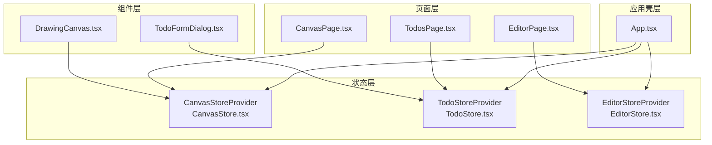
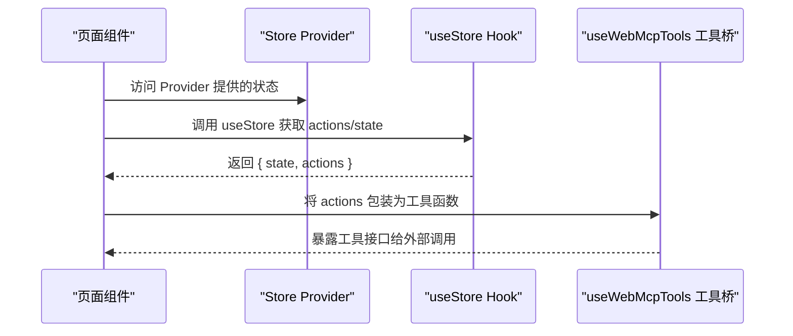
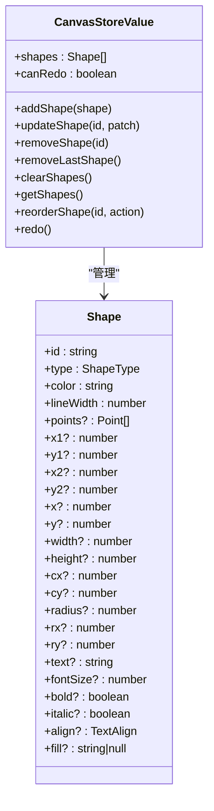
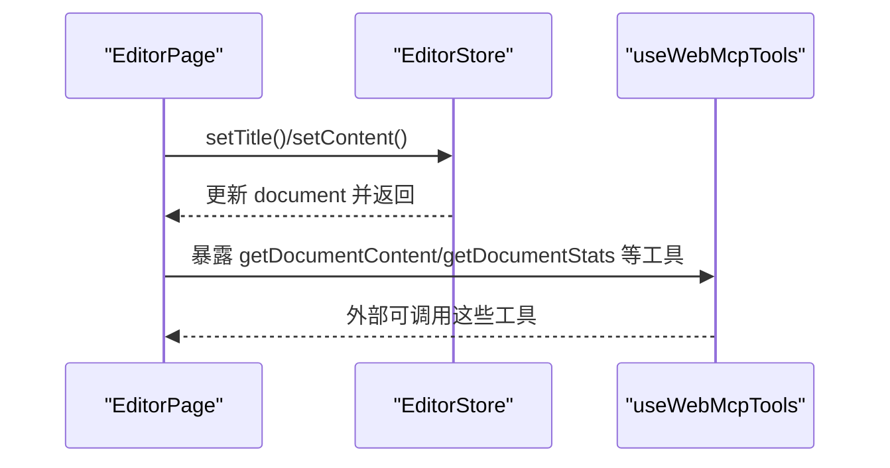
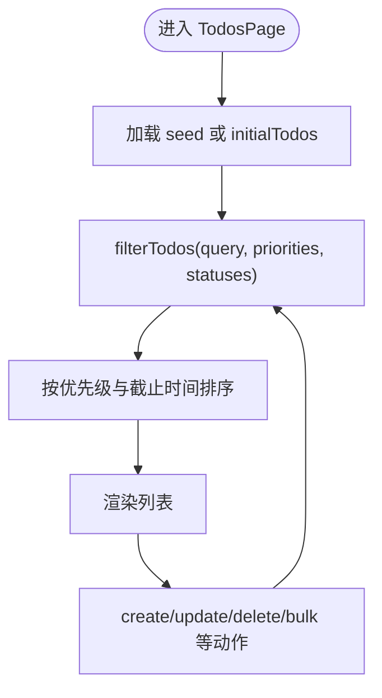
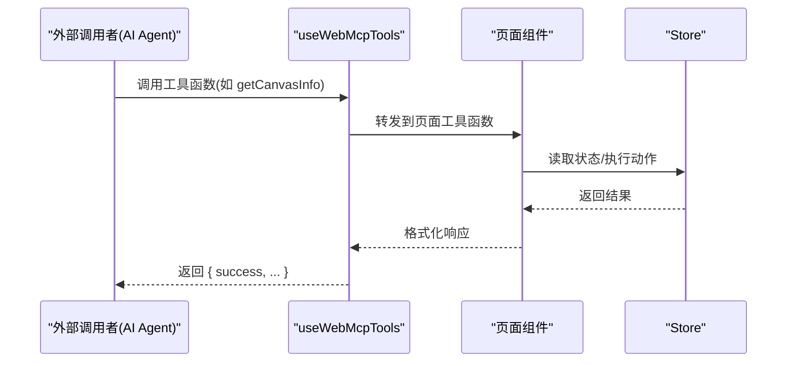
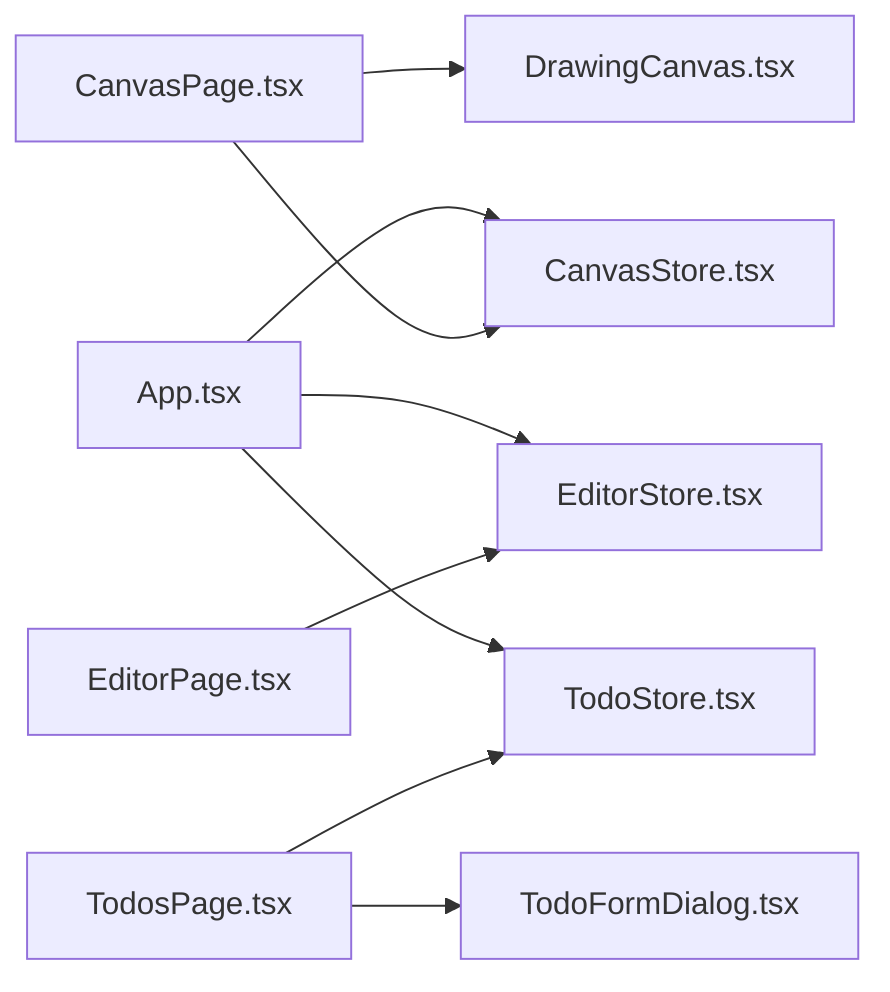

# 状态管理

<cite>
**本文引用的文件**
- [CanvasStore.tsx](file://apps/demo/src/store/CanvasStore.tsx)
- [EditorStore.tsx](file://apps/demo/src/store/EditorStore.tsx)
- [TodoStore.tsx](file://apps/demo/src/store/TodoStore.tsx)
- [types.ts](file://apps/demo/src/store/types.ts)
- [mockData.ts](file://apps/demo/src/store/mockData.ts)
- [CanvasPage.tsx](file://apps/demo/src/pages/CanvasPage.tsx)
- [EditorPage.tsx](file://apps/demo/src/pages/EditorPage.tsx)
- [TodosPage.tsx](file://apps/demo/src/pages/TodosPage.tsx)
- [App.tsx](file://apps/demo/src/App.tsx)
- [DrawingCanvas.tsx](file://apps/demo/src/components/canvas/DrawingCanvas.tsx)
- [TodoFormDialog.tsx](file://apps/demo/src/components/TodoFormDialog.tsx)
- [navigation-bridge.ts](file://apps/demo/src/tools/navigation-bridge.ts)
</cite>

## 目录
1. [简介](#简介)
2. [项目结构](#项目结构)
3. [核心组件](#核心组件)
4. [架构总览](#架构总览)
5. [详细组件分析](#详细组件分析)
6. [依赖关系分析](#依赖关系分析)
7. [性能考量](#性能考量)
8. [故障排查指南](#故障排查指南)
9. [结论](#结论)
10. [附录](#附录)

## 简介
本文件系统性解析演示应用的状态管理模式，重点覆盖以下方面：
- CanvasStore、EditorStore、TodoStore 的状态设计与数据流
- Store 中间件（基于 useWebMcpTools 的工具桥接）的实现原理与使用方法
- 类型定义与模拟数据的作用与边界
- 最佳实践与性能优化建议
- 状态持久化与跨组件通信的可行方案

## 项目结构
演示应用采用“按页面/功能模块划分”的组织方式，状态管理集中在 store 目录，页面组件通过上下文 Provider 提供状态，并在页面中以工具函数的形式暴露给外部（如 AI Agent）。

图表来源
- [App.tsx:37-79](file://apps/demo/src/App.tsx#L37-L79)
- [CanvasStore.tsx:29-165](file://apps/demo/src/store/CanvasStore.tsx#L29-L165)
- [EditorStore.tsx:83-108](file://apps/demo/src/store/EditorStore.tsx#L83-L108)
- [TodoStore.tsx:124-280](file://apps/demo/src/store/TodoStore.tsx#L124-L280)
- [CanvasPage.tsx:8-596](file://apps/demo/src/pages/CanvasPage.tsx#L8-L596)
- [EditorPage.tsx:8-559](file://apps/demo/src/pages/EditorPage.tsx#L8-L559)
- [TodosPage.tsx:8-185](file://apps/demo/src/pages/TodosPage.tsx#L8-L185)
- [DrawingCanvas.tsx:207-659](file://apps/demo/src/components/canvas/DrawingCanvas.tsx#L207-L659)
- [TodoFormDialog.tsx:11-126](file://apps/demo/src/components/TodoFormDialog.tsx#L11-L126)

章节来源
- [App.tsx:37-79](file://apps/demo/src/App.tsx#L37-L79)

## 核心组件
- CanvasStore：负责画布图形集合的增删改查、重排、撤销/重做、查询等能力，提供稳定的形状 ID 生成策略与 redo 栈维护。
- EditorStore：负责富文本编辑器文档的标题与内容管理，提供初始内容与重置能力。
- TodoStore：负责待办事项的 CRUD、批量操作、筛选排序、按优先级与截止日期排序等，内置 mock 数据作为种子。

章节来源
- [CanvasStore.tsx:14-172](file://apps/demo/src/store/CanvasStore.tsx#L14-L172)
- [EditorStore.tsx:18-115](file://apps/demo/src/store/EditorStore.tsx#L18-L115)
- [TodoStore.tsx:93-289](file://apps/demo/src/store/TodoStore.tsx#L93-L289)

## 架构总览
状态管理采用 React Context + 自定义 Hook 的模式，每个 Store 以 Provider 形式注入全局，页面组件通过 useStore 消费状态与动作。页面还通过 useWebMcpTools 将内部状态操作封装为工具函数，供外部（如 AI Agent）调用。

图表来源
- [CanvasPage.tsx:540-560](file://apps/demo/src/pages/CanvasPage.tsx#L540-L560)
- [EditorPage.tsx:522-546](file://apps/demo/src/pages/EditorPage.tsx#L522-L546)
- [TodosPage.tsx:116-129](file://apps/demo/src/pages/TodosPage.tsx#L116-L129)

## 详细组件分析

### CanvasStore：画布状态与工具链
- 状态结构
  - shapes：图形数组，每条记录包含几何参数、样式与文本信息
  - redoStack：撤销栈，支持 redo 操作
  - idCounter：稳定 ID 生成器，避免重复与冲突
- 主要能力
  - 添加/更新/删除图形
  - 删除最后一条、清空画布
  - 查询图形、重排（置顶/置底/上移/下移）
  - 撤销与重做
- 设计要点
  - 使用 useCallback 包裹动作，减少子组件重渲染
  - 使用 useMemo 包裹 value，确保引用稳定
  - 重排与撤销/重做相互影响，保持 redo 栈一致性
- 页面集成
  - CanvasPage 将大量工具函数（如绘制、移动、重排、导出等）通过 useWebMcpTools 暴露给外部
  - DrawingCanvas 作为可视化渲染层，直接消费 useCanvasStore 的状态与动作

图表来源
- [CanvasStore.tsx:14-172](file://apps/demo/src/store/CanvasStore.tsx#L14-L172)
- [types.ts:46-71](file://apps/demo/src/store/types.ts#L46-L71)

章节来源
- [CanvasStore.tsx:29-165](file://apps/demo/src/store/CanvasStore.tsx#L29-L165)
- [CanvasPage.tsx:8-596](file://apps/demo/src/pages/CanvasPage.tsx#L8-L596)
- [DrawingCanvas.tsx:207-659](file://apps/demo/src/components/canvas/DrawingCanvas.tsx#L207-L659)

### EditorStore：富文本编辑器状态
- 状态结构
  - document：包含 id、title、content、createdAt、updatedAt
  - content 采用 Tiptap JSON 结构，便于序列化与传输
- 主要能力
  - 设置标题、设置内容、重置文档
  - 初始内容来自常量模板，便于演示
- 设计要点
  - 使用 useCallback 包裹 setter，避免不必要的重渲染
  - updatedAt 自动更新，便于外部感知变更

图表来源
- [EditorStore.tsx:83-108](file://apps/demo/src/store/EditorStore.tsx#L83-L108)
- [EditorPage.tsx:24-546](file://apps/demo/src/pages/EditorPage.tsx#L24-L546)

章节来源
- [EditorStore.tsx:18-115](file://apps/demo/src/store/EditorStore.tsx#L18-L115)
- [EditorPage.tsx:8-559](file://apps/demo/src/pages/EditorPage.tsx#L8-L559)

### TodoStore：待办事项状态与筛选
- 状态结构
  - todos：待办数组，包含优先级、状态、截止时间等
- 主要能力
  - 单条/批量 CRUD、状态切换、优先级调整、截止时间设置
  - 搜索过滤（关键词、优先级、状态），并按优先级与截止时间排序
  - 通过 seed 注入初始数据（mockData）
- 设计要点
  - 使用 useRef 维护 idCounter，保证唯一性
  - 过滤与排序逻辑集中于 filterTodos，便于复用
  - 批量操作使用 Set 优化查找效率

图表来源
- [TodoStore.tsx:124-280](file://apps/demo/src/store/TodoStore.tsx#L124-L280)
- [TodosPage.tsx:25-94](file://apps/demo/src/pages/TodosPage.tsx#L25-L94)
- [mockData.ts:16-99](file://apps/demo/src/store/mockData.ts#L16-L99)

章节来源
- [TodoStore.tsx:93-289](file://apps/demo/src/store/TodoStore.tsx#L93-L289)
- [TodosPage.tsx:8-185](file://apps/demo/src/pages/TodosPage.tsx#L8-L185)
- [TodoFormDialog.tsx:11-126](file://apps/demo/src/components/TodoFormDialog.tsx#L11-L126)

### Store 中间件：useWebMcpTools 工具桥
- 作用
  - 将 Store 的 actions 包装为“工具函数”，供外部（如 AI Agent）调用
  - 统一返回结构（success、result、错误信息等），便于上层处理
- 使用方式
  - 在页面组件中调用 useWebMcpTools，传入一组工具函数
  - 工具函数内部可直接访问 useStore 返回的状态与动作
- 优势
  - 解耦 UI 与外部调用者，统一协议
  - 易于扩展新的工具函数，无需改动 UI

图表来源
- [CanvasPage.tsx:540-560](file://apps/demo/src/pages/CanvasPage.tsx#L540-L560)
- [EditorPage.tsx:522-546](file://apps/demo/src/pages/EditorPage.tsx#L522-L546)
- [TodosPage.tsx:116-129](file://apps/demo/src/pages/TodosPage.tsx#L116-L129)

章节来源
- [CanvasPage.tsx:540-560](file://apps/demo/src/pages/CanvasPage.tsx#L540-L560)
- [EditorPage.tsx:522-546](file://apps/demo/src/pages/EditorPage.tsx#L522-L546)
- [TodosPage.tsx:116-129](file://apps/demo/src/pages/TodosPage.tsx#L116-L129)

### 类型定义与模拟数据
- 类型定义（types.ts）
  - Todo 与 TodoStatus/Priority 的枚举与标签映射
  - Shape 与 ShapeType 的完整结构，覆盖常见图形参数
- 模拟数据（mockData.ts）
  - initialTodos：预置的待办数据，包含不同优先级、状态与截止时间
  - 通过 seed 注入 TodoStore，作为初始状态

章节来源
- [types.ts:1-72](file://apps/demo/src/store/types.ts#L1-L72)
- [mockData.ts:16-99](file://apps/demo/src/store/mockData.ts#L16-L99)

## 依赖关系分析
- 上下文依赖
  - App.tsx 逐层包裹三个 Provider，形成全局状态树
- 组件依赖
  - CanvasPage 依赖 CanvasStore 与 DrawingCanvas
  - EditorPage 依赖 EditorStore 与富文本编辑器组件
  - TodosPage 依赖 TodoStore 与 TodoFormDialog
- 工具桥依赖
  - useWebMcpTools 将页面工具函数与 Store 动作解耦，形成统一外部接口

图表来源
- [App.tsx:37-79](file://apps/demo/src/App.tsx#L37-L79)
- [CanvasPage.tsx:8-596](file://apps/demo/src/pages/CanvasPage.tsx#L8-L596)
- [EditorPage.tsx:8-559](file://apps/demo/src/pages/EditorPage.tsx#L8-L559)
- [TodosPage.tsx:8-185](file://apps/demo/src/pages/TodosPage.tsx#L8-L185)

章节来源
- [App.tsx:37-79](file://apps/demo/src/App.tsx#L37-L79)

## 性能考量
- 状态粒度与引用稳定性
  - 使用 useMemo 包裹 Provider 暴露的 value，避免子组件因引用变化而重渲染
  - 使用 useCallback 包裹动作，减少闭包重建
- 渲染优化
  - CanvasStore 的 shapes 变更通过最小化重绘（仅重绘受影响区域）降低开销
  - DrawingCanvas 使用设备像素比适配与 ResizeObserver 控制重绘频率
- 计算复杂度
  - filterTodos 与排序在小规模数据集（mockData）下开销可控；若数据量增大，建议：
    - 增加分页或虚拟滚动
    - 使用索引字段（如 status/priority/dueDate）加速过滤
    - 将排序结果缓存并在状态变更时增量更新
- 工具函数返回结构
  - 统一返回 { success, ... }，便于上层快速判断与短路处理，减少无效渲染

[本节为通用性能建议，不直接分析具体文件]

## 故障排查指南
- “useStore 必须在 Provider 内使用”错误
  - 症状：调用 useCanvasStore/useEditorStore/useTodoStore 抛出异常
  - 排查：确认 App.tsx 中对应 Provider 已正确包裹目标页面
- 画布导出失败
  - 症状：getCanvasSnapshot/exportCanvas 返回空或失败
  - 排查：检查 DOM 节点是否存在、设备像素比、画布尺寸是否为 0
- 富文本工具不可用
  - 症状：getDocumentContent/undo/redo 等工具返回 editor not ready
  - 排查：确认 EditorPage 的编辑器已就绪（handleEditorReady），再调用工具
- 待办筛选异常
  - 症状：filterTodos 结果不符合预期
  - 排查：确认输入的关键词、优先级、状态数组是否为空或非法

章节来源
- [CanvasStore.tsx:167-171](file://apps/demo/src/store/CanvasStore.tsx#L167-L171)
- [EditorPage.tsx:13-16](file://apps/demo/src/pages/EditorPage.tsx#L13-L16)
- [CanvasPage.tsx:393-431](file://apps/demo/src/pages/CanvasPage.tsx#L393-L431)

## 结论
该演示应用采用清晰的“上下文 + 自定义 Hook + 工具桥”模式实现状态管理：
- CanvasStore、EditorStore、TodoStore 各司其职，职责边界明确
- 通过 useWebMcpTools 将内部状态操作抽象为工具接口，便于外部调用
- 类型定义与模拟数据提升了开发体验与演示效果
- 在小规模数据场景下性能表现良好，具备进一步优化空间（分页、缓存、索引）

## 附录

### 状态持久化与跨组件通信方案
- 状态持久化
  - 画布与富文本：可将 JSON 序列化后的状态写入 localStorage/sessionStorage，在应用启动时恢复
  - 待办：可将 todos 与排序/筛选条件持久化，结合 seed 注入
- 跨组件通信
  - 通过 App.tsx 的 Provider 层级共享状态，避免深层传递 props
  - 使用 navigation-bridge.ts 的 navigateRef 与路由联动，实现跨页面导航与状态同步

章节来源
- [navigation-bridge.ts:1-8](file://apps/demo/src/tools/navigation-bridge.ts#L1-L8)
- [App.tsx:12-19](file://apps/demo/src/App.tsx#L12-L19)