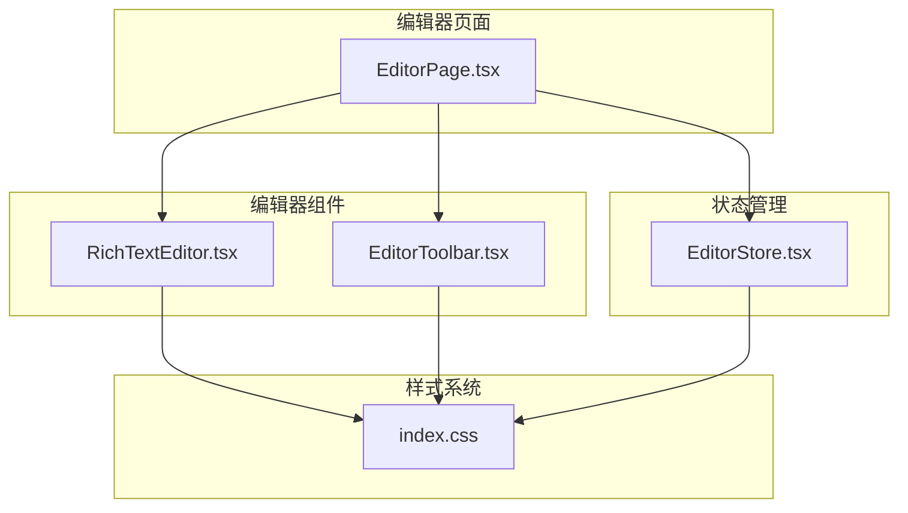
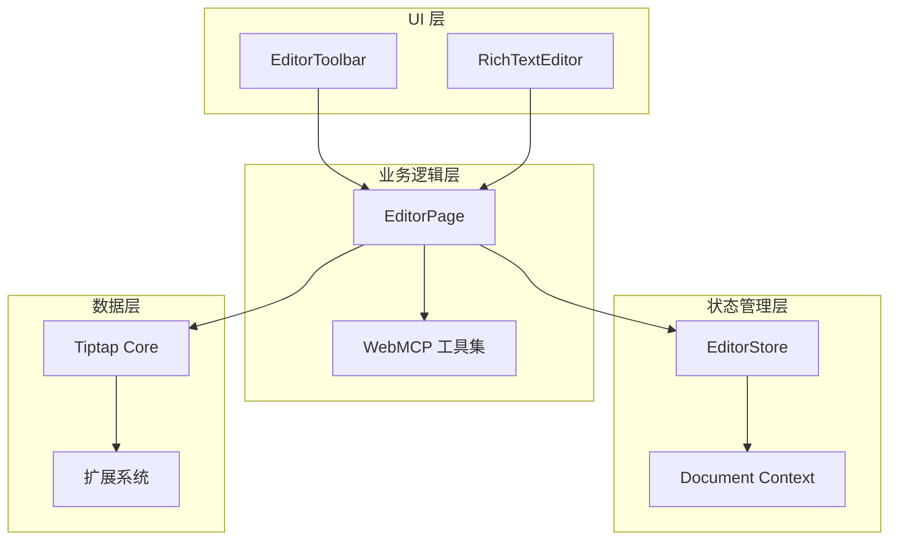
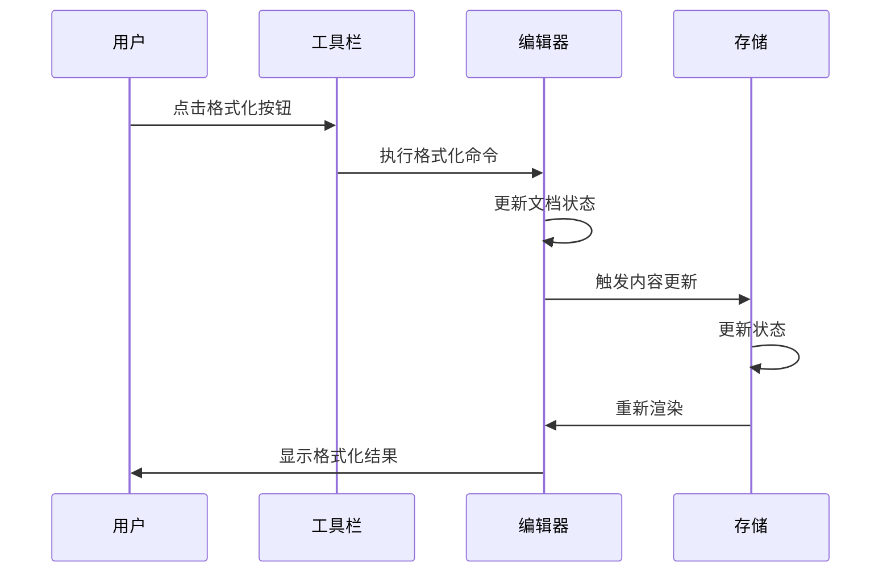
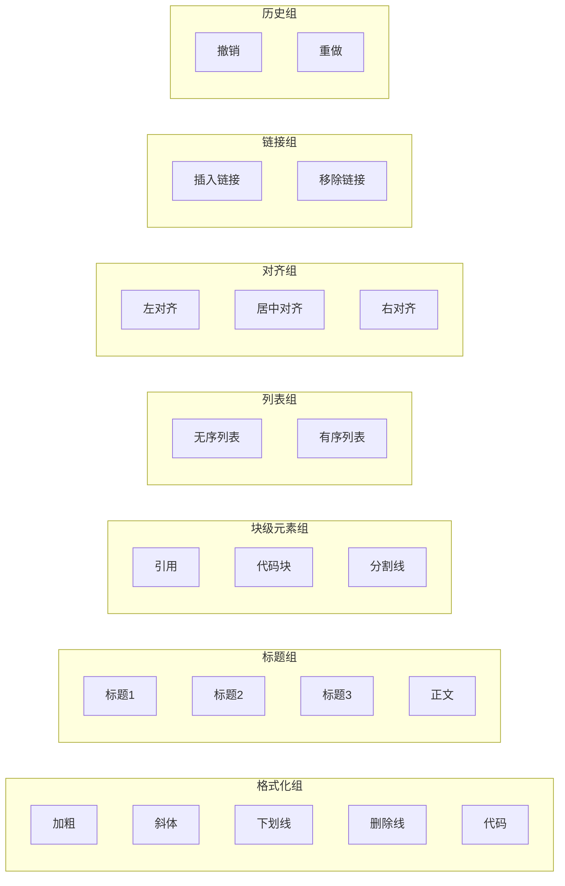
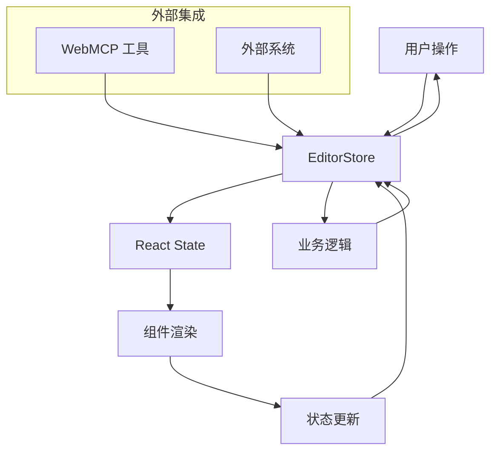
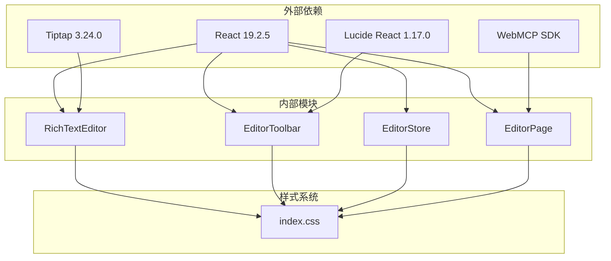

# 编辑器组件

<cite>
**本文档引用的文件**
- [RichTextEditor.tsx](file://apps/demo/src/components/editor/RichTextEditor.tsx)
- [EditorToolbar.tsx](file://apps/demo/src/components/editor/EditorToolbar.tsx)
- [EditorStore.tsx](file://apps/demo/src/store/EditorStore.tsx)
- [EditorPage.tsx](file://apps/demo/src/pages/EditorPage.tsx)
- [index.css](file://apps/demo/src/index.css)
- [package.json](file://apps/demo/package.json)
</cite>

## 目录
1. [简介](#简介)
2. [项目结构](#项目结构)
3. [核心组件](#核心组件)
4. [架构概览](#架构概览)
5. [详细组件分析](#详细组件分析)
6. [依赖关系分析](#依赖关系分析)
7. [性能考虑](#性能考虑)
8. [故障排除指南](#故障排除指南)
9. [结论](#结论)

## 简介

WebMCP Nexus 富文本编辑器是一个基于 Tiptap 的现代化编辑器解决方案，集成了 AI Agent 工具驱动的内容创作能力。该编辑器提供了完整的富文本编辑功能，包括内容编辑、格式化和 DOM 操作，并通过 WebMCP SDK 实现了与 AI Agent 的无缝集成。

编辑器系统采用模块化设计，包含独立的富文本编辑器组件、工具栏组件以及状态管理机制。通过使用 Tiptap 的 React 绑定和扩展系统，实现了高度可定制的编辑体验。

## 项目结构

编辑器组件位于应用的 demo 包中，采用清晰的分层组织：

**图表来源**
- [EditorPage.tsx:1-559](file://apps/demo/src/pages/EditorPage.tsx#L1-L559)
- [RichTextEditor.tsx:1-48](file://apps/demo/src/components/editor/RichTextEditor.tsx#L1-L48)
- [EditorToolbar.tsx:1-144](file://apps/demo/src/components/editor/EditorToolbar.tsx#L1-L144)

**章节来源**
- [EditorPage.tsx:1-559](file://apps/demo/src/pages/EditorPage.tsx#L1-L559)
- [package.json:16-28](file://apps/demo/package.json#L16-L28)

## 核心组件

### 富文本编辑器 (RichTextEditor)

RichTextEditor 是编辑器的核心组件，基于 Tiptap React 绑定构建。它负责：

- **内容渲染**：使用 EditorContent 组件渲染编辑器内容
- **扩展配置**：集成多种 Tiptap 扩展以提供丰富的编辑功能
- **状态同步**：通过 onUpdate 回调与父组件同步内容变化
- **生命周期管理**：通过 onEditorReady 提供编辑器实例访问

### 编辑器工具栏 (EditorToolbar)

EditorToolbar 提供直观的格式化工具界面，包含：

- **文本格式化**：加粗、斜体、下划线、删除线、代码
- **标题层级**：支持 1-6 级标题
- **块级元素**：引用、代码块、分割线
- **列表功能**：有序列表和无序列表
- **对齐控制**：左对齐、居中、右对齐
- **链接管理**：插入和移除链接
- **撤销重做**：完整的版本控制功能

### 状态存储 (EditorStore)

EditorStore 提供全局状态管理，包括：

- **文档模型**：完整的编辑文档结构
- **标题管理**：文档标题的设置和更新
- **内容管理**：文档内容的增删改查
- **时间戳管理**：创建和更新时间的自动维护

**章节来源**
- [RichTextEditor.tsx:10-47](file://apps/demo/src/components/editor/RichTextEditor.tsx#L10-L47)
- [EditorToolbar.tsx:27-143](file://apps/demo/src/components/editor/EditorToolbar.tsx#L27-L143)
- [EditorStore.tsx:10-115](file://apps/demo/src/store/EditorStore.tsx#L10-L115)

## 架构概览

编辑器系统采用分层架构设计，确保组件间的松耦合和高内聚：

**图表来源**
- [EditorPage.tsx:1-559](file://apps/demo/src/pages/EditorPage.tsx#L1-L559)
- [EditorStore.tsx:81-108](file://apps/demo/src/store/EditorStore.tsx#L81-L108)
- [RichTextEditor.tsx:17-38](file://apps/demo/src/components/editor/RichTextEditor.tsx#L17-L38)

系统的关键特性包括：

- **响应式设计**：支持移动端和桌面端的自适应布局
- **无障碍支持**：完整的键盘导航和屏幕阅读器支持
- **国际化**：多语言界面支持
- **主题系统**：可定制的颜色方案和字体配置

## 详细组件分析

### 富文本编辑器实现原理

RichTextEditor 组件基于 Tiptap 的 React 绑定，实现了以下核心功能：

#### 内容编辑机制

编辑器通过 Tiptap 的命令系统实现内容操作：

**图表来源**
- [EditorToolbar.tsx:75-143](file://apps/demo/src/components/editor/EditorToolbar.tsx#L75-L143)
- [RichTextEditor.tsx:35-37](file://apps/demo/src/components/editor/RichTextEditor.tsx#L35-L37)

#### 格式化系统

编辑器支持多种文本格式化选项：

| 格式类型 | 功能描述 | 快捷键 | 使用场景 |
|---------|----------|--------|----------|
| 加粗 | 粗体文本显示 | Ctrl+B | 强调重要信息 |
| 斜体 | 斜体文本显示 | Ctrl+I | 引用或强调 |
| 下划线 | 下划线文本 | Ctrl+U | 特殊标记 |
| 删除线 | 删除线文本 | Ctrl+Shift+X | 过时内容 |
| 行内代码 | 等宽字体显示 | Ctrl+Shift+C | 代码片段 |

#### DOM 操作策略

编辑器采用 Tiptap 的虚拟 DOM 技术，通过以下方式管理 DOM：

- **增量更新**：仅更新发生变化的部分
- **状态同步**：保持内存状态与 DOM 的一致性
- **事件处理**：统一的事件冒泡和捕获机制
- **焦点管理**：智能的光标位置跟踪

**章节来源**
- [RichTextEditor.tsx:17-38](file://apps/demo/src/components/editor/RichTextEditor.tsx#L17-L38)
- [EditorToolbar.tsx:81-140](file://apps/demo/src/components/editor/EditorToolbar.tsx#L81-L140)

### 编辑器工具栏功能分析

EditorToolbar 提供了完整的编辑工具集，每个按钮都经过精心设计：

#### 工具栏布局设计

**图表来源**
- [EditorToolbar.tsx:78-142](file://apps/demo/src/components/editor/EditorToolbar.tsx#L78-L142)

#### 交互设计模式

工具栏采用了现代的交互设计理念：

- **悬停提示**：提供即时的工具说明
- **状态指示**：通过激活状态显示当前格式
- **禁用处理**：根据上下文智能启用/禁用按钮
- **无障碍支持**：完整的键盘导航和屏幕阅读器支持

**章节来源**
- [EditorToolbar.tsx:31-71](file://apps/demo/src/components/editor/EditorToolbar.tsx#L31-L71)
- [EditorToolbar.tsx:75-143](file://apps/demo/src/components/editor/EditorToolbar.tsx#L75-L143)

### 状态管理机制

编辑器采用 React Context 和自定义 Hook 实现状态管理：

#### 数据流架构

**图表来源**
- [EditorStore.tsx:83-108](file://apps/demo/src/store/EditorStore.tsx#L83-L108)
- [EditorPage.tsx:522-546](file://apps/demo/src/pages/EditorPage.tsx#L522-L546)

#### 数据绑定策略

编辑器实现了双向数据绑定机制：

- **单向数据流**：从状态到 UI 的数据传递
- **事件驱动**：从 UI 到状态的事件处理
- **状态持久化**：自动保存文档状态
- **并发安全**：防止竞态条件和状态冲突

**章节来源**
- [EditorStore.tsx:18-101](file://apps/demo/src/store/EditorStore.tsx#L18-L101)
- [EditorPage.tsx:8-16](file://apps/demo/src/pages/EditorPage.tsx#L8-L16)

## 依赖关系分析

编辑器系统的依赖关系体现了清晰的分层架构：

**图表来源**
- [package.json:16-28](file://apps/demo/package.json#L16-L28)
- [EditorPage.tsx:1-7](file://apps/demo/src/pages/EditorPage.tsx#L1-L7)

### 关键依赖特性

| 依赖包 | 版本 | 主要功能 | 用途 |
|--------|------|----------|------|
| @tiptap/react | ^3.24.0 | React 绑定 | 编辑器核心 |
| @tiptap/starter-kit | ^3.24.0 | 基础扩展 | 默认功能 |
| @tiptap/extension-link | ^3.24.0 | 链接支持 | 超链接功能 |
| @tiptap/extension-text-align | ^3.24.0 | 文本对齐 | 对齐控制 |
| lucide-react | ^1.17.0 | 图标库 | 工具栏图标 |
| webmcp-nexus-sdk | workspace:* | AI 集成 | 工具调用 |

**章节来源**
- [package.json:16-28](file://apps/demo/package.json#L16-L28)

## 性能考虑

编辑器系统在设计时充分考虑了性能优化：

### 渲染优化策略

1. **虚拟滚动**：对于长文档，采用虚拟滚动技术
2. **懒加载**：图片和媒体资源的延迟加载
3. **防抖处理**：内容更新的防抖机制
4. **增量更新**：仅更新发生变化的 DOM 节点

### 内存管理

- **组件卸载清理**：确保编辑器实例正确销毁
- **事件监听器管理**：避免内存泄漏
- **缓存策略**：合理使用浏览器缓存

### 网络优化

- **CDN 加速**：静态资源的 CDN 分发
- **压缩传输**：Gzip 压缩减少传输体积
- **按需加载**：非关键功能的动态导入

## 故障排除指南

### 常见问题及解决方案

#### 编辑器初始化失败

**症状**：编辑器无法正常显示
**原因**：
- Tiptap 扩展加载失败
- React 版本不兼容
- 样式文件缺失

**解决方案**：
1. 检查依赖包版本
2. 确认样式文件正确引入
3. 验证 React 版本兼容性

#### 工具栏按钮无响应

**症状**：点击工具栏按钮没有效果
**原因**：
- 编辑器实例未就绪
- 权限不足
- 浏览器兼容性问题

**解决方案**：
1. 确保 onEditorReady 回调已执行
2. 检查用户权限设置
3. 测试不同浏览器的兼容性

#### 内容同步问题

**症状**：编辑器内容与状态不一致
**原因**：
- 状态更新时机不当
- 并发修改冲突
- 数据序列化错误

**解决方案**：
1. 使用正确的状态更新模式
2. 实现适当的锁机制
3. 验证数据格式正确性

**章节来源**
- [EditorPage.tsx:13-16](file://apps/demo/src/pages/EditorPage.tsx#L13-L16)
- [EditorToolbar.tsx:75-77](file://apps/demo/src/components/editor/EditorToolbar.tsx#L75-L77)

## 结论

WebMCP Nexus 富文本编辑器是一个功能完整、架构清晰的现代化编辑器解决方案。通过采用 Tiptap 作为核心引擎，结合 React 的组件化设计和 WebMCP 的 AI 集成功能，实现了强大的内容创作能力。

### 主要优势

1. **技术先进性**：基于最新的 React 和 Tiptap 技术栈
2. **功能完整性**：涵盖富文本编辑的所有核心需求
3. **扩展性强**：模块化设计便于功能扩展
4. **用户体验**：直观的界面设计和流畅的交互体验
5. **AI 集成**：独特的 WebMCP 工具驱动能力

### 发展方向

未来可以考虑的功能增强：

1. **协作编辑**：实现实时多人协作功能
2. **插件系统**：支持第三方扩展开发
3. **云端同步**：提供云端文档存储和同步
4. **离线支持**：增强离线编辑能力
5. **移动端优化**：进一步提升移动设备体验

该编辑器系统为内容创作应用提供了一个坚实的技术基础，既满足了当前的需求，也为未来的功能扩展预留了充足的空间。