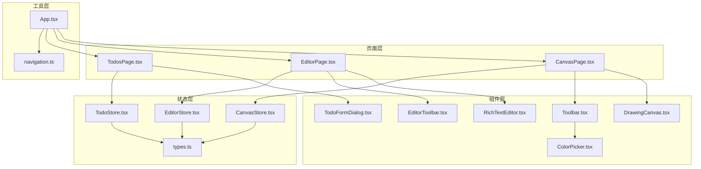
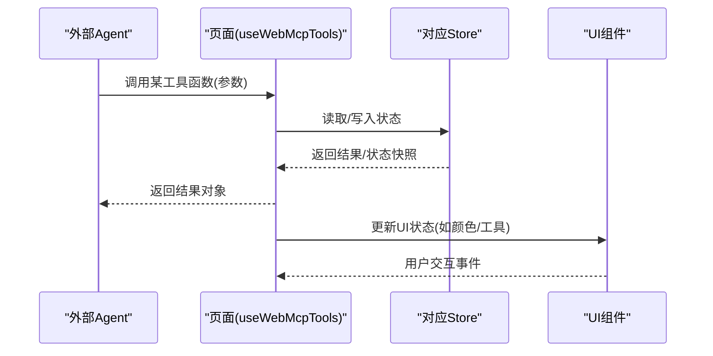
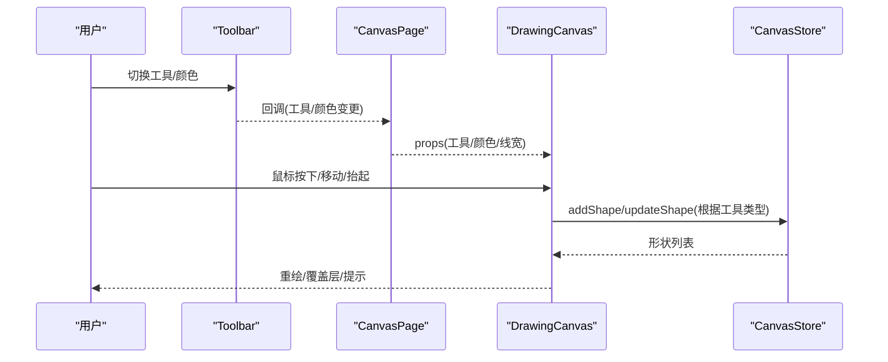
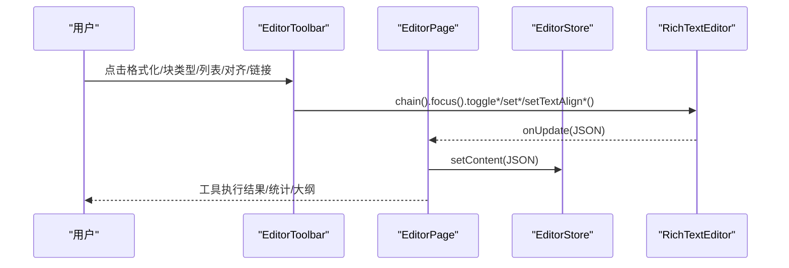
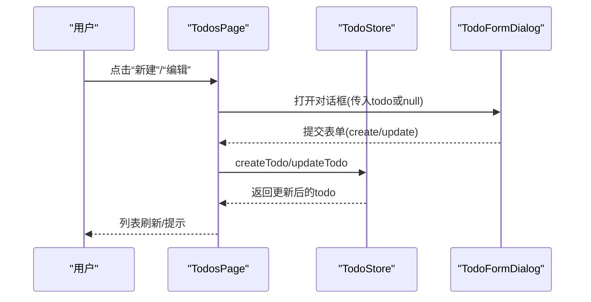
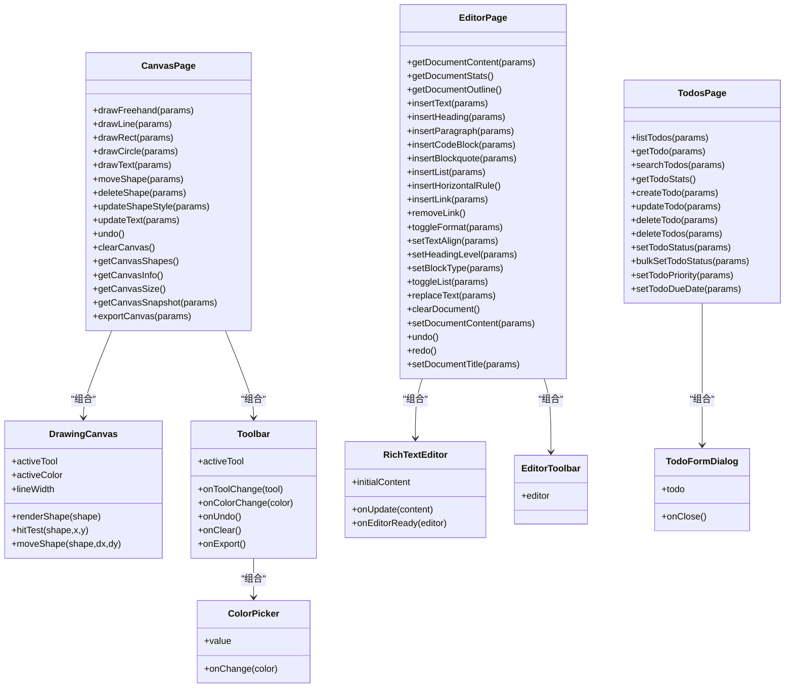
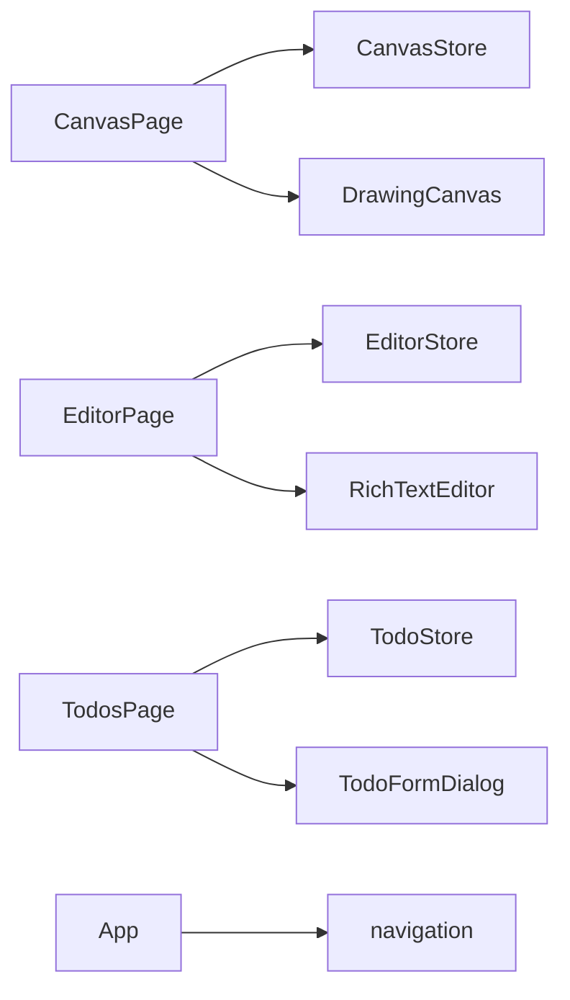

# 页面和组件

<cite>
**本文引用的文件**
- [CanvasPage.tsx](file://apps/demo/src/pages/CanvasPage.tsx)
- [EditorPage.tsx](file://apps/demo/src/pages/EditorPage.tsx)
- [TodosPage.tsx](file://apps/demo/src/pages/TodosPage.tsx)
- [DrawingCanvas.tsx](file://apps/demo/src/components/canvas/DrawingCanvas.tsx)
- [Toolbar.tsx](file://apps/demo/src/components/canvas/Toolbar.tsx)
- [ColorPicker.tsx](file://apps/demo/src/components/canvas/ColorPicker.tsx)
- [RichTextEditor.tsx](file://apps/demo/src/components/editor/RichTextEditor.tsx)
- [EditorToolbar.tsx](file://apps/demo/src/components/editor/EditorToolbar.tsx)
- [TodoFormDialog.tsx](file://apps/demo/src/components/TodoFormDialog.tsx)
- [CanvasStore.tsx](file://apps/demo/src/store/CanvasStore.tsx)
- [EditorStore.tsx](file://apps/demo/src/store/EditorStore.tsx)
- [TodoStore.tsx](file://apps/demo/src/store/TodoStore.tsx)
- [types.ts](file://apps/demo/src/store/types.ts)
- [navigation.ts](file://apps/demo/src/tools/navigation.ts)
- [App.tsx](file://apps/demo/src/App.tsx)
</cite>

## 目录
1. [简介](#简介)
2. [项目结构](#项目结构)
3. [核心组件](#核心组件)
4. [架构总览](#架构总览)
5. [详细组件分析](#详细组件分析)
6. [依赖关系分析](#依赖关系分析)
7. [性能考量](#性能考量)
8. [故障排查指南](#故障排查指南)
9. [结论](#结论)
10. [附录](#附录)

## 简介
本文件系统性梳理演示应用中的页面组件与功能组件，重点覆盖以下主题：
- 页面设计模式与实现逻辑：CanvasPage、EditorPage、TodosPage 的职责划分与交互流程
- 核心组件能力：Canvas 绘图组件、RichTextEditor 富文本编辑器、TodoFormDialog 表单对话框的功能特性与边界
- 组件间通信机制与数据流向：页面如何通过 useWebMcpTools 暴露工具函数，如何与 Store 解耦协作
- 使用示例与扩展建议：如何基于现有接口进行二次开发与集成

## 项目结构
应用采用“页面层 + 组件层 + Store 层 + 工具层”的分层组织方式，页面负责编排与工具注册，组件负责具体 UI 与交互，Store 提供状态管理，工具层提供跨模块能力（如导航桥接）。

图表来源
- [App.tsx:37-79](file://apps/demo/src/App.tsx#L37-L79)
- [CanvasPage.tsx:8-452](file://apps/demo/src/pages/CanvasPage.tsx#L8-L452)
- [EditorPage.tsx:8-558](file://apps/demo/src/pages/EditorPage.tsx#L8-L558)
- [TodosPage.tsx:8-184](file://apps/demo/src/pages/TodosPage.tsx#L8-L184)
- [DrawingCanvas.tsx:166-540](file://apps/demo/src/components/canvas/DrawingCanvas.tsx#L166-L540)
- [Toolbar.tsx:23-75](file://apps/demo/src/components/canvas/Toolbar.tsx#L23-L75)
- [ColorPicker.tsx:14-41](file://apps/demo/src/components/canvas/ColorPicker.tsx#L14-L41)
- [RichTextEditor.tsx:16-47](file://apps/demo/src/components/editor/RichTextEditor.tsx#L16-L47)
- [EditorToolbar.tsx:75-143](file://apps/demo/src/components/editor/EditorToolbar.tsx#L75-L143)
- [TodoFormDialog.tsx:11-125](file://apps/demo/src/components/TodoFormDialog.tsx#L11-L125)
- [CanvasStore.tsx:24-86](file://apps/demo/src/store/CanvasStore.tsx#L24-L86)
- [EditorStore.tsx:83-107](file://apps/demo/src/store/EditorStore.tsx#L83-L107)
- [TodoStore.tsx:119-279](file://apps/demo/src/store/TodoStore.tsx#L119-L279)
- [types.ts:1-58](file://apps/demo/src/store/types.ts#L1-L58)
- [navigation.ts:6-13](file://apps/demo/src/tools/navigation.ts#L6-L13)

章节来源
- [App.tsx:37-79](file://apps/demo/src/App.tsx#L37-L79)

## 核心组件
- CanvasPage：作为画板页面，聚合各类绘图工具函数并通过 useWebMcpTools 暴露给外部 Agent，同时维护当前工具、颜色、线宽等 UI 状态，并将状态传递给 DrawingCanvas 与 Toolbar。
- EditorPage：作为富文本编辑页面，负责注册文档查询、插入、格式化、编辑等工具函数，承载 RichTextEditor 与 EditorToolbar，实现与 Tiptap 的双向绑定。
- TodosPage：作为待办页面，负责注册待办查询、统计、增删改等工具函数，承载 TodoFormDialog 实现表单交互与 Store 读写。
- DrawingCanvas：核心绘图组件，负责渲染形状、命中测试、拖拽移动、文本输入覆盖层等，内部通过 Canvas API 进行绘制与交互。
- RichTextEditor：基于 Tiptap 的富文本编辑器封装，提供初始内容、更新回调与就绪回调。
- TodoFormDialog：待办表单对话框，支持新建与编辑，提交后写入 TodoStore。
- CanvasStore/EditorStore/TodoStore：各自领域的状态容器，提供 CRUD 与派生查询能力，页面通过 useXxxStore 访问。
- Toolbar/ColorPicker：画板工具栏与颜色选择器，负责工具切换与颜色变更。
- EditorToolbar：富文本工具栏，提供格式化、标题、列表、对齐、链接等按钮。
- navigation 工具：提供应用内路由跳转能力，由 App 中的 NavigateBridge 发布。

章节来源
- [CanvasPage.tsx:8-452](file://apps/demo/src/pages/CanvasPage.tsx#L8-L452)
- [EditorPage.tsx:8-558](file://apps/demo/src/pages/EditorPage.tsx#L8-L558)
- [TodosPage.tsx:8-184](file://apps/demo/src/pages/TodosPage.tsx#L8-L184)
- [DrawingCanvas.tsx:166-540](file://apps/demo/src/components/canvas/DrawingCanvas.tsx#L166-L540)
- [RichTextEditor.tsx:16-47](file://apps/demo/src/components/editor/RichTextEditor.tsx#L16-L47)
- [TodoFormDialog.tsx:11-125](file://apps/demo/src/components/TodoFormDialog.tsx#L11-L125)
- [CanvasStore.tsx:24-86](file://apps/demo/src/store/CanvasStore.tsx#L24-L86)
- [EditorStore.tsx:83-107](file://apps/demo/src/store/EditorStore.tsx#L83-L107)
- [TodoStore.tsx:119-279](file://apps/demo/src/store/TodoStore.tsx#L119-L279)
- [Toolbar.tsx:23-75](file://apps/demo/src/components/canvas/Toolbar.tsx#L23-L75)
- [ColorPicker.tsx:14-41](file://apps/demo/src/components/canvas/ColorPicker.tsx#L14-L41)
- [EditorToolbar.tsx:75-143](file://apps/demo/src/components/editor/EditorToolbar.tsx#L75-L143)
- [navigation.ts:6-13](file://apps/demo/src/tools/navigation.ts#L6-L13)

## 架构总览
页面通过 useWebMcpTools 将一组“工具函数”暴露给外部 Agent，这些工具函数以异步方法形式存在，参数与返回值均遵循统一约定。页面内部通过 useXxxStore 访问对应 Store，完成状态读写与派生计算。组件层负责 UI 与交互，Store 层负责状态与业务规则，工具层提供跨模块能力（如导航）。

图表来源
- [CanvasPage.tsx:415-432](file://apps/demo/src/pages/CanvasPage.tsx#L415-L432)
- [EditorPage.tsx:522-546](file://apps/demo/src/pages/EditorPage.tsx#L522-L546)
- [TodosPage.tsx:116-129](file://apps/demo/src/pages/TodosPage.tsx#L116-L129)

## 详细组件分析

### CanvasPage 页面与绘图组件
- 设计模式
  - 页面职责：集中声明并注册画板相关的工具函数，包括绘制自由线、直线、矩形、圆形、文本，以及撤销、清空、移动、删除、样式修改、文本更新、截图导出、尺寸查询等。
  - 组件编排：将 Toolbar 与 DrawingCanvas 组合，传递当前工具、颜色、线宽等状态。
- 数据流
  - 页面从 CanvasStore 读取/写入 shapes，工具函数内部调用 addShape/updateShape/removeShape 等，最终驱动 DrawingCanvas 重绘。
  - DrawingCanvas 自身也维护 isDrawing、currentPoints、startPoint、textInput、selectedId、dragOffset 等交互状态，形成“页面状态 + 组件内部状态”的双层控制。
- 关键交互
  - 选择工具：命中测试与拖拽移动，支持按类型计算外接矩形或包围盒，拖动后调用 updateShape 应用平移。
  - 文本工具：通过覆盖层 textarea 输入，确定矩形区域后生成 text 形状。
  - 导出与截图：基于 devicePixelRatio 与离屏画布，保证高分屏清晰度与缩放控制。

图表来源
- [CanvasPage.tsx:434-451](file://apps/demo/src/pages/CanvasPage.tsx#L434-L451)
- [Toolbar.tsx:23-75](file://apps/demo/src/components/canvas/Toolbar.tsx#L23-L75)
- [DrawingCanvas.tsx:166-540](file://apps/demo/src/components/canvas/DrawingCanvas.tsx#L166-L540)
- [CanvasStore.tsx:33-41](file://apps/demo/src/store/CanvasStore.tsx#L33-L41)

章节来源
- [CanvasPage.tsx:8-452](file://apps/demo/src/pages/CanvasPage.tsx#L8-L452)
- [DrawingCanvas.tsx:166-540](file://apps/demo/src/components/canvas/DrawingCanvas.tsx#L166-L540)
- [Toolbar.tsx:23-75](file://apps/demo/src/components/canvas/Toolbar.tsx#L23-L75)
- [ColorPicker.tsx:14-41](file://apps/demo/src/components/canvas/ColorPicker.tsx#L14-L41)
- [CanvasStore.tsx:24-86](file://apps/demo/src/store/CanvasStore.tsx#L24-L86)

### EditorPage 页面与富文本编辑器
- 设计模式
  - 页面职责：注册文档查询、插入、格式化、编辑等工具函数，承载 RichTextEditor 与 EditorToolbar，实现与 Tiptap 的双向绑定。
  - EditorStore 管理文档标题与内容 JSON，EditorPage 通过 setTitle/setContent 与之同步。
- 数据流
  - EditorPage 通过 useEditorStore 获取 document，RichTextEditor 初始化时注入 initialContent，并在 onUpdate 中回写 JSON。
  - 页面工具函数围绕 editor.getJSON()/getHTML()/getText() 与命令链 chain() 进行读写与格式化。
- 关键交互
  - 工具栏按钮与 Tiptap 命令链联动，支持加粗、斜体、下划线、删除线、标题、引用、代码块、列表、对齐、链接、撤销/重做等。
  - 文档统计与大纲解析，便于 Agent 快速理解文档结构与体量。

图表来源
- [EditorPage.tsx:522-546](file://apps/demo/src/pages/EditorPage.tsx#L522-L546)
- [EditorToolbar.tsx:75-143](file://apps/demo/src/components/editor/EditorToolbar.tsx#L75-L143)
- [RichTextEditor.tsx:16-47](file://apps/demo/src/components/editor/RichTextEditor.tsx#L16-L47)
- [EditorStore.tsx:83-107](file://apps/demo/src/store/EditorStore.tsx#L83-L107)

章节来源
- [EditorPage.tsx:8-558](file://apps/demo/src/pages/EditorPage.tsx#L8-L558)
- [RichTextEditor.tsx:16-47](file://apps/demo/src/components/editor/RichTextEditor.tsx#L16-L47)
- [EditorToolbar.tsx:75-143](file://apps/demo/src/components/editor/EditorToolbar.tsx#L75-L143)
- [EditorStore.tsx:83-107](file://apps/demo/src/store/EditorStore.tsx#L83-L107)

### TodosPage 页面与表单对话框
- 设计模式
  - 页面职责：注册待办查询、统计、增删改等工具函数，承载 TodoFormDialog 实现表单交互与 Store 读写。
  - TodoStore 提供 create/update/delete/filter/get 等方法，页面通过 useTodoStore 访问。
- 数据流
  - 页面维护搜索词与对话框状态，筛选后的 todos 渲染卡片，点击进入对话框进行新建/编辑。
  - 对话框提交后调用 createTodo/updateTodo，Store 更新后页面自动刷新。
- 关键交互
  - 列表项点击进入对话框编辑；切换状态通过 setTodoStatus 实现；统计信息按状态与逾期计算。

图表来源
- [TodosPage.tsx:116-129](file://apps/demo/src/pages/TodosPage.tsx#L116-L129)
- [TodoFormDialog.tsx:21-44](file://apps/demo/src/components/TodoFormDialog.tsx#L21-L44)
- [TodoStore.tsx:133-158](file://apps/demo/src/store/TodoStore.tsx#L133-L158)

章节来源
- [TodosPage.tsx:8-184](file://apps/demo/src/pages/TodosPage.tsx#L8-L184)
- [TodoFormDialog.tsx:11-125](file://apps/demo/src/components/TodoFormDialog.tsx#L11-L125)
- [TodoStore.tsx:119-279](file://apps/demo/src/store/TodoStore.tsx#L119-L279)

### 组件类图（代码级）

图表来源
- [CanvasPage.tsx:8-452](file://apps/demo/src/pages/CanvasPage.tsx#L8-L452)
- [DrawingCanvas.tsx:166-540](file://apps/demo/src/components/canvas/DrawingCanvas.tsx#L166-L540)
- [Toolbar.tsx:23-75](file://apps/demo/src/components/canvas/Toolbar.tsx#L23-L75)
- [ColorPicker.tsx:14-41](file://apps/demo/src/components/canvas/ColorPicker.tsx#L14-L41)
- [EditorPage.tsx:8-558](file://apps/demo/src/pages/EditorPage.tsx#L8-L558)
- [RichTextEditor.tsx:16-47](file://apps/demo/src/components/editor/RichTextEditor.tsx#L16-L47)
- [EditorToolbar.tsx:75-143](file://apps/demo/src/components/editor/EditorToolbar.tsx#L75-L143)
- [TodosPage.tsx:8-184](file://apps/demo/src/pages/TodosPage.tsx#L8-L184)
- [TodoFormDialog.tsx:11-125](file://apps/demo/src/components/TodoFormDialog.tsx#L11-L125)

## 依赖关系分析
- 页面与 Store
  - CanvasPage -> CanvasStore：读写 shapes，暴露绘图工具
  - EditorPage -> EditorStore：读写 document，暴露编辑工具
  - TodosPage -> TodoStore：读写 todos，暴露查询与编辑工具
- 组件与 Store
  - DrawingCanvas -> CanvasStore：渲染与交互直接依赖 Store 的形状集合
  - RichTextEditor -> EditorStore：通过 props 与回调与 Store 同步
  - TodoFormDialog -> TodoStore：提交后写入 Store
- 工具层
  - App -> navigation：发布导航桥接，使外部 Agent 可通过工具进行路由跳转

图表来源
- [CanvasPage.tsx:9-10](file://apps/demo/src/pages/CanvasPage.tsx#L9-L10)
- [EditorPage.tsx:9-11](file://apps/demo/src/pages/EditorPage.tsx#L9-L11)
- [TodosPage.tsx:9-21](file://apps/demo/src/pages/TodosPage.tsx#L9-L21)
- [App.tsx:12-19](file://apps/demo/src/App.tsx#L12-L19)
- [navigation.ts:6-13](file://apps/demo/src/tools/navigation.ts#L6-L13)

章节来源
- [CanvasStore.tsx:24-86](file://apps/demo/src/store/CanvasStore.tsx#L24-L86)
- [EditorStore.tsx:83-107](file://apps/demo/src/store/EditorStore.tsx#L83-L107)
- [TodoStore.tsx:119-279](file://apps/demo/src/store/TodoStore.tsx#L119-L279)

## 性能考量
- Canvas 绘制
  - 使用 devicePixelRatio 与离屏画布提升截图/导出质量，注意在高 DPI 设备上适当缩放以平衡清晰度与内存占用。
  - 重绘策略：通过 useRef 包裹 drawShapesRef，减少闭包与重渲染成本；仅在 shapes、selectedId、activeTool、dragOffset 等关键状态变化时重绘。
- 文本测量
  - 复用 measure 上下文，避免重复创建上下文导致的 GC 压力；按段落与行宽计算文本行，避免过长字符串造成测量开销。
- 富文本
  - 初始内容与更新回调均基于 JSON，建议在大文档场景下限制一次性更新范围，必要时拆分命令链以降低卡顿。
- 待办筛选
  - 搜索与排序在前端完成，建议对大数据集启用虚拟滚动或分页，减少 DOM 节点数量。

## 故障排查指南
- 页面未注册工具
  - 确认页面已调用 useWebMcpTools 并传入完整工具函数集合。
- 绘图无响应
  - 检查 DrawingCanvas 是否正确获取容器与画布尺寸；确认 activeTool 与 isDrawing 状态是否符合预期。
- 导出/截图失败
  - 检查 devicePixelRatio 与离屏画布尺寸计算；确保目标画布存在且上下文可用。
- 富文本不可编辑
  - 确认 EditorPage 已在 handleEditorReady 中保存 editor 引用；工具函数需在 editorReady 之后调用。
- 待办表单无效
  - 检查 TodoFormDialog 的标题非空校验与提交逻辑；确认 TodoStore 的 create/update 已被调用。

章节来源
- [CanvasPage.tsx:415-432](file://apps/demo/src/pages/CanvasPage.tsx#L415-L432)
- [EditorPage.tsx:13-16](file://apps/demo/src/pages/EditorPage.tsx#L13-L16)
- [DrawingCanvas.tsx:252-268](file://apps/demo/src/components/canvas/DrawingCanvas.tsx#L252-L268)
- [TodoFormDialog.tsx:21-44](file://apps/demo/src/components/TodoFormDialog.tsx#L21-L44)

## 结论
该演示应用通过“页面 + 组件 + Store + 工具”的分层设计，实现了画板、富文本与待办三大场景的完整闭环。页面以 useWebMcpTools 为桥梁，将 UI 与业务能力统一暴露给外部 Agent，具备良好的可扩展性与可测试性。绘图、编辑、待办三类组件分别针对其领域特性进行了优化，兼顾易用性与性能。

## 附录

### 组件使用示例与扩展指导
- 画板工具扩展
  - 新增形状：在 CanvasStore 中扩展 Shape 接口与 DrawingCanvas 的渲染分支；在 CanvasPage 中新增对应工具函数，调用 addShape 并返回 id。
  - 新增交互：在 DrawingCanvas 中扩展命中测试与拖拽逻辑，必要时引入新的内部状态。
- 富文本扩展
  - 新增块类型：在 EditorToolbar 中增加按钮，调用 chain().focus().set*/toggle*；在 EditorPage 中补充相应工具函数。
  - 新增行内格式：在 EditorToolbar 中增加按钮，调用 chain().focus().toggle*；在 EditorPage 中补充相应工具函数。
- 待办扩展
  - 新增字段：在 TodoStore 的 Todo 接口中扩展字段；在 TodoFormDialog 中增加表单项；在 EditorPage 中补充相应工具函数。
  - 新增筛选条件：在 TodoStore 的 filterTodos 中增加过滤逻辑；在 TodosPage 中补充工具函数的参数与返回值。

章节来源
- [types.ts:34-58](file://apps/demo/src/store/types.ts#L34-L58)
- [CanvasStore.tsx:33-41](file://apps/demo/src/store/CanvasStore.tsx#L33-L41)
- [DrawingCanvas.tsx:57-110](file://apps/demo/src/components/canvas/DrawingCanvas.tsx#L57-L110)
- [EditorToolbar.tsx:75-143](file://apps/demo/src/components/editor/EditorToolbar.tsx#L75-L143)
- [EditorPage.tsx:24-42](file://apps/demo/src/pages/EditorPage.tsx#L24-L42)
- [TodoStore.tsx:133-158](file://apps/demo/src/store/TodoStore.tsx#L133-L158)
- [TodoFormDialog.tsx:21-44](file://apps/demo/src/components/TodoFormDialog.tsx#L21-L44)