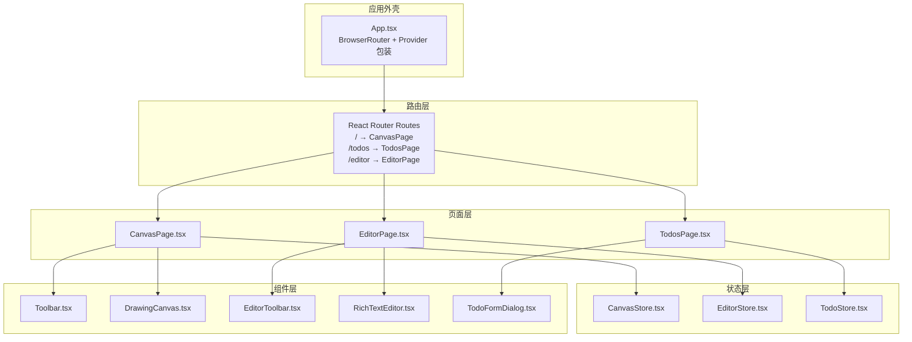
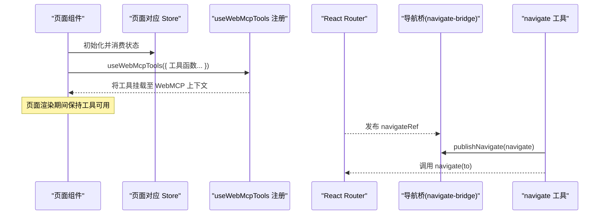
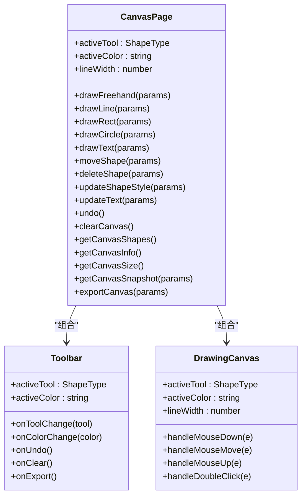
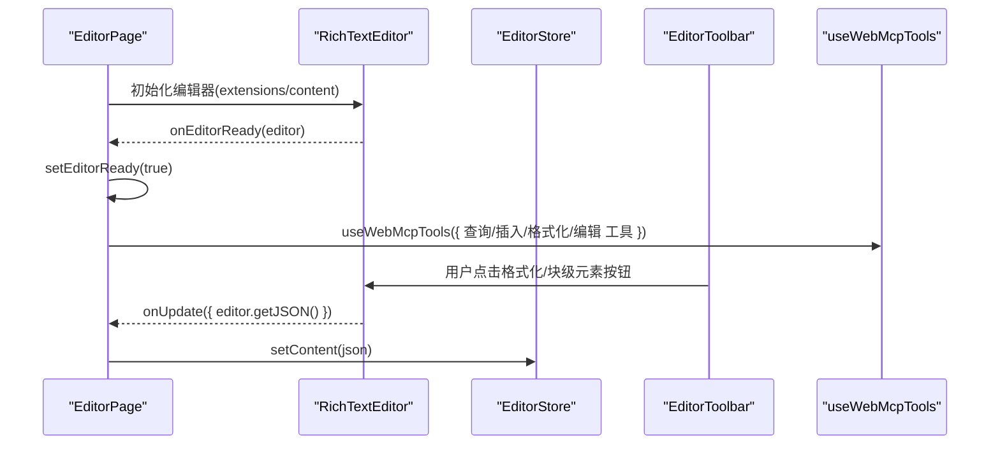
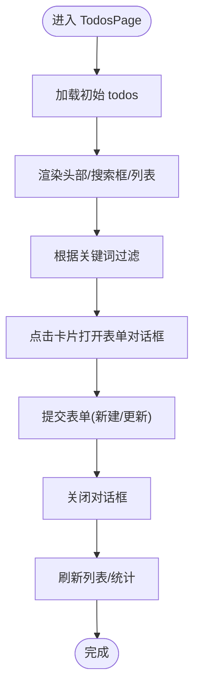
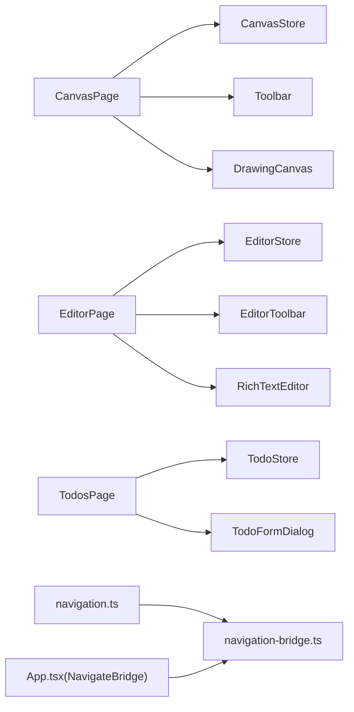

# 页面组件

<cite>
**本文引用的文件**
- [App.tsx](file://apps/demo/src/App.tsx)
- [navigation.ts](file://apps/demo/src/tools/navigation.ts)
- [navigation-bridge.ts](file://apps/demo/src/tools/navigation-bridge.ts)
- [CanvasPage.tsx](file://apps/demo/src/pages/CanvasPage.tsx)
- [EditorPage.tsx](file://apps/demo/src/pages/EditorPage.tsx)
- [TodosPage.tsx](file://apps/demo/src/pages/TodosPage.tsx)
- [CanvasStore.tsx](file://apps/demo/src/store/CanvasStore.tsx)
- [EditorStore.tsx](file://apps/demo/src/store/EditorStore.tsx)
- [TodoStore.tsx](file://apps/demo/src/store/TodoStore.tsx)
- [Toolbar.tsx](file://apps/demo/src/components/canvas/Toolbar.tsx)
- [DrawingCanvas.tsx](file://apps/demo/src/components/canvas/DrawingCanvas.tsx)
- [EditorToolbar.tsx](file://apps/demo/src/components/editor/EditorToolbar.tsx)
- [RichTextEditor.tsx](file://apps/demo/src/components/editor/RichTextEditor.tsx)
- [TodoFormDialog.tsx](file://apps/demo/src/components/TodoFormDialog.tsx)
- [types.ts](file://apps/demo/src/store/types.ts)
- [mockData.ts](file://apps/demo/src/store/mockData.ts)
</cite>

## 目录
1. [简介](#简介)
2. [项目结构](#项目结构)
3. [核心组件](#核心组件)
4. [架构总览](#架构总览)
5. [详细组件分析](#详细组件分析)
6. [依赖关系分析](#依赖关系分析)
7. [性能考量](#性能考量)
8. [故障排查指南](#故障排查指南)
9. [结论](#结论)
10. [附录](#附录)

## 简介
本文件系统化解析演示应用中的三个核心页面组件：CanvasPage（绘图页面）、EditorPage（富文本编辑页面）、TodosPage（待办事项页面）。重点覆盖以下方面：
- 路由配置与页面入口
- 状态管理与组件组合模式
- 页面级工具注册与生命周期管理
- 页面切换与导航最佳实践

## 项目结构
应用采用按页面与功能模块组织的目录结构，页面组件位于 pages 目录，各自的状态存储位于 store 目录，页面内的子组件位于 components 目录。路由由 React Router 提供，顶层 App.tsx 负责路由声明与全局 Provider 包装。

图表来源
- [App.tsx:69-73](file://apps/demo/src/App.tsx#L69-L73)
- [CanvasPage.tsx:434-451](file://apps/demo/src/pages/CanvasPage.tsx#L434-L451)
- [EditorPage.tsx:548-557](file://apps/demo/src/pages/EditorPage.tsx#L548-L557)
- [TodosPage.tsx:136-183](file://apps/demo/src/pages/TodosPage.tsx#L136-L183)

章节来源
- [App.tsx:69-73](file://apps/demo/src/App.tsx#L69-L73)
- [App.tsx:37-79](file://apps/demo/src/App.tsx#L37-L79)

## 核心组件
- CanvasPage：提供画布绘制能力，注册画布相关工具，组合 Toolbar 与 DrawingCanvas。
- EditorPage：提供富文本编辑能力，注册文档编辑与查询工具，组合 EditorToolbar 与 RichTextEditor。
- TodosPage：提供待办事项管理能力，注册待办查询与编辑工具，组合搜索、列表与表单对话框。

章节来源
- [CanvasPage.tsx:8-452](file://apps/demo/src/pages/CanvasPage.tsx#L8-L452)
- [EditorPage.tsx:8-558](file://apps/demo/src/pages/EditorPage.tsx#L8-L558)
- [TodosPage.tsx:8-184](file://apps/demo/src/pages/TodosPage.tsx#L8-L184)

## 架构总览
页面级工具注册与生命周期管理的关键流程如下：

图表来源
- [CanvasPage.tsx:415-432](file://apps/demo/src/pages/CanvasPage.tsx#L415-L432)
- [EditorPage.tsx:522-546](file://apps/demo/src/pages/EditorPage.tsx#L522-L546)
- [TodosPage.tsx:116-129](file://apps/demo/src/pages/TodosPage.tsx#L116-L129)
- [App.tsx:12-19](file://apps/demo/src/App.tsx#L12-L19)
- [navigation-bridge.ts:3-7](file://apps/demo/src/tools/navigation-bridge.ts#L3-L7)
- [navigation.ts:6-13](file://apps/demo/src/tools/navigation.ts#L6-L13)

## 详细组件分析

### CanvasPage 绘图页面
- 路由配置
  - 路由路径 "/" 对应 CanvasPage，作为应用主页面之一。
- 状态管理
  - 使用 CanvasStore 提供的 addShape、updateShape、removeShape、removeLastShape、clearShapes、getShapes、reorderShape 等方法管理图形集合。
  - 页面内部维护 activeTool、activeColor、lineWidth 等 UI 状态。
- 组件组合
  - Toolbar 负责工具切换、颜色选择、撤销与清空、导出等交互。
  - DrawingCanvas 负责绘制与交互（鼠标事件、拖拽、命中测试、文本输入覆盖层）。
- 页面级工具注册
  - 通过 useWebMcpTools 注册画布工具集，包括绘制类（自由线、直线、矩形、圆形、文字）、移动、删除、样式更新、撤销、清空、导出、查询类（形状列表、画布尺寸、位图快照、统计信息）等。
- 生命周期管理
  - 绘制过程在 useEffect 中监听容器尺寸变化并重绘；在鼠标事件处理中根据 activeTool 进行不同绘制逻辑；文本输入通过 textarea 覆盖层实现。
- 最佳实践
  - 使用 devicePixelRatio 适配高分屏；ResizeObserver 监听容器尺寸变化；命中测试区分图形类型；文本换行测量基于 Canvas 文本度量 API。

图表来源
- [CanvasPage.tsx:8-452](file://apps/demo/src/pages/CanvasPage.tsx#L8-L452)
- [Toolbar.tsx:23-75](file://apps/demo/src/components/canvas/Toolbar.tsx#L23-L75)
- [DrawingCanvas.tsx:233-607](file://apps/demo/src/components/canvas/DrawingCanvas.tsx#L233-L607)

章节来源
- [CanvasPage.tsx:8-452](file://apps/demo/src/pages/CanvasPage.tsx#L8-L452)
- [Toolbar.tsx:23-75](file://apps/demo/src/components/canvas/Toolbar.tsx#L23-L75)
- [DrawingCanvas.tsx:233-607](file://apps/demo/src/components/canvas/DrawingCanvas.tsx#L233-L607)
- [CanvasStore.tsx:14-139](file://apps/demo/src/store/CanvasStore.tsx#L14-L139)
- [types.ts:34-74](file://apps/demo/src/store/types.ts#L34-L74)

### EditorPage 富文本编辑页面
- 路由配置
  - 路由路径 "/editor" 对应 EditorPage。
- 状态管理
  - 使用 EditorStore 提供的 document、setTitle、setContent、resetDocument 管理文档内容与标题。
  - 页面内部维护 editorReady 状态以确保工具调用时编辑器已就绪。
- 组件组合
  - EditorToolbar 提供富文本格式化与块级元素插入按钮。
  - RichTextEditor 基于 TipTap，提供编辑器实例与内容更新回调。
- 页面级工具注册
  - 通过 useWebMcpTools 注册查询类（文档内容、统计、大纲）、插入类（文本、标题、段落、代码块、引用块、列表、分割线、链接）、格式化类（加粗/斜体/下划线/删除线/行内代码、对齐、标题级别、块类型、列表切换、链接移除）、编辑类（查找替换、清空、设置内容、撤销/重做、设置标题）等工具。
- 生命周期管理
  - 通过 onEditorReady 回调保存编辑器实例；工具调用前检查编辑器是否就绪；TipTap 编辑器的 JSON/HTML/Text 输出统一由工具封装。
- 最佳实践
  - 使用 TipTap StarterKit 与扩展（下划线、链接、文本对齐、占位符）；通过 chain() 组合命令保证状态一致性；对齐方式与标题级别进行边界约束。

图表来源
- [EditorPage.tsx:8-558](file://apps/demo/src/pages/EditorPage.tsx#L8-L558)
- [RichTextEditor.tsx:16-47](file://apps/demo/src/components/editor/RichTextEditor.tsx#L16-L47)
- [EditorToolbar.tsx:75-143](file://apps/demo/src/components/editor/EditorToolbar.tsx#L75-L143)
- [EditorStore.tsx:83-107](file://apps/demo/src/store/EditorStore.tsx#L83-L107)

章节来源
- [EditorPage.tsx:8-558](file://apps/demo/src/pages/EditorPage.tsx#L8-L558)
- [RichTextEditor.tsx:16-47](file://apps/demo/src/components/editor/RichTextEditor.tsx#L16-L47)
- [EditorToolbar.tsx:75-143](file://apps/demo/src/components/editor/EditorToolbar.tsx#L75-L143)
- [EditorStore.tsx:83-107](file://apps/demo/src/store/EditorStore.tsx#L83-L107)

### TodosPage 待办事项页面
- 路由配置
  - 路由路径 "/todos" 对应 TodosPage。
- 状态管理
  - 使用 TodoStore 提供的 todos、createTodo、updateTodo、deleteTodo、deleteTodos、setTodoStatus、bulkSetTodoStatus、setTodoPriority、setTodoDueDate、filterTodos、getTodoById 管理待办集合。
  - 页面内部维护搜索关键词与表单对话框状态。
- 组件组合
  - TodoFormDialog 提供新建/编辑待办的表单弹窗。
- 页面级工具注册
  - 通过 useWebMcpTools 注册查询类（列出、搜索、统计）、编辑类（创建、更新、删除、批量设置状态、设置优先级、设置截止日期）等工具。
- 生命周期管理
  - 页面渲染时根据搜索关键词过滤待办；点击复选框切换状态；双击卡片打开编辑对话框；对话框提交后自动关闭。
- 最佳实践
  - 搜索关键词大小写不敏感且同时匹配标题与描述；支持优先级与状态多维过滤；排序规则先按优先级再按截止日期；统计包含逾期项计算。

图表来源
- [TodosPage.tsx:8-184](file://apps/demo/src/pages/TodosPage.tsx#L8-L184)
- [TodoFormDialog.tsx:11-125](file://apps/demo/src/components/TodoFormDialog.tsx#L11-L125)
- [TodoStore.tsx:119-280](file://apps/demo/src/store/TodoStore.tsx#L119-L280)
- [mockData.ts:16-98](file://apps/demo/src/store/mockData.ts#L16-L98)

章节来源
- [TodosPage.tsx:8-184](file://apps/demo/src/pages/TodosPage.tsx#L8-L184)
- [TodoFormDialog.tsx:11-125](file://apps/demo/src/components/TodoFormDialog.tsx#L11-L125)
- [TodoStore.tsx:119-280](file://apps/demo/src/store/TodoStore.tsx#L119-L280)
- [mockData.ts:16-98](file://apps/demo/src/store/mockData.ts#L16-L98)

## 依赖关系分析
- 页面到 Store
  - CanvasPage 依赖 CanvasStore；EditorPage 依赖 EditorStore；TodosPage 依赖 TodoStore。
- 页面到组件
  - CanvasPage 组合 Toolbar 与 DrawingCanvas；EditorPage 组合 EditorToolbar 与 RichTextEditor；TodosPage 组合 TodoFormDialog。
- 页面到工具
  - 三者均通过 useWebMcpTools 注册一组工具函数，暴露给外部 Agent 调用。
- 导航桥
  - App.tsx 通过 NavigateBridge 将 react-router 的 navigate 函数发布到全局引用，供工具层调用。

图表来源
- [App.tsx:12-19](file://apps/demo/src/App.tsx#L12-L19)
- [navigation.ts:6-13](file://apps/demo/src/tools/navigation.ts#L6-L13)
- [navigation-bridge.ts:3-7](file://apps/demo/src/tools/navigation-bridge.ts#L3-L7)

章节来源
- [App.tsx:12-19](file://apps/demo/src/App.tsx#L12-L19)
- [navigation.ts:6-13](file://apps/demo/src/tools/navigation.ts#L6-L13)
- [navigation-bridge.ts:3-7](file://apps/demo/src/tools/navigation-bridge.ts#L3-L7)

## 性能考量
- CanvasPage
  - 使用 devicePixelRatio 与 ResizeObserver 控制重绘频率与画布分辨率；命中测试与文本换行测量使用 Canvas 文本度量 API，避免 DOM 开销。
- EditorPage
  - TipTap 基于链式命令，减少不必要的重排；仅在编辑器就绪后执行工具调用，避免空引用。
- TodosPage
  - 过滤与排序在内存中进行，建议在数据量增大时考虑分页或虚拟滚动；搜索关键词预处理为小写以提升匹配效率。

## 故障排查指南
- 页面工具不可用
  - 确认页面组件在渲染期间已调用 useWebMcpTools 注册工具；检查工具函数签名与参数类型。
- 导航无效
  - 确认 App.tsx 中 NavigateBridge 已发布 navigateRef；工具层通过 navigation.ts 调用 publishNavigate 后再调用 navigate。
- 富文本工具报“编辑器未就绪”
  - 确保 EditorPage 在 onEditorReady 回调中设置 editorReady，并在工具调用前判断该状态。
- 画布导出/快照失败
  - 检查 DrawingCanvas 容器与画布元素是否存在；确认 devicePixelRatio 与缩放逻辑；导出时注意跨域与质量参数。
- 待办搜索无结果
  - 确认搜索关键词非空且已转为小写；检查 filterTodos 的优先级与状态过滤条件。

章节来源
- [navigation.ts:6-13](file://apps/demo/src/tools/navigation.ts#L6-L13)
- [navigation-bridge.ts:3-7](file://apps/demo/src/tools/navigation-bridge.ts#L3-L7)
- [EditorPage.tsx:13-16](file://apps/demo/src/pages/EditorPage.tsx#L13-L16)
- [CanvasPage.tsx:327-377](file://apps/demo/src/pages/CanvasPage.tsx#L327-L377)
- [TodosPage.tsx:25](file://apps/demo/src/pages/TodosPage.tsx#L25)

## 结论
本演示应用通过清晰的页面划分、独立的状态存储与组件组合，实现了三大核心页面的功能闭环。页面级工具注册与导航桥机制使得页面既可被用户交互驱动，也可被外部 Agent 通过 MCP 工具调用驱动，具备良好的扩展性与可维护性。遵循本文提供的最佳实践与故障排查建议，可在复杂场景中稳定运行。

## 附录
- 页面切换与导航最佳实践
  - 使用 App.tsx 中的 NavigateBridge 将 react-router 的 navigate 发布为全局引用，避免在工具层直接依赖路由上下文。
  - 在工具层统一通过 navigation.ts 的 navigate(to) 执行跳转，确保跨页面一致性。
  - 在页面工具中增加“导航成功”返回值，便于 Agent 判断跳转结果。