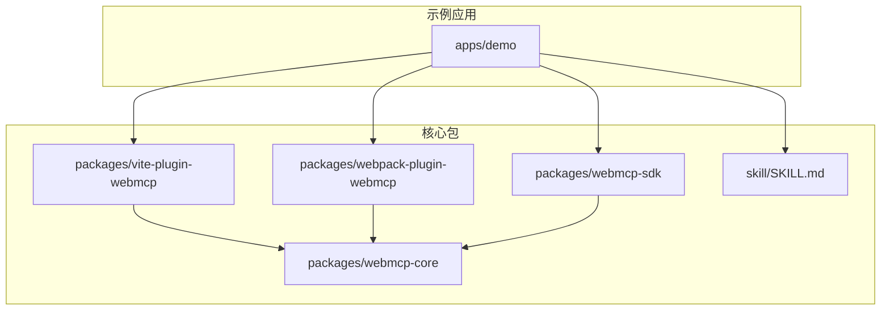
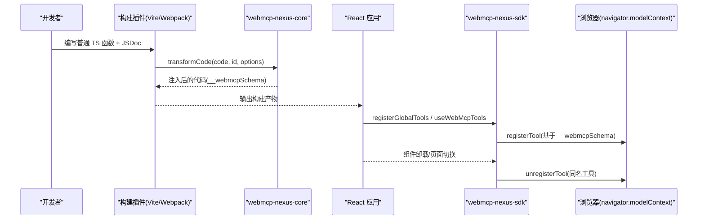
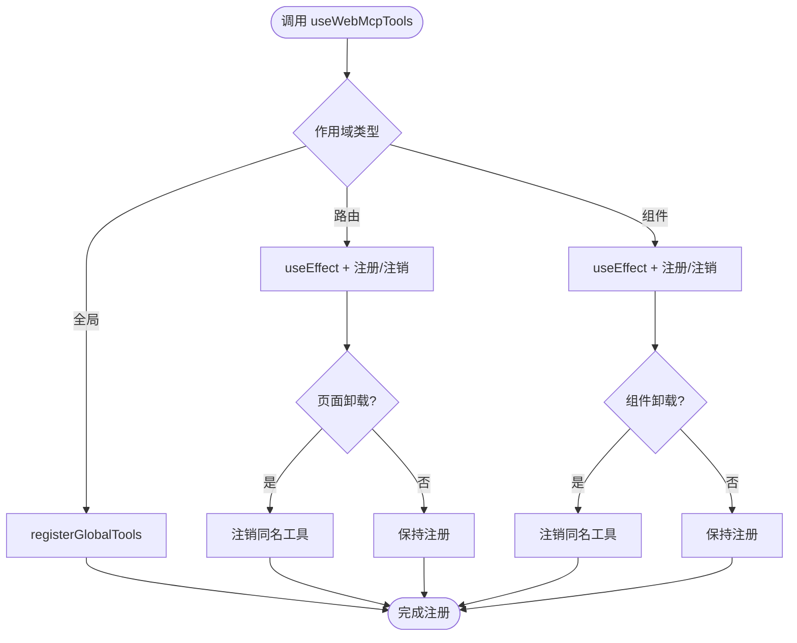
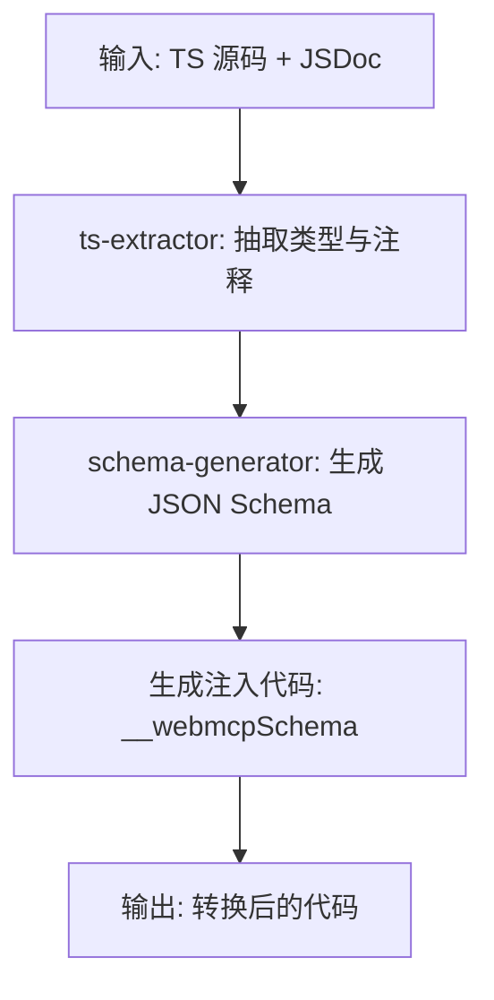
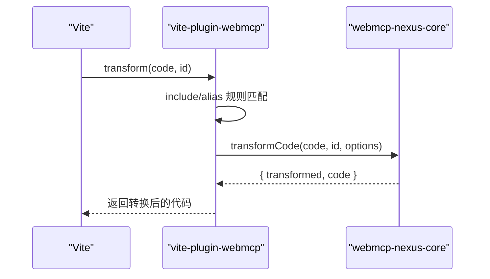
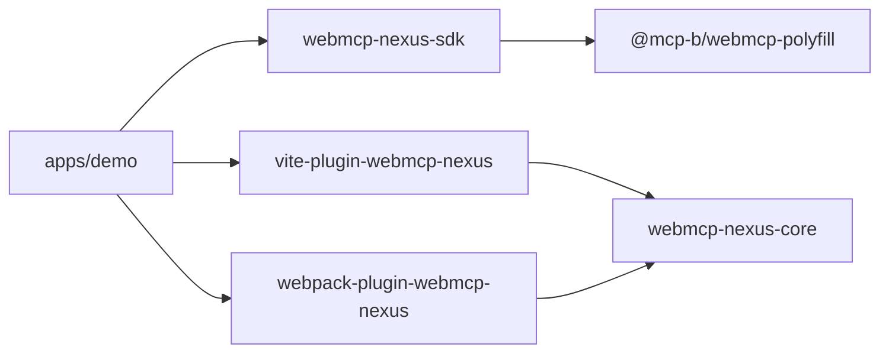

# 为什么选择 WebMCP Nexus

<cite>
**本文引用的文件**
- [README.md](file://README.md)
- [package.json](file://package.json)
- [packages/webmcp-core/package.json](file://packages/webmcp-core/package.json)
- [packages/webmcp-sdk/package.json](file://packages/webmcp-sdk/package.json)
- [packages/vite-plugin-webmcp/package.json](file://packages/vite-plugin-webmcp/package.json)
- [packages/webmcp-sdk/src/index.ts](file://packages/webmcp-sdk/src/index.ts)
- [packages/webmcp-sdk/src/registerGlobalTools.ts](file://packages/webmcp-sdk/src/registerGlobalTools.ts)
- [packages/webmcp-sdk/src/useWebMcpTools.ts](file://packages/webmcp-sdk/src/useWebMcpTools.ts)
- [packages/webmcp-core/src/index.ts](file://packages/webmcp-core/src/index.ts)
- [packages/webmcp-core/src/transform.ts](file://packages/webmcp-core/src/transform.ts)
- [packages/webmcp-core/src/ts-extractor.ts](file://packages/webmcp-core/src/ts-extractor.ts)
- [packages/webmcp-core/src/schema-generator.ts](file://packages/webmcp-core/src/schema-generator.ts)
- [packages/vite-plugin-webmcp/src/index.ts](file://packages/vite-plugin-webmcp/src/index.ts)
- [packages/webpack-plugin-webmcp/src/index.ts](file://packages/webpack-plugin-webmcp/src/index.ts)
- [apps/demo/src/main.tsx](file://apps/demo/src/main.tsx)
</cite>

## 目录
1. [引言](#引言)
2. [项目结构](#项目结构)
3. [核心组件](#核心组件)
4. [架构总览](#架构总览)
5. [详细组件分析](#详细组件分析)
6. [依赖关系分析](#依赖关系分析)
7. [性能考量](#性能考量)
8. [故障排查指南](#故障排查指南)
9. [结论](#结论)
10. [附录](#附录)

## 引言
WebMCP Nexus 是一套围绕 WebMCP 标准的前端工程化方案，目标是让任意 React 应用在数分钟内成为 MCP 客户端可直接驱动的对象。其核心价值在于：
- 极简 API：仅两个运行时 API，覆盖全局、路由、组件三级生命周期
- 零侵入：函数保持原样，原有调用方完全无感
- 构建时类型反推：基于 ts-morph 静态分析，函数签名即 JSON Schema，无运行时开销
- 浏览器兼容：内置 polyfill，对业务透明
- 桌面接入：与本地 relay 即插即用，支持 Claude Desktop、Cursor、VS Code 等

这些特性共同解决了“前端工具注册”的痛点：无需手写 JSON Schema、无需装饰器包装、无需复杂的生命周期管理，只需写普通 TS 函数并加一行 JSDoc，即可被任意 MCP 客户端调用。

## 项目结构
项目采用 pnpm workspace 的 monorepo 结构，包含示例应用与四个核心包：
- apps/demo：最佳实践示例（Vite + Webpack 双构建）
- packages/webmcp-core：构建时核心（TS 类型抽取 + JSON Schema 生成）
- packages/webmcp-sdk：运行时 SDK（2 个 API + Polyfill）
- packages/vite-plugin-webmcp：Vite 插件
- packages/webpack-plugin-webmcp：Webpack 插件
- skill/SKILL.md：面向 AI 编码 Agent 的接入 Skill

图表来源
- [README.md:76-89](file://README.md#L76-L89)
- [packages/webmcp-core/package.json:1-56](file://packages/webmcp-core/package.json#L1-L56)
- [packages/webmcp-sdk/package.json:1-62](file://packages/webmcp-sdk/package.json#L1-L62)
- [packages/vite-plugin-webmcp/package.json:1-59](file://packages/vite-plugin-webmcp/package.json#L1-L59)

章节来源
- [README.md:76-89](file://README.md#L76-L89)
- [package.json:1-38](file://package.json#L1-L38)

## 核心组件
- 运行时 SDK（webmcp-nexus-sdk）
  - 导出两个 API：registerGlobalTools 与 useWebMcpTools
  - 内置 @mcp-b/webmcp-polyfill，自动处理浏览器兼容
  - 与 React 18/19 兼容，提供类型定义
- 构建时核心（webmcp-nexus-core）
  - 基于 ts-morph 的静态分析，从 TS 类型与 JSDoc 反推出 JSON Schema
  - 生成注入代码，向函数对象附加 __webmcpSchema 字段
- Vite 插件（vite-plugin-webmcp-nexus）
  - 通过 transform hook 委托 core 完成类型抽取与注入
  - 支持 include 与 alias 配置，便于复杂项目结构
- Webpack 插件（webpack-plugin-webmcp-nexus）
  - 与 Vite 插件功能对等，提供 Webpack 生态支持
- 示例应用（apps/demo）
  - 展示全局工具、路由工具、组件工具的完整集成模式

章节来源
- [packages/webmcp-sdk/src/index.ts:1-5](file://packages/webmcp-sdk/src/index.ts#L1-L5)
- [packages/webmcp-sdk/package.json:1-62](file://packages/webmcp-sdk/package.json#L1-L62)
- [packages/webmcp-core/src/index.ts:1-11](file://packages/webmcp-core/src/index.ts#L1-L11)
- [packages/webmcp-core/package.json:1-56](file://packages/webmcp-core/package.json#L1-L56)
- [packages/vite-plugin-webmcp/src/index.ts:1-102](file://packages/vite-plugin-webmcp/src/index.ts#L1-L102)
- [packages/webpack-plugin-webmcp/src/index.ts:1-3](file://packages/webpack-plugin-webmcp/src/index.ts#L1-L3)
- [apps/demo/src/main.tsx:1-15](file://apps/demo/src/main.tsx#L1-L15)

## 架构总览
WebMCP Nexus 的整体工作流分为“构建期”和“运行期”两部分：
- 构建期：Vite/ Webpack 插件在 transform 阶段调用 core，对工具函数进行静态分析，生成 JSON Schema 并注入到函数对象上
- 运行期：SDK 读取函数上的 __webmcpSchema，调用 navigator.modelContext.registerTool 完成注册；当组件卸载时自动注销，避免“幽灵工具”

图表来源
- [packages/vite-plugin-webmcp/src/index.ts:55-97](file://packages/vite-plugin-webmcp/src/index.ts#L55-L97)
- [packages/webmcp-core/src/transform.ts:1-200](file://packages/webmcp-core/src/transform.ts#L1-L200)
- [packages/webmcp-sdk/src/registerGlobalTools.ts:1-200](file://packages/webmcp-sdk/src/registerGlobalTools.ts#L1-L200)
- [packages/webmcp-sdk/src/useWebMcpTools.ts:1-200](file://packages/webmcp-sdk/src/useWebMcpTools.ts#L1-L200)

## 详细组件分析

### 运行时 API：registerGlobalTools 与 useWebMcpTools
- registerGlobalTools
  - 作用：全局注册工具集合，应用启动时一次性完成，生命周期贯穿整个应用
  - 特性：零侵入，函数签名与 JSDoc 即契约；自动读取 __webmcpSchema 完成注册
- useWebMcpTools
  - 作用：在路由/组件级别注册工具，随挂载/卸载自动注册/注销
  - 特性：三级作用域（全局/路由/组件），避免工具污染；组件卸载自动注销

图表来源
- [packages/webmcp-sdk/src/registerGlobalTools.ts:1-200](file://packages/webmcp-sdk/src/registerGlobalTools.ts#L1-L200)
- [packages/webmcp-sdk/src/useWebMcpTools.ts:1-200](file://packages/webmcp-sdk/src/useWebMcpTools.ts#L1-L200)

章节来源
- [packages/webmcp-sdk/src/index.ts:1-5](file://packages/webmcp-sdk/src/index.ts#L1-L5)
- [README.md:178-201](file://README.md#L178-L201)

### 构建时核心：类型抽取与 Schema 生成
- transformCode
  - 输入：原始代码字符串、文件 ID、项目根目录与 alias 映射
  - 输出：是否发生转换、转换后的代码（注入 __webmcpSchema）
- ts-extractor
  - 从 TS 类型与 JSDoc 中抽取工具元信息，支持基础类型、字面量联合、可选属性、嵌套对象等
- schema-generator
  - 将抽取的元信息映射为 JSON Schema，并生成注入代码

图表来源
- [packages/webmcp-core/src/transform.ts:1-200](file://packages/webmcp-core/src/transform.ts#L1-L200)
- [packages/webmcp-core/src/ts-extractor.ts:1-200](file://packages/webmcp-core/src/ts-extractor.ts#L1-L200)
- [packages/webmcp-core/src/schema-generator.ts:1-200](file://packages/webmcp-core/src/schema-generator.ts#L1-L200)

章节来源
- [packages/webmcp-core/src/index.ts:1-11](file://packages/webmcp-core/src/index.ts#L1-L11)
- [packages/webmcp-core/package.json:47-49](file://packages/webmcp-core/package.json#L47-L49)

### 构建插件：Vite 与 Webpack
- Vite 插件
  - 在 transform 钩子中调用 core.transformCode，支持 include 与 alias 配置
  - 对未匹配文件直接返回，提高构建效率
- Webpack 插件
  - 与 Vite 插件功能对等，提供 Webpack 生态支持

图表来源
- [packages/vite-plugin-webmcp/src/index.ts:39-97](file://packages/vite-plugin-webmcp/src/index.ts#L39-L97)
- [packages/webmcp-core/src/transform.ts:1-200](file://packages/webmcp-core/src/transform.ts#L1-L200)

章节来源
- [packages/vite-plugin-webmcp/src/index.ts:1-102](file://packages/vite-plugin-webmcp/src/index.ts#L1-L102)
- [packages/webpack-plugin-webmcp/src/index.ts:1-3](file://packages/webpack-plugin-webmcp/src/index.ts#L1-L3)

### 示例应用：全局工具注册入口
- apps/demo/src/main.tsx 展示了如何在应用启动时注册全局工具
- 通过 registerGlobalTools(navigation) 完成一次性注册，后续可在任意 MCP 客户端中调用

章节来源
- [apps/demo/src/main.tsx:1-15](file://apps/demo/src/main.tsx#L1-L15)

## 依赖关系分析
- 运行时 SDK 依赖 @mcp-b/webmcp-polyfill，确保在旧版浏览器中也能透明使用
- Vite 插件与 Webpack 插件均依赖 webmcp-nexus-core，实现统一的类型抽取与注入逻辑
- 示例应用同时接入 Vite 与 Webpack 插件，验证双生态兼容性

图表来源
- [packages/webmcp-sdk/package.json:46-48](file://packages/webmcp-sdk/package.json#L46-L48)
- [packages/vite-plugin-webmcp/package.json:46-49](file://packages/vite-plugin-webmcp/package.json#L46-L49)
- [packages/webpack-plugin-webmcp/src/index.ts:1-3](file://packages/webpack-plugin-webmcp/src/index.ts#L1-L3)

章节来源
- [packages/webmcp-sdk/package.json:1-62](file://packages/webmcp-sdk/package.json#L1-L62)
- [packages/vite-plugin-webmcp/package.json:1-59](file://packages/vite-plugin-webmcp/package.json#L1-L59)
- [packages/webpack-plugin-webmcp/src/index.ts:1-3](file://packages/webpack-plugin-webmcp/src/index.ts#L1-L3)

## 性能考量
- 构建时类型反推：基于 ts-morph 的静态分析，函数签名即 JSON Schema，无运行时开销
- HMR 友好：开发阶段修改函数签名，工具 schema 自动重新注册，无需手动刷新
- 体积与兼容：SDK 内置 polyfill，按需加载，业务代码零侵入
- 作用域隔离：组件级工具随生命周期自动注册/注销，避免“幽灵工具”造成的额外负担

## 故障排查指南
- 构建失败或未注入 Schema
  - 检查插件 include 是否覆盖到目标文件
  - 检查 alias 配置是否正确映射模块路径
  - 查看 DEBUG 环境变量以启用调试日志
- 运行期注册失败
  - 确认浏览器支持 navigator.modelContext 或 polyfill 已正确加载
  - 检查工具名冲突：同名工具在多作用域注册时会发出警告但不会中断
- 工具调用异常
  - 确认函数签名与 JSDoc 符合类型抽取要求（嵌套对象不超过 3 层）
  - 使用内置 Debug Panel 实时查看已注册工具与参数 schema

章节来源
- [packages/vite-plugin-webmcp/src/index.ts:12-12](file://packages/vite-plugin-webmcp/src/index.ts#L12-L12)
- [README.md:349-357](file://README.md#L349-L357)
- [README.md:358-372](file://README.md#L358-L372)

## 结论
WebMCP Nexus 通过“极简 API + 零侵入 + 构建时类型反推 + 三级作用域 + 内置 polyfill + 桌面接入”的组合拳，系统性地解决了前端工具注册的痛点：
- API 表面：仅 2 个 API，覆盖全局、路由、组件三级生命周期
- 类型契约：构建时从 TS 类型与 JSDoc 反推 JSON Schema，单一事实源
- 函数侵入度：零侵入，原有调用方完全无感
- 生命周期管理：组件卸载自动注销，避免“幽灵工具”
- 浏览器兼容：内置 polyfill，对业务透明
- 桌面接入：与本地 relay 即插即用，Agent 可直接驱动 Web 应用

对于希望快速将前端能力开放给 MCP 客户端、提升开发效率与一致性、并获得良好浏览器兼容性的团队，WebMCP Nexus 是一项值得采纳的技术选型。

## 附录
- 快速开始与示例应用参见 [README.md:100-222](file://README.md#L100-L222)
- 三级注册策略参见 [README.md:178-201](file://README.md#L178-L201)
- 让本地 Agent 操作 Web 应用参见 [README.md:223-290](file://README.md#L223-L290)
- AI 编码 Skill 参见 [README.md:291-341](file://README.md#L291-L341)
- 浏览器兼容参见 [README.md:342-348](file://README.md#L342-L348)
- 工具名冲突策略参见 [README.md:349-357](file://README.md#L349-L357)
- TypeScript 类型支持范围参见 [README.md:358-372](file://README.md#L358-L372)