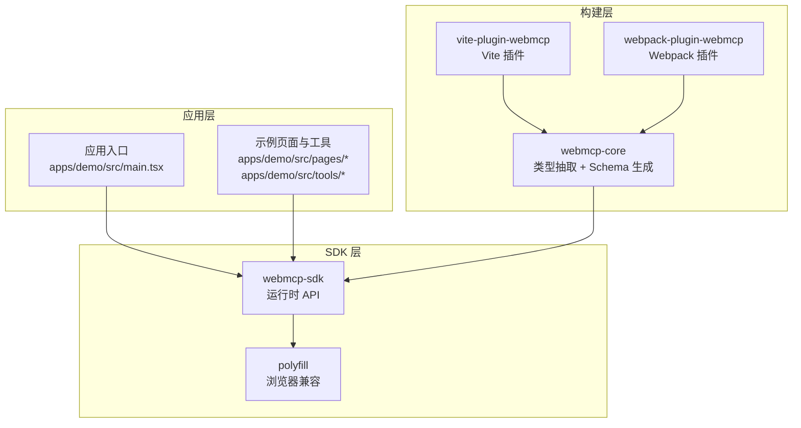
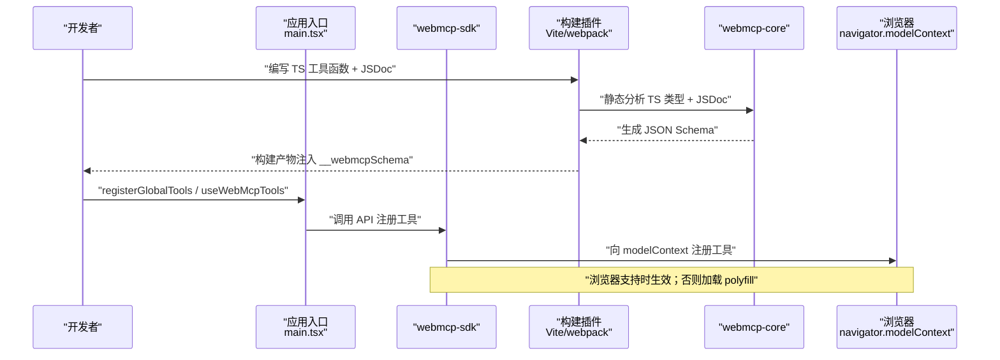
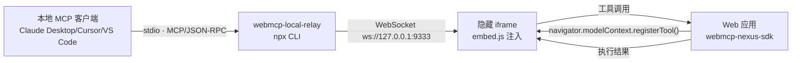
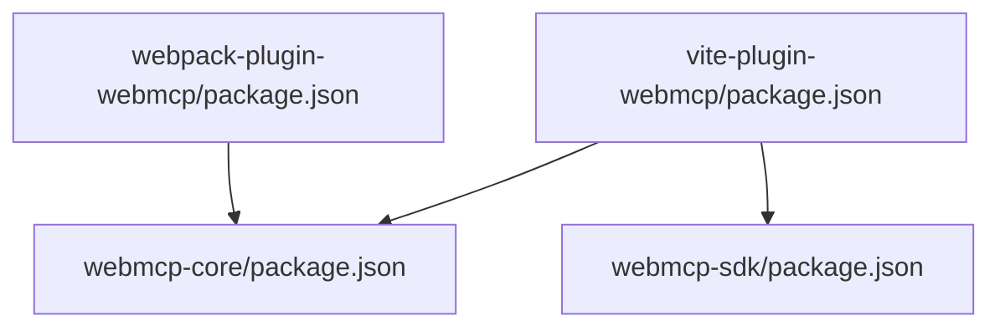

# 快速开始

<cite>
**本文引用的文件**
- [README.md](file://README.md)
- [vite.config.ts](file://apps/demo/vite.config.ts)
- [webpack.config.ts](file://apps/demo/webpack.config.ts)
- [main.tsx](file://apps/demo/src/main.tsx)
- [package.json](file://apps/demo/package.json)
- [vite-plugin-webmcp/package.json](file://packages/vite-plugin-webmcp/package.json)
- [webpack-plugin-webmcp/package.json](file://packages/webpack-plugin-webmcp/package.json)
- [webmcp-core/package.json](file://packages/webmcp-core/package.json)
- [webmcp-sdk/package.json](file://packages/webmcp-sdk/package.json)
- [registerGlobalTools.ts](file://packages/webmcp-sdk/src/registerGlobalTools.ts)
- [useWebMcpTools.ts](file://packages/webmcp-sdk/src/useWebMcpTools.ts)
- [SKILL.md](file://skill/SKILL.md)
</cite>

## 目录
1. [简介](#简介)
2. [项目结构](#项目结构)
3. [核心组件](#核心组件)
4. [架构总览](#架构总览)
5. [详细组件分析](#详细组件分析)
6. [依赖关系分析](#依赖关系分析)
7. [性能考虑](#性能考虑)
8. [故障排查指南](#故障排查指南)
9. [结论](#结论)
10. [附录](#附录)

## 简介
本指南面向希望在 5 分钟内完成 WebMCP Nexus 基础集成的开发者。你将学到：
- 前置条件检查与环境准备
- 安装依赖与配置构建插件（Vite 与 Webpack）
- 编写符合规范的工具函数
- 注册与使用工具（全局、路由、组件三级）
- 本地 Agent 驱动 Web 应用的桌面直连流程
- 常见问题排查与最佳实践

## 项目结构
WebMCP Nexus 采用 monorepo 结构，核心由三部分组成：
- packages/webmcp-sdk：运行时 SDK（2 个 API + Polyfill）
- packages/webmcp-core：构建时核心（TS 类型抽取 + JSON Schema 生成）
- packages/vite-plugin-webmcp / packages/webpack-plugin-webmcp：构建插件（Vite 与 Webpack）

图表来源
- [main.tsx:1-15](file://apps/demo/src/main.tsx#L1-L15)
- [vite.config.ts:1-17](file://apps/demo/vite.config.ts#L1-L17)
- [webpack.config.ts:1-77](file://apps/demo/webpack.config.ts#L1-L77)
- [webmcp-sdk/package.json:1-62](file://packages/webmcp-sdk/package.json#L1-L62)
- [webmcp-core/package.json:1-56](file://packages/webmcp-core/package.json#L1-L56)
- [vite-plugin-webmcp/package.json:1-59](file://packages/vite-plugin-webmcp/package.json#L1-L59)
- [webpack-plugin-webmcp/package.json:1-56](file://packages/webpack-plugin-webmcp/package.json#L1-L56)

章节来源
- [README.md:76-89](file://README.md#L76-L89)
- [package.json:1-56](file://apps/demo/package.json#L1-L56)

## 核心组件
- 运行时 API
  - registerGlobalTools：应用启动时一次性注册全局工具
  - useWebMcpTools：组件/路由级注册，随生命周期自动注销
- 构建插件
  - Vite 插件：在构建时静态分析 TS 类型 + JSDoc，注入 __webmcpSchema
  - Webpack 插件：同 Vite 插件能力，适配 Webpack 生态
- 类型抽取与 Schema 生成
  - 基于 ts-morph 驱动的类型抽取与 JSON Schema 生成
- Polyfill
  - 自动检测 navigator.modelContext，缺失时加载内置 polyfill

章节来源
- [README.md:47-50](file://README.md#L47-L50)
- [webmcp-sdk/src/index.ts:1-5](file://packages/webmcp-sdk/src/index.ts#L1-L5)
- [webmcp-core/src/index.ts:1-11](file://packages/webmcp-core/src/index.ts#L1-L11)

## 架构总览
下面的时序图展示了从“编写工具函数”到“Agent 调用”的完整链路。

图表来源
- [registerGlobalTools.ts:26-67](file://packages/webmcp-sdk/src/registerGlobalTools.ts#L26-L67)
- [useWebMcpTools.ts:46-135](file://packages/webmcp-sdk/src/useWebMcpTools.ts#L46-L135)
- [vite.config.ts:9-11](file://apps/demo/vite.config.ts#L9-L11)
- [webpack.config.ts:58-58](file://apps/demo/webpack.config.ts#L58-L58)

## 详细组件分析

### 1) 前置条件检查
- Node.js 版本：18+
- 包管理器：推荐 pnpm（monorepo 工作区）
- 浏览器支持：Chrome 146+ 原生；低版本自动加载 polyfill

章节来源
- [README.md:102-103](file://README.md#L102-L103)
- [webmcp-sdk/package.json:47](file://packages/webmcp-sdk/package.json#L47-L47)

### 2) 安装依赖
- 运行时 SDK：webmcp-nexus-sdk
- 构建插件：vite-plugin-webmcp-nexus 或 webpack-plugin-webmcp-nexus
- 依赖安装参考示例应用的 package.json

章节来源
- [README.md:104-109](file://README.md#L104-L109)
- [package.json:16-27](file://apps/demo/package.json#L16-L27)
- [vite-plugin-webmcp/package.json:46-49](file://packages/vite-plugin-webmcp/package.json#L46-L49)
- [webpack-plugin-webmcp/package.json:44-47](file://packages/webpack-plugin-webmcp/package.json#L44-L47)

### 3) 配置构建插件

#### Vite 配置
- 在 plugins 中加入 vitePluginWebMcp，并指定 include 范围
- 建议将插件置于 TS/React 转换之前

章节来源
- [README.md:113-127](file://README.md#L113-L127)
- [vite.config.ts:9-11](file://apps/demo/vite.config.ts#L9-L11)

#### Webpack 配置
- 使用 WebMcpPlugin 并设置 include
- 常规 entry/module/resolve/output 保持不变

章节来源
- [README.md:129-144](file://README.md#L129-L144)
- [webpack.config.ts:58-58](file://apps/demo/webpack.config.ts#L58-L58)

### 4) 编写工具函数
- 签名模板：单一对象参数 + 命名导出（或对象字面量注册）
- JSDoc 规范：函数一级描述 + 字段级描述；只读工具加 @readonly
- 类型支持矩阵：基础类型、字面量联合、可选字段、数组、嵌套对象（≤3 层）
- 不支持：any/unknown、泛型、枚举、超过 3 层嵌套、对象数组中的对象元素 schema

章节来源
- [SKILL.md:172-233](file://skill/SKILL.md#L172-L233)
- [SKILL.md:253-259](file://skill/SKILL.md#L253-L259)
- [README.md:358-372](file://README.md#L358-L372)

### 5) 注册与使用

#### 全局注册（应用启动时）
- 在应用入口调用 registerGlobalTools，批量导入模块导出的工具函数
- SDK 会在浏览器环境自动检测 navigator.modelContext 并注册

章节来源
- [README.md:166-176](file://README.md#L166-L176)
- [main.tsx:8-8](file://apps/demo/src/main.tsx#L8-L8)
- [registerGlobalTools.ts:26-67](file://packages/webmcp-sdk/src/registerGlobalTools.ts#L26-L67)

#### 路由/组件注册（随生命周期自动注销）
- 在组件内调用 useWebMcpTools，工具随组件挂载注册、卸载自动注销
- 推荐使用 useCallback 固化函数引用，避免 HMR 抖动

章节来源
- [README.md:178-200](file://README.md#L178-L200)
- [useWebMcpTools.ts:46-135](file://packages/webmcp-sdk/src/useWebMcpTools.ts#L46-L135)

### 6) 本地 Agent 直连（桌面驱动）
- 在页面 HTML 中引入 @mcp-b/webmcp-local-relay 的 embed.js
- 配置本地 MCP 客户端（如 Claude Desktop / Cursor / VS Code）拉起 npx @mcp-b/webmcp-local-relay
- Agent 通过隐藏 iframe 与 relay 建立 WebSocket，实时发现浏览器工具

图表来源
- [README.md:229-241](file://README.md#L229-L241)
- [README.md:249-258](file://README.md#L249-L258)
- [README.md:262-275](file://README.md#L262-L275)

章节来源
- [README.md:223-290](file://README.md#L223-L290)

### 7) AI 编码 Skill
- 仓库提供面向 AI 编码 Agent 的 Skill 文档，覆盖规范、改造流程与接入引导
- 支持 Claude Code、Cursor 等 IDE 的规则导入

章节来源
- [README.md:291-341](file://README.md#L291-L341)
- [skill/SKILL.md:1-682](file://skill/SKILL.md#L1-L682)

## 依赖关系分析

图表来源
- [vite-plugin-webmcp/package.json:46-49](file://packages/vite-plugin-webmcp/package.json#L46-L49)
- [webpack-plugin-webmcp/package.json:44-47](file://packages/webpack-plugin-webmcp/package.json#L44-L47)
- [webmcp-core/package.json:47-48](file://packages/webmcp-core/package.json#L47-L48)
- [webmcp-sdk/package.json:46-48](file://packages/webmcp-sdk/package.json#L46-L48)

章节来源
- [vite-plugin-webmcp/package.json:1-59](file://packages/vite-plugin-webmcp/package.json#L1-L59)
- [webpack-plugin-webmcp/package.json:1-56](file://packages/webpack-plugin-webmcp/package.json#L1-L56)
- [webmcp-core/package.json:1-56](file://packages/webmcp-core/package.json#L1-L56)
- [webmcp-sdk/package.json:1-62](file://packages/webmcp-sdk/package.json#L1-L62)

## 性能考虑
- 构建时类型反推：基于 ts-morph 的静态分析，无运行时开销
- HMR 友好：开发阶段修改函数签名，工具 schema 自动重新注册
- 三级作用域：组件级工具随生命周期自动注销，避免“幽灵工具”
- Polyfill 惰性加载：仅在需要时加载，业务代码零侵入

章节来源
- [README.md:68-74](file://README.md#L68-L74)
- [useWebMcpTools.ts:17-26](file://packages/webmcp-sdk/src/useWebMcpTools.ts#L17-L26)

## 故障排查指南
- 工具未注册
  - 检查 __webmcpSchema 是否注入（构建产物中 grep）
  - 确认函数签名满足 MUST 两条（单一对象参数、可被追踪）
  - 确认入口已调用 registerGlobalTools 或组件已调用 useWebMcpTools
- Schema 被污染
  - 输入参数类型为 any/unknown、原始类型/数组会导致原型链字段污染
- 描述缺失
  - 函数 JSDoc 或字段 JSDoc 缺失会导致 description 为空
- 浏览器不支持
  - 低版本浏览器需自动加载 polyfill；确认 polyfill 已加载
- Agent 无法发现工具
  - 确认已引入 @mcp-b/webmcp-local-relay 的 embed.js
  - 检查本地 MCP 客户端配置与 relay 端口

章节来源
- [SKILL.md:641-682](file://skill/SKILL.md#L641-L682)
- [README.md:342-348](file://README.md#L342-L348)
- [README.md:249-258](file://README.md#L249-L258)

## 结论
通过本指南，你可以在 5 分钟内完成 WebMCP Nexus 的基础集成：安装 SDK 与构建插件、编写符合规范的工具函数、在应用入口与组件内注册工具，并借助本地 Agent 直连能力，让 AI Agent 直接驱动你的 Web 应用。建议在开发过程中遵循 MUST/SHOULD/MAY 三级约束，充分利用 HMR 与三级作用域提升开发效率与稳定性。

## 附录

### A. 快速清单（5 分钟集成）
- 环境：Node.js 18+，pnpm
- 安装：webmcp-nexus-sdk + vite-plugin-webmcp-nexus 或 webpack-plugin-webmcp-nexus
- 配置：Vite/webpack 插件 include 指向 src
- 工具：编写单一对象参数 + JSDoc 的 TS 函数
- 注册：应用入口 registerGlobalTools；组件内 useWebMcpTools
- Agent：引入 embed.js，配置本地 MCP 客户端

章节来源
- [README.md:102-109](file://README.md#L102-L109)
- [README.md:113-144](file://README.md#L113-L144)
- [README.md:148-176](file://README.md#L148-L176)
- [README.md:249-258](file://README.md#L249-L258)