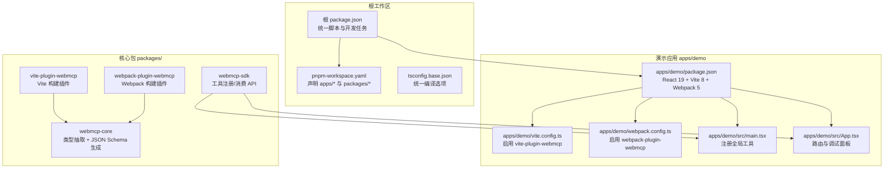
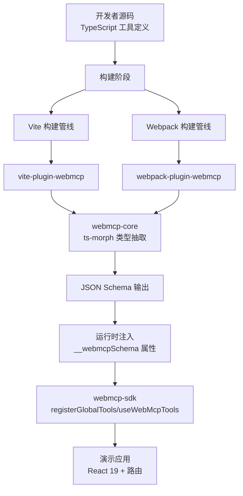
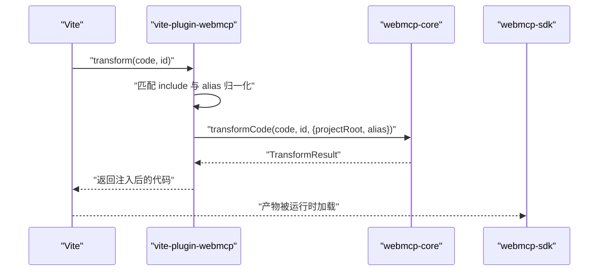
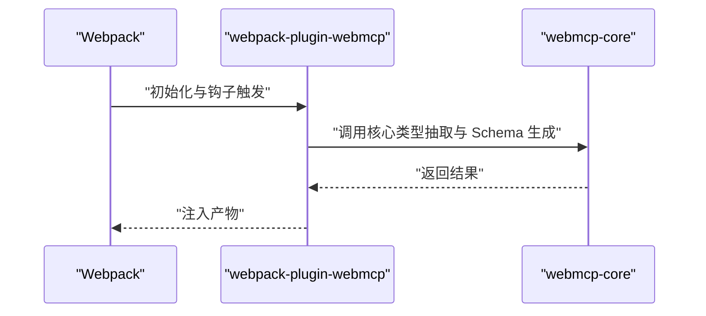
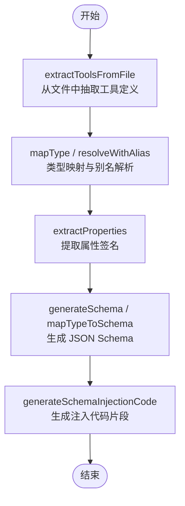
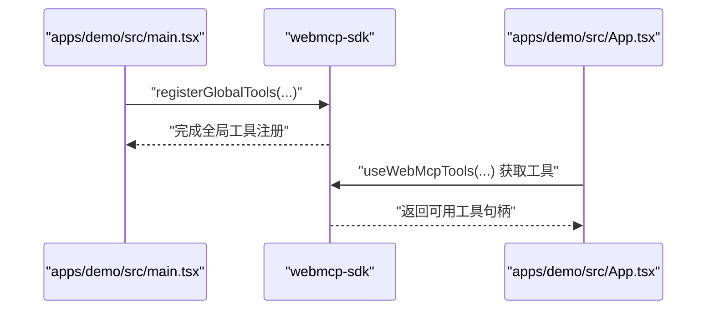
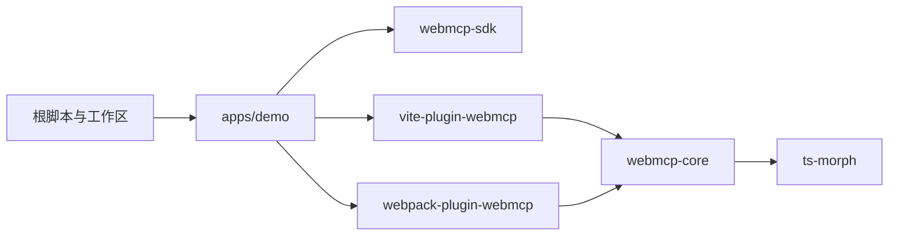

# 技术栈

<cite>
**本文引用的文件**
- [package.json](file://package.json)
- [pnpm-workspace.yaml](file://pnpm-workspace.yaml)
- [tsconfig.base.json](file://tsconfig.base.json)
- [apps/demo/package.json](file://apps/demo/package.json)
- [apps/demo/vite.config.ts](file://apps/demo/vite.config.ts)
- [apps/demo/webpack.config.ts](file://apps/demo/webpack.config.ts)
- [apps/demo/src/main.tsx](file://apps/demo/src/main.tsx)
- [apps/demo/src/App.tsx](file://apps/demo/src/App.tsx)
- [packages/vite-plugin-webmcp/package.json](file://packages/vite-plugin-webmcp/package.json)
- [packages/vite-plugin-webmcp/src/index.ts](file://packages/vite-plugin-webmcp/src/index.ts)
- [packages/webpack-plugin-webmcp/package.json](file://packages/webpack-plugin-webmcp/package.json)
- [packages/webpack-plugin-webmcp/src/index.ts](file://packages/webpack-plugin-webmcp/src/index.ts)
- [packages/webmcp-core/package.json](file://packages/webmcp-core/package.json)
- [packages/webmcp-core/src/index.ts](file://packages/webmcp-core/src/index.ts)
- [packages/webmcp-sdk/package.json](file://packages/webmcp-sdk/package.json)
- [packages/webmcp-sdk/src/index.ts](file://packages/webmcp-sdk/src/index.ts)
</cite>

## 目录
1. [引言](#引言)
2. [项目结构](#项目结构)
3. [核心组件](#核心组件)
4. [架构总览](#架构总览)
5. [详细组件分析](#详细组件分析)
6. [依赖关系分析](#依赖关系分析)
7. [性能与开发体验](#性能与开发体验)
8. [故障排查指南](#故障排查指南)
9. [结论](#结论)
10. [附录](#附录)

## 引言
本文件面向技术决策者与工程团队，系统阐述 WebMCP Nexus 的技术栈选型与协作机制。核心技术组合为：React 19、TypeScript、Vite 8 与 Webpack 5，并以 ts-morph 作为构建期类型分析引擎，配合 pnpm workspace 实现多包统一管理。该组合在“类型安全”“构建效率”“工具链可扩展性”“Monorepo 友好性”等方面达成平衡，既能满足前端应用开发需求，又能高效支撑 WebMCP（Model Context Protocol）标准的工具定义与运行时交互。

## 项目结构
项目采用 pnpm workspace 管理多包，根目录通过脚本统一编排开发、构建与发布流程；演示应用位于 apps/demo，核心能力拆分为三个包：webmcp-core（类型抽取与 JSON Schema 生成）、vite-plugin-webmcp（Vite 构建插件）、webpack-plugin-webmcp（Webpack 构建插件），SDK 包 webmcp-sdk 提供浏览器侧工具注册与消费 API。

图表来源
- [package.json:1-38](file://package.json#L1-L38)
- [pnpm-workspace.yaml:1-4](file://pnpm-workspace.yaml#L1-L4)
- [tsconfig.base.json:1-20](file://tsconfig.base.json#L1-L20)
- [apps/demo/package.json:1-56](file://apps/demo/package.json#L1-L56)
- [apps/demo/vite.config.ts:1-17](file://apps/demo/vite.config.ts#L1-L17)
- [apps/demo/webpack.config.ts:1-77](file://apps/demo/webpack.config.ts#L1-L77)
- [apps/demo/src/main.tsx:1-15](file://apps/demo/src/main.tsx#L1-L15)
- [apps/demo/src/App.tsx:1-98](file://apps/demo/src/App.tsx#L1-L98)
- [packages/webmcp-core/package.json:1-56](file://packages/webmcp-core/package.json#L1-L56)
- [packages/webmcp-sdk/package.json:1-62](file://packages/webmcp-sdk/package.json#L1-L62)
- [packages/vite-plugin-webmcp/package.json:1-59](file://packages/vite-plugin-webmcp/package.json#L1-L59)
- [packages/webpack-plugin-webmcp/package.json:1-56](file://packages/webpack-plugin-webmcp/package.json#L1-L56)

章节来源
- [package.json:1-38](file://package.json#L1-L38)
- [pnpm-workspace.yaml:1-4](file://pnpm-workspace.yaml#L1-L4)
- [tsconfig.base.json:1-20](file://tsconfig.base.json#L1-L20)

## 核心组件
- React 19：提供声明式 UI 与状态管理能力，结合 React Router v7 支持现代路由模型；演示应用中通过 Provider 模式组织多个业务 Store。
- TypeScript：统一的编译配置与严格模式，确保类型安全与可维护性；根级 tsconfig.base.json 提供严格、声明与 SourceMap 等基础能力。
- Vite 8：快速开发服务器与构建管线，支持按需 ESM 导出与热更新；演示应用通过 vite.config.ts 启用 vite-plugin-webmcp。
- Webpack 5：作为替代构建方案，演示应用同时提供 webpack.config.ts 并启用 webpack-plugin-webmcp，便于在复杂场景下进行深度定制。
- ts-morph：作为 webmcp-core 的底层类型分析引擎，负责从 TypeScript 源码中精确抽取工具类型信息并映射为 JSON Schema。
- pnpm workspace：统一管理多包依赖与脚本，支持 workspace:* 引用，简化本地联调与发布流程。

章节来源
- [apps/demo/package.json:16-28](file://apps/demo/package.json#L16-L28)
- [apps/demo/package.json:47-53](file://apps/demo/package.json#L47-L53)
- [packages/webmcp-core/package.json:48](file://packages/webmcp-core/package.json#L48)
- [packages/webmcp-sdk/package.json:49-51](file://packages/webmcp-sdk/package.json#L49-L51)
- [tsconfig.base.json:2-18](file://tsconfig.base.json#L2-L18)
- [package.json:5-20](file://package.json#L5-L20)

## 架构总览
WebMCP Nexus 的技术栈围绕“构建期类型分析 + 运行时工具注册”的闭环设计展开。开发者在源码中以 TypeScript 定义工具函数及其参数/返回值类型；在构建阶段，Vite 或 Webpack 插件委托 webmcp-core 使用 ts-morph 抽取类型并生成 JSON Schema；随后在运行时，webmcp-sdk 将这些工具注册到全局，供 AI Agent 调用。

图表来源
- [packages/vite-plugin-webmcp/src/index.ts:39-99](file://packages/vite-plugin-webmcp/src/index.ts#L39-L99)
- [packages/webpack-plugin-webmcp/src/index.ts:1-3](file://packages/webpack-plugin-webmcp/src/index.ts#L1-L3)
- [packages/webmcp-core/src/index.ts:1-11](file://packages/webmcp-core/src/index.ts#L1-L11)
- [packages/webmcp-sdk/src/index.ts:1-5](file://packages/webmcp-sdk/src/index.ts#L1-L5)
- [apps/demo/src/main.tsx:1-15](file://apps/demo/src/main.tsx#L1-L15)
- [apps/demo/src/App.tsx:1-98](file://apps/demo/src/App.tsx#L1-L98)

## 详细组件分析

### Vite 插件：vite-plugin-webmcp
- 作用：在 Vite 构建的 transform 阶段，对匹配的源文件执行类型抽取与代码注入，生成包含 __webmcpSchema 的产物。
- 关键点：
  - 通过 include 控制扫描范围，默认针对 src 下的 ts/tsx 文件。
  - 合并 Vite 与用户自定义 alias，提升模块解析准确性。
  - 委托 webmcp-core 的 transformCode 执行实际转换逻辑。
- 与核心包协作：依赖 webmcp-nexus-core，导出 vitePluginWebMcp 工厂函数。

图表来源
- [packages/vite-plugin-webmcp/src/index.ts:39-99](file://packages/vite-plugin-webmcp/src/index.ts#L39-L99)
- [packages/webmcp-core/src/index.ts:1-11](file://packages/webmcp-core/src/index.ts#L1-L11)
- [apps/demo/vite.config.ts:3-12](file://apps/demo/vite.config.ts#L3-L12)

章节来源
- [packages/vite-plugin-webmcp/src/index.ts:14-99](file://packages/vite-plugin-webmcp/src/index.ts#L14-L99)
- [packages/vite-plugin-webmcp/package.json:47-52](file://packages/vite-plugin-webmcp/package.json#L47-L52)
- [apps/demo/vite.config.ts:1-17](file://apps/demo/vite.config.ts#L1-L17)

### Webpack 插件：webpack-plugin-webmcp
- 作用：在 Webpack 构建阶段注入 JSON Schema，与 Vite 版本保持一致的类型抽取与注入目标。
- 关键点：
  - 通过 WebMcpPlugin 类实现插件逻辑，与 Vite 插件共享核心能力。
  - 在演示应用中通过 webpack.config.ts 启用，支持 DefinePlugin 注入环境变量。
- 与核心包协作：依赖 webmcp-nexus-core，导出 WebMcpPlugin。

图表来源
- [packages/webpack-plugin-webmcp/src/index.ts:1-3](file://packages/webpack-plugin-webmcp/src/index.ts#L1-L3)
- [packages/webmcp-core/src/index.ts:1-11](file://packages/webmcp-core/src/index.ts#L1-L11)
- [apps/demo/webpack.config.ts:4-63](file://apps/demo/webpack.config.ts#L4-L63)

章节来源
- [packages/webpack-plugin-webmcp/package.json:44-49](file://packages/webpack-plugin-webmcp/package.json#L44-L49)
- [apps/demo/webpack.config.ts:1-77](file://apps/demo/webpack.config.ts#L1-L77)

### 核心库：webmcp-core
- 作用：提供类型抽取、类型映射、属性提取与 JSON Schema 生成等能力，是 Vite/webpack 插件的共同依赖。
- 关键点：
  - 依赖 ts-morph 进行 AST 解析与类型推断。
  - 暴露 transformCode、extractToolsFromFile、generateSchema 等 API。
- 价值：将“类型即协议”的理念落地为可执行的 JSON Schema，支撑 WebMCP 标准。

图表来源
- [packages/webmcp-core/src/index.ts:1-11](file://packages/webmcp-core/src/index.ts#L1-L11)
- [packages/webmcp-core/package.json:48](file://packages/webmcp-core/package.json#L48)

章节来源
- [packages/webmcp-core/src/index.ts:1-11](file://packages/webmcp-core/src/index.ts#L1-L11)
- [packages/webmcp-core/package.json:1-56](file://packages/webmcp-core/package.json#L1-L56)

### SDK：webmcp-sdk
- 作用：在浏览器端注册与消费工具，提供 registerGlobalTools 与 useWebMcpTools 等 API，驱动 WebMCP 工具在运行时可用。
- 关键点：
  - 作为 React SDK，与 React 19 兼容，提供 hooks 化的工具使用方式。
  - 与演示应用集成，通过 main.tsx 注册导航等工具。

图表来源
- [apps/demo/src/main.tsx:1-15](file://apps/demo/src/main.tsx#L1-L15)
- [apps/demo/src/App.tsx:1-98](file://apps/demo/src/App.tsx#L1-L98)
- [packages/webmcp-sdk/src/index.ts:1-5](file://packages/webmcp-sdk/src/index.ts#L1-L5)

章节来源
- [packages/webmcp-sdk/src/index.ts:1-5](file://packages/webmcp-sdk/src/index.ts#L1-L5)
- [apps/demo/src/main.tsx:1-15](file://apps/demo/src/main.tsx#L1-L15)
- [apps/demo/src/App.tsx:1-98](file://apps/demo/src/App.tsx#L1-L98)

### 演示应用：apps/demo
- React 19 + React Router v7：提供页面路由与状态容器，演示工具注册与调试面板。
- Vite 8 与 Webpack 5 双构建：通过不同配置分别启用对应插件，验证构建链路一致性。
- 开发脚本：根脚本统一调度 demo 子包的 dev/build/test 等命令。

章节来源
- [apps/demo/package.json:16-28](file://apps/demo/package.json#L16-L28)
- [apps/demo/package.json:47-53](file://apps/demo/package.json#L47-L53)
- [apps/demo/vite.config.ts:1-17](file://apps/demo/vite.config.ts#L1-L17)
- [apps/demo/webpack.config.ts:1-77](file://apps/demo/webpack.config.ts#L1-L77)
- [package.json:5-20](file://package.json#L5-L20)

## 依赖关系分析
- Monorepo 管理：pnpm-workspace.yaml 声明 apps/* 与 packages/*，根脚本统一编排构建与测试。
- 依赖拓扑：
  - vite-plugin-webmcp 与 webpack-plugin-webmcp 均依赖 webmcp-core。
  - webmcp-core 依赖 ts-morph。
  - webmcp-sdk 作为浏览器端工具注册与消费层，被演示应用直接使用。
  - 演示应用依赖 webmcp-sdk 与上述插件，分别在 Vite 与 Webpack 场景下启用。

图表来源
- [pnpm-workspace.yaml:1-4](file://pnpm-workspace.yaml#L1-L4)
- [packages/vite-plugin-webmcp/package.json:47-52](file://packages/vite-plugin-webmcp/package.json#L47-L52)
- [packages/webpack-plugin-webmcp/package.json:44-49](file://packages/webpack-plugin-webmcp/package.json#L44-L49)
- [packages/webmcp-core/package.json:48](file://packages/webmcp-core/package.json#L48)
- [packages/webmcp-sdk/package.json:49-51](file://packages/webmcp-sdk/package.json#L49-L51)

章节来源
- [pnpm-workspace.yaml:1-4](file://pnpm-workspace.yaml#L1-L4)
- [package.json:1-38](file://package.json#L1-L38)

## 性能与开发体验
- Vite 8：冷启动快、热更新高效，适合日常开发；演示应用关闭压缩以提升构建速度，便于调试。
- Webpack 5：在需要深度定制或兼容既有生态时提供稳定选择；演示应用同样关闭压缩以便观察产物。
- ts-morph：在构建期进行类型抽取，避免运行时开销；通过缓存与增量处理优化大型项目的构建时间。
- pnpm workspace：去重依赖、硬链接加速安装，统一脚本减少心智负担。

章节来源
- [apps/demo/vite.config.ts:13-16](file://apps/demo/vite.config.ts#L13-L16)
- [apps/demo/webpack.config.ts:65-67](file://apps/demo/webpack.config.ts#L65-L67)
- [packages/webmcp-core/package.json:48](file://packages/webmcp-core/package.json#L48)
- [package.json:32-36](file://package.json#L32-L36)

## 故障排查指南
- 构建失败或未注入 Schema
  - 检查 include 是否覆盖到目标文件路径。
  - 确认 alias 配置是否正确，必要时开启 DEBUG 日志定位 transform 失败原因。
  - 参考 Vite 插件的 transform 失败告警与日志输出。
- 运行时工具不可用
  - 确认已调用 registerGlobalTools 注册工具。
  - 检查 __webmcpSchema 是否随产物注入。
- 路由与公共路径
  - Vite 使用 import.meta.env.BASE_URL，Webpack 通过 DefinePlugin 注入 process.env.DEMO_BASE，确保 basename 正确。

章节来源
- [packages/vite-plugin-webmcp/src/index.ts:55-97](file://packages/vite-plugin-webmcp/src/index.ts#L55-L97)
- [apps/demo/src/main.tsx:1-15](file://apps/demo/src/main.tsx#L1-L15)
- [apps/demo/src/App.tsx:83-89](file://apps/demo/src/App.tsx#L83-L89)

## 结论
该技术栈在“类型即协议”的前提下，将 TypeScript 的强类型能力与构建期自动化相结合，借助 ts-morph 与 Vite/webpack 插件体系，实现了从源码到 JSON Schema 再到运行时工具注册的完整链路。React 19 与现代路由为演示应用提供了良好的开发体验，pnpm workspace 则保障了多包协作的一致性与可维护性。对于技术决策者而言，这一组合在保证质量与性能的同时，具备良好的扩展性与演进空间。

## 附录
- 术语
  - WebMCP：Model Context Protocol，一种用于 AI Agent 与应用上下文交互的协议。
  - JSON Schema：描述工具签名与参数约束的数据结构，用于 AI Agent 的工具调用协商。
  - ts-morph：基于 TypeScript 的 AST 解析库，用于精确提取类型信息。