# 核心特性

<cite>
**本文引用的文件**
- [README.md](file://README.md)
- [package.json](file://package.json)
- [packages/webmcp-core/package.json](file://packages/webmcp-core/package.json)
- [packages/webmcp-sdk/package.json](file://packages/webmcp-sdk/package.json)
- [packages/vite-plugin-webmcp/package.json](file://packages/vite-plugin-webmcp/package.json)
- [packages/webpack-plugin-webmcp/package.json](file://packages/webpack-plugin-webmcp/package.json)
- [packages/webmcp-core/src/index.ts](file://packages/webmcp-core/src/index.ts)
- [packages/webmcp-sdk/src/index.ts](file://packages/webmcp-sdk/src/index.ts)
- [packages/vite-plugin-webmcp/src/index.ts](file://packages/vite-plugin-webmcp/src/index.ts)
- [packages/webpack-plugin-webmcp/src/index.ts](file://packages/webpack-plugin-webmcp/src/index.ts)
- [skill/SKILL.md](file://skill/SKILL.md)
</cite>

## 目录
1. [引言](#引言)
2. [项目结构](#项目结构)
3. [核心组件](#核心组件)
4. [架构总览](#架构总览)
5. [详细组件分析](#详细组件分析)
6. [依赖关系分析](#依赖关系分析)
7. [性能考量](#性能考量)
8. [故障排查指南](#故障排查指南)
9. [结论](#结论)
10. [附录](#附录)

## 引言
WebMCP Nexus 是一套围绕 WebMCP 标准的零侵入前端集成方案，目标是以极低的学习成本与接入成本，将任意 React 应用在数分钟内变为 MCP 客户端可直接驱动的对象。项目通过“运行时 SDK + 构建时插件”的双轮驱动，实现了从“函数定义”到“工具注册”的全链路自动化，覆盖极简 API、构建时类型反推、HMR 友好、三级作用域管理、冲突感知、跨浏览器透明兼容、桌面 Agent 直连、AI 编码 Skill 内置等八大核心亮点。

## 项目结构
项目采用 pnpm workspace 的 monorepo 结构，核心由四个包组成：
- webmcp-core：构建时核心，负责 TypeScript 类型抽取与 JSON Schema 生成
- webmcp-sdk：运行时 SDK，提供 registerGlobalTools 与 useWebMcpTools 两个 API，并内置 polyfill
- vite-plugin-webmcp：Vite 构建插件，将核心能力注入到构建流程
- webpack-plugin-webmcp：Webpack 构建插件，提供同等能力的 Webpack 版本

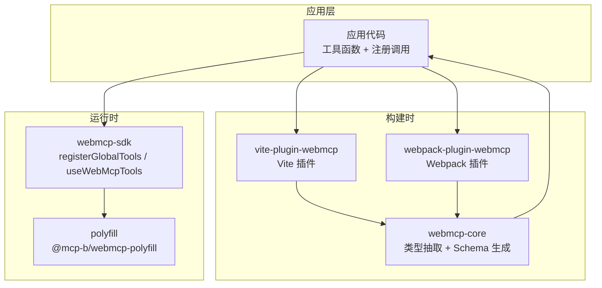

图表来源
- [packages/webmcp-core/src/index.ts:1-11](file://packages/webmcp-core/src/index.ts#L1-L11)
- [packages/vite-plugin-webmcp/src/index.ts:1-102](file://packages/vite-plugin-webmcp/src/index.ts#L1-L102)
- [packages/webpack-plugin-webmcp/src/index.ts:1-3](file://packages/webpack-plugin-webmcp/src/index.ts#L1-L3)
- [packages/webmcp-sdk/src/index.ts:1-5](file://packages/webmcp-sdk/src/index.ts#L1-L5)

章节来源
- [README.md:76-89](file://README.md#L76-L89)
- [package.json:1-38](file://package.json#L1-L38)

## 核心组件
- 极简 API：运行时仅暴露 registerGlobalTools 与 useWebMcpTools 两个 API，覆盖全局、路由、组件三类生命周期，30 秒看懂、5 分钟接入。
- 构建时类型反推：基于 ts-morph 的静态分析，将函数签名与 JSDoc 直接映射为 JSON Schema，零标注、零包装，无运行时开销。
- HMR 友好：开发期修改函数签名，插件自动重新注入 __webmcpSchema 并触发工具重新注册，无需手动刷新。
- 三级作用域管理：全局（应用启动注册）、路由（页面级注册）、组件（弹窗/面板级注册），组件卸载自动注销，避免“幽灵工具”污染上下文。
- 冲突感知机制：内部维护 scope ownership registry，多 scope 同名注册时仅发出警告，注销严格隔离，不阻断 UI 渲染。
- 跨浏览器透明兼容：Chrome 146+ 使用原生 navigator.modelContext；低版本环境自动加载内置 polyfill，业务代码完全无感。
- 桌面 Agent 直连：通过 @mcp-b/webmcp-local-relay，Claude Desktop / Cursor / VS Code 等本地 MCP 客户端可直接驱动浏览器中的 Web 应用。
- AI 编码 Skill 内置：提供面向 Claude Code、Cursor 等 Agent 的 Skill 文档，将“为函数生成 WebMCP 工具”简化为一句话指令。

章节来源
- [README.md:65-74](file://README.md#L65-L74)
- [README.md:178-201](file://README.md#L178-L201)
- [README.md:342-356](file://README.md#L342-L356)
- [README.md:223-290](file://README.md#L223-L290)
- [skill/SKILL.md:1-682](file://skill/SKILL.md#L1-L682)

## 架构总览
WebMCP Nexus 的整体架构分为“构建时”和“运行时”两大阶段：
- 构建时：Vite/ Webpack 插件在 transform 钩子中委托 webmcp-core，从 TS 类型与 JSDoc 中抽取信息，生成 JSON Schema，并注入到函数对象的 __webmcpSchema 字段。
- 运行时：SDK 在浏览器环境中读取 __webmcpSchema，向 navigator.modelContext 注册工具；同时根据环境自动加载 polyfill，保证跨浏览器一致性。

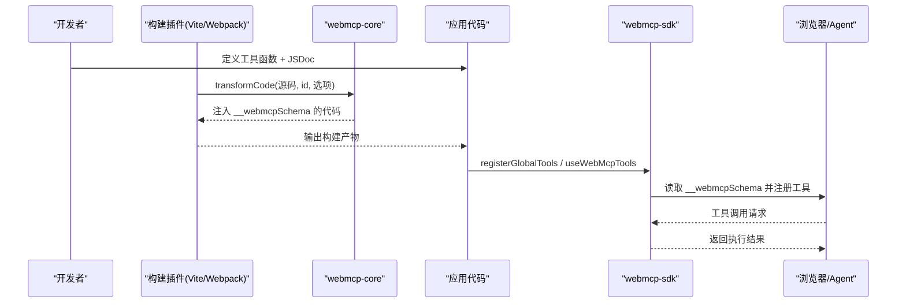

图表来源
- [packages/vite-plugin-webmcp/src/index.ts:55-97](file://packages/vite-plugin-webmcp/src/index.ts#L55-L97)
- [packages/webmcp-core/src/index.ts:1-11](file://packages/webmcp-core/src/index.ts#L1-L11)
- [packages/webmcp-sdk/src/index.ts:1-5](file://packages/webmcp-sdk/src/index.ts#L1-L5)

## 详细组件分析

### 极简 API 设计
- 设计原则：以最少的 API 表面覆盖所有使用场景，降低学习与迁移成本。
- 运行时 API：
  - registerGlobalTools：应用级注册，适合通用查询、认证、CRUD 等全局工具。
  - useWebMcpTools：组件/路由级注册，适合当前页面或组件内的局部交互工具。
- 优势：
  - 30 秒看懂：API 名称直观，职责清晰。
  - 5 分钟接入：只需在应用入口与组件内各加一行调用，即可完成工具注册。
  - 生命周期自动管理：组件级工具随挂载/卸载自动注册/注销，避免资源泄漏。

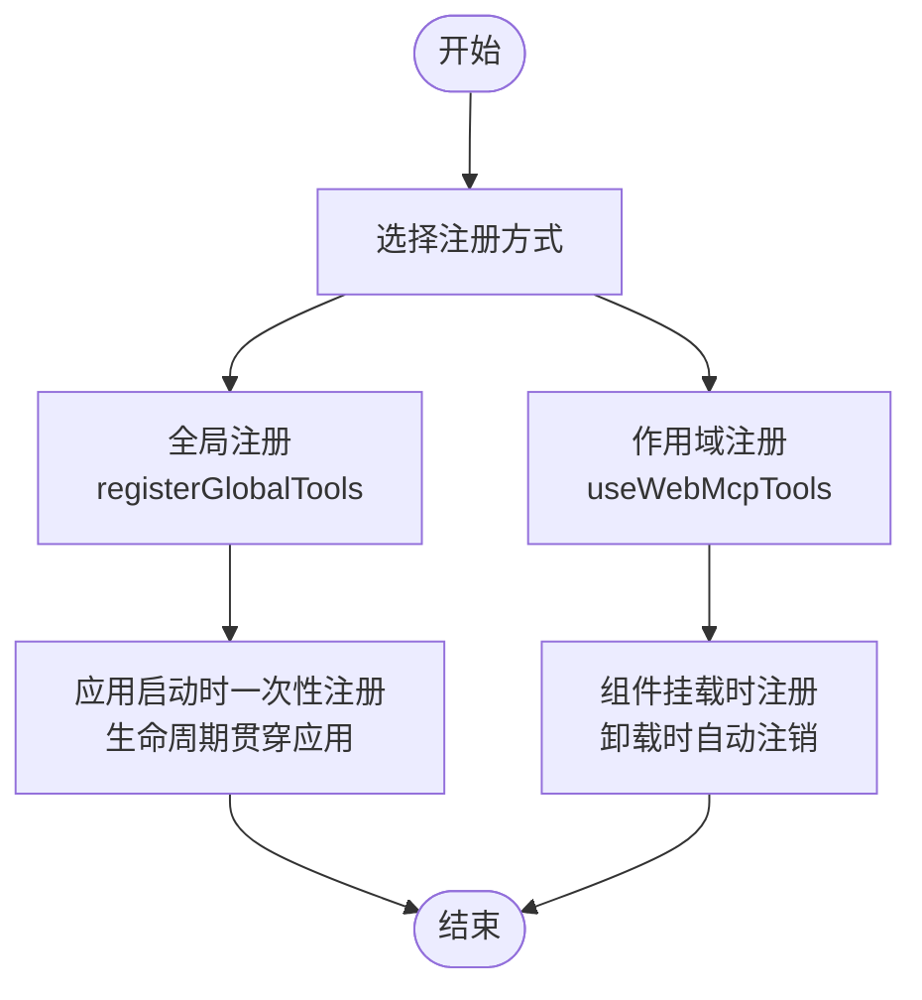

图表来源
- [README.md:178-201](file://README.md#L178-L201)
- [packages/webmcp-sdk/src/index.ts:1-5](file://packages/webmcp-sdk/src/index.ts#L1-L5)

章节来源
- [README.md:56-64](file://README.md#L56-L64)
- [README.md:178-201](file://README.md#L178-L201)
- [skill/SKILL.md:507-617](file://skill/SKILL.md#L507-L617)

### 构建时类型反推
- 技术原理：基于 ts-morph 的静态分析，从 TS 类型与 JSDoc 中抽取工具函数的输入参数结构与描述，自动生成 JSON Schema，并注入到函数对象的 __webmcpSchema 字段。
- 关键能力：
  - 函数签名 = JSON Schema：无需手写 JSON Schema，减少双源维护成本。
  - JSDoc 驱动描述：函数与参数的 JSDoc 直接成为工具描述与字段说明，提升 LLM 理解度。
  - 零标注、零包装：业务函数保持原样，原有调用方完全无感。
- 类型支持矩阵（稳定支持）：基础类型、字面量联合、可选属性、嵌套对象（≤3 层）等；不建议依赖泛型、映射/条件类型、超过 3 层的深度嵌套等。

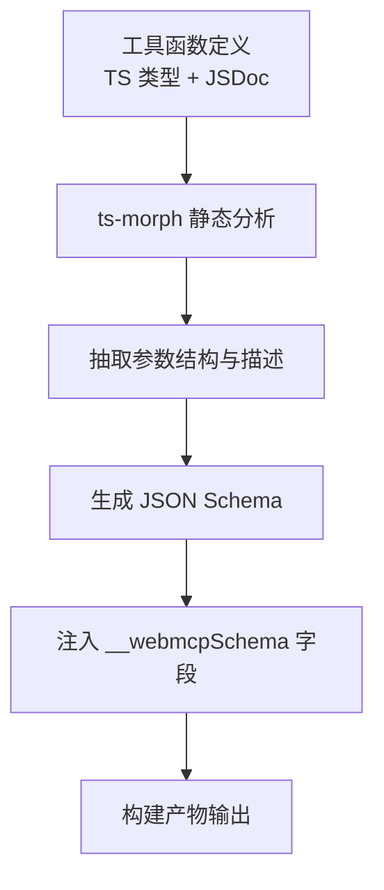

图表来源
- [packages/webmcp-core/src/index.ts:1-11](file://packages/webmcp-core/src/index.ts#L1-L11)
- [packages/vite-plugin-webmcp/src/index.ts:55-97](file://packages/vite-plugin-webmcp/src/index.ts#L55-L97)
- [skill/SKILL.md:219-233](file://skill/SKILL.md#L219-L233)

章节来源
- [README.md:68-69](file://README.md#L68-L69)
- [packages/webmcp-core/package.json:47-49](file://packages/webmcp-core/package.json#L47-L49)
- [skill/SKILL.md:19-47](file://skill/SKILL.md#L19-L47)

### HMR 友好
- 实现机制：Vite 插件在 transform 钩子中对匹配的源文件进行增量转换，当函数签名或 JSDoc 发生变化时，重新注入 __webmcpSchema 并触发 SDK 的重新注册。
- 效果：
  - 开发期无需手动刷新，修改即生效。
  - 避免重复劳动，显著提升调试效率。
- 注意事项：推荐在组件内使用 useCallback 固化函数引用，减少 HMR 下的重注册抖动。

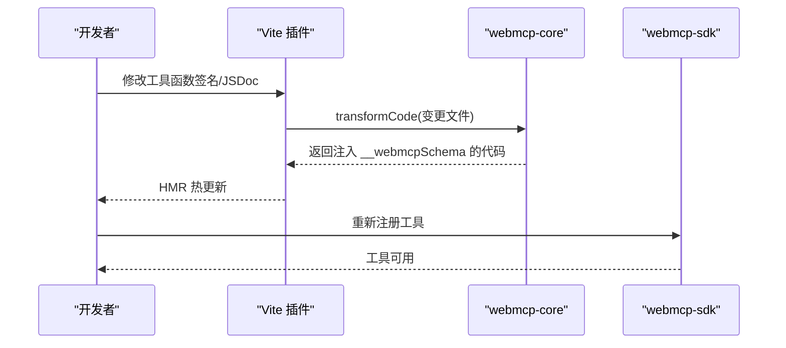

图表来源
- [packages/vite-plugin-webmcp/src/index.ts:55-97](file://packages/vite-plugin-webmcp/src/index.ts#L55-L97)
- [README.md:69](file://README.md#L69-L69)

章节来源
- [README.md:69](file://README.md#L69-L69)
- [skill/SKILL.md:652-654](file://skill/SKILL.md#L652-L654)

### 三级作用域管理
- 全局作用域：registerGlobalTools，应用启动时一次性注册，适合通用 API。
- 路由作用域：useWebMcpTools，页面级注册，适合当前路由独占的操作。
- 组件作用域：useWebMcpTools，组件级注册，适合弹窗、面板等局部交互。
- 生命周期：组件挂载注册，卸载自动注销；多实例通过内部 scopeId 区分，互不干扰。
- 收益：避免“幽灵工具”污染上下文，确保 Agent 在正确的页面调用正确的工具。

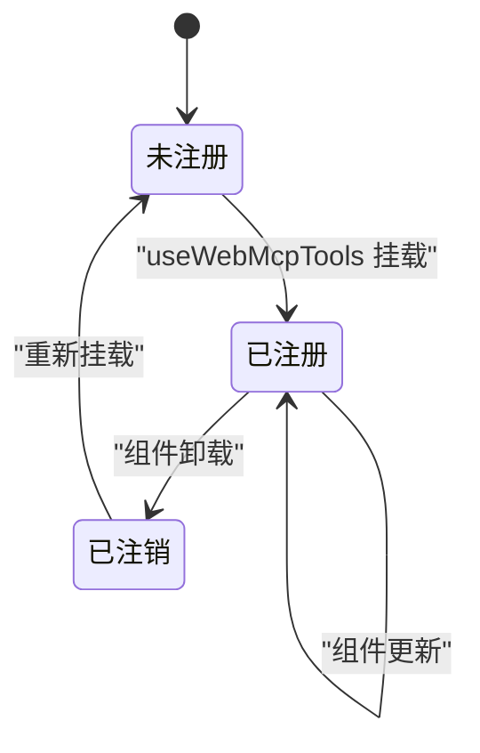

图表来源
- [README.md:178-201](file://README.md#L178-L201)
- [skill/SKILL.md:551-617](file://skill/SKILL.md#L551-L617)

章节来源
- [README.md:178-201](file://README.md#L178-L201)
- [skill/SKILL.md:516-617](file://skill/SKILL.md#L516-L617)

### 冲突感知机制
- 内部维护 scope ownership registry，记录每个工具名的注册来源（scope + scopeId）。
- 多个 scope 注册同名工具时：
  - 控制台输出警告，但仍允许注册，不阻断 UI 渲染。
  - 注销时只清理自己 scope 的注册，不影响其他作用域的同名工具。
- 最佳实践：使用语义化的唯一工具名，不同层级避免同名冲突。

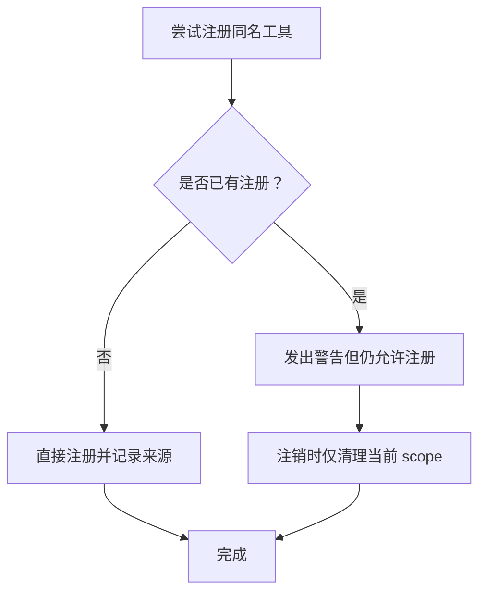

图表来源
- [README.md:349-356](file://README.md#L349-L356)

章节来源
- [README.md:349-356](file://README.md#L349-L356)

### 跨浏览器透明兼容
- Chrome 146+：直接使用原生 navigator.modelContext。
- 低版本环境（Chrome <146 / Firefox / Safari / Edge legacy 等）：SDK 入口自动加载内置 @mcp-b/webmcp-polyfill，对业务透明。
- 收益：无需针对不同浏览器编写分支逻辑，统一的 SDK 即可覆盖所有场景。

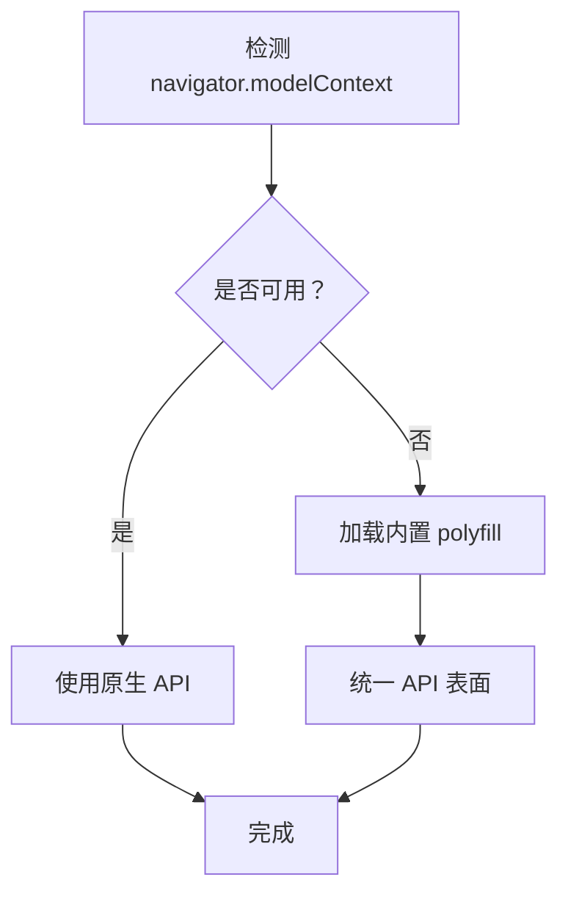

图表来源
- [README.md:342-348](file://README.md#L342-L348)
- [packages/webmcp-sdk/package.json:46-48](file://packages/webmcp-sdk/package.json#L46-L48)

章节来源
- [README.md:342-348](file://README.md#L342-L348)
- [packages/webmcp-sdk/package.json:46-48](file://packages/webmcp-sdk/package.json#L46-L48)

### 桌面 Agent 直连
- 工作原理：通过 @mcp-b/webmcp-local-relay 在本机以 stdio MCP server 形式运行，同时在 localhost:9333 暴露 WebSocket 端点；Web 应用加载 relay 提供的 embed.js，在页面注入隐藏 iframe，与 relay 建立 WebSocket 连接，并把 navigator.modelContext 上注册的全部工具实时上报给桌面 Agent。
- 接入步骤：
  1) 在应用入口 HTML 中引入 embed.js。
  2) 在 MCP 客户端中配置 relay。
  3) 启动应用并在 Agent 端驱动，Agent 即可直接调用浏览器中的工具。
- 收益：将浏览器中的 Web 应用变为 Agent 的“双手”，实现真正的“所想即所动”。

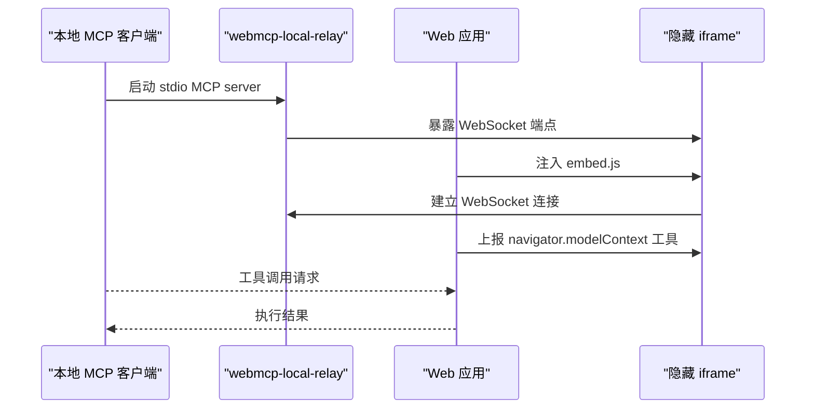

图表来源
- [README.md:223-290](file://README.md#L223-L290)

章节来源
- [README.md:223-290](file://README.md#L223-L290)

### AI 编码 Skill 内置
- 目标：将“为现有函数生成 WebMCP 工具”简化为一句话指令，Agent 可按 Skill 规范自动完成签名、JSDoc、类型声明的补齐与改造。
- 核心约束（MUST/SHOULD/MAY 三级）：
  - MUST：工具函数必须可被追踪、必须接受单一对象类型参数。
  - SHOULD：函数与字段应具备 JSDoc 描述，只读工具应标注 @readonly。
  - MAY：风格建议，不影响功能。
- 收益：零风险改造流程（只改签名与注释，不动业务逻辑），显著提升团队协作效率与开发体验。

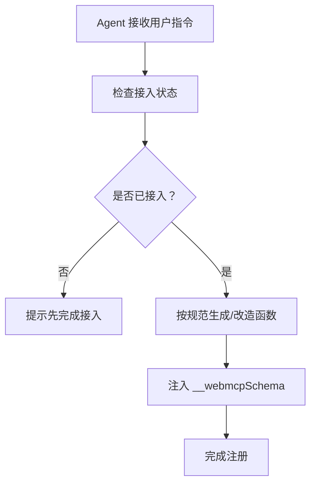

图表来源
- [skill/SKILL.md:19-47](file://skill/SKILL.md#L19-L47)
- [skill/SKILL.md:280-491](file://skill/SKILL.md#L280-L491)

章节来源
- [README.md:291-341](file://README.md#L291-L341)
- [skill/SKILL.md:1-682](file://skill/SKILL.md#L1-L682)

## 依赖关系分析
- 构建插件依赖 webmcp-core：Vite 与 Webpack 插件均通过 transform 钩子调用 webmcp-core 的 transformCode，完成类型抽取与代码注入。
- 运行时 SDK 依赖 polyfill：在不支持 navigator.modelContext 的环境中自动加载 @mcp-b/webmcp-polyfill，保证运行时一致性。
- 包导出与入口：
  - webmcp-core：导出 transformCode、ts-extractor、schema-generator 等核心 API。
  - webmcp-sdk：导出 registerGlobalTools 与 useWebMcpTools，并暴露类型定义。
  - 插件：分别导出 vitePluginWebMcp 与 WebMcpPlugin。

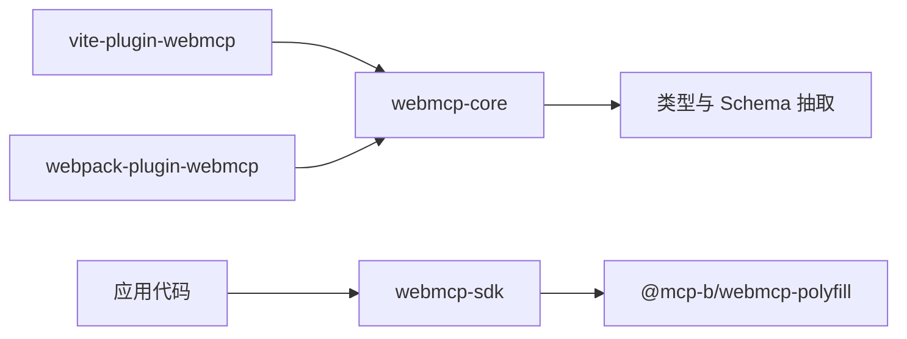

图表来源
- [packages/vite-plugin-webmcp/src/index.ts:10](file://packages/vite-plugin-webmcp/src/index.ts#L10)
- [packages/webpack-plugin-webmcp/src/index.ts:1](file://packages/webpack-plugin-webmcp/src/index.ts#L1)
- [packages/webmcp-core/src/index.ts:1-11](file://packages/webmcp-core/src/index.ts#L1-L11)
- [packages/webmcp-sdk/src/index.ts:1-5](file://packages/webmcp-sdk/src/index.ts#L1-L5)

章节来源
- [packages/vite-plugin-webmcp/package.json:46-49](file://packages/vite-plugin-webmcp/package.json#L46-L49)
- [packages/webpack-plugin-webmcp/package.json:44-46](file://packages/webpack-plugin-webmcp/package.json#L44-L46)
- [packages/webmcp-sdk/package.json:46-48](file://packages/webmcp-sdk/package.json#L46-L48)

## 性能考量
- 构建时反推，无运行时开销：JSON Schema 在构建阶段生成并注入 __webmcpSchema，运行时仅读取，避免额外的运行时计算。
- HMR 增量更新：插件仅对变更文件进行转换，减少不必要的重打包与重注册。
- 作用域隔离：组件级工具随卸载自动注销，避免累积注册带来的内存与上下文污染。
- 兼容层按需加载：polyfill 仅在需要时加载，不支持原生 API 的环境才会启用，保证高性能场景下的最优表现。

## 故障排查指南
- 工具未注册或不可见：
  - 检查 navigator.modelContext 是否存在（需要宿主环境支持）。
  - 确认构建产物中函数带有 __webmcpSchema。
  - 核查 __webmcpSchema.inputSchema.properties 是否被原型链污染（违反 MUST 条款）。
  - 确认入口已调用 registerGlobalTools；组件已调用 useWebMcpTools。
  - 查看浏览器控制台是否有 WebMCP warning。
- HMR 下频繁重注册：
  - 推荐使用 useCallback 固化函数引用，避免 HMR 期间的抖动。
- 返回值不符合要求：
  - 必须为 JSON 可序列化（纯对象、数组、原始值），避免返回 Map/Set、Date（建议转 ISO 字符串）、DOM 节点、函数等。
- 参数类型来源限制：
  - 支持来自同文件定义的类型；不支持来自 node_modules 的第三方类型及含泛型的类型。

章节来源
- [skill/SKILL.md:641-682](file://skill/SKILL.md#L641-L682)

## 结论
WebMCP Nexus 通过“极简 API + 构建时类型反推 + HMR 友好 + 三级作用域 + 冲突感知 + 跨浏览器兼容 + 桌面 Agent 直连 + AI 编码 Skill”的组合拳，形成了从“函数定义”到“Agent 驱动”的完整闭环。它不仅大幅降低了前端与 AI Agent 的集成门槛，还通过严格的类型约束与运行时保障，提升了系统的稳定性与可维护性。对于追求极致开发体验与团队协作效率的团队而言，WebMCP Nexus 是一个兼具前瞻性与实用性的优选方案。

## 附录
- 快速开始与示例应用参见项目根目录 README 与 apps/demo。
- AI 编码 Skill 文档位于 skill/SKILL.md，覆盖接入引导、规范约束、改造流程与正误对照。