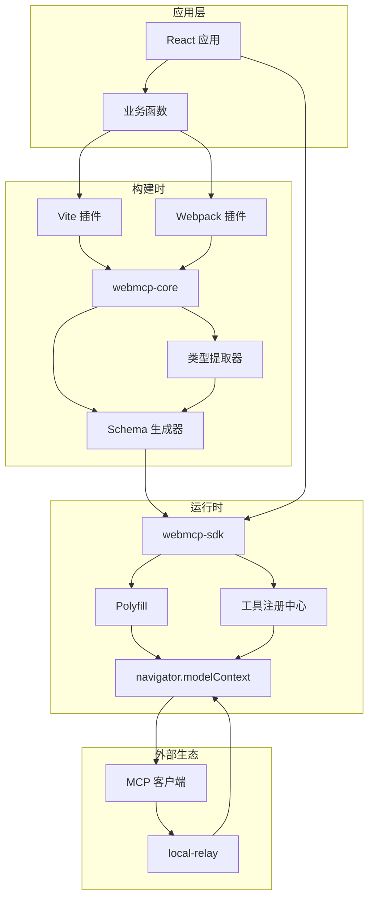
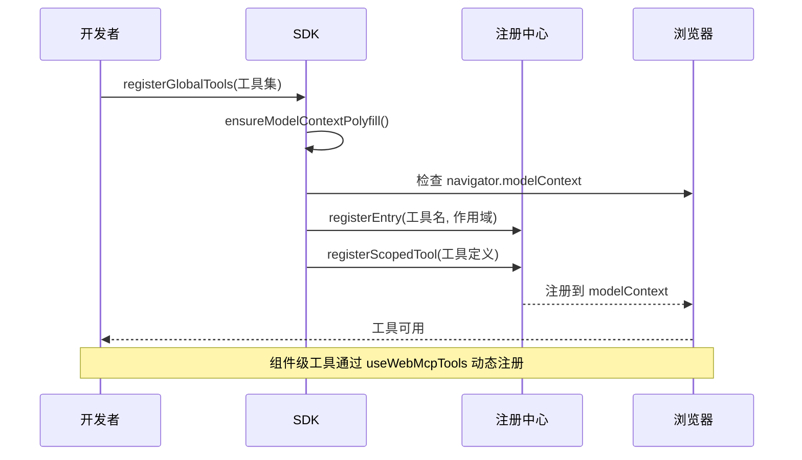
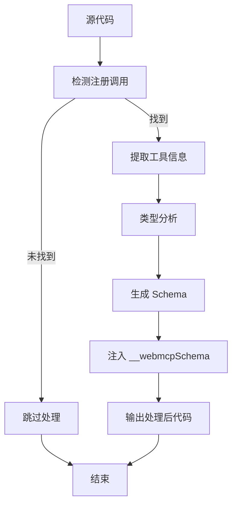
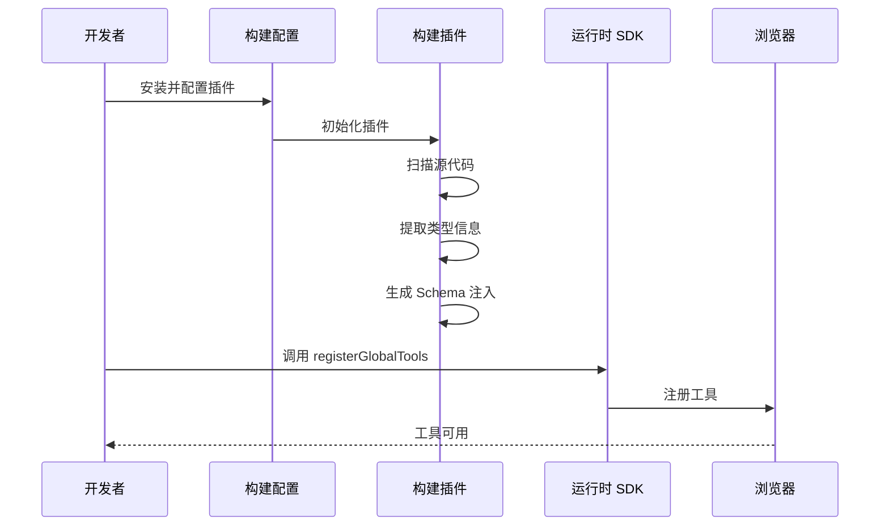
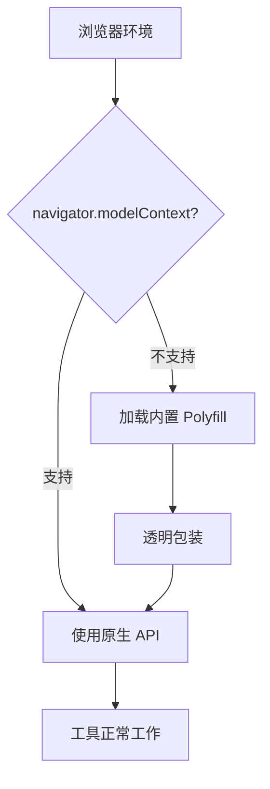

# 项目概述

<cite>
**本文档引用的文件**
- [README.md](file://README.md)
- [package.json](file://package.json)
- [packages/webmcp-core/package.json](file://packages/webmcp-core/package.json)
- [packages/webmcp-sdk/package.json](file://packages/webmcp-sdk/package.json)
- [packages/vite-plugin-webmcp/package.json](file://packages/vite-plugin-webmcp/package.json)
- [packages/webpack-plugin-webmcp/package.json](file://packages/webpack-plugin-webmcp/package.json)
- [packages/webmcp-sdk/src/index.ts](file://packages/webmcp-sdk/src/index.ts)
- [packages/webmcp-sdk/src/registerGlobalTools.ts](file://packages/webmcp-sdk/src/registerGlobalTools.ts)
- [packages/webmcp-sdk/src/useWebMcpTools.ts](file://packages/webmcp-sdk/src/useWebMcpTools.ts)
- [packages/webmcp-core/src/index.ts](file://packages/webmcp-core/src/index.ts)
- [packages/webmcp-core/src/transform.ts](file://packages/webmcp-core/src/transform.ts)
- [packages/webmcp-core/src/ts-extractor.ts](file://packages/webmcp-core/src/ts-extractor.ts)
- [packages/webmcp-core/src/schema-generator.ts](file://packages/webmcp-core/src/schema-generator.ts)
- [packages/vite-plugin-webmcp/src/index.ts](file://packages/vite-plugin-webmcp/src/index.ts)
- [packages/webpack-plugin-webmcp/src/index.ts](file://packages/webpack-plugin-webmcp/src/index.ts)
- [apps/demo/src/main.tsx](file://apps/demo/src/main.tsx)
- [apps/demo/vite.config.ts](file://apps/demo/vite.config.ts)
- [skill/SKILL.md](file://skill/SKILL.md)
</cite>

## 目录
1. [项目简介](#项目简介)
2. [核心价值主张](#核心价值主张)
3. [技术背景与 WebMCP 标准](#技术背景与-webmcp-标准)
4. [整体架构概览](#整体架构概览)
5. [三大核心组件详解](#三大核心组件详解)
6. [零侵入集成方案](#零侵入集成方案)
7. [浏览器兼容性与 Polyfill](#浏览器兼容性与-polyfill)
8. [技术栈与生态系统](#技术栈与生态系统)
9. [项目结构与模块关系](#项目结构与模块关系)
10. [性能与可维护性特性](#性能与可维护性特性)
11. [故障排查指南](#故障排查指南)
12. [结语](#结语)

## 项目简介

WebMCP Nexus 是一套面向 WebMCP（Model Context Protocol）标准的零侵入前端集成方案。该项目让任何 React 应用在数分钟内成为 MCP 客户端可直接驱动的对象，通过运行时 SDK、构建插件和 Polyfill 集成三大组件，实现从函数到工具的自动化转换。

项目核心理念是：写一个普通的 TypeScript 函数，加一行 JSDoc，它就能被任意 MCP 客户端调用。这一理念贯穿整个技术栈，从构建时的类型抽取到运行时的工具注册，都围绕这一目标展开。

## 核心价值主张

### 1. 极简 API 设计
- 仅暴露 2 个核心 API：`registerGlobalTools` 和 `useWebMcpTools`
- 覆盖全局、路由、组件三种生命周期场景
- 30 秒看懂、5 分钟接入，大幅降低学习成本

### 2. 零侵入开发体验
- 函数保持原样，原有调用方完全无感
- 不需要装饰器、包装函数或显式 schema 配置
- 业务代码与工具注册逻辑完全分离

### 3. 智能构建时处理
- 基于 ts-morph 的静态分析，函数签名 = JSON Schema
- 无运行时开销，构建时一次性完成类型反推
- 支持 HMR 友好，开发阶段自动重新注册

### 4. 三级作用域管理
- 全局注册：应用启动时一次性注册，适合通用 API
- 路由注册：页面级工具，随页面切换自动管理
- 组件注册：局部交互工具，组件卸载自动注销

## 技术背景与 WebMCP 标准

### WebMCP 标准概述
WebMCP（Web Model Context Protocol）是 W3C 浏览器标准提案，由 Google 与 Microsoft 联合推动。该标准允许网页通过 `navigator.modelContext.registerTool()` 将自身能力暴露为 MCP 客户端可调用的工具。

### 标准意义
- **标准化接口**：统一了浏览器端工具注册的标准接口
- **生态兼容**：与各种 MCP 客户端（Claude、Cursor、VS Code 等）天然兼容
- **未来导向**：作为 W3C 标准，具有长期稳定性保障

### 技术演进
项目在标准尚未完全成熟时提供了生产可用的解决方案，既保证了当前可用性，又为标准落地做好了准备。

## 整体架构概览



**图表来源**
- [packages/webmcp-core/src/index.ts:1-11](file://packages/webmcp-core/src/index.ts#L1-L11)
- [packages/webmcp-sdk/src/index.ts:1-5](file://packages/webmcp-sdk/src/index.ts#L1-L5)
- [packages/vite-plugin-webmcp/src/index.ts:1-102](file://packages/vite-plugin-webmcp/src/index.ts#L1-L102)

## 三大核心组件详解

### 1. 运行时 SDK（webmcp-sdk）

#### 核心职责
- 提供极简的 2 个 API 接口
- 管理工具注册生命周期
- 处理浏览器兼容性（Polyfill）
- 维护作用域所有权注册表

#### API 设计哲学


**图表来源**
- [packages/webmcp-sdk/src/registerGlobalTools.ts:26-67](file://packages/webmcp-sdk/src/registerGlobalTools.ts#L26-L67)
- [packages/webmcp-sdk/src/useWebMcpTools.ts:46-135](file://packages/webmcp-sdk/src/useWebMcpTools.ts#L46-L135)

#### 关键特性
- **零异常传播**：SDK 入口不向调用方传播浏览器 API 异常
- **作用域隔离**：严格的 scope ownership registry 管理
- **自动注销**：组件卸载时自动清理注册
- **冲突感知**：多作用域同名注册时只警告不中断

**章节来源**
- [packages/webmcp-sdk/src/index.ts:1-5](file://packages/webmcp-sdk/src/index.ts#L1-L5)
- [packages/webmcp-sdk/src/registerGlobalTools.ts:1-68](file://packages/webmcp-sdk/src/registerGlobalTools.ts#L1-L68)
- [packages/webmcp-sdk/src/useWebMcpTools.ts:1-136](file://packages/webmcp-sdk/src/useWebMcpTools.ts#L1-L136)

### 2. 构建插件（vite-plugin-webmcp & webpack-plugin-webmcp）

#### 核心职责
- 在构建时静态分析 TypeScript 类型
- 自动生成 JSON Schema
- 注入 `__webmcpSchema` 元数据
- 支持 Vite 和 Webpack 双生态

#### 构建流程


**图表来源**
- [packages/webmcp-core/src/transform.ts:31-79](file://packages/webmcp-core/src/transform.ts#L31-L79)
- [packages/webmcp-core/src/ts-extractor.ts:641-731](file://packages/webmcp-core/src/ts-extractor.ts#L641-L731)

#### 技术实现
- **ts-morph 驱动**：强大的 TypeScript AST 分析能力
- **智能别名解析**：支持 webpack/vite 的模块别名配置
- **双向兼容**：同时支持对象字面量和命名空间导入
- **深度嵌套支持**：最多支持 3 层嵌套对象类型

**章节来源**
- [packages/vite-plugin-webmcp/src/index.ts:1-102](file://packages/vite-plugin-webmcp/src/index.ts#L1-L102)
- [packages/webpack-plugin-webmcp/src/index.ts:1-3](file://packages/webpack-plugin-webmcp/src/index.ts#L1-L3)
- [packages/webmcp-core/src/transform.ts:1-79](file://packages/webmcp-core/src/transform.ts#L1-L79)

### 3. 类型抽取核心（webmcp-core）

#### 核心职责
- 提供构建时类型信息抽取能力
- 实现 JSON Schema 生成逻辑
- 支持复杂的类型映射规则

#### 类型映射规则
| TypeScript 类型 | JSON Schema 类型 | 特殊处理 |
|----------------|------------------|----------|
| string / number / boolean | string / number / boolean | 基础类型直通 |
| 字面量联合 'a' \| 'b' \| 'c' | string + enum | 生成枚举值 |
| 可选属性 field? | 不在 required 中 | 自动处理 |
| 数组 T[] | array + items | 支持元素类型 |
| 嵌套对象 interface | object + properties | 最深 3 层 |

**章节来源**
- [packages/webmcp-core/src/index.ts:1-11](file://packages/webmcp-core/src/index.ts#L1-L11)
- [packages/webmcp-core/src/schema-generator.ts:1-135](file://packages/webmcp-core/src/schema-generator.ts#L1-L135)

## 零侵入集成方案

### 集成流程


**图表来源**
- [apps/demo/src/main.tsx:1-15](file://apps/demo/src/main.tsx#L1-L15)
- [apps/demo/vite.config.ts:1-17](file://apps/demo/vite.config.ts#L1-L17)

### 集成优势
- **无缝对接**：现有 React 应用无需修改业务逻辑
- **渐进式采用**：可选择性地将部分函数转换为工具
- **零运行时开销**：所有处理都在构建时完成
- **热更新友好**：开发时自动重新注册工具

**章节来源**
- [README.md:100-177](file://README.md#L100-L177)

## 浏览器兼容性与 Polyfill

### 兼容性策略


**图表来源**
- [README.md:342-348](file://README.md#L342-L348)

### 支持范围
- **Chrome 146+**：直接使用原生 `navigator.modelContext`
- **Chrome <146**：自动加载内置 polyfill
- **Firefox / Safari / Edge**：统一通过 polyfill 支持
- **SSR 环境**：自动检测并优雅降级

**章节来源**
- [README.md:342-348](file://README.md#L342-L348)

## 技术栈与生态系统

### 核心技术栈
- **前端框架**：React 19 + TypeScript
- **构建工具**：Vite 8 / Webpack 5
- **包管理**：pnpm workspace monorepo
- **类型分析**：ts-morph 驱动的构建时类型抽取
- **测试框架**：Vitest

### 生态系统定位
- **标准实现**：WebMCP 标准的生产可用实现
- **工具桥接**：连接传统前端应用与 AI Agent
- **开发体验**：提供最佳的开发者 DX
- **生态扩展**：支持多种 MCP 客户端

**章节来源**
- [README.md:373-379](file://README.md#L373-L379)

## 项目结构与模块关系

### Monorepo 结构
```
webmcp-nexus/
├── apps/                    # 示例应用
│   └── demo/               # 最佳实践示例
├── packages/               # 核心包
│   ├── webmcp-core/        # 构建时核心
│   ├── webmcp-sdk/         # 运行时 SDK
│   ├── vite-plugin-webmcp/ # Vite 插件
│   └── webpack-plugin-webmcp/ # Webpack 插件
└── skill/                  # AI 编码 Skill
    └── SKILL.md            # 技能文档
```

### 模块依赖关系
```mermaid
graph LR
DEMO[demo 应用] --> SDK[webmcp-sdk]
SDK --> CORE[webmcp-core]
SDK --> POLYFILL[@mcp-b/webmcp-polyfill]
VITE[vite-plugin-webmcp] --> CORE
WEBPACK[webpack-plugin-webmcp] --> CORE
VITE --> SDK
WEBPACK --> CORE
```

**图表来源**
- [package.json:1-38](file://package.json#L1-L38)
- [packages/vite-plugin-webmcp/package.json:1-59](file://packages/vite-plugin-webmcp/package.json#L1-L59)

**章节来源**
- [package.json:1-38](file://package.json#L1-L38)

## 性能与可维护性特性

### 性能优化
- **构建时处理**：所有类型分析在构建时完成，运行时零开销
- **增量更新**：支持 HMR，仅在 schema 变化时重新注册
- **内存管理**：组件卸载时自动清理，避免内存泄漏
- **并发处理**：多工具注册时的并发优化

### 可维护性特性
- **单一事实源**：TypeScript 类型作为唯一数据源
- **自动文档**：JSDoc 自动生成工具描述
- **类型安全**：完整的 TypeScript 类型检查
- **错误隔离**：SDK 层面的异常处理和降级

## 故障排查指南

### 常见问题诊断
1. **工具未显示**
   - 检查 `__webmcpSchema` 是否正确注入
   - 验证 `navigator.modelContext` 是否存在
   - 确认注册调用是否在浏览器环境执行

2. **Schema 生成异常**
   - 检查参数类型是否为单一对象
   - 确认 JSDoc 格式是否正确（必须使用 `/** */`）
   - 验证类型定义是否可被 ts-morph 解析

3. **作用域冲突**
   - 查看控制台警告信息
   - 检查工具名是否重复
   - 确认作用域划分是否合理

### 调试工具
- **内置调试面板**：按 `⌘ + \` 唤起
- **Schema 检查**：`grep "__webmcpSchema" dist/`
- **HMR 支持**：开发时自动重新注册

**章节来源**
- [skill/SKILL.md:620-682](file://skill/SKILL.md#L620-L682)

## 结语

WebMCP Nexus 代表了前端与 AI Agent 集成的新范式。通过极简的 API 设计、智能的构建时处理和完善的兼容性支持，它为开发者提供了一个即用即飞的工具化平台。

项目的核心价值在于：
- **降低门槛**：让任何 React 开发者都能轻松接入 AI 工具生态
- **保持纯净**：不改变现有业务逻辑，零侵入集成
- **面向未来**：基于 W3C 标准，具备长期发展潜力

随着 WebMCP 标准的推进和生态的完善，WebMCP Nexus 将成为连接传统前端应用与下一代 AI 工具平台的重要桥梁。