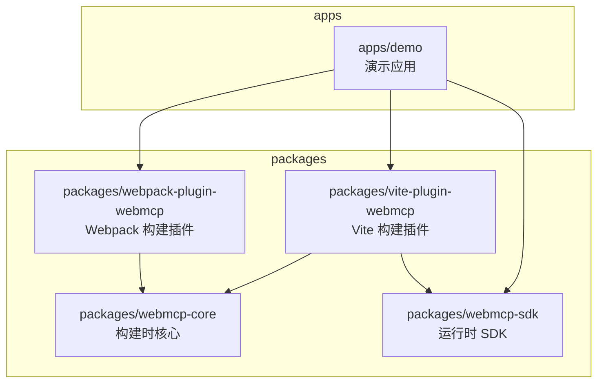
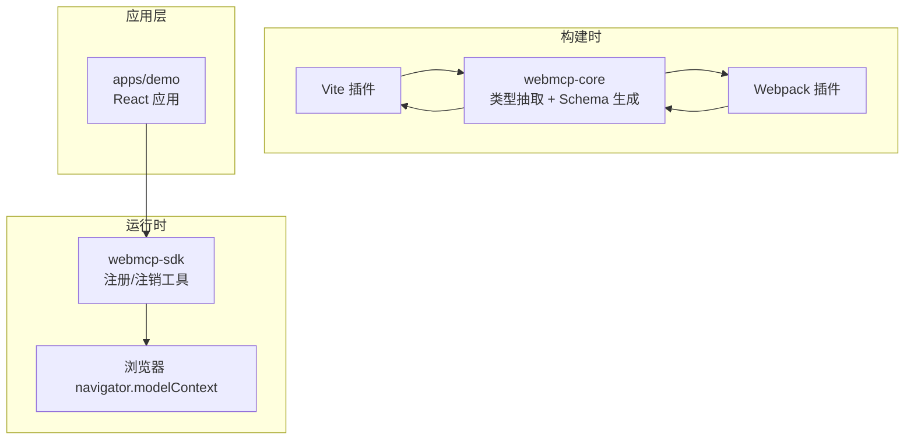
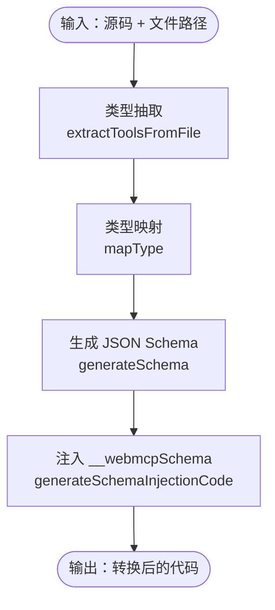
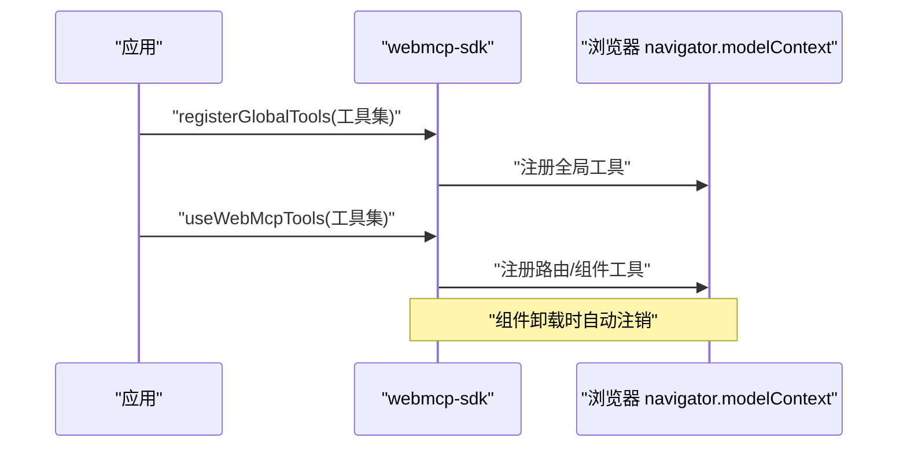
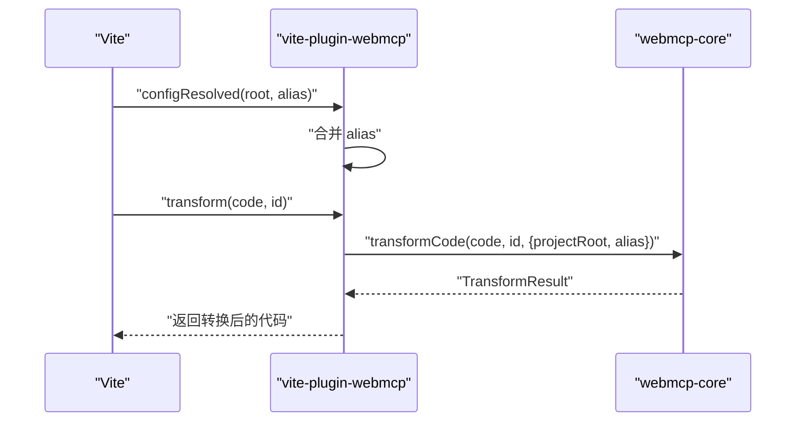
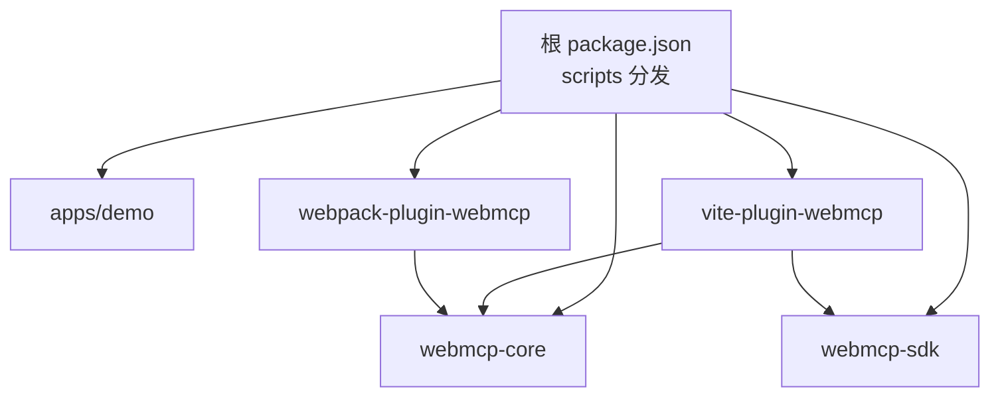

# 项目结构

<cite>
**本文引用的文件**
- [package.json](file://package.json)
- [pnpm-workspace.yaml](file://pnpm-workspace.yaml)
- [README.md](file://README.md)
- [apps/demo/package.json](file://apps/demo/package.json)
- [apps/demo/src/main.tsx](file://apps/demo/src/main.tsx)
- [packages/webmcp-core/package.json](file://packages/webmcp-core/package.json)
- [packages/webmcp-core/src/index.ts](file://packages/webmcp-core/src/index.ts)
- [packages/webmcp-sdk/package.json](file://packages/webmcp-sdk/package.json)
- [packages/webmcp-sdk/src/index.ts](file://packages/webmcp-sdk/src/index.ts)
- [packages/vite-plugin-webmcp/package.json](file://packages/vite-plugin-webmcp/package.json)
- [packages/vite-plugin-webmcp/src/index.ts](file://packages/vite-plugin-webmcp/src/index.ts)
- [packages/webpack-plugin-webmcp/package.json](file://packages/webpack-plugin-webmcp/package.json)
- [packages/webpack-plugin-webmcp/src/index.ts](file://packages/webpack-plugin-webmcp/src/index.ts)
</cite>

## 目录
1. [简介](#简介)
2. [项目结构](#项目结构)
3. [核心组件](#核心组件)
4. [架构总览](#架构总览)
5. [详细组件分析](#详细组件分析)
6. [依赖分析](#依赖分析)
7. [性能考虑](#性能考虑)
8. [故障排查指南](#故障排查指南)
9. [结论](#结论)
10. [附录](#附录)

## 简介
本项目采用 monorepo 架构，通过 pnpm workspace 管理多个包，目标是为 WebMCP 标准提供“零侵入”的前端集成方案。monorepo 设计理念强调：
- 单一代码库内的多包协同开发与发布
- 工作区统一的脚本与格式化、类型检查配置
- 包间共享依赖与内部依赖通过 workspace:* 实现，降低重复与版本漂移
- apps/demo 作为最佳实践示例，演示 Vite 与 Webpack 双构建链路

## 项目结构
仓库采用 apps 与 packages 两级目录划分：
- apps/demo：演示应用，包含 Vite 与 Webpack 双构建配置，展示全局工具注册、路由/组件级工具注册、调试面板等
- packages：核心包集合，包含构建时核心、运行时 SDK、以及 Vite/ Webpack 构建插件

图表来源
- [pnpm-workspace.yaml:1-4](file://pnpm-workspace.yaml#L1-L4)
- [apps/demo/package.json:16-54](file://apps/demo/package.json#L16-L54)
- [packages/vite-plugin-webmcp/package.json:46-48](file://packages/vite-plugin-webmcp/package.json#L46-L48)
- [packages/webpack-plugin-webmcp/package.json:44-45](file://packages/webpack-plugin-webmcp/package.json#L44-L45)

章节来源
- [README.md:76-89](file://README.md#L76-L89)
- [pnpm-workspace.yaml:1-4](file://pnpm-workspace.yaml#L1-L4)

## 核心组件
- apps/demo：演示应用，集成 SDK 与构建插件，展示全局、路由、组件三级注册策略，提供 Vite 与 Webpack 双构建示例
- packages/webmcp-core：构建时核心，负责 TypeScript 类型抽取与 JSON Schema 生成，提供统一变换入口与底层 API
- packages/webmcp-sdk：运行时 SDK，提供 registerGlobalTools 与 useWebMcpTools 两个 API，支持全局、路由、组件三级生命周期
- packages/vite-plugin-webmcp：Vite 插件，通过 transform 钩子委托 core 完成类型抽取与 schema 注入
- packages/webpack-plugin-webmcp：Webpack 插件，提供插件与 loader 两部分，同样委托 core 完成类型抽取与 schema 注入

章节来源
- [README.md:76-99](file://README.md#L76-L99)
- [apps/demo/package.json:16-54](file://apps/demo/package.json#L16-L54)
- [packages/webmcp-core/src/index.ts:1-11](file://packages/webmcp-core/src/index.ts#L1-L11)
- [packages/webmcp-sdk/src/index.ts:1-5](file://packages/webmcp-sdk/src/index.ts#L1-L5)
- [packages/vite-plugin-webmcp/src/index.ts:1-102](file://packages/vite-plugin-webmcp/src/index.ts#L1-L102)
- [packages/webpack-plugin-webmcp/src/index.ts:1-3](file://packages/webpack-plugin-webmcp/src/index.ts#L1-L3)

## 架构总览
整体架构分为三层：
- 构建时：Vite/ Webpack 插件读取用户工具定义，委托 webmcp-core 进行类型抽取与 JSON Schema 生成，并将 schema 注入到函数对象上
- 运行时：webmcp-sdk 读取注入的 schema，向 navigator.modelContext 注册工具，支持全局、路由、组件三级生命周期
- 应用层：apps/demo 展示如何在 React 应用中进行工具注册与使用，并提供 HMR 调试面板

图表来源
- [packages/vite-plugin-webmcp/src/index.ts:8-10](file://packages/vite-plugin-webmcp/src/index.ts#L8-L10)
- [packages/webpack-plugin-webmcp/src/index.ts:1-3](file://packages/webpack-plugin-webmcp/src/index.ts#L1-L3)
- [packages/webmcp-core/src/index.ts:1-11](file://packages/webmcp-core/src/index.ts#L1-L11)
- [packages/webmcp-sdk/src/index.ts:1-5](file://packages/webmcp-sdk/src/index.ts#L1-L5)

## 详细组件分析

### apps/demo 演示应用
- 职责：展示 SDK 与构建插件的完整使用流程，包含全局工具注册、路由/组件级工具注册、调试面板、Vite 与 Webpack 双构建
- 关键点：
  - 通过 webmcp-nexus-sdk 注册全局工具
  - 通过 vite-plugin-webmcp-nexus 与 webpack-plugin-webmcp-nexus 在构建时生成 schema 并注入
  - 提供 HMR 友好的开发体验与调试面板

章节来源
- [apps/demo/src/main.tsx:1-15](file://apps/demo/src/main.tsx#L1-L15)
- [apps/demo/package.json:16-54](file://apps/demo/package.json#L16-L54)

### packages/webmcp-core 构建时核心引擎
- 职责：提供统一的类型抽取与 JSON Schema 生成能力，作为 Vite 与 Webpack 插件的共同依赖
- 功能定位：
  - 统一变换入口：transformCode
  - 底层 API：工具提取、类型映射、属性提取、别名解析
  - Schema 生成：generateSchema、generateSchemaInjectionCode、mapTypeToSchema
- 数据流：接收源码与文件路径，返回转换后的代码与结果信息

图表来源
- [packages/webmcp-core/src/index.ts:1-11](file://packages/webmcp-core/src/index.ts#L1-L11)

章节来源
- [packages/webmcp-core/src/index.ts:1-11](file://packages/webmcp-core/src/index.ts#L1-L11)
- [packages/webmcp-core/package.json:41-46](file://packages/webmcp-core/package.json#L41-L46)

### packages/webmcp-sdk 运行时 SDK
- 职责：提供运行时 API 与生命周期管理，支持全局、路由、组件三级注册
- 功能定位：
  - registerGlobalTools：全局生命周期注册
  - useWebMcpTools：路由/组件生命周期注册与自动注销
  - 类型导出：WebMcpToolFn、WebMcpToolSchema、WebMcpAnnotatedFn、WebMcpToolConfig
- 依赖：@mcp-b/webmcp-polyfill（浏览器兼容）

图表来源
- [packages/webmcp-sdk/src/index.ts:1-5](file://packages/webmcp-sdk/src/index.ts#L1-L5)

章节来源
- [packages/webmcp-sdk/src/index.ts:1-5](file://packages/webmcp-sdk/src/index.ts#L1-L5)
- [packages/webmcp-sdk/package.json:46-51](file://packages/webmcp-sdk/package.json#L46-L51)

### vite-plugin-webmcp Vite 构建插件
- 职责：在 Vite 构建过程中拦截源码，委托 webmcp-core 完成类型抽取与 schema 注入
- 关键点：
  - transform 钩子：对匹配的文件执行转换
  - alias 合并：支持用户自定义 alias 与 Vite 默认 alias 的合并
  - include 配置：支持 glob 模式筛选扫描范围
  - 错误处理：捕获异常并告警

图表来源
- [packages/vite-plugin-webmcp/src/index.ts:39-99](file://packages/vite-plugin-webmcp/src/index.ts#L39-L99)

章节来源
- [packages/vite-plugin-webmcp/src/index.ts:1-102](file://packages/vite-plugin-webmcp/src/index.ts#L1-L102)
- [packages/vite-plugin-webmcp/package.json:46-52](file://packages/vite-plugin-webmcp/package.json#L46-L52)

### webpack-plugin-webmcp Webpack 构建插件
- 职责：在 Webpack 构建过程中完成与 Vite 插件相同的类型抽取与 schema 注入
- 功能定位：
  - 导出 WebMcpPlugin 与 WebMcpPluginOptions
  - 提供 loader 与插件两部分，满足不同场景需求

章节来源
- [packages/webpack-plugin-webmcp/src/index.ts:1-3](file://packages/webpack-plugin-webmcp/src/index.ts#L1-L3)
- [packages/webpack-plugin-webmcp/package.json:24-35](file://packages/webpack-plugin-webmcp/package.json#L24-L35)

## 依赖分析
- 工作区配置：pnpm-workspace.yaml 将 apps/* 与 packages/* 纳入工作区，实现多包统一管理
- 包间依赖：
  - vite-plugin-webmcp 依赖 webmcp-core 与 webmcp-sdk
  - webpack-plugin-webmcp 依赖 webmcp-core
  - apps/demo 依赖 webmcp-nexus-sdk、vite-plugin-webmcp-nexus、webpack-plugin-webmcp-nexus
- 脚本分发：根 package.json 的 scripts 通过 pnpm --filter 将命令定向到指定包，便于统一开发与发布

图表来源
- [package.json:5-20](file://package.json#L5-L20)
- [pnpm-workspace.yaml:1-4](file://pnpm-workspace.yaml#L1-L4)
- [apps/demo/package.json:27,48,53:27-27](file://apps/demo/package.json#L27-L27)
- [packages/vite-plugin-webmcp/package.json:46-48](file://packages/vite-plugin-webmcp/package.json#L46-L48)
- [packages/webpack-plugin-webmcp/package.json:44-45](file://packages/webpack-plugin-webmcp/package.json#L44-L45)

章节来源
- [package.json:1-38](file://package.json#L1-L38)
- [pnpm-workspace.yaml:1-4](file://pnpm-workspace.yaml#L1-L4)
- [apps/demo/package.json:16-54](file://apps/demo/package.json#L16-L54)
- [packages/vite-plugin-webmcp/package.json:46-48](file://packages/vite-plugin-webmcp/package.json#L46-L48)
- [packages/webpack-plugin-webmcp/package.json:44-45](file://packages/webpack-plugin-webmcp/package.json#L44-L45)

## 性能考虑
- 构建时类型抽取：通过 ts-morph 静态分析，函数签名直接映射为 JSON Schema，无运行时开销
- HMR 友好：开发阶段修改函数签名，工具 schema 自动重新注册，无需手动刷新
- 插件按需处理：Vite 插件通过 include 与文件扩展名过滤，减少不必要的处理
- 依赖复用：工作区内部依赖通过 workspace:* 引入，避免重复打包与版本漂移

## 故障排查指南
- 构建失败告警：Vite 插件在 transform 失败时会发出警告，可通过 DEBUG=webmcp 查看详细日志
- 文件未被扫描：确认 include 配置是否覆盖到目标文件，或检查文件扩展名是否为 .ts/.tsx
- alias 冲突：用户自定义 alias 会覆盖 Vite 默认 alias，确保路径映射正确
- 运行时注册问题：确认 SDK 版本与插件版本一致，且工具函数已注入 __webmcpSchema

章节来源
- [packages/vite-plugin-webmcp/src/index.ts:12-12](file://packages/vite-plugin-webmcp/src/index.ts#L12-L12)
- [packages/vite-plugin-webmcp/src/index.ts:55-97](file://packages/vite-plugin-webmcp/src/index.ts#L55-L97)

## 结论
本项目通过清晰的 monorepo 分层与职责划分，实现了“零侵入”的 WebMCP 前端集成方案。apps/demo 作为最佳实践示例，展示了 SDK 与构建插件的完整使用流程；packages 下的四个核心包分别承担构建时核心、运行时 SDK、以及 Vite/ Webpack 插件的职责，配合工作区配置与脚本分发，为贡献者提供了高效、一致的开发体验。

## 附录
- 贡献者导航指引：
  - apps/demo：查看演示应用与集成示例
  - packages/webmcp-core：修改类型抽取与 Schema 生成逻辑
  - packages/webmcp-sdk：修改运行时注册与生命周期管理
  - packages/vite-plugin-webmcp / packages/webpack-plugin-webmcp：修改构建时插件行为
- 常用脚本：
  - pnpm dev：启动 Vite demo
  - pnpm dev:webpack：启动 Webpack demo
  - pnpm build：构建所有包
  - pnpm test：运行全部包的测试

章节来源
- [README.md:380-390](file://README.md#L380-L390)
- [package.json:5-20](file://package.json#L5-L20)