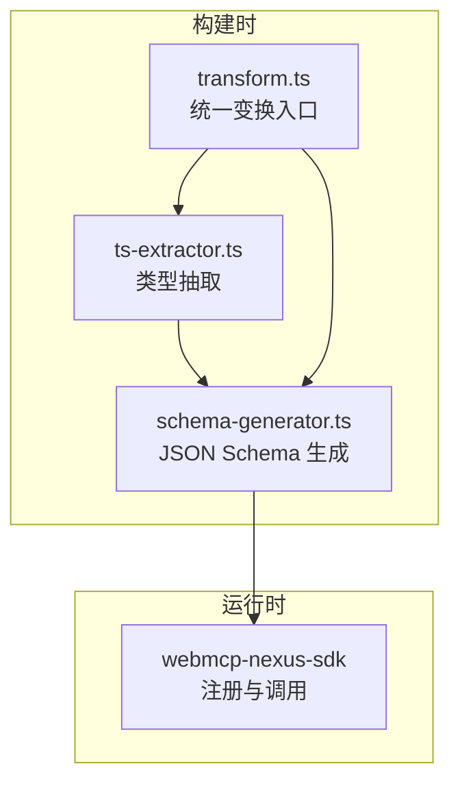
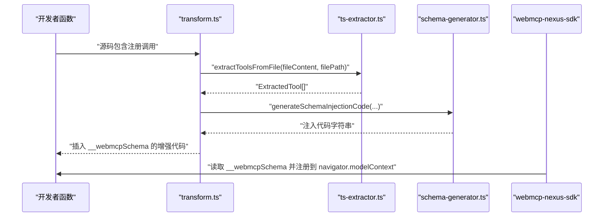
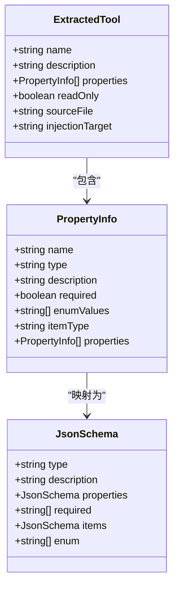
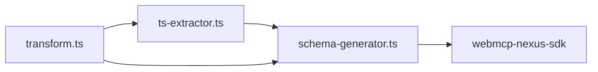

# TypeScript 类型系统支持

<cite>
**本文引用的文件**
- [README.md](file://README.md)
- [packages/webmcp-core/src/index.ts](file://packages/webmcp-core/src/index.ts)
- [packages/webmcp-core/src/schema-generator.ts](file://packages/webmcp-core/src/schema-generator.ts)
- [packages/webmcp-core/src/ts-extractor.ts](file://packages/webmcp-core/src/ts-extractor.ts)
- [packages/webmcp-core/src/transform.ts](file://packages/webmcp-core/src/transform.ts)
- [packages/webmcp-core/src/__tests__/mapType.test.ts](file://packages/webmcp-core/src/__tests__/mapType.test.ts)
- [packages/webmcp-core/src/__tests__/extractProperties.test.ts](file://packages/webmcp-core/src/__tests__/extractProperties.test.ts)
- [packages/webmcp-core/src/__tests__/schema-generator.test.ts](file://packages/webmcp-core/src/__tests__/schema-generator.test.ts)
- [apps/demo/src/main.tsx](file://apps/demo/src/main.tsx)
- [apps/demo/src/pages/TodosPage.tsx](file://apps/demo/src/pages/TodosPage.tsx)
- [apps/demo/src/store/types.ts](file://apps/demo/src/store/types.ts)
</cite>

## 目录
1. [简介](#简介)
2. [项目结构](#项目结构)
3. [核心组件](#核心组件)
4. [架构总览](#架构总览)
5. [详细组件分析](#详细组件分析)
6. [依赖关系分析](#依赖关系分析)
7. [性能考量](#性能考量)
8. [故障排查指南](#故障排查指南)
9. [结论](#结论)
10. [附录](#附录)

## 简介
本文件聚焦 WebMCP Nexus 的 TypeScript 类型系统支持范围与限制，结合构建时类型抽取与 JSON Schema 生成机制，给出稳定支持的类型清单、不建议依赖的类型、最佳实践与常见陷阱，帮助开发者编写兼容的函数签名与 JSDoc 注释，避免类型兼容性问题。

## 项目结构
WebMCP Nexus 的类型支持由“构建时类型抽取 + JSON Schema 生成”构成，核心位于 webmcp-core 包，运行时由 webmcp-nexus-sdk 读取生成的 schema 并注册到 navigator.modelContext。示例应用 apps/demo 展示了全局与组件级工具注册的实际用法。

图表来源
- [packages/webmcp-core/src/ts-extractor.ts:1-731](file://packages/webmcp-core/src/ts-extractor.ts#L1-L731)
- [packages/webmcp-core/src/schema-generator.ts:1-135](file://packages/webmcp-core/src/schema-generator.ts#L1-L135)
- [packages/webmcp-core/src/transform.ts:1-79](file://packages/webmcp-core/src/transform.ts#L1-L79)

章节来源
- [README.md:358-372](file://README.md#L358-L372)
- [packages/webmcp-core/src/index.ts:1-11](file://packages/webmcp-core/src/index.ts#L1-L11)

## 核心组件
- 类型抽取器（ts-extractor）：基于 ts-morph 逆向追踪注册调用，解析函数签名、JSDoc、可选属性、字面量联合、数组元素类型与嵌套对象（≤3 层），并生成 PropertyInfo。
- JSON Schema 生成器（schema-generator）：将 PropertyInfo 转换为 JSON Schema，支持基础类型、枚举、数组项类型、嵌套对象及 required 字段。
- 统一变换入口（transform）：在源码中定位注册调用，生成 __webmcpSchema 注入代码并插入到首个注册调用之前。

章节来源
- [packages/webmcp-core/src/ts-extractor.ts:99-201](file://packages/webmcp-core/src/ts-extractor.ts#L99-L201)
- [packages/webmcp-core/src/schema-generator.ts:28-134](file://packages/webmcp-core/src/schema-generator.ts#L28-L134)
- [packages/webmcp-core/src/transform.ts:31-79](file://packages/webmcp-core/src/transform.ts#L31-L79)

## 架构总览
下面的序列图展示了从函数签名到运行时注册的关键流程：类型抽取 → JSON Schema 生成 → 注入 __webmcpSchema → SDK 注册。

图表来源
- [packages/webmcp-core/src/transform.ts:31-79](file://packages/webmcp-core/src/transform.ts#L31-L79)
- [packages/webmcp-core/src/ts-extractor.ts:641-731](file://packages/webmcp-core/src/ts-extractor.ts#L641-L731)
- [packages/webmcp-core/src/schema-generator.ts:69-86](file://packages/webmcp-core/src/schema-generator.ts#L69-L86)

## 详细组件分析

### 类型支持范围与限制
- 已稳定支持
  - 基础类型：string、number、boolean
  - 字面量联合：如 'a'|'b'|'c' → enum
  - 可选属性：prop? → 不进入 required
  - 嵌套对象：≤3 层（depth 控制）
- 不建议依赖
  - 泛型：Record、Partial、Pick 等
  - 映射类型/条件类型
  - 超过 3 层的深度嵌套；对象数组中的对象元素 schema（抽取器仅处理数组元素类型，不递归展开对象元素）

章节来源
- [README.md:358-372](file://README.md#L358-L372)
- [packages/webmcp-core/src/ts-extractor.ts:174-201](file://packages/webmcp-core/src/ts-extractor.ts#L174-L201)
- [packages/webmcp-core/src/schema-generator.ts:88-134](file://packages/webmcp-core/src/schema-generator.ts#L88-L134)

### 类型映射与降级策略
- 基础类型与字面量联合：string/number/boolean 直接映射；纯字面量联合降为对应标量类型并生成 enum。
- 联合类型：剥离 undefined/null 后若仍为混合联合则降级为 string。
- 数组类型：映射为 array，并记录 itemType。
- 对象类型：映射为 object，并递归提取属性（受深度限制）。
- 特殊类型：null/undefined/any/unknown 统一降级为 string。

章节来源
- [packages/webmcp-core/src/__tests__/mapType.test.ts:15-96](file://packages/webmcp-core/src/__tests__/mapType.test.ts#L15-L96)
- [packages/webmcp-core/src/ts-extractor.ts:99-124](file://packages/webmcp-core/src/ts-extractor.ts#L99-L124)

### 属性提取与嵌套对象
- 可选属性：根据 prop.isOptional() 设置 required=false。
- 枚举属性：从联合类型中提取字面量值，生成 enumValues。
- 嵌套对象：递归提取，depth≥3 时停止进一步展开。
- 数组属性：记录 itemType，不展开数组元素对象的 schema。

章节来源
- [packages/webmcp-core/src/__tests__/extractProperties.test.ts:15-85](file://packages/webmcp-core/src/__tests__/extractProperties.test.ts#L15-L85)
- [packages/webmcp-core/src/ts-extractor.ts:174-201](file://packages/webmcp-core/src/ts-extractor.ts#L174-L201)

### JSON Schema 生成
- 从 PropertyInfo 生成 JSON Schema，支持：
  - type、description、properties、required、items、enum
  - 嵌套对象 schema 递归生成
  - 顶层 description 与 inputSchema 分离
- 生成注入代码：将 __webmcpSchema 注入到函数对象，包含 description、inputSchema、readOnly。

章节来源
- [packages/webmcp-core/src/schema-generator.ts:28-134](file://packages/webmcp-core/src/schema-generator.ts#L28-L134)
- [packages/webmcp-core/src/__tests__/schema-generator.test.ts:9-142](file://packages/webmcp-core/src/__tests__/schema-generator.test.ts#L9-L142)

### 实际使用示例与最佳实践

- 全局工具注册（示例应用）
  - 在入口文件中通过 registerGlobalTools 导入并注册命名空间工具。
  - 参考路径：[apps/demo/src/main.tsx:1-15](file://apps/demo/src/main.tsx#L1-L15)

- 组件级工具注册（示例应用）
  - 在页面组件中使用 useWebMcpTools 注册一组函数，这些函数具备清晰的 JSDoc 与参数对象签名。
  - 参考路径：[apps/demo/src/pages/TodosPage.tsx:116-129](file://apps/demo/src/pages/TodosPage.tsx#L116-L129)

- 类型与 JSDoc 规范
  - 使用字面量联合表达有限枚举值，便于生成 enum。
  - 使用可选属性表达可省略参数，确保 required 字段准确。
  - 使用嵌套对象表达复杂参数，但注意不超过 3 层深度。
  - 为函数添加 JSDoc 描述与 @readonly 标签，以生成只读工具。
  - 参考路径：[apps/demo/src/pages/TodosPage.tsx:35-99](file://apps/demo/src/pages/TodosPage.tsx#L35-L99)

- 不建议的类型模式
  - 避免使用泛型（如 Record<K,V>、Partial<T>、Pick<T,K>），这些类型不会被稳定支持。
  - 避免使用映射类型/条件类型，抽取器不支持。
  - 避免超过 3 层的深度嵌套，超出部分会被截断。
  - 参考路径：[README.md:367-372](file://README.md#L367-L372)

- 类型系统最佳实践
  - 将复杂参数封装为对象，使用 JSDoc 字段说明，提升 Agent 可理解性。
  - 优先使用字面量联合而非宽泛的字符串/数字类型，减少歧义。
  - 保持参数对象扁平或浅层嵌套，必要时拆分为多个工具。
  - 为只读查询工具添加 @readonly，避免误用为变更类工具。
  - 参考路径：[README.md:358-372](file://README.md#L358-L372)

### 类型系统支持范围与限制（代码级验证）
以下类图总结了类型抽取与 JSON Schema 生成的关键接口与关系：

图表来源
- [packages/webmcp-core/src/ts-extractor.ts:28-45](file://packages/webmcp-core/src/ts-extractor.ts#L28-L45)
- [packages/webmcp-core/src/schema-generator.ts:6-23](file://packages/webmcp-core/src/schema-generator.ts#L6-L23)

## 依赖关系分析
- 构建时依赖
  - ts-morph：AST 解析与类型系统访问
  - 项目编译选项：strict、ESNext、ReactJSX、Bundler 模块解析
- 运行时依赖
  - webmcp-nexus-sdk：读取 __webmcpSchema 并注册到 navigator.modelContext
- 示例应用依赖
  - React + TypeScript + Vite/Webpack

图表来源
- [packages/webmcp-core/src/index.ts:1-11](file://packages/webmcp-core/src/index.ts#L1-L11)
- [packages/webmcp-core/src/transform.ts:1-79](file://packages/webmcp-core/src/transform.ts#L1-L79)

章节来源
- [packages/webmcp-core/src/ts-extractor.ts:658-674](file://packages/webmcp-core/src/ts-extractor.ts#L658-L674)
- [README.md:76-99](file://README.md#L76-L99)

## 性能考量
- 构建时一次性完成类型抽取与代码注入，运行时无额外开销。
- 深度限制（≤3 层）避免递归展开带来的内存与计算压力。
- 仅对包含注册调用的文件进行处理，降低无关文件的分析成本。

## 故障排查指南
- 注册不到工具
  - 确认源码中存在 registerGlobalTools/useWebMcpTools 调用
  - 确认函数签名参数为对象形态（抽取器仅解析第一个参数的类型）
  - 确认 JSDoc 存在且包含描述，必要时添加 @readonly
  - 参考路径：[packages/webmcp-core/src/transform.ts:31-79](file://packages/webmcp-core/src/transform.ts#L31-L79)

- 嵌套对象未生效
  - 检查是否超过 3 层深度，超出部分将被截断
  - 参考路径：[packages/webmcp-core/src/ts-extractor.ts:186-188](file://packages/webmcp-core/src/ts-extractor.ts#L186-L188)

- 枚举未生成
  - 确认使用纯字面量联合（如 'a'|'b'），混合联合会被降级
  - 参考路径：[packages/webmcp-core/src/__tests__/mapType.test.ts:54-70](file://packages/webmcp-core/src/__tests__/mapType.test.ts#L54-L70)

- 只读标记无效
  - 确认 JSDoc 中包含 @readonly 标签
  - 参考路径：[packages/webmcp-core/src/ts-extractor.ts:223-224](file://packages/webmcp-core/src/ts-extractor.ts#L223-L224)

## 结论
WebMCP Nexus 的 TypeScript 类型支持以“稳定的基础类型 + 字面量联合 + 可选属性 + 浅层嵌套对象”为核心，配合 JSDoc 生成只读工具与 JSON Schema。对于泛型、映射类型与深层嵌套，应避免依赖。遵循本文的最佳实践，可显著提升工具的可发现性与可调用性，降低 Agent 侧的类型兼容性问题。

## 附录

### 类型支持范围一览
- 已稳定支持
  - 基础类型：string、number、boolean
  - 字面量联合：'a'|'b'|'c' → enum
  - 可选属性：prop? → 不进入 required
  - 嵌套对象：≤3 层
- 不建议依赖
  - 泛型：Record、Partial、Pick 等
  - 映射类型/条件类型
  - 超过 3 层的深度嵌套；对象数组中的对象元素 schema

章节来源
- [README.md:358-372](file://README.md#L358-L372)