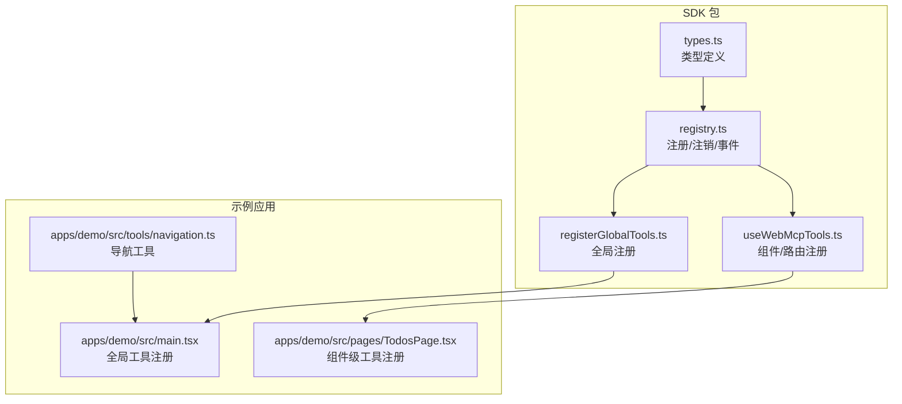
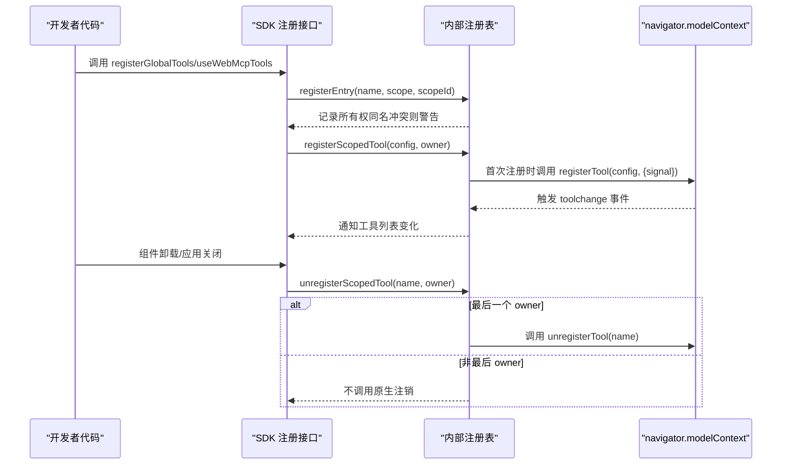
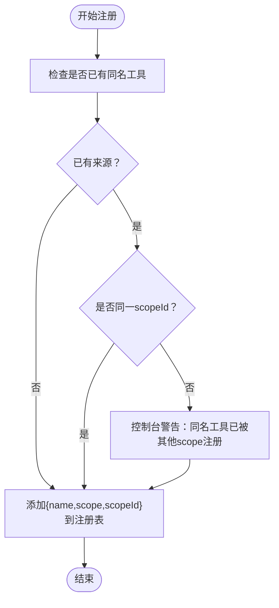
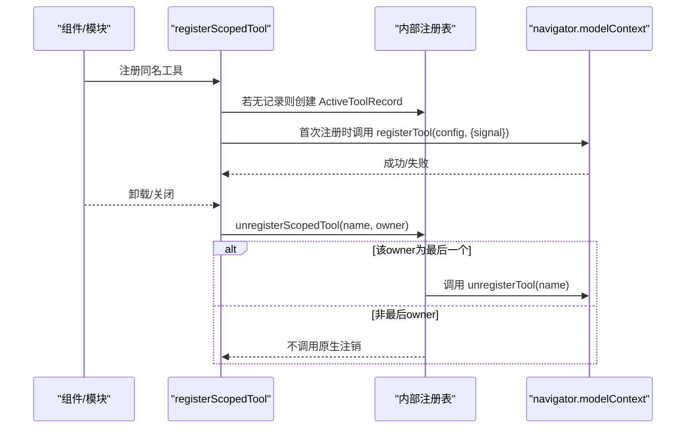
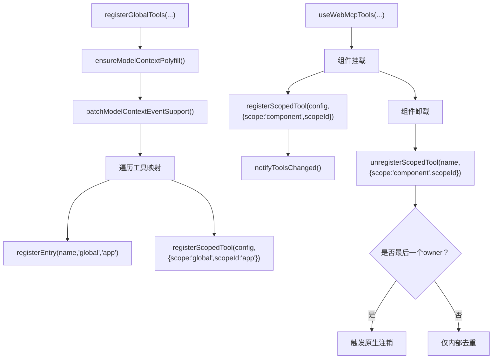
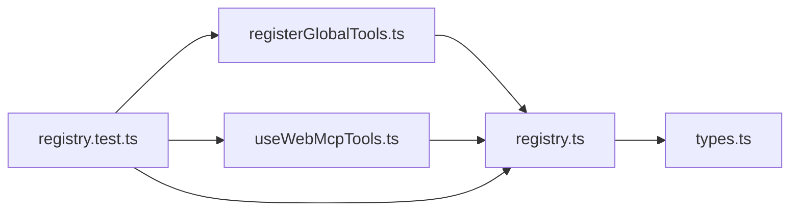

# 工具名冲突解决策略

<cite>
**本文档引用的文件**
- [packages/webmcp-sdk/src/registry.ts](file://packages/webmcp-sdk/src/registry.ts)
- [packages/webmcp-sdk/src/__tests__/registry.test.ts](file://packages/webmcp-sdk/src/__tests__/registry.test.ts)
- [README.md](file://README.md)
- [packages/webmcp-sdk/src/registerGlobalTools.ts](file://packages/webmcp-sdk/src/registerGlobalTools.ts)
- [packages/webmcp-sdk/src/useWebMcpTools.ts](file://packages/webmcp-sdk/src/useWebMcpTools.ts)
- [packages/webmcp-sdk/src/types.ts](file://packages/webmcp-sdk/src/types.ts)
- [apps/demo/src/main.tsx](file://apps/demo/src/main.tsx)
- [apps/demo/src/pages/TodosPage.tsx](file://apps/demo/src/pages/TodosPage.tsx)
- [apps/demo/src/tools/navigation.ts](file://apps/demo/src/tools/navigation.ts)
</cite>

## 目录
1. [简介](#简介)
2. [项目结构](#项目结构)
3. [核心组件](#核心组件)
4. [架构总览](#架构总览)
5. [详细组件分析](#详细组件分析)
6. [依赖关系分析](#依赖关系分析)
7. [性能考量](#性能考量)
8. [故障排查指南](#故障排查指南)
9. [结论](#结论)
10. [附录](#附录)

## 简介
本文件聚焦 WebMCP Nexus 的工具名冲突策略与作用域所有权注册机制，系统阐述 SDK 如何在内部维护 scope ownership registry，记录每个工具名的注册来源（scope + scopeId），以及多作用域同名冲突时的行为：控制台输出警告但仍允许注册，注销时只清理自己作用域的注册。同时提供最佳实践建议与真实场景示例，帮助开发者设计稳定的工具命名与生命周期管理。

## 项目结构
WebMCP Nexus 采用 monorepo 结构，核心运行时 SDK 位于 packages/webmcp-sdk，其中 registry.ts 实现了工具注册、注销与事件分发的核心逻辑；示例应用位于 apps/demo，展示了全局与组件级工具注册的实际用法。

图表来源
- [packages/webmcp-sdk/src/registry.ts:1-551](file://packages/webmcp-sdk/src/registry.ts#L1-L551)
- [packages/webmcp-sdk/src/registerGlobalTools.ts:1-68](file://packages/webmcp-sdk/src/registerGlobalTools.ts#L1-L68)
- [packages/webmcp-sdk/src/useWebMcpTools.ts:1-136](file://packages/webmcp-sdk/src/useWebMcpTools.ts#L1-L136)
- [packages/webmcp-sdk/src/types.ts:1-48](file://packages/webmcp-sdk/src/types.ts#L1-L48)
- [apps/demo/src/main.tsx:1-15](file://apps/demo/src/main.tsx#L1-L15)
- [apps/demo/src/pages/TodosPage.tsx:1-185](file://apps/demo/src/pages/TodosPage.tsx#L1-L185)
- [apps/demo/src/tools/navigation.ts:1-13](file://apps/demo/src/tools/navigation.ts#L1-L13)

章节来源
- [README.md:349-356](file://README.md#L349-L356)

## 核心组件
- scope ownership registry：以 Map<string, ToolEntry[]> 形式存储每个工具名对应的注册来源列表，每项包含 name、scope、scopeId。
- registerEntry/unregisterEntry：在内部注册表中登记/移除作用域所有权，支持同名工具跨作用域注册但发出警告，注销时仅移除指定作用域。
- registerScopedTool/unregisterScopedTool：封装原生 navigator.modelContext.registerTool/unregisterTool，聚合多个作用域的 owner，仅在最后一个 owner 注销时真正调用原生注销。
- notifyToolsChanged/pushToolsToWidget：触发 toolchange 事件并推送工具列表到 widget iframe，确保 Agent 端可见。

章节来源
- [packages/webmcp-sdk/src/registry.ts:230-293](file://packages/webmcp-sdk/src/registry.ts#L230-L293)
- [packages/webmcp-sdk/src/registry.ts:314-436](file://packages/webmcp-sdk/src/registry.ts#L314-L436)
- [packages/webmcp-sdk/src/registry.ts:532-542](file://packages/webmcp-sdk/src/registry.ts#L532-L542)

## 架构总览
下图展示工具注册与注销在 SDK 内部的流转，以及与浏览器 navigator.modelContext 的交互。

图表来源
- [packages/webmcp-sdk/src/registerGlobalTools.ts:26-67](file://packages/webmcp-sdk/src/registerGlobalTools.ts#L26-L67)
- [packages/webmcp-sdk/src/useWebMcpTools.ts:85-134](file://packages/webmcp-sdk/src/useWebMcpTools.ts#L85-L134)
- [packages/webmcp-sdk/src/registry.ts:314-436](file://packages/webmcp-sdk/src/registry.ts#L314-L436)

## 详细组件分析

### 作用域所有权注册机制
- ToolScope：'global' | 'route' | 'component'，分别对应全局、路由与组件级作用域。
- ToolEntry：记录 name、scope、scopeId，形成“工具名 -> 多来源”的映射。
- registerEntry：若同名工具已存在且来源不同，输出警告但仍允许注册；同 scopeId 的重复注册不会触发警告。
- unregisterEntry：仅移除指定 scope(scopeId) 的所有权，若清空则允许安全调用原生注销。

图表来源
- [packages/webmcp-sdk/src/registry.ts:261-275](file://packages/webmcp-sdk/src/registry.ts#L261-L275)

章节来源
- [packages/webmcp-sdk/src/registry.ts:208-214](file://packages/webmcp-sdk/src/registry.ts#L208-L214)
- [packages/webmcp-sdk/src/registry.ts:210-214](file://packages/webmcp-sdk/src/registry.ts#L210-L214)
- [packages/webmcp-sdk/src/registry.ts:261-275](file://packages/webmcp-sdk/src/registry.ts#L261-L275)
- [packages/webmcp-sdk/src/registry.ts:282-293](file://packages/webmcp-sdk/src/registry.ts#L282-L293)

### scoped tool 生命周期与原生注册协同
- registerScopedTool：首次注册时创建 AbortController 并透传 signal 至原生 registerTool；后续同名工具仅聚合 owners/configs，不重复原生注册。
- unregisterScopedTool：移除指定 owner；若该 owner 是最后一个，则触发 controller.abort，进而尝试调用原生 unregisterTool（在旧环境或需要时）。

图表来源
- [packages/webmcp-sdk/src/registry.ts:314-401](file://packages/webmcp-sdk/src/registry.ts#L314-L401)
- [packages/webmcp-sdk/src/registry.ts:407-436](file://packages/webmcp-sdk/src/registry.ts#L407-L436)

章节来源
- [packages/webmcp-sdk/src/registry.ts:314-401](file://packages/webmcp-sdk/src/registry.ts#L314-L401)
- [packages/webmcp-sdk/src/registry.ts:407-436](file://packages/webmcp-sdk/src/registry.ts#L407-L436)

### 全局与组件级注册入口
- registerGlobalTools：遍历工具映射，调用 registerEntry 与 registerScopedTool，最终触发工具列表变化事件。
- useWebMcpTools：在组件挂载时注册，卸载时根据 owner 数量决定是否调用原生注销，确保组件级工具随生命周期自动清理。

图表来源
- [packages/webmcp-sdk/src/registerGlobalTools.ts:26-67](file://packages/webmcp-sdk/src/registerGlobalTools.ts#L26-L67)
- [packages/webmcp-sdk/src/useWebMcpTools.ts:85-134](file://packages/webmcp-sdk/src/useWebMcpTools.ts#L85-L134)

章节来源
- [packages/webmcp-sdk/src/registerGlobalTools.ts:26-67](file://packages/webmcp-sdk/src/registerGlobalTools.ts#L26-L67)
- [packages/webmcp-sdk/src/useWebMcpTools.ts:46-136](file://packages/webmcp-sdk/src/useWebMcpTools.ts#L46-L136)

### 实际场景与最佳实践
- 场景一：组件 A 与组件 B 同时注册同名工具
  - 行为：控制台警告，但两个组件均能成功注册；任一组件卸载仅移除其 own，不影响另一组件持有的同名工具。
  - 解决：为不同组件使用不同工具名或在命名中体现组件/功能域，避免同名冲突。
- 场景二：全局工具与组件工具同名
  - 行为：控制台警告，但两者可并存；组件卸载不会影响全局工具。
  - 解决：全局工具应具备通用语义，组件工具应限定在页面/功能域内，避免跨域同名。
- 场景三：同组件多次注册同名工具
  - 行为：同 scopeId 的重复注册不会触发警告；内部仅聚合 owners，不重复原生注册。
  - 解决：保持组件内工具名唯一，避免无意的重复注册。

章节来源
- [packages/webmcp-sdk/src/__tests__/registry.test.ts:46-79](file://packages/webmcp-sdk/src/__tests__/registry.test.ts#L46-L79)
- [packages/webmcp-sdk/src/__tests__/registry.test.ts:129-167](file://packages/webmcp-sdk/src/__tests__/registry.test.ts#L129-L167)
- [README.md:349-356](file://README.md#L349-L356)

## 依赖关系分析
- registerGlobalTools 依赖 registerEntry 与 registerScopedTool，负责全局工具的初始化注册。
- useWebMcpTools 依赖 registerScopedTool 与 unregisterScopedTool，负责组件生命周期内的工具注册与注销。
- registry.ts 内部依赖 types.ts 中的 WebMcpToolConfig 与工具 schema 元数据。
- 测试文件 registry.test.ts 验证 registerEntry/unregisterEntry 的行为，以及 scoped tool 生命周期与原生注册的协同。

图表来源
- [packages/webmcp-sdk/src/registerGlobalTools.ts:1-68](file://packages/webmcp-sdk/src/registerGlobalTools.ts#L1-L68)
- [packages/webmcp-sdk/src/useWebMcpTools.ts:1-136](file://packages/webmcp-sdk/src/useWebMcpTools.ts#L1-L136)
- [packages/webmcp-sdk/src/registry.ts:1-551](file://packages/webmcp-sdk/src/registry.ts#L1-L551)
- [packages/webmcp-sdk/src/types.ts:1-48](file://packages/webmcp-sdk/src/types.ts#L1-L48)
- [packages/webmcp-sdk/src/__tests__/registry.test.ts:1-334](file://packages/webmcp-sdk/src/__tests__/registry.test.ts#L1-L334)

章节来源
- [packages/webmcp-sdk/src/registerGlobalTools.ts:1-68](file://packages/webmcp-sdk/src/registerGlobalTools.ts#L1-L68)
- [packages/webmcp-sdk/src/useWebMcpTools.ts:1-136](file://packages/webmcp-sdk/src/useWebMcpTools.ts#L1-L136)
- [packages/webmcp-sdk/src/registry.ts:1-551](file://packages/webmcp-sdk/src/registry.ts#L1-L551)
- [packages/webmcp-sdk/src/types.ts:1-48](file://packages/webmcp-sdk/src/types.ts#L1-L48)
- [packages/webmcp-sdk/src/__tests__/registry.test.ts:1-334](file://packages/webmcp-sdk/src/__tests__/registry.test.ts#L1-L334)

## 性能考量
- 注册去重：同名工具仅原生注册一次，后续注册仅聚合 owners，减少原生 API 调用次数。
- 事件合并：对 toolchange 事件进行微任务合并，避免频繁触发导致的渲染抖动。
- 推送节流：对推送工具列表到 widget iframe 的操作进行 100ms 延迟合并，降低跨帧通信压力。

章节来源
- [packages/webmcp-sdk/src/registry.ts:11-30](file://packages/webmcp-sdk/src/registry.ts#L11-L30)
- [packages/webmcp-sdk/src/registry.ts:519-527](file://packages/webmcp-sdk/src/registry.ts#L519-L527)

## 故障排查指南
- 控制台出现“同名工具已被其他 scope 注册”的警告
  - 现象：多处注册同名工具时触发。
  - 处理：确认是否确需跨作用域共享同名工具；若非预期，调整工具名或作用域划分。
- 组件卸载后工具仍可见
  - 现象：另一个组件也注册了同名工具。
  - 处理：仅最后一个 owner 卸载才会真正注销原生工具，这是预期行为。
- 原生注销未触发
  - 现象：在某些环境下 unregisterTool 不可用。
  - 处理：SDK 会在必要时回退调用，或等待原生信号自动清理；若仍异常，检查浏览器版本与 polyfill 状态。
- 重复注册报错
  - 现象：原生 registerTool 抛出重复名称错误。
  - 处理：SDK 已内置安全注册逻辑，会先尝试注销再重试；若仍失败，检查工具名唯一性与作用域划分。

章节来源
- [packages/webmcp-sdk/src/registry.ts:548-551](file://packages/webmcp-sdk/src/registry.ts#L548-L551)
- [packages/webmcp-sdk/src/__tests__/registry.test.ts:243-286](file://packages/webmcp-sdk/src/__tests__/registry.test.ts#L243-L286)

## 结论
WebMCP Nexus 通过内部 scope ownership registry 实现“允许冲突但可感知”的工具注册策略：同名工具跨作用域注册时发出警告但不阻断，注销时精确到作用域粒度，确保组件级工具随生命周期自动清理。结合全局与组件级注册入口，开发者可在不破坏 UI 渲染的前提下灵活组织工具，同时遵循最佳实践避免命名冲突，提升系统的可维护性与可预测性。

## 附录
- 最佳实践清单
  - 使用语义化且唯一的工具名，避免跨层级同名。
  - 全局工具应通用，组件工具应限定在页面/功能域内。
  - 同一组件内避免重复注册同名工具。
  - 发生冲突时优先通过命名区分而非强制覆盖。

章节来源
- [README.md:349-356](file://README.md#L349-L356)