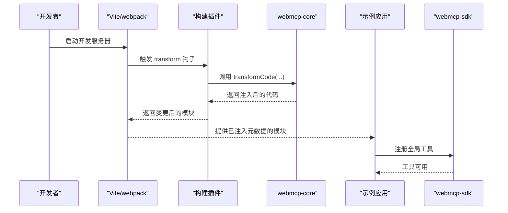
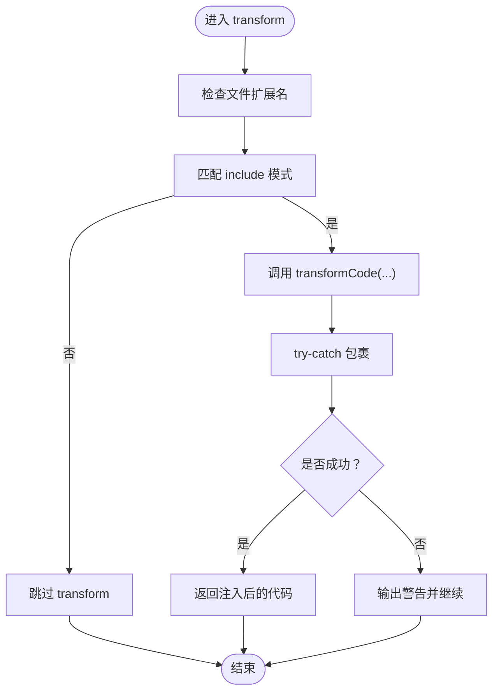
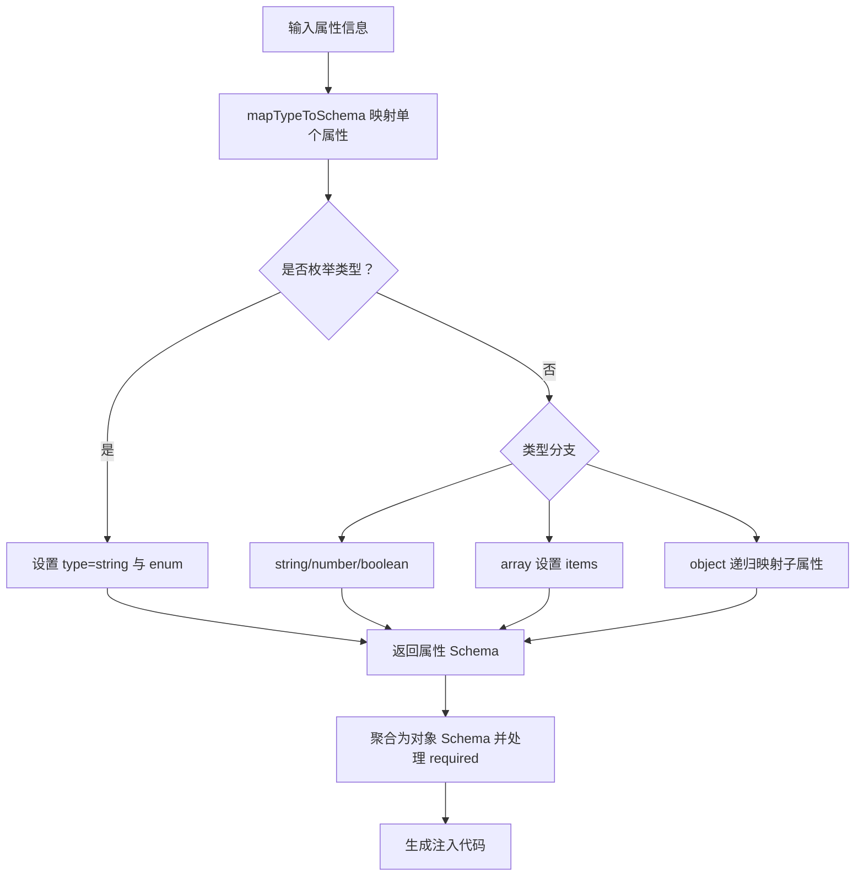
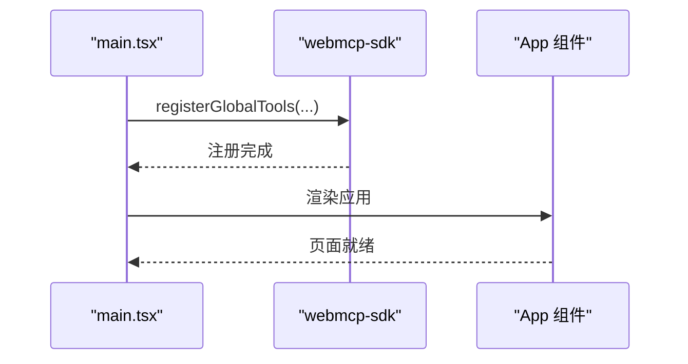
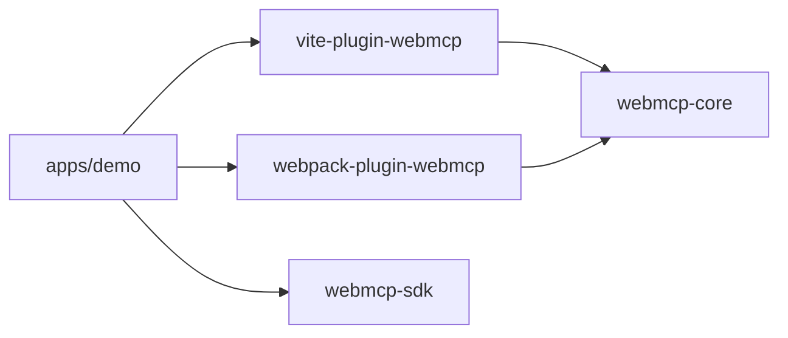

# 性能优化指南

<cite>
**本文引用的文件**
- [package.json](file://package.json)
- [apps/demo/package.json](file://apps/demo/package.json)
- [packages/vite-plugin-webmcp/package.json](file://packages/vite-plugin-webmcp/package.json)
- [packages/webmcp-core/package.json](file://packages/webmcp-core/package.json)
- [packages/webmcp-sdk/package.json](file://packages/webmcp-sdk/package.json)
- [packages/webpack-plugin-webmcp/package.json](file://packages/webpack-plugin-webmcp/package.json)
- [packages/webmcp-core/src/index.ts](file://packages/webmcp-core/src/index.ts)
- [packages/webmcp-core/src/schema-generator.ts](file://packages/webmcp-core/src/schema-generator.ts)
- [packages/vite-plugin-webmcp/src/index.ts](file://packages/vite-plugin-webmcp/src/index.ts)
- [apps/demo/src/main.tsx](file://apps/demo/src/main.tsx)
- [apps/demo/vite.config.ts](file://apps/demo/vite.config.ts)
- [apps/demo/webpack.config.ts](file://apps/demo/webpack.config.ts)
</cite>

## 目录
1. [简介](#简介)
2. [项目结构](#项目结构)
3. [核心组件](#核心组件)
4. [架构总览](#架构总览)
5. [详细组件分析](#详细组件分析)
6. [依赖关系分析](#依赖关系分析)
7. [性能考量与优化策略](#性能考量与优化策略)
8. [运行时性能监控](#运行时性能监控)
9. [内存管理最佳实践](#内存管理最佳实践)
10. [性能基准测试与瓶颈识别](#性能基准测试与瓶颈识别)
11. [故障排查指南](#故障排查指南)
12. [结论](#结论)

## 简介
本指南面向 WebMCP Nexus 的构建与运行性能优化，聚焦以下方面：
- 构建时优化：增量构建、缓存机制、类型分析优化
- 运行时监控：工具注册耗时、调用延迟、内存使用
- 内存管理：组件卸载自动注销、作用域隔离、资源清理
- 基准测试与瓶颈识别：可复现的测量方法与定位技巧
- 实战案例与对比：基于仓库现有脚本与插件的可操作建议

## 项目结构
该仓库采用 monorepo 结构，核心由以下部分组成：
- 核心库：webmcp-core（类型提取与 JSON Schema 生成）
- 构建插件：vite-plugin-webmcp、webpack-plugin-webmcp（在构建期注入工具元数据）
- SDK：webmcp-sdk（浏览器侧工具注册与暴露）
- 示例应用：apps/demo（React 应用，演示工具注册与插件集成）

```mermaid
graph TB
subgraph "示例应用"
DEMO["apps/demo<br/>React 应用"]
end
subgraph "构建插件"
VITE["vite-plugin-webmcp<br/>Vite 插件"]
WEBPACK["webpack-plugin-webmcp<br/>Webpack 插件"]
end
subgraph "核心库"
CORE["webmcp-core<br/>类型提取与 Schema 生成"]
end
subgraph "SDK"
SDK["webmcp-sdk<br/>浏览器端工具注册"]
end
DEMO --> VITE
DEMO --> WEBPACK
VITE --> CORE
WEBPACK --> CORE
DEMO --> SDK
```

图表来源
- [apps/demo/vite.config.ts:1-17](file://apps/demo/vite.config.ts#L1-L17)
- [apps/demo/webpack.config.ts:1-77](file://apps/demo/webpack.config.ts#L1-L77)
- [packages/vite-plugin-webmcp/src/index.ts:1-102](file://packages/vite-plugin-webmcp/src/index.ts#L1-L102)
- [packages/webmcp-core/src/index.ts:1-11](file://packages/webmcp-core/src/index.ts#L1-L11)
- [packages/webmcp-sdk/package.json:1-62](file://packages/webmcp-sdk/package.json#L1-L62)

章节来源
- [package.json:1-38](file://package.json#L1-L38)
- [apps/demo/package.json:1-56](file://apps/demo/package.json#L1-L56)
- [packages/vite-plugin-webmcp/package.json:1-59](file://packages/vite-plugin-webmcp/package.json#L1-L59)
- [packages/webmcp-core/package.json:1-56](file://packages/webmcp-core/package.json#L1-L56)
- [packages/webmcp-sdk/package.json:1-62](file://packages/webmcp-sdk/package.json#L1-L62)
- [packages/webpack-plugin-webmcp/package.json:1-56](file://packages/webpack-plugin-webmcp/package.json#L1-L56)

## 核心组件
- webmcp-core：提供类型提取、类型映射到 JSON Schema、以及注入代码生成等能力，是构建期的核心处理单元。
- vite-plugin-webmcp：在 Vite 构建阶段通过 transform 钩子委托 core 完成工具元数据注入。
- webpack-plugin-webmcp：在 Webpack 构建阶段完成相同任务。
- webmcp-sdk：在浏览器端注册全局工具，便于 AI Agent 使用。

章节来源
- [packages/webmcp-core/src/index.ts:1-11](file://packages/webmcp-core/src/index.ts#L1-L11)
- [packages/webmcp-core/src/schema-generator.ts:1-135](file://packages/webmcp-core/src/schema-generator.ts#L1-L135)
- [packages/vite-plugin-webmcp/src/index.ts:1-102](file://packages/vite-plugin-webmcp/src/index.ts#L1-L102)
- [apps/demo/src/main.tsx:1-15](file://apps/demo/src/main.tsx#L1-L15)

## 架构总览
下图展示了从源码到产物的关键流程：开发时由 Vite/webpack 加载对应插件，插件在 transform 阶段调用 core 完成类型分析与注入；运行时由 SDK 注册工具，供前端页面使用。



图表来源
- [packages/vite-plugin-webmcp/src/index.ts:55-97](file://packages/vite-plugin-webmcp/src/index.ts#L55-L97)
- [packages/webmcp-core/src/index.ts:1-11](file://packages/webmcp-core/src/index.ts#L1-L11)
- [apps/demo/src/main.tsx:1-15](file://apps/demo/src/main.tsx#L1-L15)

## 详细组件分析

### 构建插件（Vite）性能分析
- transform 钩子执行时机：enforce: 'pre'，确保在其他插件之前进行类型分析与注入，避免重复处理。
- 文件过滤：通过 include 模式与相对路径正则匹配，缩小扫描范围，减少不必要的 transform 调用。
- 错误处理：捕获 transform 失败并输出警告，避免中断构建流程。
- 别名合并：将 Vite 默认 alias 与用户自定义 alias 合并，提升模块解析效率。



图表来源
- [packages/vite-plugin-webmcp/src/index.ts:55-97](file://packages/vite-plugin-webmcp/src/index.ts#L55-L97)

章节来源
- [packages/vite-plugin-webmcp/src/index.ts:1-102](file://packages/vite-plugin-webmcp/src/index.ts#L1-L102)

### 核心库（类型提取与 Schema 生成）性能分析
- 类型映射：根据属性类型与枚举值生成 JSON Schema，支持基础类型、数组、对象等映射。
- 注入代码生成：将工具描述、输入 Schema、只读标记等组合为注入语句，便于运行时读取。
- 复杂度评估：生成 Schema 的主要开销在于递归遍历属性树，时间复杂度近似 O(N)，N 为属性节点数；空间复杂度与嵌套深度相关。



图表来源
- [packages/webmcp-core/src/schema-generator.ts:88-135](file://packages/webmcp-core/src/schema-generator.ts#L88-L135)

章节来源
- [packages/webmcp-core/src/schema-generator.ts:1-135](file://packages/webmcp-core/src/schema-generator.ts#L1-L135)

### 示例应用（工具注册与页面渲染）
- 全局工具注册：在应用启动时调用 SDK 的注册函数，将导航工具等注册为全局可用。
- 页面渲染：使用 React 渲染页面，工具通过 SDK 在运行时可用。



图表来源
- [apps/demo/src/main.tsx:1-15](file://apps/demo/src/main.tsx#L1-L15)

章节来源
- [apps/demo/src/main.tsx:1-15](file://apps/demo/src/main.tsx#L1-L15)

## 依赖关系分析
- 构建链路：示例应用依赖 Vite/webpack 插件；插件依赖 core；SDK 作为运行时依赖。
- 版本与导出：各包通过 exports 字段提供 ESModule 与 CommonJS 双态导出，便于不同打包器使用。
- 开发脚本：根目录提供统一的构建、测试、清理脚本，便于整体性能验证与回归测试。



图表来源
- [apps/demo/vite.config.ts:1-17](file://apps/demo/vite.config.ts#L1-L17)
- [apps/demo/webpack.config.ts:1-77](file://apps/demo/webpack.config.ts#L1-L77)
- [packages/vite-plugin-webmcp/package.json:25-36](file://packages/vite-plugin-webmcp/package.json#L25-L36)
- [packages/webpack-plugin-webmcp/package.json:24-35](file://packages/webpack-plugin-webmcp/package.json#L24-L35)
- [packages/webmcp-core/package.json:26-37](file://packages/webmcp-core/package.json#L26-L37)
- [packages/webmcp-sdk/package.json:25-36](file://packages/webmcp-sdk/package.json#L25-L36)

章节来源
- [package.json:1-38](file://package.json#L1-L38)
- [apps/demo/package.json:1-56](file://apps/demo/package.json#L1-L56)

## 性能考量与优化策略

### 构建时优化
- 增量构建与最小化扫描
  - 使用 include 模式精确限定扫描范围，避免对 node_modules 与第三方库进行无谓处理。
  - 在 Vite 插件中，通过相对路径正则匹配与文件扩展名检查，减少 transform 调用次数。
  - 参考路径：[packages/vite-plugin-webmcp/src/index.ts:55-72](file://packages/vite-plugin-webmcp/src/index.ts#L55-L72)
- 缓存机制
  - 在 CI 中缓存 node_modules 与构建产物，缩短二次构建时间。
  - 对于大型 monorepo，可考虑分包构建与并行流水线，降低总体等待时间。
- 类型分析优化
  - 将工具定义集中在少量模块内，减少类型树规模，从而降低 JSON Schema 生成的递归成本。
  - 对于深层嵌套的对象类型，优先拆分接口，降低 mapTypeToSchema 的递归深度。
  - 参考路径：[packages/webmcp-core/src/schema-generator.ts:88-135](file://packages/webmcp-core/src/schema-generator.ts#L88-L135)

### 运行时性能监控
- 工具注册耗时
  - 在 registerGlobalTools 调用前后记录时间戳，统计注册耗时。
  - 参考路径：[apps/demo/src/main.tsx:1-15](file://apps/demo/src/main.tsx#L1-L15)
- 调用延迟
  - 对工具函数的调用前后打点，计算平均延迟与 P95/P99 延迟。
  - 可结合浏览器性能面板与网络面板观察实际往返时间。
- 内存使用
  - 使用浏览器性能面板的内存快照与时间轴，观察注册后与卸载前后的内存变化。
  - 关注工具闭包、事件监听器与定时器的持有情况。

### 内存管理最佳实践
- 组件卸载时的自动注销
  - 在 React 卸载钩子中调用注销函数，移除事件监听器、取消订阅与清理定时器。
  - 确保每个注册的工具都有对应的注销入口，避免悬挂引用导致内存泄漏。
- 作用域隔离
  - 将工具注册限制在特定路由或页面范围内，避免全局污染。
  - 使用上下文或状态管理隔离工具生命周期。
- 资源清理
  - 对外部资源（如 WebSocket、IndexedDB）在注销时显式关闭与删除引用。
  - 对大对象进行浅拷贝与及时释放，避免长尾引用。

### 基准测试与瓶颈识别
- 基准测试方法
  - 构建阶段：使用时间命令或打包器内置的统计功能，对比开启/关闭注入前后的构建时长。
  - 运行阶段：在稳定硬件上多次运行注册与调用流程，统计均值与方差，剔除异常值。
- 瓶颈识别技巧
  - 使用火焰图与采样分析定位 CPU 密集环节（如类型映射、JSON 序列化）。
  - 使用内存快照对比定位泄漏点（未注销的监听器、未释放的大对象）。
  - 对比不同 include 模式下的构建时间，验证扫描范围优化效果。

## 运行时性能监控

### 工具注册时间监控
- 在应用启动阶段记录时间戳，统计 registerGlobalTools 的耗时，并输出到控制台或指标系统。
- 参考路径：[apps/demo/src/main.tsx:1-15](file://apps/demo/src/main.tsx#L1-L15)

### 调用延迟监控
- 对工具函数的调用前后打点，计算平均延迟与分位延迟，用于评估工具实现与网络往返时间。
- 可结合浏览器性能面板与网络面板观察实际往返时间。

### 内存使用监控
- 使用浏览器性能面板的内存快照与时间轴，观察注册后与卸载前后的内存变化。
- 关注工具闭包、事件监听器与定时器的持有情况，确保在组件卸载时清理完毕。

## 内存管理最佳实践

### 组件卸载时的自动注销
- 在 React 卸载钩子中调用注销函数，移除事件监听器、取消订阅与清理定时器。
- 确保每个注册的工具都有对应的注销入口，避免悬挂引用导致内存泄漏。

### 作用域隔离
- 将工具注册限制在特定路由或页面范围内，避免全局污染。
- 使用上下文或状态管理隔离工具生命周期。

### 资源清理
- 对外部资源（如 WebSocket、IndexedDB）在注销时显式关闭与删除引用。
- 对大对象进行浅拷贝与及时释放，避免长尾引用。

## 性能基准测试与瓶颈识别

### 基准测试方法
- 构建阶段：使用时间命令或打包器内置的统计功能，对比开启/关闭注入前后的构建时长。
- 运行阶段：在稳定硬件上多次运行注册与调用流程，统计均值与方差，剔除异常值。

### 瓶颈识别技巧
- 使用火焰图与采样分析定位 CPU 密集环节（如类型映射、JSON 序列化）。
- 使用内存快照对比定位泄漏点（未注销的监听器、未释放的大对象）。
- 对比不同 include 模式下的构建时间，验证扫描范围优化效果。

## 故障排查指南
- 构建失败或警告
  - 检查插件的 include 模式是否正确，避免错误排除了必要文件。
  - 查看 transform 失败的警告信息，确认类型定义是否符合预期。
  - 参考路径：[packages/vite-plugin-webmcp/src/index.ts:88-94](file://packages/vite-plugin-webmcp/src/index.ts#L88-L94)
- 运行时工具不可用
  - 确认 registerGlobalTools 是否在应用启动时被调用。
  - 检查工具是否在正确的页面范围内注册与注销。
  - 参考路径：[apps/demo/src/main.tsx:1-15](file://apps/demo/src/main.tsx#L1-L15)

章节来源
- [packages/vite-plugin-webmcp/src/index.ts:88-94](file://packages/vite-plugin-webmcp/src/index.ts#L88-L94)
- [apps/demo/src/main.tsx:1-15](file://apps/demo/src/main.tsx#L1-L15)

## 结论
通过在构建期进行精准扫描与类型分析、在运行期进行注册与调用监控、以及严格的内存管理与基准测试，可以显著提升 WebMCP Nexus 的整体性能与稳定性。建议在团队内建立统一的性能基线与回归测试流程，持续优化构建与运行时体验。