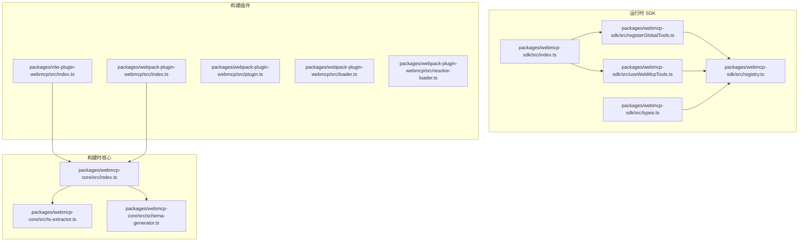
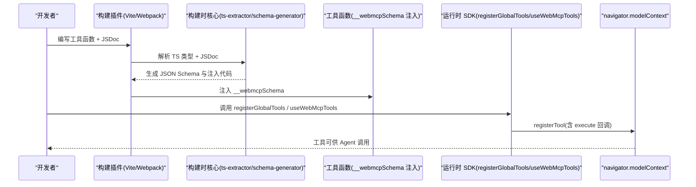
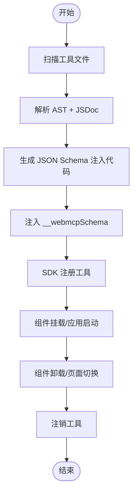
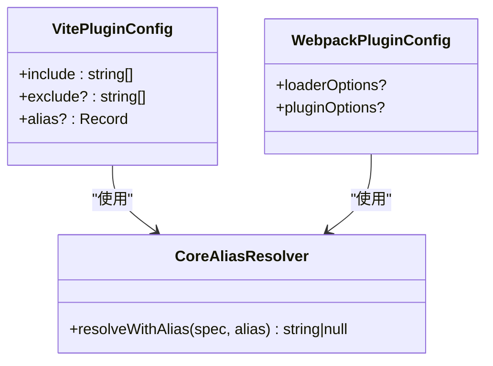
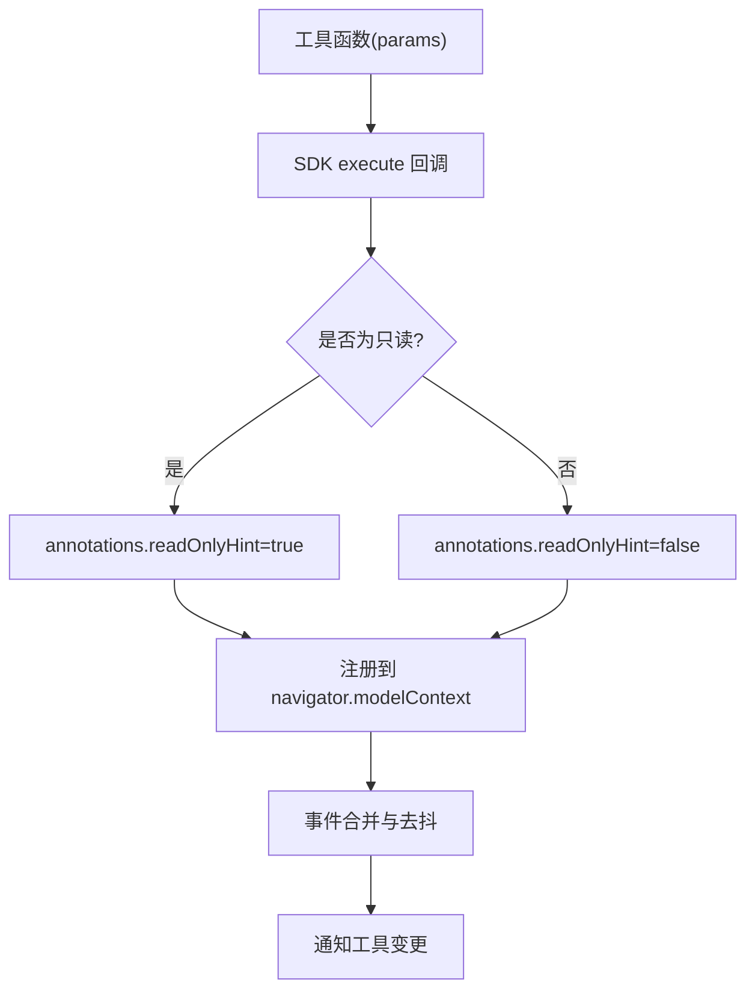
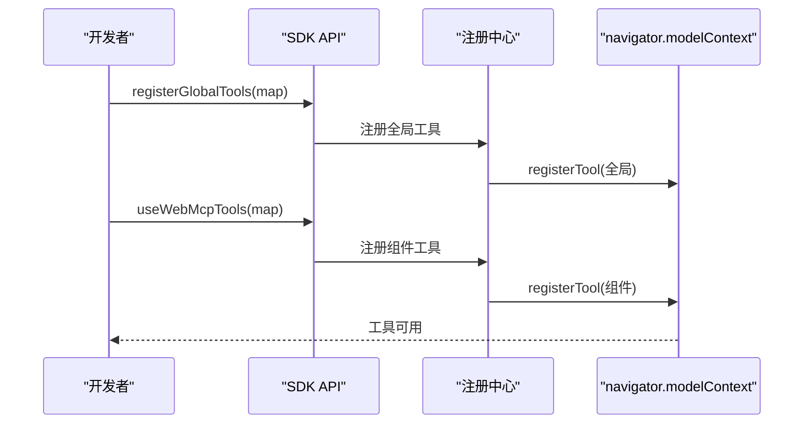
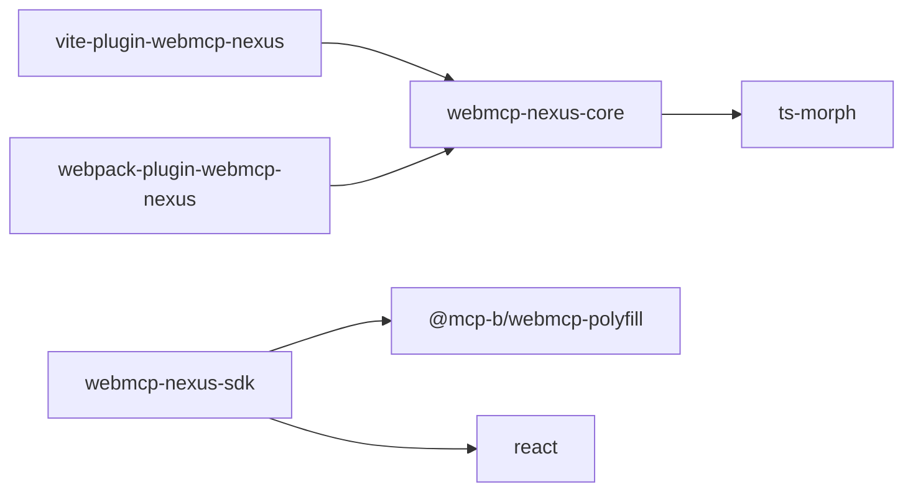

# 扩展开发

<cite>
**本文引用的文件**
- [README.md](file://README.md)
- [package.json](file://package.json)
- [packages/webmcp-sdk/src/index.ts](file://packages/webmcp-sdk/src/index.ts)
- [packages/webmcp-sdk/src/registerGlobalTools.ts](file://packages/webmcp-sdk/src/registerGlobalTools.ts)
- [packages/webmcp-sdk/src/useWebMcpTools.ts](file://packages/webmcp-sdk/src/useWebMcpTools.ts)
- [packages/webmcp-sdk/src/registry.ts](file://packages/webmcp-sdk/src/registry.ts)
- [packages/webmcp-sdk/src/types.ts](file://packages/webmcp-sdk/src/types.ts)
- [packages/webmcp-core/src/index.ts](file://packages/webmcp-core/src/index.ts)
- [packages/webmcp-core/src/schema-generator.ts](file://packages/webmcp-core/src/schema-generator.ts)
- [packages/webmcp-core/src/ts-extractor.ts](file://packages/webmcp-core/src/ts-extractor.ts)
- [packages/vite-plugin-webmcp/src/index.ts](file://packages/vite-plugin-webmcp/src/index.ts)
- [packages/webpack-plugin-webmcp/src/index.ts](file://packages/webpack-plugin-webmcp/src/index.ts)
- [packages/webpack-plugin-webmcp/src/plugin.ts](file://packages/webpack-plugin-webmcp/src/plugin.ts)
- [packages/webpack-plugin-webmcp/src/loader.ts](file://packages/webpack-plugin-webmcp/src/loader.ts)
- [packages/webpack-plugin-webmcp/src/resolve-loader.ts](file://packages/webpack-plugin-webmcp/src/resolve-loader.ts)
</cite>

## 目录
1. [简介](#简介)
2. [项目结构](#项目结构)
3. [核心组件](#核心组件)
4. [架构总览](#架构总览)
5. [组件详解](#组件详解)
6. [依赖关系分析](#依赖关系分析)
7. [性能考量](#性能考量)
8. [故障排查指南](#故障排查指南)
9. [结论](#结论)
10. [附录](#附录)

## 简介
本指南面向希望为 WebMCP Nexus 扩展开发的工程师，系统讲解如何开发自定义构建插件、遵循插件接口规范、设计配置项、正确使用生命周期钩子，以及高级工具函数的实现模式与错误传播机制。文档同时提供从简单工具增强到复杂构建流程定制的完整扩展示例，并说明与现有生态系统的集成与兼容性注意事项。

## 项目结构
WebMCP Nexus 采用 monorepo 结构，核心分为三部分：
- 运行时 SDK：提供两个 API（全局注册与 React Hook）及 polyfill 管理
- 构建时核心：基于 ts-morph 的类型抽取与 JSON Schema 生成
- 构建插件：Vite 与 Webpack 双适配，自动注入工具 schema

**图表来源**
- [packages/webmcp-sdk/src/index.ts:1-5](file://packages/webmcp-sdk/src/index.ts#L1-L5)
- [packages/webmcp-sdk/src/registerGlobalTools.ts:1-68](file://packages/webmcp-sdk/src/registerGlobalTools.ts#L1-L68)
- [packages/webmcp-sdk/src/useWebMcpTools.ts:1-136](file://packages/webmcp-sdk/src/useWebMcpTools.ts#L1-L136)
- [packages/webmcp-sdk/src/registry.ts:1-551](file://packages/webmcp-sdk/src/registry.ts#L1-L551)
- [packages/webmcp-sdk/src/types.ts:1-48](file://packages/webmcp-sdk/src/types.ts#L1-L48)
- [packages/webmcp-core/src/index.ts:1-11](file://packages/webmcp-core/src/index.ts#L1-L11)
- [packages/webmcp-core/src/ts-extractor.ts:1-731](file://packages/webmcp-core/src/ts-extractor.ts#L1-L731)
- [packages/webmcp-core/src/schema-generator.ts:1-135](file://packages/webmcp-core/src/schema-generator.ts#L1-L135)
- [packages/vite-plugin-webmcp/src/index.ts](file://packages/vite-plugin-webmcp/src/index.ts)
- [packages/webpack-plugin-webmcp/src/index.ts](file://packages/webpack-plugin-webmcp/src/index.ts)
- [packages/webpack-plugin-webmcp/src/plugin.ts](file://packages/webpack-plugin-webmcp/src/plugin.ts)
- [packages/webpack-plugin-webmcp/src/loader.ts](file://packages/webpack-plugin-webmcp/src/loader.ts)
- [packages/webpack-plugin-webmcp/src/resolve-loader.ts](file://packages/webpack-plugin-webmcp/src/resolve-loader.ts)

**章节来源**
- [README.md:76-99](file://README.md#L76-L99)
- [package.json:1-38](file://package.json#L1-L38)

## 核心组件
- 运行时 API
  - 全局注册：一次性注册应用级工具，适用于查询、认证、CRUD 等
  - 组件/路由注册：基于 React Hook，在组件挂载时注册、卸载时自动注销
- 构建时核心
  - 类型抽取：基于 ts-morph 逆向追踪函数定义，解析 JSDoc 与参数类型
  - Schema 生成：将类型信息映射为 JSON Schema，并生成注入代码
- 构建插件
  - Vite 插件：在构建时扫描工具文件，注入 __webmcpSchema
  - Webpack 插件：提供 loader 与插件组合，实现相同功能

**章节来源**
- [packages/webmcp-sdk/src/index.ts:1-5](file://packages/webmcp-sdk/src/index.ts#L1-L5)
- [packages/webmcp-sdk/src/registerGlobalTools.ts:1-68](file://packages/webmcp-sdk/src/registerGlobalTools.ts#L1-L68)
- [packages/webmcp-sdk/src/useWebMcpTools.ts:1-136](file://packages/webmcp-sdk/src/useWebMcpTools.ts#L1-L136)
- [packages/webmcp-sdk/src/registry.ts:1-551](file://packages/webmcp-sdk/src/registry.ts#L1-L551)
- [packages/webmcp-sdk/src/types.ts:1-48](file://packages/webmcp-sdk/src/types.ts#L1-L48)
- [packages/webmcp-core/src/index.ts:1-11](file://packages/webmcp-core/src/index.ts#L1-L11)
- [packages/webmcp-core/src/schema-generator.ts:1-135](file://packages/webmcp-core/src/schema-generator.ts#L1-L135)
- [packages/webmcp-core/src/ts-extractor.ts:1-731](file://packages/webmcp-core/src/ts-extractor.ts#L1-L731)
- [packages/vite-plugin-webmcp/src/index.ts](file://packages/vite-plugin-webmcp/src/index.ts)
- [packages/webpack-plugin-webmcp/src/index.ts](file://packages/webpack-plugin-webmcp/src/index.ts)
- [packages/webpack-plugin-webmcp/src/plugin.ts](file://packages/webpack-plugin-webmcp/src/plugin.ts)
- [packages/webpack-plugin-webmcp/src/loader.ts](file://packages/webpack-plugin-webmcp/src/loader.ts)
- [packages/webpack-plugin-webmcp/src/resolve-loader.ts](file://packages/webpack-plugin-webmcp/src/resolve-loader.ts)

## 架构总览
WebMCP Nexus 的扩展开发围绕“构建时抽取 + 运行时注册”展开。构建插件在打包阶段读取工具函数的类型与 JSDoc，生成 JSON Schema 并注入到函数对象上；运行时 SDK 读取注入的 schema，通过 navigator.modelContext 完成注册，并在组件卸载时自动注销，避免“幽灵工具”。

**图表来源**
- [packages/webmcp-core/src/ts-extractor.ts:641-731](file://packages/webmcp-core/src/ts-extractor.ts#L641-L731)
- [packages/webmcp-core/src/schema-generator.ts:69-86](file://packages/webmcp-core/src/schema-generator.ts#L69-L86)
- [packages/webmcp-sdk/src/registerGlobalTools.ts:26-68](file://packages/webmcp-sdk/src/registerGlobalTools.ts#L26-L68)
- [packages/webmcp-sdk/src/useWebMcpTools.ts:46-136](file://packages/webmcp-sdk/src/useWebMcpTools.ts#L46-L136)
- [packages/webmcp-sdk/src/registry.ts:314-401](file://packages/webmcp-sdk/src/registry.ts#L314-L401)

## 组件详解

### 插件接口规范与生命周期钩子
- 接口职责
  - Vite 插件：提供插件入口，接收 include/exclude 等配置，扫描工具文件，注入 schema
  - Webpack 插件：提供插件与 loader 组合，实现相同注入逻辑
- 生命周期钩子
  - 构建期：扫描源文件，解析 AST，生成注入代码
  - 运行期：SDK 读取 __webmcpSchema，注册到 navigator.modelContext
  - 组件卸载：自动注销，确保工具列表一致性

**图表来源**
- [packages/vite-plugin-webmcp/src/index.ts](file://packages/vite-plugin-webmcp/src/index.ts)
- [packages/webpack-plugin-webmcp/src/index.ts](file://packages/webpack-plugin-webmcp/src/index.ts)
- [packages/webpack-plugin-webmcp/src/plugin.ts](file://packages/webpack-plugin-webmcp/src/plugin.ts)
- [packages/webmcp-sdk/src/registerGlobalTools.ts:26-68](file://packages/webmcp-sdk/src/registerGlobalTools.ts#L26-L68)
- [packages/webmcp-sdk/src/useWebMcpTools.ts:46-136](file://packages/webmcp-sdk/src/useWebMcpTools.ts#L46-L136)

**章节来源**
- [packages/vite-plugin-webmcp/src/index.ts](file://packages/vite-plugin-webmcp/src/index.ts)
- [packages/webpack-plugin-webmcp/src/index.ts](file://packages/webpack-plugin-webmcp/src/index.ts)
- [packages/webpack-plugin-webmcp/src/plugin.ts](file://packages/webpack-plugin-webmcp/src/plugin.ts)
- [packages/webmcp-sdk/src/registerGlobalTools.ts:1-68](file://packages/webmcp-sdk/src/registerGlobalTools.ts#L1-L68)
- [packages/webmcp-sdk/src/useWebMcpTools.ts:1-136](file://packages/webmcp-sdk/src/useWebMcpTools.ts#L1-L136)

### 配置选项设计
- Vite 插件
  - include/exclude：控制扫描文件集合
  - alias：模块路径别名映射，提升跨平台兼容性
- Webpack 插件
  - 通过插件 + loader 组合实现注入；loader 负责转换，插件负责调度
- 构建时核心
  - 支持 alias 解析，最长前缀优先匹配
  - 支持多种模块路径格式（相对路径、绝对路径、别名）

**图表来源**
- [packages/webmcp-core/src/ts-extractor.ts:78-94](file://packages/webmcp-core/src/ts-extractor.ts#L78-L94)
- [packages/vite-plugin-webmcp/src/index.ts](file://packages/vite-plugin-webmcp/src/index.ts)
- [packages/webpack-plugin-webmcp/src/index.ts](file://packages/webpack-plugin-webmcp/src/index.ts)

**章节来源**
- [packages/webmcp-core/src/ts-extractor.ts:66-94](file://packages/webmcp-core/src/ts-extractor.ts#L66-L94)
- [packages/vite-plugin-webmcp/src/index.ts](file://packages/vite-plugin-webmcp/src/index.ts)
- [packages/webpack-plugin-webmcp/src/index.ts](file://packages/webpack-plugin-webmcp/src/index.ts)

### 工具函数高级用法与错误传播机制
- 复杂参数类型处理
  - 支持基础类型、字面量联合（枚举）、可选属性、嵌套对象（≤3 层）
  - 数组元素类型映射，对象属性递归解析
- 异步工具实现模式
  - 工具函数返回 Promise，SDK 通过 execute 回调在运行时调用
  - 组件级注册使用 useRef 保存最新函数引用，避免闭包陷阱
- 错误传播机制
  - SDK 入口与注册路径对浏览器 API 异常进行兜底，不向调用方传播
  - 事件派发与工具变更通知在统一入口进行合并与防抖，避免重复触发

**图表来源**
- [packages/webmcp-sdk/src/types.ts:3-15](file://packages/webmcp-sdk/src/types.ts#L3-L15)
- [packages/webmcp-sdk/src/useWebMcpTools.ts:57-109](file://packages/webmcp-sdk/src/useWebMcpTools.ts#L57-L109)
- [packages/webmcp-sdk/src/registry.ts:10-30](file://packages/webmcp-sdk/src/registry.ts#L10-L30)
- [packages/webmcp-sdk/src/registry.ts:532-542](file://packages/webmcp-sdk/src/registry.ts#L532-L542)

**章节来源**
- [packages/webmcp-sdk/src/types.ts:1-48](file://packages/webmcp-sdk/src/types.ts#L1-L48)
- [packages/webmcp-sdk/src/useWebMcpTools.ts:1-136](file://packages/webmcp-sdk/src/useWebMcpTools.ts#L1-L136)
- [packages/webmcp-sdk/src/registry.ts:1-551](file://packages/webmcp-sdk/src/registry.ts#L1-L551)

### 扩展点识别与自定义工具注册
- 扩展点识别
  - 通过 SDK 的 registerGlobalTools 与 useWebMcpTools 识别工具集合
  - 构建时通过 ts-extractor 逆向追踪函数定义，解析 JSDoc 与类型
- 自定义工具注册
  - 全局注册：适合通用 API（查询、认证、CRUD）
  - 组件/路由注册：适合当前页面或组件独占的操作，自动随生命周期注销

**图表来源**
- [packages/webmcp-sdk/src/registerGlobalTools.ts:26-68](file://packages/webmcp-sdk/src/registerGlobalTools.ts#L26-L68)
- [packages/webmcp-sdk/src/useWebMcpTools.ts:46-136](file://packages/webmcp-sdk/src/useWebMcpTools.ts#L46-L136)
- [packages/webmcp-sdk/src/registry.ts:314-401](file://packages/webmcp-sdk/src/registry.ts#L314-L401)

**章节来源**
- [packages/webmcp-sdk/src/registerGlobalTools.ts:1-68](file://packages/webmcp-sdk/src/registerGlobalTools.ts#L1-L68)
- [packages/webmcp-sdk/src/useWebMcpTools.ts:1-136](file://packages/webmcp-sdk/src/useWebMcpTools.ts#L1-L136)
- [packages/webmcp-sdk/src/registry.ts:261-293](file://packages/webmcp-sdk/src/registry.ts#L261-L293)

### 完整扩展示例
- 示例一：简单工具增强
  - 在工具函数上添加 JSDoc 描述与 @readonly 标签，SDK 会在运行时读取 __webmcpSchema 并注册
  - 参考：全局注册入口与工具函数定义
- 示例二：组件级工具注册
  - 在页面组件中使用 useWebMcpTools，组件卸载时自动注销，避免工具泄漏
- 示例三：复杂构建流程定制
  - 通过 Vite/Webpack 插件配置 include/exclude 与 alias，实现跨项目共享工具的统一注入

**章节来源**
- [README.md:148-177](file://README.md#L148-L177)
- [README.md:186-200](file://README.md#L186-L200)
- [packages/webmcp-sdk/src/registerGlobalTools.ts:26-68](file://packages/webmcp-sdk/src/registerGlobalTools.ts#L26-L68)
- [packages/webmcp-sdk/src/useWebMcpTools.ts:46-136](file://packages/webmcp-sdk/src/useWebMcpTools.ts#L46-L136)

### 生态集成与兼容性
- 浏览器兼容
  - Chrome 146+：原生 navigator.modelContext
  - 其他环境：SDK 自动加载内置 polyfill，业务代码零侵入
- 桌面 Agent 直连
  - 通过 @mcp-b/webmcp-local-relay，Claude Desktop / Cursor / VS Code 等可直接驱动浏览器应用
- 类型支持范围
  - 已稳定支持：基础类型、字面量联合、可选属性、嵌套对象（≤3 层）
  - 不建议依赖：泛型、映射类型、条件类型、超过 3 层的深度嵌套

**章节来源**
- [README.md:342-372](file://README.md#L342-L372)
- [README.md:223-290](file://README.md#L223-L290)
- [packages/webmcp-sdk/src/registry.ts:46-206](file://packages/webmcp-sdk/src/registry.ts#L46-L206)

## 依赖关系分析
- 构建时依赖
  - ts-morph：AST 解析与类型系统访问
  - 构建插件依赖构建时核心，核心再依赖 schema 生成器
- 运行时依赖
  - @mcp-b/webmcp-polyfill：浏览器兼容与事件桥接
  - React：Hook 生命周期集成

**图表来源**
- [packages/vite-plugin-webmcp/package.json:46-48](file://packages/vite-plugin-webmcp/package.json#L46-L48)
- [packages/webpack-plugin-webmcp/package.json:44-45](file://packages/webpack-plugin-webmcp/package.json#L44-L45)
- [packages/webmcp-core/package.json:47-48](file://packages/webmcp-core/package.json#L47-L48)
- [packages/webmcp-sdk/package.json:47-47](file://packages/webmcp-sdk/package.json#L47-L47)

**章节来源**
- [packages/vite-plugin-webmcp/package.json:1-59](file://packages/vite-plugin-webmcp/package.json#L1-L59)
- [packages/webpack-plugin-webmcp/package.json:1-56](file://packages/webpack-plugin-webmcp/package.json#L1-L56)
- [packages/webmcp-core/package.json:1-56](file://packages/webmcp-core/package.json#L1-L56)
- [packages/webmcp-sdk/package.json:1-62](file://packages/webmcp-sdk/package.json#L1-L62)

## 性能考量
- 事件合并与去抖
  - 合并 toolchange 事件，避免频繁触发导致的 UI 抖动
- 注册/注销去重
  - 同名工具仅原生注册一次，多作用域聚合生命周期
- HMR 友好
  - 组件级注册对 schema 变更敏感，开发时自动重新注册

**章节来源**
- [packages/webmcp-sdk/src/registry.ts:10-30](file://packages/webmcp-sdk/src/registry.ts#L10-L30)
- [packages/webmcp-sdk/src/registry.ts:519-527](file://packages/webmcp-sdk/src/registry.ts#L519-L527)
- [packages/webmcp-sdk/src/useWebMcpTools.ts:17-26](file://packages/webmcp-sdk/src/useWebMcpTools.ts#L17-L26)

## 故障排查指南
- 工具未注册
  - 检查是否添加 JSDoc 描述与 @readonly 标签
  - 确认构建插件 include 范围覆盖工具文件
- 重复工具名冲突
  - 控制台会输出警告，但不会阻止注册；建议使用语义化唯一工具名
- 事件未触发
  - SDK 已对事件派发进行合并与兜底；若仍异常，检查 polyfill 加载顺序
- 组件卸载后工具仍存在
  - 确保使用 useWebMcpTools 并在组件卸载时触发注销

**章节来源**
- [packages/webmcp-sdk/src/registry.ts:261-275](file://packages/webmcp-sdk/src/registry.ts#L261-L275)
- [packages/webmcp-sdk/src/registry.ts:532-542](file://packages/webmcp-sdk/src/registry.ts#L532-L542)
- [packages/webmcp-sdk/src/registerGlobalTools.ts:64-67](file://packages/webmcp-sdk/src/registerGlobalTools.ts#L64-L67)

## 结论
通过遵循 WebMCP Nexus 的插件接口规范与生命周期钩子，结合构建时类型抽取与运行时注册机制，开发者可以以极低成本将任意工具函数暴露给 MCP 客户端。建议在大型项目中采用组件级注册以避免工具泄漏，并充分利用 HMR 与事件合并优化开发体验。

## 附录
- 快速开始与示例应用参考路径
  - 全局注册入口：apps/demo/src/main.tsx
  - 全局查询工具集：apps/demo/src/tools/queries.ts
  - 路由跳转工具：apps/demo/src/tools/navigation.ts
  - 页面级工具注册：apps/demo/src/pages/TasksPage.tsx

**章节来源**
- [README.md:202-222](file://README.md#L202-L222)