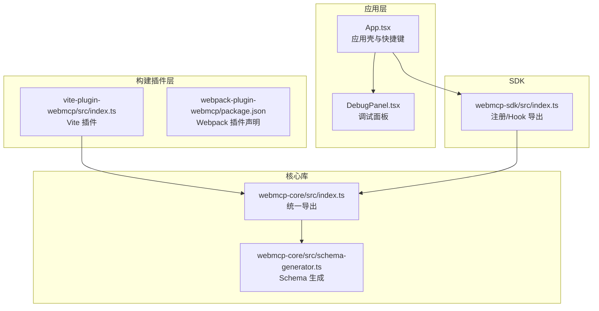
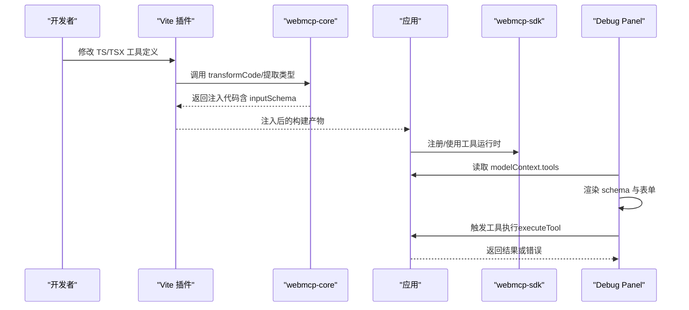
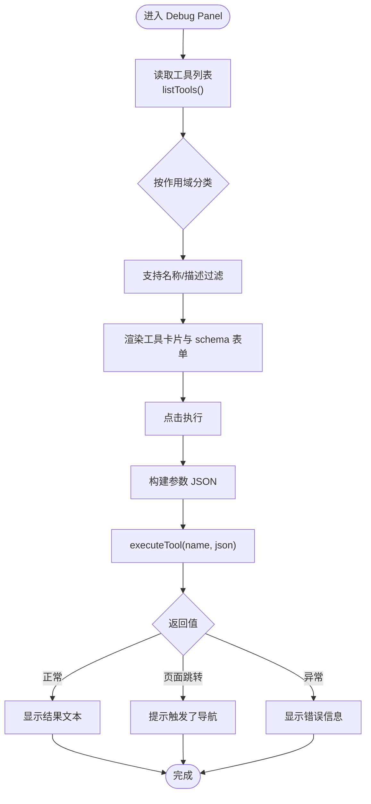
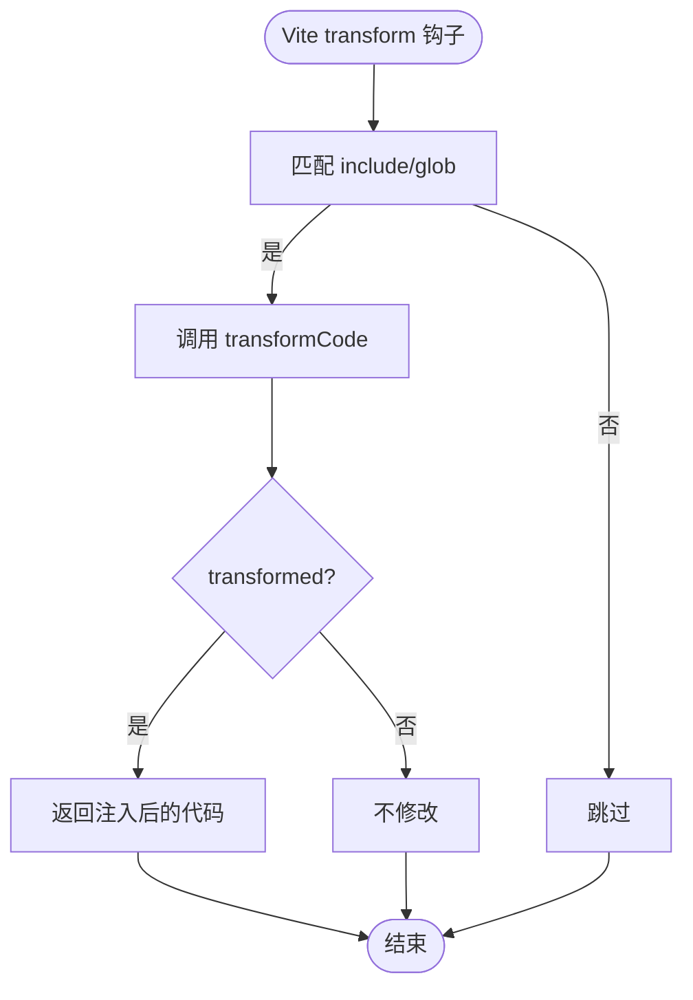
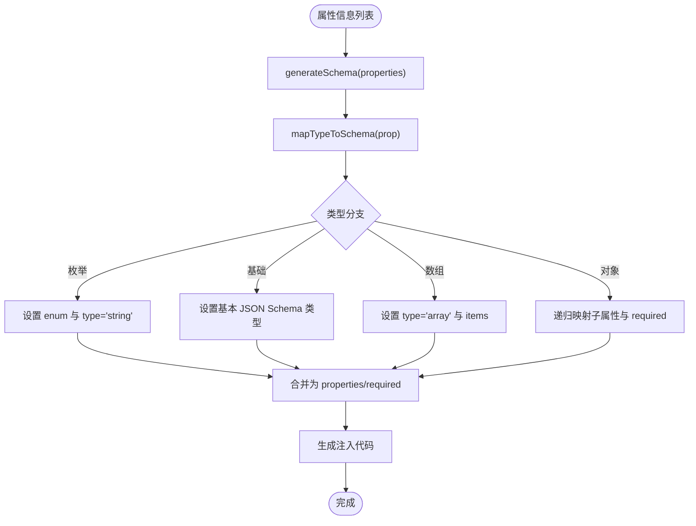
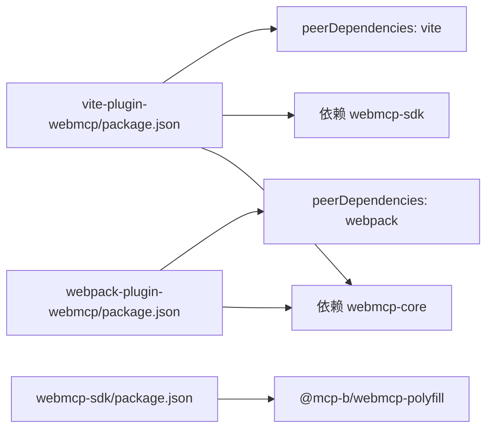

# 错误处理与调试

<cite>
**本文引用的文件**
- [apps/demo/src/components/DebugPanel.tsx](file://apps/demo/src/components/DebugPanel.tsx)
- [apps/demo/src/App.tsx](file://apps/demo/src/App.tsx)
- [packages/webmcp-core/src/schema-generator.ts](file://packages/webmcp-core/src/schema-generator.ts)
- [packages/webmcp-core/src/index.ts](file://packages/webmcp-core/src/index.ts)
- [packages/vite-plugin-webmcp/src/index.ts](file://packages/vite-plugin-webmcp/src/index.ts)
- [packages/webmcp-sdk/src/index.ts](file://packages/webmcp-sdk/src/index.ts)
- [packages/vite-plugin-webmcp/package.json](file://packages/vite-plugin-webmcp/package.json)
- [packages/webmcp-sdk/package.json](file://packages/webmcp-sdk/package.json)
- [packages/webmcp-core/package.json](file://packages/webmcp-core/package.json)
- [packages/webpack-plugin-webmcp/package.json](file://packages/webpack-plugin-webmcp/package.json)
</cite>

## 目录
1. [简介](#简介)
2. [项目结构](#项目结构)
3. [核心组件](#核心组件)
4. [架构总览](#架构总览)
5. [详细组件分析](#详细组件分析)
6. [依赖关系分析](#依赖关系分析)
7. [性能考量](#性能考量)
8. [故障排除指南](#故障排除指南)
9. [结论](#结论)
10. [附录](#附录)

## 简介
本章节面向使用 WebMCP Nexus 的开发者，系统性介绍错误处理与调试实践，重点覆盖以下方面：
- 使用 Debug Panel 查看已注册工具、参数 schema 与调用结果
- 常见错误的诊断与解决策略：类型推导失败、工具注册冲突、生命周期管理问题
- 开发环境下的 HMR 友好特性与热重载调试技巧
- 错误日志分析、性能问题诊断与生产环境故障排除

## 项目结构
WebMCP Nexus 采用多包工作区组织，核心能力由构建插件与 SDK 协作完成：
- 构建侧：Vite/Webpack 插件在构建期扫描 TS/TSX 文件，委托核心库进行类型提取与 JSON Schema 注入
- 运行侧：SDK 提供注册与消费工具的能力，Demo 应用内置 Debug Panel 用于实时调试工具

图表来源
- [apps/demo/src/App.tsx:1-98](file://apps/demo/src/App.tsx#L1-L98)
- [apps/demo/src/components/DebugPanel.tsx:1-480](file://apps/demo/src/components/DebugPanel.tsx#L1-L480)
- [packages/vite-plugin-webmcp/src/index.ts:1-102](file://packages/vite-plugin-webmcp/src/index.ts#L1-L102)
- [packages/webmcp-core/src/index.ts:1-11](file://packages/webmcp-core/src/index.ts#L1-L11)
- [packages/webmcp-core/src/schema-generator.ts:1-135](file://packages/webmcp-core/src/schema-generator.ts#L1-L135)
- [packages/webmcp-sdk/src/index.ts:1-5](file://packages/webmcp-sdk/src/index.ts#L1-L5)

章节来源
- [apps/demo/src/App.tsx:1-98](file://apps/demo/src/App.tsx#L1-L98)
- [packages/vite-plugin-webmcp/package.json:1-59](file://packages/vite-plugin-webmcp/package.json#L1-L59)
- [packages/webmcp-sdk/package.json:1-62](file://packages/webmcp-sdk/package.json#L1-L62)
- [packages/webmcp-core/package.json:1-56](file://packages/webmcp-core/package.json#L1-L56)
- [packages/webpack-plugin-webmcp/package.json:1-56](file://packages/webpack-plugin-webmcp/package.json#L1-L56)

## 核心组件
- Debug Panel：在运行时读取 modelContext 中的工具清单，渲染参数 schema 并支持在线调用，展示执行结果与错误信息。
- Vite 插件：在构建阶段扫描指定目录，委托核心库进行类型提取与 schema 注入，并对异常进行警告输出。
- Schema 生成器：将 TypeScript 属性信息映射为 JSON Schema，支持枚举、数组、对象、基础类型等。
- SDK：提供注册全局工具与 React Hook，便于在组件中消费工具。

章节来源
- [apps/demo/src/components/DebugPanel.tsx:1-480](file://apps/demo/src/components/DebugPanel.tsx#L1-L480)
- [packages/vite-plugin-webmcp/src/index.ts:1-102](file://packages/vite-plugin-webmcp/src/index.ts#L1-L102)
- [packages/webmcp-core/src/schema-generator.ts:1-135](file://packages/webmcp-core/src/schema-generator.ts#L1-L135)
- [packages/webmcp-sdk/src/index.ts:1-5](file://packages/webmcp-sdk/src/index.ts#L1-L5)

## 架构总览
下面以“工具注册与调试”为主线，展示从构建到运行的关键流程与交互点。

图表来源
- [packages/vite-plugin-webmcp/src/index.ts:78-97](file://packages/vite-plugin-webmcp/src/index.ts#L78-L97)
- [packages/webmcp-core/src/index.ts:1-11](file://packages/webmcp-core/src/index.ts#L1-L11)
- [apps/demo/src/components/DebugPanel.tsx:85-95](file://apps/demo/src/components/DebugPanel.tsx#L85-L95)

## 详细组件分析

### Debug Panel：工具清单、Schema 与调用流程
- 工具发现与分类
  - 通过 navigator.modelContext.listTools 获取工具列表，解析 description 判断作用域（全局/本地）。
  - 监听 toolchange 事件并去抖刷新，统计本次会话内的变更次数。
- 参数 schema 渲染
  - 支持枚举、布尔、数值、整数、数组、对象等类型，自动根据 JSON Schema 生成输入控件。
  - 必填字段校验与默认值提示。
- 执行与结果展示
  - 通过 navigator.modelContextTesting.executeTool 触发工具执行，捕获异常并显示错误信息。
  - 记录每次执行时间戳，区分运行中/成功/失败状态。

图表来源
- [apps/demo/src/components/DebugPanel.tsx:42-61](file://apps/demo/src/components/DebugPanel.tsx#L42-L61)
- [apps/demo/src/components/DebugPanel.tsx:117-138](file://apps/demo/src/components/DebugPanel.tsx#L117-L138)
- [apps/demo/src/components/DebugPanel.tsx:174-203](file://apps/demo/src/components/DebugPanel.tsx#L174-L203)
- [apps/demo/src/components/DebugPanel.tsx:205-235](file://apps/demo/src/components/DebugPanel.tsx#L205-L235)
- [apps/demo/src/components/DebugPanel.tsx:85-95](file://apps/demo/src/components/DebugPanel.tsx#L85-L95)

章节来源
- [apps/demo/src/components/DebugPanel.tsx:1-480](file://apps/demo/src/components/DebugPanel.tsx#L1-L480)
- [apps/demo/src/App.tsx:21-81](file://apps/demo/src/App.tsx#L21-L81)

### 构建期类型提取与 Schema 注入（Vite 插件）
- 扫描与过滤
  - 通过 include 配置与相对路径正则匹配决定是否处理文件。
- 类型提取与注入
  - 调用 transformCode 委托核心库，返回 transformed 且 code 更新时替换输出。
- 错误处理
  - try/catch 包裹 transform，捕获异常后通过 this.warn 输出，便于定位具体文件与错误信息。

图表来源
- [packages/vite-plugin-webmcp/src/index.ts:55-97](file://packages/vite-plugin-webmcp/src/index.ts#L55-L97)

章节来源
- [packages/vite-plugin-webmcp/src/index.ts:1-102](file://packages/vite-plugin-webmcp/src/index.ts#L1-L102)

### Schema 生成与类型映射
- 生成 JSON Schema
  - 依据属性信息逐项映射，支持枚举、数组元素类型、嵌套对象与必填字段集合。
- 注入代码生成
  - 生成 __webmcpSchema 对象（含 description、inputSchema、readOnly），并注入到目标表达式上。

图表来源
- [packages/webmcp-core/src/schema-generator.ts:28-53](file://packages/webmcp-core/src/schema-generator.ts#L28-L53)
- [packages/webmcp-core/src/schema-generator.ts:88-134](file://packages/webmcp-core/src/schema-generator.ts#L88-L134)
- [packages/webmcp-core/src/schema-generator.ts:69-86](file://packages/webmcp-core/src/schema-generator.ts#L69-L86)

章节来源
- [packages/webmcp-core/src/schema-generator.ts:1-135](file://packages/webmcp-core/src/schema-generator.ts#L1-L135)
- [packages/webmcp-core/src/index.ts:1-11](file://packages/webmcp-core/src/index.ts#L1-L11)

### SDK 与工具注册/消费
- 导出内容
  - registerGlobalTools：注册全局工具
  - useWebMcpTools：React Hook，用于在组件内消费工具
  - 类型定义：WebMcpToolFn、WebMcpToolSchema、WebMcpAnnotatedFn、WebMcpToolConfig
- 与 Debug Panel 的协作
  - Debug Panel 通过 navigator.modelContext 读取工具，通过 navigator.modelContextTesting 执行工具。

章节来源
- [packages/webmcp-sdk/src/index.ts:1-5](file://packages/webmcp-sdk/src/index.ts#L1-L5)
- [apps/demo/src/components/DebugPanel.tsx:42-61](file://apps/demo/src/components/DebugPanel.tsx#L42-L61)
- [apps/demo/src/components/DebugPanel.tsx:85-95](file://apps/demo/src/components/DebugPanel.tsx#L85-L95)

## 依赖关系分析
- Vite 插件依赖 webmcp-core 进行类型提取与注入；同时作为独立包发布，peerDependencies 指定 Vite 版本。
- Webpack 插件同样依赖 webmcp-core，作为 loader 形态存在。
- SDK 依赖 polyfill 以兼容浏览器端模型上下文协议。

图表来源
- [packages/vite-plugin-webmcp/package.json:1-59](file://packages/vite-plugin-webmcp/package.json#L1-L59)
- [packages/webpack-plugin-webmcp/package.json:1-56](file://packages/webpack-plugin-webmcp/package.json#L1-L56)
- [packages/webmcp-sdk/package.json:1-62](file://packages/webmcp-sdk/package.json#L1-L62)

章节来源
- [packages/vite-plugin-webmcp/package.json:1-59](file://packages/vite-plugin-webmcp/package.json#L1-L59)
- [packages/webpack-plugin-webmcp/package.json:1-56](file://packages/webpack-plugin-webmcp/package.json#L1-L56)
- [packages/webmcp-sdk/package.json:1-62](file://packages/webmcp-sdk/package.json#L1-L62)
- [packages/webmcp-core/package.json:1-56](file://packages/webmcp-core/package.json#L1-L56)

## 性能考量
- Debug Panel 的刷新策略
  - 定时轮询与事件驱动结合，使用去抖机制减少频繁重渲染与网络请求。
  - 仅在查询条件变化或工具数量变化时更新视图，避免不必要的计算。
- 构建期开销控制
  - 通过 include 精确限定扫描范围，避免对第三方库或无关文件进行处理。
  - 在 DEBUG 模式下输出少量日志，便于定位问题但不影响常规开发体验。

章节来源
- [apps/demo/src/components/DebugPanel.tsx:108-138](file://apps/demo/src/components/DebugPanel.tsx#L108-L138)
- [packages/vite-plugin-webmcp/src/index.ts:12-12](file://packages/vite-plugin-webmcp/src/index.ts#L12-L12)
- [packages/vite-plugin-webmcp/src/index.ts:55-72](file://packages/vite-plugin-webmcp/src/index.ts#L55-L72)

## 故障排除指南

### 1) Debug Panel 常见问题
- 无法看到任何工具
  - 检查 navigator.modelContext 是否可用，确认工具是否已通过 SDK 正确注册。
  - 若工具来自局部组件，确认其作用域描述是否包含“全局”标识，以便被正确分类。
- 参数表单无法渲染或报错
  - 检查 inputSchema 的 JSON 是否可解析；若为字符串形式，确保 JSON 合法。
  - 对于对象/数组类型，确认输入为合法 JSON 文本。
- 执行时报错
  - 捕获的错误信息会显示在对应工具的结果区域；根据错误提示修正参数或工具实现。
  - 若返回空结果，可能是工具触发了页面跳转，面板会提示相应信息。

章节来源
- [apps/demo/src/components/DebugPanel.tsx:42-61](file://apps/demo/src/components/DebugPanel.tsx#L42-L61)
- [apps/demo/src/components/DebugPanel.tsx:63-69](file://apps/demo/src/components/DebugPanel.tsx#L63-L69)
- [apps/demo/src/components/DebugPanel.tsx:85-95](file://apps/demo/src/components/DebugPanel.tsx#L85-L95)
- [apps/demo/src/components/DebugPanel.tsx:174-203](file://apps/demo/src/components/DebugPanel.tsx#L174-L203)
- [apps/demo/src/components/DebugPanel.tsx:205-235](file://apps/demo/src/components/DebugPanel.tsx#L205-L235)

### 2) 类型推导失败
- 现象
  - 构建阶段 transform 失败，Vite 插件输出警告，指出具体文件与错误信息。
- 排查步骤
  - 检查工具函数签名与注解是否符合预期；确认类型别名与导入路径正确。
  - 若使用自定义 alias，请在插件选项中显式传入，避免解析不到模块。
  - 在 DEBUG 模式下观察插件日志，定位到具体文件与错误堆栈。

章节来源
- [packages/vite-plugin-webmcp/src/index.ts:88-94](file://packages/vite-plugin-webmcp/src/index.ts#L88-L94)
- [packages/vite-plugin-webmcp/src/index.ts:12-12](file://packages/vite-plugin-webmcp/src/index.ts#L12-L12)
- [packages/vite-plugin-webmcp/src/index.ts:40-53](file://packages/vite-plugin-webmcp/src/index.ts#L40-L53)

### 3) 工具注册冲突
- 现象
  - 多处重复注册同名工具，导致行为不可预测或覆盖。
- 解决方案
  - 统一在应用启动阶段集中注册全局工具，避免重复调用。
  - 使用命名空间或前缀区分不同模块的工具，降低冲突概率。
  - 在 Debug Panel 中观察工具计数与作用域分布，及时发现异常。

章节来源
- [apps/demo/src/components/DebugPanel.tsx:117-138](file://apps/demo/src/components/DebugPanel.tsx#L117-L138)
- [apps/demo/src/components/DebugPanel.tsx:358-362](file://apps/demo/src/components/DebugPanel.tsx#L358-L362)

### 4) 生命周期管理问题
- 现象
  - 页面切换或组件卸载后，工具监听未清理，导致内存泄漏或事件重复绑定。
- 解决方案
  - 在组件卸载时移除事件监听（如 Debug Panel 已内置移除逻辑）。
  - 在路由切换时确保导航桥接正确发布/取消发布导航函数。

章节来源
- [apps/demo/src/components/DebugPanel.tsx:131-137](file://apps/demo/src/components/DebugPanel.tsx#L131-L137)
- [apps/demo/src/App.tsx:12-19](file://apps/demo/src/App.tsx#L12-L19)

### 5) 开发环境 HMR 友好特性与热重载调试
- HMR 与工具注册
  - 通过监听 toolchange 事件与定时刷新，配合去抖策略，使热重载后工具列表能及时更新。
- 快速迭代建议
  - 在工具函数签名或注释发生变更时，热重载应触发重新注入与刷新。
  - 使用快捷键快速开关 Debug Panel，便于在不同页面间对比工具差异。

章节来源
- [apps/demo/src/components/DebugPanel.tsx:117-138](file://apps/demo/src/components/DebugPanel.tsx#L117-L138)
- [apps/demo/src/App.tsx:25-34](file://apps/demo/src/App.tsx#L25-L34)

### 6) 错误日志分析
- 构建期日志
  - 通过 DEBUG=webmcp 控制台输出插件处理过程；遇到 transform 失败时，查看警告消息中的文件路径与错误摘要。
- 运行期日志
  - Debug Panel 的错误区域会显示工具执行异常；结合浏览器控制台与网络面板排查。

章节来源
- [packages/vite-plugin-webmcp/src/index.ts:74-94](file://packages/vite-plugin-webmcp/src/index.ts#L74-L94)
- [apps/demo/src/components/DebugPanel.tsx:224-234](file://apps/demo/src/components/DebugPanel.tsx#L224-L234)

### 7) 生产环境故障排除
- 确认构建产物中已注入 __webmcpSchema
  - 检查最终 JS 中是否存在 __webmcpSchema 赋值语句，确保 SDK 能读取到工具描述与参数 schema。
- 核对运行时上下文
  - 确保 navigator.modelContext 与 navigator.modelContextTesting 在目标浏览器环境中可用。
- 降级与回滚
  - 若问题集中在某次构建，回退到上一个稳定版本并逐步比对变更。

章节来源
- [packages/webmcp-core/src/schema-generator.ts:69-86](file://packages/webmcp-core/src/schema-generator.ts#L69-L86)
- [apps/demo/src/components/DebugPanel.tsx:42-61](file://apps/demo/src/components/DebugPanel.tsx#L42-L61)
- [apps/demo/src/components/DebugPanel.tsx:85-95](file://apps/demo/src/components/DebugPanel.tsx#L85-L95)

## 结论
通过 Debug Panel 的可视化调试、构建期的类型提取与注入、以及完善的错误处理与日志输出，WebMCP Nexus 在开发与生产环境下均提供了可靠的工具链支撑。遵循本文提供的排障流程与最佳实践，可显著提升工具开发效率与稳定性。

## 附录

### A. Debug Panel 使用要点
- 打开方式：应用顶部按钮或快捷键（⌘+\）。
- 工具筛选：支持按名称与描述过滤，查看全局/本地两类工具。
- 参数构造：根据 JSON Schema 自动生成输入控件，自动校验必填与类型。
- 执行与结果：点击执行后显示结果或错误；记录执行时间戳便于复盘。

章节来源
- [apps/demo/src/App.tsx:21-34](file://apps/demo/src/App.tsx#L21-L34)
- [apps/demo/src/components/DebugPanel.tsx:350-393](file://apps/demo/src/components/DebugPanel.tsx#L350-L393)
- [apps/demo/src/components/DebugPanel.tsx:286-346](file://apps/demo/src/components/DebugPanel.tsx#L286-L346)