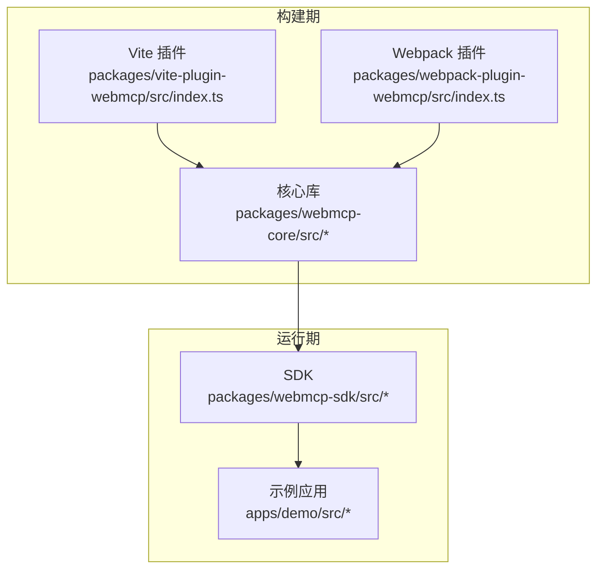
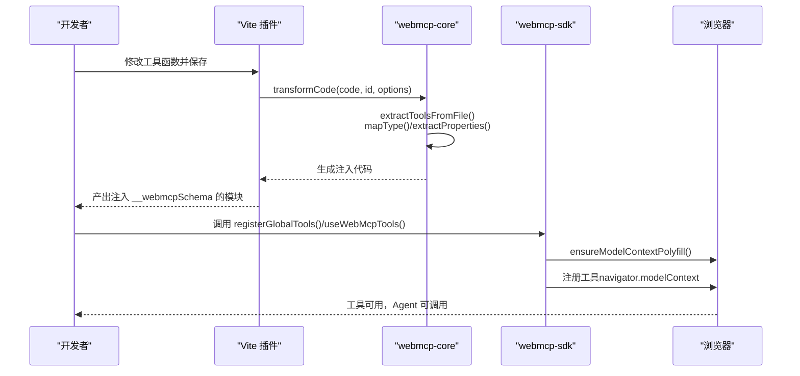
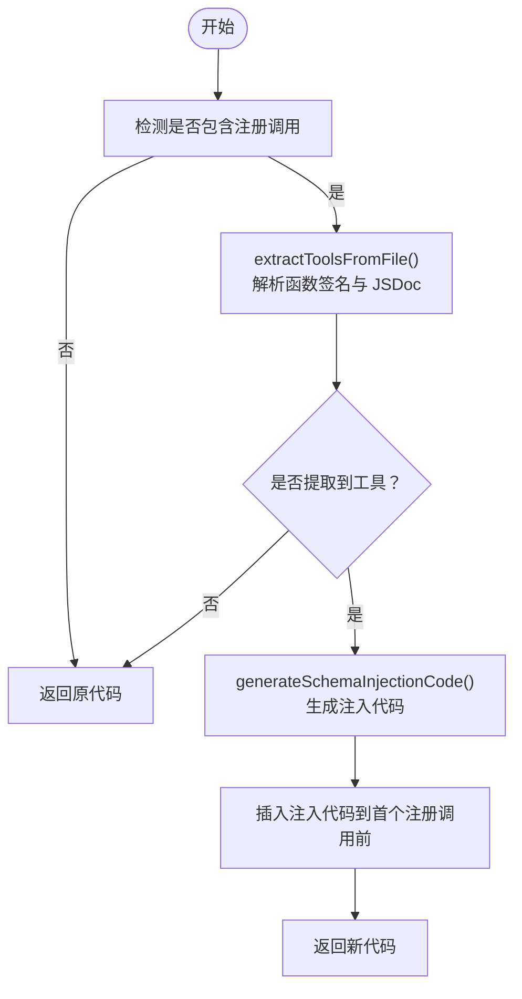
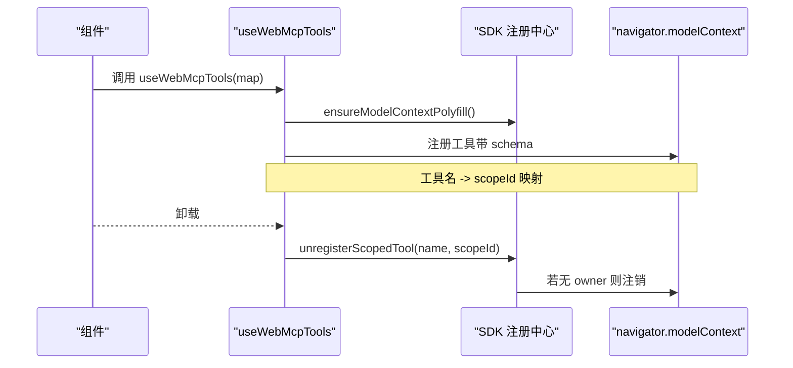
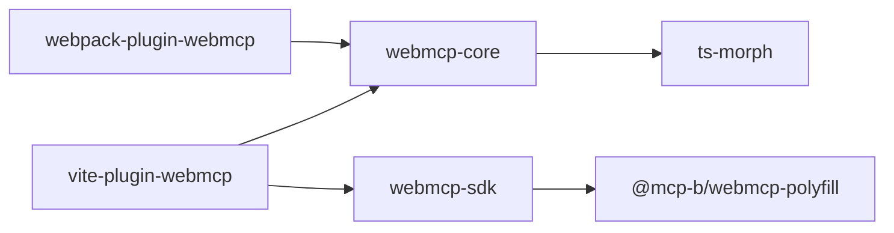

# 高级主题

<cite>
**本文引用的文件**
- [README.md](file://README.md)
- [package.json](file://package.json)
- [packages/webmcp-core/src/index.ts](file://packages/webmcp-core/src/index.ts)
- [packages/webmcp-core/src/transform.ts](file://packages/webmcp-core/src/transform.ts)
- [packages/webmcp-core/src/ts-extractor.ts](file://packages/webmcp-core/src/ts-extractor.ts)
- [packages/webmcp-core/src/schema-generator.ts](file://packages/webmcp-core/src/schema-generator.ts)
- [packages/webmcp-sdk/src/index.ts](file://packages/webmcp-sdk/src/index.ts)
- [packages/webmcp-sdk/src/registerGlobalTools.ts](file://packages/webmcp-sdk/src/registerGlobalTools.ts)
- [packages/webmcp-sdk/src/useWebMcpTools.ts](file://packages/webmcp-sdk/src/useWebMcpTools.ts)
- [packages/vite-plugin-webmcp/src/index.ts](file://packages/vite-plugin-webmcp/src/index.ts)
- [packages/webpack-plugin-webmcp/src/index.ts](file://packages/webpack-plugin-webmcp/src/index.ts)
- [apps/demo/src/main.tsx](file://apps/demo/src/main.tsx)
- [apps/demo/src/App.tsx](file://apps/demo/src/App.tsx)
- [apps/demo/src/components/DebugPanel.tsx](file://apps/demo/src/components/DebugPanel.tsx)
</cite>

## 目录
1. [简介](#简介)
2. [项目结构](#项目结构)
3. [核心组件](#核心组件)
4. [架构总览](#架构总览)
5. [详细组件分析](#详细组件分析)
6. [依赖关系分析](#依赖关系分析)
7. [性能考虑](#性能考虑)
8. [故障排查指南](#故障排查指南)
9. [结论](#结论)
10. [附录](#附录)

## 简介
本篇“高级主题”聚焦 WebMCP Nexus 的深度技术要点，覆盖以下方面：
- TypeScript 类型支持范围与限制
- 工具名冲突策略与作用域所有权注册机制
- 构建时优化、运行时性能监控与内存管理
- 错误处理与调试技巧（含 Debug Panel）
- 扩展开发（自定义构建插件与工具函数高级用法）
- 企业级部署与生产环境最佳实践

## 项目结构
WebMCP Nexus 采用 monorepo 结构，核心由四部分组成：
- webmcp-core：构建时类型抽取与 JSON Schema 生成的核心逻辑
- webmcp-sdk：运行时 SDK（两个 API + Polyfill）
- vite-plugin-webmcp：Vite 构建插件
- webpack-plugin-webmcp：Webpack 构建插件
- apps/demo：示例应用，演示全局/路由/组件三级注册与 Debug Panel

图表来源
- [packages/vite-plugin-webmcp/src/index.ts:1-102](file://packages/vite-plugin-webmcp/src/index.ts#L1-L102)
- [packages/webpack-plugin-webmcp/src/index.ts:1-3](file://packages/webpack-plugin-webmcp/src/index.ts#L1-L3)
- [packages/webmcp-core/src/index.ts:1-11](file://packages/webmcp-core/src/index.ts#L1-L11)
- [packages/webmcp-sdk/src/index.ts:1-5](file://packages/webmcp-sdk/src/index.ts#L1-L5)
- [apps/demo/src/main.tsx:1-15](file://apps/demo/src/main.tsx#L1-L15)

章节来源
- [README.md:76-89](file://README.md#L76-L89)
- [package.json:1-38](file://package.json#L1-L38)

## 核心组件
- 构建时核心（webmcp-core）
  - 类型抽取：基于 ts-morph 逆向追踪注册调用，解析函数签名与 JSDoc，提取工具元数据
  - Schema 生成：将属性信息映射为 JSON Schema，并生成注入代码
  - 统一变换入口：transformCode 将抽取与注入串联
- 构建插件（vite-plugin-webmcp / webpack-plugin-webmcp）
  - Vite：通过 transform hook 委托 core 完成注入
  - Webpack：提供 loader 与插件入口（具体实现位于插件内部）
- 运行时 SDK（webmcp-sdk）
  - registerGlobalTools：全局注册，应用启动时一次性完成
  - useWebMcpTools：React Hook，组件/路由级注册，随生命周期自动注销
  - Polyfill：自动加载内置 polyfill，保障浏览器兼容

章节来源
- [packages/webmcp-core/src/index.ts:1-11](file://packages/webmcp-core/src/index.ts#L1-L11)
- [packages/webmcp-core/src/transform.ts:1-79](file://packages/webmcp-core/src/transform.ts#L1-L79)
- [packages/webmcp-core/src/ts-extractor.ts:1-731](file://packages/webmcp-core/src/ts-extractor.ts#L1-L731)
- [packages/webmcp-core/src/schema-generator.ts:1-135](file://packages/webmcp-core/src/schema-generator.ts#L1-L135)
- [packages/webmcp-sdk/src/index.ts:1-5](file://packages/webmcp-sdk/src/index.ts#L1-L5)
- [packages/webmcp-sdk/src/registerGlobalTools.ts:1-68](file://packages/webmcp-sdk/src/registerGlobalTools.ts#L1-L68)
- [packages/webmcp-sdk/src/useWebMcpTools.ts:1-136](file://packages/webmcp-sdk/src/useWebMcpTools.ts#L1-L136)
- [packages/vite-plugin-webmcp/src/index.ts:1-102](file://packages/vite-plugin-webmcp/src/index.ts#L1-L102)
- [packages/webpack-plugin-webmcp/src/index.ts:1-3](file://packages/webpack-plugin-webmcp/src/index.ts#L1-L3)

## 架构总览
整体工作流分为“构建期”和“运行期”两大阶段：
- 构建期：插件在 transform 钩子中调用 core 的 transformCode，识别注册调用，抽取类型与 JSDoc，生成注入代码并写回模块
- 运行期：SDK 在浏览器环境中加载 polyfill，读取函数上的 __webmcpSchema 并向 navigator.modelContext 注册工具；组件生命周期结束时自动注销

图表来源
- [packages/vite-plugin-webmcp/src/index.ts:55-97](file://packages/vite-plugin-webmcp/src/index.ts#L55-L97)
- [packages/webmcp-core/src/transform.ts:31-79](file://packages/webmcp-core/src/transform.ts#L31-L79)
- [packages/webmcp-core/src/ts-extractor.ts:641-731](file://packages/webmcp-core/src/ts-extractor.ts#L641-L731)
- [packages/webmcp-sdk/src/registerGlobalTools.ts:26-68](file://packages/webmcp-sdk/src/registerGlobalTools.ts#L26-L68)
- [packages/webmcp-sdk/src/useWebMcpTools.ts:46-136](file://packages/webmcp-sdk/src/useWebMcpTools.ts#L46-L136)

## 详细组件分析

### TypeScript 类型支持范围与限制
- 已稳定支持
  - 基础类型：string / number / boolean
  - 字面量联合：'a'|'b'|'c' → enum
  - 可选属性：prop? → 不进入 required
  - 嵌套对象：≤ 3 层
- 不建议依赖
  - 泛型（Record、Partial、Pick 等）
  - 映射类型 / 条件类型
  - 超过 3 层的深度嵌套；对象数组中的对象元素 schema

建议
- 优先使用字面量联合表达枚举值
- 控制嵌套深度，避免复杂泛型与条件类型
- 通过 JSDoc 补充描述与 @readonly 标记，提升 Agent 理解度

章节来源
- [README.md:358-372](file://README.md#L358-L372)

### 工具名冲突策略与作用域所有权注册机制
- 冲突策略
  - 多个作用域注册同名工具时：控制台警告，仍允许注册，不阻断 UI 渲染
  - 注销时只清理当前作用域的注册，不影响其他作用域的同名工具
- 作用域所有权
  - SDK 内部维护 scope ownership registry，记录每个工具名的注册来源（scope + scopeId）
  - 组件级注册使用唯一 scopeId，卸载时仅注销自身，避免“幽灵工具”

最佳实践
- 使用语义化且唯一的工具名
- 避免在不同层级使用相同工具名
- 路由/组件级工具建议加上前缀区分

章节来源
- [README.md:349-357](file://README.md#L349-L357)
- [packages/webmcp-sdk/src/useWebMcpTools.ts:12-15](file://packages/webmcp-sdk/src/useWebMcpTools.ts#L12-L15)
- [packages/webmcp-sdk/src/useWebMcpTools.ts:118-134](file://packages/webmcp-sdk/src/useWebMcpTools.ts#L118-L134)

### 构建时类型抽取与 Schema 生成
- 类型抽取（ts-extractor）
  - 逆向追踪 registerGlobalTools/useWebMcpTools 调用，定位函数定义
  - 支持对象字面量与 namespace import 两种参数形式
  - 解析 JSDoc 描述与 @readonly 标签，提取参数属性与类型
  - 递归提取属性，最多 3 层嵌套
- Schema 生成（schema-generator）
  - 将属性信息映射为 JSON Schema
  - 生成注入代码，将 __webmcpSchema 写入函数对象
- 统一变换（transform）
  - 识别包含注册调用的文件
  - 生成注入代码并插入到首个注册调用之前

图表来源
- [packages/webmcp-core/src/transform.ts:31-79](file://packages/webmcp-core/src/transform.ts#L31-L79)
- [packages/webmcp-core/src/ts-extractor.ts:641-731](file://packages/webmcp-core/src/ts-extractor.ts#L641-L731)
- [packages/webmcp-core/src/schema-generator.ts:69-86](file://packages/webmcp-core/src/schema-generator.ts#L69-L86)

章节来源
- [packages/webmcp-core/src/ts-extractor.ts:1-731](file://packages/webmcp-core/src/ts-extractor.ts#L1-L731)
- [packages/webmcp-core/src/schema-generator.ts:1-135](file://packages/webmcp-core/src/schema-generator.ts#L1-L135)
- [packages/webmcp-core/src/transform.ts:1-79](file://packages/webmcp-core/src/transform.ts#L1-L79)

### 运行时注册与生命周期管理
- registerGlobalTools
  - 应用启动时调用，批量注册全局工具
  - 读取 __webmcpSchema 并向 navigator.modelContext 注册
- useWebMcpTools
  - React Hook，组件/路由级注册
  - 通过 useRef 持有最新函数引用，避免闭包陷阱
  - 组件卸载时自动注销，最后一个 owner 触发原生 abort
  - HMR 友好：监听 vite:afterUpdate，版本号递增触发重新注册

图表来源
- [packages/webmcp-sdk/src/useWebMcpTools.ts:46-136](file://packages/webmcp-sdk/src/useWebMcpTools.ts#L46-L136)
- [packages/webmcp-sdk/src/registerGlobalTools.ts:26-68](file://packages/webmcp-sdk/src/registerGlobalTools.ts#L26-L68)

章节来源
- [packages/webmcp-sdk/src/registerGlobalTools.ts:1-68](file://packages/webmcp-sdk/src/registerGlobalTools.ts#L1-L68)
- [packages/webmcp-sdk/src/useWebMcpTools.ts:1-136](file://packages/webmcp-sdk/src/useWebMcpTools.ts#L1-L136)

### Debug Panel 使用与问题诊断
- 功能概览
  - 实时列出已注册工具、参数 schema 与调用结果
  - 支持按作用域（全局/页面/组件）筛选
  - 提供表单校验与 JSON 构造，一键执行工具
- 诊断要点
  - 监听 toolchange 事件，观察注册/注销动态
  - 通过输入校验发现必填项缺失、类型不匹配等问题
  - 使用“执行”按钮验证工具行为与返回值

章节来源
- [apps/demo/src/components/DebugPanel.tsx:1-480](file://apps/demo/src/components/DebugPanel.tsx#L1-L480)
- [apps/demo/src/App.tsx:21-35](file://apps/demo/src/App.tsx#L21-L35)

### 扩展开发：自定义构建插件与工具函数高级用法
- 自定义构建插件
  - 基于 vite-plugin-webmcp 的 transform 钩子模式，委托 webmcp-core 的 transformCode
  - 可扩展 include/alias 等选项，满足复杂 monorepo 场景
- 工具函数高级用法
  - 使用 JSDoc 描述与 @readonly 标记，提升 Agent 理解
  - 保持函数签名简洁，避免深层嵌套与泛型
  - 在组件/路由挂载点使用 useWebMcpTools，实现按需注册与自动注销

章节来源
- [packages/vite-plugin-webmcp/src/index.ts:14-22](file://packages/vite-plugin-webmcp/src/index.ts#L14-L22)
- [packages/vite-plugin-webmcp/src/index.ts:55-97](file://packages/vite-plugin-webmcp/src/index.ts#L55-L97)
- [README.md:148-177](file://README.md#L148-L177)

## 依赖关系分析
- 包依赖
  - vite-plugin-webmcp 依赖 webmcp-nexus-core 与 webmcp-nexus-sdk
  - webmcp-core 依赖 ts-morph
  - webmcp-sdk 依赖 @mcp-b/webmcp-polyfill
  - webpack-plugin-webmcp 依赖 webmcp-nexus-core
- 运行时依赖
  - SDK 在浏览器端加载 polyfill，自动判断 navigator.modelContext 可用性

图表来源
- [packages/vite-plugin-webmcp/package.json:46-49](file://packages/vite-plugin-webmcp/package.json#L46-L49)
- [packages/webmcp-core/package.json:47-49](file://packages/webmcp-core/package.json#L47-L49)
- [packages/webmcp-sdk/package.json:46-48](file://packages/webmcp-sdk/package.json#L46-L48)
- [packages/webpack-plugin-webmcp/package.json:44-46](file://packages/webpack-plugin-webmcp/package.json#L44-L46)

章节来源
- [packages/vite-plugin-webmcp/package.json:1-59](file://packages/vite-plugin-webmcp/package.json#L1-L59)
- [packages/webmcp-core/package.json:1-56](file://packages/webmcp-core/package.json#L1-L56)
- [packages/webmcp-sdk/package.json:1-62](file://packages/webmcp-sdk/package.json#L1-L62)
- [packages/webpack-plugin-webmcp/package.json:1-56](file://packages/webpack-plugin-webmcp/package.json#L1-L56)

## 性能考虑
- 构建时优化
  - 仅对包含注册调用的文件进行处理，减少无关文件扫描
  - 通过 alias 合并与 vite 默认 alias 合并，提升模块解析效率
  - 仅在 HMR 后更新版本号触发 schema 重新注册，避免频繁重复注册
- 运行时性能
  - SDK 在入口处统一确保 polyfill 加载，避免重复判断
  - 注册/注销使用 scopeId 精准控制，避免全局扫描
  - 工具执行通过 __webmcpSchema 直接传递 JSON Schema，减少运行时计算
- 内存管理
  - 组件卸载时自动注销，防止“幽灵工具”占用内存
  - useRef 持有函数引用，避免闭包导致的引用滞留

章节来源
- [packages/vite-plugin-webmcp/src/index.ts:55-97](file://packages/vite-plugin-webmcp/src/index.ts#L55-L97)
- [packages/webmcp-sdk/src/useWebMcpTools.ts:12-15](file://packages/webmcp-sdk/src/useWebMcpTools.ts#L12-L15)
- [packages/webmcp-sdk/src/useWebMcpTools.ts:118-134](file://packages/webmcp-sdk/src/useWebMcpTools.ts#L118-L134)

## 故障排查指南
- 构建期问题
  - 未生成 __webmcpSchema：确认文件包含 registerGlobalTools/useWebMcpTools 调用；检查 include/alias 配置
  - 类型解析失败：避免使用不支持的泛型与条件类型；简化嵌套
- 运行期问题
  - 工具未出现在 navigator.modelContext：确认 SDK 已加载 polyfill；检查工具是否带有 __webmcpSchema
  - 工具名冲突：查看控制台警告；为不同作用域使用唯一工具名
- 调试技巧
  - 使用内置 Debug Panel：打开面板后可查看工具列表、schema 与调用结果
  - 通过 toolchange 事件观察注册/注销动态
  - 使用表单校验快速定位必填项与类型错误

章节来源
- [packages/vite-plugin-webmcp/src/index.ts:88-94](file://packages/vite-plugin-webmcp/src/index.ts#L88-L94)
- [packages/webmcp-sdk/src/registerGlobalTools.ts:26-68](file://packages/webmcp-sdk/src/registerGlobalTools.ts#L26-L68)
- [README.md:349-357](file://README.md#L349-L357)
- [apps/demo/src/components/DebugPanel.tsx:117-138](file://apps/demo/src/components/DebugPanel.tsx#L117-L138)

## 结论
WebMCP Nexus 通过“构建时类型抽取 + 运行时零侵入注册”的组合，实现了从函数签名到 JSON Schema 的自动化映射与工具暴露。其三级注册策略与作用域所有权机制有效避免了工具冲突与资源泄漏；内置 Debug Panel 与 polyfill 保障了开发体验与浏览器兼容性。遵循本文的类型支持范围、冲突策略与性能建议，可在企业级场景中获得稳定可靠的 AI Agent 驱动能力。

## 附录
- 示例应用入口与工具注册
  - 全局工具注册入口：apps/demo/src/main.tsx
  - 示例工具：apps/demo/src/tools/navigation.ts
  - 路由/组件级注册：apps/demo/src/pages/TasksPage.tsx

章节来源
- [apps/demo/src/main.tsx:1-15](file://apps/demo/src/main.tsx#L1-L15)
- [README.md:216-222](file://README.md#L216-L222)