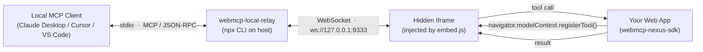

<div align="center">

# WebMCP Nexus

**A non-invasive frontend integration kit for the [WebMCP](https://webmcp.org) standard.**

Turn any React application into a target MCP clients can drive directly — in minutes.

[简体中文](./README.md) | **English**

[](https://www.npmjs.com/package/webmcp-nexus-sdk)
[](https://www.npmjs.com/package/vite-plugin-webmcp-nexus)
[](https://www.npmjs.com/package/webpack-plugin-webmcp-nexus)
[](./LICENSE)
[](#status)

[**🚀 Try the Live Demo →**](https://alibaba.github.io/webmcp-nexus/)

</div>

---

## Table of Contents

- [What is WebMCP Nexus](#what-is-webmcp-nexus)
- [Why WebMCP Nexus](#why-webmcp-nexus)
- [Highlights](#highlights)
- [Project Structure](#project-structure)
- [Quick Start](#quick-start)
- [Three-Tier Registration](#three-tier-registration)
- [Live Demo](#live-demo)
- [Driving Web Apps from Local Agents](#driving-web-apps-from-local-agents)
- [AI Coding Skill](#ai-coding-skill)
- [Browser Compatibility](#browser-compatibility)
- [Tool Name Collisions](#tool-name-collisions)
- [Supported TypeScript Types](#supported-typescript-types)
- [Tech Stack](#tech-stack)
- [Scripts](#scripts)
- [Status](#status)
- [Contributing](#contributing)
- [License](#license)

## What is WebMCP Nexus

[WebMCP](https://webmcp.org) is a W3C browser-standard proposal — jointly championed by Google and Microsoft — that lets a web page expose its own capabilities as MCP (Model Context Protocol) tools via `navigator.modelContext.registerTool()`. **WebMCP Nexus** is a production-ready frontend toolkit built around that standard:

- **Runtime SDK** — exposes only two APIs (`registerGlobalTools` / `useWebMcpTools`) that together cover global, route, and component lifecycles.
- **Build plugins** — first-class support for both Vite and Webpack. At build time, TypeScript types and JSDoc are statically analysed and compiled into JSON Schema; tool functions need no annotations or wrappers.
- **Polyfill integration** — modern browsers use the native API; everywhere else, the SDK entry point lazily loads the bundled polyfill, with zero impact on application code.
- **Agent Skill** — a built-in Skill for coding agents such as Claude Code and Cursor, reducing "generate a tool from this function" to a single natural-language instruction.

> In one sentence: write an ordinary TypeScript function, add a single JSDoc comment, and it becomes callable by any MCP client.

## Why WebMCP Nexus

| Dimension          | Common practice                                          | WebMCP Nexus                                                                                                              |
| ------------------ | -------------------------------------------------------- | ------------------------------------------------------------------------------------------------------------------------- |
| API surface        | Decorators, wrapper functions, explicit schema config    | **Two APIs** cover every case                                                                                             |
| Type contract      | Hand-written JSON Schema kept in sync with TS types      | Schema **inferred from TS types at build time** via `ts-morph` — a single source of truth                                 |
| Function intrusion | `defineApi` / `createTool` wrappers                      | **Non-invasive** — the function stays exactly as it was; existing call sites are untouched                                |
| Lifecycle          | Global registration only, manually managed               | **Three-tier scoping** (global / route / component) with automatic deregistration on unmount                              |
| Browser support    | Each call site handles availability checks               | SDK ships with a **lazily loaded polyfill** covering Chrome, Firefox, and Safari                                          |
| Desktop bridging   | Roll your own stdio / WebSocket bridge                   | Plug-and-play with [`@mcp-b/webmcp-local-relay`](https://www.npmjs.com/package/@mcp-b/webmcp-local-relay)                 |

## Highlights

- 🪶 **Minimal API** — `registerGlobalTools` + `useWebMcpTools`: graspable in 30 seconds, integrated in five minutes.
- 🔬 **Build-time type inference** — `ts-morph`-powered static analysis. Function signature = JSON Schema. Zero runtime overhead.
- 🔁 **HMR-friendly** — change a tool signature during development and its schema re-registers automatically; no manual reload.
- 🧩 **Three-tier scoping** — component-level tools follow the React lifecycle, keeping "ghost tools" out of the agent's context.
- 🛡️ **Collision-aware** — an internal scope ownership registry warns on duplicate names without aborting, and isolates teardown strictly per scope.
- 🌐 **Transparent cross-browser compatibility** — Chrome 146+ uses the native API; everywhere else, `@mcp-b/webmcp-polyfill` is activated automatically.
- 🤝 **First-class desktop agents** — via `@mcp-b/webmcp-local-relay`, local MCP clients like Claude Desktop, Cursor, and VS Code can drive your web app directly.
- 🧠 **Bundled AI coding Skill** — "convert this function into a WebMCP tool" becomes a single instruction for your coding agent.

## Project Structure

```
webmcp-nexus/
├── apps/
│   └── demo/                        # Reference app (Vite + Webpack dual build)
├── packages/
│   ├── webmcp-core/                 # Build-time core: TS type extraction + JSON Schema generation
│   ├── webmcp-sdk/                  # Runtime SDK (2 APIs + polyfill bootstrap)
│   ├── vite-plugin-webmcp/          # Vite plugin
│   └── webpack-plugin-webmcp/       # Webpack plugin
└── skill/
    └── SKILL.md                     # Onboarding Skill for AI coding agents
```

Packages published to the public npm registry:

| Package                                                                                    | Purpose                                |
| ------------------------------------------------------------------------------------------ | -------------------------------------- |
| [`webmcp-nexus-sdk`](https://www.npmjs.com/package/webmcp-nexus-sdk)                       | Runtime SDK                            |
| [`webmcp-nexus-core`](https://www.npmjs.com/package/webmcp-nexus-core)                     | Type extraction + Schema generation    |
| [`vite-plugin-webmcp-nexus`](https://www.npmjs.com/package/vite-plugin-webmcp-nexus)       | Vite build plugin                      |
| [`webpack-plugin-webmcp-nexus`](https://www.npmjs.com/package/webpack-plugin-webmcp-nexus) | Webpack build plugin                   |

## Quick Start

> Prerequisites: Node.js 18+. pnpm is recommended.

### 1. Install

```bash
pnpm add webmcp-nexus-sdk
pnpm add -D vite-plugin-webmcp-nexus     # or webpack-plugin-webmcp-nexus
```

### 2. Configure the build plugin

**Vite**

```ts
// vite.config.ts
import { defineConfig } from 'vite';
import react from '@vitejs/plugin-react';
import { vitePluginWebMcp } from 'vite-plugin-webmcp-nexus';

export default defineConfig({
  plugins: [
    react(),
    vitePluginWebMcp({ include: ['src/**/*.ts', 'src/**/*.tsx'] }),
  ],
});
```

**Webpack**

```ts
// webpack.config.ts
import { WebMcpPlugin } from 'webpack-plugin-webmcp-nexus';
import type { Configuration } from 'webpack';

const config: Configuration = {
  // ... entry / module / resolve / etc.
  plugins: [
    new WebMcpPlugin({ include: ['src'] }),
  ],
};

export default config;
```

Full dual-build examples live in [apps/demo/vite.config.ts](apps/demo/vite.config.ts) and [apps/demo/webpack.config.ts](apps/demo/webpack.config.ts).

### 3. Write an ordinary TS function

```ts
// src/tools/queries.ts
/**
 * Search tasks by keyword.
 * @readonly
 */
export async function searchTasks(params: {
  /** Search keyword */
  query: string;
  /** Maximum number of results (default 50) */
  limit?: number;
}): Promise<{ count: number; tasks: Task[] }> {
  // ... your original implementation — no wrapping required
}
```

### 4. Register

```ts
// src/main.tsx
import { registerGlobalTools } from 'webmcp-nexus-sdk';
import * as queries from './tools/queries';

registerGlobalTools(queries);
```

The build plugin derives a JSON Schema from `searchTasks`'s TS types and JSDoc and attaches it to the function as `__webmcpSchema`; the SDK reads that field at runtime and registers the tool against `navigator.modelContext`.

## Three-Tier Registration

| Tier      | API                     | Lifecycle                       | Use case                                          |
| --------- | ----------------------- | ------------------------------- | ------------------------------------------------- |
| Global    | `registerGlobalTools()` | Registered at app boot, never deregistered | Cross-cutting APIs (queries, auth, CRUD) |
| Route     | `useWebMcpTools()`      | Page mount / unmount            | Operations specific to the current route          |
| Component | `useWebMcpTools()`      | Component mount / unmount       | Modals, panels, and other local interactions      |

**Route / component-level registration example:**

```tsx
import { useWebMcpTools } from 'webmcp-nexus-sdk';

export default function TasksPage() {
  const { createTask, updateTask, deleteTask } = useTodoStore();

  useWebMcpTools({ createTask, updateTask, deleteTask });

  return /* … */;
}
```

Tools owned by the same scope are deregistered from `modelContext` on unmount, so **agents cannot call the wrong tool on the wrong page**.

## Live Demo

[`apps/demo`](apps/demo) is a complete Todo / project-management app that exercises every integration pattern: global query tools, component-level form tools, route-navigation tools, an HMR-aware debug panel, and more.

> 🌐 **Hosted preview**: <https://alibaba.github.io/webmcp-nexus/> (auto-deployed from `main` via GitHub Pages).

```bash
pnpm install
pnpm dev               # Vite demo at http://localhost:5173
pnpm dev:webpack       # Webpack demo at http://localhost:3001
```

Press <kbd>⌘</kbd> + <kbd>\\</kbd> in the running app to toggle the built-in **Debug Panel**, which lists every registered tool along with its parameter schema and last invocation result.

Key files to read:

- Global tool registration entry: [apps/demo/src/main.tsx](apps/demo/src/main.tsx)
- Global query tools: [apps/demo/src/tools/queries.ts](apps/demo/src/tools/queries.ts)
- Route navigation tool: [apps/demo/src/tools/navigation.ts](apps/demo/src/tools/navigation.ts)
- Page-level registration: [apps/demo/src/pages/TasksPage.tsx](apps/demo/src/pages/TasksPage.tsx)

## Driving Web Apps from Local Agents

With the official [`@mcp-b/webmcp-local-relay`](https://www.npmjs.com/package/@mcp-b/webmcp-local-relay), local MCP clients such as Claude Desktop, Cursor, and VS Code can **drive a web application running in your browser directly** — your app becomes the agent's hands.

### How it works



- `webmcp-local-relay` runs locally as an **stdio MCP server**, spawned by the desktop agent.
- It exposes a WebSocket endpoint on `localhost:9333`.
- The web app loads the relay's `embed.js`, which injects a hidden iframe; the iframe opens the WebSocket to the relay and continuously reports the tools registered on `navigator.modelContext` to the desktop agent.

### Integration steps

**1. Add the `embed.js` from `@mcp-b/webmcp-local-relay` to your page**

Add a single line to the app's entry HTML (e.g. [apps/demo/index.html](apps/demo/index.html)):

```html
<!-- index.html -->
<script src="https://cdn.jsdelivr.net/npm/@mcp-b/webmcp-local-relay@latest/dist/browser/embed.js"></script>
```


The script injects a hidden iframe, picks up every tool on `navigator.modelContext` (i.e. everything registered through the WebMCP Nexus SDK), and opens the WebSocket bridge to the local relay. **No changes to your application code or SDK usage are required.**

> Optional attributes: `data-relay-port="9444"` (default `9333`), `data-request-timeout="120000"` (default `60000` ms).

**2. Configure the relay in your MCP client**

For Claude Desktop, edit `claude_desktop_config.json`:

```json
{
  "mcpServers": {
    "webmcp-local-relay": {
      "command": "npx",
      "args": ["-y", "@mcp-b/webmcp-local-relay@latest"]
    }
  }
}
```

Cursor and VS Code use the same configuration block; only the file location differs.

**3. Start the web app and drive it from the agent**

```bash
pnpm dev      # any app that uses webmcp-nexus-sdk works
```

Restart Claude Desktop or Cursor, and a new session will surface the tools coming from your browser. For the bundled demo, try:

> "Show every task in the 'todo' state, sorted by due date ascending, then mark the first one as done."

The agent will call `listTasks` → `setTaskSort` → `setTaskStatus` in sequence, and you will see each step play out in the browser.

## AI Coding Skill

[`skill/SKILL.md`](skill/SKILL.md) is a Skill document purpose-built for AI coding agents. It covers:

- Hard constraints on tool-function signatures, JSDoc, and TS types (graded MUST / SHOULD / MAY);
- A **zero-risk refactor workflow** for turning existing functions into WebMCP tools: only signatures and comments change — business logic is never touched;
- Onboarding guidance for the SDK and the Vite / Webpack build plugins;
- Worked examples paired with anti-patterns.

### Installation

<details>
<summary><strong>Claude Code</strong></summary>

```bash
# Project-scoped (current repo only)
mkdir -p .claude/skills
cp skill/SKILL.md .claude/skills/webmcp-nexus.md

# User-scoped (all projects)
mkdir -p ~/.claude/skills
cp skill/SKILL.md ~/.claude/skills/webmcp-nexus.md
```

</details>

<details>
<summary><strong>Cursor</strong></summary>

```bash
mkdir -p .cursor/rules
cp skill/SKILL.md .cursor/rules/webmcp-nexus.mdc
```

Alternatively, paste the contents of `skill/SKILL.md` into Settings → Rules.

</details>

<details>
<summary><strong>Other AI IDEs (Qoder, Windsurf, etc.)</strong></summary>

Import `skill/SKILL.md` as a Rule / Context document in your IDE's AI settings. Trigger phrases live in the frontmatter `description` field, so any modern agent framework will load the Skill on demand.

</details>

### Usage example

> "Turn `createTask` in `apps/demo/src/store/TodoStore.tsx` into a WebMCP tool and register it on the tasks page."

The agent follows the workflow defined in the Skill: it fills in missing JSDoc, reshapes the parameters into the required object form, and adds the `useWebMcpTools` call at the right mount point — **without touching any business logic**.

## Browser Compatibility

| Environment                                            | Behaviour                                                                                                                          |
| ------------------------------------------------------ | ---------------------------------------------------------------------------------------------------------------------------------- |
| Chrome 146+                                            | Uses the native `navigator.modelContext`                                                                                           |
| Chrome <146 / Firefox / Safari / legacy Edge / others  | The SDK entry lazily loads the bundled [`@mcp-b/webmcp-polyfill`](https://www.npmjs.com/package/@mcp-b/webmcp-polyfill), transparently to the app |

## Tool Name Collisions

The SDK maintains an internal scope-ownership registry that tracks the origin (scope + scopeId) of every tool name:

- When multiple scopes register the same tool name, the SDK **logs a warning but still completes the registration** — UI rendering is never blocked.
- On teardown, only registrations owned by the current scope are removed; same-named tools owned by other scopes are untouched.

> **Best practice**: use semantically unique tool names and avoid duplicating names across tiers.

## Supported TypeScript Types

**Stably supported**

- Primitives (`string` / `number` / `boolean`)
- Literal unions (`'a' | 'b' | 'c'` → `enum`)
- Optional properties (`prop?` → excluded from `required`)
- Nested objects (up to 3 levels deep)

**Not recommended**

- Generics (`Record`, `Partial`, `Pick`, …)
- Mapped or conditional types
- Nesting deeper than 3 levels; per-element object schemas inside object arrays

## Tech Stack

- React 19 + TypeScript + Vite 8 / Webpack 5
- pnpm workspace monorepo
- Build-time type extraction powered by `ts-morph`
- Vitest as the test framework

## Scripts

```bash
pnpm install        # Install dependencies
pnpm dev            # Run the Vite demo
pnpm dev:webpack    # Run the Webpack demo
pnpm build          # Build every package
pnpm test           # Run every package's test suite
pnpm lint           # ESLint
pnpm format         # Prettier
```

## Status

WebMCP Nexus's core APIs (`registerGlobalTools` / `useWebMcpTools`) and build plugins are running stably in production applications. The underlying WebMCP standard itself is still progressing through W3C — we recommend tracking the upstream work alongside this project:

- The WebMCP standard: [webmcp.org](https://webmcp.org)
- Upstream runtime / polyfill: [`@mcp-b/webmcp-polyfill`](https://www.npmjs.com/package/@mcp-b/webmcp-polyfill)

## Contributing

Contributions via Issues and Pull Requests are warmly welcomed:

- 🐛 **Bug reports** — please include a minimal reproduction whenever possible.
- 💡 **Feature requests** — let's discuss the use case first, the API second.
- 🛠️ **Pull requests** — run `pnpm lint && pnpm test` before submitting, and keep each commit focused on a single change.

By submitting a PR you agree to license your contribution under the [MIT License](./LICENSE).

## License

[MIT](./LICENSE)
