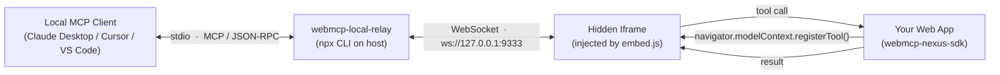

<div align="center">

# WebMCP Nexus

**面向 [WebMCP](https://webmcp.org) 标准的零侵入前端集成方案。**

让任何 React 应用在数分钟内成为 MCP 客户端可直接驱动的对象。

**简体中文** | [English](./README.en.md)

[](https://www.npmjs.com/package/webmcp-nexus-sdk)
[](https://www.npmjs.com/package/vite-plugin-webmcp-nexus)
[](https://www.npmjs.com/package/webpack-plugin-webmcp-nexus)
[](./LICENSE)
[](#项目状态)

[**🚀 在线体验 Demo →**](https://alibaba.github.io/webmcp-nexus/)

</div>

---

## 目录

- [项目简介](#项目简介)
- [为什么选择 WebMCP Nexus](#为什么选择-webmcp-nexus)
- [核心亮点](#核心亮点)
- [项目结构](#项目结构)
- [快速开始](#快速开始)
- [三级注册策略](#三级注册策略)
- [示例应用](#示例应用)
- [让本地 Agent 操作 Web 应用](#让本地-agent-操作-web-应用)
- [AI 编码 Skill](#ai-编码-skill)
- [浏览器兼容](#浏览器兼容)
- [工具名冲突策略](#工具名冲突策略)
- [TypeScript 类型支持范围](#typescript-类型支持范围)
- [技术栈](#技术栈)
- [开发脚本](#开发脚本)
- [项目状态](#项目状态)
- [参与贡献](#参与贡献)
- [许可证](#许可证)

## 项目简介

[WebMCP](https://webmcp.org) 是 W3C 浏览器标准提案（由 Google 与 Microsoft 联合推动），允许网页通过 `navigator.modelContext.registerTool()` 将自身能力暴露为 MCP（Model Context Protocol）客户端可调用的工具。**WebMCP Nexus** 是围绕该标准的一套生产可用的前端工程化方案：

- **运行时 SDK** —— 只导出 2 个 API（`registerGlobalTools` / `useWebMcpTools`），覆盖全局、路由、组件三种生命周期。
- **构建插件** —— Vite & Webpack 双适配；构建时静态分析 TypeScript 类型 + JSDoc，自动生成 JSON Schema，工具函数零标注、零包装。
- **Polyfill 集成** —— 高版本浏览器走原生 API；其他环境由 SDK 入口自动加载内置 polyfill，业务代码完全无感。
- **Agent Skill** —— 内置面向 Claude Code、Cursor 等编码 Agent 的 Skill 文档，把"为函数生成工具"变成一句话指令。

> 一句话：写一个普通的 TypeScript 函数，加一行 JSDoc，它就能被任意 MCP 客户端调用。

## 为什么选择 WebMCP Nexus

| 维度       | 业内常见做法                         | WebMCP Nexus                                                                                       |
| ---------- | ------------------------------------ | -------------------------------------------------------------------------------------------------- |
| API 表面   | 装饰器 / 包装函数 / 显式 schema 配置 | **2 个 API** 覆盖全部场景                                                                          |
| 类型契约   | 手写 JSON Schema 与 TS 类型双源维护  | 构建时基于 `ts-morph` **从 TS 类型反推**，单一事实源                                               |
| 函数侵入度 | `defineApi` / `createTool` 等包装    | **零侵入**——函数保持原样，原有调用方完全无感                                                      |
| 生命周期   | 仅全局注册，需手动管理               | 全局 / 路由 / 组件 **三级作用域**，组件卸载自动注销                                                |
| 浏览器兼容 | 调用方自行判断 + 兜底                | SDK 内置 polyfill **惰性加载**，Chrome / Firefox / Safari 全覆盖                                   |
| 桌面接入   | 自行实现 stdio / WebSocket 桥接      | 与 [`@mcp-b/webmcp-local-relay`](https://www.npmjs.com/package/@mcp-b/webmcp-local-relay) 即插即用 |

## 核心亮点

- 🪶 **极简 API** —— `registerGlobalTools` + `useWebMcpTools`，30 秒看懂、5 分钟接入。
- 🔬 **构建时类型反推** —— 基于 `ts-morph` 静态分析，函数签名 = JSON Schema，无运行时开销。
- 🔁 **HMR 友好** —— 开发阶段修改函数签名，工具 schema 自动重新注册，无需手动刷新。
- 🧩 **三级作用域** —— 组件级工具随 React 生命周期挂载 / 卸载，杜绝"幽灵工具"污染上下文。
- 🛡️ **冲突感知** —— 内部 scope ownership registry，多 scope 同名注册时只警告不中断，注销严格隔离。
- 🌐 **跨浏览器透明兼容** —— Chrome 146+ 走原生；其他环境自动启用 `@mcp-b/webmcp-polyfill`。
- 🤝 **桌面 Agent 直连** —— 通过 `@mcp-b/webmcp-local-relay`，Claude Desktop / Cursor / VS Code 等本地 MCP 客户端可直接驱动 Web 应用。
- 🧠 **AI 编码 Skill 内置** —— "为现有函数生成 WebMCP 工具"成为编码 Agent 的一句话指令。

## 项目结构

```
webmcp-nexus/
├── apps/
│   └── demo/                        # 最佳实践示例（Vite + Webpack 双构建）
├── packages/
│   ├── webmcp-core/                 # 构建时核心：TS 类型抽取 + JSON Schema 生成
│   ├── webmcp-sdk/                  # 运行时 SDK（2 个 API + Polyfill）
│   ├── vite-plugin-webmcp/          # Vite 插件
│   └── webpack-plugin-webmcp/       # Webpack 插件
└── skill/
    └── SKILL.md                     # 面向 AI 编码 Agent 的接入 Skill
```

发布到 npm 公网 registry 的包：

| 包                                                                                         | 用途                       |
| ------------------------------------------------------------------------------------------ | -------------------------- |
| [`webmcp-nexus-sdk`](https://www.npmjs.com/package/webmcp-nexus-sdk)                       | 运行时 SDK                 |
| [`webmcp-nexus-core`](https://www.npmjs.com/package/webmcp-nexus-core)                     | 类型抽取 + Schema 生成内核 |
| [`vite-plugin-webmcp-nexus`](https://www.npmjs.com/package/vite-plugin-webmcp-nexus)       | Vite 构建插件              |
| [`webpack-plugin-webmcp-nexus`](https://www.npmjs.com/package/webpack-plugin-webmcp-nexus) | Webpack 构建插件           |

## 快速开始

> 前置条件：Node.js 18+，推荐 pnpm。

### 1. 安装

```bash
pnpm add webmcp-nexus-sdk
pnpm add -D vite-plugin-webmcp-nexus     # 或 webpack-plugin-webmcp-nexus
```

### 2. 配置构建插件

**Vite**

```ts
// vite.config.ts
import { defineConfig } from 'vite';
import react from '@vitejs/plugin-react';
import { vitePluginWebMcp } from 'vite-plugin-webmcp-nexus';

export default defineConfig({
  plugins: [
    react(),
    vitePluginWebMcp({ include: ['src/**/*.ts', 'src/**/*.tsx'] }),
  ],
});
```

**Webpack**

```ts
// webpack.config.ts
import { WebMcpPlugin } from 'webpack-plugin-webmcp-nexus';
import type { Configuration } from 'webpack';

const config: Configuration = {
  // ... entry / module / resolve 等常规配置
  plugins: [
    new WebMcpPlugin({ include: ['src'] }),
  ],
};

export default config;
```

完整双构建示例参见 [apps/demo/vite.config.ts](apps/demo/vite.config.ts) 与 [apps/demo/webpack.config.ts](apps/demo/webpack.config.ts)。

### 3. 编写一个普通的 TS 函数

```ts
// src/tools/queries.ts
/**
 * 根据关键词搜索任务。
 * @readonly
 */
export async function searchTasks(params: {
  /** 搜索关键词 */
  query: string;
  /** 返回数量上限（默认 50） */
  limit?: number;
}): Promise<{ count: number; tasks: Task[] }> {
  // ... 你原本的业务实现，不需要任何包装
}
```

### 4. 注册

```ts
// src/main.tsx
import { registerGlobalTools } from 'webmcp-nexus-sdk';
import * as queries from './tools/queries';

registerGlobalTools(queries);
```

构建插件会自动从 `searchTasks` 的 TS 类型 + JSDoc 反推出 JSON Schema，并通过 `__webmcpSchema` 字段注入到函数对象上；SDK 在运行时读取该字段向 `navigator.modelContext` 完成注册。

## 三级注册策略

| 级别 | API                     | 生命周期               | 适用场景                     |
| ---- | ----------------------- | ---------------------- | ---------------------------- |
| 全局 | `registerGlobalTools()` | 应用启动注册，永不注销 | 通用 API（查询、认证、CRUD） |
| 路由 | `useWebMcpTools()`      | 页面 mount / unmount   | 当前路由独占的操作           |
| 组件 | `useWebMcpTools()`      | 组件 mount / unmount   | 弹窗、面板等局部交互         |

**路由 / 组件级注册示例：**

```tsx
import { useWebMcpTools } from 'webmcp-nexus-sdk';

export default function TasksPage() {
  const { createTask, updateTask, deleteTask } = useTodoStore();

  useWebMcpTools({ createTask, updateTask, deleteTask });

  return /* … */;
}
```

组件卸载时同名工具自动从 `modelContext` 注销，**避免 Agent 在错误的页面调用错误的工具**。

## 示例应用

仓库内 [`apps/demo`](apps/demo) 是一个完整的 Todo / 项目管理应用，演示了所有典型集成模式：全局查询工具、组件级表单工具、路由跳转工具、HMR 调试面板等。

> 🌐 **在线预览**：<https://alibaba.github.io/webmcp-nexus/> （由 GitHub Pages 自动部署，跟随 `main` 分支更新）

```bash
pnpm install
pnpm dev               # 启动 Vite demo（http://localhost:5173）
pnpm dev:webpack       # 启动 Webpack demo（http://localhost:3001）
```

打开应用后按 <kbd>⌘</kbd> + <kbd>\\</kbd> 唤起内置 **Debug Panel**，可实时查看已注册的工具、参数 schema 与调用结果。

关键代码索引：

- 全局工具注册入口：[apps/demo/src/main.tsx](apps/demo/src/main.tsx)
- 全局查询工具集：[apps/demo/src/tools/queries.ts](apps/demo/src/tools/queries.ts)
- 路由跳转工具：[apps/demo/src/tools/navigation.ts](apps/demo/src/tools/navigation.ts)
- 页面级工具注册：[apps/demo/src/pages/TasksPage.tsx](apps/demo/src/pages/TasksPage.tsx)

## 让本地 Agent 操作 Web 应用

借助官方 [`@mcp-b/webmcp-local-relay`](https://www.npmjs.com/package/@mcp-b/webmcp-local-relay)，Claude Desktop、Cursor、VS Code 等本地 MCP 客户端可以**直接调用浏览器中正在运行的 Web 应用**——你的应用就此成为 Agent 的"双手"。

### 工作原理



- `webmcp-local-relay` 在本机以 **stdio MCP server** 形式运行，由桌面 Agent 拉起；
- 同时它在 `localhost:9333` 暴露一个 WebSocket 端点；
- Web 应用通过加载 relay 提供的 `embed.js`，在页面注入一个隐藏 iframe，由该 iframe 与 relay 建立 WebSocket 连接，并把 `navigator.modelContext` 上注册的全部工具实时上报给桌面 Agent。

### 接入步骤

**1. 在页面中引入 `@mcp-b/webmcp-local-relay` 的 `embed.js`**

在 Web 应用的入口 HTML（如 [apps/demo/index.html](apps/demo/index.html)）追加一行：

```html
<!-- index.html -->
<script src="https://cdn.jsdelivr.net/npm/@mcp-b/webmcp-local-relay@latest/dist/browser/embed.js"></script>
```


该脚本会自动注入隐藏 iframe，扫描 `navigator.modelContext`（即 WebMCP Nexus SDK 注册的全部工具）并建立到本机 relay 的 WebSocket 通道。**业务代码与 SDK 调用方式完全无需改动**。

> 可选属性：`data-relay-port="9444"` 指定端口（默认 9333）、`data-request-timeout="120000"` 调整请求超时（默认 60000ms）。

**2. 在 MCP 客户端中配置 relay**

以 Claude Desktop 为例，编辑 `claude_desktop_config.json`：

```json
{
  "mcpServers": {
    "webmcp-local-relay": {
      "command": "npx",
      "args": ["-y", "@mcp-b/webmcp-local-relay@latest"]
    }
  }
}
```

Cursor、VS Code 的 MCP 配置方式相同，差异仅在配置文件位置。

**3. 启动 Web 应用并在 Agent 端驱动**

```bash
pnpm dev      # 任何接入了 webmcp-nexus-sdk 的应用即可
```

重启 Claude Desktop / Cursor，新会话中即可看到来自浏览器的工具。例如对 demo 应用说：

> "把所有 todo 状态的任务按截止日期升序展示，然后把第一条标记为已完成。"

Agent 会依次调用 `listTasks` → `setTaskSort` → `setTaskStatus`，并在浏览器中可视化地完成全部操作。

## AI 编码 Skill

仓库 [`skill/SKILL.md`](skill/SKILL.md) 是一份为 AI 编码 Agent 量身打造的 Skill 文档，覆盖：

- 工具函数签名、JSDoc、TS 类型的硬性约束（MUST / SHOULD / MAY 三级）；
- **零风险改造流程**：把现有业务函数改造为 WebMCP 工具时，只动签名与注释，不动业务逻辑；
- SDK 与 Vite / Webpack 构建插件的接入引导；
- 真实场景的正反对照示例。

### 安装

<details>
<summary><strong>Claude Code</strong></summary>

```bash
# 项目级（仅当前仓库生效）
mkdir -p .claude/skills
cp skill/SKILL.md .claude/skills/webmcp-nexus.md

# 用户级（所有项目生效）
mkdir -p ~/.claude/skills
cp skill/SKILL.md ~/.claude/skills/webmcp-nexus.md
```

</details>

<details>
<summary><strong>Cursor</strong></summary>

```bash
mkdir -p .cursor/rules
cp skill/SKILL.md .cursor/rules/webmcp-nexus.mdc
```

或在 Settings → Rules 中粘贴 `skill/SKILL.md` 的全部内容。

</details>

<details>
<summary><strong>其他 AI IDE（Qoder / Windsurf 等）</strong></summary>

将 `skill/SKILL.md` 作为 Rule / Context 文档导入到 IDE 的 AI 配置中即可。所有触发词均已写入 frontmatter 的 `description` 字段，主流 Agent 框架可自动按需加载。

</details>

### 使用示例

> "把 `apps/demo/src/store/TodoStore.tsx` 里的 `createTask` 改造成 WebMCP 工具，注册到任务列表页。"

Agent 会按 Skill 中规定的流程，自动补齐 JSDoc、调整参数为对象形态、在对应组件挂载点调用 `useWebMcpTools`，且**不修改任何业务逻辑**。

## 浏览器兼容

| 环境                                                | 行为                                                                                                              |
| --------------------------------------------------- | ----------------------------------------------------------------------------------------------------------------- |
| Chrome 146+                                         | 使用原生 `navigator.modelContext`                                                                                 |
| Chrome <146 / Firefox / Safari / Edge legacy 等环境 | SDK 入口自动加载内置 [`@mcp-b/webmcp-polyfill`](https://www.npmjs.com/package/@mcp-b/webmcp-polyfill)，对业务透明 |

## 工具名冲突策略

SDK 内部维护 scope ownership registry，记录每个工具名的注册来源（scope + scopeId）：

- 多个 scope 注册同名工具时：控制台输出警告，**但仍允许注册**，不阻断 UI 渲染；
- 注销时只清理自己 scope 的注册，不影响其他作用域的同名工具。

> **最佳实践**：使用语义化的唯一工具名，不同层级避免同名冲突。

## TypeScript 类型支持范围

**已稳定支持**

- 基础类型（`string` / `number` / `boolean`）
- 字面量联合（`'a' | 'b' | 'c'` → `enum`）
- 可选属性（`prop?` → 不进入 `required`）
- 嵌套对象（≤ 3 层）

**不建议依赖**

- 泛型（`Record`、`Partial`、`Pick` 等）
- 映射类型 / 条件类型
- 超过 3 层的深度嵌套；对象数组中的对象元素 schema

## 技术栈

- React 19 + TypeScript + Vite 8 / Webpack 5
- pnpm workspace monorepo
- `ts-morph` 驱动的构建时类型抽取
- Vitest 测试框架

## 开发脚本

```bash
pnpm install        # 安装依赖
pnpm dev            # 启动 Vite demo
pnpm dev:webpack    # 启动 Webpack demo
pnpm build          # 构建所有包
pnpm test           # 运行全部包的测试
pnpm lint           # ESLint
pnpm format         # Prettier
```

## 项目状态

WebMCP Nexus 的核心 API（`registerGlobalTools` / `useWebMcpTools`）与构建插件已在生产应用中稳定运行。底层 WebMCP 标准本身仍在 W3C 推进中，建议同步关注上游进展：

- WebMCP 标准：[webmcp.org](https://webmcp.org)
- 上游运行时 / Polyfill：[`@mcp-b/webmcp-polyfill`](https://www.npmjs.com/package/@mcp-b/webmcp-polyfill)

## 参与贡献

欢迎通过 Issue 与 Pull Request 参与项目：

- 🐛 **Bug Reports** —— 请尽量附带最小复现仓库；
- 💡 **Feature Requests** —— 优先讨论使用场景，再讨论 API；
- 🛠️ **Pull Requests** —— 提交前请运行 `pnpm lint && pnpm test`，并保持每个 commit 聚焦单一变更。

提交 PR 即视为同意以 [MIT License](./LICENSE) 授权你的贡献。

## 许可证

[MIT](./LICENSE)
